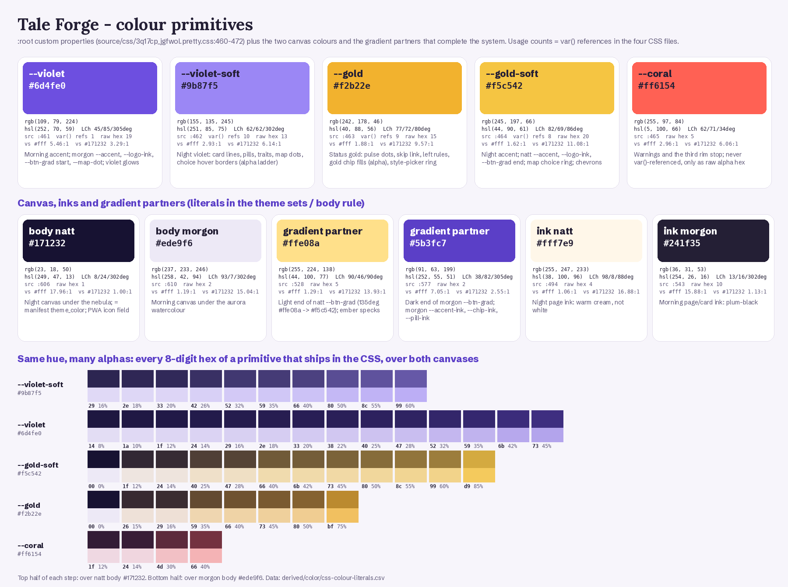
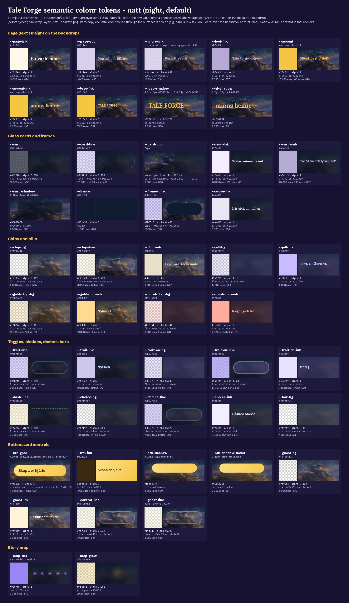
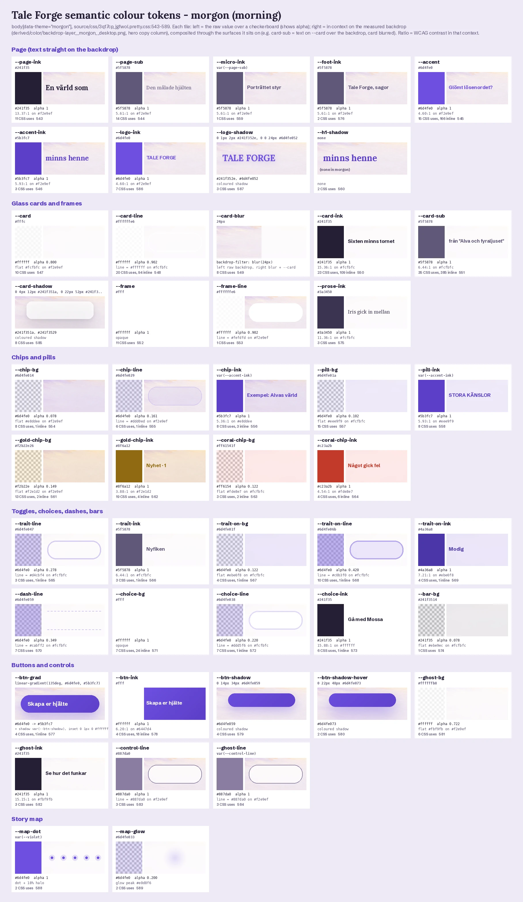
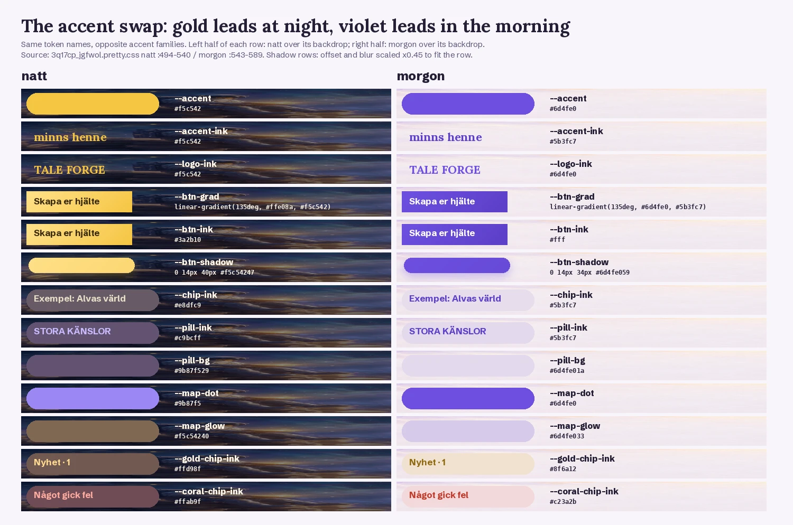
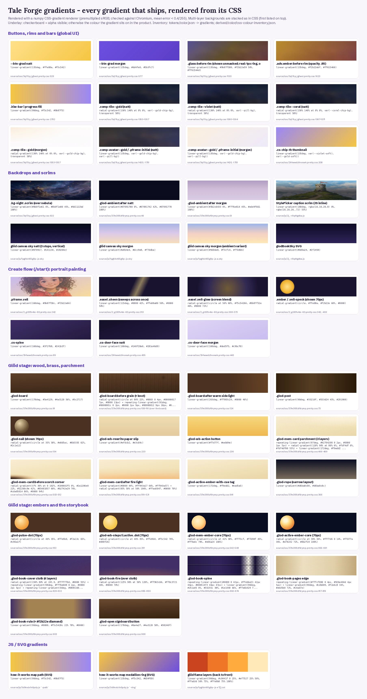
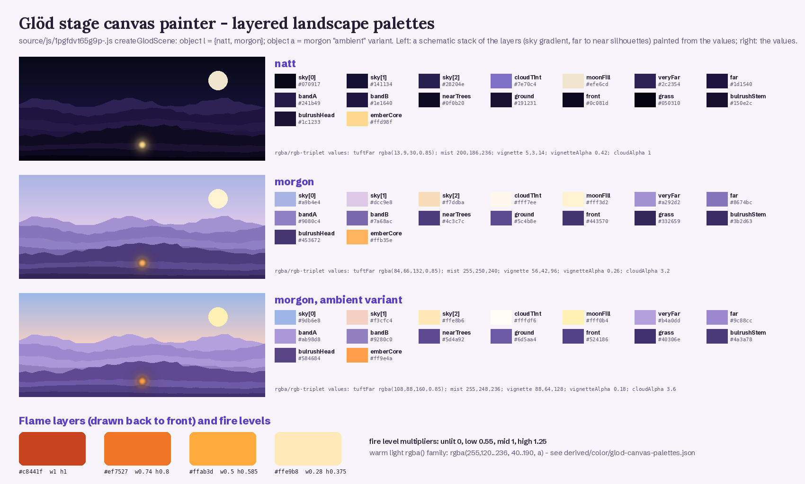
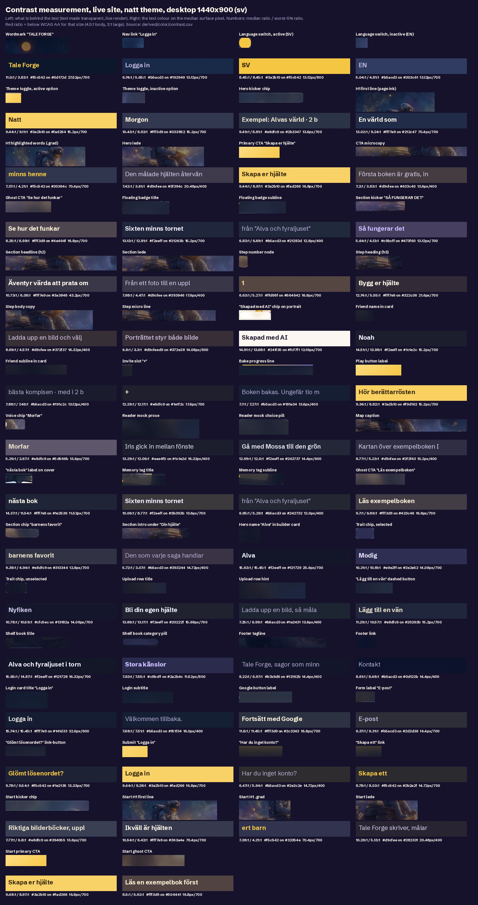
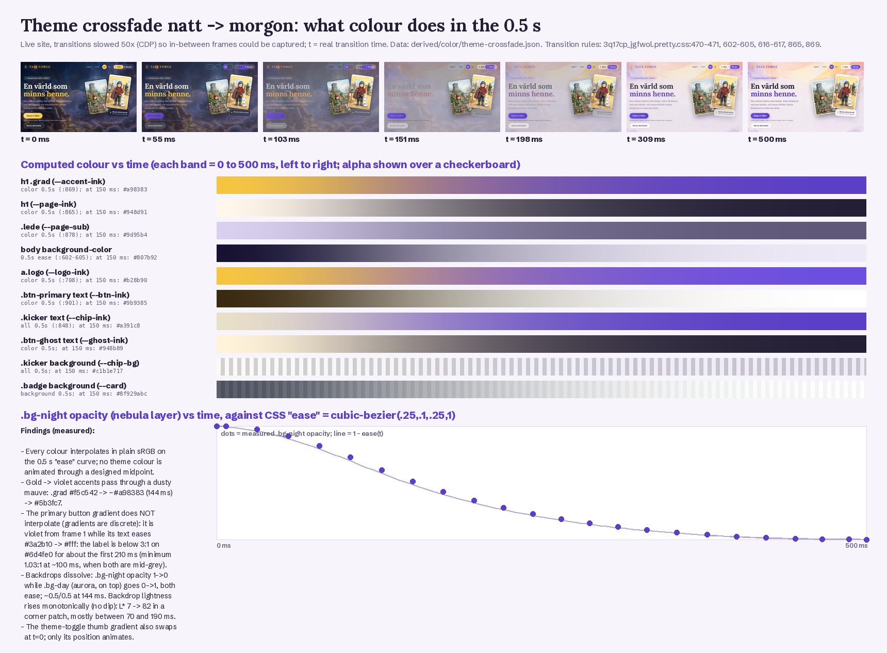
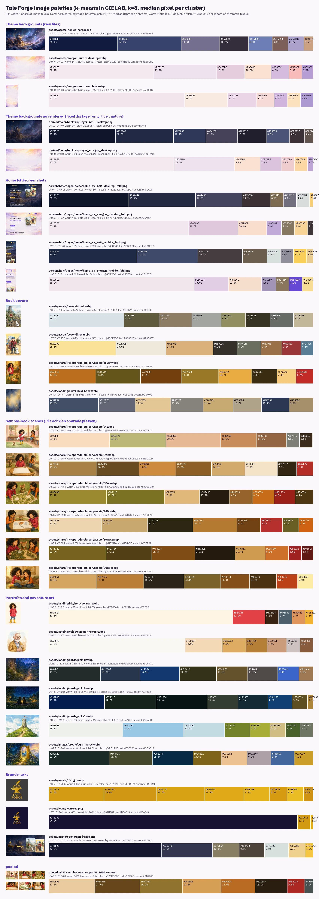
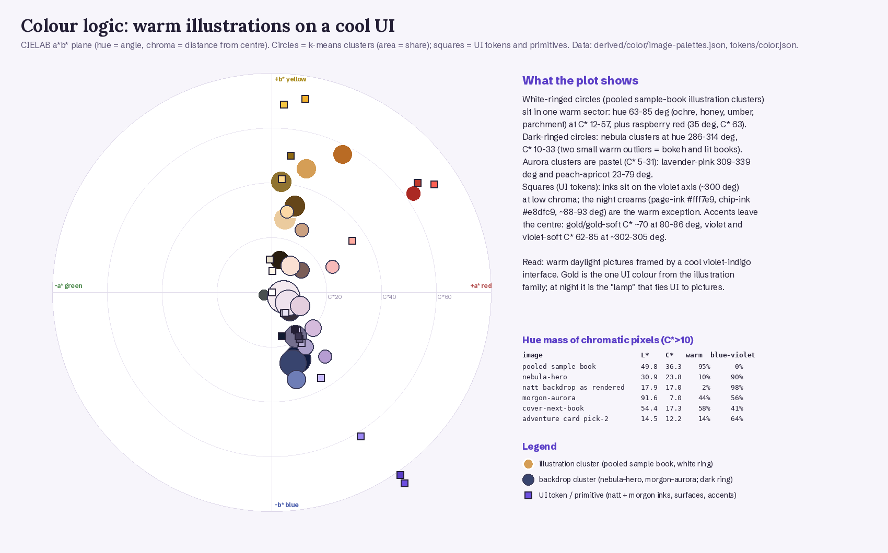

# Tale Forge: Colour

Tale Forge runs on two complete colour themes that swap the same token names. **natt** (night, the default) pairs a deep indigo nebula photo with warm cream ink and a candle-gold accent. **morgon** (morning) pairs a pale lavender-and-peach watercolour with plum-black ink and a violet accent.
Most surfaces are translucent: 240 of the 393 hex literals that ship carry an alpha channel. Glass cards, chips and lines are tinted veils over a fixed backdrop image, not flat fills.
The picture books follow a separate colour rule. Measured across all 15 sample-book images, 95% of chromatic pixels are warm (ochre, honey, umber, raspberry), and none fall in the blue-violet hues. The night interface is 98% blue-violet. Gold is the one colour the UI shares with the illustrations.
Everything below is either copied from the shipped CSS and JS, with line numbers, or measured from the live site and the harvested rasters. Interpretation is marked **Read:**.

## Contents

1. [The palette on one page](#1-the-palette-on-one-page)
2. [Where the colours live: selectors, layers, switching](#2-where-the-colours-live-selectors-layers-switching)
3. [Every semantic token, both themes](#3-every-semantic-token-both-themes)
4. [The page backdrop: nebula night, watercolour morning](#4-the-page-backdrop-nebula-night-watercolour-morning)
5. [The gold and violet accent swap](#5-the-gold-and-violet-accent-swap)
6. [Alpha everywhere: the 8-digit hex pattern](#6-alpha-everywhere-the-8-digit-hex-pattern)
7. [Gradients (and why `.grad` is not one)](#7-gradients-and-why-grad-is-not-one)
8. [Coloured light: shadows and glows](#8-coloured-light-shadows-and-glows)
9. [Route palettes: the create flow and the glöd hearth stage](#9-route-palettes-the-create-flow-and-the-glöd-hearth-stage)
10. [Colour in JavaScript](#10-colour-in-javascript)
11. [Raw literal inventory](#11-raw-literal-inventory)
12. [What actually renders: computed-style census](#12-what-actually-renders-computed-style-census)
13. [Contrast (WCAG), measured on the live site](#13-contrast-wcag-measured-on-the-live-site)
14. [The theme crossfade, frame by frame](#14-the-theme-crossfade-frame-by-frame)
15. [Image palettes (k-means, CIELAB, k=8)](#15-image-palettes-k-means-cielab-k8)
16. [Illustration colour versus UI colour](#16-illustration-colour-versus-ui-colour)
17. [Character and intent](#17-character-and-intent)
18. [Reproducing it: recipes for film and emulation](#18-reproducing-it-recipes-for-film-and-emulation)
19. [Files produced for this dimension](#19-files-produced-for-this-dimension)
20. [Caveats and open questions](#20-caveats-and-open-questions)

---

## 1. The palette on one page

| Role | natt (night, default) | morgon (morning) | Source |
|---|---|---|---|
| Canvas (`body` background) | `#171232` deep indigo | `#ede9f6` pale lavender | [3q17cp_jgfwol.pretty.css:606, :610](../source/css/3q17cp_jgfwol.pretty.css) |
| Backdrop plate (fixed, full viewport) | [nebula-hero.webp](../assets/assets/nebula-hero.webp) + dark scrim + 6 star dots; rendered median `#262a41` | [morgon-aurora-desktop.webp](../assets/assets/morgon-aurora-desktop.webp) (mobile: [-mobile](../assets/assets/morgon-aurora-mobile.webp)); rendered median `#f1e4eb` | :612-676; [backdrop-layer__natt__desktop.webp](../derived/color/backdrop-layer__natt__desktop.webp), [__morgon__](../derived/color/backdrop-layer__morgon__desktop.webp) |
| Page ink (headlines) | `#fff7e9` warm cream | `#241f35` plum-black | `--page-ink` :494 / :543 |
| Secondary ink (ledes, body copy) | `#d9cfee` lilac-grey | `#5f5878` dusk violet-grey | `--page-sub` :495 / :544 |
| Accent (links, focus, drop caps, logo) | `#f5c542` gold-soft | `#6d4fe0` violet | `--accent` :496 / :545 |
| Accent as text (`h1 .grad`) | `#f5c542` | `#5b3fc7` (a deeper violet) | `--accent-ink` :497 / :546 |
| Glass card | `#0f1628ad` navy at 68% + 22px blur | `#fffc` white at 80% + 24px blur | `--card` :498 / :547 |
| Card hairline | `#9b87f542` violet-soft at 26% | `#ffffffe6` white at 90% | `--card-line` :499 / :548 |
| Primary button | `linear-gradient(135deg, #ffe08a, #f5c542)` + gold glow | `linear-gradient(135deg, #6d4fe0, #5b3fc7)` + violet glow | `--btn-grad` :528 / :577 |
| Button ink | `#3a2b10` dark umber | `#fff` | `--btn-ink` :529 / :578 |
| Status/markers (both themes) | `--gold` `#f2b22e` dots, rules; `--gold-soft` stars, map rings | same | :463-464 |
| Errors | `--coral-chip-ink` `#ffab9f` on `#ff615424` | `#c23a2b` on `#ff61541f` | :514-515 / :563-564 |

The five primitives (`:root`, [3q17cp_jgfwol.pretty.css:460-472](../source/css/3q17cp_jgfwol.pretty.css)):

| Primitive | Hex | LCh(ab) L / C / h | var() refs | Role |
|---|---|---|---|---|
| `--violet` | `#6d4fe0` | 45 / 85 / 305° | 1 | morning accent, violet glows |
| `--violet-soft` | `#9b87f5` | 62 / 62 / 302° | 10 | night structure colour (lines, pills, traits, map dots), the alpha-ladder base |
| `--gold` | `#f2b22e` | 77 / 72 / 80° | 9 | status gold: pulse dots, skip link, left rules |
| `--gold-soft` | `#f5c542` | 82 / 69 / 86° | 8 | night accent, logo, button end stop |
| `--coral` | `#ff6154` | 62 / 71 / 33° | 0 | defined but never `var()`-referenced; appears only as raw alpha hex |



*[derived/color/primitives.png](../derived/color/primitives.png): the 5 primitives with rgb, HSL, LCh, WCAG ratio against white and against `#171232`, and `var()`/raw-hex usage counts. Also: the canvas, ink and gradient-partner colours, and every alpha step of each primitive that ships, shown over both canvases.*

---

## 2. Where the colours live: selectors, layers, switching

### 2.1 Three layers

1. **Primitives** live on `:root` ([3q17cp_jgfwol.pretty.css:460-472](../source/css/3q17cp_jgfwol.pretty.css)): five colours plus `--theme-transition-duration: 0.5s` and `--theme-transition-easing: ease`.
2. **Theme sets** are scoped to the `body` element, not to `:root` or `html`:
   - `body[data-theme="natt"]` at [3q17cp_jgfwol.pretty.css:493-541](../source/css/3q17cp_jgfwol.pretty.css) (47 custom properties, lines 494-540)
   - `body[data-theme="morgon"]` at [3q17cp_jgfwol.pretty.css:542-590](../source/css/3q17cp_jgfwol.pretty.css) (47 custom properties, lines 543-589)
   - Both sets declare **the same 47 names in the same order** (checked programmatically). Types per theme: 40 colours, 5 shadows, 1 gradient, 1 length (`--card-blur`).
   - The canvas colour sits outside the sets: `body { background: #171232 }` (:606) and `body[data-theme="morgon"] { background: #ede9f6 }` (:609-611).
3. **Raw literals.** The three route stylesheets ([2h1wwdz1nvxwk](../source/css/2h1wwdz1nvxwk.pretty.css), [37m388zf6rymp](../source/css/37m388zf6rymp.pretty.css), [2_gt301v4m-60](../source/css/2_gt301v4m-60.pretty.css)) **define no custom properties at all**. They consume the theme tokens and add 253 raw hex occurrences of their own. Most of these (221) belong to the glöd hearth stage ([section 9](#9-route-palettes-the-create-flow-and-the-glöd-hearth-stage)). The global sheet adds 49 raw hex occurrences outside the token blocks.

**Census.** All four files together hold **109 custom-property definitions**, every one of them in [3q17cp_jgfwol.pretty.css](../source/css/3q17cp_jgfwol.pretty.css) ([css-custom-properties.csv](../derived/color/css-custom-properties.csv) lists each with scope selector and line):

| Scope selector | Count | Content |
|---|---|---|
| `:root` | 11 | 5 colour primitives, 4 font stacks (`--display`, `--ui`, `--serif`, `--wordmark`), 2 transition settings |
| `body[data-theme="natt"]` | 47 | night theme set |
| `body[data-theme="morgon"]` | 47 | morning theme set |
| `.cinzel_…__variable`, `.lora_…__variable`, `.source_serif_4_…__variable`, `.schibsted_grotesk_…__variable` | 4 | next/font family variables (`--font-cinzel` etc.), no colour |

Reference hygiene (from [css-custom-properties.csv](../derived/color/css-custom-properties.csv) and a scan of `var()` in CSS, JS and HTML):

- `--coral` is defined but never referenced.
- `--violet` is referenced once: morgon `--map-dot: var(--violet)` (:588).
- `--field-bg` and `--field-line` are referenced with fallbacks but never defined: `.start-flow .field { background: var(--field-bg, var(--chip-bg)); border: 2px solid var(--field-line, var(--card-line)) }` ([2_gt301v4m-60.pretty.css:65-66](../source/css/2_gt301v4m-60.pretty.css)). The fallbacks always win.
- Particle variables (`--s --d --x --y --vl --vs --vd`) are set inline from JS ([2_gt301v4m-60.pretty.css:338-402](../source/css/2_gt301v4m-60.pretty.css)). They carry no colour.

### 2.2 How the theme is chosen and switched

- The server HTML always ships `<body data-theme="natt">` (every file in [source/html/](../source/html/)). An inline script, the first child of `<body>`, applies the saved choice before first paint:
  `(function(){try{var t=localStorage.getItem('tf-theme');if(t==='natt'||t==='morgon'){document.body.dataset.theme=t;}}catch(e){}})();` ([source/html/home.sv.html](../source/html/home.sv.html))
- There is **no `prefers-color-scheme`** query anywhere in the CSS or HTML. The OS dark/light setting is ignored, and night is the default for everyone.
- The PWA manifest locks the browser chrome to night: `"background_color":"#171232","theme_color":"#171232"` ([source/meta/manifest.webmanifest](../source/meta/manifest.webmanifest)). There is no `<meta name="theme-color">` in the HTML.
- Switching is a 0.5 s `ease` crossfade on `body` colour and background (:602-605) and on the backdrop layers' opacity (:616-617). Most components also carry their own `transition: color .5s` / `background .5s`. Measured frame by frame in [section 14](#14-the-theme-crossfade-frame-by-frame).
- The toggle (`.tt`, :768-826) is itself built from the tokens. The track uses `--ghost-bg`/`--control-line`. The sliding thumb uses `--btn-grad` + `--btn-shadow`, so it is gold at night and violet in the morning. The active label uses `--btn-ink` (:818-821).

### 2.3 Verbatim: the token blocks

`:root` ([3q17cp_jgfwol.pretty.css:460-472](../source/css/3q17cp_jgfwol.pretty.css)):

```css
:root {
  --violet: #6d4fe0;
  --violet-soft: #9b87f5;
  --gold: #f2b22e;
  --gold-soft: #f5c542;
  --coral: #ff6154;
  --display: var(--font-lora), Georgia, serif;
  --ui: var(--font-schibsted), "Segoe UI", system-ui, sans-serif;
  --serif: var(--font-source-serif), Georgia, serif;
  --wordmark: var(--font-cinzel), "Playfair Display", Georgia, serif;
  --theme-transition-duration: 0.5s;
  --theme-transition-easing: ease;
}
```

`body[data-theme="natt"]` ([3q17cp_jgfwol.pretty.css:493-541](../source/css/3q17cp_jgfwol.pretty.css)):

```css
body[data-theme="natt"] {
  --page-ink: #fff7e9;
  --page-sub: #d9cfee;
  --accent: var(--gold-soft);
  --accent-ink: var(--gold-soft);
  --card: #0f1628ad;
  --card-line: #9b87f542;
  --card-blur: 22px;
  --card-ink: #f2eeff;
  --card-sub: #b5acd3;
  --frame: #101a30;
  --frame-line: #9b87f566;
  --chip-bg: #fff9ec1a;
  --chip-line: #fff3d942;
  --chip-ink: #e8dfc9;
  --pill-bg: #9b87f529;
  --pill-ink: #c9bcff;
  --micro-ink: color-mix(in srgb, var(--page-sub) 85%, transparent);
  --h1-shadow: 0 2px 30px #0c082859;
  --gold-chip-bg: #f2b22e29;
  --gold-chip-ink: #ffd98f;
  --coral-chip-bg: #ff615424;
  --coral-chip-ink: #ffab9f;
  --trait-line: #9b87f559;
  --trait-ink: #cfc5ec;
  --trait-on-bg: #9b87f533;
  --trait-on-line: #9b87f599;
  --trait-on-ink: #e9e2ff;
  --dash-line: #ffecbe59;
  --choice-bg: #ffffff0f;
  --choice-line: #9b87f552;
  --choice-ink: #f2eeff;
  --bar-bg: #ffffff24;
  --prose-ink: #eae4f5;
  --foot-ink: #b7a9d6;
  --btn-grad: linear-gradient(135deg, #ffe08a, #f5c542);
  --btn-ink: #3a2b10;
  --btn-shadow: 0 14px 40px #f5c54247;
  --btn-shadow-hover: 0 20px 55px #f5c5426b;
  --ghost-bg: #fff9ec1a;
  --ghost-ink: #fff3d9;
  --control-line: #fff3d952;
  --ghost-line: var(--control-line);
  --card-shadow: 0 18px 44px #0508146b;
  --logo-ink: #f5c542;
  --logo-shadow: 0 2px 6px #050814cc, 0 0 34px #f5c54273;
  --map-dot: var(--violet-soft);
  --map-glow: #f5c54240;
}
```

`body[data-theme="morgon"]` ([3q17cp_jgfwol.pretty.css:542-590](../source/css/3q17cp_jgfwol.pretty.css)):

```css
body[data-theme="morgon"] {
  --page-ink: #241f35;
  --page-sub: #5f5878;
  --accent: #6d4fe0;
  --accent-ink: #5b3fc7;
  --card: #fffc;
  --card-line: #ffffffe6;
  --card-blur: 24px;
  --card-ink: #241f35;
  --card-sub: #5f5878;
  --frame: #fff;
  --frame-line: #ffffffe6;
  --chip-bg: #6d4fe014;
  --chip-line: #6d4fe029;
  --chip-ink: var(--accent-ink);
  --pill-bg: #6d4fe01a;
  --pill-ink: var(--accent-ink);
  --micro-ink: var(--page-sub);
  --h1-shadow: none;
  --gold-chip-bg: #f2b22e26;
  --gold-chip-ink: #8f6a12;
  --coral-chip-bg: #ff61541f;
  --coral-chip-ink: #c23a2b;
  --trait-line: #6d4fe047;
  --trait-ink: #5f5878;
  --trait-on-bg: #6d4fe01f;
  --trait-on-line: #6d4fe06b;
  --trait-on-ink: #4a36a8;
  --dash-line: #6d4fe059;
  --choice-bg: #fff;
  --choice-line: #6d4fe038;
  --choice-ink: #241f35;
  --bar-bg: #241f3514;
  --prose-ink: #3a3450;
  --foot-ink: #5f5878;
  --btn-grad: linear-gradient(135deg, #6d4fe0, #5b3fc7);
  --btn-ink: #fff;
  --btn-shadow: 0 14px 34px #6d4fe059;
  --btn-shadow-hover: 0 22px 48px #6d4fe073;
  --ghost-bg: #ffffffb8;
  --ghost-ink: #241f35;
  --control-line: #887da0;
  --ghost-line: var(--control-line);
  --card-shadow: 0 4px 12px #241f351a, 0 22px 52px #241f3529;
  --logo-ink: #6d4fe0;
  --logo-shadow: 0 1px 2px #241f352e, 0 0 24px #6d4fe052;
  --map-dot: var(--violet);
  --map-glow: #6d4fe033;
}
```

A copy-pasteable version with both themes, named raw literals, opaque "flat" equivalents and the measured illustration palette is in [tokens/color.css](../tokens/color.css). The machine-readable version, with every token's consumers, roles and composites, is in [tokens/color.json](../tokens/color.json).

---

## 3. Every semantic token, both themes

Columns give the raw value, the resolved value when it is a `var()`, the alpha, and the opaque "flat" equivalent for translucent tokens. The flat value is composited (straight alpha, sRGB) over the measured median of the rendered backdrop: natt `#262a41`, morgon `#f1e4eb`. The `[:NNN]` numbers are lines in [3q17cp_jgfwol.pretty.css](../source/css/3q17cp_jgfwol.pretty.css). The full consumer lists (every selector and property that reads each token) are in [tokens/color.json](../tokens/color.json) under `semantic.<theme>.<token>.css_consumers`.

| Token | natt value | morgon value | Role (where used) |
|---|---|---|---|
| `--page-ink` | `#fff7e9` [:494] | `#241f35` [:543] | Primary text straight on the page backdrop: h1, h2, step h3, section headlines; also body `color`. |
| `--page-sub` | `#d9cfee` [:495] | `#5f5878` [:544] | Secondary text on the backdrop: hero lede, section intros/ledes, step copy, captions, CTA microcopy, map labels. |
| `--accent` | `var(--gold-soft)` = `#f5c542` [:496] | `#6d4fe0` [:545] | Interactive accent: focus outlines, drop caps, links, active language pill, upload/friend hover borders, field focus border. Gold in natt, violet in morgon. |
| `--accent-ink` | `var(--gold-soft)` = `#f5c542` [:497] | `#5b3fc7` [:546] | Accent used AS TEXT: the highlighted words in h1 (`h1 .grad`). Same as --accent in natt; a darker violet (#5b3fc7) in morgon for legibility. |
| `--card` | `#0f1628ad` (α 0.68; flat `#161c30`) [:498] | `#fffc` (α 0.80; flat `#fcfafb`) [:547] | Glass card fill (translucent, with backdrop blur): .glass, .badge, .book, memory tag, create-customize, cs-chip, figcaptions. |
| `--card-line` | `#9b87f542` (α 0.26; flat `#444270`) [:499] | `#ffffffe6` (α 0.90; flat `#fefcfd`) [:548] | Hairline on glass cards; also footer rule, legal divider, create-customize section dividers, inline separators. |
| `--card-blur` | `22px` [:500] | `24px` [:549] | Backdrop-filter blur radius for glass (not a colour, but it decides how the backdrop colours mix into the card). |
| `--card-ink` | `#f2eeff` [:501] | `#241f35` [:550] | Primary text on cards. |
| `--card-sub` | `#b5acd3` [:502] | `#5f5878` [:551] | Secondary text on cards; also nav links, inactive language button, footer links/meta, form labels, placeholders. |
| `--frame` | `#101a30` [:503] | `#fff` [:552] | Thick passe-partout border around book covers, portraits and avatars (3-6px); hiw-frame fill. Deep navy in natt, white in morgon. |
| `--frame-line` | `#9b87f566` (α 0.40; flat `#554f89`) [:504] | `#ffffffe6` (α 0.90; flat `#fefcfd`) [:553] | Thin outer line of the portrait frame (.hiw-frame). |
| `--chip-bg` | `#fff9ec1a` (α 0.10; flat `#3c3f52`) [:505] | `#6d4fe014` (α 0.08; flat `#e7d8ea`) [:554] | Neutral chip fill: kicker, sec-chip, voice chip, upload camera tile, family-switcher chip, field fallback fill. |
| `--chip-line` | `#fff3d942` (α 0.26; flat `#5e5e68`) [:506] | `#6d4fe029` (α 0.16; flat `#dccce9`) [:555] | Neutral chip border. |
| `--chip-ink` | `#e8dfc9` [:507] | `var(--accent-ink)` = `#5b3fc7` [:556] | Neutral chip text; also dashed "add" buttons and invite slot. |
| `--pill-bg` | `#9b87f529` (α 0.16; flat `#39395e`) [:508] | `#6d4fe01a` (α 0.10; flat `#e4d5ea`) [:557] | Violet category pill fill: book-sub, hiw-kicker, chip.violet, pressed sound bed, pressed friend-mode option; gradient partner in avatars. |
| `--pill-ink` | `#c9bcff` [:509] | `var(--accent-ink)` = `#5b3fc7` [:558] | Violet pill text. |
| `--micro-ink` | `color-mix(in srgb, var(--page-sub) 85%, transparent)` = `#d9cfeed9` (α 0.85; flat `#beb6d4`) [:510] | `var(--page-sub)` = `#5f5878` [:559] | Micro line under step copy (.hiw-micro). natt: --page-sub at 85% via color-mix. |
| `--h1-shadow` | `0 2px 30px #0c082859` [:511] | `none` [:560] | Soft dark glow under h1/cs-h1 for legibility over the nebula (none in morgon). |
| `--gold-chip-bg` | `#f2b22e29` (α 0.16; flat `#47403e`) [:512] | `#f2b22e26` (α 0.15; flat `#f1ddcf`) [:561] | Gold chip fill: chip.gold, step-number nodes, paint pill, map choice markers, success/status notes, avatar gradients. |
| `--gold-chip-ink` | `#ffd98f` [:513] | `#8f6a12` [:562] | Gold chip text; star specks on story tiles; map numbers; initials in portrait placeholders. |
| `--coral-chip-bg` | `#ff615424` (α 0.14; flat `#453244`) [:514] | `#ff61541f` (α 0.12; flat `#f3d4d9`) [:563] | Coral chip fill; error alert background (auth, upgrade). |
| `--coral-chip-ink` | `#ffab9f` [:515] | `#c23a2b` [:564] | Coral chip text; error text (field-error, alerts). |
| `--trait-line` | `#9b87f559` (α 0.35; flat `#4f4a80`) [:516] | `#6d4fe047` (α 0.28; flat `#ccbbe8`) [:565] | Outline of unselected trait / pick toggles. |
| `--trait-ink` | `#cfc5ec` [:517] | `#5f5878` [:566] | Text of unselected trait / pick toggles. |
| `--trait-on-bg` | `#9b87f533` (α 0.20; flat `#3d3d65`) [:518] | `#6d4fe01f` (α 0.12; flat `#e1d2ea`) [:567] | Fill of selected trait / pick toggles. |
| `--trait-on-line` | `#9b87f599` (α 0.60; flat `#6c62ad`) [:519] | `#6d4fe06b` (α 0.42; flat `#baa5e6`) [:568] | Outline of selected toggles; hover outline for toggles, cs-chip, sheet close; active progress dot. |
| `--trait-on-ink` | `#e9e2ff` [:520] | `#4a36a8` [:569] | Text of selected toggles. |
| `--dash-line` | `#ffecbe59` (α 0.35; flat `#726e6d`) [:521] | `#6d4fe059` (α 0.35; flat `#c3b0e7`) [:570] | Dashed lines: upload drop zone, add-friend, how-it-works rail, invite slot, map path. |
| `--choice-bg` | `#ffffff0f` (α 0.06; flat `#33374c`) [:522] | `#fff` [:571] | Story-choice buttons and reader prompt; auth inputs; sound beds; sheet close; feedback textarea. |
| `--choice-line` | `#9b87f552` (α 0.32; flat `#4c487b`) [:523] | `#6d4fe038` (α 0.22; flat `#d4c3e9`) [:572] | Border of choice buttons / inputs. |
| `--choice-ink` | `#f2eeff` [:524] | `#241f35` [:573] | Text in choice buttons / inputs. |
| `--bar-bg` | `#ffffff24` (α 0.14; flat `#45485c`) [:525] | `#241f3514` (α 0.08; flat `#e1d5dd`) [:574] | Progress-bar track (.hiw-bar). |
| `--prose-ink` | `#eae4f5` [:526] | `#3a3450` [:575] | Story prose in the reader (Source Serif 4). |
| `--foot-ink` | `#b7a9d6` [:527] | `#5f5878` [:576] | Footer text. |
| `--btn-grad` | `linear-gradient(135deg, #ffe08a, #f5c542)` [:528] | `linear-gradient(135deg, #6d4fe0, #5b3fc7)` [:577] | Primary button fill (135deg two-stop gradient); theme-toggle thumb; avatar FAB; play button; active job-step dots. |
| `--btn-ink` | `#3a2b10` [:529] | `#fff` [:578] | Text on --btn-grad and on --accent (active language pill). |
| `--btn-shadow` | `0 14px 40px #f5c54247` [:530] | `0 14px 34px #6d4fe059` [:579] | Coloured glow under primary buttons (gold glow in natt, violet glow in morgon). |
| `--btn-shadow-hover` | `0 20px 55px #f5c5426b` [:531] | `0 22px 48px #6d4fe073` [:580] | Larger glow on hover. |
| `--ghost-bg` | `#fff9ec1a` (α 0.10; flat `#3c3f52`) [:532] | `#ffffffb8` (α 0.72; flat `#fbf7f9`) [:581] | Ghost/secondary button fill, nav CTA, theme-toggle track, sound panel, friend-photo step, inline friend form. |
| `--ghost-ink` | `#fff3d9` [:533] | `#241f35` [:582] | Ghost button text; theme-toggle option text. |
| `--control-line` | `#fff3d952` (α 0.32; flat `#6c6b72`) [:534] | `#887da0` [:583] | Outline of controls (theme toggle, ghost buttons via --ghost-line). |
| `--ghost-line` | `var(--control-line)` = `#fff3d952` (α 0.32; flat `#6c6b72`) [:535] | `var(--control-line)` = `#887da0` [:584] | Ghost button outline (= --control-line). |
| `--card-shadow` | `0 18px 44px #0508146b` [:536] | `0 4px 12px #241f351a, 0 22px 52px #241f3529` [:585] | Drop shadow of cards, books, covers (navy-black in natt; two-layer plum in morgon). |
| `--logo-ink` | `#f5c542` [:537] | `#6d4fe0` [:586] | Wordmark colour (Cinzel caps); reader and ceremony titles; surprise door star; story-door register label. |
| `--logo-shadow` | `0 2px 6px #050814cc, 0 0 34px #f5c54273` [:538] | `0 1px 2px #241f352e, 0 0 24px #6d4fe052` [:587] | Wordmark glow: dark drop + gold halo (natt) / soft plum drop + violet halo (morgon). |
| `--map-dot` | `var(--violet-soft)` = `#9b87f5` [:539] | `var(--violet)` = `#6d4fe0` [:588] | Dots on the how-it-works story map. |
| `--map-glow` | `#f5c54240` (α 0.25; flat `#5a5141`) [:540] | `#6d4fe033` (α 0.20; flat `#d7c6e9`) [:589] | Glow behind map medallions and the "next book" cover. |



*[derived/color/semantic-natt.webp](../derived/color/semantic-natt.webp): all 47 natt tokens. Each tile shows the raw value over a checkerboard (left; reveals alpha) and the token in context (right). Context means composited through the surfaces it sits on (card blurred, chip over card, and so on) over the measured night backdrop, with the WCAG ratio in that context.*



*[derived/color/semantic-morgon.webp](../derived/color/semantic-morgon.webp): the same 47 tokens for morgon.*

---

## 4. The page backdrop: nebula night, watercolour morning

The whole site sits on a fixed, full-viewport image layer behind all content. Two stacked layers are cross-faded by opacity. Markup from [source/html/home.sv.html](../source/html/home.sv.html):

```html
<div class="bg bg-night"><div class="scrim"></div><div class="starfield"></div></div>
<div class="bg bg-day"><picture><source media="(max-width: 760px)" srcSet="/assets/morgon-aurora-mobile.webp"/></picture></div>
```

The CSS ([3q17cp_jgfwol.pretty.css:598-676](../source/css/3q17cp_jgfwol.pretty.css)):

```css
body {
  color: var(--page-ink);
  font-family: var(--ui);
  -webkit-font-smoothing: antialiased;
  transition:
    background-color var(--theme-transition-duration)
      var(--theme-transition-easing),
    color var(--theme-transition-duration) var(--theme-transition-easing);
  background: #171232;
  overflow-x: hidden;
}
body[data-theme="morgon"] {
  background: #ede9f6;
}
.bg {
  z-index: 0;
  pointer-events: none;
  height: 100lvh;
  transition: opacity var(--theme-transition-duration)
    var(--theme-transition-easing);
  position: fixed;
  top: 0;
  left: 0;
  right: 0;
}
.bg-night img {
  object-fit: cover;
  object-position: center 30%;
  width: 100%;
  height: 100%;
  position: absolute;
  inset: 0;
}
.bg-night .scrim {
  background: linear-gradient(#0b0f1e61 0%, #0b0f1e80 45%, #0d1122bd 100%);
  position: absolute;
  inset: 0;
}
.starfield {
  background-image:
    radial-gradient(1.4px 1.4px at 12% 8%, #ffe9b0e6 50%, #0000 51%),
    radial-gradient(1px 1px at 32% 16%, #f5f0e8cc 50%, #0000 51%),
    radial-gradient(1.6px 1.6px at 58% 6%, #f5c542d9 50%, #0000 51%),
    radial-gradient(1px 1px at 76% 12%, #f5f0e8b3 50%, #0000 51%),
    radial-gradient(1.2px 1.2px at 90% 22%, #ffe9b0bf 50%, #0000 51%),
    radial-gradient(1.3px 1.3px at 44% 24%, #9b87f599 50%, #0000 51%);
  animation: 4.6s ease-in-out infinite twinkle;
  position: absolute;
  inset: 0;
}
@keyframes twinkle {
  0%,
  to {
    opacity: 0.95;
  }
  50% {
    opacity: 0.55;
  }
}
.bg-day picture,
.bg-day img {
  width: 100%;
  height: 100%;
  position: absolute;
  inset: 0;
}
.bg-day img {
  object-fit: cover;
}
body[data-theme="natt"] .bg-day {
  opacity: 0;
}
body[data-theme="natt"] .bg-night,
body[data-theme="morgon"] .bg-day {
  opacity: 1;
}
body[data-theme="morgon"] .bg-night {
  opacity: 0;
}
```

What this means, measured:

- **Night = photo + scrim + 6 dots.**
  - The nebula ([nebula-hero.webp](../assets/assets/nebula-hero.webp), 2400×1340) shows an astronaut reading a glowing book on stacks of books in a violet-blue nebula with gold bokeh. Its k-means palette is `#101B3F` 26%, `#38446E` 24%, `#746F8E` 15%, `#352D3A` 11%, `#6E7DB6` 9%, `#7B5E58` 6%, `#ACA1CB` 6%, `#CBA181` 4%. 90% of its chromatic pixels are blue-violet.
  - The scrim darkens it top to bottom with `#0b0f1e` at 38% → 50% (at 45%) → `#0d1122` at 74%.
  - The "starfield" is **six single radial-gradient dots**, 1–1.6 px, at fixed positions in the top quarter. It is not a tiled texture. The colours are `#ffe9b0e6`, `#f5f0e8cc`, `#f5c542d9`, `#f5f0e8b3`, `#ffe9b0bf`, `#9b87f599`, twinkling in opacity 0.95↔0.55 over 4.6 s. The image supplies all the other stars.
  - As rendered at 1440×900, the layer's median pixel is `#262a41`; in the hero copy column it is `#292d41` ([backdrop-layer__natt__desktop.webp](../derived/color/backdrop-layer__natt__desktop.webp), captured live with all content hidden). After the scrim, 98% of chromatic pixels are blue-violet and the median L* is 17.9.
- **Morning = watercolour, nothing on top.**
  - [morgon-aurora-desktop.webp](../assets/assets/morgon-aurora-desktop.webp) (2560×1440) is a wet-on-wet watercolour sky: an apricot-yellow-coral burst at top right, lavender cloud masses at the left, lavender and coral sprigs in the corners, and a pale paper-white centre.
  - Its palette is near-neutral pastel: `#F3E9EF` 40%, `#EEE2ED` 24%, `#E4CEDE` 11%, `#FAE0D3` 10%, `#D5BBDC` 7%, `#F8BAB9` 3%, `#B69DD2` 3%, `#FCD8A6` 3%. Median L* is 91.6 and median chroma C* only 7.0.
  - There is no scrim and no stars. The mobile file ([morgon-aurora-mobile.webp](../assets/assets/morgon-aurora-mobile.webp), 1440×2560) is a portrait recomposition with the same palette.
  - Rendered median: `#f1e4eb`.
- **The plate never scrolls.** `.bg` is `position: fixed; height: 100lvh` (:612-622). Every section of the long home page is read over the same fixed plate, as the scrolled live captures behind the [contrast sheets](../derived/color/contrast-measurement-sheet__natt.webp) show.
  - Caveat for anyone using the harvested full-page screenshots: in [home__sv__natt__desktop__full.webp](../screenshots/pages/home/home__sv__natt__desktop__full.webp) everything below the first 900 px sits on flat `#171232` (and `#ede9f6` in morgon). That is an artefact of full-page capture, not what a scrolling viewer sees.
- **The canvas colours are the dark and light extremes of the plates.** `#171232` (L* 8, C* 24, hue 302°) is a saturated indigo darker than any large cluster of the nebula. `#ede9f6` (L* 93, C* 7, hue 302°) is the lavender paper of the watercolour. Both share the 302° violet hue axis with `--violet-soft`.

Plates for compositing: [backdrop-layer__natt__desktop.webp](../derived/color/backdrop-layer__natt__desktop.webp), [backdrop-layer__morgon__desktop.webp](../derived/color/backdrop-layer__morgon__desktop.webp), [backdrop-layer__natt__mobile.webp](../derived/color/backdrop-layer__natt__mobile.webp), [backdrop-layer__morgon__mobile.webp](../derived/color/backdrop-layer__morgon__mobile.webp). These are live captures of only the `.bg` layer (`.wrap` hidden), at 1440×900 and at 390×844@2x.

**Read:** the night plate is a photographic, cinematic image: shallow depth of field, bokeh, volumetric clouds. The morning plate is a flat illustrated paper texture. The two themes therefore differ in medium as well as brightness: night is "film", morning is "watercolour". The UI on top is identical geometry in both.

---

## 5. The gold and violet accent swap



*[derived/color/accent-swap.webp](../derived/color/accent-swap.webp): each accent-bearing token rendered in its own theme over that theme's backdrop. Left: natt. Right: morgon.*

| Token | natt | morgon |
|---|---|---|
| `--accent` | `#f5c542` (= `--gold-soft`) | `#6d4fe0` (= `--violet`) |
| `--accent-ink` | `#f5c542` | `#5b3fc7` |
| `--logo-ink` | `#f5c542` | `#6d4fe0` |
| `--btn-grad` | `linear-gradient(135deg, #ffe08a, #f5c542)` | `linear-gradient(135deg, #6d4fe0, #5b3fc7)` |
| `--btn-ink` | `#3a2b10` | `#fff` |
| `--btn-shadow` | `0 14px 40px #f5c54247` (gold, 28%) | `0 14px 34px #6d4fe059` (violet, 35%) |
| `--logo-shadow` | `0 2px 6px #050814cc, 0 0 34px #f5c54273` | `0 1px 2px #241f352e, 0 0 24px #6d4fe052` |
| `--map-dot` / `--map-glow` | `#9b87f5` / `#f5c54240` | `#6d4fe0` / `#6d4fe033` |
| `--chip-ink` | `#e8dfc9` (cream) | `#5b3fc7` |
| `--pill-ink` | `#c9bcff` (light violet) | `#5b3fc7` |

What the swap does and does not touch:

- **Night uses two colour families with separate jobs.**
  - Gold is the light: the accent, the logo, the primary button and its glow, the drop cap (`.prose:first-letter { color: var(--accent) }`, :1834-1841), focus rings, and links.
  - Violet-soft is the structure: card hairlines (`#9b87f542`), pills, trait toggles, dashed map dots, the choice-button hover border (`.choice:hover { border-color: var(--violet-soft) }`, :1923-1927), and the range slider (`accent-color: var(--violet-soft)`, :2029).
- **Morning collapses both jobs into violet.** The accent, structure lines (`#6d4fe0` at 8–45% alpha), chips and pills are all violet. White replaces navy as the glass and frame colour.
- **Gold survives in the morning only as small markers**, because these rules use primitives directly and are not theme-scoped:
  - `.badge .dotpulse`, `.hiw-memory-tag .dotpulse`, `.reader-link-wait .dotpulse` use `--gold` (:1011, :3107, :1877).
  - `.hiw-star` uses `--gold-soft` (:2658).
  - `.hiw-map .map-choice` stroke uses `--gold-soft` (:2962).
  - The `.create-customize > summary:after` chevron uses `--gold-soft` (:2436-2437).
  - `.friend-mode-lock` and `.create-carried-thread` have a gold left rule and a `color-mix(gold 10–11%)` wash (:2189-2191, :2380-2381).
  - The skip link is `--gold` with `#241608` text (:475-476).
  - The gold chip tokens become an ochre text `#8f6a12` on `#f2b22e26`.
- **The logo mark never changes.** [tf-logo.webp](../assets/assets/tf-logo.webp) is a gold raster: an anvil, an open book and a quill, measured `#D29B13`–`#EBBD24`. It always carries `filter: drop-shadow(0 0 14px #f5c54280)` (:713). Only the Cinzel wordmark beside it follows `--logo-ink`. In morning you see a gold mark beside a violet "TALE FORGE" ([home__sv__morgon__desktop__fold.png](../screenshots/pages/home/home__sv__morgon__desktop__fold.png), top left).
- **Why morning needs a separate `--accent-ink`.** `--accent` `#6d4fe0` on the morning canvas `#ede9f6` is 4.57:1, which only just passes AA. Used as 70 px headline text it would read as thin. `--accent-ink` `#5b3fc7` is 5.90:1. At night the same token is plain `--gold-soft` (11.08:1 on `#171232`). Figures from [contrast.csv](../derived/color/contrast.csv), method `token-composite`.
- **Button text flips polarity.** Night uses dark umber `#3a2b10` on light gold (9.4:1 measured). Morning uses white on violet (6.2:1 measured).

**Read:** gold reads as lamp-light or candle-light, the thing that glows in the dark. That is why it owns the night and recedes to small "lit" markers (pulsing dots, stars) in the morning. Violet is the brand's twilight colour and holds both themes together. The canvases, the inks and the structure lines all sit on the same ~300° hue axis.

---

## 6. Alpha everywhere: the 8-digit hex pattern

Counts from [css-colour-literals.csv](../derived/color/css-colour-literals.csv):

- **393 hex literals ship across the four CSS files**: 200 eight-digit (`#rrggbbaa`), 148 six-digit, 40 four-digit (`#rgba`, e.g. `#fffc`, `#0006`, `#0000`) and 5 three-digit.
- **240 of the 393 (61%) carry alpha.** Outside the token blocks, 194 of 302 do.
- **Translucent theme tokens:** 20 of the 40 natt colour tokens and 16 of the 40 morgon colour tokens.
  - natt: `card`, `card-line`, `frame-line`, `chip-bg`, `chip-line`, `pill-bg`, `micro-ink`, `gold-chip-bg`, `coral-chip-bg`, `trait-line`, `trait-on-bg`, `trait-on-line`, `dash-line`, `choice-bg`, `choice-line`, `bar-bg`, `ghost-bg`, `control-line`, `ghost-line`, `map-glow`.
  - Morning makes `micro-ink`, `choice-bg` (`#fff`) and `control-line` (`#887da0`) opaque.

**The ladder.** Each theme draws almost all of its structure from one hue at many alphas:

| Base | Theme | Alpha steps that ship (hex suffix → %) |
|---|---|---|
| `#9b87f5` violet-soft | natt structure | `29` 16% · `2e` 18% · `33` 20% · `42` 26% · `52` 32% · `59` 35% · `66` 40% · `80` 50% · `8c` 55% · `99` 60% |
| `#6d4fe0` violet | morgon structure | `14` 8% · `1a` 10% · `1f` 12% · `24` 14% · `29` 16% · `2e` 18% · `33` 20% · `38` 22% · `40` 25% · `47` 28% · `52` 32% · `59` 35% · `6b` 42% · `73` 45% |
| `#f5c542` gold-soft | glows | `00` 0% · `1f` 12% · `24` 14% · `40` 25% · `47` 28% · `66` 40% · `6b` 42% · `73` 45% · `80` 50% · `8c` 55% · `99` 60% · `d9` 85% |
| `#f2b22e` gold | chips, pulse | `00` 0% · `26` 15% · `29` 16% · `59` 35% · `66` 40% · `73` 45% · `80` 50% · `bf` 75% |
| `#ff6154` coral | chips, rims | `1f` 12% · `24` 14% · `4d` 30% · `66` 40% |

Natt "whites" are never pure white: they are warm creams at low alpha. `--chip-bg`/`--ghost-bg` are `#fff9ec1a` (10%), `--chip-line` is `#fff3d942`, `--control-line` is `#fff3d952`, and `--dash-line` is `#ffecbe59`. Only `--choice-bg` `#ffffff0f` and `--bar-bg` `#ffffff24` are neutral white.

**Composites are predictable.** The contrast run measured the rendered surface behind each text element and compared it with a prediction: the token composited over the measured bare backdrop at the same pixels. ΔE76 between prediction and measurement is at most 1.3 for chips, pills and toggles. Glass cards and ghost buttons are mostly within 2.5, even though glass also blurs (22–24 px). They reach 4–5 where heavy blur or a neighbouring image shifts the local average: the ghost buttons blur 14 px, the friend rows sit next to avatars. The one large miss is a card stacked over images: the memory tag over book covers is ΔE 18. Full table:

<details><summary>Predicted versus measured surface, home page, desktop (from contrast.csv)</summary>

| Theme | Element | surface spec | backdrop median | predicted surface | measured surface | ΔE76 |
|---|---|---|---|---|---|---|
| natt | Theme toggle, inactive option | --ghost-bg over page | `#1c2341` | `#333952` | `#333852` | 0.9 |
| natt | Hero kicker chip | --chip-bg over page | `#141e36` | `#2c3449` | `#2b3347` | 0.8 |
| natt | Ghost CTA "Se hur det funkar" | --ghost-bg over page | `#373145` | `#4b4556` | `#4e464f` | 5.2 |
| natt | Floating badge title | --card over page | `#4f5676` | `#242b41` | `#21263b` | 2.4 |
| natt | Floating badge subline | --card over page | `#4f5776` | `#242b41` | `#21283d` | 1.5 |
| natt | Section kicker "SÅ FUNGERAR DET" | --pill-bg over page | `#373245` | `#474061` | `#473f60` | 0.5 |
| natt | Step number node | --gold-chip-bg over page | `#393147` | `#574643` | `#564642` | 0.8 |
| natt | Friend name in card | --card over page | `#5c4844` | `#282631` | `#1c1e2c` | 5.0 |
| natt | Friend subline in card | --card over page | `#2d2934` | `#191c2c` | `#191c2c` | 0.0 |
| natt | Invite slot "+" | --card over page | `#392d33` | `#1d1d2c` | `#1e1f2c` | 1.8 |
| natt | Bake progress line | --card over page | `#33395a` | `#1b2138` | `#181e34` | 1.6 |
| natt | Voice chip "Morfar" | --chip-bg over page | `#4b455d` | `#5d576c` | `#5d566b` | 0.5 |
| natt | Reader mock prose | --card over page | `#342b35` | `#1b1d2c` | `#1c1e2d` | 0.5 |
| natt | Reader mock choice pill | --choice-bg over --card | `#201f32` | `#222638` | `#242737` | 1.5 |
| natt | Memory tag title | --card over --card | `#505878` | `#161d30` | `#3b393b` | 18.4 |
| natt | Memory tag subline | --card over --card | `#4f5877` | `#161d30` | `#242732` | 7.8 |
| natt | Ghost CTA "Läs exempelboken" | --ghost-bg over page | `#242333` | `#3a3946` | `#423c46` | 3.4 |
| natt | Section chip "barnens favorit" | --chip-bg over page | `#1b1d32` | `#323345` | `#313344` | 0.8 |
| natt | Hero name "Alva" in builder card | --card over page | `#16182e` | `#11172a` | `#121729` | 0.8 |
| natt | Trait chip, selected | --trait-on-bg over --card | `#171a32` | `#2d2e54` | `#2e2e52` | 1.3 |
| natt | Trait chip, unselected | --card over page | `#171b32` | `#12182b` | `#13182a` | 0.8 |
| natt | Upload row title | --card over page | `#3f3e49` | `#1e2333` | `#20222f` | 2.4 |
| natt | Upload row hint | --card over page | `#3b3e52` | `#1d2336` | `#1e2431` | 4.4 |
| natt | "Lägg till en vän" dashed button | --card over page | `#414462` | `#1f253b` | `#20263b` | 0.9 |
| natt | Shelf book title | --card over page | `#19192a` | `#121729` | `#121728` | 0.8 |
| natt | Shelf book category pill | --pill-bg over --card | `#212238` | `#2a2b4d` | `#2a2b4c` | 0.7 |
| morgon | Theme toggle, inactive option | --ghost-bg over page | `#fcce8d` | `#fef1df` | `#fef1df` | 0.0 |
| morgon | Hero kicker chip | --chip-bg over page | `#e9dbe9` | `#dfd0e8` | `#e0d0e9` | 0.6 |
| morgon | Ghost CTA "Se hur det funkar" | --ghost-bg over page | `#f2e8f0` | `#fbf9fb` | `#fcf9fb` | 0.4 |
| morgon | Floating badge title | --card over page | `#eee4f0` | `#fcfafc` | `#f5f3f5` | 2.4 |
| morgon | Floating badge subline | --card over page | `#eee4f0` | `#fcfafc` | `#f7f5f7` | 1.7 |
| morgon | Section kicker "SÅ FUNGERAR DET" | --pill-bg over page | `#f2e7ef` | `#e4d8ed` | `#e4d7ed` | 0.7 |
| morgon | Step number node | --gold-chip-bg over page | `#eee3ee` | `#efdcd1` | `#eedcd1` | 0.4 |
| morgon | Friend name in card | --card over page | `#f3e9f1` | `#fdfbfc` | `#fdfbfc` | 0.0 |
| morgon | Friend subline in card | --card over page | `#f1e9f0` | `#fcfbfc` | `#fcfbfc` | 0.0 |
| morgon | Invite slot "+" | --card over page | `#f1e9f0` | `#fcfbfc` | `#fcfbfc` | 0.0 |
| morgon | Bake progress line | --card over page | `#f0e6ef` | `#fcfafc` | `#f7f5f8` | 1.8 |
| morgon | Voice chip "Morfar" | --chip-bg over page | `#f1e9f1` | `#e7ddf0` | `#e7dcf0` | 0.7 |
| morgon | Reader mock prose | --card over page | `#f1e9f0` | `#fcfbfc` | `#fcfbfc` | 0.0 |
| morgon | Reader mock choice pill | --choice-bg over --card | `#f2e9f0` | `#ffffff` | `#ffffff` | 0.0 |
| morgon | Memory tag title | --card over --card | `#eee4f0` | `#fefefe` | `#f7f3ec` | 5.3 |
| morgon | Memory tag subline | --card over --card | `#eee4f0` | `#fefefe` | `#f9f6f3` | 3.2 |
| morgon | Ghost CTA "Läs exempelboken" | --ghost-bg over page | `#f2e9f1` | `#fbf9fb` | `#fcf9fb` | 0.4 |
| morgon | Section chip "barnens favorit" | --chip-bg over page | `#f2e9f0` | `#e8ddef` | `#e8dcef` | 0.7 |
| morgon | Hero name "Alva" in builder card | --card over page | `#f2e9f0` | `#fcfbfc` | `#fdfbfc` | 0.4 |
| morgon | Trait chip, selected | --trait-on-bg over --card | `#f1e9f0` | `#ebe6f9` | `#ebe6f9` | 0.0 |
| morgon | Trait chip, unselected | --card over page | `#f1e9f0` | `#fcfbfc` | `#fcfbfc` | 0.0 |
| morgon | Upload row title | --card over page | `#f1e9f0` | `#fcfbfc` | `#fcfbfc` | 0.0 |
| morgon | Upload row hint | --card over page | `#f1e9f0` | `#fcfbfc` | `#fcfbfc` | 0.0 |
| morgon | "Lägg till en vän" dashed button | --card over page | `#f0e6f0` | `#fcfafc` | `#fcfafc` | 0.0 |
| morgon | Shelf book title | --card over page | `#ede2ee` | `#fbf9fc` | `#fcf9fc` | 0.4 |
| morgon | Shelf book category pill | --pill-bg over --card | `#eee3ee` | `#ede8f9` | `#ede8f9` | 0.0 |

</details>

**Read:** the alpha-heavy authoring means the UI "takes on" whatever is behind it. At night every chip and line picks up the nebula's blue, and in the morning the same chips pick up the apricot of the watercolour. This is the main reason the interface feels painted into the scene rather than pasted on top.

**Read (build artefact):** the shipped CSS is minified by Next.js/Turbopack's CSS pipeline, which rewrites colours to their shortest form. You can see this in `#0000` for `transparent`, `#fffc`, and `translate(100%)` for `translateX`. The authored source probably used `rgba(…, .26)`-style values. The alpha percentages are round numbers (26%, 32%, 35%, 40%…), and the JS inline styles, which are not minified, use `rgba()` throughout. The 8-digit form is what ships; it is not necessarily a house convention.

For film and print, [tokens/color.css](../tokens/color.css) section 5 lists every translucent token pre-composited over its theme's measured backdrop (`--flat-*`).

---

## 7. Gradients (and why `.grad` is not one)



*[derived/color/gradients.webp](../derived/color/gradients.webp): every gradient that ships (CSS and JS/SVG), rendered from its own CSS text with a numpy renderer that matches Chromium within 0.4/255 mean error. Each tile shows the CSS text and source line. Multi-layer backgrounds are stacked as in CSS. The underlay is either a checkerboard (to show alpha) or the surface the gradient really sits on.*

**The primary button, `--btn-grad`.** It is the only gradient token:

```css
body[data-theme="natt"]   { --btn-grad: linear-gradient(135deg, #ffe08a, #f5c542); }   /* :528 */
body[data-theme="morgon"] { --btn-grad: linear-gradient(135deg, #6d4fe0, #5b3fc7); }   /* :577 */
```

It is applied as follows ([3q17cp_jgfwol.pretty.css:907-924](../source/css/3q17cp_jgfwol.pretty.css)):

```css
.btn-primary {
  color: var(--btn-ink);
  background: var(--btn-grad);
  box-shadow:
    var(--btn-shadow),
    inset 0 1px 0 #ffffff73;
}
.btn-primary:hover {
  box-shadow: var(--btn-shadow-hover);
  transform: translateY(-3px);
}
.btn-ghost {
  background: var(--ghost-bg);
  color: var(--ghost-ink);
  border: 1px solid var(--ghost-line);
  -webkit-backdrop-filter: blur(14px);
  backdrop-filter: blur(14px);
}
```

- At night it runs light to deep: pale butter `#ffe08a` at top left to `--gold-soft`. It lights from the top-left like a lamp.
- In the morning it runs from `--violet` to the deeper `#5b3fc7`.
- Both add `inset 0 1px 0 #ffffff73` (a 45% white top edge, :912) and the theme's coloured glow.
- The same gradient fills the theme-toggle thumb (:786), the portrait FAB (:1187), the "Hör berättarrösten" play button (:2809), the active job-step dots (JS, [2j_-r8q4tgdka.js](../source/js/2j_-r8q4tgdka.js)) and, in the glöd stage, the "done" step dots (`linear-gradient(135deg, #ffe08a, #f5c542)` hard-coded at [37m388zf6rymp.pretty.css:300](../source/css/37m388zf6rymp.pretty.css)).

**The headline highlight `.grad` is a solid colour, not a gradient.** The class name suggests gradient text, but the rule is only ([3q17cp_jgfwol.pretty.css:855-870](../source/css/3q17cp_jgfwol.pretty.css)):

```css
h1 {
  font-family: var(--display);
  letter-spacing: -0.015em;
  text-wrap: balance;
  color: var(--page-ink);
  text-shadow: var(--h1-shadow);
  margin-bottom: 18px;
  font-size: clamp(2.7rem, 5.4vw, 4.4rem);
  font-weight: 700;
  line-height: 1.06;
  transition: color 0.5s;
}
h1 .grad {
  color: var(--accent-ink);
  transition: color 0.5s;
}
```

The computed style confirms it on both themes. natt: `color: rgb(245, 197, 66)`, `background-image: none`. morgon: `color: rgb(91, 63, 199)`, `background-image: none` ([computed-styles__home__sv__natt__desktop.json](../source/rendered/computed-styles__home__sv__natt__desktop.json)). No `background-clip: text` exists anywhere in the CSS.

The copy is `En värld som <span class="grad">minns henne</span>.` [A world that *remembers her*.], and `Ikväll är hjälten <span class="grad">ert barn</span>.` [Tonight the hero is *your child*.] on /start.

**Read:** the name is probably a leftover from an earlier gradient-text treatment. Emulate it as a flat accent colour.

**Other gradients, grouped** (full list with every use in [tokens/color.json](../tokens/color.json) → `gradients.literal`, 70 entries):

- **Glass rim** `.glass:before`: `linear-gradient(135deg, #9b87f580, #f2b22e59 50%, #ff61544d)`. It is masked to a 1 px ring with `mask-composite: exclude` at opacity .45 (:1125-1147), and is the same in both themes. All three warm and cool primitives (violet-soft → gold → coral) run around every card edge. The "ember" adventure card swaps it for `linear-gradient(135deg, #f2b22ebf, #ff615466)` at opacity .85 (:1621-1624).
- **Progress fill** `.hiw-bar i`: `linear-gradient(90deg, #f5c542, #9b87f5)` (:2782). The SVG map paths use the same gold→violet-soft stops, and the medallion rings use gold→violet `#6D4FE0` ([3d9nxlx1n5pdy.js](../source/js/3d9nxlx1n5pdy.js)). Gold-to-violet is the system's "journey" gradient.
- **Tile washes**: `radial-gradient(130% 140% at 0% 0%, var(--gold-chip-bg | --pill-bg | --coral-chip-bg), transparent 58%)` (:1352-1372). Avatar gradients mix gold-chip and pill at 135°/160° (:1420-1428, :1751; [2h1wwdz1nvxwk.pretty.css:16, :120](../source/css/2h1wwdz1nvxwk.pretty.css)).
- **Night scrim** (:632). See [section 4](#4-the-page-backdrop-nebula-night-watercolour-morning).
- **Create flow** (/start, [2_gt301v4m-60.pretty.css](../source/css/2_gt301v4m-60.pretty.css)):
  - `.veil` `linear-gradient(160deg, #9b87f58c, #f2b22e66)` over the portrait while it paints (:242).
  - A gold `.sheen` sweep `linear-gradient(115deg, #0000 42%, #ffe08a80 50%, #0000 58%)` (:313).
  - A screen-blended `.veil-glow` `radial-gradient(circle at 50% 60%, #f5c54266, #9b87f52e 46%, #0000 72%)` (:368-373).
  - Rising embers `radial-gradient(circle, #ffe08a, #f2b22e 60%, #0000)` (:342, :403).
- **Glöd stage**: wood, brass, parchment, ember and storybook-cloth gradients. See [section 9](#9-route-palettes-the-create-flow-and-the-glöd-hearth-stage).

**Read:** UI gradients are short, two or three stops, and mostly diagonal (135° or 160°), lit from the top-left. They never span large areas. The large-area colour is always the photographic or watercolour plate.

---

## 8. Coloured light: shadows and glows

Theme shadow tokens:

| Token | natt | morgon |
|---|---|---|
| `--card-shadow` | `0 18px 44px #0508146b` (navy-black 42%) | `0 4px 12px #241f351a, 0 22px 52px #241f3529` (plum 10% + 16%, two layers) |
| `--btn-shadow` | `0 14px 40px #f5c54247` | `0 14px 34px #6d4fe059` |
| `--btn-shadow-hover` | `0 20px 55px #f5c5426b` | `0 22px 48px #6d4fe073` |
| `--logo-shadow` | `0 2px 6px #050814cc, 0 0 34px #f5c54273` | `0 1px 2px #241f352e, 0 0 24px #6d4fe052` |
| `--h1-shadow` | `0 2px 30px #0c082859` | `none` |

- **Shadow ink is never neutral black in the global stylesheet.** It is navy (`#050814`, `#0a0720`), indigo (`#0c0828`) or plum (`#241f35`). Pure black appears in the glöd stage (wood grain, nails, text shadows), in two create-sheet shadows (`#0000002e` on `.cs-portrait`, `#00000026` on `.cs-memtag`; [2h1wwdz1nvxwk.pretty.css:21, :108](../source/css/2h1wwdz1nvxwk.pretty.css)) and in the JS StylePicker (`rgba(0,0,0,.28)`, `rgba(0,0,0,.6)`).
- **Glows are coloured.** At night the covers carry a gold halo (`.fan .fbook { box-shadow: 0 24px 50px #0a072066, 0 0 44px #f5c5421f }`, :938-940). The pulse dot rings out `#f2b22e73 → #f2b22e00` (:1019-1029). The easel glows `0 0 60px #f5c54224` ([2_gt301v4m-60.pretty.css:297](../source/css/2_gt301v4m-60.pretty.css)).
- **Violet glows mark interaction** in both themes: choice hover `0 14px 30px #6d4fe02e` (:1926), the companion picture `0 12px 26px #6d4fe040` (:1458), and pressed options `0 10px 26px #6d4fe024` (:2186).

All 75 shadow and drop-shadow declarations with colour are in [tokens/color.json](../tokens/color.json) → `shadows_coloured`, each classified as `ink-dark`, `gold/ember glow`, `violet glow` or `light highlight`. The gold and violet ones, plus those that use tokens:

<details><summary>Coloured shadow declarations (gold/violet glows and token-driven)</summary>

| Selector | property | value | source |
|---|---|---|---|
| `.logo` | text-shadow | `var(--logo-shadow)` | 3q17cp_jgfwol.pretty.css:702 |
| `.logo img` | filter | `drop-shadow(0 0 14px #f5c54280)` | 3q17cp_jgfwol.pretty.css:713 |
| `.tt-thumb` | box-shadow | `var(--btn-shadow)` | 3q17cp_jgfwol.pretty.css:788 |
| `.tt:focus-visible` | box-shadow | `0 0 0 6px color-mix(in srgb, var(--card) 88%, transparent)` | 3q17cp_jgfwol.pretty.css:825 |
| `h1` | text-shadow | `var(--h1-shadow)` | 3q17cp_jgfwol.pretty.css:860 |
| `.btn-primary` | box-shadow | `var(--btn-shadow), inset 0 1px 0 #ffffff73` | 3q17cp_jgfwol.pretty.css:910 |
| `.btn-primary:hover` | box-shadow | `var(--btn-shadow-hover)` | 3q17cp_jgfwol.pretty.css:915 |
| `.fan .fbook` | box-shadow | `0 24px 50px #0a072066, 0 0 44px #f5c5421f` | 3q17cp_jgfwol.pretty.css:938 |
| `.fan .badge` | box-shadow | `var(--card-shadow)` | 3q17cp_jgfwol.pretty.css:987 |
| `.badge .dotpulse` | box-shadow | `0 0 #f2b22e80` | 3q17cp_jgfwol.pretty.css:1017 |
| `0%` | box-shadow | `0 0 #f2b22e73` | 3q17cp_jgfwol.pretty.css:1021 |
| `70%` | box-shadow | `0 0 0 12px #f2b22e00` | 3q17cp_jgfwol.pretty.css:1024 |
| `to` | box-shadow | `0 0 #f2b22e00` | 3q17cp_jgfwol.pretty.css:1027 |
| `.glass` | box-shadow | `var(--card-shadow)` | 3q17cp_jgfwol.pretty.css:1115 |
| `.builder-pic .fab` | box-shadow | `var(--btn-shadow)` | 3q17cp_jgfwol.pretty.css:1191 |
| `.comp-avatar` | box-shadow | `inset 0 0 0 1px var(--card-line)` | 3q17cp_jgfwol.pretty.css:1411 |
| `.companion-pic` | box-shadow | `0 12px 26px #6d4fe040` | 3q17cp_jgfwol.pretty.css:1458 |
| `.book` | box-shadow | `var(--card-shadow)` | 3q17cp_jgfwol.pretty.css:1488 |
| `.reader-title` | text-shadow | `var(--logo-shadow)` | 3q17cp_jgfwol.pretty.css:1817 |
| `.reader-link-wait .dotpulse` | box-shadow | `0 0 #f2b22e80` | 3q17cp_jgfwol.pretty.css:1883 |
| `.choice:hover` | box-shadow | `0 14px 30px #6d4fe02e` | 3q17cp_jgfwol.pretty.css:1926 |
| `.reader-keepsake-cover` | box-shadow | `var(--card-shadow)` | 3q17cp_jgfwol.pretty.css:2115 |
| `.reader-ceremony-title` | text-shadow | `var(--logo-shadow)` | 3q17cp_jgfwol.pretty.css:2126 |
| `.friend-mode-option[aria-pressed="true"]` | box-shadow | `0 10px 26px #6d4fe024` | 3q17cp_jgfwol.pretty.css:2186 |
| `.create-customize:hover, .create-customize[open]` | box-shadow | `0 6px 24px -14px var(--accent)` | 3q17cp_jgfwol.pretty.css:2403 |
| `.hiw-fan-card` | box-shadow | `var(--card-shadow)` | 3q17cp_jgfwol.pretty.css:2754 |
| `.hiw-play` | box-shadow | `var(--btn-shadow), inset 0 1px 0 #ffffff73` | 3q17cp_jgfwol.pretty.css:2810 |
| `.hiw-play:hover` | box-shadow | `var(--btn-shadow-hover)` | 3q17cp_jgfwol.pretty.css:2826 |
| `.hiw-map .map-medallion` | filter | `drop-shadow(0 0 18px var(--map-glow))` | 3q17cp_jgfwol.pretty.css:2980 |
| `.hiw-cover` | box-shadow | `var(--card-shadow)` | 3q17cp_jgfwol.pretty.css:3051 |
| `.hiw-cover-next` | filter | `drop-shadow(0 0 22px var(--map-glow))` | 3q17cp_jgfwol.pretty.css:3057 |
| `.hiw-memory-tag` | box-shadow | `var(--card-shadow)` | 3q17cp_jgfwol.pretty.css:3095 |
| `.hiw-memory-tag .dotpulse` | box-shadow | `0 0 #f2b22e80` | 3q17cp_jgfwol.pretty.css:3113 |
| `.cs-h1` | text-shadow | `var(--h1-shadow)` | 2h1wwdz1nvxwk.pretty.css:64 |
| `.glod-board` | box-shadow | `0 22px 34px #04030c99, 0 0 60px #ff963c12, inset 0 1px #ffd8a038, inset 0 -3px #00000059` | 37m388zf6rymp.pretty.css:97 |
| `.glod-pulse-dot` | box-shadow | `0 0 12px 3px #ffb2508c` | 37m388zf6rymp.pretty.css:189 |
| `.glod-alert-dot` | box-shadow | `0 0 10px 2px #f3c36b61` | 37m388zf6rymp.pretty.css:208 |
| `.glod-wb-steps li.active .dot` | box-shadow | `0 0 10px 2px #ffc45a80` | 37m388zf6rymp.pretty.css:294 |
| `.glod-mem` | filter | `drop-shadow(0 16px 24px #0804128c) drop-shadow(0 4px 8px #280e0459) drop-shadow(0 0 28px #ffaa5026)` | 37m388zf6rymp.pretty.css:434 |
| `.glod-mem-ember-core` | box-shadow | `0 0 10px 3px #ffc373f2, 0 0 26px 9px #ff983e8c, 0 0 52px 20px #ff823240` | 37m388zf6rymp.pretty.css:552 |
| `0%, to` | box-shadow | `0 0 10px 3px #ffc373f2, 0 0 26px 9px #ff983e8c, 0 0 52px 20px #ff823240` | 37m388zf6rymp.pretty.css:567 |
| `50%` | box-shadow | `0 0 12px 4px #ffcd7d, 0 0 34px 12px #ffa044a6, 0 0 64px 26px #ff84344d` | 37m388zf6rymp.pretty.css:574 |
| `.glod-active-ember-core` | box-shadow | `0 0 10px 4px #ffc869e6, 0 0 28px 11px #ff983a9e, 0 0 54px 22px #ff80303d` | 37m388zf6rymp.pretty.css:670 |
| `.glod-active-ember:hover .glod-active-ember-core, .glod-acti` | box-shadow | `0 0 13px 5px #ffd782, 0 0 34px 14px #ffa546b8, 0 0 62px 27px #ff84344d` | 37m388zf6rymp.pretty.css:686 |
| `body[data-theme="morgon"] .glod-hearth-box p` | text-shadow | `0 1px 10px #2b1e4ee6, 0 0 4px #2b1e4ecc, 0 1px 2px #2b1e4ee6` | 37m388zf6rymp.pretty.css:754 |
| `.glod-book` | filter | `drop-shadow(0 26px 44px #04030c99) drop-shadow(0 0 42px #ffb45a42)` | 37m388zf6rymp.pretty.css:805 |
| `.glod-book-cover` | box-shadow | `inset 0 0 0 1px #090516a6, inset 0 2px #fff0d212, inset -5px 0 9px #06031066, inset 0 -4px 7px #06031059, 4px ` | 37m388zf6rymp.pretty.css:840 |
| `.glod-book-rule:after` | box-shadow | `0 0 8px #f5c54299` | 37m388zf6rymp.pretty.css:919 |
| `.glod-open` | box-shadow | `0 12px 26px #04030c8c, 0 0 30px #ffaa4629, inset 0 1px #ffd8a04d, inset 0 -3px #0006` | 37m388zf6rymp.pretty.css:1004 |
| `.glod-open:hover` | box-shadow | `0 18px 38px #04030c99, 0 0 44px #ffb45047, inset 0 1px #ffd8a059, inset 0 -3px #0006` | 37m388zf6rymp.pretty.css:1043 |
| `.start-flow .gbook` | box-shadow | `var(--card-shadow)` | 2_gt301v4m-60.pretty.css:26 |
| `.start-flow .easel` | box-shadow | `0 30px 70px #0508148c, 0 0 60px #f5c54224` | 2_gt301v4m-60.pretty.css:295 |
| `0%` | box-shadow | `0 0 #f5c54200` | 2_gt301v4m-60.pretty.css:516 |
| `45%` | box-shadow | `0 0 26px #f5c5428c` | 2_gt301v4m-60.pretty.css:520 |
| `to` | box-shadow | `0 0 #f5c54200` | 2_gt301v4m-60.pretty.css:524 |

</details>

---

## 9. Route palettes: the create flow and the glöd hearth stage

### 9.1 Create flow (/start)

These are raw literals from [2_gt301v4m-60.pretty.css](../source/css/2_gt301v4m-60.pretty.css) and [2h1wwdz1nvxwk.pretty.css](../source/css/2h1wwdz1nvxwk.pretty.css). Everything else on /start uses the theme tokens.

| What | Colour | Source |
|---|---|---|
| Easel canvas (portrait being painted) | `#1a1430`; shadow `0 30px 70px #0508148c, 0 0 60px #f5c54224` | 2_gt301v4m-60:290, :295-297 |
| Portrait veil (painting state) | `linear-gradient(160deg, #9b87f58c, #f2b22e66)`, icon `#fff7e9` | :241-242 |
| Image reveal | `filter: blur(26px) brightness(.22) saturate(0)` → `blur(20px) brightness(.5) saturate(.15)` → `blur(7px) brightness(.85) saturate(.7)` → `none` | :301, :319, :322, :334 |
| Sheet overlay | `#0a081980` + `backdrop-filter: blur(6px)` | 2h1wwdz1nvxwk:244, 2_gt301v4m-60:754 |
| Memory spine | `linear-gradient(160deg, #3f2f68, #241b3f)` | 2h1wwdz1nvxwk:89 |
| Story-door face | natt `linear-gradient(160deg, #140f28e6, #281e46d9)`; morgon `linear-gradient(160deg, #ded5f5, #c9bcf0)` | :435, :443 |
| Story-door register labels | godnatt `--pill-ink`, äventyr `--gold-chip-ink`, vänskap `--coral-chip-ink`, surprise `--logo-ink` | :388-399 |

**Read:** the portrait "develops" like a photograph. It goes from black-and-white near-black, through desaturated, to full colour, under a violet-gold veil with a gold light sweep and rising gold embers. Colour arrives last; it is the reward.

### 9.2 The glöd stage (hearth / ember scene)

[37m388zf6rymp.pretty.css](../source/css/37m388zf6rymp.pretty.css) is loaded on /start and on the share route. It holds 221 of the 302 raw hex occurrences outside tokens, and 175 distinct values. It is a self-contained warm, hand-made palette: a hearth at night, a wooden signboard, brass nails, parchment and embers. The CSS selector names (`.glod-*`, from *glöd* [ember]) are the source of the "glöd" name.

The sample book's share page (`/share/iris-sparade-platsen`) returns 404 server-side ([source/html/share_iris-sparade-platsen.404.sv.html](../source/html/share_iris-sparade-platsen.404.sv.html)). This stage was therefore **not seen rendered** during the harvest, and its colours below are from source only.

| Material | Colours (verbatim) | Source lines |
|---|---|---|
| Stage | natt `#0b0e22`; morgon `#b7c0ea`; ambient morgon `#cdb9d8` | 2, 19, 24, 33 |
| Ambient scrim | natt `linear-gradient(#07091780 0%, #07091742 42%, #07091770 100%)`; morgon `linear-gradient(#3b2c6433 0%, #fff6e814 45%, #ede9f661 100%)` | 46, 51 |
| Wood signboard | `linear-gradient(178deg, #5e4129, #4a3120 56%, #3c2717)`, border `#281709`, ink `#fbeed2`, soft ink `#e4cfa4`, warm side light `#ff983c29` | 89-127, 157-216 |
| Posts | `linear-gradient(90deg, #33210f, #553d24 45%, #291908)` | 73 |
| Brass nails | `radial-gradient(circle at 35% 30%, #e8d5ac, #6b5335 62%, #2c1e12)` | 134 |
| Gold action | `linear-gradient(#f7d77f, #eeb84e)`, ink `#35210d`, border `#ffe7b88c` | 230-243 |
| Paper slip | `linear-gradient(#efdcb2, #e3cb9c)`, ink `#4a2f10` | 217-229 |
| Parchment memory card | `linear-gradient(172deg, #f9edd2 0%, #f2e2ba 60%, #ebd8ab 100%)` + highlight + fibre texture; ink `#3b2a16`, `#33240f`, `#7a6136` | 464-524, 580-592 |
| Scorched corner | `radial-gradient(37% 30% at 0 102%, #100602f5 0%, #2a1206e0 22%, #52260c9e 42%, #85481857 60%, #b2742e29 76%, #cda05014 86%, #0000 94%)` | 503-512 |
| Leather button | `#5a3820` (pressed `#31543d` moss green), ink `#fff3d8` | 593-610 |
| Ember cores | `#fff3cf → #ffd98f → #ff9a4c → #e06a24`; `#fff7d6 → #ffd77a → #e78232 → #8b2f19`; `#ffe9b0 → #f2a13c → #c96a1f` | 542-548, 655-661, 183 |
| Ember glow | `0 0 10px 3px #ffc373f2, 0 0 26px 9px #ff983e8c, 0 0 52px 20px #ff823240` | 552-555 |
| Storybook cloth | `linear-gradient(162deg, #322459 0%, #413067 58%, #4e2f5e 100%)`, title `#f7e7c3`, rule `#f5c5428c` + `#f2b22e` diamond, pages `#cdb689 → #f2e6c8 → #e6d5b0 → #c4ab7e` | 801-946 |
| Hearth text | natt `#eee1c6` with `#060410d9` shadow; morgon `#fff6e4` with `#2b1e4ee6` shadow | 744-758 |
| Caption | natt `#fff7e9` / morgon `#2f2350` | 970-981 |

The hearth scene itself is painted on a `<canvas>` by `createGlodScene` ([source/js/1pgfdvt65g9p-.js](../source/js/1pgfdvt65g9p-.js)). The painter holds its own layered landscape palettes:

- **natt**: sky `#070917 → #141134 → #28204e`, moon `#efe6cd`, silhouettes `#2c2354 / #1d1540 / #241b49 / #1e1640 / #0f0b20`, ground `#191231`, front `#0c081d`, grass `#050310`, ember `#ffd98f`.
- **morgon**: sky `#a9b4e4 → #dcc9e8 → #f7ddba`, moon `#fff3d2`, silhouettes `#a292d2 / #8674bc / #9080c4 / #7a68ac / #4c3c7c`, ground `#5c4b8e`, ember `#ffb35e`.
- **morgon ambient variant**: sky `#9db6e8 → #f3cfc4 → #ffe8b6`, ember `#ff9e4a`.
- **Flames** are four layers, back to front: `#c8441f`, `#ef7527`, `#ffab3d`, `#ffe9b8`.
- The full objects are in [glod-canvas-palettes.json](../derived/color/glod-canvas-palettes.json).



*[derived/color/glod-scene-palette.png](../derived/color/glod-scene-palette.png): a schematic landscape painted from each palette (sky gradient, far-to-near silhouettes, moon, ember) beside the labelled values; the flame layers sit at the bottom. The schematic is ours; the colours are verbatim.*

**Read:**
- The glöd stage is the product's most "illustrated" UI and the bridge between the two colour worlds. Its night landscape uses the same indigo-violet as the UI. Everything the hand touches (wood, brass, parchment, ember) is warm and brown-gold, like the picture books.
- Its morning landscape is lavender silhouettes under an apricot sky. That is the aurora watercolour translated into flat layered shapes.
- The morgon hearth text (`#fff6e4` on `#b7c0ea`, 1.67:1) relies entirely on its dark plum text-shadow to be legible.

---

## 10. Colour in JavaScript

Of the 17 chunks, 5 contain colour literals: 228 occurrences in total ([js-colour-literals.csv](../derived/color/js-colour-literals.csv), with offsets and context).

| Chunk | What | Colours |
|---|---|---|
| [1pgfdvt65g9p-.js](../source/js/1pgfdvt65g9p-.js) | glöd canvas painter | natt/morgon/ambient landscape objects, flame layers, 44 warm `rgba(255, 120–236, 40–190, a)` light washes, `rgba(4,3,12,a)` shadows. See [section 9.2](#92-the-glöd-stage-hearth--ember-scene) |
| [2j_-r8q4tgdka.js](../source/js/2j_-r8q4tgdka.js) | StylePicker inline styles; glöd book SVG | tile caption `#fff` on `linear-gradient(180deg, rgba(10,10,20,0) 0%, rgba(10,10,20,.72) 55%)` with `text-shadow: 0 1px 3px rgba(0,0,0,.6)`; badge shadow `rgba(0,0,0,.28)`. Selected tile ring `inset 0 0 0 2px var(--gold), 0 4px 20px -10px var(--gold)` (gold in both themes). SVG sky `#0d0a24 → #2f2458`, hills `#241b49`/`#171130`, moon `#efe6cd`, craters `#c9b894`, glow `rgba(255,200,90,.4)`, quill stroke `#f5c542` |
| [3d9nxlx1n5pdy.js](../source/js/3d9nxlx1n5pdy.js) | landing story-map SVG | path gradient `#f5c542 → #9b87f5`; ring gradient `#f5c542 → #6D4FE0` (also inlined in [home.sv.html](../source/html/home.sv.html)) |
| [1hcx0qn-qjgfn.js](../source/js/1hcx0qn-qjgfn.js) | AuthForm | Google "G" logo `#4285F4 #34A853 #FBBC05 #EA4335` (Google's colours, not Tale Forge's) |
| [36s0t0o8ux5as.js](../source/js/36s0t0o8ux5as.js) | Next.js default error page | `--next-error-*` greys (`#171717`, `#ededed`, `#666666`, `#a0a0a0`, `#0a0a0a`) with its own `prefers-color-scheme` block. This is framework code, not Tale Forge styling |

Tokens read from JS inline style objects and inline HTML styles (counts of `var(--…)` occurrences across [source/js/](../source/js/)): `--card-sub` 30, `--card-ink` 15, `--card-line` 13, `--accent` 9, `--coral-chip-ink` 6, `--gold-chip-ink` 4, `--choice-bg` 4, `--gold` 3, `--chip-ink` 3, `--gold-chip-bg` 2, `--coral-chip-bg` 2, `--btn-ink` 2, and 1 each of `--btn-grad`, `--chip-bg`, `--chip-line`, `--choice-ink`, `--choice-line`, `--trait-*`. Status and error alerts are built inline:

- Errors: `background: var(--coral-chip-bg); color: var(--coral-chip-ink); border: 1px solid var(--coral-chip-ink)`.
- Success: the same with `--gold-chip-*`.
- The language switcher's active pill is `background: var(--accent); color: var(--btn-ink)`, inline in every HTML page.
- Links are `color: var(--accent)`, underlined. Footer links are `color: var(--card-sub); text-decoration-color: var(--accent)`, so the underline is gold at night and violet in the morning.

---

## 11. Raw literal inventory

From [css-colour-literals.csv](../derived/color/css-colour-literals.csv). Each row records the literal, its kind, rgb and alpha, property, selector, at-rule context, whether it is inside a custom property, and file:line. The summary is in [css-colour-inventory.json](../derived/color/css-colour-inventory.json).

- **Occurrences outside custom properties:** 302 hex, 75 gradients, 7 `color-mix()`, 20 named.
  - The named ones are 18 `transparent` and 2 `currentColor` on `.reader-audio-control svg`.
  - There are no `rgb()`, `rgba()` or `hsl()` in the CSS at all, because the minifier converts them to hex.
- **Hex occurrences by file:** 37m388zf6rymp 221, 3q17cp_jgfwol 49, 2_gt301v4m-60 23, 2h1wwdz1nvxwk 9.
- **`color-mix()` uses** (all `in srgb, X n%, transparent`, i.e. "X at n% alpha"):
  - `--micro-ink` = page-sub 85% (:510)
  - `.tt:focus-visible` card 88% (:825)
  - `.friend-mode-lock` gold 10% (:2191)
  - `.create-carried-thread` gold 11% (:2381)
  - `.hiw-node` border gold-soft 55% (:2601)
  - `.cs-door-face:after` logo-ink 55%, and `.cs-door-face--fallback` logo-ink 34% and violet-soft 38% ([2h1wwdz1nvxwk.pretty.css:447, :472-483](../source/css/2h1wwdz1nvxwk.pretty.css))

Families of the 302 raw hex occurrences, by CIELAB hue and lightness:

| Family | Occurrences | Distinct | Examples |
|---|---|---|---|
| Cream / parchment / pale gold | 79 | 62 | `#fbeed2` `#e4cfa4` `#f2e2ba` `#fff7e9` `#ffe08a` `#f5c542` |
| Indigo / violet / plum (mostly shadow inks and scrims) | 58 | 54 | `#0a07204d` `#0508148c` `#070917` `#322459` `#3f2f68` `#9b87f580` |
| Fully transparent stops | 41 | 7 | `#0000` (33×), `#f2b22e00`, `#f5c54200` |
| Gold / amber / ember orange | 40 | 33 | `#f2b22e` `#e78232` `#e06a24` `#c96a1f` `#ff963c66` |
| Neutral black/white/grey | 39 | 30 | `#0006` `#00000059` `#04030c99` `#ffffffc7` |
| Wood / brown / umber | 37 | 34 | `#5e4129` `#4a3120` `#33210f` `#241608` `#3a2b10` |
| Coral / red | 3 | 3 | `#ff61544d` `#ff615466` `#8b2f19` |
| Green (glöd "carried" button) | 2 | 2 | `#31543d` `#24422e` |

Most frequent raw literals:

<details><summary>Top 40 raw literals outside custom properties</summary>

| Literal | count | first use (selector {property} @ source) |
|---|---|---|
| `#0000` | 33 | .starfield {background-image} @3q17cp_jgfwol.pretty.css:637-643 |
| `transparent` | 18 | .tt:focus-visible {box-shadow} @3q17cp_jgfwol.pretty.css:825 |
| `#fbeed2` | 4 | .glod-board {color} @37m388zf6rymp.pretty.css:90 |
| `#0006` | 3 | .glod-wb-title {text-shadow} @37m388zf6rymp.pretty.css:177 |
| `#04030c99` | 3 | .glod-board {box-shadow} @37m388zf6rymp.pretty.css:97-101 |
| `#e4cfa4` | 3 | .glod-wb-kicker {color} @37m388zf6rymp.pretty.css:161 |
| `#f2b22e` | 3 | .glod-book-rule:after {background} @37m388zf6rymp.pretty.css:912 |
| `#f2b22e80` | 3 | .badge .dotpulse {box-shadow} @3q17cp_jgfwol.pretty.css:1017 |
| `#f5c542` | 3 | .hiw-bar i {background} @3q17cp_jgfwol.pretty.css:2782 |
| `#ffe08a` | 3 | .glod-wb-steps li.done .dot {background} @37m388zf6rymp.pretty.css:300 |
| `#fff7e9` | 3 | .hiw-next-label {color} @3q17cp_jgfwol.pretty.css:3076 |
| `#00000012` | 2 | .glod-board:before {background} @37m388zf6rymp.pretty.css:108-116 |
| `#04030c8c` | 2 | .glod-post {box-shadow} @37m388zf6rymp.pretty.css:79 |
| `#06031066` | 2 | .glod-book-cover {box-shadow} @37m388zf6rymp.pretty.css:840-846 |
| `#0a07204d` | 2 | .builder-pic .pframe {box-shadow} @3q17cp_jgfwol.pretty.css:1175 |
| `#0a081980` | 2 | .cs-sheetwrap {background} @2h1wwdz1nvxwk.pretty.css:244 |
| `#0b0e22` | 2 | .glod-stage {background} @37m388zf6rymp.pretty.css:2 |
| `#2b1e4ee6` | 2 | body[data-theme="morgon"] .glod-hearth-box p {text-shadow} @37m388zf6rymp.pretty.css:754-757 |
| `#2c1e12d9` | 2 | .glod-open:before {background} @37m388zf6rymp.pretty.css:1015-1036 |
| `#4a3120` | 2 | .glod-board {background} @37m388zf6rymp.pretty.css:91 |
| `#6b5335e6` | 2 | .glod-open:before {background} @37m388zf6rymp.pretty.css:1015-1036 |
| `#e8d5ace6` | 2 | .glod-open:before {background} @37m388zf6rymp.pretty.css:1015-1036 |
| `#f2b22e00` | 2 | 70% {box-shadow} @3q17cp_jgfwol.pretty.css:1024 [@keyframes pulse] |
| `#f5c54200` | 2 | 0% {box-shadow} @2_gt301v4m-60.pretty.css:516 [@keyframes tfUnveilPop] |
| `#f5c5428c` | 2 | .glod-book-rule {background} @37m388zf6rymp.pretty.css:903 |
| `#f9edd2` | 2 | .glod-mem-card {background} @37m388zf6rymp.pretty.css:466-469 |
| `#ff823240` | 2 | .glod-mem-ember-core {box-shadow} @37m388zf6rymp.pretty.css:552-555 |
| `#ff84344d` | 2 | 50% {box-shadow} @37m388zf6rymp.pretty.css:574-577 [@keyframes glodEmberBreath] |
| `#ff983e8c` | 2 | .glod-mem-ember-core {box-shadow} @37m388zf6rymp.pretty.css:552-555 |
| `#ffc373f2` | 2 | .glod-mem-ember-core {box-shadow} @37m388zf6rymp.pretty.css:552-555 |
| `#ffe9b0` | 2 | .glod-pulse-dot {background} @37m388zf6rymp.pretty.css:183 |
| `#ffecc40f` | 2 | .glod-book-cover:before {box-shadow} @37m388zf6rymp.pretty.css:855-857 |
| `#fff` | 2 | .glass:before {-webkit-mask-image} @3q17cp_jgfwol.pretty.css:1135 |
| `#ffffff73` | 2 | .btn-primary {box-shadow} @3q17cp_jgfwol.pretty.css:910-912 |
| `currentColor` | 2 | .reader-audio-control svg {fill} @3q17cp_jgfwol.pretty.css:2054 |
| `#00000017` | 1 | .glod-board:before {background} @37m388zf6rymp.pretty.css:108-116 |
| `#0000001c` | 1 | .glod-board:before {background} @37m388zf6rymp.pretty.css:108-116 |
| `#0000001f` | 1 | .glod-open:before {background} @37m388zf6rymp.pretty.css:1015-1036 |
| `#00000026` | 1 | .cs-memtag {box-shadow} @2h1wwdz1nvxwk.pretty.css:108 |
| `#0000002e` | 1 | .cs-portrait {box-shadow} @2h1wwdz1nvxwk.pretty.css:21 |

</details>

---

## 12. What actually renders: computed-style census

Resolved colours of visible elements, summed over the desktop computed-style dumps of all 8 pages × 2 languages ([computed-colour-usage.json](../derived/color/computed-colour-usage.json); each dump is deduplicated by the harvester, so counts are element-style combinations):

| Theme | property | top resolved colours (count, token) |
|---|---|---|
| natt | color | `#fff7e9` 354 (--page-ink); `#f2eeff` 265 (--card-ink, --choice-ink); `#b5acd3` 246 (--card-sub); `#b7a9d6` 96 (--foot-ink); `#3a2b10` 70 (--btn-ink); `#f5c542` 54 (--accent, --accent-ink); `#fff3d9` 48 (--ghost-ink) |
| natt | background-color | `#fff9ec1a` 40 (--chip-bg, --ghost-bg); `#0f1628ad` 40 (--card); `#f2b22e` 22 (--gold); `#ffffff0f` 18 (--choice-bg); `#f5c542` 16 (--accent, --accent-ink); `#9b87f533` 8 (--trait-on-bg); `#9b87f529` 6 (--pill-bg) |
| natt | border-top | `#9b87f542` 138 (--card-line); `#fff3d952` 28 (--control-line, --ghost-line); `#101a30` 26 (--frame); `#fff3d942` 12 (--chip-line); `#9b87f559` 10 (--trait-line); `#9b87f599` 8 (--trait-on-line); `#ffecbe59` 6 (--dash-line) |
| morgon | color | `#241f35` 667 (--page-ink, --card-ink); `#5f5878` 369 (--page-sub, --card-sub); `#ffffff` 70 (--frame, --choice-bg); `#6d4fe0` 48 (--accent, --logo-ink); `#000000` 42; `#5b3fc7` 36 (--accent-ink, --chip-ink); `#241608` 16 |
| morgon | background-color | `#ffffffcc` 40 (--card); `#ffffffb8` 28 (--ghost-bg); `#f2b22e` 22 (--gold); `#ffffff` 20 (--frame, --choice-bg); `#6d4fe0` 16 (--accent, --logo-ink); `#6d4fe014` 12 (--chip-bg); `#6d4fe01f` 8 (--trait-on-bg) |
| morgon | border-top | `#ffffffe6` 140 (--card-line, --frame-line); `#887da0` 28 (--control-line, --ghost-line); `#ffffff` 26 (--frame, --choice-bg); `#6d4fe029` 12 (--chip-line); `#6d4fe047` 10 (--trait-line); `#6d4fe06b` 8 (--trait-on-line); `#6d4fe059` 6 (--dash-line) |

- **Night**: the text is cream (`#fff7e9`, 354), lilac-white on cards (`#f2eeff`, 265) and lilac-grey (`#b5acd3`, 246). The most common border is the violet-soft hairline `#9b87f542` (138).
- **Gold is rare as a fill.** `#f5c542` fills 16 elements, which is the active language pill once per page dump. `#f2b22e` fills 22, and 16 of those are the off-screen skip link; the rest are pulse dots. The primary buttons are gradients (`background-image`), so they are not counted here. **Read:** this scarcity keeps gold precious.
- **Morning**: one ink, `#241f35`, carries 667 elements, and one grey, `#5f5878`, carries 369. Morning text is essentially two colours, plus violet for interaction.
- `#000000` (42 per theme) is the default `color` of icon-only buttons with no text, so it is not visible ink.

---

## 13. Contrast (WCAG), measured on the live site

**Method.**

1. For each theme and viewport, the live page was loaded with `tf_locale=sv` and `tf-theme` set, scrolled through once to fire reveals, and had its animations paused.
2. Every glyph was made transparent: `color`, `-webkit-text-fill-color`, `text-shadow` and `text-decoration-color` all set to transparent.
3. Each target element was scrolled to the centre and the viewport captured. Its text-node rectangles (`Range.getClientRects()`) were cropped from the capture, giving the true pixels behind the letters, including glass blur, chips and imagery.
4. The text colour is the element's computed `color`, with alpha × ancestor opacity, composited over each surface pixel.
5. Reported per element: the ratio against the **median** surface pixel, and the **worst 5%** of pixels (text over a busy photo varies letter by letter).
6. Large text means ≥24 px, or ≥18.66 px bold (AA 3:1). Everything else needs 4.5:1.
7. A second method (`token-composite`) composites the token pairs over the body colour and over the measured backdrop. A third (`literal-pair`) covers the glöd stage, which could not be rendered.

The result is 150 measured rows (home desktop and mobile, /login and /start desktop, both themes) and 119 computed rows: [derived/color/contrast.csv](../derived/color/contrast.csv).



*[derived/color/contrast-measurement-sheet__natt.webp](../derived/color/contrast-measurement-sheet__natt.webp) and [contrast-measurement-sheet__morgon.webp](../derived/color/contrast-measurement-sheet__morgon.webp): every measured element. Each tile shows the crop of what is behind its text (live, text hidden), the text redrawn in its real colour on the median surface, and the median / worst-5% ratios. Red marks an AA failure.*

**Findings.**

- **Night passes everywhere on the median.** The range is 5.0:1 (inactive language button `#b5acd3` on `#303c61`) to 15.7:1 (card titles), and gold text on the nebula is 7.4:1.
  - The photo is busy, though. The worst 5% of pixels drop below 4.5:1 for the hero lede (3.61), CTA microcopy (3.83), step micro line (3.30), the "Morfar" voice chip (2.67) and the section intro (3.07). The `--h1-shadow` (`0 2px 30px #0c082859`) helps headlines only. Body text over the bright astronaut and books has no protection beyond the scrim.
- **Morning is quieter but closer to the line.** Plum ink on the watercolour is 13.4:1. The grey `--page-sub` `#5f5878` on the aurora is 5.6:1.
  - The thin spots are gold and coral chips. `--gold-chip-ink` `#8f6a12` on its chip is 3.7–3.9:1 over the page, and 4.4:1 when the chip sits on a card. The step-number node fails AA at 16.8 px bold (3.73). `--coral-chip-ink` chips over the bare page also fail (4.0:1, token method).
  - The violet wordmark `#6d4fe0` over the apricot top-left of the aurora is 3.88:1. That passes as large text on desktop (27.5 px) but fails on mobile, where the wordmark is 16.8 px (3.97:1).
  - Footer links over the lavender bottom edge are 4.06:1 on mobile.
- **Buttons are solid in both themes**: 9.4:1 (natt `#3a2b10` on gold) and 6.2:1 (morgon white on violet). On the gradient stops the range is 10.6 / 8.5 (natt) and 5.5 / 7.1 (morgon).
- **During the theme switch**, the primary button label is under 3:1 for about 210 ms ([section 14](#14-the-theme-crossfade-frame-by-frame)).

Desktop, measured, both themes side by side (ratio = median surface; worst 5% in brackets):

| Page | Element (text token) | size/wt | natt: text on surface | natt ratio (worst 5%) | morgon: text on surface | morgon ratio (worst 5%) |
|---|---|---|---|---|---|---|
| home | Wordmark "TALE FORGE" (--logo-ink) | 27.52px/700 | `#f5c542` on `#0d172d` | 11.0 (3.83) | `#6d4fe0` on `#f8d1c6` | 3.88 (3.51) |
| home | Nav link "Logga in" (--card-sub) | 13.12px/700 | `#b5acd3` on `#192949` | 6.74 (5.65) | `#5f5878` on `#f9e7d5` | 5.52 (5.32) |
| home | Language switch, active (SV) (--btn-ink) | 13.12px/800 | `#3a2b10` on `#f5c542` | 8.45 (8.45) | `#ffffff` on `#6d4fe0` | 5.46 (5.46) |
| home | Language switch, inactive (EN) (--card-sub) | 13.12px/700 | `#b5acd3` on `#303c61` | 5.04 (4.81) | `#5f5878` on `#fdd588` | 4.77 (4.55) |
| home | Theme toggle, active option (--btn-ink) | 15.2px/700 | `#3a2b10` on `#fad264` | 9.44 (9.11) | `#ffffff` on `#6346d3` | 6.27 (5.92) |
| home | Theme toggle, inactive option (--ghost-ink) | 15.2px/700 | `#fff3d9` on `#333852` | 10.43 (8.92) | `#241f35` on `#fef1df` | 14.26 (13.62) |
| home | Hero kicker chip (--chip-ink) | 13.6px/700 | `#e8dfc9` on `#2b3347` | 9.49 (8.81) | `#5b3fc7` on `#e0d0e9` | 4.82 (4.53) |
| home | H1 first line (page ink) (--page-ink) | 70.4px/700 | `#fff7e9` on `#212c47` | 13.02 (9.24) | `#241f35` on `#f4eaec` | 13.48 (12.44) |
| home | H1 highlighted words (.grad) (--accent-ink) | 70.4px/700 | `#f5c542` on `#30364c` | 7.37 (4.21) | `#5b3fc7` on `#f4ebef` | 6.03 (5.84) |
| home | Hero lede (--page-sub) | 20.48px/400 | `#d9cfee` on `#3f394c` | 7.42 (3.61) | `#5f5878` on `#f2eaf0` | 5.65 (5.39) |
| home | Primary CTA "Skapa er hjälte" (--btn-ink) | 16.8px/700 | `#3a2b10` on `#fad266` | 9.44 (8.97) | `#ffffff` on `#6447d3` | 6.21 (5.84) |
| home | CTA microcopy (--page-sub) | 13.6px/400 | `#d9cfee` on `#433c40` | 7.2 (3.83) | `#5f5878` on `#efe6ef` | 5.47 (4.32) |
| home | Ghost CTA "Se hur det funkar" (--ghost-ink) | 16.8px/700 | `#fff3d9` on `#4e464f` | 8.25 (6.98) | `#241f35` on `#fcf9fb` | 15.19 (15.03) |
| home | Floating badge title (--card-ink) | 15.2px/700 | `#f2eeff` on `#21263b` | 13.13 (12.81) | `#241f35` on `#f5f3f5` | 14.38 (14.01) |
| home | Floating badge subline (--card-sub) | 12.8px/400 | `#b5acd3` on `#21283d` | 6.83 (6.69) | `#5f5878` on `#f7f5f7` | 6.14 (6.02) |
| home | Section kicker "SÅ FUNGERAR DET" (--pill-ink) | 13.12px/700 | `#c9bcff` on `#473f60` | 5.64 (4.13) | `#5b3fc7` on `#e4d7ed` | 5.11 (4.88) |
| home | Section headline (h2) (--page-ink) | 43.2px/700 | `#fff7e9` on `#3a3848` | 10.73 (6.38) | `#241f35` on `#f1e9f0` | 13.35 (12.75) |
| home | Section lede (--page-sub) | 17.6px/400 | `#d9cfee` on `#393646` | 7.88 (4.47) | `#5f5878` on `#f1e9f0` | 5.6 (5.3) |
| home | Step number node (--gold-chip-ink) | 16.8px/700 | `#ffd98f` on `#564642` | 6.63 (5.27) | `#8f6a12` on `#eedcd1` | 3.73 (3.66) **AA fail** |
| home | Step heading (h3) (--page-ink) | 21.6px/700 | `#fff7e9` on `#322c36` | 12.74 (5.55) | `#241f35` on `#f3e9f1` | 13.41 (13.08) |
| home | Step body copy (--page-sub) | 16.32px/400 | `#d9cfee` on `#372f37` | 8.69 (4.57) | `#5f5878` on `#f2e9f0` | 5.61 (5.49) |
| home | Step micro line (--micro-ink) | 14.08px/600 | `#d9cfeed9` on `#372e38` | 6.8 (3.3) | `#5f5878` on `#f1e9f0` | 5.6 (5.5) |
| home | "Skapad med AI" chip on portrait (literal #241f35) | 12.16px/700 | `#241f35` on `#fcf7f1` | 14.91 (13.68) | `#241f35` on `#fcf7f1` | 14.91 (13.69) |
| home | Friend name in card (--card-ink) | 15.2px/700 | `#f2eeff` on `#1c1e2c` | 14.51 (13.98) | `#241f35` on `#fdfbfc` | 15.41 (15.41) |
| home | Friend subline in card (--card-sub) | 13.12px/400 | `#b5acd3` on `#191c2c` | 7.88 (7.46) | `#5f5878` on `#fcfbfc` | 6.45 (6.45) |
| home | Invite slot "+" (--chip-ink) | 17.6px/700 | `#e8dfc9` on `#1e1f2c` | 12.29 (12.17) | `#5b3fc7` on `#fcfbfc` | 6.83 (6.83) |
| home | Bake progress line (--card-sub) | 13.6px/400 | `#b5acd3` on `#181e34` | 7.7 (7.27) | `#5f5878` on `#f7f5f8` | 6.14 (5.94) |
| home | Play button label (--btn-ink) | 15.2px/700 | `#3a2b10` on `#f9d162` | 9.34 (8.82) | `#ffffff` on `#6346d2` | 6.29 (5.9) |
| home | Voice chip "Morfar" (--chip-ink) | 13.6px/700 | `#e8dfc9` on `#5d566b` | 5.26 (2.67) | `#5b3fc7` on `#e7dcf0` | 5.33 (5.23) |
| home | Reader mock prose (--prose-ink) | 16.32px/400 | `#eae4f5` on `#1c1e2d` | 13.29 (12.06) | `#3a3450` on `#fcfbfc` | 11.38 (11.38) |
| home | Reader mock choice pill (--choice-ink) | 14.4px/600 | `#f2eeff` on `#242737` | 12.99 (12.0) | `#241f35` on `#ffffff` | 15.88 (15.88) |
| home | Map caption (--page-sub) | 15.2px/400 | `#d9cfee` on `#2f2f43` | 8.77 (5.23) | `#5f5878` on `#e8dfe7` | 5.12 (4.69) |
| home | "nästa bok" label on cover (literal #fff7e9) | 11.52px/700 | `#fff7e9` on `#1e2536` | 14.37 (11.54) | `#fff7e9` on `#2f3646` | 11.36 (8.85) |
| home | Memory tag title (--card-ink) | 13.6px/700 | `#f2eeff` on `#3b393b` | 10.06 (8.77) | `#241f35` on `#f7f3ec` | 14.36 (13.36) |
| home | Memory tag subline (--card-sub) | 12.0px/400 | `#b5acd3` on `#242732` | 6.95 (5.26) | `#5f5878` on `#f9f6f3` | 6.18 (5.93) |
| home | Ghost CTA "Läs exempelboken" (--ghost-ink) | 16.8px/700 | `#fff3d9` on `#423c46` | 9.7 (6.86) | `#241f35` on `#fcf9fb` | 15.19 (15.16) |
| home | Section chip "barnens favorit" (--chip-ink) | 12.8px/700 | `#e8dfc9` on `#313344` | 9.38 (4.94) | `#5b3fc7` on `#e8dcef` | 5.34 (5.3) |
| home | Section intro under "Din hjälte" (--card-sub) | 14.72px/400 | `#b5acd3` on `#393244` | 5.72 (3.07) | `#5f5878` on `#f2e7ef` | 5.53 (5.24) |
| home | Hero name "Alva" in builder card (--card-ink) | 25.6px/700 | `#f2eeff` on `#121729` | 15.63 (15.45) | `#241f35` on `#fdfbfc` | 15.41 (15.28) |
| home | Trait chip, selected (--trait-on-ink) | 14.08px/700 | `#e9e2ff` on `#2e2e52` | 10.31 (10.18) | `#4a36a8` on `#ebe6f9` | 7.22 (7.22) |
| home | Trait chip, unselected (--trait-ink) | 14.08px/700 | `#cfc5ec` on `#13182a` | 10.78 (10.56) | `#5f5878` on `#fcfbfc` | 6.45 (6.45) |
| home | Upload row title (--card-ink) | 15.68px/700 | `#f2eeff` on `#20222f` | 13.86 (13.17) | `#241f35` on `#fcfbfc` | 15.38 (15.38) |
| home | Upload row hint (--card-sub) | 13.6px/400 | `#b5acd3` on `#1e2431` | 7.25 (6.99) | `#5f5878` on `#fcfbfc` | 6.45 (6.45) |
| home | "Lägg till en vän" dashed button (--chip-ink) | 15.2px/700 | `#e8dfc9` on `#20263b` | 11.29 (10.57) | `#5b3fc7` on `#fcfafc` | 6.78 (6.78) |
| home | Shelf book title (--card-ink) | 16.32px/700 | `#f2eeff` on `#121728` | 15.65 (14.87) | `#241f35` on `#fcf9fc` | 15.2 (15.04) |
| home | Shelf book category pill (--pill-ink) | 11.52px/800 | `#c9bcff` on `#2a2b4c` | 7.83 (7.55) | `#5b3fc7` on `#ede8f9` | 5.88 (5.74) |
| home | Footer tagline (--foot-ink) | 14.4px/400 | `#b7a9d6` on `#12162b` | 8.22 (6.97) | `#5f5878` on `#e5cfde` | 4.54 (4.19) |
| home | Footer link (--card-sub) | 14.4px/400 | `#b5acd3` on `#0d122b` | 8.61 (8.48) | `#5f5878` on `#ead6e2` | 4.82 (4.6) |
| login | Login card title "Logga in" (--page-ink) | 32.0px/600 | `#fff7e9` on `#141d33` | 15.74 (15.45) | `#241f35` on `#fefbfa` | 15.42 (15.4) |
| login | Login subtitle (--card-sub) | 16.0px/400 | `#b5acd3` on `#151f34` | 7.68 (7.51) | `#5f5878` on `#fefbfb` | 6.47 (6.46) |
| login | Google button label (--ghost-ink) | 16.8px/700 | `#fff3d9` on `#2c3243` | 11.6 (11.45) | `#241f35` on `#ffffff` | 15.88 (15.88) |
| login | Form label "E-post" (--card-sub) | 14.4px/700 | `#b5acd3` on `#2d2d36` | 6.37 (6.31) | `#5f5878` on `#fdfbfc` | 6.46 (6.45) |
| login | "Glömt lösenordet?" link-button (--accent) | 13.33px/700 | `#f5c542` on `#1e2135` | 9.78 (9.54) | `#6d4fe0` on `#fcfafc` | 5.26 (5.26) |
| login | Submit "Logga in" (--btn-ink) | 16.8px/700 | `#3a2b10` on `#fad266` | 9.44 (9.28) | `#ffffff` on `#6447d4` | 6.2 (6.1) |
| login | "Har du inget konto?" (--card-sub) | 14.72px/400 | `#b5acd3` on `#2e2c2e` | 6.47 (5.94) | `#5f5878` on `#f5f2fa` | 5.99 (5.56) |
| login | "Skapa ett" link (--accent) | 14.72px/700 | `#f5c542` on `#2b2a2f` | 8.78 (8.03) | `#6d4fe0` on `#f5f2fa` | 4.92 (4.56) |
| start | Start kicker chip (--chip-ink) | 13.6px/700 | `#e8dfc9` on `#394055` | 7.77 (6.8) | `#5b3fc7` on `#e9deeb` | 5.41 (5.29) |
| start | Start H1 first line (--page-ink) | 70.4px/700 | `#fff7e9` on `#363a4e` | 10.54 (6.42) | `#241f35` on `#f4ebef` | 13.59 (13.22) |
| start | Start H1 .grad (--accent-ink) | 70.4px/700 | `#f5c542` on `#32354e` | 7.38 (4.21) | `#5b3fc7` on `#f3ebf0` | 6.02 (5.81) |
| start | Start lede (--page-sub) | 20.48px/400 | `#d9cfee` on `#282331` | 10.26 (5.13) | `#5f5878` on `#f1e9f0` | 5.6 (5.37) |
| start | Start primary CTA (--btn-ink) | 16.8px/700 | `#3a2b10` on `#fad266` | 9.48 (8.97) | `#ffffff` on `#6447d3` | 6.21 (5.84) |
| start | Start ghost CTA (--ghost-ink) | 16.8px/700 | `#fff3d9` on `#504441` | 8.5 (5.92) | `#241f35` on `#fbf9fb` | 15.16 (15.06) |

<details><summary>Mobile (390×844 @2x), measured</summary>

| Theme | Element | size/wt | text on surface | ratio (worst 5%) | AA |
|---|---|---|---|---|---|
| natt | Wordmark "TALE FORGE" | 16.8px/700 | `#f5c542` on `#101f3b` | 10.11 (9.79) | pass |
| natt | Hero kicker chip | 13.6px/700 | `#e8dfc9` on `#36415a` | 7.68 (6.78) | pass |
| natt | H1 first line (page ink) | 43.2px/700 | `#fff7e9` on `#2c3b55` | 10.59 (6.96) | pass |
| natt | H1 highlighted words (.grad) | 43.2px/700 | `#f5c542` on `#3f4c65` | 5.32 (3.52) | pass |
| natt | Hero lede | 17.28px/400 | `#d9cfee` on `#45485e` | 6.03 (4.08) | pass |
| natt | Primary CTA "Skapa er hjälte" | 16.8px/700 | `#3a2b10` on `#fad366` | 9.51 (8.98) | pass |
| natt | CTA microcopy | 13.6px/400 | `#d9cfee` on `#4a4958` | 5.92 (4.05) | pass |
| natt | Ghost CTA "Se hur det funkar" | 16.8px/700 | `#fff3d9` on `#535775` | 6.38 (5.92) | pass |
| natt | Section headline (h2) | 30.4px/700 | `#fff7e9` on `#383e55` | 9.92 (6.64) | pass |
| natt | Section lede | 17.6px/400 | `#d9cfee` on `#383d55` | 7.17 (4.92) | pass |
| natt | Step body copy | 16.32px/400 | `#d9cfee` on `#373e5a` | 7.06 (5.23) | pass |
| natt | Reader mock prose | 16.32px/400 | `#eae4f5` on `#1c2338` | 12.56 (12.06) | pass |
| natt | Footer link | 14.4px/400 | `#b5acd3` on `#11152a` | 8.42 (7.6) | pass |
| morgon | Wordmark "TALE FORGE" | 16.8px/700 | `#6d4fe0` on `#e9d6e8` | 3.97 (3.72) | FAIL |
| morgon | Hero kicker chip | 13.6px/700 | `#5b3fc7` on `#e7daea` | 5.24 (5.12) | pass |
| morgon | H1 first line (page ink) | 43.2px/700 | `#241f35` on `#efe5ed` | 12.93 (12.14) | pass |
| morgon | H1 highlighted words (.grad) | 43.2px/700 | `#5b3fc7` on `#efe5ed` | 5.74 (5.4) | pass |
| morgon | Hero lede | 17.28px/400 | `#5f5878` on `#f1e6ed` | 5.48 (5.27) | pass |
| morgon | Primary CTA "Skapa er hjälte" | 16.8px/700 | `#ffffff` on `#6447d4` | 6.19 (5.84) | pass |
| morgon | CTA microcopy | 13.6px/400 | `#5f5878` on `#ebdeeb` | 5.13 (4.31) | pass |
| morgon | Ghost CTA "Se hur det funkar" | 16.8px/700 | `#241f35` on `#fcf8fa` | 15.08 (15.06) | pass |
| morgon | Section headline (h2) | 30.4px/700 | `#241f35` on `#f2e6ed` | 13.1 (12.66) | pass |
| morgon | Section lede | 17.6px/400 | `#5f5878` on `#f2e6ed` | 5.49 (5.3) | pass |
| morgon | Step body copy | 16.32px/400 | `#5f5878` on `#f2e7ec` | 5.52 (5.31) | pass |
| morgon | Reader mock prose | 16.32px/400 | `#3a3450` on `#fdfafb` | 11.33 (11.31) | pass |
| morgon | Footer link | 14.4px/400 | `#5f5878` on `#e0c2d1` | 4.06 (2.65) | FAIL |

</details>

---

## 14. The theme crossfade, frame by frame

The harvested toggle frames ([screenshots/motion/theme-toggle-natt-to-morgon__t000ms.png](../screenshots/motion/theme-toggle-natt-to-morgon__t000ms.png) to `__t640ms`) are already fully morning at 80 ms, because of capture latency. The crossfade was therefore re-captured live with every CSS transition slowed 50× through the DevTools protocol (`Animation.setPlaybackRate(0.02)`). Each frame records the real transition time and the computed colours: [derived/color/theme-crossfade.json](../derived/color/theme-crossfade.json).



*[derived/color/theme-crossfade.png](../derived/color/theme-crossfade.png). Top: the hero at 0, 55, 103, 151, 198, 309 and 500 ms. Middle: computed colour of ten properties over 0–500 ms. Bottom: measured `.bg-night` opacity against CSS `ease`.*

Measured facts:

- **Interpolation.** All colours interpolate in plain sRGB along `ease` (`cubic-bezier(.25,.1,.25,1)`). The `.bg-night` opacity points sit on the ease curve.
- **The accents pass through mauve.** `h1 .grad` goes `#f5c542 → #a98383 (≈144 ms) → #5b3fc7`, and the logo goes `#f5c542 → #b28b90 (150 ms) → #6d4fe0`.
- **The backdrops dissolve.** `.bg-night` goes 1 → 0 while `.bg-day` (on top) goes 0 → 1, and they cross at about 0.5/0.5 at 144 ms. The backdrop lightness rises monotonically with no dip: L* 7 → 82 in a corner patch, mostly between 70 and 190 ms.
- **Gradients do not interpolate.** The primary button and the toggle thumb are violet from the first frame; only their text colour and the thumb position animate. The button label (`#3a2b10 → #fff`) stays below 3:1 on `#6d4fe0` for about the first 210 ms, reaching 1.03:1 at ~100 ms when both are mid-grey.

**Read:** the switch feels like dawn because the light plate dissolves over the dark one rather than the UI recolouring. The brief muddy mauve in the accents is not designed, just sRGB arithmetic. A film version can keep the dissolve and give the accent a clean route instead: gold → coral-pink → violet, or a quick cut on the beat.

---

## 15. Image palettes (k-means, CIELAB, k=8)

Method: the repository convention (`films/clearscaler/scripts/brand_measure.py`), re-implemented in numpy because OpenCV is not installed. Each image is thumbnailed to 480 px, pixels with alpha ≤200 are dropped, and k-means++ runs in CIELAB (k=8, 4 attempts, 30 iterations, eps 0.5). Each cluster is reported as its **median pixel**, with the same background/text/accent role heuristic as the original. Extra per-image statistics: median L* and C*, and the hue mass of chromatic pixels (C*>10). Output shape follows [films/clearscaler/brand.json](../../films/clearscaler/brand.json): [derived/color/image-palettes.json](../derived/color/image-palettes.json), and the sheet [derived/color/image-palettes.webp](../derived/color/image-palettes.webp).

| Image | k=8 palette (median pixel per cluster, share) | roles (bg / text / accent) | L* med | C* med | warm / blue-violet |
|---|---|---|---|---|---|
| [nebula-hero.webp](../assets/assets/nebula-hero.webp) | `#101B3F` 26% `#38446E` 24% `#746F8E` 15% `#352D3A` 11% `#6E7DB6` 9% `#7B5E58` 6% `#ACA1CB` 6% `#CBA181` 4% | `#101B3F` / `#CBA181` / `#6E7DB6` | 30.9 | 23.8 | 10% / 90% |
| [morgon-aurora-desktop.webp](../assets/assets/morgon-aurora-desktop.webp) | `#F3E9EF` 40% `#EEE2ED` 24% `#E4CEDE` 11% `#FAE0D3` 10% `#D5BBDC` 7% `#F8BAB9` 3% `#B69DD2` 3% `#FCD8A6` 3% | `#F3E9EF` / `#B69DD2` / `#B69DD2` | 91.6 | 7.0 | 44% / 56% |
| [morgon-aurora-mobile.webp](../assets/assets/morgon-aurora-mobile.webp) | `#F2E6ED` 51% `#F9EAE1` 16% `#EAD5E8` 11% `#F6DAD9` 7% `#D0B4DC` 5% `#FBE1C0` 4% `#AE99D2` 3% `#F7C6BE` 3% | `#F2E6ED` / `#AE99D2` / `#AE99D2` | 91.9 | 6.6 | 43% / 57% |
| [backdrop-layer__natt__desktop.webp](../derived/color/backdrop-layer__natt__desktop.webp) | `#0F152C` 25% `#212943` 22% `#2F3859` 12% `#454259` 12% `#201E2C` 11% `#4B5378` 9% `#3B3137` 6% `#60524E` 3% | `#0F152C` / `#60524E` / `None` | 17.9 | 17.0 | 2% / 98% |
| [backdrop-layer__morgon__desktop.webp](../derived/color/backdrop-layer__morgon__desktop.webp) | `#F2E9EE` 47% `#EDE1ED` 23% `#FAE1D2` 10% `#DBC3DE` 8% `#F0CCD0` 5% `#FCD7A3` 3% `#BEA6D6` 3% `#F9B3A7` 2% | `#F2E9EE` / `#BEA6D6` / `#FCD7A3` | 91.8 | 6.9 | 50% / 50% |
| [home__sv__natt__desktop__fold.png](../screenshots/pages/home/home__sv__natt__desktop__fold.png) | `#11172C` 30% `#252A44` 25% `#444460` 18% `#3B3236` 11% `#7D6A51` 5% `#716E7E` 4% `#D7DDDA` 4% `#F6CC76` 4% | `#11172C` / `#D7DDDA` / `#F6CC76` | 19.3 | 16.2 | 10% / 88% |
| [home__sv__morgon__desktop__fold.png](../screenshots/pages/home/home__sv__morgon__desktop__fold.png) | `#F1E7EE` 53% `#E0C9DB` 19% `#F9DDCE` 11% `#C0A9D7` 6% `#857760` 4% `#F9D596` 4% `#3D3537` 2% `#6548D1` 2% | `#F1E7EE` / `#3D3537` / `#6548D1` | 90.3 | 7.7 | 44% / 52% |
| [home__sv__natt__mobile__fold.png](../screenshots/pages/home/home__sv__natt__mobile__fold.png) | `#1E2A45` 33% `#3F4A6B` 23% `#463C40` 17% `#6C5E4F` 9% `#D9E0DE` 5% `#908F9A` 5% `#F9CE59` 4% `#E9CC8F` 4% | `#463C40` / `#D9E0DE` / `#F9CE59` | 28.5 | 17.6 | 18% / 79% |
| [home__sv__morgon__mobile__fold.png](../screenshots/pages/home/home__sv__morgon__mobile__fold.png) | `#F1E6EC` 55% `#E1CEE4` 13% `#F6DECE` 12% `#A393B7` 6% `#89765C` 5% `#6548D3` 4% `#F7DC95` 3% `#392E33` 2% | `#F1E6EC` / `#392E33` / `#6548D3` | 90.8 | 7.1 | 41% / 54% |
| [cover-tornet.webp](../assets/assets/cover-tornet.webp) | `#D7E3E6` 28% `#5F5A3E` 13% `#8D7C64` 12% `#A2A69F` 11% `#908F61` 9% `#383423` 9% `#686B66` 9% `#C2B798` 8% | `#D7E3E6` / `#383423` / `#908F61` | 60.8 | 10.7 | 52% / 4% |
| [cover-filten.webp](../assets/assets/cover-filten.webp) | `#FAE299` 25% `#EDE9DB` 19% `#D9B07B` 18% `#36302C` 9% `#6A6E5F` 9% `#987048` 8% `#993637` 7% `#587D95` 5% | `#EDE9DB` / `#36302C` / `#993637` | 76.3 | 27.6 | 89% / 5% |
| [cover.webp](../assets/share/iris-sparade-platsen/assets/cover.webp) | `#BA6F1E` 18% `#64551A` 17% `#72400E` 15% `#987828` 14% `#E8AC42` 13% `#392C11` 9% `#F7CA7C` 7% `#C22B28` 6% | `#BA6F1E` / `#392C11` / `#C22B28` | 46.0 | 45.2 | 99% / 0% |
| [cover-next-book.webp](../assets/landing/cover-next-book.webp) | `#434F67` 19% `#616673` 14% `#E3C795` 13% `#86827C` 12% `#C7A972` 11% `#B0A389` 11% `#2B3752` 10% `#A6906C` 9% | `#616673` / `#E3C795` / `#C7A972` | 54.4 | 17.3 | 58% / 41% |
| [S1.webp](../assets/share/iris-sparade-platsen/assets/S1.webp) | `#F9DBBF` 23% `#BCB777` 21% `#E6B893` 21% `#C88C59` 14% `#936442` 11% `#7D7F75` 4% `#3B2C1C` 3% `#C54140` 3% | `#F9DBBF` / `#3B2C1C` / `#C54140` | 73.6 | 29.2 | 82% / 1% |
| [S2.webp](../assets/share/iris-sparade-platsen/assets/S2.webp) | `#A78145` 18% `#694B22` 16% `#CD8B40` 14% `#8D5F27` 13% `#D2A96C` 13% `#F5E3C7` 12% `#332512` 7% `#B42D27` 6% | `#A78145` / `#332512` / `#B42D27` | 54.0 | 36.9 | 100% / 0% |
| [S3A.webp](../assets/share/iris-sparade-platsen/assets/S3A.webp) | `#9A8A30` 22% `#7D7225` 22% `#DFB879` 13% `#241C0E` 11% `#94632B` 9% `#C86C19` 8% `#9B2219` 8% `#4E3613` 7% | `#9A8A30` / `#241C0E` / `#C86C19` | 50.3 | 43.4 | 90% / 0% |
| [S4B.webp](../assets/share/iris-sparade-platsen/assets/S4B.webp) | `#ECD4AF` 20% `#C9A870` 17% `#2B2513` 17% `#B57A32` 17% `#714214` 9% `#B52F2C` 8% `#6A5E25` 6% `#CF6313` 5% | `#ECD4AF` / `#2B2513` / `#CF6313` | 54.7 | 32.8 | 94% / 0% |
| [S5AA.webp](../assets/share/iris-sparade-platsen/assets/S5AA.webp) | `#776120` 22% `#523F16` 17% `#7F4B17` 17% `#251B0E` 15% `#CF9A51` 11% `#CD6F29` 9% `#9F2221` 5% `#601814` 5% | `#776120` / `#251B0E` / `#CD6F29` | 36.7 | 38.1 | 98% / 0% |
| [S6BB.webp](../assets/share/iris-sparade-platsen/assets/S6BB.webp) | `#D3A661` 18% `#BB7F35` 18% `#2C2419` 15% `#7B612A` 14% `#844F18` 11% `#4D3213` 10% `#BC4016` 8% `#FCEBA6` 6% | `#2C2419` / `#FCEBA6` / `#BC4016` | 47.1 | 39.9 | 99% / 0% |
| [hero-portrait.webp](../assets/landing/iris/hero-portrait.webp) | `#FEF5E4` 70% `#E24245` 12% `#372414` 5% `#4D5F6B` 3% `#E0965B` 3% `#F2B231` 3% `#8A6445` 2% `#A32326` 2% | `#FEF5E4` / `#372414` / `#F2B231` | 96.8 | 9.2 | 95% / 5% |
| [narrator-morfar.webp](../assets/landing/voice/narrator-morfar.webp) | `#FAF8F2` 52% `#F3D9B7` 14% `#DEAD63` 9% `#B57F39` 8% `#CC9C7D` 7% `#CCC2BE` 4% `#895B3E` 4% `#7A7B84` 2% | `#FAF8F2` / `#895B3E` / `#B57F39` | 92.2 | 7.7 | 98% / 2% |
| [pick-1.webp](../assets/landing/cards/pick-1.webp) | `#242B2B` 20% `#27364D` 15% `#143871` 15% `#35321B` 14% `#63522D` 12% `#504A48` 11% `#3C64C9` 8% `#9E7A54` 6% | `#242B2B` / `#9E7A54` / `#3C64C9` | 25.1 | 17.3 | 33% / 54% |
| [pick-2.webp](../assets/landing/cards/pick-2.webp) | `#031D4F` 21% `#17231C` 19% `#081314` 19% `#353D32` 12% `#142B35` 11% `#104175` 9% `#5E4F23` 6% `#AF863A` 2% | `#17231C` / `#AF863A` / `#AF863A` | 14.5 | 12.2 | 14% / 64% |
| [pick-3.webp](../assets/landing/cards/pick-3.webp) | `#EEF0EB` 28% `#98C7E2` 23% `#C3DAE2` 15% `#728329` 10% `#A8AE37` 8% `#CFBD84` 6% `#4A612D` 6% `#6E7562` 5% | `#EEF0EB` / `#4A612D` / `#A8AE37` | 80.1 | 16.9 | 12% / 40% |
| [surprise-us.webp](../assets/images/create/surprise-us.webp) | `#1B2A28` 23% `#44472C` 16% `#062945` 15% `#7E631A` 11% `#ECC292` 10% `#ADA1A8` 9% `#44669C` 9% `#CC9E29` 7% | `#1B2A28` / `#ECC292` / `#CC9E29` | 32.2 | 20.1 | 41% / 36% |
| [tf-logo.webp](../assets/assets/tf-logo.webp) | `#D29B13` 21% `#CF9713` 20% `#D8A215` 18% `#DEA917` 15% `#E5B21B` 10% `#D79B13` 7% `#EBBD24` 6% `#D09212` 4% | `#D29B13` / `#EBBD24` / `#EBBD24` | 68.8 | 70.5 | 100% / 0% |
| [icon-512.png](../assets/icons/icon-512.png) | `#171232` 94% `#D19A13` 3% `#DFAC19` 1% `#B78617` 0% `#2F242D` 0% `#4B3728` 0% `#705223` 0% `#916C1E` 0% | `#171232` / `#DFAC19` / `#DFAC19` | 7.6 | 24.1 | 6% / 94% |
| [opengraph-image.png](../assets/brand/opengraph-image.png) | `#14182E` 43% `#33364D` 19% `#877E64` 10% `#4E443B` 10% `#D7E1DD` 9% `#EFD08E` 6% `#F5C542` 2% `#8A3E34` 2% | `#14182E` / `#D7E1DD` / `#F5C542` | 20.3 | 16.2 | 24% / 72% |
| pooled: all 15 sample-book images (S1..S6BB + cover) | `#EBCB9E` 18% `#654619` 17% `#907330` 16% `#D59E56` 15% `#B96B24` 13% `#291E0F` 12% `#AB2923` 7% `#495050` 3% | `#EBCB9E` / `#291E0F` / `#AB2923` | 49.8 | 36.3 | 95% / 0% |



*[derived/color/image-palettes.webp](../derived/color/image-palettes.webp): one row per image. Thumbnail, path, L*/C*, warm versus blue-violet share and roles, then the 8 clusters as bars sized by share with hex and percentage.*

Notes on the measurements:

- **The home fold screenshots** reduce to the backdrop plus small amounts of accent.
  - natt: `#11172C` 30% and `#252A44` 25%, with gold `#F6CC76` at about 4%, the only saturated colour.
  - morgon: `#F1E7EE` 53%, with violet `#6548D1` at about 2% and illustration browns `#857760` at 4%.
- **Covers and scenes** have no indigo or violet cluster at all ([section 16](#16-illustration-colour-versus-ui-colour)).
- [cover-next-book.webp](../assets/landing/cover-next-book.webp), the blank "next book" placeholder, is the one illustration painted in the UI's night colours: indigo `#434F67`/`#2B3752` with gold `#E3C795`/`#C7A972`.
- **The adventure cards** ([pick-1](../assets/landing/cards/pick-1.webp), [pick-2](../assets/landing/cards/pick-2.webp), [surprise-us](../assets/images/create/surprise-us.webp)) are nocturnal blue with lantern gold (pick-2: 64% blue-violet), so they sit between the two worlds. [pick-3](../assets/landing/cards/pick-3.webp) (a tower on a green hill under a blue sky) is daylight.
- **The brand marks** are gold: the logo is eight golds from `#CF9713` to `#EBBD24`. The PWA icon is that gold mark on `#171232` (94% of pixels). The Open Graph card is the night look: nebula `#14182E` 43% with `#F5C542` "Tale Forge" ([opengraph-image.png](../assets/brand/opengraph-image.png)). **Social sharing always shows the night theme.**

---

## 16. Illustration colour versus UI colour



*[derived/color/illustration-vs-ui.png](../derived/color/illustration-vs-ui.png): CIELAB a*b* plane. White-ringed circles are the pooled illustration clusters, dark-ringed circles the backdrop clusters, squares the UI tokens and primitives; circle area is proportional to share. On the right: hue-mass statistics.*

**The illustration prompt (verbatim)**, `styleBlock` in [source/sample-book.iris-och-den-sparade-platsen.json](../source/sample-book.iris-och-den-sparade-platsen.json):

> Warm watercolor and colored-pencil children's-book illustration style, soft light, rounded shapes, expressive small gestures. Absolutely no text, no letters, no numbers, no labels, no signage anywhere in the image.

**Colour words fixed in the story canon** (same file, `canon`):

- Iris: *hallonröd regnjacka och gula stövlar* [raspberry-red raincoat and yellow boots]
- Mossa: *liten brun skogsmus med grön halsduk* [small brown forest mouse with a green scarf]
- Amina: *orange tröja och blå byxor* [orange sweater and blue trousers]
- The library: *en mjuk grön matta* [a soft green rug]
- The pen: *blanka silverstreck* [shiny silver lines]

The per-beat `illustrationBrief`s keep returning to three things: **warm or evening window light** (S1, S3B, S6AA, S6AB, S6BA, S6BB), **green** (the rug, scarf and moss map, in 10 of 14 briefs) and **silver** (the pen's marks, in 12 of 14). The cover brief opens *"Wordless portrait 2:3 book cover in warm evening light at kvartersbiblioteket"* [kvartersbiblioteket: the neighbourhood library].

**Measured** (pooled k=8 over all 15 sample-book images):

- Palette: `#EBCB9E` 18% parchment, `#654619` 17% umber, `#907330` 16% olive-ochre, `#D59E56` 15% honey, `#B96B24` 13% burnt orange, `#291E0F` 12% near-black brown, `#AB2923` 7% raspberry red, `#495050` 3% slate.
- Median L* 49.8 and C* 36.3, against 17.9 / 17.0 for the rendered night backdrop and 91.6 / 7.0 for the aurora.
- Hue mass: **95% warm, 0% blue-violet.**
- The silver of the story never appears as a cluster. It is drawn as small highlights.

The two worlds compared:

| | Illustrations | UI natt | UI morgon |
|---|---|---|---|
| Hue | 35–85° (red → ochre) | ~285–305° (indigo/violet); accent 80–86° | ~300–339° (lavender/pink) + 23–79° (peach); accent ~305° |
| Lightness (median L*) | 50, full range | 18 (dark) | 92 (pale) |
| Chroma (median C*) | 36 (rich) | 17 | 7 (pastel) |
| Medium | watercolour + coloured pencil, paper texture | photographic nebula, bokeh | watercolour wash, paper texture |

How the UI frames the pictures:

- At night, every book cover and portrait sits in a thick **navy `--frame`** (`#101a30`, 3–6 px; `.fan .fbook`, `.book`, `.pframe`, `.avatar`). It gets a gold outer halo (`0 0 44px #f5c5421f`) and a deep navy drop shadow.
- In the morning the same frame is **white** (`#fff`), like a photo print or passe-partout, with a soft plum shadow.
- The reader blurs the current illustration behind itself (`.reader-img .art-bg { filter: blur(26px) saturate(1.08); opacity: .9 }`, :1784-1793). The letterbox around a page is therefore the page's own warm colours, not UI colour.

**Read:**
- The two layers sit almost opposite each other on the hue wheel. Warm, mid-light, saturated daylight pictures are set into a cool, dark (or pale), low-chroma interface, so the pictures always look like the brightest, warmest thing on screen.
- Gold is the one colour both layers share. The yellow boots, the honey light and the lamp-lit adventure cards match the night accent. That is why the night theme feels unified rather than clashing.
- In the morning the UI is pastel and near-neutral, so the illustrations carry all the saturation on the page.

---

## 17. Character and intent

**Night (natt)** is a reading lamp in a dark room.

- The ground is a deep indigo nebula, cinematic and slightly soft, dimmed by a scrim that is heavier at the bottom.
- The type is warm cream, never white (`#fff7e9`), with lilac-grey for secondary copy (`#d9cfee`).
- Gold (`#f5c542`) is the light source: the logo glows, the primary button glows from the top-left, focus rings and drop caps are gold, and status dots pulse gold.
- Violet-soft draws the scaffolding: hairlines, pills, toggles, map dots.
- Glass cards are dark navy veils (68%) that let the nebula blur through.
- The only saturated warmth on screen besides gold is in the book covers.

**Morning (morgon)** is a watercolour sketchbook at dawn.

- The ground is a paper-white wash, edged with lavender clouds and apricot-coral sunrise.
- The type is plum-black (`#241f35`) and dusk grey (`#5f5878`).
- The accent turns violet (`#6d4fe0`, deepened to `#5b3fc7` for text), and the primary button becomes a violet pill with a violet glow.
- Glass becomes 80% white with a two-layer plum shadow, and frames turn white like photo prints.
- Gold shrinks to small lit markers (dots, stars, map rings, status).

**What does not change between themes:**

- the five primitives
- the glass rim (violet-soft → gold → coral)
- the gold logo mark
- the violet hover glows
- the gold "lit" markers
- the warm illustrations

**Read on intent:**
- The two themes are two times of day around one story, not "dark mode" and "light mode". Night is when the books are read: bedtime, grandpa's narration, the hearth. Morning is the daytime view of the same world.
- The naming supports this. The code names the themes *natt* and *morgon*, and the hearth scene *glöd* [ember], and has a third, "ambient" dawn palette for its morning canvas.

---

## 18. Reproducing it: recipes for film and emulation

Use [tokens/color.css](../tokens/color.css) for HTML/CSS mock-ups and [tokens/color.json](../tokens/color.json) for compositing tools. Hex values below are all verbatim tokens or measured composites.

**A natt frame.**

1. **Plate:** [nebula-hero.webp](../assets/assets/nebula-hero.webp), cover-fit with focus at 50% horizontal and 30% vertical.
2. **Scrim:** a vertical gradient `#0b0f1e` at 38% (top) → 50% (45%) → `#0d1122` at 74% (bottom). A rendered reference is [backdrop-layer__natt__desktop.webp](../derived/color/backdrop-layer__natt__desktop.webp).
3. **Stars:** optionally 6 tiny dots in the top quarter, twinkling 0.95↔0.55 over 4.6 s: cream `#ffe9b0` / `#f5f0e8`, one gold `#f5c542`, one violet `#9b87f5`.
4. **Headline:** Lora 700 in `#fff7e9`, highlight words in `#f5c542`, with a soft `0 2px 30px` shadow of `#0c0828` at 35%.
5. **Body text:** `#d9cfee`. Keep it off the brightest part of the plate. Measured worst case, over the astronaut, is 3.6:1.
6. **Glass card:** `#0f1628` at 68% over a 22 px blur of the plate. Opaque stand-in `#161c30`, or `#12152b` over the canvas.
7. **Card details:** 1 px hairline `#9b87f5` at 26%, radius 26 px, shadow `0 18px 44px` of `#050814` at 42%, text `#f2eeff` / `#b5acd3`.
8. **Primary button:** a 135° gradient `#ffe08a → #f5c542`, label `#3a2b10`, glow `0 14px 40px` of `#f5c542` at 28% (hover: `0 20px 55px` at 42%), and a 45% white 1 px top edge.
9. **Book covers:** framed 5 px `#101a30`, with a gold halo `0 0 44px` of `#f5c542` at 12%.

**A morgon frame.**

1. **Plate:** [morgon-aurora-desktop.webp](../assets/assets/morgon-aurora-desktop.webp), or the [mobile](../assets/assets/morgon-aurora-mobile.webp) recomposition for portrait. No scrim.
2. **Ink:** headline `#241f35`, highlight `#5b3fc7`, body `#5f5878`.
3. **Glass card:** white at 80% over a 24 px blur (opaque stand-in `#fcfafb`), hairline white at 90%, shadows `0 4px 12px` of `#241f35` at 10% plus `0 22px 52px` at 16%.
4. **Primary button:** 135° `#6d4fe0 → #5b3fc7`, white label, glow `0 14px 34px` of `#6d4fe0` at 35%.
5. **Frames:** white.
6. **Markers:** keep the small gold markers (`#f2b22e` dots, `#f5c542` stars).

**The switch.** Dissolve the morning plate over the night plate in 0.5 s with `ease`, crossing at about 30% of the duration (ease front-loads). Ease every text colour on the same curve. If the accent must animate, avoid the sRGB mauve midpoint (`#a98383`).

**Illustrations.** Keep them warm and daylight: ochre, honey, umber, raspberry, moss green, small silver highlights. The verbatim prompt is in [section 16](#16-illustration-colour-versus-ui-colour). Never tint them toward the UI's violet. The contrast between the two layers is the point.

**Hearth and ember moments.** Use the glöd palette: wood `#5e4129 → #3c2717`, parchment `#f9edd2 → #ebd8ab`, brass `#e8d5ac → #6b5335`, ember cores `#fff3cf → #ffd98f → #ff9a4c → #e06a24`, glow `#ffc373` / `#ff983e` / `#ff8232`, flames `#c8441f / #ef7527 / #ffab3d / #ffe9b8`, and night sky `#070917 → #141134 → #28204e`.

**Don'ts** (things the site never does):

- pure white text at night
- pure black shadows in the UI
- saturated full-bleed UI colour fields
- gradient text
- violet in the illustrations
- gold as a large fill (apart from buttons)

---

## 19. Files produced for this dimension

| File | What it is |
|---|---|
| [tokens/color.json](../tokens/color.json) | Everything machine-readable. Primitives, both theme sets (value, resolved, rgba, alpha, LCh, flat composites, role, every CSS consumer, JS/HTML inline consumers), page backgrounds, accent-swap pairs, 70 literal gradients with uses, 75 coloured shadow declarations, the glöd stage (CSS materials and canvas palettes), SVG/JS gradients, and the illustration palette and prompt |
| [tokens/color.css](../tokens/color.css) | Copy-pasteable CSS. Sections 1–3 verbatim (primitives, body canvas and backdrop recipe, both theme sets with line comments); 4 named raw literals (`--tf-x-*`, values verbatim and cited); 5 derived opaque `--flat-*` equivalents per theme; 6 the measured illustration palette (`--tf-illus-1..8`). Checked in Chromium: every property resolves |
| [derived/color/css-custom-properties.csv](../derived/color/css-custom-properties.csv) | All 109 custom-property definitions in the four CSS files, with scope selector, at-rule context, value and file:line |
| [derived/color/css-colour-literals.csv](../derived/color/css-colour-literals.csv) | Every colour literal occurrence (499): kind, literal, rgb, alpha, property, selector, context, inside-custom-property flag, file:line |
| [derived/color/css-colour-inventory.json](../derived/color/css-colour-inventory.json) | Grouped summary: raw literals outside tokens with counts and every use; all gradients with uses; counts by kind, file and hex length |
| [derived/color/js-colour-literals.csv](../derived/color/js-colour-literals.csv) | 228 colour literals in the JS chunks, with chunk, character offset, nearest key, chunk role and context |
| [derived/color/glod-canvas-palettes.json](../derived/color/glod-canvas-palettes.json) | The glöd canvas painter's natt, morgon and ambient landscape palettes, flame layers, fire levels and warm-light `rgba` family, converted verbatim to JSON |
| [derived/color/computed-colour-usage.json](../derived/color/computed-colour-usage.json) | Census of resolved colours (`color`, `background-color`, border, shadows, gradients) per theme across all desktop dumps, mapped back to tokens |
| [derived/color/contrast.csv](../derived/color/contrast.csv) | 269 rows: 150 live-measured (median and worst-5% ratio, predicted versus measured surface), 100 token composites, 19 literal pairs |
| [derived/color/contrast-measurement-sheet__natt.webp](../derived/color/contrast-measurement-sheet__natt.webp), [__morgon.png](../derived/color/contrast-measurement-sheet__morgon.webp) | Visual proof for every measured desktop element: what is behind the text, the text on its median surface, and ratios |
| [derived/color/backdrop-layer__natt__desktop.webp](../derived/color/backdrop-layer__natt__desktop.webp), [__morgon__desktop](../derived/color/backdrop-layer__morgon__desktop.webp), [__natt__mobile](../derived/color/backdrop-layer__natt__mobile.webp), [__morgon__mobile](../derived/color/backdrop-layer__morgon__mobile.webp) | Live captures of the fixed `.bg` layer alone (nebula + scrim + stars / aurora), usable as plates |
| [derived/color/image-palettes.json](../derived/color/image-palettes.json), [image-palettes.webp](../derived/color/image-palettes.webp) | k=8 CIELAB palettes, roles and hue/lightness statistics for 28 rasters plus the pooled sample book, in the brand.json shape |
| [derived/color/primitives.png](../derived/color/primitives.png) | Primitive swatches with numeric data, canvas/ink/gradient partners and the alpha ladders over both canvases |
| [derived/color/semantic-natt.webp](../derived/color/semantic-natt.webp), [semantic-morgon.webp](../derived/color/semantic-morgon.webp) | All 47 tokens per theme: raw over checkerboard plus in context over the measured backdrop, with ratio, CSS-use count and line |
| [derived/color/gradients.webp](../derived/color/gradients.webp) | Every gradient rendered from its CSS (52 tiles in six groups), with CSS text and source |
| [derived/color/accent-swap.webp](../derived/color/accent-swap.webp) | The gold↔violet swap, token by token, natt beside morgon |
| [derived/color/glod-scene-palette.png](../derived/color/glod-scene-palette.png) | The glöd canvas palettes as schematic landscapes plus labelled values and flame layers |
| [derived/color/illustration-vs-ui.png](../derived/color/illustration-vs-ui.png) | a*b* plot of illustration clusters, backdrop clusters and UI tokens, with hue-mass table |
| [derived/color/theme-crossfade.png](../derived/color/theme-crossfade.png), [theme-crossfade.json](../derived/color/theme-crossfade.json) | The natt→morgon switch captured at 50× slow-down: frames, colour-versus-time bands, opacity versus ease, per-frame computed values |

The tools that produced these (CSS parser, gradient renderer, Playwright measurement, k-means) were kept outside the library, as instructed. Their methods are described in the sections above.

---

## 20. Caveats and open questions

- **The glöd stage was not seen rendered.** The share route returns 404 and the stage on /start appears only mid-flow, after creating a hero, which the harvest did not do. Its colours are verbatim from CSS/JS, and its contrast figures are literal pairs, not measurements.
- **Measured contrast depends on where text lands on the plate.** The figures are for 1440×900 and 390×844 at the harvested scroll positions. Other viewport sizes move text over different parts of the nebula and aurora; the worst-5% column shows the sensitivity. Animations were paused, so floating cards were measured at their paused pose.
- **The backdrop-blur approximation.** Token composites ignore blur, so predicted glass colours are means. They agree with measurement within ΔE76 2.5 for most elements, up to about 5 for ghost buttons and cards next to images, and miss badly only where a card overlaps book covers (ΔE 18).
- **Authoring format.** That the authors wrote `rgba()` and the minifier produced 8-digit hex is an inference (see [section 6](#6-alpha-everywhere-the-8-digit-hex-pattern)). The intent behind `.grad` (perhaps once gradient text) is also an inference.
- **The k-means implementation.** It is a numpy port with fixed seeding, not OpenCV's `cv2.kmeans`. Cluster hexes can differ by a few units from an OpenCV run, but shares and roles are stable.
- **Pages without a theme.** The share 404 page ships without `data-theme` on `<body>`, so the theme sets do not apply there and only the `body` default canvas `#171232` would.
