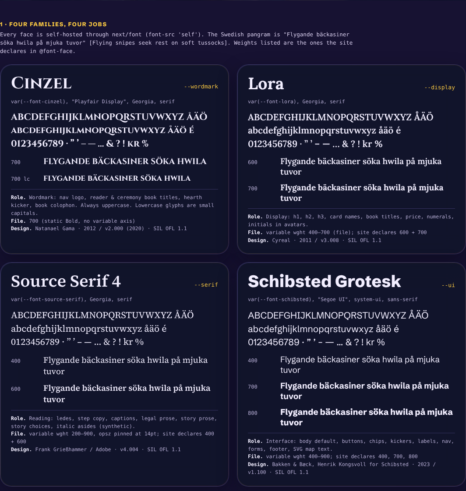
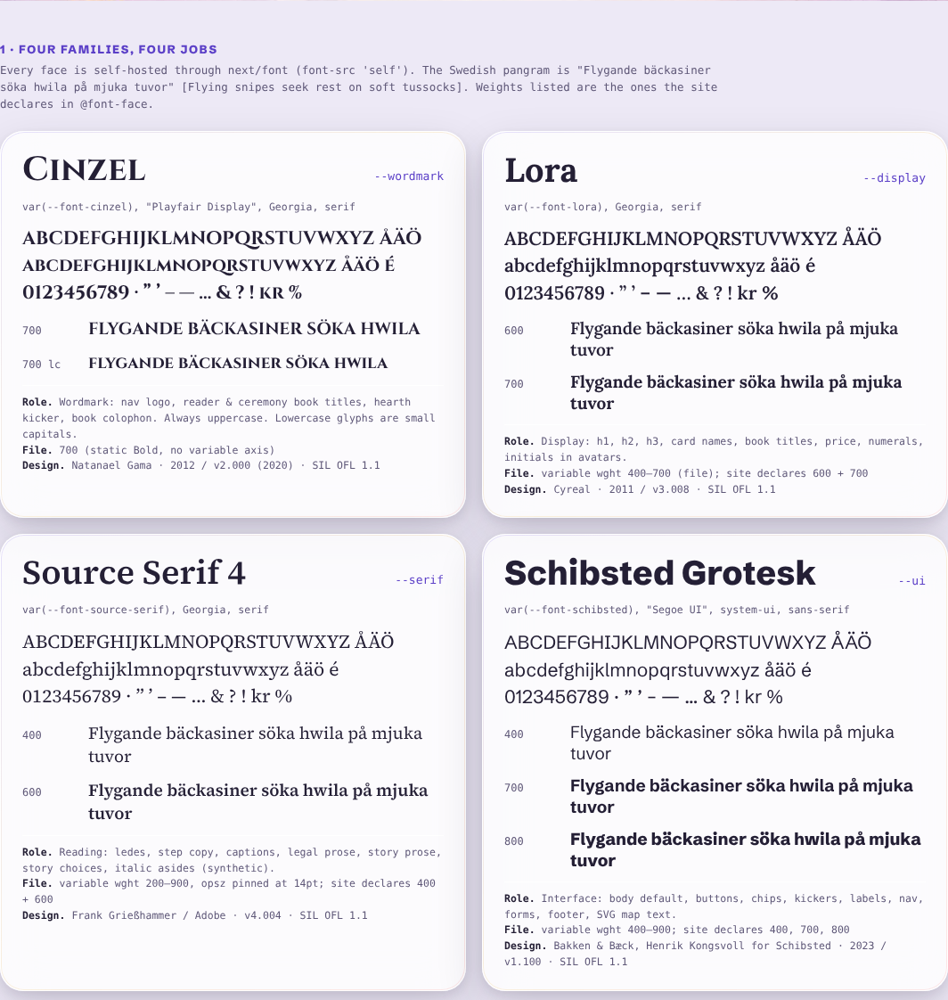
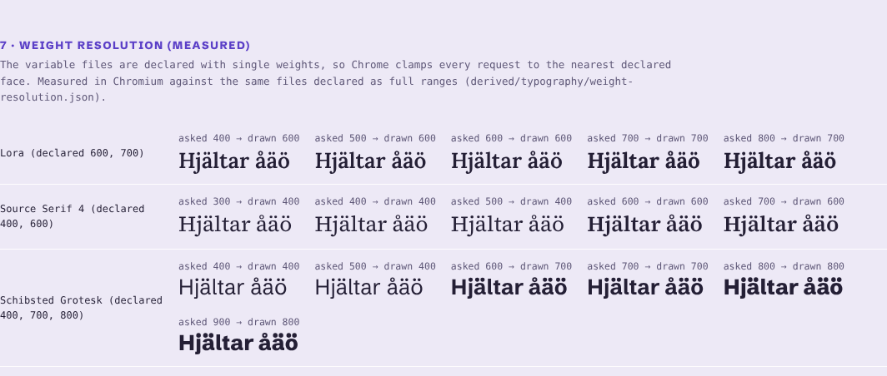
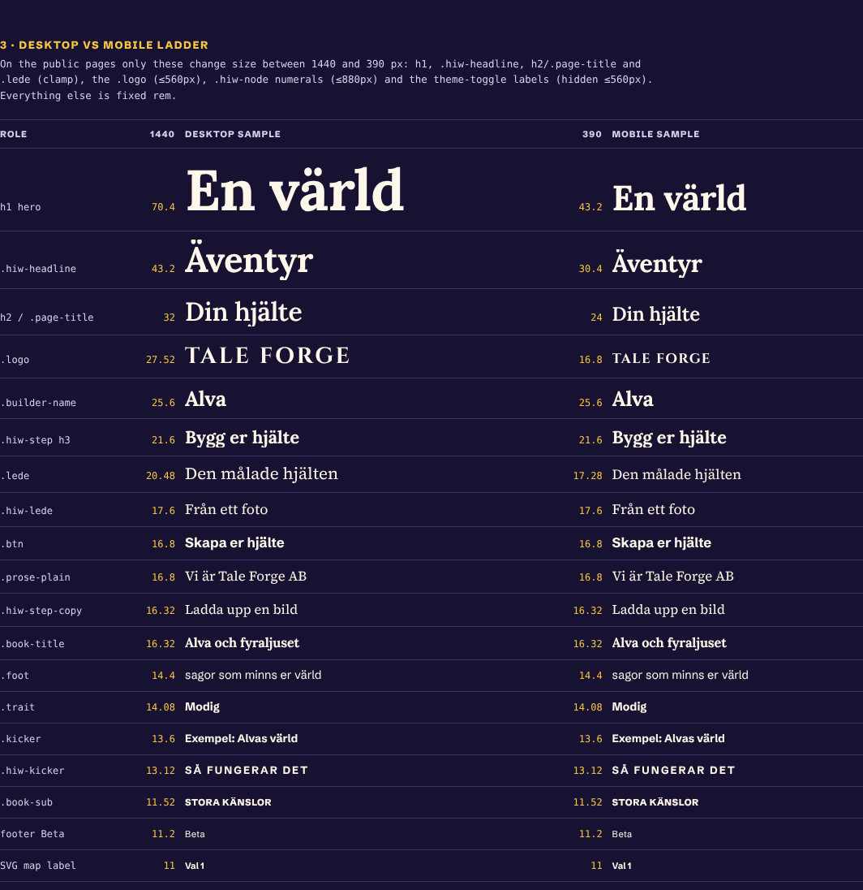
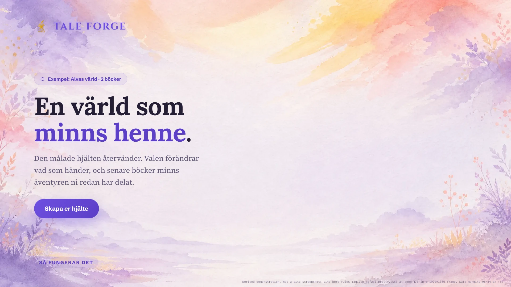

# 03 · Typography: Tale Forge

Tale Forge sets its type in four Google Fonts families. Each has one job: **Lora** for storybook headlines (`--display`), **Source Serif 4** for anything read at length (`--serif`), **Schibsted Grotesk** for the app's controls and labels (`--ui`), and **Cinzel** inscriptional capitals for the wordmark and book titles (`--wordmark`).
All four are self-hosted variable or static subsets under the SIL Open Font License. The site declares them with single weights, so only eight instances are ever drawn: Lora 600/700, Source Serif 400/600, Grotesk 400/700/800 and Cinzel 700. Italics are faked by the browser.
The scale is compact and hand-tuned: 62 distinct `font-size` values. On the public pages, only the four `clamp()` roles, the logo, the step numerals and the theme-toggle labels change size between desktop and phone. The h1 runs from 43.2 px on a phone to 70.4 px on desktop, with 1.06 leading and −0.015em tracking. Its accent phrase is a flat gold (Natt) or violet (Morgon) colour; despite the class name `.grad`, it is not a gradient.
This file covers literal material (verbatim CSS with line numbers, tables, measured numbers), then interpretation under **Read** headings and a reproduction guide for film. The renamed font files, the specimen, the inventories and the image sheets are in [`../derived/typography/`](../derived/typography/).

## Contents

1. [At a glance](#1-at-a-glance)
2. [The four families](#2-the-four-families)
3. [Font files, @font-face and delivery](#3-font-files-font-face-and-delivery)
4. [Weights: declared vs drawn (measured)](#4-weights-declared-vs-drawn-measured)
5. [The type scale by role](#5-the-type-scale-by-role)
6. [Verbatim CSS of the core type rules](#6-verbatim-css-of-the-core-type-rules)
7. [Inventory of every type declaration](#7-inventory-of-every-type-declaration)
8. [Treatments: accent phrase, shadows, drop caps, labels, italics](#8-treatments-accent-phrase-shadows-drop-caps-labels-italics)
9. [Type colours per theme](#9-type-colours-per-theme)
10. [Swedish typesetting and diacritics](#10-swedish-typesetting-and-diacritics)
11. [Licences (verified)](#11-licences-verified)
12. [Read: the typographic voice](#12-read-the-typographic-voice)
13. [Reproduce it: web, Remotion and film](#13-reproduce-it-web-remotion-and-film)
14. [Type in motion (pointers)](#14-type-in-motion-pointers)
15. [Inconsistencies and gaps](#15-inconsistencies-and-gaps)
16. [Files in derived/typography/](#16-files-in-derivedtypography)

---

## 1. At a glance

| Item | Value | Source |
|---|---|---|
| Families | Lora · Source Serif 4 · Schibsted Grotesk · Cinzel | [../source/css/3q17cp_jgfwol.pretty.css](../source/css/3q17cp_jgfwol.pretty.css):1-459 |
| Role variables | `--display` Lora, `--serif` Source Serif 4, `--ui` Schibsted Grotesk, `--wordmark` Cinzel | 3q17cp_jgfwol.pretty.css:460-472 |
| Body default | `body { font-family: var(--ui); -webkit-font-smoothing: antialiased }`, 16px UA size | 3q17cp_jgfwol.pretty.css:598-608 |
| Instances drawn | Lora 600, 700 · Source Serif 4 400, 600 · Schibsted Grotesk 400, 700, 800 · Cinzel 700 | [../derived/typography/weight-resolution.json](../derived/typography/weight-resolution.json) |
| Files | 17 WOFF2 subsets, 421 KB in total. The 4 preloaded latin files come to 147 KB | [../derived/typography/font-files.md](../derived/typography/font-files.md) |
| Largest text | h1 `clamp(2.7rem, 5.4vw, 4.4rem)` = 70.4px desktop / 43.2px mobile, Lora 700, lh 1.06, −0.015em | 3q17cp_jgfwol.pretty.css:855-866 |
| Reading text | Source Serif 4 400, 15.2–20.5px, lh 1.6–1.85, measures 46–72ch | §5 |
| UI text | Schibsted Grotesk 700 at 13–17px, many pills; uppercase micro-labels 0.58–0.78rem tracked 0.04–0.22em | §5 |
| Wordmark | `TALE FORGE`: Cinzel 700, 1.72rem (27.52px), `letter-spacing: 3px`, uppercase, gold glow (Natt) / violet (Morgon) | 3q17cp_jgfwol.pretty.css:696-710 |
| Share of text elements | 780 Grotesk · 151 Source Serif · 88 Lora · 32 Cinzel (1,051 distinct text-bearing elements across 8 pages × 2 languages × 2 viewports) | [../derived/typography/computed-type-usage.csv](../derived/typography/computed-type-usage.csv) |
| OpenType features set in CSS | none (no `font-feature-settings`, no `font-variant-*`) | [../derived/typography/css-type-declarations.csv](../derived/typography/css-type-declarations.csv) |
| `text-wrap` | `balance` on `h1` and `.start-flow .stepcard h2` only | 3q17cp_jgfwol.pretty.css:858; 2_gt301v4m-60.pretty.css:53 |
| Licence | SIL OFL 1.1 for all four (in-file name ID 14 + Google Fonts METADATA) | §11 |
| Specimen | [../derived/typography/specimen.html](../derived/typography/specimen.html) → [specimen-natt.webp](../derived/typography/specimen-natt.webp), [specimen-morgon.webp](../derived/typography/specimen-morgon.webp) | |



---

## 2. The four families

### 2.1 Role variables (verbatim)

The four `next/font` classes on `<html>` (`class="cinzel_…__variable lora_…__variable source_serif_4_…__variable schibsted_grotesk_…__variable"`, [../source/html/home.sv.html](../source/html/home.sv.html)) define `--font-cinzel`, `--font-lora`, `--font-source-serif` and `--font-schibsted`. The global stylesheet builds the role variables on top of them:

```css
/* source/css/3q17cp_jgfwol.pretty.css:460-472 */
:root {
  --violet: #6d4fe0;
  --violet-soft: #9b87f5;
  --gold: #f2b22e;
  --gold-soft: #f5c542;
  --coral: #ff6154;
  --display: var(--font-lora), Georgia, serif;
  --ui: var(--font-schibsted), "Segoe UI", system-ui, sans-serif;
  --serif: var(--font-source-serif), Georgia, serif;
  --wordmark: var(--font-cinzel), "Playfair Display", Georgia, serif;
  --theme-transition-duration: 0.5s;
  --theme-transition-easing: ease;
}
```

The `next/font` variable classes (verbatim):

```css
/* 3q17cp_jgfwol.pretty.css:37-39, 250-252, 377-379, 457-459 */
.cinzel_71b11afb-module__MlkSrG__variable {
  --font-cinzel: "Cinzel", "Cinzel Fallback";
}
.lora_f283b796-module__E6zvsG__variable {
  --font-lora: "Lora", "Lora Fallback";
}
.source_serif_4_efe0a908-module__kMXAjq__variable {
  --font-source-serif: "Source Serif 4", "Source Serif 4 Fallback";
}
.schibsted_grotesk_e2dd7ded-module__kS_IdW__variable {
  --font-schibsted: "Schibsted Grotesk", "Schibsted Grotesk Fallback";
}
```

The resolved stacks, as Chromium reports them in every computed-style capture ([../source/rendered/computed-styles__home__sv__natt__desktop.json](../source/rendered/computed-styles__home__sv__natt__desktop.json), `style["font-family"]`):

| Role | Resolved `font-family` | Elements |
|---|---|---|
| `--ui` | `"Schibsted Grotesk", "Schibsted Grotesk Fallback", "Segoe UI", system-ui, sans-serif` | 780 |
| `--serif` | `"Source Serif 4", "Source Serif 4 Fallback", Georgia, serif` | 151 |
| `--display` | `Lora, "Lora Fallback", Georgia, serif` | 88 |
| `--wordmark` | `Cinzel, "Cinzel Fallback", "Playfair Display", Georgia, serif` | 32 |

Read: the fallback chain matters only before the web fonts arrive. `"Playfair Display"` appears in the wordmark stack, but the site never loads it; it is a leftover or a "nice if installed" choice.

### 2.2 Family profiles

| | **Cinzel** | **Lora** | **Source Serif 4** | **Schibsted Grotesk** |
|---|---|---|---|---|
| Role variable | `--wordmark` | `--display` | `--serif` | `--ui` |
| Designer (Google Fonts METADATA) | Natanael Gama | Cyreal | Frank Grießhammer | Bakken & Bæck, Henrik Kongsvoll |
| Version in file | 2.000 | 3.008 | 4.004 | 1.100 |
| File axes | none (static Bold) | `wght` 400–700 | `wght` 200–900 (`opsz` removed, pinned at 14pt) | `wght` 400–900 |
| Declared weights | 700 | 600, 700 | 400, 600 | 400, 700, 800 |
| Italic loaded | no | no | no (italics are synthetic) | no |
| Subsets | latin, latin-ext | latin, latin-ext, cyrillic, cyrillic-ext, vietnamese, math, symbols | latin, latin-ext, cyrillic, cyrillic-ext, greek, vietnamese | latin, latin-ext |
| unitsPerEm | 1000 | 1000 | 1000 | 2048 |
| Ascender / descender (hhea = typo) | 0.976 / −0.372 | 1.006 / −0.274 | 1.036 / −0.335 | 0.977 / −0.258 |
| Cap height (measured H) | 0.700 | 0.700 | 0.670 | 0.703 |
| x-height (measured x) | 0.601 (small caps) | 0.500 | 0.492 (OS/2 says 0.475) | 0.527 |
| `line-height: normal` | 1.348 | 1.280 | 1.371 | 1.234 |
| Avg. lowercase advance | 0.647 em | 0.542 em (700) | 0.551 em (400) | 0.526 em (400), 0.566 em (700) |
| Used for | logo, reader/ceremony titles, hearth kicker, book colophon | h1–h3, names, book titles, price, numerals, avatar initials, hearth titles | ledes, body copy, captions, legal prose, story prose, story choices, italic asides | everything else: body default, buttons, chips, kickers, labels, nav, forms, footer, SVG map text |
| Google Fonts description (excerpt) | "inspired in first century roman inscriptions, and based on classical proportions" | "a well-balanced contemporary serif with roots in calligraphy … brushed curves in contrast with driving serifs … the mood of a modern-day story" | "a serif typeface in the transitional style … loosely based on the work of Pierre Simon Fournier" | "a digital-first font family crafted for user interfaces. Taking visual cues from Schibsted's proud history of printed media" |

Metrics were read from the latin subsets with fontTools (`OS/2`, `hhea`, glyph bounds; variable files instanced at the weight noted). The descriptions are quoted from [../derived/typography/licences/](../derived/typography/licences/) (`google-fonts-DESCRIPTION-*.en_us.html`).

**Cinzel's lowercase is small caps.** In the file, the lowercase letters are capitals 0.60–0.63 em tall with no descenders. Only the capital J dips below the baseline. The site always applies `text-transform: uppercase` to Cinzel, so the lowercase never shows ([../derived/typography/sheets/diacritics-natt.png](../derived/typography/sheets/diacritics-natt.png), first row).



---

## 3. Font files, @font-face and delivery

### 3.1 Delivery

- **Self-hosted through `next/font/google`.** The CSP sets `font-src 'self'`, so nothing loads from Google's CDN at runtime. Files are served from `/_next/static/immutable/media/<hash>.woff2` ([../source/meta/home-response-headers.txt](../source/meta/home-response-headers.txt)).
- **Preload.** The response `link:` header preloads the four latin files (the ones marked `.p.`). Grotesk, Source Serif, Lora and Cinzel latin together are 150,804 bytes.
- **`font-display: swap`** on all 34 faces.
- **Metric-matched fallbacks.** Each family gets one `@font-face` with `size-adjust` and ascent/descent overrides on a local system font. The HTML carries `<meta name="next-size-adjust" content="">`.
- **The 17 hashed files** are mapped to family, subset and weight in [../derived/typography/font-files.md](../derived/typography/font-files.md). Byte-identical renamed copies are in [../derived/typography/fonts/](../derived/typography/fonts/) and every rule is in [../derived/typography/font-faces.json](../derived/typography/font-faces.json).

### 3.2 One @font-face per family (verbatim, latin subset)

```css
/* source/css/3q17cp_jgfwol.pretty.css:12-21 — Cinzel latin */
@font-face {
  font-family: Cinzel;
  font-style: normal;
  font-weight: 700;
  font-display: swap;
  src: url(../media/fd5073be3e923c20-s.p.0bu2vpnzs5p12.woff2) format("woff2");
  unicode-range:
    U+??, U+131, U+152-153, U+2BB-2BC, U+2C6, U+2DA, U+2DC, U+304, U+308, U+329,
    U+2000-206F, U+20AC, U+2122, U+2191, U+2193, U+2212, U+2215, U+FEFF, U+FFFD;
}
/* 3q17cp_jgfwol.pretty.css:128-137 and 226-235 — Lora latin, one file declared twice (600 and 700) */
@font-face {
  font-family: Lora;
  font-style: normal;
  font-weight: 600;
  font-display: swap;
  src: url(../media/8c2eb9ceedecfc8e-s.p.1c4v1kyduoipm.woff2) format("woff2");
  unicode-range:
    U+??, U+131, U+152-153, U+2BB-2BC, U+2C6, U+2DA, U+2DC, U+304, U+308, U+329,
    U+2000-206F, U+20AC, U+2122, U+2191, U+2193, U+2212, U+2215, U+FEFF, U+FFFD;
}
@font-face {
  font-family: Lora;
  font-style: normal;
  font-weight: 700;
  font-display: swap;
  src: url(../media/8c2eb9ceedecfc8e-s.p.1c4v1kyduoipm.woff2) format("woff2");
  unicode-range:
    U+??, U+131, U+152-153, U+2BB-2BC, U+2C6, U+2DA, U+2DC, U+304, U+308, U+329,
    U+2000-206F, U+20AC, U+2122, U+2191, U+2193, U+2212, U+2215, U+FEFF, U+FFFD;
}
/* 3q17cp_jgfwol.pretty.css:299-308 and 355-364 — Source Serif 4 latin (400 and 600) */
@font-face {
  font-family: "Source Serif 4";
  font-style: normal;
  font-weight: 400;
  font-display: swap;
  src: url(../media/68d403cf9f2c68c5-s.p.42000xkkqj0am.woff2) format("woff2");
  unicode-range:
    U+??, U+131, U+152-153, U+2BB-2BC, U+2C6, U+2DA, U+2DC, U+304, U+308, U+329,
    U+2000-206F, U+20AC, U+2122, U+2191, U+2193, U+2212, U+2215, U+FEFF, U+FFFD;
}
@font-face {
  font-family: "Source Serif 4";
  font-style: normal;
  font-weight: 600;
  font-display: swap;
  src: url(../media/68d403cf9f2c68c5-s.p.42000xkkqj0am.woff2) format("woff2");
  unicode-range:
    U+??, U+131, U+152-153, U+2BB-2BC, U+2C6, U+2DA, U+2DC, U+304, U+308, U+329,
    U+2000-206F, U+20AC, U+2122, U+2191, U+2193, U+2212, U+2215, U+FEFF, U+FFFD;
}
/* 3q17cp_jgfwol.pretty.css:391-400, 412-421, 433-442 — Schibsted Grotesk latin (400, 700, 800) */
@font-face {
  font-family: Schibsted Grotesk;
  font-style: normal;
  font-weight: 400;
  font-display: swap;
  src: url(../media/31a9145ccb84606d-s.p.1_j-vbs-91rji.woff2) format("woff2");
  unicode-range:
    U+??, U+131, U+152-153, U+2BB-2BC, U+2C6, U+2DA, U+2DC, U+304, U+308, U+329,
    U+2000-206F, U+20AC, U+2122, U+2191, U+2193, U+2212, U+2215, U+FEFF, U+FFFD;
}
@font-face {
  font-family: Schibsted Grotesk;
  font-style: normal;
  font-weight: 700;
  font-display: swap;
  src: url(../media/31a9145ccb84606d-s.p.1_j-vbs-91rji.woff2) format("woff2");
  unicode-range:
    U+??, U+131, U+152-153, U+2BB-2BC, U+2C6, U+2DA, U+2DC, U+304, U+308, U+329,
    U+2000-206F, U+20AC, U+2122, U+2191, U+2193, U+2212, U+2215, U+FEFF, U+FFFD;
}
@font-face {
  font-family: Schibsted Grotesk;
  font-style: normal;
  font-weight: 800;
  font-display: swap;
  src: url(../media/31a9145ccb84606d-s.p.1_j-vbs-91rji.woff2) format("woff2");
  unicode-range:
    U+??, U+131, U+152-153, U+2BB-2BC, U+2C6, U+2DA, U+2DC, U+304, U+308, U+329,
    U+2000-206F, U+20AC, U+2122, U+2191, U+2193, U+2212, U+2215, U+FEFF, U+FFFD;
}
```

Count: Cinzel 2 faces (latin-ext, latin). Lora 14 (7 subsets × 2 weights). Source Serif 4 12 (6 × 2). Schibsted Grotesk 6 (2 × 3). That makes **34 faces on 17 files**.

### 3.3 The fallback faces (verbatim)

```css
/* 3q17cp_jgfwol.pretty.css:22-29, 236-243, 365-372, 443-450 */
@font-face {
  font-family: Cinzel Fallback;
  src: local(Times New Roman);
  ascent-override: 71.31%;
  descent-override: 27.18%;
  line-gap-override: 0%;
  size-adjust: 136.86%;
}
@font-face {
  font-family: Lora Fallback;
  src: local(Times New Roman);
  ascent-override: 87.33%;
  descent-override: 23.78%;
  line-gap-override: 0%;
  size-adjust: 115.2%;
}
@font-face {
  font-family: "Source Serif 4 Fallback";
  src: local(Times New Roman);
  ascent-override: 87.87%;
  descent-override: 28.41%;
  line-gap-override: 0%;
  size-adjust: 117.91%;
}
@font-face {
  font-family: Schibsted Grotesk Fallback;
  src: local(Arial);
  ascent-override: 93.46%;
  descent-override: 24.67%;
  line-gap-override: 0%;
  size-adjust: 104.49%;
}
```

Check: every override equals the web font's own metric divided by `size-adjust`. For example Cinzel: ascender 976/1000 ÷ 1.3686 = 71.31 %. Lora: 1006/1000 ÷ 1.152 = 87.33 %. Cinzel's 136.86 % size-adjust says it is about 37 % wider than Times New Roman, set at the same size.

### 3.4 What is *not* loaded

- **No italics.** No `@font-face` has `font-style: italic`. Seven rules ask for italic (see §8.6), so Chromium slants the roman. The result is a synthetic oblique, not the designed Source Serif 4 Italic.
- **No optical sizes.** Upstream Source Serif 4 is `SourceSerif4[opsz,wght].ttf` with `opsz` 8–60 ([../derived/typography/licences/google-fonts-METADATA-sourceserif4.pb.txt](../derived/typography/licences/google-fonts-METADATA-sourceserif4.pb.txt)). The served subset's `STAT` table names a single "14pt" instance and the file has no `opsz` axis. So `font-optical-sizing: auto` on `.prose` (3q17cp_jgfwol.pretty.css:1827) has no effect.
- **No Lora 400/500**, no Grotesk 500/600/900 and no Source Serif 700 instances can appear. See §4.
- **No Playfair Display**, although it is named in `--wordmark`.

---

## 4. Weights: declared vs drawn (measured)

Each variable file is declared once per weight with a **single-value** `font-weight` descriptor. Chromium picks the nearest declared face (CSS font matching) and clamps the variation to that face's one weight. The table below is measured, not inferred. In Chromium, a string set at 100 px in the site's faces was compared with the same files declared as full ranges (`font-weight: 100 900`). Method and raw widths: [../derived/typography/weight-resolution.json](../derived/typography/weight-resolution.json). Visual: [../derived/typography/sheets/weights-natt.png](../derived/typography/sheets/weights-natt.png).

| Requested → | 300 | 400 | 500 | 600 | 700 | 800 | 900 |
|---|---|---|---|---|---|---|---|
| **Lora** (declared 600, 700) | 600 | 600 | 600 | 600 | 700 | 700 | 700 |
| **Source Serif 4** (declared 400, 600) | 400 | 400 | 400 | 600 | 600 | 600 | 600 |
| **Schibsted Grotesk** (declared 400, 700, 800) | 400 | 400 | 400 | **700** | 700 | 800 | 800 |
| **Cinzel** (static Bold) | 700 | 700 | 700 | 700 | 700 | 700 | 700 |

Consequences on the live site:

- Every Grotesk `font-weight: 600` draws at 700: `.hiw-micro`, `.hiw-choice`, `.map-choice-label`, `.glod-wb-rewrite`, JS `job-rewriting` (3q17cp_jgfwol.pretty.css:2645-2654, 2884-2896, …). The computed styles still say 600.
- Every Grotesk `500` draws at 400: `.friend-mode-option span`, `.pick-story-copy small`, `.cs-chip--add`.
- Grotesk `900` (`.glod-wb-steps li .dot`, 37m388zf6rymp.pretty.css:282) draws at 800.
- Source Serif `700` draws at 600. This covers bold links inside legal prose (inline `font-weight:700`, [../derived/typography/html-inline-type-styles.csv](../derived/typography/html-inline-type-styles.csv)) and any `<b>`/`<strong>` in serif.



---

## 5. The type scale by role

Rendered px come from the computed-style captures: desktop = 1440×900 (`computed-styles__<page>__sv__natt__desktop.json`), mobile = 390×844 (`…__mobile.json`). "Tablet" is the clamp evaluated at 834 px. Rows marked *css-only* style screens that are not publicly reachable: the reader (`/reader` is in robots `Disallow`), the start flow beyond its first screen, the waiting-fire stage and `/create`. Their values come from the CSS alone. The full machine-readable version is [../tokens/typography.json](../tokens/typography.json) (`roles`). The visual version with real copy is the specimen ([../derived/typography/sheets/scale-natt.webp](../derived/typography/sheets/scale-natt.webp)).

### 5.1 Display: Lora (`--display`)

| Role | Selector | Weight (drawn) | Size expression | Desktop | Mobile | Line-height | Tracking | Copy (sv) | Source |
|---|---|---|---|---|---|---|---|---|---|
| Hero headline | `h1` | 700 | `clamp(2.7rem, 5.4vw, 4.4rem)` | **70.4px** | **43.2px** (45.04 @834) | 1.06 | −0.015em (−1.056px) | `En värld som minns henne.` / `Ikväll är hjälten ert barn.` | G:855-866 |
| Start hand-off h1 | `.start-flow .handoff h1` | 700 | `clamp(2.2rem, 5vw, 3.4rem)` | 54.4px | 35.2px | 1.06 | −0.015em | *css-only* | S:849-852 |
| Section headline | `.hiw-headline` (h2) | 700 | `clamp(1.9rem, 4vw, 2.7rem)` | 43.2px | 30.4px | normal | −0.015em | `Äventyr värda att prata om.` | G:2554-2561 |
| Section title | `h2` | 600 | `clamp(1.5rem, 2.4vw, 2rem)` | 32px | 24px | normal | −0.01em | `Din hjälte`, `Bokhyllan`, `Det här ingår`, `Sidan finns inte` | G:1055-1062 |
| Page title | `.page-title`, `.create-title` | 600 | `clamp(1.5rem, 2.4vw, 2rem)` | 32px | 24px | 1.06 (h1 element) | 0 | `Integritetspolicy`, `Skapa konto`, `Uppgradera` | G:1063-1072 |
| Hero name | `.builder-name` | 700 | 1.6rem | 25.6px | 25.6px | normal | −0.01em | `Alva` | G:1210-1216 |
| Price | inline style (upgrade card) | 700 | 1.6rem | 25.6px | 25.6px | normal | — | `1490 kr per år` / `$149.00 per year` | JS [26ye0kuppitcn.js](../source/js/26ye0kuppitcn.js) @18994 |
| Step title | `.hiw-step-text h3` | 700 | 1.35rem | 21.6px | 21.6px | normal | 0 | `Bygg er hjälte` | G:2631-2637 |
| Friends title | `.friends h3` | 700 | 1.25rem | 20px | 20px | normal | −0.01em | `Ta med en vän` | G:1290-1295 |
| Adventure card title | `.adv-title` | 700 | 1.3rem (1.08rem ≤600px; 1.1rem in start flow) | 20.8px | 17.28px | 1.25 | −0.015em | *css-only* | G:1591-1597 |
| Companion name | `.companion-name` | 700 | 1.35rem | 21.6px | — | — | −0.01em | *css-only* | G:1467-1472 |
| Create-screen h1 | `.cs-h1` | 700 | 1.92rem | 30.72px | — | 1.15 | −0.01em | *css-only* | C:60-69 |
| Door card title | `.cs-door-title` | 700 | 1.125rem | 18px | — | 1.2 | — | *css-only* | C:400-407 |
| Book title | `.book-title` | 700 | 1.02rem | 16.32px | 16.32px | 1.25 (20.4px) | −0.01em | `Alva och fyraljuset i tornet` | G:1513-1519 |
| Step numeral | `.hiw-node` | 700 | 1.05rem (0.9rem ≤880px) | 16.8px | 14.4px | normal | — | `1`–`6` | G:2599-2613 |
| Avatar initials | `.comp-avatar` 1.3rem, `.pframe-initial` 3.4rem, `.cs-portrait-initial` 2.4rem, `.cs-coin` 0.95rem, `.cs-chip-th` 0.8rem | 700 | | | | | | *css-only* | G:1407-1418, 1746-1756 |
| Hearth caption | `.glod-caption-line` | 700 | `clamp(1.15rem, 3.2vw, 1.45rem)` | 23.2px | 18.4px | normal | −0.01em | `Elden har smitt klart din saga.` *css-only* | H:970-977 |
| Hearth sign title | `.glod-wb-title` | 700 | 1.16rem (1.32rem ≥1800px; 1rem narrow) | 18.56px | 16px | normal | 0 | `Din saga växer fram` *css-only* | H:173-181 |
| Hearth book title | `.glod-book-title` | 700 | `clamp(0.92rem, 2.4vw, 1.14rem)` | 18.24px | 14.72px | 1.35 | 0.01em | `En ny saga om {name}` *css-only* | H:921-935 |

### 5.2 Wordmark: Cinzel (`--wordmark`)

| Role | Selector | Size | Desktop | Mobile | Tracking | Transform | Copy | Source |
|---|---|---|---|---|---|---|---|---|
| Nav wordmark | `.logo` | 1.72rem; 1.05rem ≤560px | 27.52px | 16.8px | 3px; 1.5px ≤560px | uppercase | source `Tale Forge` → `TALE FORGE` | G:696-710, 746-751 |
| Reader book title | `.reader-title` (an `h1`, so 700) | 2rem; 1.55rem ≤560px | 32px | 24.8px | 0 | uppercase, lh 1.18 | `IRIS OCH DEN SPARADE PLATSEN` *css-only* | G:1810-1822 |
| End-of-book title | `.reader-ceremony-title` | 2rem; 1.35rem ≤560px | 32px | 21.6px | 0 | uppercase, lh 1.18 | *css-only* | G:2119-2131 |
| Hearth sign kicker | `.glod-wb-kicker` | 0.64rem (0.72 ≥1800px, 0.58 narrow) | 10.24px | 9.28px | 0.13em | uppercase | `Väntelden` [The waiting fire] | H:157-166 |
| Book colophon | `.glod-book-colophon` | 0.58rem | 9.28px | — | 0.22em | uppercase | `Tale Forge` | H:936-946 |

### 5.3 Reading: Source Serif 4 (`--serif`)

| Role | Selector | Weight | Size | Desktop | Mobile | Line-height | Measure | Copy | Source |
|---|---|---|---|---|---|---|---|---|---|
| Hero lede | `.lede` | 400 | `clamp(1.08rem, 1.65vw, 1.28rem)` | **20.48px** | **17.28px** | 1.65 (33.79px) | 46ch | `Den målade hjälten återvänder. Valen förändrar vad som händer, och senare böcker minns äventyren ni redan har delat.` | G:871-879 |
| Lede on legal pages | `.lede` + inline `font-size:1.02rem` | 400 | 1.02rem | 16.32px | 16.32px | 1.65 | 46ch | `Hur vi tar hand om uppgifterna om ert barn.` | dom__integritet__sv.html |
| Lede on auth pages | `.lede` + inline `font-size:1rem` | 400 | 1rem | 16px | 16px | 1.65 | 46ch | `Välkommen tillbaka.` [Welcome back.] | JS [1hcx0qn-qjgfn.js](../source/js/1hcx0qn-qjgfn.js) @6787 |
| Section lede | `.hiw-lede` | 400 | 1.1rem | 17.6px | 17.6px | 1.7 | 56ch | `Från ett foto till en uppläst bilderbok med fyra olika slut.` | G:2562-2568 |
| Step body | `.hiw-step-copy` | 400 | 1.02rem | 16.32px | 16.32px | 1.75 | 52ch | `Ladda upp en bild och välj det som gör ert barn till ert barn.` | G:2638-2644 |
| Section intro | `.sec-intro` | 400 | 1rem | 16px | — | 1.6 | 62ch | *css-only* | G:1047-1054 |
| Caption | `.hiw-caption` | 400 | 0.95rem | 15.2px | 15.2px | 1.6 | 72ch | `Kartan över exempelboken …` | G:2909-2916 |
| Legal / 404 body | `.prose-plain` | 400 | 1.05rem | 16.8px | 16.8px | 1.7 | card width | `Vi är Tale Forge AB, ett litet svenskt företag i Värnamo …` | G:1842-1849 |
| Reader prose | `.prose` | 400 | 1.2rem | 19.2px | — | **1.85** | card width | book beats *css-only* | G:1823-1833 |
| Reader drop cap | `.prose:first-letter` | 600 | 2.5em | 48px | | 0.9 | | accent colour | G:1834-1841 |
| Landing mock prose | `.hiw-mock-prose` | 400 | 1.02rem | 16.32px | 16.32px | 1.7 | card | `Iris gick in mellan fönsterbänken och mattan …` | G:2863-2869 |
| Story choice | `.choice` | 600 | 1.05rem | 16.8px | — | normal | half card | `Gå med Mossa till den gröna mattan.` *css-only* | G:1904-1922 |
| Recipe sentence | `.cs-recipe` | 400 | 0.97rem | 15.52px | — | **2.2** (room for inline chips) | | *css-only* | C:164-170 |
| Italic asides | `.veil-caption`, `.reveal-line`, `.voice-line`, `.forge .inputs`, `.cs-memtag`, `.glod-mem-from`, `.glod-hearth-box` | 400, synthetic italic | 0.78–1.18rem | | | 1.45–1.6 | 26–34ch | `Er hjälte väntar bakom duken.` [Your hero is waiting behind the veil.] *css-only* | §8.6 |
| Memory card hook | `.glod-mem-hook` | 400 | 0.97rem | 15.52px | | 1.55 | | `Den här glöden minns något ur en av era böcker.` *css-only* | H:580-586 |

### 5.4 Interface: Schibsted Grotesk (`--ui`)

| Role | Selector | Weight (drawn) | Size | px | Tracking / transform | Copy | Source |
|---|---|---|---|---|---|---|---|
| Body default | `body` | 400 | 16px | 16 | — | (inherited everywhere) | G:598-608 |
| Button | `.btn` | 700 | 1.05rem | 16.8 | — | `Skapa er hjälte` · `Se hur det funkar` · `Läs exempelboken` | G:886-903 |
| Button in cards | `.adv .btn`, feedback buttons (inline) | 700 | 0.95rem | 15.2 | — | | G:1615-1620 |
| Big CTA | `.start-flow .surprise .btn` | 700 | 1.15rem | 18.4 | — | *css-only* | S:605-608 |
| Theme toggle | `.tt-opt` | 700 | 0.95rem (0 ≤560px) | 15.2 / 0 | — | `Natt` · `Morgon` | G:801-813 |
| Nav pills | inline style | 700 | 0.82rem, lh 1 | 13.12 | — | `Logga in` · `Priser` | JS [390j9gbq0u9ce.js](../source/js/390j9gbq0u9ce.js) @23394 |
| Language switch | inline style | 800 active / 700 | 0.82rem | 13.12 | 0.02em | `SV` · `EN` | JS 390j9gbq0u9ce.js @27271 |
| Kicker pill | `.kicker` | 700 | 0.85rem | 13.6 | sentence case | `Exempel: Alvas värld · 2 böcker` | G:835-850 |
| Eyebrow | `.hiw-kicker` | 700 | 0.82rem | 13.12 | **2px, UPPERCASE** | `SÅ FUNGERAR DET` | G:2541-2553 |
| Section chip | `.sec-chip` | 700 | 0.8rem | 12.8 | — | `barnens favorit` | G:1087-1098 |
| Trait chip | `.trait` | 700 | 0.88rem | 14.08 | — | `Modig` · `Fnissig` · `+ Fler` | G:1223-1238 |
| Supporting line | `.hiw-micro` | 600 → **700** | 0.88rem | 14.08 | — | `Porträttet styr både bilderna och berättelsen.` | G:2645-2654 |
| CTA micro-copy | `.cta-microcopy` | 400 | 0.85rem | 13.6 | — | `Första boken är gratis, inget kort behövs. Sedan 149 kr i månaden.` | G:3141-3145 |
| Floating badge | `.badge b` / `.badge span` | 700 / 400 | 0.95rem / 0.8rem | 15.2 / 12.8 | — | `Sixten minns tornet` / `från "Alva och fyraljuset"` | G:1030-1032, 1033-1037 |
| Mock choice | `.hiw-choice` | 600 → 700 | 0.9rem | 14.4 | — | `Gå med Mossa till den gröna mattan.` | G:2884-2896 |
| Voice chip | `.hiw-voice-chip` | 700 | 0.85rem | 13.6 | — | `Morfar` [Grandpa] | G:2834-2846 |
| AI chip | `.hiw-ai-chip` | 700 | 0.76rem | 12.16 | — | `Skapad med AI` [Made with AI] | G:2684-2698 |
| Upload title / note | `.upload b` / `.upload span` | 700 / 400 | 0.98rem / 0.85rem lh 1.45 | 15.68 / 13.6 | — | `Bli din egen hjälte` | G:1275-1278 |
| Section sub-line | inline style | 400 | 0.92rem lh 1.5 | 14.72 | — | `Den som varje saga handlar om.` | dom__home__sv.html |
| Form label | inline style | 700 | 0.9rem | 14.4 | — | `E-post` | JS 1hcx0qn-qjgfn.js @3863 |
| Story choice prompt | `.reader-choice-prompt` | 700 | inherited 16px | 16 | centred, 2px `--choice-line` box | `Det hettade i Iris händer; de ville rycka i stolen. …` [Iris's hands felt hot; they wanted to grab the chair.] *css-only* | G:1888-1897 |
| Reader status line | `.reader-link-wait` | 400 | 0.82rem, lh 1.4 | 13.12 | 0.01em, gold pulse dot | `Nästa sida målas fortfarande.` [EN copy: "The next page is still being drawn."] *css-only* | G:1865-1875 |
| Name field | `.start-flow .field` | 700 (placeholder 400) | 1.15rem | 18.4 | — | `Barnets namn` [The child's name] *css-only* | S:61-73 |
| Legal heading | inline style on `h3` | 800 | 1.02rem | 16.32 | — | `I korthet`, `Ångerrätt` | dom__integritet__sv.html |
| Legal summary | `.legal-language-details > summary` | 800 | 16px | 16 | — | `Read in English` | G:1078-1086 |
| Footer | `.foot` | 400 | 0.9rem | 14.4 | — | `Tale Forge, sagor som minns er värld.` | G:1933-1944 |
| Footer version | inline | 400 | 0.8rem, opacity .85 | 12.8 | — | `Version 16ab1756 · 26 sep. 2026` | dom__home__sv.html |
| SVG map label / number | `.hiw-map .map-choice-label` / `.map-num` | 600→700 / 700 | 11px | 11 | — | `Val 1` · `Val 2` | G:2971-2976 |
| Hearth steps | `.glod-wb-steps li` | 400; active 700 | 0.85rem | 13.6 | — | `Berättelsen planeras` … *css-only* | H:263-271 |
| Hearth wood button | `.glod-open` | 800 | 0.95rem | 15.2 | 0.02em | `Öppna boken` *css-only* | H:982-1009 |

### 5.5 Uppercase micro-labels (Grotesk unless noted)

| Selector | Weight | Size | px | Tracking | Copy | Source |
|---|---|---|---|---|---|---|
| `.hiw-kicker` | 700 | 0.82rem | 13.12 | 2px (0.152em) | `SÅ FUNGERAR DET` | G:2541-2553 |
| legal language badge (inline) | 800 | 0.78rem | 12.48 | 0.08em | `SVENSKA` · `ENGLISH` | dom__integritet__sv.html |
| `.chip` (.gold/.violet/.coral) | 800 | 0.76rem | 12.16 | 0.05em | `GODNATT` · `ÄVENTYR` · `VÄNSKAP` · `ÖVERRASKA` | G:1567-1578 |
| `.book-sub` | 800 | 0.72rem | 11.52 | 0.04em | `STORA KÄNSLOR` | G:1520-1531 |
| `.comp-chosen` | 800 | 0.72rem | 11.52 | 0.05em | *css-only* | G:1431-1440 |
| `.hiw-next-label` | 700 | 0.72rem | 11.52 | 0.05em | `NÄSTA BOK` | G:3072-3087 |
| `.sound-group-label` | 800 | 0.72rem | 11.52 | 0.09em | `STÄMNING` · `MUSIK` | G:1974-1981 |
| `.cs-recipe-title` | 800 | 0.72rem lh 1.3 | 11.52 | 0.12em | `BOKENS RECEPT` | C:154-163 |
| `.cs-door-reg` | 700 | 0.66rem | 10.56 | 0.14em | `GODNATT` etc. | C:381-387 |
| `.start-flow .ordiv` | 700 | 0.85rem | 13.6 | 0.06em | (with hairlines either side) | S:613-623 |
| `.glod-wb-kicker` (Cinzel) | 700 | 0.64rem | 10.24 | 0.13em | `VÄNTELDEN` | H:157-166 |
| `.glod-book-colophon` (Cinzel) | 700 | 0.58rem | 9.28 | 0.22em | `TALE FORGE` | H:936-946 |

### 5.6 What changes between desktop and phone

On the public pages, these change size: `h1`, `.hiw-headline`, `h2`/`.page-title` and `.lede` (all `clamp()` with a vw middle term), the `.logo` (media query ≤560px), the step numerals `.hiw-node` (1.05rem → 0.9rem ≤880px) and the theme-toggle labels (`.tt-opt` → `font-size: 0` ≤560px). Everything else is fixed rem and renders identically at 1440 and 390 (computed in [../derived/typography/computed-type-usage.csv](../derived/typography/computed-type-usage.csv)). Every `clamp()` in the CSS, verbatim:

| Selector | Expression | 390 | 834 | 1440 | Source |
|---|---|---|---|---|---|
| `h1` | `clamp(2.7rem, 5.4vw, 4.4rem)` | 43.2 | 45.04 | 70.4 | G:855-866 |
| `.hiw-headline` | `clamp(1.9rem, 4vw, 2.7rem)` | 30.4 | 33.36 | 43.2 | G:2554-2561 |
| `h2`, `.page-title`, `.create-title` | `clamp(1.5rem, 2.4vw, 2rem)` | 24 | 24 | 32 | G:1055-1062 |
| `.lede` | `clamp(1.08rem, 1.65vw, 1.28rem)` | 17.28 | 17.28 | 20.48 | G:871-879 |
| `.start-flow .handoff h1` | `clamp(2.2rem, 5vw, 3.4rem)` | 35.2 | 41.7 | 54.4 | S:849-852 |
| `.glod-hearth-main` | `clamp(0.85rem, 1.3vw, 0.98rem)` | 13.6 | 13.6 | 15.68 | H:759-761 |
| `.glod-book-title` | `clamp(0.92rem, 2.4vw, 1.14rem)` | 14.72 | 18.24 | 18.24 | H:921-935 |
| `.glod-caption-line` | `clamp(1.15rem, 3.2vw, 1.45rem)` | 18.4 | 23.2 | 23.2 | H:970-977 |

The h1 reaches its 70.4px cap at an 1304px viewport; `.lede` caps at 1241px. At 390 px the theme toggle hides its labels (`.tt-opt { font-size: 0 }`, 3q17cp_jgfwol.pretty.css:2290-2294).



---

## 6. Verbatim CSS of the core type rules

Source prefixes: G = [3q17cp_jgfwol.pretty.css](../source/css/3q17cp_jgfwol.pretty.css) (global), S = [2_gt301v4m-60.pretty.css](../source/css/2_gt301v4m-60.pretty.css), C = [2h1wwdz1nvxwk.pretty.css](../source/css/2h1wwdz1nvxwk.pretty.css), H = [37m388zf6rymp.pretty.css](../source/css/37m388zf6rymp.pretty.css).

```css
/* 3q17cp_jgfwol.pretty.css:598-608 */
body {
  color: var(--page-ink);
  font-family: var(--ui);
  -webkit-font-smoothing: antialiased;
  transition:
    background-color var(--theme-transition-duration)
      var(--theme-transition-easing),
    color var(--theme-transition-duration) var(--theme-transition-easing);
  background: #171232;
  overflow-x: hidden;
}
/* 3q17cp_jgfwol.pretty.css:855-866 */
h1 {
  font-family: var(--display);
  letter-spacing: -0.015em;
  text-wrap: balance;
  color: var(--page-ink);
  text-shadow: var(--h1-shadow);
  margin-bottom: 18px;
  font-size: clamp(2.7rem, 5.4vw, 4.4rem);
  font-weight: 700;
  line-height: 1.06;
  transition: color 0.5s;
}
/* 3q17cp_jgfwol.pretty.css:867-870 */
h1 .grad {
  color: var(--accent-ink);
  transition: color 0.5s;
}
/* 3q17cp_jgfwol.pretty.css:871-879 */
.lede {
  font-family: var(--serif);
  color: var(--page-sub);
  max-width: 46ch;
  margin-bottom: 30px;
  font-size: clamp(1.08rem, 1.65vw, 1.28rem);
  line-height: 1.65;
  transition: color 0.5s;
}
/* 3q17cp_jgfwol.pretty.css:1055-1062 */
h2 {
  font-family: var(--display);
  letter-spacing: -0.01em;
  color: var(--page-ink);
  font-size: clamp(1.5rem, 2.4vw, 2rem);
  font-weight: 600;
  transition: color 0.5s;
}
/* 3q17cp_jgfwol.pretty.css:1063-1072 */
.create-title,
.page-title {
  font-family: var(--display);
  letter-spacing: 0;
  color: var(--page-ink);
  margin: 0;
  font-size: clamp(1.5rem, 2.4vw, 2rem);
  font-weight: 600;
  transition: color 0.5s;
}
/* 3q17cp_jgfwol.pretty.css:2554-2561 */
.hiw-headline {
  font-family: var(--display);
  letter-spacing: -0.015em;
  color: var(--page-ink);
  margin-bottom: 12px;
  font-size: clamp(1.9rem, 4vw, 2.7rem);
  font-weight: 700;
}
/* 3q17cp_jgfwol.pretty.css:696-710 */
.logo {
  white-space: nowrap;
  font-family: var(--wordmark);
  color: var(--logo-ink);
  text-transform: uppercase;
  letter-spacing: 3px;
  text-shadow: var(--logo-shadow);
  flex-shrink: 0;
  align-items: center;
  gap: 13px;
  font-size: 1.72rem;
  font-weight: 700;
  transition: color 0.5s;
  display: flex;
}
/* 3q17cp_jgfwol.pretty.css:746-751 (excerpt) */
@media (max-width: 560px) {
  .logo {
    letter-spacing: 1.5px;
    gap: 8px;
    font-size: 1.05rem;
  }
}
/* 3q17cp_jgfwol.pretty.css:835-850 */
.kicker {
  color: var(--chip-ink);
  background: var(--chip-bg);
  border: 1px solid var(--chip-line);
  -webkit-backdrop-filter: blur(10px);
  backdrop-filter: blur(10px);
  border-radius: 999px;
  align-items: center;
  gap: 8px;
  margin-bottom: 22px;
  padding: 8px 16px;
  font-size: 0.85rem;
  font-weight: 700;
  transition: all 0.5s;
  display: inline-flex;
}
/* 3q17cp_jgfwol.pretty.css:2541-2553 */
.hiw-kicker {
  font-family: var(--ui);
  text-transform: uppercase;
  letter-spacing: 2px;
  color: var(--pill-ink);
  background: var(--pill-bg);
  border-radius: 999px;
  margin-bottom: 16px;
  padding: 7px 14px;
  font-size: 0.82rem;
  font-weight: 700;
  display: inline-flex;
}
/* 3q17cp_jgfwol.pretty.css:886-903 */
.btn {
  cursor: pointer;
  font-family: var(--ui);
  border: none;
  border-radius: 999px;
  align-items: center;
  gap: 10px;
  min-height: 52px;
  padding: 17px 30px;
  font-size: 1.05rem;
  font-weight: 700;
  transition:
    transform 0.25s cubic-bezier(0.2, 0.7, 0.3, 1.4),
    box-shadow 0.3s,
    background 0.5s,
    color 0.5s;
  display: inline-flex;
}
/* 3q17cp_jgfwol.pretty.css:1567-1578 */
.chip {
  letter-spacing: 0.05em;
  text-transform: uppercase;
  border-radius: 999px;
  align-items: center;
  gap: 7px;
  width: fit-content;
  padding: 6px 13px;
  font-size: 0.76rem;
  font-weight: 800;
  display: inline-flex;
}
/* 3q17cp_jgfwol.pretty.css:1513-1519 */
.book-title {
  font-family: var(--display);
  letter-spacing: -0.01em;
  font-size: 1.02rem;
  font-weight: 700;
  line-height: 1.25;
}
/* 3q17cp_jgfwol.pretty.css:1520-1531 */
.book-sub {
  letter-spacing: 0.04em;
  text-transform: uppercase;
  background: var(--pill-bg);
  color: var(--pill-ink);
  border-radius: 999px;
  margin-top: 6px;
  padding: 4px 10px;
  font-size: 0.72rem;
  font-weight: 800;
  display: inline-flex;
}
/* 3q17cp_jgfwol.pretty.css:1810-1822 */
.reader-title {
  max-width: 100%;
  font-family: var(--wordmark);
  letter-spacing: 0;
  overflow-wrap: anywhere;
  color: var(--logo-ink);
  text-transform: uppercase;
  text-shadow: var(--logo-shadow);
  margin: 0;
  font-size: 2rem;
  line-height: 1.18;
  transition: color 0.5s;
}
/* 3q17cp_jgfwol.pretty.css:1823-1833 */
.prose {
  font-family: var(--serif);
  color: var(--prose-ink);
  overflow-wrap: anywhere;
  font-optical-sizing: auto;
  flex: 1;
  min-width: 0;
  font-size: 1.2rem;
  line-height: 1.85;
  transition: color 0.5s;
}
/* 3q17cp_jgfwol.pretty.css:1834-1841 */
.prose:first-letter {
  float: left;
  color: var(--accent);
  padding: 4px 10px 0 0;
  font-size: 2.5em;
  font-weight: 600;
  line-height: 0.9;
}
/* 3q17cp_jgfwol.pretty.css:1842-1849 */
.prose-plain {
  overflow-wrap: anywhere;
  min-width: 0;
  font-family: var(--serif);
  color: var(--prose-ink);
  font-size: 1.05rem;
  line-height: 1.7;
}
/* 3q17cp_jgfwol.pretty.css:1904-1922 */
.choice {
  font-family: var(--serif);
  color: var(--choice-ink);
  background: var(--choice-bg);
  border: 2px solid var(--choice-line);
  cursor: pointer;
  overflow-wrap: anywhere;
  border-radius: 16px;
  min-width: 0;
  max-width: 100%;
  min-height: 54px;
  padding: 16px 14px;
  font-size: 1.05rem;
  font-weight: 600;
  transition:
    transform 0.25s cubic-bezier(0.2, 0.7, 0.3, 1.2),
    box-shadow 0.25s,
    border-color 0.2s;
}
/* 3q17cp_jgfwol.pretty.css:2870-2877 */
.hiw-mock-prose:first-letter {
  float: left;
  color: var(--accent);
  padding: 3px 8px 0 0;
  font-size: 2.2em;
  font-weight: 600;
  line-height: 0.9;
}
/* 2_gt301v4m-60.pretty.css:427-436 */
.start-flow .veil-caption {
  max-width: 26ch;
  font-family: var(--serif);
  color: var(--page-sub);
  margin: 0;
  font-size: 1.04rem;
  font-style: italic;
  line-height: 1.55;
  animation: 4.6s ease-in-out infinite tfVeilCaption;
}
/* 37m388zf6rymp.pretty.css:921-935 */
.glod-book-title {
  font-family: var(--display);
  text-align: center;
  color: #f7e7c3;
  letter-spacing: 0.01em;
  text-shadow:
    0 -1px #06031099,
    0 1px 3px #06031066;
  margin-top: 12px;
  padding: 0 6px;
  font-size: clamp(0.92rem, 2.4vw, 1.14rem);
  font-weight: 700;
  line-height: 1.35;
  position: relative;
}
/* 37m388zf6rymp.pretty.css:936-946 */
.glod-book-colophon {
  font-family: var(--wordmark);
  letter-spacing: 0.22em;
  text-transform: uppercase;
  color: #f7e7c38c;
  text-shadow: 0 1px 2px #06031080;
  margin-top: auto;
  font-size: 0.58rem;
  font-weight: 700;
  position: relative;
}
```

The one inline `<style>` block that sets type, on `/uppgradera` ([../source/html/uppgradera.sv.html](../source/html/uppgradera.sv.html):32-40):

```css
.upgrade-sample-caption {
  margin-top: 8px;
  color: var(--card-ink);
  font-family: var(--ui);
  font-size: 0.78rem;
  line-height: 1.35;
  text-align: center;
  overflow-wrap: anywhere;
}
```

---

## 7. Inventory of every type declaration

Three CSV inventories hold the literal list. Each row has a file and line or offset.

| File | Rows | What |
|---|---|---|
| [../derived/typography/css-type-declarations.csv](../derived/typography/css-type-declarations.csv) | 784 | Every `font*`, `line-height`, `letter-spacing`, `text-transform`, `text-wrap`, `font-optical-sizing`, `-webkit-font-smoothing`, `text-shadow`, `text-decoration`, `overflow-wrap`, `word-break`, `white-space`, `text-align`, `max-width: …ch` and `@font-face` descriptor in the four stylesheets. Columns: file, line, scope, at-rule, selector, property, value, and for `font-size` the rendered px at 390/834/1440 |
| [../derived/typography/js-inline-type-styles.csv](../derived/typography/js-inline-type-styles.csv) | 71 | React inline style objects in `source/js/*.js` that set `fontFamily`, `fontSize`, `fontWeight`, `lineHeight`, `letterSpacing` or `textShadow`, with char offset, element, class, test id and the raw object |
| [../derived/typography/html-inline-type-styles.csv](../derived/typography/html-inline-type-styles.csv) | 28 | Inline `style=""` attributes with type properties in the hydrated DOMs, with the pages they appear on and example text |
| [../derived/typography/computed-type-usage.csv](../derived/typography/computed-type-usage.csv) | 1,051 | Every distinct text-bearing element in the computed-style captures: page, lang, viewport, family, size, weight, style, line-height, letter-spacing, transform, and colour/text-shadow per theme |

Distinct values (selectors only, `@font-face` excluded):

- **font-size: 62 distinct values.** Most common: 0.95rem ×16, 0.85rem ×13, 0.72rem ×9, 0.8/0.9/0.78rem ×8, 1.05rem ×7, 0.82rem ×7, 0.88rem ×6. Neighbouring steps are often 0.01–0.02rem apart (0.84/0.85/0.86/0.88; 0.95/0.97/0.98; 1.02/1.04/1.05/1.08). Eight are `clamp()`. Two are `em` (drop caps 2.5em / 2.2em), and there are `11px`, `44px` and `0`. The JS adds `.72/.78/.8/.82/.85/.88/.9/.92/.95/.98/1/1.05/1.3/1.35/1.6rem`, `16px`, and the Next.js error page's `12/14/24px`.
- **line-height: 19 values.** 0.9 (drop caps), 1 (pills/close button), 1.06 (h1), 1.15, 1.18 (Cinzel titles), 1.2, 1.25 (card titles), 1.3, 1.35, 1.4, 1.45, 1.5, 1.55, 1.6, 1.65 (lede), 1.7, 1.75 (step copy), 1.85 (reader prose), 2.2 (recipe with chips). Lora headings below h1 keep `normal` (= 1.28 em in Lora).
- **letter-spacing: 16 values**, in a strict pattern. Negative only on Lora headings (−0.015em, the largest; −0.01em on smaller ones). Zero on Cinzel titles and `.page-title`. Positive only on uppercase micro-labels (0.04–0.22em, 2px) and the logo (3px). Two small exceptions: `0.01em` (`.reader-link-wait`, `.glod-book-title`) and `0.02em` (language switch, `.wlabel`, `.glod-open`). See `tokens/typography.json` → `letterSpacing`.
- **font-weight:** 700 ×58, 800 ×14, 600 ×9, 500 ×3, 400 ×1, 900 ×1. As drawn, these are 400/700/800 in Grotesk, 600/700 in Lora and 400/600 in Source Serif (§4).
- **text-transform:** only `uppercase` (14 rules). No `capitalize` or `lowercase`.
- **font-style: italic:** 7 rules, all on `--serif` (§8.6).
- **`font` shorthand:** 5. `700 1.45rem/1 var(--ui)` (`.cs-sheet-close`), `700 0.84rem/1.35 var(--ui)` (`.cs-companion-manage`), `0.86rem/1.5 var(--ui)` (`.cs-inline-friend-head p`), `700 0.86rem/1.35 var(--ui)` ×2 (`.cs-inline-field`, `.cs-inline-options legend`), `700 0.76rem/1.4 var(--ui)` (`.start-flow .pick-divider`).
- **text-wrap:** `balance` ×2. **font-feature-settings / font-variant / font-kerning / hyphens:** none. Figures are therefore the fonts' defaults: proportional lining. `tnum` exists in Lora, Source Serif and Grotesk but is never switched on.
- **Measures (`max-width` in ch):** `.lede` 46ch, `.cs-lede` 46ch, `.hiw-step-copy` 52ch, `.companion-sub` 56ch, `.hiw-lede` 56ch, `.honest` 60ch, `.sec-intro` 62ch, `.hiw-caption` 72ch, `.veil-caption` 26ch, `.reveal-line` 34ch.
- **Canvas text** (waiting-fire stage, story titles painted on logs): `let l=Math.max(13,Math.round(14*d));e.font=\`italic 700 ${l}px Georgia, serif\``. It is filled `rgba(255,232,166,1)` (active) or `rgba(255,214,150,0.98)` over a copy offset 1.2px in `rgba(24,10,2,0.92)`, and truncated with `...` to fit ([../source/js/1pgfdvt65g9p-.js](../source/js/1pgfdvt65g9p-.js), search `e.font=`). This is the only place the site draws in Georgia on purpose.
- **Not brand:** the Next.js error overlay styles in [../source/js/36s0t0o8ux5as.js](../source/js/36s0t0o8ux5as.js) use `system-ui` 24px/32px 500 −0.02em and `ui-monospace` 12px.

---

## 8. Treatments: accent phrase, shadows, drop caps, labels, italics

### 8.1 The accent phrase (`.grad`)

```html
<!-- source/rendered/dom__home__sv.html -->
<h1>En värld som <span class="grad">minns henne</span>.</h1>
```

`h1 .grad { color: var(--accent-ink); transition: color 0.5s }` (G:867-870). `--accent-ink` is `var(--gold-soft)` = `#f5c542` in Natt (line 497) and `#5b3fc7` in Morgon (line 546). Computed: `rgb(245, 197, 66)` / `rgb(91, 63, 199)` ([../source/rendered/computed-styles__home__sv__natt__desktop.json](../source/rendered/computed-styles__home__sv__natt__desktop.json), `cls: "grad"`). No `background-clip: text` exists anywhere in the CSS (raw files grepped), so **the "grad" is a flat colour**. The pattern holds in all four headlines that use it: the lead phrase is in page ink, the emotional object is the accent span (`minns henne` / `remembers her`, `ert barn` / `your child`), and the closing full stop sits outside the span in page ink. JS builds it the same way: `[n.h1Lead, " ", <span className="grad">{n.h1Grad}</span>, "."]` ([../source/js/0ad0wel9cyv30.js](../source/js/0ad0wel9cyv30.js)).

### 8.2 `--h1-shadow` and the logo glow

| Token | Natt | Morgon | Lines |
|---|---|---|---|
| `--h1-shadow` (h1, `.cs-h1`) | `0 2px 30px #0c082859` (a 30px violet-black halo at 35 % alpha) | `none` | 511 / 560 |
| `--logo-ink` | `#f5c542` | `#6d4fe0` | 537 / 586 |
| `--logo-shadow` (`.logo`, `.reader-title`, `.reader-ceremony-title`) | `0 2px 6px #050814cc, 0 0 34px #f5c54273` (a dark drop plus a 34px gold glow) | `0 1px 2px #241f352e, 0 0 24px #6d4fe052` (a faint drop plus a 24px violet glow) | 538 / 587 |
| `.logo img` | `filter: drop-shadow(0 0 14px #f5c54280)` in both themes | | G:711-716 |

The waiting-fire stage uses hard-coded shadows instead: `.glod-wb-title` `0 1px #0006`, `.glod-caption-line` `0 2px 20px #060410cc` (Morgon `0 2px 20px #fff8ebb3`), `.glod-book-title` `0 -1px #06031099, 0 1px 3px #06031066` (an engraved look), `.glod-open` `0 1px #00000080`.

### 8.3 Drop caps

`.prose:first-letter` (reader; G:1834-1841) and `.hiw-mock-prose:first-letter` (landing mock; G:2870-2877) float the first letter in Source Serif 600, coloured `var(--accent)` (gold `#f5c542` / violet `#6d4fe0`), at 2.5em / 2.2em with line-height 0.9. Measured on the landing: the cap "I" in `Iris` spans about two lines of 27.7px and indents the first two lines ([../derived/typography/crops/mock-prose-dropcap__sv__natt__desktop.png](../derived/typography/crops/mock-prose-dropcap__sv__natt__desktop.png)). Every sample-book beat opens with a character, `Iris …` (8 of 14 beats) or `Bibliotekarien …` [The librarian] (6), so the cap is a narrow `I` or a `B` ([../source/sample-book.iris-och-den-sparade-platsen.json](../source/sample-book.iris-och-den-sparade-platsen.json) `beats[].prose`).

### 8.4 Uppercase micro-labels

Only Grotesk (and Cinzel) are ever set in capitals. The weight is 700–800, the size 0.58–0.85rem, and the tracking rises as the size falls (0.04em at 0.72rem on `.book-sub`, up to 0.22em at 0.58rem on the colophon). Nearly all sit in a pill: `--pill-bg`/`--pill-ink` violet for the eyebrow, `--gold-chip-bg`/`--coral-chip-bg` for chips. Sentence-case pills (`.kicker`, `.sec-chip`, `.trait`, `.hiw-voice-chip`) are never tracked. Headings are never uppercase.

### 8.5 Links and emphasis

Footer links are underlined in the default style, with `text-decoration-color: var(--accent)` (inline; [../source/rendered/dom__home__sv.html](../source/rendered/dom__home__sv.html) `.foot a`). Legal and auth links are `color: var(--accent); font-weight: 700; text-decoration: underline` (inline). In serif that draws at 600. The `cs-andra` text button is 0.78rem underlined (C:40-52).

### 8.6 Synthetic italics

| Selector | Size / line-height | Copy | Source |
|---|---|---|---|
| `.start-flow .veil-caption` | 1.04rem / 1.55, max 26ch, opacity breathing 0.72↔1 over 4.6s | `Er hjälte väntar bakom duken.` / `Porträttet målas...` | S:427-436 |
| `.start-flow .reveal-line` | 1.18rem / 1.6, max 34ch, with a speaker icon | (narrator line) | S:446-458 |
| `.start-flow .voice-line` | 0.95rem / 1.6 | `Vilken hjälte ni har byggt. Jag börjar berätta så fort ni säger till.` | S:798-805 |
| `.start-flow .forge .inputs` | 1.02rem / 1.6 | | S:822-829 |
| `.cs-memtag` | 0.78rem / 1.45, `rotate(-1deg)` paper tag | `Världen minns: …` [The world remembers: …] | C:95-109 |
| `.glod-mem-from` | 0.9rem | `från '{title}'` | H:587-592 |
| `.glod-hearth-box` (all `p`) | `clamp(0.85rem, 1.3vw, 0.98rem)` / 1.55 | hearth narration | H:718-734, 744-751, 759-761 |

All are `--serif` with `font-style: italic`. With no italic face loaded, Chromium draws an oblique roman ([../derived/typography/sheets/scale-natt.webp](../derived/typography/sheets/scale-natt.webp), row "Synthetic italic"). Read: the italic voice is used for the *narrator* and for *memory*: what the storyteller says, what the world remembers. That is a consistent semantic, even if the letterforms are fake.

---

## 9. Type colours per theme

Text inks are theme tokens (full colour analysis: [../derived/color/](../derived/color/), e.g. [contrast.csv](../derived/color/contrast.csv)).

| Token | Natt | line | Morgon | line | Used by |
|---|---|---|---|---|---|
| `--page-ink` | `#fff7e9` | 494 | `#241f35` | 543 | h1, h2, headlines, body default |
| `--page-sub` | `#d9cfee` | 495 | `#5f5878` | 544 | .lede, .hiw-lede, .hiw-step-copy, captions, .cta-microcopy |
| `--accent` | `var(--gold-soft)` | 496 | `#6d4fe0` | 545 | drop caps, legal/auth links, focus rings, summary |
| `--accent-ink` | `var(--gold-soft)` | 497 | `#5b3fc7` | 546 | .grad accent phrase |
| `--prose-ink` | `#eae4f5` | 526 | `#3a3450` | 575 | .prose, .prose-plain, .hiw-mock-prose |
| `--card-ink` | `#f2eeff` | 501 | `#241f35` | 550 | text inside glass cards |
| `--card-sub` | `#b5acd3` | 502 | `#5f5878` | 551 | secondary text in cards, badge sub-line |
| `--foot-ink` | `#b7a9d6` | 527 | `#5f5878` | 576 | footer |
| `--chip-ink` | `#e8dfc9` | 507 | `var(--accent-ink)` | 556 | .kicker, .sec-chip, .hiw-voice-chip |
| `--pill-ink` | `#c9bcff` | 509 | `var(--accent-ink)` | 558 | .hiw-kicker, .book-sub, .chip.violet |
| `--gold-chip-ink` | `#ffd98f` | 513 | `#8f6a12` | 562 | .chip.gold, .hiw-node numerals, avatar initials |
| `--coral-chip-ink` | `#ffab9f` | 515 | `#c23a2b` | 564 | .chip.coral, error text |
| `--micro-ink` | `color-mix(in srgb, var(--page-sub) 85%, transparent)` | 510 | `var(--page-sub)` | 559 | .hiw-micro |
| `--logo-ink` | `#f5c542` | 537 | `#6d4fe0` | 586 | .logo, .reader-title, .cs-door-star |
| `--btn-ink` | `#3a2b10` | 529 | `#fff` | 578 | .btn-primary label |
| `--ghost-ink` | `#fff3d9` | 533 | `#241f35` | 582 | .btn-ghost, nav CTA, toggle labels |
| `--trait-ink` | `#cfc5ec` | 517 | `#5f5878` | 566 | .trait (off) |
| `--trait-on-ink` | `#e9e2ff` | 520 | `#4a36a8` | 569 | .trait.on |
| `--choice-ink` | `#f2eeff` | 524 | `#241f35` | 573 | .choice, .hiw-choice |

Read: Natt sets warm cream (`#fff7e9`) headlines over cool lavender sub-text (`#d9cfee`) with gold accents. Morgon is the near-black violet `#241f35` with grey-violet sub-text and violet accents. The hierarchy and typefaces are identical; only the inks swap, crossfading over 0.5s (`transition: color 0.5s` on h1, `.grad`, `.lede`, h2, `.logo`, `.prose`, `.foot`).

---

## 10. Swedish typesetting and diacritics

**Characters.** Counted in the visible text of all hydrated pages ([../source/rendered/](../source/rendered/) `dom__*__sv.html`, scripts and SVG removed): `ä` 315, `ö` 146, `å` 145, `·` 14, `Ä` 4, `Å` 3, `é` 1, plus ASCII `'` 18 and `"` 4. There are no curly quotes, no `…`, no en or em dashes, and **no exclamation marks** on any page in either language. In the JS dictionaries and the sample book, `’` (U+2019) appears 20 and 19 times, and `—` 3 and 1 times.

**Coverage.** All of these sit in each family's preloaded `latin` subset (`unicode-range: U+??, …` = U+0000–00FF). The Swedish UI never needs `latin-ext`. The latin files' `cmap` contain U+00C5/00C4/00D6/00E5/00E4/00F6 (fontTools).

**Diacritic heights (em, measured from the glyphs):**

| | Å | Ä | å | ä | descender (g j y) |
|---|---|---|---|---|---|
| Lora 700 | 1.006 | 0.949 | 0.795 | 0.751 | −0.271 |
| Source Serif 4 400 | 0.910 | 0.864 | 0.763 | — | −0.236 (g) |
| Schibsted Grotesk 700 | 0.971 | 0.959 | 0.803 | — | −0.203 (g) |
| Cinzel 700 | 0.841 | 0.879 | 0.831 (small-cap å) | — | none |

**The h1 leading risk.** `h1 { line-height: 1.06 }` against Lora's 1.28 em glyph extent means each line box is 0.22 em shorter than ascender + descender. On `/start` the real headline `Ikväll är hjälten ert barn.` breaks after `hjälten` at 538px (computed width). Lower-case umlauts on line 2 clear line-1 descenders by about 0.038 em (2.7px at 70.4px). A capital Å/Ä/Ö that starts a wrapped h1 line would reach 0.05–0.11 em below the previous baseline and overlap any j/g/y above it by 0.16–0.22 em. Today's headlines avoid this. The specimen's stress test shows it ([../derived/typography/sheets/diacritics-natt.png](../derived/typography/sheets/diacritics-natt.png)).

**Punctuation conventions in the copy.**
- Headline statements end with a full stop (`En värld som minns henne.`, `Äventyr värda att prata om.`). Section and card titles take no punctuation. Everything is in sentence case in both languages (`Bygg er hjälte` / `Build your hero`). Capitals come only from CSS.
- The middle dot `·` with spaces is the house separator: `Exempel: Alvas värld · 2 böcker`, `bästa kompisen · med i 2 böcker`, `Version 16ab1756 · 26 sep. 2026`.
- Titles and dialogue use straight ASCII quotes: `från "Alva och fyraljuset"`. In the book prose (`source/sample-book…json` → `beats[0].prose`): `"Det var ju platsen vi skulle ha", sa han.` Swedish book typesetting would normally use `”…”` or a dialogue dash. Read: this is a typographic gap, not a choice; it reads as unedited plain text.
- Ellipses are three full stops (`Spelar...`, `Målar...`, `Ett ögonblick...`). U+2026 does not appear anywhere.
- Numbers and units are separated by an ordinary space, so on a phone `Sedan 149 kr i månaden.` breaks between `149` and `kr` ([../screenshots/pages/home/home__sv__natt__mobile__fold.png](../screenshots/pages/home/home__sv__natt__mobile__fold.png)).
- The English footer drops the diacritics: `Varnamo, Sweden` for `Värnamo, Sverige` ([../source/rendered/dom__home__en.html](../source/rendered/dom__home__en.html)).
- `<html lang="sv">` / `lang="en"` follows the `tf_locale` cookie. No `hyphens` property is set, so long Swedish compounds (`Integritetspolicy`, `fönsterljuset`) wrap whole. `overflow-wrap: anywhere` on `.prose`, `.prose-plain`, `.choice`, `.reader-title` and `.hiw-choice` is the safety net.

---

## 11. Licences (verified)

| Family | Licence | In-file evidence (name table) | Google Fonts repo evidence | Reserved Font Name |
|---|---|---|---|---|
| Cinzel | SIL OFL 1.1 | ID 0 `Copyright 2020 The Cinzel Project Authors (https://github.com/NDISCOVER/Cinzel)`; ID 14 `https://scripts.sil.org/OFL` | `ofl/cinzel/METADATA.pb` → `license: "OFL"`; `OFL.txt` | none |
| Lora | SIL OFL 1.1 | ID 0 `Copyright 2011 The Lora Project Authors (https://github.com/cyrealtype/Lora-Cyrillic), with Reserved Font Name "Lora".`; ID 14 OFL URL | `ofl/lora/METADATA.pb` → `license: "OFL"`; `OFL.txt` | **"Lora"** |
| Source Serif 4 | SIL OFL 1.1 | ID 0 `© 2014 - 2021 Adobe Systems Incorporated (http://www.adobe.com/), with Reserved Font Name ‘Source’.`; ID 14 `http://scripts.sil.org/OFL` | `ofl/sourceserif4/METADATA.pb` → `license: "OFL"`; `OFL.txt` (header: "Copyright 2014 The Source Serif 4 Project Authors") | **'Source'** (font file; not repeated in the repo's OFL header) |
| Schibsted Grotesk | SIL OFL 1.1 | ID 0 `Copyright 2023 The Schibsted-Grotesk Project Authors (https://github.com/schibsted/schibsted-grotesk)`; ID 14 OFL URL | `ofl/schibstedgrotesk/METADATA.pb` → `license: "OFL"`; `OFL.txt` | none |

The repository files were fetched on 2026-10-09 from `raw.githubusercontent.com/google/fonts/main/ofl/<family>/` and are stored in [../derived/typography/licences/](../derived/typography/licences/): `OFL-*.txt`, `google-fonts-METADATA-*.pb.txt` and `google-fonts-DESCRIPTION-*.en_us.html`.

What the OFL allows for the studio (Read; not legal advice): the fonts may be used, embedded and redistributed freely, including commercially, as long as they are not sold on their own and any copy carries the licence. Rendered output (film frames, PDFs, images) is not covered by the licence at all. A modified font (re-subset, re-hinted, merged) must not be published under a Reserved Font Name: here "Lora" and "Source". Renaming the *file* as done in `derived/typography/fonts/` is not a modification, and the internal names are untouched. For production, prefer the full upstream families from Google Fonts. They add italics (Lora, Source Serif 4, Schibsted Grotesk), the `opsz` axis of Source Serif 4 and the full weight ranges. Note that using them is an upgrade over the site, not a match (§13.3).

---

## 12. Read: the typographic voice

*Everything in this section is interpretation.*

**Two worlds, split by family.** The site types *the book* in serifs and *the app* in a grotesk, and that split carries most of the hierarchy. Size does less work: apart from the h1, the scale is compact (11–21px for almost everything), so the switch from Lora to Grotesk tells you "this is a story" versus "this is a control" sooner than any size step does.

- **Lora as the storybook voice.** Lora is a contemporary serif with calligraphic, brushed curves. Set big, bold (700), slightly tightened (−0.015em) and with poster leading (1.06), it reads like the title page of a picture book: warm, round and confident without being whimsical. The site never uses a "childish" display face. It trusts a literate serif and lets the illustrations be playful. The headline grammar is quiet: a plain statement that ends with a full stop, with the last noun phrase lit in gold. It comforts rather than exclaims. There is not one exclamation mark on the site.
- **Source Serif 4 as the read-aloud voice.** A transitional, Fournier-descended text face, set at 1.65–1.85 leading in a muted lavender or grey-violet, never in pure white. That loose leading is bedtime pacing: lines you read slowly, aloud. The gold drop cap in the reader is the most explicitly "book" gesture on the site.
- **Schibsted Grotesk as the Nordic machine.** A UI grotesk commissioned by Schibsted, the Norwegian media group (Bakken & Bæck, 2023). It gives the controls a newsroom-plain, Scandinavian neutrality. Set at 700–800 inside fully rounded pills, it becomes chunky and friendly: buttons a parent can hit half-asleep. Uppercase is reserved for tiny tracked labels, the way a printed book uses small caps for running heads.
- **Cinzel as the seal.** Roman inscriptional capitals for exactly the moments that are about *the made object*: the brand name, the title of a finished book, the colophon on a cover, the brass-plaque kicker on the waiting-fire sign. Gold, widely spaced and glowing in Natt, it reads like gilt stamped on a cloth spine. That fits the forge and anvil metaphor ([01-brand-identity.md](01-brand-identity.md)).
- **Nordic restraint.** Sentence case everywhere, no italics designed in, no ornaments except the four-point star and the middle-dot separator. Swedish copy is short and declarative. The overall register is a Scandinavian children's-book publisher, not an American kids' brand.

What it is *not*: no gradient text (despite `.grad`), no handwriting or rounded "kiddy" fonts, no all-caps headlines, no tight tracking on body text, no tabular figures.

---

## 13. Reproduce it: web, Remotion and film

### 13.1 Load the fonts (web, exact site behaviour)

The specimen does this. Copy its first `<style>` block, or:

```css
/* exact match: single declared weights, as the site does */
@font-face { font-family: Lora; font-weight: 600; src: url(fonts/Lora-var400-700-latin.woff2) format("woff2"); }
@font-face { font-family: Lora; font-weight: 700; src: url(fonts/Lora-var400-700-latin.woff2) format("woff2"); }
@font-face { font-family: "Source Serif 4"; font-weight: 400; src: url(fonts/SourceSerif4-var200-900-latin.woff2) format("woff2"); }
@font-face { font-family: "Source Serif 4"; font-weight: 600; src: url(fonts/SourceSerif4-var200-900-latin.woff2) format("woff2"); }
@font-face { font-family: "Schibsted Grotesk"; font-weight: 400; src: url(fonts/SchibstedGrotesk-var400-900-latin.woff2) format("woff2"); }
@font-face { font-family: "Schibsted Grotesk"; font-weight: 700; src: url(fonts/SchibstedGrotesk-var400-900-latin.woff2) format("woff2"); }
@font-face { font-family: "Schibsted Grotesk"; font-weight: 800; src: url(fonts/SchibstedGrotesk-var400-900-latin.woff2) format("woff2"); }
@font-face { font-family: Cinzel; font-weight: 700; src: url(fonts/Cinzel-700-latin.woff2) format("woff2"); }
:root {
  --display: Lora, Georgia, serif;
  --serif: "Source Serif 4", Georgia, serif;
  --ui: "Schibsted Grotesk", "Segoe UI", system-ui, sans-serif;
  --wordmark: Cinzel, Georgia, serif;
}
```

(Paths are relative to `derived/typography/`. Add `font-display: swap` for web use. The latin files cover all Swedish and English copy; add the `latin-ext` files, with the site's `unicode-range` values from [font-faces.json](../derived/typography/font-faces.json), only if you need characters outside Latin-1.)

### 13.2 Remotion (the studio's pipeline)

The studio's films load fonts with `@remotion/fonts` (see `films/clearscaler/film/src/fonts.ts`). For Tale Forge, copy the four latin files into `public/fonts/` and:

```ts
// fonts.ts — Tale Forge, matching the site's drawn weights exactly
import { loadFont } from "@remotion/fonts";
import { staticFile } from "remotion";
export const F = {
  display: "Lora, Georgia, serif",
  serif: '"Source Serif 4", Georgia, serif',
  ui: '"Schibsted Grotesk", system-ui, sans-serif',
  wordmark: "Cinzel, Georgia, serif",
};
export const fontsReady = Promise.all([
  loadFont({ family: "Lora", url: staticFile("fonts/Lora-var400-700-latin.woff2"), weight: "600" }),
  loadFont({ family: "Lora", url: staticFile("fonts/Lora-var400-700-latin.woff2"), weight: "700" }),
  loadFont({ family: "Source Serif 4", url: staticFile("fonts/SourceSerif4-var200-900-latin.woff2"), weight: "400" }),
  loadFont({ family: "Source Serif 4", url: staticFile("fonts/SourceSerif4-var200-900-latin.woff2"), weight: "600" }),
  loadFont({ family: "Schibsted Grotesk", url: staticFile("fonts/SchibstedGrotesk-var400-900-latin.woff2"), weight: "400" }),
  loadFont({ family: "Schibsted Grotesk", url: staticFile("fonts/SchibstedGrotesk-var400-900-latin.woff2"), weight: "700" }),
  loadFont({ family: "Schibsted Grotesk", url: staticFile("fonts/SchibstedGrotesk-var400-900-latin.woff2"), weight: "800" }),
  loadFont({ family: "Cinzel", url: staticFile("fonts/Cinzel-700-latin.woff2"), weight: "700" }),
]);
```

To animate weight (a variable-font "forge" effect, for example), declare a range instead (`weight: "400 700"` for Lora, `"400 900"` for Grotesk). That goes beyond what the site ever shows.

### 13.3 Exact match vs upgrade

| Want | Do |
|---|---|
| Pixel-faithful to the site | Use the 4 latin copies with single weights as above. Ask for UI 600 and you get 700 (as on the site). Italics will be synthetic (as on the site). |
| Better than the site, same voice | Download the full families from Google Fonts. Use real Source Serif 4 Italic for narrator/memory lines, `opsz` ≈ 20–30 for 30–60px serif text, and Lora Italic if a headline needs emphasis. Mention in the brief that this deviates. |
| Never | Gradient-filled headline text, uppercase Lora, Cinzel in lowercase or in body copy, tracking on Lora/Source Serif body, exclamation marks, curly typographic flourishes that the site does not use. |

### 13.4 Scale for a 1920×1080 frame

The site's desktop viewport is 1440 wide, so ×4/3 maps it to a 1920 frame. [../derived/typography/film-title-card.html](../derived/typography/film-title-card.html) does exactly that: the site's hero rules at `zoom: 4/3` inside 5 % safe margins. Rendered: [film-title-card-natt.webp](../derived/typography/film-title-card-natt.webp), [film-title-card-morgon.webp](../derived/typography/film-title-card-morgon.webp).

| Role | Site desktop px | ×4/3 at 1080p | Suggested film minimum (Read) |
|---|---|---|---|
| h1 hero (Lora 700, lh 1.06, −0.015em) | 70.4 | 93.9 | 90–120 for a title card |
| `.hiw-headline` (Lora 700) | 43.2 | 57.6 | 56–72 |
| h2 (Lora 600, −0.01em) | 32 | 42.7 | 44–56 |
| Wordmark (Cinzel 700, 3px → 4px tracking at this size; ≈0.109em) | 27.52 | 36.7 | 36–48 |
| `.lede` (Source Serif 400, lh 1.65) | 20.48 | 27.3 | 28–34 |
| Body serif (`.hiw-step-copy`, lh 1.75) | 16.32 | 21.8 | ≥ 28 (film legibility) |
| Button (Grotesk 700) | 16.8 | 22.4 | 26–32 |
| Kicker pill (Grotesk 700) | 13.6 | 18.1 | ≥ 24 |
| Eyebrow (Grotesk 700, UPPERCASE, 2px → 0.152em) | 13.12 | 17.5 | ≥ 22, keep 0.15em |
| Micro labels (Grotesk 800, UPPERCASE, 0.04–0.05em) | 11.5–12.2 | 15.4–16.2 | ≥ 22, keep tracking in em |

Rules for transposing (Read): keep tracking in **em**, not px. The site's two px trackings (logo 3px at 27.52px = 0.109em; eyebrow 2px at 13.12px = 0.152em) should become em values. Keep the h1's 1.06 leading but watch Å/Ä/Ö on line 2 (§10). Keep the accent phrase last and the full stop in page ink. Use Natt inks on dark plates and Morgon inks on light plates (§9). The h1's Natt halo (`0 2px 30px #0c082859`) is what keeps cream text legible on the busy nebula; reproduce it on any illustrated background.



---

## 14. Type in motion (pointers)

Typography itself never animates on the site (no kinetic type). Type moves only with its containers:

- **Section reveal:** `.reveal` sections start at `opacity: 0; transform: translateY(26px)` and transition over 0.7s `cubic-bezier(0.2, 0.7, 0.3, 1)` (G:1099-1105).
- **Start-flow entrances:** `.reveal-line.on` and `.reveal-name.on` use `0.7s tfStartIn` (opacity 0→1, translateY 22px→0). `.veil-caption` breathes opacity 0.72↔1 over 4.6s (S:427-436).
- **Theme change:** `color 0.5s` on h1, `.grad`, `.lede`, h2, `.logo`. In the harvested toggle frames, though, the h1 ink is already `#241f35` and the `.grad` already `#5b3fc7` by the 80 ms frame ([../screenshots/motion/theme-toggle-natt-to-morgon__t080ms.png](../screenshots/motion/theme-toggle-natt-to-morgon__t080ms.png); sampled), so the declared text crossfade is not visible in that capture.
- **Hearth:** the `.glod-caption` fades in over 0.9s with a 0.2s delay, and the `.glod-hearth-box` fades over 0.9s (H:947-963, 718-734).

Detailed timing is the motion dimension's job.

---

## 15. Inconsistencies and gaps

1. **`.grad` is not a gradient.** It is a solid accent colour. The name is a leftover (§8.1).
2. **Phantom weights.** Every Grotesk 600 is drawn at 700, Grotesk 500 at 400, Grotesk 900 at 800, and Source Serif 700 at 600. The CSS asks for weights the font set-up cannot give (§4).
3. **Fake italics.** Seven italic rules, no italic face loaded (§8.6).
4. **`font-optical-sizing: auto` has nothing to act on** because the served Source Serif 4 has no `opsz` axis (§3.4).
5. **`"Playfair Display"`** sits in `--wordmark` but is never loaded.
6. **62 font sizes and no size tokens.** Colours are tokenised per theme, type sizes are literals, and many are within 0.01–0.02rem of each other (§7).
7. **Two sources of truth.** Some type lives in React inline styles (nav pills, language switch, legal headings, the upgrade page) rather than CSS classes (§7, CSV inventories), and `/uppgradera` adds an inline `<style>` block.
8. **The UA button default leaks:** `Glömt lösenordet?` [Forgot password?] renders at 13.333px, the browser default for `<button>`, because its inline style sets no size (computed: `computed-styles__login__sv__natt__desktop.json`).
9. **Straight quotes and three-dot ellipses** in Swedish copy and book prose; no non-breaking space before `kr` (§10).
10. **English footer drops diacritics** (`Varnamo`).
11. **Tight h1 leading** leaves no room for a capital Å/Ä/Ö on a wrapped second line (§10).
12. **Not observed live:** the reader, start flow, `/create` and the waiting-fire stage need an account or a running job. Their type is reconstructed from CSS and JS copy and marked *css-only*. The sample-book share link (`/share/iris-sparade-platsen`) returns 404 server-side ([../source/html/share_iris-sparade-platsen.404.sv.html](../source/html/share_iris-sparade-platsen.404.sv.html)).

---

## 16. Files in derived/typography/

| Path | What it is |
|---|---|
| [fonts/](../derived/typography/fonts/) | 17 renamed, byte-identical copies of `assets/fonts/*.woff2`: `Cinzel-700-{latin,latin-ext}`, `Lora-var400-700-{latin,latin-ext,cyrillic,cyrillic-ext,vietnamese,math,symbols}`, `SourceSerif4-var200-900-{latin,latin-ext,cyrillic,cyrillic-ext,greek,vietnamese}`, `SchibstedGrotesk-var400-900-{latin,latin-ext}` |
| [licences/](../derived/typography/licences/) | `OFL-<Family>.txt` ×4, Google Fonts `METADATA` ×4 and `DESCRIPTION` ×4 (fetched 2026-10-09) |
| [font-files.md](../derived/typography/font-files.md) | Hash → human name map with subset, declared weights, axes, preload flag, size, glyph counts, @font-face lines; fallback faces; licence table |
| [font-faces.json](../derived/typography/font-faces.json) | All 38 `@font-face` rules parsed (34 real + 4 fallback) with line ranges, unicode-ranges and both file names |
| [weight-resolution.json](../derived/typography/weight-resolution.json) | Measured requested → drawn weights, method, raw widths |
| [css-type-declarations.csv](../derived/typography/css-type-declarations.csv) | 784 type declarations with file:line, selector, at-rule, value, px at 390/834/1440 |
| [js-inline-type-styles.csv](../derived/typography/js-inline-type-styles.csv) | 71 React inline style objects with type properties |
| [html-inline-type-styles.csv](../derived/typography/html-inline-type-styles.csv) | 28 inline `style=""` attributes with type properties in the hydrated DOM |
| [computed-type-usage.csv](../derived/typography/computed-type-usage.csv) | 1,051 distinct text elements × typographic values × Natt/Morgon colour |
| [specimen.html](../derived/typography/specimen.html) | Self-contained specimen: site CSS copied verbatim with line citations, fonts from `fonts/`, real copy, both themes (`#natt` / `#morgon`) |
| [specimen-natt.webp](../derived/typography/specimen-natt.webp), [specimen-morgon.webp](../derived/typography/specimen-morgon.webp) | Full renders, 1440 px wide (≈12,400 px tall) |
| [sheets/hero-*.png](../derived/typography/sheets/) | The site nav and hero rebuilt from DOM + CSS on the real backdrop |
| [sheets/families-*.png](../derived/typography/sheets/) | Four family cards: alphabet with ÅÄÖ, figures, declared weights, roles, licence |
| [sheets/scale-*.png](../derived/typography/sheets/) | The full type scale with real copy and spec column (≈5,500 px tall) |
| [sheets/ladder-*.png](../derived/typography/sheets/) | Desktop (1440) vs mobile (390) size ladder, 19 roles |
| [sheets/reader-*.png](../derived/typography/sheets/) | Reconstructed reader (Cinzel title, Source Serif prose with drop cap, choice prompt and buttons) beside the landing mock |
| [sheets/hearth-*.png](../derived/typography/sheets/) | Reconstructed waiting-fire sign, book cover and memory card with their type specs |
| [sheets/diacritics-*.png](../derived/typography/sheets/) | ÅÄÖ åäö gjy é per family on metric lines; h1 leading test |
| [sheets/weights-*.png](../derived/typography/sheets/) | Requested vs drawn weights, rendered |
| [sheets/legal-*.png](../derived/typography/sheets/) | Legal page head and the footer |
| [crops/](../derived/typography/crops/) | Type cut from the harvested screenshots, Natt and Morgon: `wordmark`, `hero-type` (sv desktop, en desktop, sv mobile @2x), `hiw-head`, `hiw-step`, `mock-prose-dropcap`, `section-h2-builder`, `book-meta`, `map-caption`, `footer`, `legal-prose`, `upgrade-price` |
| [film-title-card.html](../derived/typography/film-title-card.html), [film-title-card-natt.webp](../derived/typography/film-title-card-natt.webp), [film-title-card-morgon.webp](../derived/typography/film-title-card-morgon.webp) | Derived demonstration: the site hero type at ×4/3 in a 1920×1080 frame with 5 % safe margins (not a site screenshot) |

Token file: [../tokens/typography.json](../tokens/typography.json): families (stacks, metrics, fallback faces), weight resolution, 58 roles with size/line-height/tracking/transform, rendered px and sources, responsive rules, letter-spacing and line-height maps, measures, treatments, diacritics.
