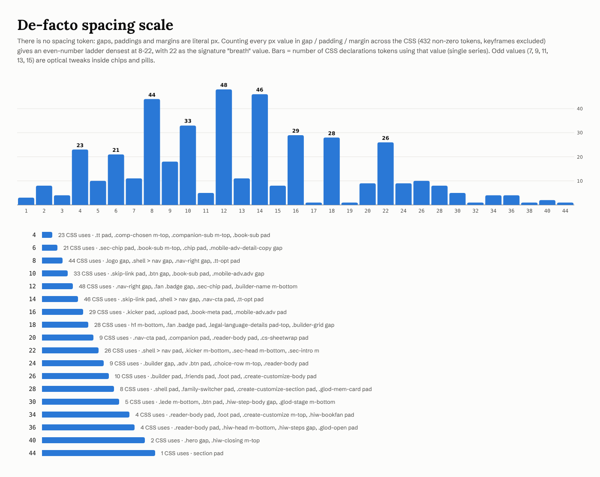
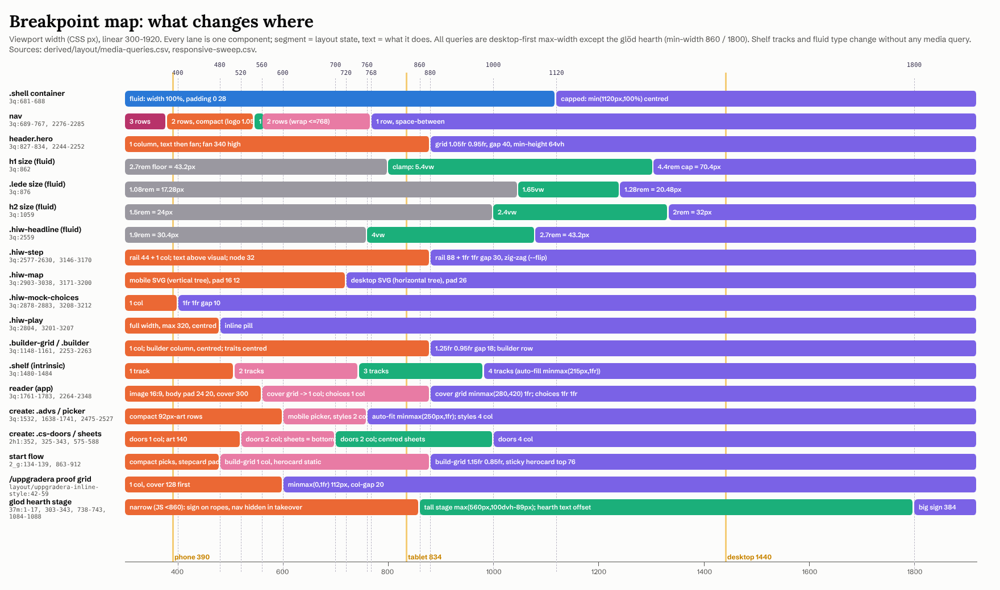

# Tale Forge: Layout, spacing and responsive behaviour

Tale Forge lays everything out in one centred column, `min(1120px, 100%)` wide with a fixed 28px gutter. The column floats over a fixed full-viewport backdrop: a night nebula or a morning watercolour.
Inside the column there are only a few grid recipes. Each is a near-even two-column split (1.05fr/0.95fr, 1fr/1fr, 1.25fr/0.95fr), and every one of them collapses to a single column at **880px**. Breakpoints at 400, 480, 520, 560, 600, 700, 720, 760, 768, 859/860, 1000 and 1800 handle individual components only.
Spacing is literal px with no tokens. In practice it is an even ladder from 4 to 44, with 22 used for section heads and inner card padding and 44 used to open each section.
Book covers are framed 2:3 cards with thick frame borders and long soft shadows. They sit at a tilt of -8°/+7° and float slowly. Pills (999px) and 26px glass cards make up the rest of the furniture.
Everything below is copied from the shipped CSS with line numbers, read from the hydrated DOM, or measured live with Playwright. Interpretation is marked **Read:**.

## Contents

1. [Layout character (Read)](#1-layout-character-read)
2. [Files produced for this dimension](#2-files-produced-for-this-dimension)
3. [The page skeleton: layers, shell, nav, main, foot](#3-the-page-skeleton-layers-shell-nav-main-foot)
4. [Containers, column widths and text measures](#4-containers-column-widths-and-text-measures)
5. [Home, section by section (desktop 1440)](#5-home-section-by-section-desktop-1440)
6. [Vertical rhythm, measured](#6-vertical-rhythm-measured)
7. [The single-column pages: /uppgradera, /login, /signup, legal, 404, /start](#7-the-single-column-pages-uppgradera-login-signup-legal-404-start)
8. [The de-facto spacing scale](#8-the-de-facto-spacing-scale)
9. [Border-radius scale](#9-border-radius-scale)
10. [Elevation: shadows and hover lifts](#10-elevation-shadows-and-hover-lifts)
11. [Z-index layers](#11-z-index-layers)
12. [Backdrop blur](#12-backdrop-blur)
13. [Aspect ratios](#13-aspect-ratios)
14. [Tilt and rotation: the "physical book" vocabulary](#14-tilt-and-rotation-the-physical-book-vocabulary)
15. [Tap targets](#15-tap-targets)
16. [Breakpoints: every @media block](#16-breakpoints-every-media-block)
17. [Responsive reflow, measured (desktop, tablet, mobile)](#17-responsive-reflow-measured-desktop-tablet-mobile)
18. [App screens we can only read from CSS](#18-app-screens-we-can-only-read-from-css)
19. [Reproducing the layout (web and film)](#19-reproducing-the-layout-web-and-film)
20. [Caveats and open questions](#20-caveats-and-open-questions)

---

## 1. Layout character (Read)

- **One centred column on a fixed plate.** All content lives in `.shell` (max 1120, content 1064), which scrolls over a `position: fixed` backdrop 100lvh tall ([3q17cp_jgfwol.pretty.css:612-622](../source/css/3q17cp_jgfwol.pretty.css), [:681-688](../source/css/3q17cp_jgfwol.pretty.css)). Mid-page the nebula is still behind the cards ([home-desktop-scrolled-1700__viewport.png](../derived/layout/home-desktop-scrolled-1700__viewport.png)). Read: the page feels like a lit stage set, and the cards are props in front of it.
- **Airy, but with a steady beat.** Sections open with 44px of air and close with 8px. Steps are 36px apart. Section heads sit 22px above their content. At 1440 the hero takes 64vh, so the first section's headline "Äventyr värda att prata om." ["Adventures worth talking about."] already shows in the fold ([home__sv__natt__desktop__fold.png](../screenshots/pages/home/home__sv__natt__desktop__fold.png)). Read: generous, but never empty. The rhythm units repeat (22, 36, 44), so long scrolls feel calm.
- **Editorial, near-even splits.** The column ratios are 1.05/0.95 (hero), 1/1 (steps), 1.25/0.95 (builder) and 1.15/0.85 (start builder). None is 2/1 or 1/3. Read: two-page-spread proportions. Text and picture weigh about the same, and text gets a slight edge.
- **Zig-zag storytelling.** The six "Så fungerar det" ["How it works"] steps alternate text|picture and picture|text (`.hiw-step--flip`). A dashed vertical rail with numbered gold nodes ties them together like a path through the book ([:2577-2630](../source/css/3q17cp_jgfwol.pretty.css)).
- **Physical objects, not flat tiles.** Covers are framed with a 3-6px border in `--frame`. They are always 2:3, tilted -8°/+7° (cards in a fan ±4-7°, paper tags 2.5°), and they bob on 7/8/9-second loops. Hover lifts a shelf book 10px and tips it 1°. Read: picture books treated as objects on a table, with UI cards as glass panes around them.
- **Rounded, soft, no hard edges.** Controls are 999px pills, cards are 26px, frames are 20-32px. Shadows are long and low, tinted navy (night) or plum (morning), and buttons get a coloured glow.
- **No phone-specific design.** Below 880px the same parts stack in reading order. The gutter stays 28px, and all the spacing units stay the same. Only the nav, the toggle and a few controls get compact variants.

## 2. Files produced for this dimension

| File | What it is |
|---|---|
| [tokens/layout.json](../tokens/layout.json) | Machine-readable layout tokens: containers, spacing (scale, frequencies, semantic map), grids, breakpoints (explicit + implicit), radii, elevation (natt/morgon/fixed), z-index, blur, aspect ratios, tap targets, transforms, frames, measured rhythm. Every entry cites its source. |
| [derived/layout/home-desktop-annotated.png](../derived/layout/home-desktop-annotated.png) | Full home page at 1440 (1870 x 5324 including header and gutter). Shows the container and content box, the 28px gutters, nav, the hero's 1.05/0.95 columns and 40 gap, the hero text stack spacings, the fan's rotated cards with z-order, section bounds and paddings, the HIW rail, step columns, 36px step gaps and per-step notes, the builder 1.25/0.95 split, the shelf's four auto-fill tracks and the foot, plus a vertical-rhythm table. |
| [derived/layout/home-mobile-annotated.png](../derived/layout/home-mobile-annotated.png) | Full home page at 390 (captured @2x, drawn @1x), cut into five columns at section boundaries. Shows the 28px gutters, the two-row nav, the stacked hero, the 340px fan with tilted cards, the 44px rail, text-above-visual steps, the mobile map SVG, stacked CTAs, the centred builder, the single-track shelf, and numbered stacking order. |
| [derived/layout/home-tablet-annotated.png](../derived/layout/home-tablet-annotated.png) | Home at 834 (y 0-2111): the phone structure in a 778px column. Single-line h1, wide 340px fan whose cards drift apart, 734px step bodies. |
| [derived/layout/uppgradera-annotated.png](../derived/layout/uppgradera-annotated.png) | /uppgradera at 1440 and 390 side by side: the centred `min(560px,100%)` column, glass cards (padding 28, mb 20, r 26), the `minmax(0,1fr) 112px` proof grid and its 600px collapse, pill toggles, and the pinned foot. |
| [derived/layout/tilt-geometry.png](../derived/layout/tilt-geometry.png) | Rotation geometry of the hero fan, the step 3 card fan and the step 6 book fan (rotated vs unrotated outlines, centres, angle arcs), plus a table of every resting rotation in the CSS. |
| [derived/layout/home-reflow-strip.png](../derived/layout/home-reflow-strip.png) | The home fold at 1920, 1440, 1120, 1024, 881, 880, 834, 768, 720, 560, 390 and 320, all at the same height. |
| [derived/layout/breakpoint-map.png](../derived/layout/breakpoint-map.png) | One lane per component across viewport widths 300-1920. Each lane shows the layout states and what changes, including fluid-type ranges, intrinsic shelf tracks and the measured nav-row thresholds. |
| [derived/layout/film-frames-guides.png](../derived/layout/film-frames-guides.png) | The live site captured at 1920x1080 and 1080x1920, with the column, hero and fan guides given as % of frame. |
| [derived/layout/spacing-scale.png](../derived/layout/spacing-scale.png) | Frequency bar chart of every px value in gap/padding/margin, plus the 4-44 ladder with each value's CSS-use count and example selectors. |
| [derived/layout/radius-scale.png](../derived/layout/radius-scale.png) | The radius ladder drawn at true size as natt glass tiles, labelled by role and selector. |
| [derived/layout/elevation-scale__natt.png](../derived/layout/elevation-scale__natt.png), [__morgon](../derived/layout/elevation-scale__morgon.png) | Each shadow rendered on the real backdrop, with its literal value. |
| [derived/layout/backdrop-blur-scale.png](../derived/layout/backdrop-blur-scale.png) | Glass tiles at each backdrop-filter value (0-24px) over the nebula. |
| [derived/layout/z-index-layers.png](../derived/layout/z-index-layers.png) | The z-index ladder (-1 to 1000) with the selectors on each level. |
| [derived/layout/home-desktop-scrolled-1700__viewport.png](../derived/layout/home-desktop-scrolled-1700__viewport.png) | Viewport at scrollY 1700. It shows the fixed backdrop and that the nav is not sticky. |
| [derived/layout/css-layout-declarations.csv](../derived/layout/css-layout-declarations.csv) | All 1,981 layout-relevant declarations (display, position, box model, grid/flex, radius, shadow, z, filters, transforms, aspect) with `file:line`, at-rule and selector. |
| [derived/layout/media-queries.csv](../derived/layout/media-queries.csv) | All 31 `@media` blocks: file, line range, query, selectors, and every declaration inside. |
| [derived/layout/responsive-sweep.csv](../derived/layout/responsive-sweep.csv) | Key metrics measured on home at 35 widths from 1920 to 320. |
| [derived/layout/uppgradera-inline-style.pretty.css](../derived/layout/uppgradera-inline-style.pretty.css) | The `<style>` block shipped inline in the /uppgradera HTML, extracted verbatim and formatted (not part of the four CSS chunks). |
| [derived/layout/inventory/](../derived/layout/inventory/) | Inventories: `spacing-declarations.csv` (933 tokens from CSS, hydrated-DOM inline styles and JS inline styles), `radius-inventory.csv`, `shadow-inventory.csv`, `blur-inventory.csv`, `z-index-inventory.csv`, `transform-inventory.csv`, `aspect-ratio-inventory.csv`, `tap-target-inventory.csv`, `container-width-inventory.csv`, `html-inline-layout-styles.csv`, `js-inline-layout-styles.csv`. |
| [derived/layout/measurements/](../derived/layout/measurements/) | Fresh Playwright box measurements (rect, offset size, computed box styles): home at 1440/834/390/1920x1080/1080x1920, uppgradera 1440/390, start 1440/390, login 1440, integritet 1440. |

How the measurements were made: Playwright opened https://tale-forge.app with cookie `tf_locale=sv` and `localStorage tf-theme=natt`. It scrolled through the page once so every `.reveal` got `.in`, then paused every running animation at `currentTime = 0` (rest pose). Page heights match the harvested screenshots exactly (home desktop 4994, tablet 6663, mobile 7848 CSS px), so the fresh boxes line up with the library screenshots. The overlays use these fresh captures because the harvested ones caught the floating cards mid-bob.

## 3. The page skeleton: layers, shell, nav, main, foot

The DOM skeleton is the same on every page (hydrated DOM, [dom__home__sv.html](../source/rendered/dom__home__sv.html)):

```
body[data-theme]
├── div.bg.bg-night   (img + .scrim + .starfield)     fixed, z 0
├── div.bg.bg-day     (picture > img)                 fixed, z 0 (opacity crossfade)
└── div.wrap                                          relative, z 1
    └── div.shell                                     flex column, min-height 100dvh
        ├── a.skip-link                               fixed, z 1000, hidden until focus
        ├── nav            (a.logo | div.nav-right)
        ├── main#main-content   (page content)
        └── div.foot       margin-top:auto -> pinned to bottom
```

Literal CSS ([3q17cp_jgfwol.pretty.css:591-622, 677-695](../source/css/3q17cp_jgfwol.pretty.css)):

```css
* { box-sizing: border-box; margin: 0; }
html { scroll-behavior: smooth; }
body { color: var(--page-ink); font-family: var(--ui); background: #171232; overflow-x: hidden; /* + theme transitions */ }
.bg { z-index: 0; pointer-events: none; height: 100lvh; position: fixed; top: 0; left: 0; right: 0;
      transition: opacity var(--theme-transition-duration) var(--theme-transition-easing); }
.wrap { z-index: 1; position: relative; }
.shell { flex-direction: column; width: min(1120px, 100%); min-height: 100dvh; margin: 0 auto; padding: 0 28px; display: flex; }
.shell > nav { justify-content: space-between; align-items: center; gap: 14px; padding: 22px 0; display: flex; }
```

Foot ([:1933-1944](../source/css/3q17cp_jgfwol.pretty.css)):

```css
.foot { border-top: 1px solid var(--card-line); color: var(--foot-ink); flex-wrap: wrap; justify-content: space-between;
        gap: 16px; margin-top: auto; padding: 26px 0 34px; font-size: 0.9rem; display: flex; }
```

Observed:
- The **nav is static**. It scrolls away with the page and is never sticky ([home-desktop-scrolled-1700__viewport.png](../derived/layout/home-desktop-scrolled-1700__viewport.png)). It is 96px tall at desktop (22 + 52 + 22). The right cluster has gap 12 and contains, inline-styled per [source/js/390j9gbq0u9ce.js](../source/js/390j9gbq0u9ce.js): two 44px-high pill links ("Logga in" ["Log in"], "Priser" ["Pricing"]; `padding:0 10px; border:1.5px solid var(--card-line); border-radius:999px`), the language switcher (`padding:3px; gap:2px`, two 44x44 buttons) and the theme toggle `.tt` (`min-height:44px; padding:4px`, thumb `calc(50% - 4px)`) ([:768-826](../source/css/3q17cp_jgfwol.pretty.css)).
- The **foot** is pushed to the bottom of short pages by `margin-top:auto` inside the 100dvh flex column. On /login at 1440 the foot gets a 37.7px auto margin and on /start 73px ([measurements/login__sv__natt__1440.json](../derived/layout/measurements/login__sv__natt__1440.json), [start__sv__natt__1440.json](../derived/layout/measurements/start__sv__natt__1440.json)).
- **Full-page screenshot artefact.** The `.bg` plate is fixed and 100lvh tall, so in full-page captures it only covers the first viewport and the rest of the page shows flat `#171232`/`#ede9f6` (e.g. [home__sv__natt__desktop__full.webp](../screenshots/pages/home/home__sv__natt__desktop__full.webp)). On a live screen the plate is always behind the content.
- **Theme has no effect on layout.** natt and morgon give identical page heights for every page and viewport (all `screenshots/pages/*/*__full.webp` pairs). Only `--card-blur` (22 vs 24px) and the shadow tokens differ ([:500, :549](../source/css/3q17cp_jgfwol.pretty.css)).
- **Language does affect layout.** English copy runs longer on small screens: home mobile is 7848 CSS px in sv and 8018 in en, tablet 6663 vs 6691, and desktop is 4994 in both.

## 4. Containers, column widths and text measures

| Container | Rule | Width at 1440 | Where | Source |
|---|---|---|---|---|
| `.shell` | `width: min(1120px, 100%); margin: 0 auto; padding: 0 28px` | 1120 (content 1064, x 188-1252) | every page | [3q17cp:681-688](../source/css/3q17cp_jgfwol.pretty.css) |
| `.family-switcher` | `width: min(1120px, 100%); padding: 14px 28px 0` | 1120 | signed-in family bar | [3q17cp:1547-1554](../source/css/3q17cp_jgfwol.pretty.css) |
| Auth / 404 card | inline `width:min(440px, 100%); padding:34px` | 440 | /login, /signup, 404 | [dom__login__sv.html](../source/rendered/dom__login__sv.html), [js/1hcx0qn-qjgfn.js](../source/js/1hcx0qn-qjgfn.js) |
| Pricing column | inline `width:min(560px, 100%)`; cards `padding:28px; margin-bottom:20px` | 560 | /uppgradera | [dom__uppgradera__sv.html](../source/rendered/dom__uppgradera__sv.html), [js/26ye0kuppitcn.js](../source/js/26ye0kuppitcn.js) |
| Legal article | inline `width:min(760px, 100%); padding:34px` | 760 | /integritet, /villkor | [dom__integritet__sv.html](../source/rendered/dom__integritet__sv.html) |
| Start step card | inline `maxWidth:"600px"; padding:"28px 22px"` / `.stepcard max-width:560px` | 600 / 560 | /start flow | [js/0ad0wel9cyv30.js](../source/js/0ad0wel9cyv30.js), [2_gt301v4m-60:44-51](../source/css/2_gt301v4m-60.pretty.css) |
| `.start-flow .launch` | `max-width: 980px` | 980 | adventure launcher | [2_gt301v4m-60:551-554](../source/css/2_gt301v4m-60.pretty.css) |
| Reader feedback | inline `width:"min(680px, 100%)"` | 680 | reader | [js/36tbz-w9v-p8v.js](../source/js/36tbz-w9v-p8v.js) |
| Modal sheets | `.cs-sheet min(100%, 560px)`; style 920, voice 760, companion 820, language 420; `.start-flow .sheet max-width 440` | — | create flow | [2h1wwdz1nvxwk:252-272](../source/css/2h1wwdz1nvxwk.pretty.css), [2_gt301v4m-60:764-772](../source/css/2_gt301v4m-60.pretty.css) |

**Centred column widths in use: 440 · 560 · 600 · 680 · 760 · 980 · 1120.** Read: each step is a book-ish proportion. Narrow forms use 440, a reading column 560-760, and the full stage 1120.

**Text measures (`max-width` in ch):** `.lede` 46ch (498px at 1440), `.cs-lede` 46ch, `.hiw-step-copy` 52ch (449px), `.hiw-lede` 56ch (521px), `.companion-sub` 56ch, `.start-flow .honest` 60ch, `.sec-intro` 62ch, `.hiw-caption` 72ch (578px), `.veil-caption` 26ch, `.reveal-line` 34ch ([3q17cp:874, :1050, :1475, :2565, :2641, :2912](../source/css/3q17cp_jgfwol.pretty.css); [2h1:73](../source/css/2h1wwdz1nvxwk.pretty.css); [2_gt:428, :447, :634](../source/css/2_gt301v4m-60.pretty.css)). Read: copy is held to 45-60 characters even inside a 473-1064px column, so paragraphs never run the full width. This is a big part of the airy look.

## 5. Home, section by section (desktop 1440)


All numbers below come from [measurements/home__sv__natt__1440.json](../derived/layout/measurements/home__sv__natt__1440.json) unless a CSS line is cited. Coordinates are `[x, y, w, h]` in document CSS px.

### 5.1 Nav (y 0-96)
`.logo` 261x42: 42px mark (`.logo img` 42x42, `filter: drop-shadow(0 0 14px #f5c54280)`), gap 13, Cinzel wordmark 1.72rem with letter-spacing 3px ([3q17cp:696-716](../source/css/3q17cp_jgfwol.pretty.css)). `.nav-right` is [783, 22, 469, 52] and the toggle `.tt` is [1053, 26, 199, 45]. Crop: [screenshots/home-sections/sv__natt__desktop/01_nav.png](../screenshots/home-sections/sv__natt__desktop/01_nav.png).

### 5.2 Hero `header.hero` (y 96-672)

```css
.hero { grid-template-columns: 1.05fr 0.95fr; align-items: center; gap: 40px; min-height: 64vh; padding: 4vh 0 2vh; display: grid; }   /* 3q17cp:827-834 */
.kicker { … border-radius: 999px; gap: 8px; margin-bottom: 22px; padding: 8px 16px; display: inline-flex; }        /* :835-850 */
h1 { margin-bottom: 18px; font-size: clamp(2.7rem, 5.4vw, 4.4rem); line-height: 1.06; text-wrap: balance; }      /* :855-866 */
.lede { max-width: 46ch; margin-bottom: 30px; font-size: clamp(1.08rem, 1.65vw, 1.28rem); line-height: 1.65; }   /* :871-879 */
.cta-row { flex-wrap: wrap; align-items: center; gap: 14px; display: flex; }                                     /* :880-885 */
.cta-row--microcopy { align-items: flex-start; }  .cta-primary-col { flex-direction: column; align-items: flex-start; gap: 10px; display: flex; }  /* :3132-3140 */
```

| Part | Measured |
|---|---|
| Hero box | [188, 96, 1064, 576] = 64vh of 900; padding 36 / 18 (4vh / 2vh) |
| Columns | 537.594 + 40 + 486.391 (50.5% / 3.8% / 45.7% of content) |
| Text block | [188, 140, 538, 507], vertically centred (align-items:center) |
| Kicker → h1 → lede → CTA | 35 tall, +22, h1 149 (2 lines at 70.4px), +18, lede 101 (3 lines), +30, cta-row 151 |
| CTAs | primary 183x54 at y 495, with microcopy 10px below. Ghost 203x56 **wraps to a second line** at y 590 (14 gap): the microcopy column (413 wide) plus the ghost button do not fit in 538. |
| Fan stage | `.fan` [766, 132, 486, 522], `height: min(58vh, 540px)` |

Read: the CTA wrap at 1440 is a by-product of the microcopy column, not a design choice. The ghost button lands under the primary instead of beside it ([home__sv__natt__desktop__fold.png](../screenshots/pages/home/home__sv__natt__desktop__fold.png)).

### 5.3 The fan (hero books)

```css
.fan { height: min(58vh, 540px); position: relative; }                                                  /* 3q17cp:925-928 */
.fan .fbook { border: 5px solid var(--frame); border-radius: 20px; width: min(46%, 240px); position: absolute; overflow: hidden;
              box-shadow: 0 24px 50px #0a072066, 0 0 44px #f5c5421f;
              transition: transform 0.5s cubic-bezier(0.2, 0.7, 0.3, 1.2), border-color 0.5s; }           /* :929-941 */
.fan .fbook img { aspect-ratio: 2/3; object-fit: cover; width: 100%; display: block; }                   /* :942-947 */
.fb1 { z-index: 1; animation: 7s ease-in-out infinite float1; top: 10%; left: 6%; transform: rotate(-8deg); }   /* :948-954 */
.fb2 { z-index: 2; animation: 8s ease-in-out infinite float2; top: 2%; right: 8%; transform: rotate(7deg); }    /* :955-961 */
.fan .badge { z-index: 3; … border-radius: 18px; gap: 12px; padding: 14px 18px; animation: 9s ease-in-out infinite floatBadge;
              display: flex; position: absolute; bottom: 23%; right: 9%; }                              /* :980-1000 */
```

Measured at rest: each card is 224x331 (offset size, border included), so the image is 214x321. The rotated bounding boxes are fb1 [773, 170, 268, 359] and fb2 [970, 130, 262, 355]. The badge is 204x66, rotated 2.5°. Computed matrices give exactly -8.00°, +7.00° and +2.50°. Geometry: [tilt-geometry.png](../derived/layout/tilt-geometry.png).

### 5.4 "Så fungerar det" (section.hiw, y 672-3855)

```css
section { padding: 44px 0 8px; }                                              /* 3q17cp:1038-1040 */
.hiw { scroll-margin-top: 24px; position: relative; }                         /* :2528-2531 */
.hiw-head { margin-bottom: 36px; }                                            /* :2538-2540 */
.hiw-kicker { … letter-spacing: 2px; border-radius: 999px; margin-bottom: 16px; padding: 7px 14px; }   /* :2541-2553 */
.hiw-headline { margin-bottom: 12px; font-size: clamp(1.9rem, 4vw, 2.7rem); }                         /* :2554-2561 */
.hiw-steps { flex-direction: column; gap: 36px; margin: 0; padding: 0; list-style: none; display: flex; }  /* :2569-2576 */
.hiw-step { grid-template-columns: 88px 1fr; display: grid; }                 /* :2577-2580 */
.hiw-rail-col:before { content: ""; border-left: 2px dashed var(--dash-line); position: absolute; top: 48px; bottom: -44px; left: 50%; transform: translate(-1px); }  /* :2587-2595 */
.hiw-node { … width: 40px; height: 40px; border-radius: 50%; z-index: 1; }    /* :2599-2613 */
.hiw-step-body { grid-template-columns: 1fr 1fr; align-items: center; gap: 30px; min-width: 0; display: grid; }   /* :2614-2620 */
.hiw-step--flip .hiw-step-text { order: 2; }  .hiw-step--flip .hiw-step-visual { order: 1; }   /* :2621-2626 */
.hiw-step--wide .hiw-step-body { grid-template-columns: 1fr; align-items: stretch; }          /* :2627-2630 */
.hiw-card { padding: 22px; }                                                  /* :2664-2666 */
```

| Step | Layout | Height | Visual |
|---|---|---|---|
| 1 "Bygg er hjälte" ["Build your hero"] | text \| visual | 410 | portrait card: `.hiw-frame` `width: min(250px,100%); padding:10px; r 24` + "Skapad med AI" ["Made with AI"] chip absolute bottom 18 left 18 |
| 2 "Ta med en vän" ["Bring a friend"] (--flip) | visual \| text | 190 | friend rows (36px avatars, gap 12) + dashed invite slot (min-height 44, r 14) |
| 3 "Välj kvällens äventyr" ["Choose tonight's adventure"] | text \| visual | 214 | `.hiw-fan` three 34%/36% cards + 8px progress bar |
| 4 "Läs och välj" ["Read and choose"] (--flip) | visual \| text | 597 | play row (48px pill + voice chip) + reader mock (image 3:2, prose, choices `1fr 1fr` gap 10) |
| 5 "Fyra olika slut" ["Four different endings"] (--wide) | text above, full-width visual | 887 | map card 976x573, padding 26; stage 922x519 |
| 6 "Världen minns" ["The world remembers"] (--last) | text \| visual | 347 | `.hiw-bookfan` (covers 38%, next-book 34%, memory tag) |

Columns measured: rail 88, body 976 = 473 + 30 + 473. Nodes are 40x40 at x 212 (centred in the rail). The dashed rail runs from 8px below each node to 8px into the next step. The next node covers it there, because the node has z-index 1. `align-items:center` puts short text blocks at the vertical middle of tall visuals (steps 1 and 4: the text starts 128 and 222px below the step top). Read: this is what makes the zig-zag feel staggered rather than boxed.

Map hotspots: `.hiw-map-btn` is `aspect-ratio:1; width:9.6%; min 44x44; translate(-50%,-50%)` at `left:89.2%` and `top: 13.3 / 37.8 / 62.2 / 86.7%` (89x89 measured), and the medallions sit on a 4-row grid ([:3006-3038](../source/css/3q17cp_jgfwol.pretty.css)).

Closing CTAs: `.hiw-closing { flex-wrap: wrap; justify-content: center; gap: 14px; margin-top: 40px }` ([:3124-3131](../source/css/3q17cp_jgfwol.pretty.css)). These are the only centred buttons on the home page.

### 5.5 "Din hjälte" ["Your hero"] (y 3855-4308)

```css
.sec-head { align-items: center; gap: 14px; margin-bottom: 22px; display: flex; }   /* 3q17cp:1041-1046 */
.builder-grid { grid-template-columns: 1.25fr 0.95fr; gap: 18px; display: grid; }  /* :1148-1152 */
.builder { align-items: flex-start; gap: 24px; padding: 26px; display: flex; }       /* :1156-1161 */
.builder-pic .pframe { border: 4px solid var(--frame); border-radius: 30px; width: 158px; height: 158px; box-shadow: 0 16px 36px #0a07204d; }  /* :1167-1176 */
.builder-pic .fab { width: 42px; height: 42px; border-radius: 50%; position: absolute; bottom: -8px; right: -8px; }   /* :1185-1202 */
.trait-row { flex-wrap: wrap; gap: 9px; margin-bottom: 18px; display: flex; }        /* :1217-1222 */
.friends { flex-direction: column; gap: 14px; padding: 26px; display: flex; }        /* :1284-1289 */
```

Measured: builder 594.3 | 18 | friends 451.7, both 308 tall. The intro line is inline-styled `margin:-12px 0 20px` ([dom__home__sv.html](../source/rendered/dom__home__sv.html)), which pulls it into the 22px sec-head margin.

### 5.6 "Bokhyllan" ["The bookshelf"] (y 4308-4891)

```css
.shelf { grid-template-columns: repeat(auto-fill, minmax(215px, 1fr)); gap: 22px; display: grid; }   /* 3q17cp:1480-1484 */
.book { border: 5px solid var(--frame); border-radius: 22px; box-shadow: var(--card-shadow); overflow: hidden; }   /* :1485-1500 */
.book:hover { transform: translateY(-10px) rotate(-1deg); }                                          /* :1501-1503 */
.book-meta { padding: 14px 16px 16px; }                                                              /* :1510-1512 */
```

Measured: four tracks of 249.5px with three 22px gaps. Only two books are filled (250x468 each; cover 240x359), so half the row is deliberately empty. Read: an unfilled shelf invites "make the next book".

### 5.7 Foot (y 4891-4994)
Two flex groups, wrapped: the brand line plus a "Beta" pill (`padding:2px 7px; r 999px`), and the company line plus three links (`gap:16px`). These are inline styles in [dom__home__sv.html](../source/rendered/dom__home__sv.html).

## 6. Vertical rhythm, measured

| Block | desktop 1440: y / h | tablet 834: y / h | mobile 390: y / h |
|---|---|---|---|
| nav | 0 / 96 | 0 / 96 | 0 / 116 (2 rows) |
| header.hero | 96 / 576 | 96 / 763 | 116 / 909 |
| section.hiw | 672 / 3183 | 859 / 4209 | 1025 / 4397 |
| section "Din hjälte" | 3855 / 453 | 5068 / 892 | 5422 / 961 |
| section "Bokhyllan" | 4308 / 583 | 5960 / 566 | 6384 / 1276 |
| div.foot | 4891 / 103 | 6526 / 137 | 7659 / 189 |
| **page height** | **4994** | **6663** | **7848** |

Sources: [measurements/home__sv__natt__1440.json](../derived/layout/measurements/home__sv__natt__1440.json), [__834](../derived/layout/measurements/home__sv__natt__834.json), [__390](../derived/layout/measurements/home__sv__natt__390.json). Step heights at 1440 are 410, 190, 214, 597, 887 and 347.

Rhythm units, all viewport-independent except the hero's vh padding:
- **52** between sections (8 bottom + 44 top). Sections have no margins.
- **36** between HIW steps and below `.hiw-head`.
- **40** above the HIW closing CTAs. **40** also separates hero text from the fan.
- **22** below every `.sec-head`, below the hero kicker, and as nav padding.
- **18/30** inside the hero text stack (h1 mb / lede mb).

Read: three nested beats. 44-52 marks a new chapter, 36-40 a new step, and 18-22 a new element. The page never uses a fixed spacing value above 44px (only the vh-based hero padding grows on tall screens), so the whitespace comes from narrow text measures and empty grid tracks rather than from big gaps.

## 7. The single-column pages: /uppgradera, /login, /signup, legal, 404, /start


All of these pages use one inline-styled template:

```html
<section style="flex:1;display:grid;place-items:center;padding:36px 0">
  <div style="width:min(560px, 100%)">                     <!-- 440 auth/404, 760 legal -->
    <div class="glass" style="width:min(560px, 100%);padding:28px;margin-bottom:20px"> … </div>
```

(`flex:1` makes the section fill the shell between nav and foot, and `place-items:center` centres the column horizontally. On short pages it also centres vertically.)

| Page | Column | Card padding | Measured at 1440 | Source |
|---|---|---|---|---|
| /uppgradera | 560 (x 440-1000) | 28; cards 20 apart | cards at y 132 (147 tall), 299 (334), 711 (378); pills between | [measurements/uppgradera__sv__natt__1440.json](../derived/layout/measurements/uppgradera__sv__natt__1440.json) |
| /login | 440 (x 500-940) | 34 | card y 132, 591 tall; inputs 370x50, `r 14`, `padding 14px 14px 14px 44px` | [measurements/login__sv__natt__1440.json](../derived/layout/measurements/login__sv__natt__1440.json) |
| /signup | 440 | 34 | page 1016 tall | [dom__signup__sv.html](../source/rendered/dom__signup__sv.html) |
| /integritet, /villkor | 760 (x 340-1100) | 34 | article 2714 tall | [measurements/integritet__sv__natt__1440.json](../derived/layout/measurements/integritet__sv__natt__1440.json) |
| 404 | 440, `text-align:center` | 34 | — | [dom__404__sv.html](../source/rendered/dom__404__sv.html) |

The /uppgradera "Det här ingår" ["What's included"] card has its own grid. It is shipped as an inline `<style>` (also present in [js/26ye0kuppitcn.js](../source/js/26ye0kuppitcn.js)), extracted to [uppgradera-inline-style.pretty.css](../derived/layout/uppgradera-inline-style.pretty.css):

```css
.upgrade-proof-layout { display: grid; grid-template-columns: minmax(0, 1fr) 112px; column-gap: 20px; align-items: start; }   /* :2-6 */
.upgrade-sample-link { grid-column: 2; grid-row: 1; display: block; width: 112px; max-width: 100%; justify-self: end; … }  /* :14-24 */
@media (max-width: 600px) {
  .upgrade-proof-layout { grid-template-columns: minmax(0, 1fr); row-gap: 16px; }
  .upgrade-sample-link { grid-column: 1; grid-row: 1; width: 128px; justify-self: center; }
  .upgrade-proof-list { grid-column: 1; grid-row: 2; }
}                                                                                                                   /* :42-59 */
```

Measured at 1440: list 370 | 20 | cover 112 (112x168 image, 2:3). At 390 the cover moves above the list and grows to 128 wide. The period toggle ("Månadsvis" / "Årsvis" ["Monthly" / "Yearly"]) is a `.trait-row` of pills outside the cards. Below 880 it is centred by the global `.trait-row { justify-content:center }` ([3q17cp:2261-2263](../source/css/3q17cp_jgfwol.pretty.css)).

**/start** reuses the home hero (`.hero` + `.fan`) inside `section.start-screen`. The extra section padding moves the hero down to y 140, and the start-flow override `.start-flow .cta-row { justify-content: center; gap: 12px }` ([2_gt301v4m-60:857-862](../source/css/2_gt301v4m-60.pretty.css)) centres the CTAs under left-aligned copy. Measured at 1440, the primary button starts at x 228 while the copy starts at x 188 ([start__sv__natt__desktop__fold.png](../screenshots/pages/start/start__sv__natt__desktop__fold.png)). Read: this is a small inconsistency with home, where the CTAs are left-aligned.

## 8. The de-facto spacing scale



There are **no spacing custom properties**. All of the following are literal px. Counting every px token in `gap`, `padding*` and `margin*` across the four CSS files and the /uppgradera inline style gives 432 non-zero tokens (keyframes excluded; source rows in [inventory/spacing-declarations.csv](../derived/layout/inventory/spacing-declarations.csv)):

| px | 1 | 2 | 3 | 4 | 5 | 6 | 7 | 8 | 9 | 10 | 11 | 12 | 13 | 14 | 15 | 16 | 17 | 18 | 19 | 20 | 22 | 24 | 26 | 28 | 30 | 32 | 34 | 36 | 38 | 40 | 44 |
|---|---|---|---|---|---|---|---|---|---|---|---|---|---|---|---|---|---|---|---|---|---|---|---|---|---|---|---|---|---|---|---|
| CSS uses | 3 | 8 | 4 | 23 | 10 | 21 | 11 | **44** | 18 | 33 | 5 | **48** | 11 | **46** | 8 | 29 | 1 | 28 | 1 | 9 | 26 | 9 | 10 | 8 | 5 | 1 | 4 | 4 | 1 | 2 | 1 |

Inline styles add 168 tokens from the hydrated DOM and 102 from JS style objects, with the same shape: 10, 12, 14 and 18 dominate ([inventory/html-inline-layout-styles.csv](../derived/layout/inventory/html-inline-layout-styles.csv), [js-inline-layout-styles.csv](../derived/layout/inventory/js-inline-layout-styles.csv)).

**Scale to use: 4 · 6 · 8 · 10 · 12 · 14 · 16 · 18 · 20 · 22 · 24 · 26 · 28 · 30 · 34 · 36 · 40 · 44.** Odd values (7, 9, 11, 13, 15) appear almost only inside pill and chip padding (`.trait 8px 15px`, `.chip 6px 13px`, `.hiw-ai-chip 5px 11px`), as optical corrections.

Semantic map (what each value is *for*):

| Role | Value | Source |
|---|---|---|
| Page gutter | 28 (all widths) | [3q17cp:686](../source/css/3q17cp_jgfwol.pretty.css) |
| Nav padding-y | 22 (≤560: 14) | [:693, :758](../source/css/3q17cp_jgfwol.pretty.css) |
| Section open / close | 44 / 8 | [:1038-1040](../source/css/3q17cp_jgfwol.pretty.css) |
| Page-template section | 36 0 (inline) | DOM |
| Hero padding | 4vh / 2vh (≤880 top 3vh) | [:832, :2247](../source/css/3q17cp_jgfwol.pretty.css) |
| Big grid gaps | hero 40, step body 30 (≤880: 16), shelf 22, builder 18, advs 18 | [:830, :2617, :1482, :1150, :1534](../source/css/3q17cp_jgfwol.pretty.css) |
| Step gap / head gap | 36 / 36 | [:2571, :2539](../source/css/3q17cp_jgfwol.pretty.css) |
| Section head → content | 22 | [:1044](../source/css/3q17cp_jgfwol.pretty.css) |
| Card padding | 22 (hiw-card, adv), 26 (builder, friends, map), 28 (page cards), 34 (auth/legal) | [:2665, :1159, :1287, :2898](../source/css/3q17cp_jgfwol.pretty.css) |
| Small grids | choice-row 12, mock choices 10, trait-row 9, cs-doors 13, stiles 8 | [:1900, :2880, :1219](../source/css/3q17cp_jgfwol.pretty.css), [2h1:354](../source/css/2h1wwdz1nvxwk.pretty.css), [2_gt:700](../source/css/2_gt301v4m-60.pretty.css) |
| Inline gaps | icon-text 7-10, button groups 12-14 | [:1572, :892, :883](../source/css/3q17cp_jgfwol.pretty.css) |
| Foot | 26 / 34, gap 16 | [:1938-1940](../source/css/3q17cp_jgfwol.pretty.css) |

Read: cards pad inside on a 22-34 band that grows with the card's importance (step card 22, builder 26, page card 28, form or legal page 34). Gaps between siblings run smaller than card padding (9-18), so content groups read as tight clusters inside generous frames.

## 9. Border-radius scale


| Radius | Role | Selectors (examples) |
|---|---|---|
| **999px** | every pill: buttons, chips, kicker, traits, toggle, nav links, language switch, `.hiw-choice`, `.book-sub` | 26 CSS uses, plus all inline nav pills ([radius-inventory.csv](../derived/layout/inventory/radius-inventory.csv)) |
| **50%** | dots, step nodes, FAB, avatars (hiw), map hotspots | `.dotpulse`, `.hiw-node`, `.fab`, `.hiw-friend-row img` |
| 6 | skip link, paper props on the hearth | [3q17cp:478](../source/css/3q17cp_jgfwol.pretty.css), [37m:221, :238, :600](../source/css/37m388zf6rymp.pretty.css) |
| 8 | icon buttons, spine, compact adv art | `.reader-audio-control` [3q17cp:2046](../source/css/3q17cp_jgfwol.pretty.css) |
| 12 | tags, signboard, inline inputs | `.cs-memtag` [2h1:100](../source/css/2h1wwdz1nvxwk.pretty.css), `.glod-board` [37m:93](../source/css/37m388zf6rymp.pretty.css) |
| 14 | small covers, inputs, camera tile, invite slot | `.hiw-fan-card`, `.hiw-cover`, `.upload .cam`, login inputs (inline) |
| 16 | choices, prompts, fields, gallery books | `.choice` [3q17cp:1911](../source/css/3q17cp_jgfwol.pretty.css), `.field` [2_gt:67](../source/css/2_gt301v4m-60.pretty.css) |
| 18 | badges, dashed slots, avatars, panels, picks | `.fan .badge` [3q17cp:988](../source/css/3q17cp_jgfwol.pretty.css), `.upload`, `.friend .avatar` |
| 20 | hero book cards, hiw frame image | `.fan .fbook` [3q17cp:931](../source/css/3q17cp_jgfwol.pretty.css) |
| 22 | shelf books | `.book` [3q17cp:1491](../source/css/3q17cp_jgfwol.pretty.css) |
| 24 | frames, bottom sheets | `.hiw-frame`, `.companion-pic`, `.cs-sheet` ≤700 |
| 25 25 0 0 | art on top of a 26px card (26 minus the 1px border) | `.adv-art` [3q17cp:1627](../source/css/3q17cp_jgfwol.pretty.css) |
| **26** | the card radius | `.glass` [3q17cp:1117](../source/css/3q17cp_jgfwol.pretty.css), `.create-customize`, `.easel`, `.cs-portrait` |
| 28 / 30 / 32 | portrait frames (get rounder as they grow) | `.start-flow .pframe` 28, `.builder-pic .pframe` 30, `.reader` 30, handoff `.pframe` 32 |

Read: **radius grows with object size**, from 6-8 for small chips and icon buttons, through 14-18 for small covers, inputs and badges and 20-22 for book cards, to 26 for every glass card. The square portrait frames are the roundest (28-32), which makes them read as soft photo mounts rather than cards. The one fixed rule is: interactive means pill.

## 10. Elevation: shadows and hover lifts


Theme tokens ([3q17cp:511, :530-531, :536, :538 / :560, :579-580, :585, :587](../source/css/3q17cp_jgfwol.pretty.css)):

| Token | natt | morgon |
|---|---|---|
| `--card-shadow` | `0 18px 44px #0508146b` | `0 4px 12px #241f351a, 0 22px 52px #241f3529` |
| `--btn-shadow` | `0 14px 40px #f5c54247` | `0 14px 34px #6d4fe059` |
| `--btn-shadow-hover` | `0 20px 55px #f5c5426b` | `0 22px 48px #6d4fe073` |
| `--h1-shadow` | `0 2px 30px #0c082859` | `none` |
| `--logo-shadow` | `0 2px 6px #050814cc, 0 0 34px #f5c54273` | `0 1px 2px #241f352e, 0 0 24px #6d4fe052` |

Fixed (theme-independent) shadows make an elevation ladder ([inventory/shadow-inventory.csv](../derived/layout/inventory/shadow-inventory.csv)):

| Level | Value | Used by |
|---|---|---|
| contact | `0 10px 22px #0a072040` | `.friend .avatar` [3q17cp:1309](../source/css/3q17cp_jgfwol.pretty.css) |
| frame | `0 16px 36px #0a07204d` | `.pframe` [:1175](../source/css/3q17cp_jgfwol.pretty.css), [2_gt:229](../source/css/2_gt301v4m-60.pretty.css) |
| card | `--card-shadow` (18/44) | `.glass`, `.book`, `.badge`, covers |
| hero book | `0 24px 50px #0a072066, 0 0 44px #f5c5421f` | `.fan .fbook` [:938-940](../source/css/3q17cp_jgfwol.pretty.css) |
| easel (deepest) | `0 30px 70px #0508148c, 0 0 60px #f5c54224` | `.start-flow .easel` [2_gt:295-297](../source/css/2_gt301v4m-60.pretty.css) |
| violet hover | `0 14px 30px #6d4fe02e` | `.choice:hover` [:1926](../source/css/3q17cp_jgfwol.pretty.css) |
| button highlight | `inset 0 1px 0 #ffffff73` | `.btn-primary`, `.hiw-play` [:910-912](../source/css/3q17cp_jgfwol.pretty.css) |

Hover and active motion lifts are spatial too: `.btn-primary:hover translateY(-3px)`, `.choice:hover translateY(-3px)`, `.hiw-play:hover translateY(-2px)`, `.adv:hover translateY(-6px)`, `.book:hover translateY(-10px) rotate(-1deg)`, `.btn:active scale(0.96)`, `.fab:hover scale(1.1)` ([:905, :916, :1204, :1502, :1545, :1925, :2827](../source/css/3q17cp_jgfwol.pretty.css)). Rest/hover pairs: [screenshots/states/sv__natt/](../screenshots/states/sv__natt/).

Read: shadows always fall straight down (x-offset 0) with a long blur, about 2-3x the y-offset (18/44, 24/50, 16/36, 10/22, 30/70). Nothing has a hard drop shadow. "Important" means a coloured glow (gold at night, violet in the morning), not a darker shadow.

## 11. Z-index layers


| z | Selectors | Source |
|---|---|---|
| -1 | `.glod-ambient` (fixed canvas), `.glod-post`, `.cs-door-face--fallback:before` | [37m:22, :72](../source/css/37m388zf6rymp.pretty.css), [2h1:471](../source/css/2h1wwdz1nvxwk.pretty.css) |
| 0 | `.bg`, takeover `.glod-stage`, `.hiw-cover-next`, `.hiw-next-label` | [3q17cp:613, :3058, :3077](../source/css/3q17cp_jgfwol.pretty.css) |
| 1 | `.wrap`, `.tt-opt`, `.fb1`, `.hiw-node`, `.hiw-fan-1/-3`, `.hiw-cover-1`, `.glod-board > *` | [3q17cp:678, :802, :949, :2606](../source/css/3q17cp_jgfwol.pretty.css) |
| 2 | `.fb2`, `.hiw-fan-2`, `.hiw-cover-2`, `.glod-nail`, `.glod-mem-ember` | [3q17cp:956, :2762, :3069](../source/css/3q17cp_jgfwol.pretty.css) |
| 3 | `.fan .badge`, `.hiw-memory-tag`, `.glod-mem-close` | [3q17cp:981, :3089](../source/css/3q17cp_jgfwol.pretty.css) |
| 4-8 | glöd hearth stage: hearth-box 4, sign 5, active ember / sound 6, memory card / book 7, caption 8 | [37m:62-948](../source/css/37m388zf6rymp.pretty.css) |
| 10 | `body.glod-takeover nav` | [37m:1081](../source/css/37m388zf6rymp.pretty.css) |
| 50 / 60 | `.start-flow .sheetwrap` / `.cs-sheetwrap` (modal scrims) | [2_gt:751](../source/css/2_gt301v4m-60.pretty.css), [2h1:241](../source/css/2h1wwdz1nvxwk.pretty.css) |
| 1000 | `.skip-link` | [3q17cp:474](../source/css/3q17cp_jgfwol.pretty.css) |

Read: two global planes (backdrop 0, page 1) plus small local stacks counted 1-2-3: back object, front object, label. For a film, that means three depth layers per prop group.

## 12. Backdrop blur


| Blur | Where | Source |
|---|---|---|
| `--card-blur` 22px (natt) / 24px (morgon) | `.glass`, `.fan .badge`, `.hiw-memory-tag`, `.create-customize` | [3q17cp:500, :549, :983, :1112, :2391, :3091](../source/css/3q17cp_jgfwol.pretty.css) |
| 14px | `.btn-ghost` | [:922-923](../source/css/3q17cp_jgfwol.pretty.css) |
| 10px | `.kicker`, `.sec-chip`, `.hiw-ai-chip` | [:839, :1091, :2687](../source/css/3q17cp_jgfwol.pretty.css) |
| 8px | painting veil over the portrait | [2_gt:239](../source/css/2_gt301v4m-60.pretty.css) |
| 6px | modal scrims (`#0a081980`) | [2h1:242](../source/css/2h1wwdz1nvxwk.pretty.css), [2_gt:752](../source/css/2_gt301v4m-60.pretty.css) |
| 4px | `.glod-sound` | [37m:779](../source/css/37m388zf6rymp.pretty.css) |
| filter blur 26px + scale 1.18 | reader art background (blurred copy of the illustration behind a contained one) | [3q17cp:1784-1793](../source/css/3q17cp_jgfwol.pretty.css) |
| filter 26 → 20 → 7 → 0 | start-flow "easel" reveal phases | [2_gt:301-336](../source/css/2_gt301v4m-60.pretty.css) |

Read: blur goes up with surface size. Chips use 10, buttons 14, cards 22-24, and the whole-screen scrims only 6, so the page behind a modal stays readable.

## 13. Aspect ratios

| Ratio | Object | Source |
|---|---|---|
| **2:3** (art files 848x1264) | every book cover: hero fan, shelf, step 6, gallery, /uppgradera thumb | [3q17cp:943, :1505, :3047](../source/css/3q17cp_jgfwol.pretty.css), [2_gt:32](../source/css/2_gt301v4m-60.pretty.css), inline `aspectRatio:"2 / 3"` |
| **1264/848 ≈ 3:2** | reader scene image (≤560: 16:9) | [3q17cp:1766, :2081, :2302](../source/css/3q17cp_jgfwol.pretty.css) |
| 848/1264 | reader cover, keepsake cover | [:1777, :2112](../source/css/3q17cp_jgfwol.pretty.css) |
| **3:2** | landing reader mock image (471x314 at 1440) | [:2858](../source/css/3q17cp_jgfwol.pretty.css) |
| 16:9 | adventure card art | [:1626](../source/css/3q17cp_jgfwol.pretty.css), [2_gt:660](../source/css/2_gt301v4m-60.pretty.css) |
| 3:4 | start-flow easel | [2_gt:288](../source/css/2_gt301v4m-60.pretty.css) |
| 1:1 | map hotspots, hero canvas placeholder, 158px portrait frame | [:3007](../source/css/3q17cp_jgfwol.pretty.css), [2h1:595](../source/css/2h1wwdz1nvxwk.pretty.css) |
| 922x519 (≈16:9) | map stage, measured | [measurements/home__sv__natt__1440.json](../derived/layout/measurements/home__sv__natt__1440.json) |

The sample-book scene art (`assets/share/iris-sparade-platsen/assets/S1.webp` …) and `cover.webp` are drawn at 1264x848 and 848x1264. CSS matches these ratios exactly instead of rounding them.

## 14. Tilt and rotation: the "physical book" vocabulary


| Rotation | Object | Source |
|---|---|---|
| **-8°** | hero book 1 (`.fb1`), floats to -8.6° and -12px over 7s | [3q17cp:953, :962-970](../source/css/3q17cp_jgfwol.pretty.css) |
| **+7°** | hero book 2 (`.fb2`), floats to 7.6° and -16px over 8s | [:960, :971-979](../source/css/3q17cp_jgfwol.pretty.css) |
| **+2.5°** | hero badge (floatBadge 2.5 → 3°, -7px, 9s); step 6 memory tag (static) | [:1001-1009, :3104](../source/css/3q17cp_jgfwol.pretty.css) |
| -7° / +6° (+ translate ±6%) | step 6 covers | [:3064-3071](../source/css/3q17cp_jgfwol.pretty.css) |
| -4° / 0 / +4° (+ translate ±10%) | step 3 adventure cards | [:2757-2769](../source/css/3q17cp_jgfwol.pretty.css) |
| -1° | `.book:hover` (with -10px), `.cs-memtag` | [:1502](../source/css/3q17cp_jgfwol.pretty.css), [2h1:107](../source/css/2h1wwdz1nvxwk.pretty.css) |
| -1.3, ±1-1.4, +0.6, +1.6, -1.2, -0.6, -0.7 | glöd hearth props: signboard, posts, note, memory card, book, open button, narrow board | [37m:83-1050](../source/css/37m388zf6rymp.pretty.css) |

All rotations pivot about the element centre (no `transform-origin` is set except `.map-medallion`). The three float periods (7, 8 and 9 s) are pairwise coprime, so the fan only repeats its exact pose every 504 s. Read: this looks organic and avoids a visible loop. Tilt magnitude follows how "object-like" a thing is: hero books 7-8°, fanned cards 4-7°, labels 2.5°, paper props on the hearth under 2°, and UI controls 0.

## 15. Tap targets

`min-height: 44px` is applied consistently: `.tt`, `.trait`, `.sound-toggle`, `.sound-bed`, `.reader-replay`, `.reader-illustration-toggle`, `.friend-photo-attestation`, `.legal-language-details > summary`, `.hiw-invite-slot`, `.hiw-map-btn` (min 44x44), `.cs-door .btn`, `.cs-inline-field input`, `.glod-mem-carry`, `.glod-sound`. The nav links and language buttons are inline-styled `min-height:44px` (buttons also `min-width:44px`). `.cs-chip` gets an invisible 44px-tall `:after` hit area ([2h1:194-202](../source/css/2h1wwdz1nvxwk.pretty.css)). Larger targets: `.btn` 52, `.choice` 54, `.hiw-play` 48, `.adv .btn` 46, `.create-customize > summary` 64 (≤600: 56). Full list: [inventory/tap-target-inventory.csv](../derived/layout/inventory/tap-target-inventory.csv).

Exceptions below 44 (observed): `.cs-andra` 30 ([2h1:46](../source/css/2h1wwdz1nvxwk.pretty.css)), `.family-switcher .chip` 34 ([3q17cp:1556](../source/css/3q17cp_jgfwol.pretty.css)), `.glod-mem-close` 36, narrow `.glod-wb-action` 36, `.glod-wb-action` 42, `.builder-pic .fab` 42.

## 16. Breakpoints: every @media block



The approach is desktop-first. Every query is `max-width` in px except the glöd hearth's `min-width: 860px` and `1800px`. There are no container queries. 31 blocks in total ([media-queries.csv](../derived/layout/media-queries.csv)):

| Query | File:lines | What changes |
|---|---|---|
| max 400 | [3q17cp:3208-3212](../source/css/3q17cp_jgfwol.pretty.css) | `.hiw-mock-choices` → 1 column |
| max 480 | [3q17cp:3201-3207](../source/css/3q17cp_jgfwol.pretty.css) | `.hiw-play` centred, `width:100%; max-width:320px` |
| max 480 | [2_gt:883-912](../source/css/2_gt301v4m-60.pretty.css) | start flow: `.pick` padding 12 4 10 / .78rem / 28px icons; `.stepcard` padding 24 18 22; `.stile` .62rem; adv art 16:9 |
| max 520 | [2h1:580-588](../source/css/2h1wwdz1nvxwk.pretty.css) | `.cs-doors` → 1 column; door art/face 140 high |
| max 560 | [3q17cp:746-767](../source/css/3q17cp_jgfwol.pretty.css) | compact nav: `.logo` 1.05rem, letter-spacing 1.5px, gap 8; mark 28x28; nav gap 8, padding 14 0; `.nav-right` gap 8; `.nav-cta` 9px 14px .85rem |
| max 560 | [3q17cp:2286-2348](../source/css/3q17cp_jgfwol.pretty.css) | `.nav-right` gap 6; **`.tt-opt` font-size 0** (icon-only toggle, 72 wide); `.reader-body` 24 20; `.reader-title` 1.55rem; `.reader-img` 16:9; cover reader image `min(300px,100%)`; cover CTAs 1-col grid, full-width buttons; keepsake head nowrap gap 14, cover 96; ceremony title 1.35rem; `.friend-mode-options` 1 col; `.friend-photo-step` padding 16, full-width button |
| max 560 | [2h1:232-239](../source/css/2h1wwdz1nvxwk.pretty.css) | `.cs-clause` may wrap; `.cs-chip` nowrap |
| max 560 | [2h1:559-574](../source/css/2h1wwdz1nvxwk.pretty.css) | `.cs-companion-actions` 1 col; manage link centred; inline friend padding 15; full-width actions |
| max 600 | [3q17cp:2475-2527](../source/css/3q17cp_jgfwol.pretty.css) | `.create-customize > summary` 56; `.advs` gap 12; each `.adv` becomes a grid `92px minmax(0,1fr)` with areas art/chip/title/sub/why/action, gap 7 12, padding 14; art 92 wide, min-height 218, r 8 |
| max 600 | [layout/uppgradera-inline-style:42-59](../derived/layout/uppgradera-inline-style.pretty.css) | proof grid → 1 col, row-gap 16, cover 128 centred on top |
| max 700 | [2h1:135-148](../source/css/2h1wwdz1nvxwk.pretty.css) | `.cs-band` wraps; `.cs-memory` becomes a full-width row, coins pushed right |
| max 700 | [2h1:325-343](../source/css/2h1wwdz1nvxwk.pretty.css) | **bottom sheets**: scrim aligns end, padding 12; sheet r 24, width 100%, `max-height: calc(100dvh - 24px)`, padding 18 16; actions full width |
| max 720 | [3q17cp:3171-3200](../source/css/3q17cp_jgfwol.pretty.css) | HIW map: desktop SVG hidden, mobile SVG shown; card padding 16 12; hotspots 19% wide at top 77.4%, left 14.4 / 38.1 / 61.9 / 85.6% |
| max 760 | [3q17cp:1641-1733](../source/css/3q17cp_jgfwol.pretty.css) | create adventure picker: desktop hidden, mobile list `1fr` gap 14; `.mobile-adv` padding 16, art 112 high (margin -16), details summary 44, full-width 46px button |
| max 760 | [3q17cp:1737-1741](../source/css/3q17cp_jgfwol.pretty.css) | `.styles-grid` 4 → 2 columns |
| max 768 | [3q17cp:2276-2285](../source/css/3q17cp_jgfwol.pretty.css) | nav `flex-wrap: wrap`; `.nav-right` wraps, `justify-content:flex-end; margin-left:auto` |
| max 859 | [37m:1084-1088](../source/css/37m388zf6rymp.pretty.css) | takeover hearth hides the nav |
| min 860 | [37m:12-17](../source/css/37m388zf6rymp.pretty.css) | `.glod-stage` height `max(560px, 100dvh - 89px)`, margin-top 0 |
| 860-1799 | [37m:738-743](../source/css/37m388zf6rymp.pretty.css) | `.glod-hearth-box` width `min(100% - 430px, 660px)`, left `calc(54% + 48px)` |
| **max 880** | [3q17cp:2243-2275](../source/css/3q17cp_jgfwol.pretty.css) | **hero 1 col**, min-height auto, padding-top 3vh; **fan 340** + margin-top 8; builder-grid 1 col; `.builder` column, centred text; `.trait-row` centred; `.reader-grid`, `.choice-row` 1 col; `.sound-foot` column; `.tt-opt` padding 8 10 |
| max 880 | [3q17cp:1779-1783](../source/css/3q17cp_jgfwol.pretty.css) | `.reader-grid--cover` 1 col |
| max 880 | [3q17cp:3146-3170](../source/css/3q17cp_jgfwol.pretty.css) | **`.hiw-step` 44px 1fr**; node 32 / .9rem; rail top 40 bottom -40; step body 1 col gap 16; flip order reset (text first) |
| max 880 | [2_gt:863-882](../source/css/2_gt301v4m-60.pretty.css) | start `.build-grid` 1 col; `.herocard` static (not sticky); gallery gap 9; `.acct` column centred; `.advs`, `.subrow` 1 col |
| max 1000 | [2h1:575-579](../source/css/2h1wwdz1nvxwk.pretty.css) | `.cs-doors` 4 → 2 columns |
| min 1800 | [37m:303-343](../source/css/37m388zf6rymp.pretty.css) | glöd signboard 384 wide, bottom `clamp(48px,7.5vh,116px)`, left `clamp(200px,11vw,320px)`; board padding 18 22 16; bigger type and dots |
| no-preference (motion) | [3q17cp:2085-2091](../source/css/3q17cp_jgfwol.pretty.css) | `.reader-img` animates width / aspect-ratio 0.3s |
| reduce (motion) ×5 | [3q17cp:2349-2372, :3213-3227](../source/css/3q17cp_jgfwol.pretty.css), [2h1:589-593](../source/css/2h1wwdz1nvxwk.pretty.css), [37m:1052-1072](../source/css/37m388zf6rymp.pretty.css), [2_gt:913-951](../source/css/2_gt301v4m-60.pretty.css) | floats, pulses, twinkle, reveals, and start/hearth animations are switched off. **No layout change.** |

**JS breakpoints:** the hearth stage sets `data-narrow="1"` when its `offsetWidth < 860` ([js/2j_-r8q4tgdka.js](../source/js/2j_-r8q4tgdka.js): `ee(t>0&&t<860)`), and the canvas centres the fire at `w>=860 ? .54*w : .5*w` ([js/1pgfdvt65g9p-.js](../source/js/1pgfdvt65g9p-.js)). The /uppgradera cover uses `sizes:"(max-width: 600px) 128px, 112px"` ([js/26ye0kuppitcn.js](../source/js/26ye0kuppitcn.js)).

**Implicit breakpoints** (no media query):

| Width | Cause | Effect |
|---|---|---|
| 1120 | `.shell min(1120px,100%)` | above it, the margins grow; below it, the column is fluid |
| 800 → 1304 | `h1 clamp(2.7rem, 5.4vw, 4.4rem)` | h1 is fluid from 43.2 to 70.4px. It keeps growing above 1120 even though the column has stopped. |
| 1047 → 1241 | `.lede clamp(1.08rem,1.65vw,1.28rem)` | 17.28 → 20.48px |
| 1000 → 1333 | `h2 clamp(1.5rem,2.4vw,2rem)` | 24 → 32px |
| 760 → 1080 | `.hiw-headline clamp(1.9rem,4vw,2.7rem)` | 30.4 → 43.2px |
| 508 / 745 / 982 | `.shelf auto-fill minmax(215px,1fr)` with 28px gutters | 1 → 2 → 3 → 4 shelf tracks |
| 546 / 380 | nav content width vs compact nav | at 546-560 the compact nav fits in 1 row; ≤545 it takes 2 rows; ≤379 `.nav-right` itself wraps (3 rows, 166 tall) |

## 17. Responsive reflow, measured (desktop, tablet, mobile)


Selected rows from [responsive-sweep.csv](../derived/layout/responsive-sweep.csv) (home, sv, natt; height 900, or 844 below 600 wide):

| vw | content | nav h | hero cols | hero h | h1 px | fan h | card w | step cols | node | step body | builder | shelf tracks | page h |
|---|---|---|---|---|---|---|---|---|---|---|---|---|---|
| 1920 | 1064 | 96 | 537.6 / 486.4 | 576 | 70.4 | 522 | 224 | 88 / 976 | 40 | 473 \| 473 | 594 / 452 | 4 | 4994 |
| 1440 | 1064 | 96 | 537.6 / 486.4 | 576 | 70.4 | 522 | 224 | 88 / 976 | 40 | 473 \| 473 | 594 / 452 | 4 | 4994 |
| 1120 | 1064 | 96 | 537.6 / 486.4 | 576 | 60.5 | 522 | 224 | 88 / 976 | 40 | 473 \| 473 | 594 / 452 | 4 | 4980 |
| 1024 | 968 | 96 | 487.2 / 440.8 | 576 | 55.3 | 522 | 203 | 88 / 880 | 40 | 425 \| 425 | 540 / 410 | 4 | 4812 |
| 881 | 825 | 96 | 412.1 / 372.9 | 576 | 47.6 | 522 | 172 | 88 / 737 | 40 | 353.5 \| 353.5 | 459 / 348 | 3 | 4843 |
| **880** | 824 | 96 | **824** | 755 | 47.5 | **340** | **240** | **44 / 780** | **32** | **780** | **824** | 3 | **6774** |
| 834 | 778 | 96 | 778 | 752 | 45.0 | 340 | 240 | 44 / 734 | 32 | 734 | 778 | 3 | 6652 |
| 768 | 712 | **152** | 712 | 750 | 43.2 | 340 | 240 | 44 / 668 | 32 | 668 | 712 | 3 | 6535 |
| 720 | 664 | 152 | 664 | 750 | 43.2 | 340 | 240 | 44 / 620 | 32 | 620 | 664 | 2 | 7248 |
| 560 | 504 | **80** | 504 | 863 | 43.2 | 340 | 232 | 44 / 460 | 32 | 460 | 504 | 2 | 6835 |
| 390 | 334 | 116 | 334 | 909 | 43.2 | 340 | 154 | 44 / 290 | 32 | 290 | 334 | 1 | 7848 |
| 320 | 264 | 166 | 264 | 983 | 43.2 | 340 | 121 | 44 / 220 | 32 | 220 | 264 | 1 | 7960 |

Observed effects:
- **880 → 881 is the one big switch.** Hero, steps, builder, reader and the start builder all change at once, and page height jumps by +1931 (4843 → 6774). Nothing in between (no 3-column or 2-column hero variants).
- **The fan gets bigger as the screen gets smaller.** Just below 880 the card width returns to its 240 cap (46% of a wide stage) on a 340-tall stage. The cards overflow the stage bottom by up to about 60px (64px measured at 834) and drift to the far edges (left 6%, right 8%). See the tablet overlay. At 390 the cards are 154 wide.
- **At 720/721 the map flips** to the vertical SVG and the page grows by about 680px.
- **Stacking order on mobile** ([home-mobile-annotated.png](../derived/layout/home-mobile-annotated.png)): 1 logo row → 2 controls row → 3 kicker → h1 → lede → primary CTA + microcopy → ghost CTA → 4 fan (two books + badge) → 5 HIW kicker / headline / lede → 6 steps 1-6, each node + title + copy + micro line, *then* the visual (flip order reset) → 7 closing CTAs stacked and centred → 8 "Din hjälte" head → builder card (portrait centred, name, centred traits, upload) → friends card → 9 "Bokhyllan" → book 1 → book 2 (each 334 wide, about 486-tall cover) → 10 foot (brand, company, links on separate rows).
- **Tablet (834)** ([home-tablet-annotated.png](../derived/layout/home-tablet-annotated.png)) is the phone structure in a 778 column. The h1 fits on one line (45px), the nav stays on one row, and the portrait frame stays 250 wide centred in a 734 card, which leaves a lot of air either side.
- **Mobile hero arithmetic:** 25.3 (3vh) + 479 text + 40 gap + 8 + 340 fan + 16.9 (2vh) = 909.

## 18. App screens we can only read from CSS

These screens need a login or a running book, so they were not visited (status css-only). Their layout recipes are:
- **Reader** ([3q17cp:1757-2141](../source/css/3q17cp_jgfwol.pretty.css)): `.reader` r 30 (overflow hidden). The illustration is `aspect-ratio:1264/848`, with a blurred cover-fill background behind an `object-fit:contain` copy. The cover page uses `minmax(280px,420px) 1fr`. `.reader-body` padding 34 36, prose 1.2rem / 1.85 with a floated 2.5em drop cap. Choices are `1fr 1fr` gap 12, `min-height:54px`. Ceremony actions are `repeat(auto-fit, minmax(min(148px,100%),1fr))` in `min(420px,100%)`.
- **Create flow** ([2h1wwdz1nvxwk.pretty.css](../source/css/2h1wwdz1nvxwk.pretty.css)): `.cs-band` flex with a 110px portrait (r 26), a 1.92rem title and a 170px memory column holding a tilted note (`rotate(-1deg)`) and overlapping 38px coins (`margin-left:-9px`). Four `.cs-doors` with 120px art (`repeat(4, minmax(0,1fr))` gap 13). Sheets are `grid-template-rows: auto minmax(0,1fr) auto`, `max-height:min(86dvh,760px)`.
- **Start flow** ([2_gt301v4m-60.pretty.css](../source/css/2_gt301v4m-60.pretty.css)): stepcard max 560, padding 30 28 28, gap 20. Build grid `1.15fr .85fr` with a **sticky** hero card (`top:76px`). Picks are `repeat(3,1fr)` gap 12. The easel is `min(76vw,330px)`, 3:4, 6px frame, r 26. The handoff is a centred column with `min-height:62vh`.
- **Glöd hearth stage** ([37m388zf6rymp.pretty.css](../source/css/37m388zf6rymp.pretty.css)): a full-bleed breakout (`width:100vw; margin-left:-50vw; left:50%`), `height: clamp(560px, 78vh, 1150px)` (≥860: `max(560px, 100dvh - 89px)`). Absolutely placed props: the sign `min(330px,42vw)` at `bottom clamp(18px,7vh,92px); left clamp(14px,3.4vw,64px)`, the hearth text box `min(92%,660px)` centred at 54%, and the caption `min(380px, 100% - 32px)`. In takeover mode the stage is `position:fixed; inset:0; 100vw x 100dvh` ([:1073-1096](../source/css/37m388zf6rymp.pretty.css)).

## 19. Reproducing the layout (web and film)

### 19.1 Minimal CSS skeleton (literal values)

```css
:root { --gutter: 28px; --col: 1120px; --r-card: 26px; --r-pill: 999px; }
.bg    { position: fixed; inset: 0 0 auto 0; height: 100lvh; z-index: 0; }          /* backdrop plate */
.wrap  { position: relative; z-index: 1; }
.shell { width: min(var(--col), 100%); margin: 0 auto; padding: 0 var(--gutter); min-height: 100dvh; display: flex; flex-direction: column; }
nav    { display: flex; justify-content: space-between; align-items: center; gap: 14px; padding: 22px 0; }
.hero  { display: grid; grid-template-columns: 1.05fr .95fr; align-items: center; gap: 40px; min-height: 64vh; padding: 4vh 0 2vh; }
.fan   { position: relative; height: min(58vh, 540px); }
.fbook { position: absolute; width: min(46%, 240px); border: 5px solid var(--frame); border-radius: 20px; overflow: hidden;
         box-shadow: 0 24px 50px #0a072066, 0 0 44px #f5c5421f; }
.fbook img { aspect-ratio: 2/3; object-fit: cover; width: 100%; display: block; }
.fb1 { top: 10%; left: 6%;  transform: rotate(-8deg); z-index: 1; }
.fb2 { top: 2%;  right: 8%; transform: rotate(7deg);  z-index: 2; }
section { padding: 44px 0 8px; }
.glass { border-radius: var(--r-card); background: var(--card); backdrop-filter: blur(22px); border: 1px solid var(--card-line); box-shadow: var(--card-shadow); }
.foot  { margin-top: auto; padding: 26px 0 34px; border-top: 1px solid var(--card-line); }
@media (max-width: 880px) { .hero { grid-template-columns: 1fr; min-height: auto; padding-top: 3vh; } .fan { height: 340px; margin-top: 8px; } }
```

(The site itself has no `--gutter`, `--col` or `--r-*` variables. These are convenience names for the literal values.)

### 19.2 Film framing


Measured on the live site at 1920x1080 ([measurements/home__sv__natt__1920.json](../derived/layout/measurements/home__sv__natt__1920.json)):

| Element | Pixels | % of a 1920x1080 frame |
|---|---|---|
| Content column | x 428-1492 (1064) | 22.3% → 77.7% of width (55.4%) |
| Text column / gap / fan | 538 / 40 / 486 | 28.0% / 2.1% / 25.3% of width |
| Nav band | 0-96 | 8.9% of height |
| Hero | 96-787 (64vh = 691) | 8.9% → 72.9% of height |
| h1 | 70.4px, line-height 1.06 (2 lines, 149 tall) | 6.5% of height per line |
| Fan stage | 486x540 (540 cap) | 25.3% w x 50% h |
| Hero book | 224x331 (2:3 + 5px frame) at -8° / +7° | 30.6% of frame height |

Two options for 16:9:
1. **True-to-site:** use the numbers above. The 400px side margins are empty nebula, which suits a film that wants a lot of sky.
2. **Fill the frame:** scale the 1440x900 composition by 1.3333 (1440 → 1920). Margins become 250 (13.1%), content 1419, text 717 | 53 | 648, nav 128, hero 768, cards 299x441. The 16:10 source is then 1200 tall, so crop 120px from the bottom (the HIW kicker peeking into the fold).

For **9:16**, do not crop the desktop hero. At 1080x1920 the site keeps the 2-column hero (1080 > 880), but 64vh makes the hero 1229 tall, with about 400px of empty sky above and below the copy ([film-frames-guides.png](../derived/layout/film-frames-guides.png)). Use the ≤880 composition instead. Scaling the 390 mobile layout to the frame width (×2.769) gives gutter 78, h1 120px (2 lines) and cards 426 wide, but a 1920-tall frame then shows only 693 CSS px of the page: kicker to CTAs (y 141-620) plus the top of the fan. The full kicker-to-fan stack is 867 CSS px (y 141-1008 at 390), so to hold copy and books together scale by about 2.2 (1920/867). The 390 layout then becomes 858px wide (content 735), which leaves 111px spare on each side of a 1080 frame. The effective gutter is therefore about 173px (the scaled 62 plus 111).

Motion: rotations stay fixed while elements bob vertically (-12 / -16 / -7px, i.e. 3.6% / 4.8% / 10.6% of each element's height) on 7, 8 and 9 s sine-like `ease-in-out` loops ([:962-1009](../source/css/3q17cp_jgfwol.pretty.css)). Sections enter with `opacity 0 → 1, translateY(26px) → 0` over 0.7 s `cubic-bezier(0.2, 0.7, 0.3, 1)` ([:1099-1109](../source/css/3q17cp_jgfwol.pretty.css)).

## 20. Caveats and open questions

- The computed-style JSONs in `source/rendered/` are **deduplicated**, so elements with identical styles are missing (for example the second `.hiw-step-text`). All overlays and tables here use the fresh, complete measurements in [derived/layout/measurements/](../derived/layout/measurements/), which match the harvested page heights to the pixel.
- The overlays show the **rest pose** (animations at `currentTime 0`). The harvested screenshots caught the fan mid-float, so card positions differ by up to 16px and 0.6°.
- The spacing counts are per declaration token. They do not weight by how often an element renders. Inline styles (DOM, JS) are counted separately and are deduplicated per page.
- The reader, create flow, start sub-screens and glöd hearth were not rendered (they need an account or a book). Their layouts in §18 and in the breakpoint lanes come from CSS only.
- `/share/iris-sparade-platsen` returns 404 server-side, so the share-route layout (37m388zf6rymp) could not be observed. Hearth stage geometry is CSS and JS only.
- The nav row thresholds (546 / 380) are measured at sv copy lengths. English nav labels ("Log in", "Pricing") are shorter, so the thresholds may shift by a few px.
- Viewport height matters for the hero (`64vh`, `4vh`/`2vh` padding, `58vh` fan). All desktop numbers assume 900px high, film numbers 1080. Sweep rows below 600 wide use 844.
