# 05a · Components: the landing page (/)

This file covers every component on the Tale Forge landing page: the nav, the hero, the six-step "Så fungerar det" (how it works) chapter with its illustrated widgets, the "Din hjälte" (your hero) builder and friends cards, the "Bokhyllan" (the bookshelf) shelf and the footer.
Nearly all of them come from four recipes: a **pill** (`border-radius: 999px`), a **chip** (translucent tint, hairline, 10 px blur), a **glass card** (`.glass`: 26 px radius, 22–24 px backdrop blur, violet-gold-coral rim) and a **gradient button** (gold in Natt, violet in Morgon). A theme swap only re-points CSS custom properties; no component markup changes.
For each component you get its anatomy, the verbatim CSS with line numbers, measured sizes, its states (rest, hover, active, focus-visible, selected, playing, engaged), both themes, desktop and mobile, and its copy in Swedish and English. The 2× crops are in [`../screenshots/components/landing/`](../screenshots/components/landing/).
The keyboard pass turned up five accessibility defects. Four are in the shipped code: the skip link can never receive focus, the hero cover links show no focus ring, the trait chips look clickable but are inert, and primary buttons never visibly press under a mouse. The fifth is in the copy: the endings-map caption describes gold stars that are drawn as diamonds. Details are in §15.
Interpretation is marked **Read:**. Everything else is copied from the shipped files or measured on the live site (Playwright Chromium, 9 Oct 2026).

## Contents

0. [Method, naming and how to read this file](#0-method-naming-and-how-to-read-this-file)
1. [Inventory at a glance](#1-inventory-at-a-glance)
2. [The four shared recipes (pill, chip, glass, gradient button)](#2-the-four-shared-recipes-pill-chip-glass-gradient-button)
3. [Skip link](#3-skip-link)
4. [Nav bar: logo lockup, account links, language switcher, theme toggle](#4-nav-bar)
5. [Hero: kicker, H1, lede, CTA cluster, cover fan, memory badge](#5-hero)
6. ["Så fungerar det" (how it works): head, step scaffold and the six widgets](#6-så-fungerar-det-how-it-works)
7. ["Din hjälte" (your hero): section head, builder card, traits, upload, friends card](#7-din-hjälte-your-hero)
8. ["Bokhyllan" (the bookshelf): shelf and book card](#8-bokhyllan-the-bookshelf)
9. [Footer](#9-footer)
10. [State matrix](#10-state-matrix)
11. [Keyboard: tab order and focus rings](#11-keyboard-tab-order-and-focus-rings)
12. [Natt vs Morgon, per component](#12-natt-vs-morgon-per-component)
13. [Desktop vs mobile, per component](#13-desktop-vs-mobile-per-component)
14. [Copy deck (sv + en)](#14-copy-deck-sv--en)
15. [Defects, inconsistencies and gaps](#15-defects-inconsistencies-and-gaps)
16. [Read: the component language](#16-read-the-component-language)
17. [Reproduce it: recipes for film and for emulation](#17-reproduce-it-recipes-for-film-and-for-emulation)
18. [Files produced for this dimension](#18-files-produced-for-this-dimension)

---

## 0. Method, naming and how to read this file

**Sources.** CSS is quoted from the global stylesheet [`source/css/3q17cp_jgfwol.pretty.css`](../source/css/3q17cp_jgfwol.pretty.css). It is the only stylesheet the landing page loads, and every landing component lives in it. Citations look like `3q17cp_jgfwol.pretty.css:768-784`. Markup comes from the hydrated DOM [`source/rendered/dom__home__sv.html`](../source/rendered/dom__home__sv.html) and [`dom__home__en.html`](../source/rendered/dom__home__en.html), and from the server HTML [`source/html/home.sv.html`](../source/html/home.sv.html). Behaviour and copy dictionaries come from the JS chunks:

| Chunk | What it holds for the landing page | Byte offset |
|---|---|---|
| [`source/js/3d9nxlx1n5pdy.js`](../source/js/3d9nxlx1n5pdy.js) | `CtaLink` (click tracking) | ~170 |
| same | how-it-works copy dictionary `{sv,en}` | 880 (sv), 3761 (en) |
| same | endings-map geometry, desktop `viewBox:"0 0 960 540"` | 7257 |
| same | endings-map geometry, mobile `viewBox:"0 0 360 620"` | 8483 |
| same | map auto-cycle (`4500`), resume (`6e3`), IntersectionObserver (`threshold:.4`) | 13361 / 13571 / 13929 |
| same | `ExplainerChapter`, `NarrationPlayPill` | 16749 / 20975 |
| [`source/js/390j9gbq0u9ce.js`](../source/js/390j9gbq0u9ce.js) | `AccountNavLink` (Logga in / Priser, or Bokhylla / Konto / Priser) | 23976 |
| same | `LanguageSwitcher` | 26854 |
| same | `ThemeToggle` (and its `tf-theme-change` event) | 27949 (27659) |

**Live captures.** Playwright Chromium was driven against `https://tale-forge.app/` with the `tf_locale` cookie and the `tf-theme` localStorage key set. Viewports: desktop 1440×900 and mobile 390×844 (`isMobile`, touch), both at **deviceScaleFactor 2**. Every crop is the element's bounding box plus 8–30 CSS px of padding, so shadows, glows and focus rings stay in frame. The crops therefore show the real backdrop behind each translucent component. The scripts live outside the library, in the session scratchpad (`tools/comp-landing/`).

* Most crops use Playwright's `animations: 'disabled'`, which finishes transitions and cancels infinite animations.
* Components that carry an infinite animation (hero fan, cover card, memory badge, step 6) were instead **frozen at keyframe 0**: every CSS animation is paused at `currentTime 0`, and the `pulse` ring at 600 ms so the ring is visible. Cancelling would have lost the badge's tilt, which exists only inside its keyframes (§5.7).
* A few crops were taller than the viewport (`mode: fullpage` in [`_data/measurements.json`](../screenshots/components/landing/_data/measurements.json)). Those show the fixed backdrop only in their top part, and flat `#171232` / `#ede9f6` below.

**File names.** `NN-component[-en][--state]__theme__viewport.png`. With no `-en` the crop is Swedish. `--state` is one of `hover`, `active`, `playing`, `focus-visible-tabNN` (Tab press number from a fresh load), `focus-simulated`, `ending-N-engaged` or `draw-tNNNms`. Sheets and diagrams start with `_`. Data files are in [`_data/`](../screenshots/components/landing/_data/).

**Overview sheets.** Each sheet shows every component crop, labelled. The state sheets put every interactive element side by side across its states.

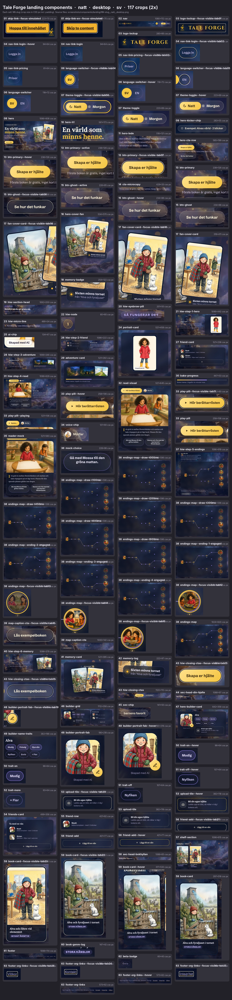

Other sheets: [natt mobile](../screenshots/components/landing/_sheet-all__natt__mobile.webp) · [morgon desktop](../screenshots/components/landing/_sheet-all__morgon__desktop.webp) · [morgon mobile](../screenshots/components/landing/_sheet-all__morgon__mobile.webp) · [states, natt](../screenshots/components/landing/_sheet-states__natt__desktop.webp) · [states, morgon](../screenshots/components/landing/_sheet-states__morgon__desktop.webp) · [endings map, natt](../screenshots/components/landing/_sheet-endings-map__natt.webp) · [endings map, morgon](../screenshots/components/landing/_sheet-endings-map__morgon.webp).

---

## 1. Inventory at a glance

Sizes are measured CSS px, sv, Natt (W×H). Rotated items report the axis-aligned bounding box. "Int." marks elements that are interactive (focusable or clickable). D = desktop 1440 px, M = mobile 390 px. Every row has the full set of four crops: `__natt__desktop`, `__natt__mobile`, `__morgon__desktop`, `__morgon__mobile` (plus `-en` for natt). The link goes to the natt desktop crop.

| NN | Component | Selector | D size | M size | Int. | Crop |
|---|---|---|---|---|---|---|
| 01 | Skip link "Hoppa till innehållet" | `.skip-link` | 188×40 (focused) | same | yes, but unreachable (§3) | [simulated focus](../screenshots/components/landing/01-skip-link--focus-simulated__natt__desktop.png) |
| 02 | Nav bar | `.shell > nav` | 1064×96 | 334×116 (2 rows) | | [02](../screenshots/components/landing/02-nav__natt__desktop.png) |
| 03 | Logo lockup | `nav .logo` | 261×42 | 158×28 | link `/` | [03](../screenshots/components/landing/03-logo-lockup__natt__desktop.png) |
| 04 | Nav link "Logga in" | `nav a[href="/login"]` | 74.5×44 | 74.5×44 | link | [04](../screenshots/components/landing/04-nav-link-login__natt__desktop.png) |
| 05 | Nav link "Priser" | `nav a[href="/uppgradera"]` | 61.3×44 | 61.3×44 | link | [05](../screenshots/components/landing/05-nav-link-pricing__natt__desktop.png) |
| 06 | Language switcher SV/EN | `.language-switcher` | 98×52 | 98×52 | 2 buttons | [06](../screenshots/components/landing/06-language-switcher__natt__desktop.png) |
| 07 | Theme toggle Natt/Morgon | `.tt` | 199.2×45 | 72×44 (icons only) | switch | [07](../screenshots/components/landing/07-theme-toggle__natt__desktop.png) |
| 08 | Hero (whole) | `header.hero` | 1064×576 | 334×909 | | [08](../screenshots/components/landing/08-hero__natt__desktop.webp) |
| 09 | Kicker chip with sparkle | `.hero .kicker` | 263×35 | 263×35 | | [09](../screenshots/components/landing/09-hero-kicker-chip__natt__desktop.png) |
| 10 | H1 with `.grad` span | `.hero h1` | 538×149 | 334×92 | | [10](../screenshots/components/landing/10-hero-h1__natt__desktop.png) |
| 11 | Lede | `.hero .lede` | 498×101 | 334×114 | | [11](../screenshots/components/landing/11-hero-lede__natt__desktop.png) |
| 12 | CTA cluster | `.hero .cta-row` | 538×151 | 334×168 | | [12](../screenshots/components/landing/12-hero-cta-row__natt__desktop.png) |
| 13 | Primary CTA "Skapa er hjälte" | `.btn.btn-primary` | 182.7×54 | 182.7×54 | link `/start` | [13](../screenshots/components/landing/13-btn-primary__natt__desktop.png) |
| 14 | Price microcopy | `.cta-microcopy` | 413×17 | 334×34 | | [14](../screenshots/components/landing/14-cta-microcopy__natt__desktop.png) |
| 15 | Ghost CTA "Se hur det funkar" | `.btn.btn-ghost` | 202.9×56 | 202.9×56 | link `#sa-funkar-det` | [15](../screenshots/components/landing/15-btn-ghost__natt__desktop.png) |
| 16 | Tilted cover fan | `.hero .fan` | 486×522 | 334×340 | 2 links | [16](../screenshots/components/landing/16-hero-cover-fan__natt__desktop.webp) |
| 17 | One fan cover card | `.fan .fb2` | 262×355 (bbox) | 180×243 | link `/signup` | [17](../screenshots/components/landing/17-fan-cover-card__natt__desktop.webp) |
| 18 | Memory badge "Sixten minns tornet" | `.fan .badge` | 207×75 | 207×75 | | [18](../screenshots/components/landing/18-memory-badge__natt__desktop.png) |
| 19 | HIW section head | `.hiw-head` | 1064×173 | 334×226 | | [19](../screenshots/components/landing/19-hiw-section-head__natt__desktop.webp) |
| 20 | Eyebrow pill "SÅ FUNGERAR DET" | `.hiw-kicker` | 181×30 | 181×30 | | [20](../screenshots/components/landing/20-hiw-eyebrow-pill__natt__desktop.png) |
| 21 | Step 1 (whole row) | `li.hiw-step` #1 | 1064×410 | 334×617 | | [21](../screenshots/components/landing/21-hiw-step-1-hero__natt__desktop.webp) |
| 22 | Step number node | `.hiw-node` | 40×40 | 32×32 | | [22](../screenshots/components/landing/22-hiw-node__natt__desktop.png) |
| 23 | Micro line with star | `.hiw-micro` | 473×18 | 290×36 | | [23](../screenshots/components/landing/23-hiw-micro-line__natt__desktop.png) |
| 24 | Portrait card | `.hiw-portrait-card` | 473×410 | 290×401 | | [24](../screenshots/components/landing/24-portrait-card__natt__desktop.webp) |
| 25 | "Skapad med AI" chip | `.hiw-ai-chip` | 115×27 | 115×27 | | [25](../screenshots/components/landing/25-ai-chip__natt__desktop.png) |
| 26 | Step 2 (row) | `li.hiw-step` #2 (flip) | 1064×190 | 334×421 | | [26](../screenshots/components/landing/26-hiw-step-2-friend__natt__desktop.webp) |
| 27 | Friend card (mini) | `.hiw-friend-card` | 473×190 | 290×205 | | [27](../screenshots/components/landing/27-friend-card__natt__desktop.png) |
| 28 | Step 3 (row) | `li.hiw-step` #3 | 1064×214 | 334×415 | | [28](../screenshots/components/landing/28-hiw-step-3-adventure__natt__desktop.webp) |
| 29 | Adventure card (fan + bake bar) | `.hiw-adventure-card` | 473×214 | 290×170 | | [29](../screenshots/components/landing/29-adventure-card__natt__desktop.webp) |
| 30 | "Book baking" progress | `.hiw-bake` | 427×33 | 244×33 | | [30](../screenshots/components/landing/30-bake-progress__natt__desktop.png) |
| 31 | Step 4 (row) | `li.hiw-step` #4 (flip) | 1064×597 | 334×879 | | [31](../screenshots/components/landing/31-hiw-step-4-read__natt__desktop.webp) |
| 32 | Read widget | `.hiw-read-visual` | 473×597 | 290×635 | | [32](../screenshots/components/landing/32-read-visual__natt__desktop.webp) |
| 33 | Narrator play pill | `.hiw-play` | 210×48 | 290×48 | button (audio) | [33](../screenshots/components/landing/33-play-pill__natt__desktop.png) |
| 34 | Voice chip "Morfar" | `.hiw-voice-chip` | 101×40 | 101×40 | | [34](../screenshots/components/landing/34-voice-chip__natt__desktop.png) |
| 35 | Reader mock | `.hiw-reader-mock` | 473×535 | 290×521 | | [35](../screenshots/components/landing/35-reader-mock__natt__desktop.webp) |
| 36 | Mock choice button | `.hiw-choice` | 208.5×78 | 244×60 | no (span) | [36](../screenshots/components/landing/36-mock-choice__natt__desktop.png) |
| 37 | Step 5 (row, wide) | `li.hiw-step--wide` | 1064×887 | 334×920 | | [37](../screenshots/components/landing/37-hiw-step-5-endings__natt__desktop.webp) |
| 38 | Four-endings map | `.hiw-map` | 976×573 | 290×489 | 4 buttons | [38](../screenshots/components/landing/38-endings-map__natt__desktop.webp) |
| 39 | Map caption + "Läs exempelboken" | `.hiw-caption`, `.hiw-map-cta` | 976×119 | 290×192 | link | [39](../screenshots/components/landing/39-map-caption-cta__natt__desktop.webp) |
| 40 | Step 6 (row, last) | `li.hiw-step--last` | 1064×347 | 334×488 | | [40](../screenshots/components/landing/40-hiw-step-6-memory__natt__desktop.webp) |
| 41 | Next-book memory card | `.hiw-memory-card` | 473×347 | 290×243 | | [41](../screenshots/components/landing/41-memory-card__natt__desktop.webp) |
| 42 | Memory tag | `.hiw-memory-tag` | 186×62 | 186×62 | | [42](../screenshots/components/landing/42-memory-tag__natt__desktop.png) |
| 43 | Closing CTAs | `.hiw-closing` | 1064×56 | 334×124 | 2 links | [43](../screenshots/components/landing/43-hiw-closing-ctas__natt__desktop.png) |
| 44 | Section head "Din hjälte" + intro | `.sec-head` + `p` | 1064×73 | 334×63 | | [44](../screenshots/components/landing/44-sec-head-din-hjalte__natt__desktop.png) |
| 45 | Section chip "barnens favorit" | `.sec-chip` | 122×30 | 122×30 | | [45](../screenshots/components/landing/45-sec-chip__natt__desktop.png) |
| 46 | Builder grid (two cards) | `.builder-grid` | 1064×308 | 334×826 | | [46](../screenshots/components/landing/46-builder-grid__natt__desktop.webp) |
| 47 | Hero builder card | `.glass.builder` | 594×308 | 334×518 | | [47](../screenshots/components/landing/47-hero-builder-card__natt__desktop.webp) |
| 48 | Portrait frame + FAB + caption | `.builder > div:first-child` | 158×186 | 158×186 | FAB link `/login` | [48](../screenshots/components/landing/48-builder-portrait-fab__natt__desktop.png) |
| 49 | Name + trait row | `.builder-name`, `.trait-row` | 358×142 | 280×142 | | [49](../screenshots/components/landing/49-builder-name-traits__natt__desktop.png) |
| 50 | Trait chip, on | `.trait.on` | 77×44 | 77×44 | no (span) | [50](../screenshots/components/landing/50-trait-on__natt__desktop.png) |
| 51 | Trait chip, off | `.trait` | 88×44 | 88×44 | no (span) | [51](../screenshots/components/landing/51-trait-off__natt__desktop.png) |
| 52 | Trait chip "+ Fler" | `.trait` (last) | 73×44 | 73×44 | no (span) | [52](../screenshots/components/landing/52-trait-more__natt__desktop.png) |
| 53 | Upload tile | `.upload` | 358×94 | 280×94 | link `/signup` | [53](../screenshots/components/landing/53-upload-tile__natt__desktop.png) |
| 54 | Friends card | `.glass.friends` | 452×308 | 334×290 | | [54](../screenshots/components/landing/54-friends-card__natt__desktop.png) |
| 55 | Friend row | `.friend` | 398×58 | 280×58 | | [55](../screenshots/components/landing/55-friend-row__natt__desktop.png) |
| 56 | "Lägg till en vän" | `.friend-add` | 398×53 | 280×53 | link `/signup` | [56](../screenshots/components/landing/56-friend-add__natt__desktop.png) |
| 57 | Shelf section | `main > section:nth-of-type(3)` | 1064×583 | 334×1276 | | [57](../screenshots/components/landing/57-shelf-section__natt__desktop.webp) |
| 58 | Section head "Bokhyllan" | `.sec-head` #2 | 1064×41 | 334×31 | | [58](../screenshots/components/landing/58-sec-head-bokhyllan__natt__desktop.png) |
| 59 | Book card | `.book` | 249.5×468 | 334×574 | link `/signup` | [59](../screenshots/components/landing/59-book-card__natt__desktop.webp) |
| 60 | Genre tag "STORA KÄNSLOR" | `.book-sub` | 127×22 | 127×22 | | [60](../screenshots/components/landing/60-book-genre-tag__natt__desktop.png) |
| 61 | Footer | `.foot` | 1064×103 | 334×189 | | [61](../screenshots/components/landing/61-footer__natt__desktop.png) |
| 62 | Beta badge | `[data-testid=beta-build-label]` | 41×20 | 41×20 | | [62](../screenshots/components/landing/62-beta-badge__natt__desktop.png) |
| 63 | Org line + Kontakt/Integritet/Villkor | `[data-testid=footer-company]` | 553×42 | 334×70 | 3 links | [63](../screenshots/components/landing/63-footer-org-links__natt__desktop.png) |

The page structure in one line: `nav` → `main#main-content` { `header.hero` · `section#sa-funkar-det.hiw` · `section` (Din hjälte) · `section` (Bokhyllan) } → `.foot`. All of it sits in `.shell`, which is `width: min(1120px, 100%)` with 28 px side padding (`3q17cp_jgfwol.pretty.css:681-688`). That gives a 1064 px content column on desktop and 334 px at 390 px wide.

---

## 2. The four shared recipes (pill, chip, glass, gradient button)

Almost every landing component is one of these four recipes, sometimes nested. The colour of each recipe is a family of tokens that the two themes re-point. The full token blocks are `3q17cp_jgfwol.pretty.css:493-541` (natt) and `:542-590` (morgon); see [02-color.md](02-color.md) for the complete colour treatment.

### 2.1 Pill

Everything clickable and every label is a `border-radius: 999px` capsule. The exceptions:

| Component | Radius |
|---|---|
| skip link | 6 px |
| upload tile, friend-add | 18 px |
| invite slot | 14 px |
| memory badge | 18 px |
| memory tag | 16 px |
| step number nodes | 50% (circles) |
| FAB | 50% (circle) |
| cards | 20–30 px rounded rectangles |

Interactive pills keep a **44 px minimum height**: nav links, language buttons, theme toggle, trait chips, invite slot. Buttons are taller at 48–56 px.

### 2.2 Chip (tinted hairline label)

Token family `--chip-bg / --chip-line / --chip-ink`. It is used by the kicker, the section chip, the voice chip, the upload camera tile and the friend-add text colour.

| token | natt | morgon |
|---|---|---|
| `--chip-bg` | `#fff9ec1a` (cream at 10%) | `#6d4fe014` (violet at 8%) |
| `--chip-line` | `#fff3d942` (cream at 26%) | `#6d4fe029` (violet at 16%) |
| `--chip-ink` | `#e8dfc9` | `var(--accent-ink)` = `#5b3fc7` |

A second, borderless family `--pill-bg / --pill-ink` covers the eyebrow pill and the book genre tags: natt `#9b87f529` / `#c9bcff`, morgon `#6d4fe01a` / `#5b3fc7`. A third, gold family `--gold-chip-bg / --gold-chip-ink` covers the step nodes and the map's choice diamonds and number chips: natt `#f2b22e29` / `#ffd98f`, morgon `#f2b22e26` / `#8f6a12`.

### 2.3 Glass card

```css
/* source/css/3q17cp_jgfwol.pretty.css:1110-1147 */
.glass {
  background: var(--card);
  -webkit-backdrop-filter: blur(var(--card-blur));
  backdrop-filter: blur(var(--card-blur));
  border: 1px solid var(--card-line);
  box-shadow: var(--card-shadow);
  color: var(--card-ink);
  border-radius: 26px;
  transition:
    background 0.5s,
    border-color 0.5s,
    color 0.5s,
    box-shadow 0.4s;
  position: relative;
}
.glass:before {
  content: "";
  pointer-events: none;
  -webkit-mask-composite: xor;
  opacity: 0.45;
  background: linear-gradient(135deg, #9b87f580, #f2b22e59 50%, #ff61544d);
  border-radius: 26px;
  padding: 1px;
  position: absolute;
  inset: 0;
  -webkit-mask-image: linear-gradient(#fff 0 0), linear-gradient(#fff 0 0);
  -webkit-mask-position:
    0 0,
    0 0;
  -webkit-mask-size: auto, auto;
  -webkit-mask-repeat: repeat, repeat;
  -webkit-mask-clip: content-box, border-box;
  -webkit-mask-origin: content-box, border-box;
  -webkit-mask-composite: xor;
  mask-composite: exclude;
  -webkit-mask-source-type: auto, auto;
  mask-mode: match-source, match-source;
}
```

Measured, desktop:

| | natt | morgon |
|---|---|---|
| Fill (`--card`) | `rgba(15,22,40,.68)` | `rgba(255,255,255,.80)` |
| Blur | 22 px | 24 px |
| Hairline (`--card-line`) | `rgba(155,135,245,.26)` | `rgba(255,255,255,.90)` |
| Shadow | `0 18px 44px rgba(5,8,20,.42)` | two layers: `0 4px 12px rgba(36,31,53,.10)`, `0 22px 52px rgba(36,31,53,.16)` |
| Ink | `#f2eeff` | `#241f35` |

The fill as actually rendered over the backdrop was sampled from the crops ([`_data/rendered-surface-samples.json`](../screenshots/components/landing/_data/rendered-surface-samples.json)):

* map card, natt: `#141b2e`
* builder card, natt: `#22232f`
* map card, morgon: `#fdfbfb`
* builder card, morgon: `#fcfafc`

The `:before` layer draws a 1 px gradient rim (violet → gold → coral at 135°, 45% opacity). It does this with the padding-box/border-box mask-composite trick: you see a faint iridescent edge, strongest at the top-left (violet) and bottom-right (coral).

The landing uses `.glass` for these cards:

* the portrait, friend, adventure, reader-mock, map and memory cards in how-it-works
* the builder and friends cards

Without the `.glass` class but with the same token values: the hero badge and the memory tag. The book card uses `--card` with no blur.

### 2.4 Gradient button

Token family `--btn-grad / --btn-ink / --btn-shadow / --btn-shadow-hover`.

| token | natt | morgon |
|---|---|---|
| `--btn-grad` | `linear-gradient(135deg, #ffe08a, #f5c542)` | `linear-gradient(135deg, #6d4fe0, #5b3fc7)` |
| `--btn-ink` | `#3a2b10` | `#fff` |
| `--btn-shadow` | `0 14px 40px #f5c54247` | `0 14px 34px #6d4fe059` |
| `--btn-shadow-hover` | `0 20px 55px #f5c5426b` | `0 22px 48px #6d4fe073` |

The family is used by:

* `.btn-primary`
* `.hiw-play` (the narrator pill)
* `.tt-thumb` (the theme-toggle thumb)
* `.builder-pic .fab` (the pencil FAB)
* the selected language button: `var(--accent)` fill and `var(--btn-ink)` text, a flat version of the same family

Rendered ends of the primary button, sampled: natt `#fddb7d` → `#f7c94e`, morgon `#6a4cdc` → `#5e42cb`.

### 2.5 Shared motion vocabulary (component level)

| Use | Duration / curve | Lines |
|---|---|---|
| Theme colour cross-fade on most components | `0.5s` (often `ease`) | `--theme-transition-duration` at `:460-472` |
| Button press/hover spring | `transform .25s cubic-bezier(.2,.7,.3,1.4)` (overshoots) | `:886-903` |
| Theme thumb slide, cover-fan cards | `.5s cubic-bezier(.2,.7,.3,1.2)` | `:785-797`, `:929-941` |
| Book card lift | `.35s cubic-bezier(.2,.7,.3,1.2)` | `:1485-1500` |
| Trait border | `all .25s` | `:1223-1238` |
| Dashed border hover (upload, friend-add) | `border-color .3s` | `:1247-1256`, `:1325-1341` |
| Map path draw | `stroke-dashoffset .9s ease-out` | `:2942-2946` |
| Idle float (covers 7 s / 8 s, badge 9 s); pulse 2.4 s | floats `ease-in-out infinite`; pulse `infinite` with the default `ease` | `:948-1029` |

---

## 3. Skip link

**Anatomy.** It is the first child of `.shell`, before the nav: `<a class="skip-link" href="#main-content">Hoppa till innehållet</a>` (en "Skip to content"). It is gold with dark-brown text, a 6 px radius and 800 weight, fixed at top-left 10/10 and parked above the viewport with `translateY(-160%)`.

```css
/* source/css/3q17cp_jgfwol.pretty.css:473-492 */
.skip-link {
  z-index: 1000;
  background: var(--gold);
  color: #241608;
  font-family: var(--ui);
  border-radius: 6px;
  padding: 10px 14px;
  font-weight: 800;
  position: fixed;
  top: 10px;
  left: 10px;
  transform: translateY(-160%);
}
.skip-link:not(:focus) {
  visibility: hidden;
}
.skip-link:focus {
  visibility: visible;
  transform: translateY(0);
}
```

**States.**

* **Rest:** hidden (`visibility: hidden`).
* **Focus:** meant to slide into view.

**Measured.** On a fresh load the first Tab goes straight to the logo, in both themes, on desktop and mobile, sv and en. Calling `.focus()` on the link leaves `document.activeElement` unchanged, with computed `visibility: hidden` and `transform: matrix(1,0,0,1,0,-64)` ([`_data/skip-link.json`](../screenshots/components/landing/_data/skip-link.json)). The reason: `visibility: hidden` makes an element unfocusable, and the rule that would make it visible only applies once it already has `:focus`.

**The skip link can never appear.** To document its intended look, the crop was taken after injecting `.skip-link{visibility:visible!important;transform:translateY(0)!important}` and focusing it:

* [natt desktop](../screenshots/components/landing/01-skip-link--focus-simulated__natt__desktop.png)
* [morgon desktop](../screenshots/components/landing/01-skip-link--focus-simulated__morgon__desktop.png)
* [natt mobile](../screenshots/components/landing/01-skip-link--focus-simulated__natt__mobile.png)
* [morgon mobile](../screenshots/components/landing/01-skip-link--focus-simulated__morgon__mobile.png)
* [en](../screenshots/components/landing/01-skip-link-en--focus-simulated__natt__desktop.png)

Measured in the simulated state: 188.4×40 px (en 147.5×40), `#f2b22e` on `#241608`, Schibsted Grotesk 16 px/800, 10×14 padding. It keeps the default link underline and the Chromium focus ring. The colours are the same in both themes because they are hard-coded `var(--gold)` and `#241608`.

---

## 4. Nav bar

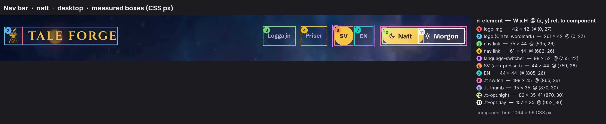

[`_anatomy-nav__natt__mobile.png`](../screenshots/components/landing/_anatomy-nav__natt__mobile.png) shows the wrapped mobile nav.

### 4.1 Bar layout

```css
/* source/css/3q17cp_jgfwol.pretty.css:689-695, 717-721 */
.shell > nav {
  justify-content: space-between;
  align-items: center;
  gap: 14px;
  padding: 22px 0;
  display: flex;
}
/* … */
.nav-right {
  align-items: center;
  gap: 12px;
  display: flex;
}
```

* **Desktop:** a single row, 1064×96. The logo sits left. On the right, with 12 px gaps: `Logga in` · `Priser` · language switcher · theme toggle.
* **≤768 px:** the nav wraps, and `.nav-right` is pushed right with `margin-left: auto`.
* **≤560 px:** gaps tighten to 8 and 6, padding becomes 14 px, the logo shrinks and the toggle drops its text.

At 390 px the result is two rows: the logo row, then a right-aligned row of controls. Measured 334×116 ([02 mobile natt](../screenshots/components/landing/02-nav__natt__mobile.png), [morgon](../screenshots/components/landing/02-nav__morgon__mobile.png)).

```css
/* source/css/3q17cp_jgfwol.pretty.css:746-767, 2276-2285 */
@media (max-width: 560px) {
  .logo {
    letter-spacing: 1.5px;
    gap: 8px;
    font-size: 1.05rem;
  }
  .logo img {
    width: 28px;
    height: 28px;
  }
  .shell > nav {
    gap: 8px;
    padding: 14px 0;
  }
  .nav-right {
    gap: 8px;
  }
  .nav-cta {
    padding: 9px 14px;
    font-size: 0.85rem;
  }
}
/* … */
@media (max-width: 768px) {
  .shell > nav {
    flex-wrap: wrap;
  }
  .nav-right {
    flex-wrap: wrap;
    justify-content: flex-end;
    margin-left: auto;
  }
}
```

The excerpt shows only the `.nav-right` and `.tt-opt` parts of the ≤560 block:

```css
/* source/css/3q17cp_jgfwol.pretty.css:2286-2294 */
@media (max-width: 560px) {
  .nav-right {
    gap: 6px;
  }
  .tt-opt {
    gap: 0;
    padding: 8px;
    font-size: 0;
  }
```

There is no nav background, border or sticky behaviour. The bar floats on the page backdrop and scrolls away.

### 4.2 Logo lockup

The image is [`assets/assets/tf-logo.webp`](../assets/assets/tf-logo.webp) (512×512, an anvil with a quill and a book, gold), drawn at 42 px. Next to it, the wordmark "Tale Forge" in Cinzel 700 is uppercased by CSS. The anchor carries `translate="no"`. The lockup is analysed in depth in [01-brand-identity.md §4](01-brand-identity.md#4-the-nav-lockup-logo); its component CSS:

```css
/* source/css/3q17cp_jgfwol.pretty.css:696-716 */
.logo {
  white-space: nowrap;
  font-family: var(--wordmark);
  color: var(--logo-ink);
  text-transform: uppercase;
  letter-spacing: 3px;
  text-shadow: var(--logo-shadow);
  flex-shrink: 0;
  align-items: center;
  gap: 13px;
  font-size: 1.72rem;
  font-weight: 700;
  transition: color 0.5s;
  display: flex;
}
.logo img {
  object-fit: contain;
  filter: drop-shadow(0 0 14px #f5c54280);
  width: 42px;
  height: 42px;
}
```

* **Measured:** 261×42 on desktop: Cinzel 27.52 px, tracking 3 px, gap 13. Mobile: 158×28, with the 28 px mark, 16.8 px type, 1.5 px tracking and gap 8.
* **Ink:** `--logo-ink` is `#f5c542` in natt and `#6d4fe0` in morgon. The text shadow is `0 2px 6px #050814cc, 0 0 34px #f5c54273` in natt (a gold halo) and `0 1px 2px #241f352e, 0 0 24px #6d4fe052` in morgon.
* **Hard-coded gold:** the mark keeps a gold `drop-shadow(0 0 14px #f5c54280)` in both themes.
* **States:** there is no hover rule ([states/sv__natt/01_logo_TALE_FORGE__hover.png](../screenshots/states/sv__natt/01_logo_TALE_FORGE__hover.png) is identical to rest). Focus shows the UA ring ([tab01](../screenshots/components/landing/03-logo-lockup--focus-visible-tab01__natt__desktop.png)).

### 4.3 Account links ("Logga in", "Priser")

These are React `next/link`s with an inline style object (`source/js/390j9gbq0u9ce.js` module 3073, byte ~23 300), not a CSS class. Verbatim from the hydrated DOM:

```css
/* inline style on nav a[href="/login"] and a[href="/uppgradera"] (dom__home__sv.html) */
display: inline-flex; align-items: center; justify-content: center; gap: 7px;
min-height: 44px; max-width: 100%; box-sizing: border-box; padding: 0px 10px;
border-radius: 999px; border: 1.5px solid var(--card-line); color: var(--card-sub);
font-family: var(--ui); font-weight: 700; font-size: 0.82rem; line-height: 1;
white-space: nowrap; text-decoration: none;
```

* **Measured:** "Logga in" 74.5×44, "Priser" 61.3×44 (en "Login" 56.5, "Pricing" 67.2). Type is 13.12 px/700, in `#b5acd3` (natt) or `#5f5878` (morgon).
* **Border:** the outline is a ghost hairline: `rgba(155,135,245,.26)` in natt, `rgba(255,255,255,.9)` in morgon. It is declared as **1.5 px but computes to 1 px** in Chromium.
* **States:** no hover style ([hover crop](../screenshots/components/landing/04-nav-link-login--hover__natt__desktop.png)); UA focus ring ([tab02](../screenshots/components/landing/04-nav-link-login--focus-visible-tab02__natt__desktop.png), [tab03](../screenshots/components/landing/05-nav-link-pricing--focus-visible-tab03__natt__desktop.png)).
* **Variants** (from JS, not observable without logging in):
  * auth `"unresolved"`: nothing renders. The server HTML has no account links at all, so they appear only after hydration.
  * signed-out: `Logga in` → `/login` and `Priser` → `/uppgradera` (en "Login", "Pricing").
  * signed-in: `Bokhylla` (book icon, 16 px stroke 2) → `/`, `Konto` (user icon) → `/konto` and `Priser`; en "Bookshelf", "Account", "Pricing".
  * anonymous user on `/start`: nothing renders.
* An unused `.nav-cta` class (`:731-745`, ghost recipe, 11×20 padding, .95 rem) exists but the landing does not render it.

### 4.4 Language switcher (SV | EN)

This is also an inline-styled component (`390j9gbq0u9ce.js` module 80157):

```css
/* .language-switcher (role="group", aria-label "Byt språk" / "Change language") */
display: inline-flex; align-items: center; gap: 2px; padding: 3px;
border-radius: 999px; border: 1.5px solid var(--card-line); font-family: var(--ui);
/* each button; selected = aria-pressed="true" */
padding: 5px 11px; border-radius: 999px; border: none;
background: var(--accent) | transparent;       /* selected | not */
color: var(--btn-ink) | var(--card-sub);
font-family: var(--ui); font-weight: 800 | 700; font-size: 0.82rem; letter-spacing: 0.02em;
cursor: default | pointer; min-height: 44px; min-width: 44px;
```

**Anatomy.** A 98×52 hairline capsule holds two 44×44 circular buttons. The selected one is a solid disc: gold `#f5c542` with `#3a2b10` text in natt, violet `#6d4fe0` with white text in morgon.

**Behaviour.** Clicking the other language writes the cookie `tf_locale=sv|en; path=/; max-age=31536000; SameSite=Lax` and calls `router.refresh()`. The URL never changes.

**States.**

| State | Crop |
|---|---|
| SV selected | [sv crop](../screenshots/components/landing/06-language-switcher__natt__desktop.png) |
| EN selected (en page) | [en crop](../screenshots/components/landing/06-language-switcher-en__natt__desktop.png) |
| Hover: no style | [hover](../screenshots/components/landing/06-language-switcher--hover__natt__desktop.png) |
| Focus: UA ring on the 44 px button | [SV](../screenshots/components/landing/06-language-switcher--focus-visible-tab04__natt__desktop.png), [EN](../screenshots/components/landing/06-language-switcher--focus-visible-tab05__natt__desktop.png) |
| Morgon | [crop](../screenshots/components/landing/06-language-switcher__morgon__desktop.png) |

### 4.5 Theme toggle (Natt ◐ Morgon, sliding thumb)

**Markup.** `button.tt[role=switch][aria-checked=false|true][aria-label="Byt tema"]` contains:

* `span.tt-thumb` (aria-hidden)
* `span.tt-opt.night`: a moon icon, 24-unit viewBox, stroke 2.2, path `M21 12.8A8.5 8.5 0 1 1 11.2 3a7 7 0 0 0 9.8 9.8z`, plus "Natt"
* `span.tt-opt.day`: a sun icon (circle r 4.2 plus eight 2.4-unit rays), plus "Morgon"

The en labels are "Night", "Morning" and "Switch theme".

```css
/* source/css/3q17cp_jgfwol.pretty.css:768-826 */
.tt {
  background: var(--ghost-bg);
  border: 1px solid var(--control-line);
  min-height: 44px;
  font-family: var(--ui);
  cursor: pointer;
  -webkit-user-select: none;
  user-select: none;
  transition:
    background var(--theme-transition-duration) var(--theme-transition-easing),
    border-color var(--theme-transition-duration) var(--theme-transition-easing);
  border-radius: 999px;
  align-items: center;
  padding: 4px;
  display: flex;
  position: relative;
}
.tt-thumb {
  background: var(--btn-grad);
  width: calc(50% - 4px);
  box-shadow: var(--btn-shadow);
  transition:
    transform var(--theme-transition-duration) cubic-bezier(0.2, 0.7, 0.3, 1.2),
    background var(--theme-transition-duration) var(--theme-transition-easing);
  border-radius: 999px;
  position: absolute;
  top: 4px;
  bottom: 4px;
  left: 4px;
}
body[data-theme="morgon"] .tt-thumb {
  transform: translate(100%);
}
.tt-opt {
  z-index: 1;
  color: var(--ghost-ink);
  transition: color var(--theme-transition-duration)
    var(--theme-transition-easing);
  align-items: center;
  gap: 7px;
  padding: 8px 14px;
  font-size: 0.95rem;
  font-weight: 700;
  display: inline-flex;
  position: relative;
}
.tt-opt svg {
  width: 15px;
  height: 15px;
}
body[data-theme="natt"] .tt-opt.night,
body[data-theme="morgon"] .tt-opt.day {
  color: var(--btn-ink);
}
.tt:focus-visible {
  outline: 3px solid var(--accent);
  outline-offset: 3px;
  box-shadow: 0 0 0 6px color-mix(in srgb, var(--card) 88%, transparent);
}
```

**Behaviour** (`390j9gbq0u9ce.js` module 22530):

1. A click flips `document.body.dataset.theme` between `natt` and `morgon`.
2. It writes `localStorage['tf-theme']`.
3. It dispatches a `tf-theme-change` window event, which a `useSyncExternalStore` subscribes to.
4. On mount, a stored value is applied with `useLayoutEffect`.

**Motion.** The thumb (the gold gradient in natt, violet in morgon, both carrying the button glow shadow) slides by `translate(100%)` in 0.5 s on `cubic-bezier(.2,.7,.3,1.2)`, a slight overshoot. At the same time the two labels swap ink between `--ghost-ink` and `--btn-ink`, and the whole page cross-fades. Frames 80 ms apart are in [`screenshots/motion/theme-toggle-natt-to-morgon__t*.png`](../screenshots/motion/).

**Measured.**

* **Desktop:** 199.2×45 (en 211.5×45). Thumb 94.6×35 = `calc(50% - 4px)` of the 197.2 px padding box. Labels: "Natt" 82 px wide, "Morgon" 107 px.
* **Half-width thumb:** the thumb is half the switch, not the width of the label. In natt it runs 12.6 px past "Natt" on the right; in morgon it starts 12.6 px right of where "Morgon"'s box begins, inside that label's 14 px padding. See the [anatomy](../screenshots/components/landing/_anatomy-nav__natt__desktop.png).
* **Mobile (≤560 px):** labels at `font-size:0` leave an icon-only 72×44 switch ([natt](../screenshots/components/landing/07-theme-toggle__natt__mobile.png), [morgon](../screenshots/components/landing/07-theme-toggle__morgon__mobile.png)). At ≤880 px the option padding is 8×10.

**States.**

* **Natt:** [crop](../screenshots/components/landing/07-theme-toggle__natt__desktop.png)
* **Morgon:** [crop](../screenshots/components/landing/07-theme-toggle__morgon__desktop.png)
* **Hover:** no style.
* **Focus-visible** is custom, the only bespoke focus treatment in the nav: a 3 px `--accent` outline, offset 3 px, plus a 6 px halo `color-mix(in srgb, var(--card) 88%, transparent)` ([natt tab06](../screenshots/components/landing/07-theme-toggle--focus-visible-tab06__natt__desktop.png), [morgon tab06](../screenshots/components/landing/07-theme-toggle--focus-visible-tab06__morgon__desktop.png)).
* **Reduced motion:** no transitions (`:2349-2372`).

---

## 5. Hero

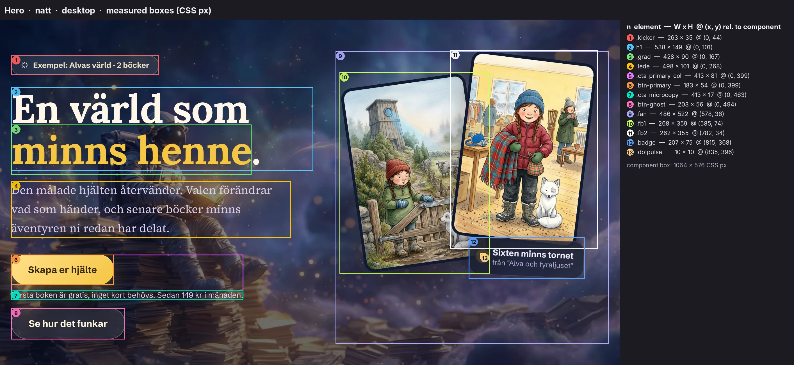

### 5.1 Layout

```css
/* source/css/3q17cp_jgfwol.pretty.css:827-834 */
.hero {
  grid-template-columns: 1.05fr 0.95fr;
  align-items: center;
  gap: 40px;
  min-height: 64vh;
  padding: 4vh 0 2vh;
  display: grid;
}
```

* **Desktop:** two columns, 537.6 | 486.4 px with a 40 px gap. The hero is 576 px tall, with `min-height: 64vh` = 576 at a 900 px viewport and padding 36/18.
* **≤880 px:** one column. The fan drops below the CTAs at 340 px tall ([mobile crop](../screenshots/components/landing/08-hero__natt__mobile.webp)):

```css
/* source/css/3q17cp_jgfwol.pretty.css:2244-2252 (inside @media (max-width: 880px)) */
  .hero {
    grid-template-columns: 1fr;
    min-height: auto;
    padding-top: 3vh;
  }
  .fan {
    height: 340px;
    margin-top: 8px;
  }
```

### 5.2 Kicker chip (sparkle + context line)

```css
/* source/css/3q17cp_jgfwol.pretty.css:835-854 */
.kicker {
  color: var(--chip-ink);
  background: var(--chip-bg);
  border: 1px solid var(--chip-line);
  -webkit-backdrop-filter: blur(10px);
  backdrop-filter: blur(10px);
  border-radius: 999px;
  align-items: center;
  gap: 8px;
  margin-bottom: 22px;
  padding: 8px 16px;
  font-size: 0.85rem;
  font-weight: 700;
  transition: all 0.5s;
  display: inline-flex;
}
.kicker svg {
  width: 14px;
  height: 14px;
}
```

The icon is an eight-ray sparkle drawn as strokes (stroke-width 2.4, round caps): `M12 3v3M12 18v3M3 12h3M18 12h3M5.6 5.6l2.1 2.1M16.3 16.3l2.1 2.1M18.4 5.6l-2.1 2.1M7.7 16.3l-2.1 2.1`.

* **Copy:** sv `Exempel: Alvas värld · 2 böcker` [Example: Alva's world · 2 books]; en `Demo: Alva's world · 2 books`.
* **Measured:** 263×35 (en 244×35), 13.6 px/700.
* **Natt:** cream ink `#e8dfc9` on cream at 10%. **Morgon:** violet `#5b3fc7` on violet at 8%.
* Crops: [natt](../screenshots/components/landing/09-hero-kicker-chip__natt__desktop.png), [morgon](../screenshots/components/landing/09-hero-kicker-chip__morgon__desktop.png).

### 5.3 H1 and the `.grad` span

```css
/* source/css/3q17cp_jgfwol.pretty.css:855-870 */
h1 {
  font-family: var(--display);
  letter-spacing: -0.015em;
  text-wrap: balance;
  color: var(--page-ink);
  text-shadow: var(--h1-shadow);
  margin-bottom: 18px;
  font-size: clamp(2.7rem, 5.4vw, 4.4rem);
  font-weight: 700;
  line-height: 1.06;
  transition: color 0.5s;
}
h1 .grad {
  color: var(--accent-ink);
  transition: color 0.5s;
}
```

**Copy.** sv `En värld som <span class="grad">minns henne</span>.` [A world that remembers her.]; en `A world that <span class="grad">remembers her</span>.` The full stop sits outside the span, so it stays in the page ink. That is visible in every crop: a white dot after gold "henne".

**Measured.** Lora 700:

| | Desktop | Mobile |
|---|---|---|
| Size / leading | 70.4 / 74.6 px | 43.2 px (the clamp minimum, 2.7 rem) |
| Box | 538×149 | 334×92 |
| Tracking | −1.056 px | |

Each line of the two-line headline is broken by `text-wrap: balance`.

**Colour.**

* **Accent span:** `--accent-ink`, a flat `#f5c542` in natt and `#5b3fc7` in morgon. It is not a gradient despite the class name.
* **Natt shadow:** a soft dark halo, `--h1-shadow: 0 2px 30px #0c082859`.
* **Morgon shadow:** none.

Crops: [natt](../screenshots/components/landing/10-hero-h1__natt__desktop.png), [morgon](../screenshots/components/landing/10-hero-h1__morgon__desktop.png), [en](../screenshots/components/landing/10-hero-h1-en__natt__desktop.png).

### 5.4 Lede

```css
/* source/css/3q17cp_jgfwol.pretty.css:871-879 */
.lede {
  font-family: var(--serif);
  color: var(--page-sub);
  max-width: 46ch;
  margin-bottom: 30px;
  font-size: clamp(1.08rem, 1.65vw, 1.28rem);
  line-height: 1.65;
  transition: color 0.5s;
}
```

* **Copy:** sv `Den målade hjälten återvänder. Valen förändrar vad som händer, och senare böcker minns äventyren ni redan har delat.` [The painted hero returns. The choices change what happens, and later books remember the adventures you have already shared.] en: `The painted hero returns. Choices change what happens, and later books remember the adventures you have already shared.`
* **Measured:** Source Serif 4, 20.48 px on 33.8 px leading, 498 px wide (46 ch), on desktop. In `#d9cfee` (natt) or `#5f5878` (morgon).

### 5.5 CTA cluster: primary, microcopy, ghost

```css
/* source/css/3q17cp_jgfwol.pretty.css:880-924 */
.cta-row {
  flex-wrap: wrap;
  align-items: center;
  gap: 14px;
  display: flex;
}
.btn {
  cursor: pointer;
  font-family: var(--ui);
  border: none;
  border-radius: 999px;
  align-items: center;
  gap: 10px;
  min-height: 52px;
  padding: 17px 30px;
  font-size: 1.05rem;
  font-weight: 700;
  transition:
    transform 0.25s cubic-bezier(0.2, 0.7, 0.3, 1.4),
    box-shadow 0.3s,
    background 0.5s,
    color 0.5s;
  display: inline-flex;
}
.btn:active {
  transform: scale(0.96);
}
.btn-primary {
  color: var(--btn-ink);
  background: var(--btn-grad);
  box-shadow:
    var(--btn-shadow),
    inset 0 1px 0 #ffffff73;
}
.btn-primary:hover {
  box-shadow: var(--btn-shadow-hover);
  transform: translateY(-3px);
}
.btn-ghost {
  background: var(--ghost-bg);
  color: var(--ghost-ink);
  border: 1px solid var(--ghost-line);
  -webkit-backdrop-filter: blur(14px);
  backdrop-filter: blur(14px);
}
```

```css
/* source/css/3q17cp_jgfwol.pretty.css:3132-3145 */
.cta-row--microcopy {
  align-items: flex-start;
}
.cta-primary-col {
  flex-direction: column;
  align-items: flex-start;
  gap: 10px;
  display: flex;
}
.cta-microcopy {
  font-family: var(--ui);
  color: var(--page-sub);
  font-size: 0.85rem;
}
```

**Anatomy.**

* `.cta-row.cta-row--microcopy` holds `.cta-primary-col` and the ghost button.
* `.cta-primary-col` holds the primary button and the `.cta-microcopy` line under it.
* The anchors carry inline `text-decoration:none`. They are `CtaLink` components (`$L17` in the RSC payload of [`source/html/home.sv.html`](../source/html/home.sv.html)), which send `track("cta_clicked",{cta,surface,lang})` with `cta:"hero_primary"` and `cta:"hero_how"`, `surface:"home"`.

**Measured.**

| | Size | Notes |
|---|---|---|
| Primary | 182.7×54 (en 198×54) | 16.8 px/700, 17×30 padding |
| Ghost | 202.9×56 | 2 px taller than primary because of its 1 px border |
| Microcopy | 413×17 | 13.6 px |

On desktop the primary column is 413 px wide because the microcopy line sets its width. 413 + 14 + 203 > 537.6, so **the ghost CTA wraps onto its own line under the microcopy**, also at 1440 px wide. Every fold shot shows this ([hero crop](../screenshots/components/landing/08-hero__natt__desktop.webp), [cluster crop](../screenshots/components/landing/12-hero-cta-row__natt__desktop.png)).

**Copy.**

| | sv | en |
|---|---|---|
| Primary → `/start` | `Skapa er hjälte` [Create your (plural) hero] | `Create your hero` |
| Microcopy | `Första boken är gratis, inget kort behövs. Sedan 149 kr i månaden.` [The first book is free, no card needed. Then 149 kr a month.] | `The first book is free, no card needed. After that $14.99 a month.` |
| Ghost → `#sa-funkar-det` | `Se hur det funkar` [See how it works] | `See how it works` |

The ghost link scrolls smoothly (`html{scroll-behavior:smooth}`) to the how-it-works section, which has `scroll-margin-top: 24px`. An `#how-it-works` alias anchor exists for English links.

**States.** Full matrix in §10.

| State | Primary | Ghost |
|---|---|---|
| Rest | [crop](../screenshots/components/landing/13-btn-primary__natt__desktop.png) | [crop](../screenshots/components/landing/15-btn-ghost__natt__desktop.png) |
| Hover | lifts `translateY(-3px)`; shadow grows to `0 20px 55px rgba(245,197,66,.42)` in natt, `0 22px 48px rgba(109,79,224,.45)` in morgon. Because `box-shadow` is replaced wholesale, **the inset top highlight `inset 0 1px 0 #ffffff73` disappears on hover** ([crop](../screenshots/components/landing/13-btn-primary--hover__natt__desktop.png)) | no rule: `.btn-ghost` has no `:hover`, so the computed style is identical to rest ([crop](../screenshots/components/landing/15-btn-ghost--hover__natt__desktop.png)) |
| Active | still `matrix(1,0,0,1,0,-3)` with the mouse held down. `.btn:active {scale(.96)}` (`:904-906`) loses to `.btn-primary:hover` (`:914-917`): same specificity, later in the file. Under a mouse the primary **never shows the press** ([crop](../screenshots/components/landing/13-btn-primary--active__natt__desktop.png)) | `scale(.96)` ([crop](../screenshots/components/landing/15-btn-ghost--active__natt__desktop.png)) |
| Focus | UA ring ([tab07](../screenshots/components/landing/13-btn-primary--focus-visible-tab07__natt__desktop.png)) | UA ring ([tab08](../screenshots/components/landing/15-btn-ghost--focus-visible-tab08__natt__desktop.png)) |

The ghost fill is `--ghost-bg` with a 14 px blur:

| | Fill | Ink | Line |
|---|---|---|---|
| natt | `rgba(255,249,236,.10)`; rendered `#524d5d` over the nebula | `#fff3d9` | `#fff3d952` |
| morgon | `rgba(255,255,255,.72)`; rendered `#faf7fa` | `#241f35` | `#887da0`, a solid mid-grey-violet hairline, the darkest line in morgon |

### 5.6 Tilted cover-card stack (`.fan`)

```css
/* source/css/3q17cp_jgfwol.pretty.css:925-979 */
.fan {
  height: min(58vh, 540px);
  position: relative;
}
.fan .fbook {
  border: 5px solid var(--frame);
  border-radius: 20px;
  width: min(46%, 240px);
  transition:
    transform 0.5s cubic-bezier(0.2, 0.7, 0.3, 1.2),
    border-color 0.5s;
  position: absolute;
  overflow: hidden;
  box-shadow:
    0 24px 50px #0a072066,
    0 0 44px #f5c5421f;
}
.fan .fbook img {
  aspect-ratio: 2/3;
  object-fit: cover;
  width: 100%;
  display: block;
}
.fb1 {
  z-index: 1;
  animation: 7s ease-in-out infinite float1;
  top: 10%;
  left: 6%;
  transform: rotate(-8deg);
}
.fb2 {
  z-index: 2;
  animation: 8s ease-in-out infinite float2;
  top: 2%;
  right: 8%;
  transform: rotate(7deg);
}
@keyframes float1 {
  0%,
  to {
    transform: rotate(-8deg) translateY(0);
  }
  50% {
    transform: rotate(-8.6deg) translateY(-12px);
  }
}
@keyframes float2 {
  0%,
  to {
    transform: rotate(7deg) translateY(0);
  }
  50% {
    transform: rotate(7.6deg) translateY(-16px);
  }
}
```

**Anatomy.** Two framed covers, each a `<div class="fbook fbN"><a href="/signup" aria-label="<book title>"></a></div>`:

* `.fb1`: [`cover-tornet.webp`](../assets/assets/cover-tornet.webp) (848×1264), "Alva och fyraljuset i tornet". It sits back-left at −8°.
* `.fb2`: [`cover-filten.webp`](../assets/assets/cover-filten.webp), "Alva och filten vid elementet". It sits front-right at +7°.

**Measured.**

* `.fan`: 486.4×522, where `min(58vh, 540px)` = 522 at 900 px.
* **Cover layout box:** `min(46%, 240px)` = 223.7 px wide including the 5 px `--frame` border, so 213.7 px of image at 2:3, 320.6 px tall. Rotated bounding boxes measure 268×359 (fb1) and 262×355 (fb2).
* **Frame:** `#101a30` in natt (a navy frame), `#fff` in morgon (a white polaroid frame).
* **Shadow:** `0 24px 50px #0a072066, 0 0 44px #f5c5421f`. The gold glow stays in morgon too.

**Motion.**

* `.fb1` bobs −12 px and tilts to −8.6° over 7 s.
* `.fb2` bobs −16 px and tilts to +7.6° over 8 s.
* Both use `ease-in-out infinite`.
* The different periods keep the pair from ever syncing.
* Live timing is in [`source/rendered/running-animations__home.json`](../source/rendered/running-animations__home.json).
* Under reduced motion the animations stop but the static tilts remain.

**Focus.** Keyboard focus lands on the inner `<a>`, but `.fbook{overflow:hidden}` clips the UA outline, so **the focused cover shows no visible ring** ([tab09](../screenshots/components/landing/17-fan-cover-card--focus-visible-tab09__natt__desktop.webp), [tab10](../screenshots/components/landing/17-fan-cover-card--focus-visible-tab10__natt__desktop.webp)).

**Crops.** [Fan natt](../screenshots/components/landing/16-hero-cover-fan__natt__desktop.webp) · [fan morgon](../screenshots/components/landing/16-hero-cover-fan__morgon__desktop.webp) · [single card](../screenshots/components/landing/17-fan-cover-card__natt__desktop.webp) · [mobile](../screenshots/components/landing/16-hero-cover-fan__natt__mobile.webp).

### 5.7 Memory badge ("Sixten minns tornet")

```css
/* source/css/3q17cp_jgfwol.pretty.css:980-1037 */
.fan .badge {
  z-index: 3;
  background: var(--card);
  -webkit-backdrop-filter: blur(var(--card-blur));
  backdrop-filter: blur(var(--card-blur));
  border: 1px solid var(--card-line);
  color: var(--card-ink);
  box-shadow: var(--card-shadow);
  border-radius: 18px;
  align-items: center;
  gap: 12px;
  padding: 14px 18px;
  transition:
    background 0.5s,
    color 0.5s;
  animation: 9s ease-in-out infinite floatBadge;
  display: flex;
  position: absolute;
  bottom: 23%;
  right: 9%;
}
@keyframes floatBadge {
  0%,
  to {
    transform: rotate(2.5deg) translateY(0);
  }
  50% {
    transform: rotate(3deg) translateY(-7px);
  }
}
.badge .dotpulse {
  background: var(--gold);
  border-radius: 50%;
  flex: none;
  width: 10px;
  height: 10px;
  animation: 2.4s infinite pulse;
  box-shadow: 0 0 #f2b22e80;
}
@keyframes pulse {
  0% {
    box-shadow: 0 0 #f2b22e73;
  }
  70% {
    box-shadow: 0 0 0 12px #f2b22e00;
  }
  to {
    box-shadow: 0 0 #f2b22e00;
  }
}
.badge b {
  font-size: 0.95rem;
}
.badge span {
  color: var(--card-sub);
  font-size: 0.8rem;
  display: block;
}
```

**Anatomy.** A glass lozenge (radius 18, padding 14×18) sits over the lower edge of the front cover. It holds a 10 px gold `.dotpulse` and two lines: `<b>` at 15.2 px (.95 rem) bold, then `<span>` at 12.8 px (.8 rem) in `--card-sub`.

**Copy.**

| | Line 1 | Line 2 |
|---|---|---|
| sv | `Sixten minns tornet` [Sixten remembers the tower] | `från "Alva och fyraljuset"` [from "Alva and the Fourth Candle"] |
| en | `Sixten remembers the tower` | `from "Alva and the Fourth Candle"` |

The badge uses ASCII straight quotes, not Swedish ”…”.

**Measured.** 206.9×74.8; en 273.6×77.8, because the en line is longer.

**Tilt.** `.fan .badge` has **no static transform**: its 2.5–3° tilt and 7 px bob exist only inside `@keyframes floatBadge` (9 s). Under `prefers-reduced-motion` (`.badge{animation:none}`) it therefore sits level, while the covers stay tilted. The crop is frozen at keyframe 0 (2.5°), with the pulse ring at 600 ms:

* [natt](../screenshots/components/landing/18-memory-badge__natt__desktop.png)
* [morgon](../screenshots/components/landing/18-memory-badge__morgon__desktop.png)
* [en](../screenshots/components/landing/18-memory-badge-en__natt__desktop.png)

**Pulse.** `box-shadow` grows from `0 0 0 0 #f2b22e73` to `0 0 0 12px #f2b22e00` over the first 70% of 2.4 s, then rests: a sonar ping.

---

## 6. "Så fungerar det" (how it works)

`section#sa-funkar-det.reveal.in.hiw` is the `ExplainerChapter` component (`3d9nxlx1n5pdy.js`, byte 16 749). Its copy dictionary is at byte 880 (sv) and 3761 (en).

**Reveal.** The `.reveal` fade-up (`:1099-1109`, 0.7 s, 26 px rise) is defined, but this section and the two that follow are **server-rendered with `reveal in` already applied** ([`source/html/home.sv.html`](../source/html/home.sv.html)). No script toggles them, so on the landing page the sections appear without the reveal animation.

### 6.1 Section head: eyebrow pill, H2, lede

```css
/* source/css/3q17cp_jgfwol.pretty.css:2528-2568 */
.hiw {
  scroll-margin-top: 24px;
  position: relative;
}
.hiw-anchor-alias {
  width: 1px;
  height: 1px;
  position: absolute;
  top: 0;
}
.hiw-head {
  margin-bottom: 36px;
}
.hiw-kicker {
  font-family: var(--ui);
  text-transform: uppercase;
  letter-spacing: 2px;
  color: var(--pill-ink);
  background: var(--pill-bg);
  border-radius: 999px;
  margin-bottom: 16px;
  padding: 7px 14px;
  font-size: 0.82rem;
  font-weight: 700;
  display: inline-flex;
}
.hiw-headline {
  font-family: var(--display);
  letter-spacing: -0.015em;
  color: var(--page-ink);
  margin-bottom: 12px;
  font-size: clamp(1.9rem, 4vw, 2.7rem);
  font-weight: 700;
}
.hiw-lede {
  font-family: var(--serif);
  color: var(--page-sub);
  max-width: 56ch;
  font-size: 1.1rem;
  line-height: 1.7;
}
```

**Eyebrow.**

* sv `Så fungerar det` (rendered `SÅ FUNGERAR DET` via `text-transform`) [How it works]; en `How it works`.
* 13.12 px/700, 2 px tracking, on `--pill-bg` with no border and no blur.
* 181×30 (en 155×30).
* [natt](../screenshots/components/landing/20-hiw-eyebrow-pill__natt__desktop.png), [morgon](../screenshots/components/landing/20-hiw-eyebrow-pill__morgon__desktop.png).

**Headline.** sv `Äventyr värda att prata om.` [Adventures worth talking about.]; en `Adventures worth talking about.` Lora 700: 43.2 px on desktop (`4vw` > 2.7 rem, so it clamps at 2.7 rem) and 30.4 px on mobile (1.9 rem).

**Lede.** sv `Från ett foto till en uppläst bilderbok med fyra olika slut. Så här går en kväll till.` [From a photo to a narrated picture book with four different endings. This is how an evening goes.]; en `From one photo to a narrated picture book with four different endings. Here is how an evening works.` Serif 17.6 px, leading 1.7.

Crop: [head, natt](../screenshots/components/landing/19-hiw-section-head__natt__desktop.webp).

### 6.2 The step scaffold: rail, node, text, micro line

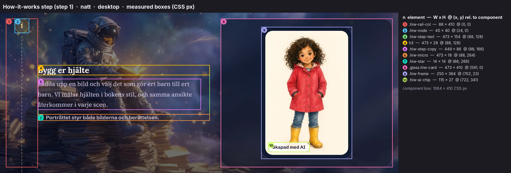

```css
/* source/css/3q17cp_jgfwol.pretty.css:2569-2666 */
.hiw-steps {
  flex-direction: column;
  gap: 36px;
  margin: 0;
  padding: 0;
  list-style: none;
  display: flex;
}
.hiw-step {
  grid-template-columns: 88px 1fr;
  display: grid;
}
.hiw-rail-col {
  justify-content: center;
  align-items: flex-start;
  display: flex;
  position: relative;
}
.hiw-rail-col:before {
  content: "";
  border-left: 2px dashed var(--dash-line);
  position: absolute;
  top: 48px;
  bottom: -44px;
  left: 50%;
  transform: translate(-1px);
}
.hiw-step--last .hiw-rail-col:before {
  display: none;
}
.hiw-node {
  background: var(--gold-chip-bg);
  border: 1.5px solid color-mix(in srgb, var(--gold-soft) 55%, transparent);
  width: 40px;
  height: 40px;
  color: var(--gold-chip-ink);
  font-family: var(--display);
  z-index: 1;
  border-radius: 50%;
  place-items: center;
  font-size: 1.05rem;
  font-weight: 700;
  display: grid;
  position: relative;
}
.hiw-step-body {
  grid-template-columns: 1fr 1fr;
  align-items: center;
  gap: 30px;
  min-width: 0;
  display: grid;
}
.hiw-step--flip .hiw-step-text {
  order: 2;
}
.hiw-step--flip .hiw-step-visual {
  order: 1;
}
.hiw-step--wide .hiw-step-body {
  grid-template-columns: 1fr;
  align-items: stretch;
}
.hiw-step-text h3 {
  font-family: var(--display);
  color: var(--page-ink);
  margin-bottom: 10px;
  font-size: 1.35rem;
  font-weight: 700;
}
.hiw-step-copy {
  font-family: var(--serif);
  color: var(--page-sub);
  max-width: 52ch;
  font-size: 1.02rem;
  line-height: 1.75;
}
.hiw-micro {
  font-family: var(--ui);
  color: var(--micro-ink);
  align-items: center;
  gap: 8px;
  margin-top: 12px;
  font-size: 0.88rem;
  font-weight: 600;
  display: flex;
}
.hiw-star {
  width: 14px;
  height: 14px;
  color: var(--gold-soft);
  flex: none;
}
.hiw-step-visual {
  min-width: 0;
}
.hiw-card {
  padding: 22px;
}
```

**Layout.** Each `li.hiw-step` is a two-column grid:

* an **88 px rail column**: a dashed 2 px `--dash-line` runs from 48 px below the top to 44 px past the bottom, so the rail reads as continuous through the 36 px step gap;
* the **body**: two equal columns (473 | 473 on desktop, 30 px gap, vertically centred).

**Modifiers.**

* `--flip` (steps 2 and 4) swaps text and visual.
* `--wide` (step 5) stacks them full-width.
* `--last` (step 6) has no rail line.

**Node.** A 40 px circle: gold chip fill, a 1.5 px border of `color-mix(gold-soft 55%)` (computes to 1 px), and a Lora 16.8 px/700 numeral. Natt ink `#ffd98f` on `rgba(242,178,46,.16)`, rendered `#5f4c46` over the nebula. Morgon ink `#8f6a12` on `rgba(242,178,46,.15)`, rendered `#ecdacf`. The nodes are `aria-hidden`; the `<ol>` carries the order. Crops: [natt](../screenshots/components/landing/22-hiw-node__natt__desktop.png), [morgon](../screenshots/components/landing/22-hiw-node__morgon__desktop.png).

**Text.**

* `h3`: Lora 21.6 px/700.
* Copy: Source Serif 16.32 px on 1.75 leading, max 52 ch, in `--page-sub`.
* `.hiw-micro`: Schibsted 14.08 px/600 in `--micro-ink` (natt `color-mix(page-sub 85%, transparent)`, morgon `--page-sub`).

The micro line is led by a 14 px **four-point sparkle star** in `--gold-soft` (both themes): `M12 2c.7 5.6 4.4 9.3 10 10-5.6.7-9.3 4.4-10 10-.7-5.6-4.4-9.3-10-10 5.6-.7 9.3-4.4 10-10z`. Step 5 has no micro line. Crop: [micro natt](../screenshots/components/landing/23-hiw-micro-line__natt__desktop.png).

**Mobile (≤880 px).**

```css
/* source/css/3q17cp_jgfwol.pretty.css:3146-3170 */
@media (max-width: 880px) {
  .hiw-step {
    grid-template-columns: 44px 1fr;
  }
  .hiw-node {
    width: 32px;
    height: 32px;
    font-size: 0.9rem;
  }
  .hiw-rail-col:before {
    top: 40px;
    bottom: -40px;
  }
  .hiw-step-body {
    grid-template-columns: 1fr;
    align-items: stretch;
    gap: 16px;
  }
  .hiw-step--flip .hiw-step-text {
    order: 0;
  }
  .hiw-step--flip .hiw-step-visual {
    order: 1;
  }
}
```

The rail becomes 44 px and the node 32 px. The body collapses to one column, with the text always above the visual ([step 1 mobile](../screenshots/components/landing/21-hiw-step-1-hero__natt__mobile.webp)).

**The six steps (copy).**

| # | h3 sv [en] | body sv | micro sv / en |
|---|---|---|---|
| 1 | `Bygg er hjälte` [Build your hero] | `Ladda upp en bild och välj det som gör ert barn till ert barn. Vi målar hjälten i bokens stil, och samma ansikte återkommer i varje scen.` | `Porträttet styr både bilderna och berättelsen.` / The portrait shapes both the pictures and the story. |
| 2 | `Ta med en vän` [Bring a friend] | `En bästa kompis, en kusin eller ett husdjur. Vänner från er vardag kliver in i boken och stannar kvar som en del av världen.` | `I Alvas värld är Noah och räven Sixten med i varje bok.` / In Alva's world, Noah and Sixten the fox are in every book. |
| 3 | `Välj kvällens äventyr` [Pick tonight's adventure] | `Välj tema och känsla. Sedan skriver, målar och läser vi in hela boken på en gång. Det tar ungefär tio minuter, och det säger vi hellre ärligt än låtsas att det går på en sekund.` | `Lagom tid för tandborstning och pyjamas.` / Just enough time for toothbrushing and pajamas. |
| 4 | `Läs och välj` [Read and choose] | `Berättarrösten läser högt, sida för sida. Två gånger i varje bok stannar berättelsen: ert barn väljer, och valet ändrar det som händer sedan. På riktigt.` | `Inga låtsasval. Båda vägarna är skrivna, målade och inlästa.` / No pretend choices. Both paths are written, painted, and narrated. |
| 5 | `Fyra olika slut` [Four different endings] | `Två val ger fyra vägar genom samma bok. Er kväll kan sluta på ett sätt, och samma bok kan sluta helt annorlunda hemma hos en annan familj. Läs igen, välj annorlunda och hitta en väg ni inte har sett.` | none |
| 6 | `Världen minns` [The world remembers] | `Nästa bok vet vem hjälten är, vilka vänner som var med och vilka platser ni har varit på. Ni fyller inte en hylla med lösa sagor. Ni bygger en värld.` | `Hjältar, vänner och platser följer med från bok till bok.` / Heroes, friends, and places carry over from book to book. |

The English bodies are in `3d9nxlx1n5pdy.js` at byte 3761 onward, and verbatim in [`dom__home__en.html`](../source/rendered/dom__home__en.html).

### 6.3 Step 1 widget: portrait card with "Skapad med AI" tag

```css
/* source/css/3q17cp_jgfwol.pretty.css:2667-2698 */
.hiw-portrait-card {
  justify-content: center;
  display: flex;
}
.hiw-frame {
  background: var(--frame);
  border: 1px solid var(--frame-line);
  border-radius: 24px;
  width: min(250px, 100%);
  padding: 10px;
  position: relative;
}
.hiw-frame img {
  border-radius: 20px;
  width: 100%;
  display: block;
}
.hiw-ai-chip {
  font-family: var(--ui);
  color: #241f35;
  -webkit-backdrop-filter: blur(10px);
  backdrop-filter: blur(10px);
  background: #ffffffc7;
  border: 1px solid #241f3538;
  border-radius: 999px;
  padding: 5px 11px;
  font-size: 0.76rem;
  font-weight: 700;
  position: absolute;
  bottom: 18px;
  left: 18px;
}
```

**Anatomy.**

* A glass card (padding 22) centres a 250×364 **frame**: `--frame` fill (`#101a30` natt, `#fff` morgon), 1 px `--frame-line`, radius 24, 10 px inset.
* Inside the frame, the image [`assets/landing/iris/hero-portrait.webp`](../assets/landing/iris/hero-portrait.webp) (512×768, 2:3, alt `Iris, den målade hjälten i exempelboken`) has radius 20.
* The **AI tag** is pinned bottom-left 18/18. It is **hard-coded** for both themes: `#241f35` ink on `#ffffffc7` (white at 78%), a hairline `#241f3538`, 10 px blur, 12.16 px/700, 114.6×27.

**Copy.** Tag: `Skapad med AI` [Created with AI]; en `Created with AI`.

**Hover.** None ([states hover pair](../screenshots/states/sv__natt/06_hiw-ai-chip_Skapad_med_AI__hover.png)).

**Crops.** [Card natt](../screenshots/components/landing/24-portrait-card__natt__desktop.webp) · [morgon](../screenshots/components/landing/24-portrait-card__morgon__desktop.png) · [tag](../screenshots/components/landing/25-ai-chip__natt__desktop.png).

### 6.4 Step 2 widget: mini friend card

```css
/* source/css/3q17cp_jgfwol.pretty.css:2699-2738 */
.hiw-friend-card {
  flex-direction: column;
  gap: 14px;
  display: flex;
}
.hiw-friend-row {
  align-items: center;
  gap: 12px;
  display: flex;
}
.hiw-friend-row img {
  object-fit: cover;
  border-radius: 50%;
  flex: none;
  width: 36px;
  height: 36px;
}
.hiw-friend-row b {
  font-family: var(--ui);
  color: var(--card-ink);
  font-size: 0.95rem;
  font-weight: 700;
  display: block;
}
.hiw-friend-row span {
  color: var(--card-sub);
  font-size: 0.82rem;
  display: block;
}
.hiw-invite-slot {
  border: 2px dashed var(--dash-line);
  min-height: 44px;
  color: var(--chip-ink);
  font-family: var(--ui);
  border-radius: 14px;
  place-items: center;
  font-size: 1.1rem;
  font-weight: 700;
  display: grid;
}
```

**Anatomy.** Two rows, each holding a 36 px **circular** avatar plus a name (Schibsted 15.2 px/700) and a sub-line (13.12 px, `--card-sub`). A dashed 44 px "+" invite slot sits below (aria-hidden, not interactive). The avatars are [`avatar-noah.jpg`](../assets/assets/avatar-noah.jpg) and [`avatar-sixten.jpg`](../assets/assets/avatar-sixten.jpg), both 256×256.

**Copy.**

| | sv | en |
|---|---|---|
| Noah | `Noah` · `bästa kompisen · med i 2 böcker` [best friend · in 2 books] | `best friend · in 2 books` |
| Sixten | `Sixten` · `fjällräven · följer med i varje bok` [the arctic fox · comes along in every book] | `the mountain fox · comes along in every book` |

**Crops.** [natt](../screenshots/components/landing/27-friend-card__natt__desktop.png), [morgon](../screenshots/components/landing/27-friend-card__morgon__desktop.png). The same data reappears, larger, in the friends card (§7.4) with 58 px rounded-square framed avatars.

### 6.5 Step 3 widget: adventure fan and "book baking" bar

```css
/* source/css/3q17cp_jgfwol.pretty.css:2739-2792 */
.hiw-adventure-card {
  flex-direction: column;
  gap: 18px;
  display: flex;
}
.hiw-fan {
  justify-content: center;
  align-items: center;
  padding: 8px 0 4px;
  display: flex;
  position: relative;
}
.hiw-fan-card {
  border: 3px solid var(--frame);
  width: 34%;
  box-shadow: var(--card-shadow);
  border-radius: 14px;
}
.hiw-fan-1 {
  z-index: 1;
  transform: rotate(-4deg) translate(10%);
}
.hiw-fan-2 {
  z-index: 2;
  width: 36%;
  transform: none;
}
.hiw-fan-3 {
  z-index: 1;
  transform: rotate(4deg) translate(-10%);
}
.hiw-bake {
  flex-direction: column;
  gap: 8px;
  display: flex;
}
.hiw-bar {
  background: var(--bar-bg);
  border-radius: 999px;
  height: 8px;
  overflow: hidden;
}
.hiw-bar i {
  background: linear-gradient(90deg, #f5c542, #9b87f5);
  border-radius: 999px;
  width: 60%;
  height: 100%;
  display: block;
}
.hiw-bake-line {
  font-family: var(--ui);
  color: var(--card-sub);
  font-size: 0.85rem;
}
```

**Anatomy.**

* **Fan:** three landscape theme cards ([`assets/landing/cards/pick-1..3.webp`](../assets/landing/cards/), 800×537), each 34% wide, the middle one 36%. Each has a 3 px frame and radius 14. The outer two sit at ∓4° and overlap the centre by 10%. The fan is static.
* **Bar:** an 8 px track in `--bar-bg` with a static 60% fill, `linear-gradient(90deg, #f5c542, #9b87f5)` (gold into lavender, the same in both themes).
* **Line under the bar:** `Boken bakas. Ungefär tio minuter kvar.` [The book is baking. About ten minutes left.]; en `The book is baking. About ten minutes to go.`

No animation runs on the bar.

**Crops.** [Card natt](../screenshots/components/landing/29-adventure-card__natt__desktop.webp) · [morgon](../screenshots/components/landing/29-adventure-card__morgon__desktop.png) · [bar](../screenshots/components/landing/30-bake-progress__natt__desktop.png).

### 6.6 Step 4 widget: narrator pill, voice chip, reader mock

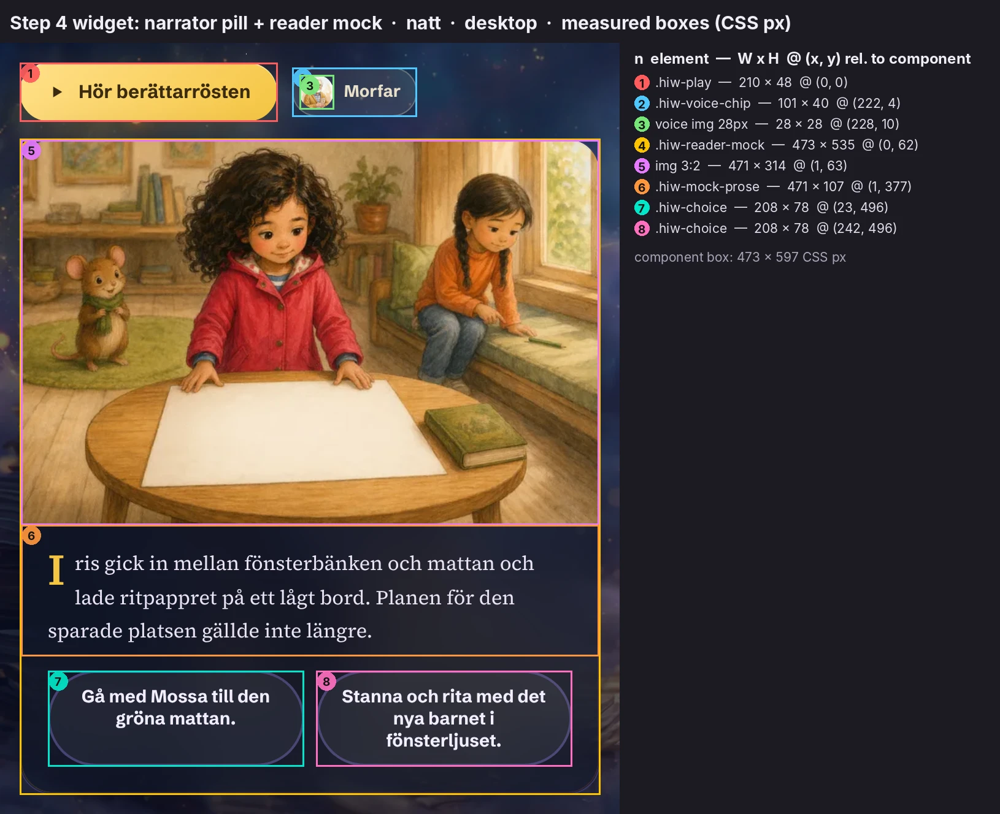

```css
/* source/css/3q17cp_jgfwol.pretty.css:2793-2896 */
.hiw-read-visual {
  flex-direction: column;
  gap: 14px;
  display: flex;
}
.hiw-playrow {
  flex-wrap: wrap;
  align-items: center;
  gap: 12px;
  display: flex;
}
.hiw-play {
  cursor: pointer;
  font-family: var(--ui);
  min-height: 48px;
  color: var(--btn-ink);
  background: var(--btn-grad);
  box-shadow:
    var(--btn-shadow),
    inset 0 1px 0 #ffffff73;
  border: none;
  border-radius: 999px;
  align-items: center;
  gap: 10px;
  padding: 12px 22px;
  font-size: 0.95rem;
  font-weight: 700;
  transition:
    transform 0.25s cubic-bezier(0.2, 0.7, 0.3, 1.4),
    box-shadow 0.3s;
  display: inline-flex;
}
.hiw-play:hover {
  box-shadow: var(--btn-shadow-hover);
  transform: translateY(-2px);
}
.hiw-play svg {
  flex: none;
  width: 16px;
  height: 16px;
}
.hiw-voice-chip {
  font-family: var(--ui);
  color: var(--chip-ink);
  background: var(--chip-bg);
  border: 1px solid var(--chip-line);
  border-radius: 999px;
  align-items: center;
  gap: 8px;
  padding: 5px 12px 5px 5px;
  font-size: 0.85rem;
  font-weight: 700;
  display: inline-flex;
}
.hiw-voice-chip img {
  object-fit: cover;
  border-radius: 50%;
  width: 28px;
  height: 28px;
}
.hiw-reader-mock {
  padding: 0;
  overflow: hidden;
}
.hiw-reader-mock > img {
  aspect-ratio: 3/2;
  object-fit: cover;
  width: 100%;
  display: block;
}
.hiw-mock-prose {
  font-family: var(--serif);
  color: var(--prose-ink);
  padding: 18px 22px 6px;
  font-size: 1.02rem;
  line-height: 1.7;
}
.hiw-mock-prose:first-letter {
  float: left;
  color: var(--accent);
  padding: 3px 8px 0 0;
  font-size: 2.2em;
  font-weight: 600;
  line-height: 0.9;
}
.hiw-mock-choices {
  grid-template-columns: 1fr 1fr;
  gap: 10px;
  padding: 12px 22px 22px;
  display: grid;
}
.hiw-choice {
  font-family: var(--ui);
  text-align: center;
  color: var(--choice-ink);
  background: var(--choice-bg);
  border: 2px solid var(--choice-line);
  overflow-wrap: anywhere;
  border-radius: 999px;
  min-width: 0;
  padding: 10px 14px;
  font-size: 0.9rem;
  font-weight: 600;
}
```

**Play pill** (`button.hiw-play[aria-pressed]`, the `NarrationPlayPill` component).

| | Rest | Playing |
|---|---|---|
| Icon | play triangle `M8 5.5v13l11-6.5z` | pause bars `M7 5h4v14H7zM13 5h4v14h-4z` |
| Label | `Hör berättarrösten` [Hear the narrator's voice]; en `Hear the narrator` | `Spelar...` [Playing...]; en `Playing...` |
| `aria-pressed` | false | true |

* **Style:** the gradient-button recipe at 48 px tall, 15.2 px type and 12×22 padding. Measured 210.2×48 (en 199×48).
* **Hover:** `translateY(-2px)` and the hover shadow ([crop](../screenshots/components/landing/33-play-pill--hover__natt__desktop.png)).
* **Playing:** [natt](../screenshots/components/landing/33-play-pill--playing__natt__desktop.png), [morgon](../screenshots/components/landing/33-play-pill--playing__morgon__desktop.png). Measured: the audio was running at 1.36 s of 13 s.
* **Click behaviour:** plays the sibling `<audio preload="none">`, which is [`/landing/voice/grandpa-sample.mp3`](../assets/audio/landing-voice/grandpa-sample.mp3) (13.06 s) or [`grandpa-sample-en.mp3`](../assets/audio/landing-voice/grandpa-sample-en.mp3) (12.05 s). It also sends `track("cta_clicked",{cta:"hear_voice"})`. A second click pauses; `ended` resets.
* **≤480 px:** full width, capped at 320 px, centred.
* **Reduced motion:** no lift.

**Voice chip.** The chip recipe with a 28 px round portrait, [`narrator-morfar.webp`](../assets/landing/voice/narrator-morfar.webp): a grandfather in watercolour.

* Copy: sv `Morfar` [maternal grandfather]; en `Grandpa Erik`, which uses the same image.
* Measured 101×40 (en 142×40).
* It is not interactive.

**Reader mock.** A glass card with 0 padding and clipped overflow:

1. a 3:2 scene image, [`scene-choice.webp`](../assets/landing/iris/scene-choice.webp) (640×427), alt `Uppslag ur exempelboken, sidan före det första valet` [A spread from the sample book, the page before the first choice];
2. prose in Source Serif 16.32 px / 1.7 in `--prose-ink`, with a **drop cap**: `::first-letter` at 2.2 em, weight 600, floated, coloured `--accent` (gold `#f5c542` in natt, violet `#6d4fe0` in morgon);
3. two choice capsules in a 2-column grid. Each is Schibsted 14.4 px/600, centred, with a 2 px `--choice-line` and `--choice-bg` (white in morgon, white at 6% in natt). Measured 208.5×78 on desktop, three lines; 244×60 on mobile, stacked one per row at ≤400 px.

The choices are `<span>`s, not buttons.

**Mock copy.** The sv prose is built at runtime from the sample book: the first two sentences of beat `S2` in [`source/sample-book.iris-och-den-sparade-platsen.json`](../source/sample-book.iris-och-den-sparade-platsen.json). The choice labels are `S2.choice.options[].label`. The en text is a hard-coded translation.

| | sv | en |
|---|---|---|
| Prose | `Iris gick in mellan fönsterbänken och mattan och lade ritpappret på ett lågt bord. Planen för den sparade platsen gällde inte längre.` | `Iris stepped between the windowsill and the rug and placed the drawing paper on a low table. The plan for the saved place no longer applied.` |
| Choice 1 | `Gå med Mossa till den gröna mattan.` [Go with Mossa to the green rug.] | `Go with Mossa to the green rug.` |
| Choice 2 | `Stanna och rita med det nya barnet i fönsterljuset.` [Stay and draw with the new child in the window light.] | `Stay and draw with the new child in the window light.` |

**Crops.** [Widget natt](../screenshots/components/landing/32-read-visual__natt__desktop.webp) · [morgon](../screenshots/components/landing/32-read-visual__morgon__desktop.webp) · [mobile](../screenshots/components/landing/32-read-visual__natt__mobile.webp) · [mock morgon](../screenshots/components/landing/35-reader-mock__morgon__desktop.webp) · [choice](../screenshots/components/landing/36-mock-choice__natt__desktop.png) · [voice chip](../screenshots/components/landing/34-voice-chip__natt__desktop.png) · [mobile anatomy](../screenshots/components/landing/_anatomy-hiw-step-4__natt__mobile.webp).

### 6.7 Step 5 widget: the four-endings map

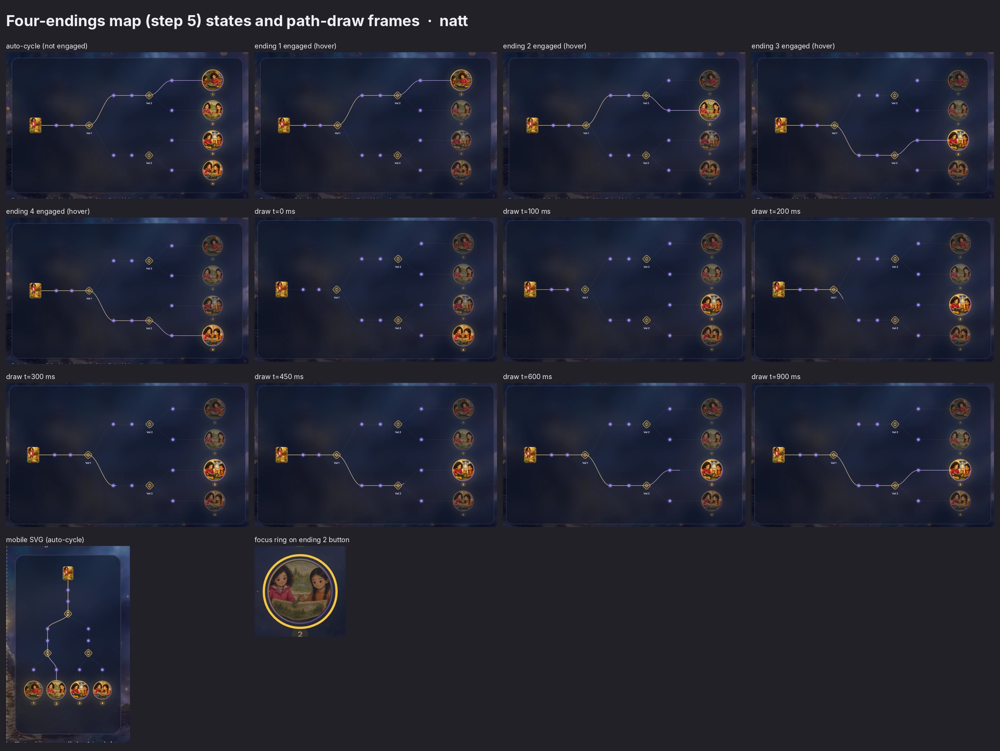

This is the most elaborate component on the page: a branching-path diagram of the sample book *Iris och den sparade platsen*. A hidden caption gives the structure to screen readers:

* sv `Boken börjar likadant för alla. Vid två tillfällen väljer barnet mellan två vägar. Två val ger fyra olika slut.` [The book starts the same for everyone. Twice the child chooses between two paths. Two choices give four different endings.]
* en `The book starts the same for everyone. At two points the child chooses between two paths. Two choices make four different endings.`

**Geometry** (from the JS objects `g` and `u`, `3d9nxlx1n5pdy.js` bytes 7257 and 8483; the same numbers appear in the DOM):

| | Desktop SVG `0 0 960 540`, horizontal | Mobile SVG `0 0 360 620`, vertical (≤720 px) |
|---|---|---|
| Start: cover thumbnail ([`cover-thumb.webp`](../assets/landing/iris/cover-thumb.webp) 128×192), framed with `--card-line` | x 50, y 236, 52×68, rx 8 | x 160, y 20, 40×52, rx 8 |
| Page dots: `r` / halo `r` (halo at 18% opacity) | 6 / 11. Dots at (168,270) (236,270) (420,138) (500,138) (420,402) (500,402) (676,72) (676,204) (676,336) (676,468) | 5 / 9. Dots at (180,108) (180,150) (104,252) (104,296) (256,252) (256,296) (52,404) (137,404) (223,404) (308,404) |
| Choice markers: rounded squares rotated 45° (diamonds), half-size / rx | 13 / 6, at (312,270) (576,138) (576,402) | 11 / 5, at (180,196) (104,342) (256,342) |
| Choice glyph (up and down chevrons) | `M -5 -2 L 0 -7 L 5 -2 M -5 2 L 0 7 L 5 2` | same |
| Choice labels | `Val 1`, `Val 2`, `Val 2` 38 units below each diamond (en `Choice 1/2`) | none |
| Ending medallions: image r / ring r | 42 / 44, at x 856, y 72 · 204 · 336 · 468 | 32 / 34, at y 480, x 52 · 137 · 223 · 308 |
| Number chips under medallions | 22×18, rx 9, at y+50 | 22×18, at y 519 |
| Lit-path gradient | horizontal, `#f5c542` → `#9b87f5` | vertical, the same stops |
| Ring gradient | diagonal, `#f5c542` → `#6D4FE0` | same |

The base paths are 13 straight-plus-cubic segments. For example `M 312 270 C 355.2 270 376.8 138 420 138` is an S-curve with control points at 40% and 60% of the run. Each lit path is the concatenation of one root-to-leaf route; the four routes are `AA`, `AB`, `BA` and `BB`. They map to [`ending-1..4.webp`](../assets/landing/iris/) (256×256), which are the S6AA, S6AB, S6BA and S6BB beats of the sample book.

```css
/* source/css/3q17cp_jgfwol.pretty.css:2897-3038 */
.hiw-map {
  padding: 26px;
}
.hiw-map-stage {
  position: relative;
}
.hiw-map-desktop {
  display: block;
}
.hiw-map-mobile {
  display: none;
}
.hiw-caption {
  font-family: var(--serif);
  color: var(--page-sub);
  max-width: 72ch;
  margin-top: 14px;
  font-size: 0.95rem;
  line-height: 1.6;
}
.hiw-map-cta {
  margin-top: 14px;
}
.hiw-visually-hidden {
  clip: rect(0, 0, 0, 0);
  white-space: nowrap;
  border: 0;
  width: 1px;
  height: 1px;
  margin: -1px;
  padding: 0;
  position: absolute;
  overflow: hidden;
}
.hiw-map .map-path {
  stroke: var(--dash-line);
  fill: none;
  stroke-width: 1.6px;
  stroke-dasharray: 0.1 8;
  stroke-linecap: round;
}
.hiw-map .map-path-lit {
  stroke-width: 2.4px;
  fill: none;
}
.hiw-map .map-path-lit--lit {
  transition:
    stroke-dashoffset 0.9s ease-out,
    opacity 0.2s;
}
.hiw-map .map-path-lit--fading {
  transition: opacity 0.25s;
}
.hiw-map .map-path-lit--off {
  transition: none;
}
.hiw-map .map-dot {
  fill: var(--map-dot);
}
.hiw-map .map-dot-halo {
  fill: var(--map-dot);
  opacity: 0.18;
}
.hiw-map .map-choice {
  fill: var(--gold-chip-bg);
  stroke: var(--gold-soft);
  stroke-width: 1.5px;
}
.hiw-map .map-choice-glyph {
  stroke: var(--gold-chip-ink);
  stroke-width: 1.6px;
  stroke-linecap: round;
  stroke-linejoin: round;
}
.hiw-map .map-choice-label {
  font-family: var(--ui);
  fill: var(--page-sub);
  font-size: 11px;
  font-weight: 600;
}
.hiw-map .map-medallion {
  transform-box: fill-box;
  transform-origin: 50%;
  filter: drop-shadow(0 0 18px var(--map-glow));
  transition:
    transform 0.2s,
    opacity 0.2s;
}
.hiw-map .map-medallion-ring {
  stroke-width: 2px;
}
.hiw-map .map-medallion.is-active {
  transform: scale(1.05);
}
.hiw-map .map-medallion.is-active .map-medallion-ring {
  stroke-width: 3px;
}
.hiw-map .map-medallion.is-dimmed {
  opacity: 0.55;
}
.hiw-map .map-num-bg {
  fill: var(--gold-chip-bg);
}
.hiw-map .map-num {
  font-family: var(--ui);
  fill: var(--gold-chip-ink);
  font-size: 11px;
  font-weight: 700;
}
.hiw-map-btn {
  aspect-ratio: 1;
  cursor: pointer;
  background: 0 0;
  border: none;
  border-radius: 50%;
  width: 9.6%;
  min-width: 44px;
  min-height: 44px;
  padding: 0;
  position: absolute;
  transform: translate(-50%, -50%);
}
.hiw-map-btn:focus-visible {
  outline: 3px solid var(--accent);
  outline-offset: 2px;
}
.hiw-map-btn-1 {
  top: 13.3%;
  left: 89.2%;
}
.hiw-map-btn-2 {
  top: 37.8%;
  left: 89.2%;
}
.hiw-map-btn-3 {
  top: 62.2%;
  left: 89.2%;
}
.hiw-map-btn-4 {
  top: 86.7%;
  left: 89.2%;
}
```

How it looks:

* **Unlit routes** are dotted: a 1.6 px `--dash-line` stroke with `stroke-dasharray: .1 8` and round caps, which renders as a row of tiny dots 8 units apart.
* **The lit route** is a solid 2.4 px gold-to-lavender gradient at 90% opacity.
* **Page dots** are `--map-dot`: lavender `#9b87f5` in natt, violet `#6d4fe0` in morgon.
* **The choice diamonds** are gold in both themes: the gold-chip fill with a `--gold-soft` stroke.
* **Medallions** carry a `drop-shadow(0 0 18px var(--map-glow))`: gold in natt (`#f5c54240`), violet in morgon (`#6d4fe033`).

**Behaviour** (the component `k`, `3d9nxlx1n5pdy.js` bytes 12 706–14 736):

1. **Server render:** route `AA` is lit and medallion 1 is `is-active` (`source/html/home.sv.html` has two `map-path-lit--lit`, one per SVG). This is also what users with reduced motion see; for them the effect returns early.
2. **After hydration:** the lit path is hidden (`drawn=false`) until the map is 40% in view (`IntersectionObserver`, threshold 0.4).
3. **600 ms later:** route `AA` draws. `stroke-dashoffset` runs from 1 to 0 over **0.9 s ease-out** on a `pathLength=1` path, with opacity 0 → 0.9 over 0.2 s.
4. **Auto-cycle:** every **4.5 s** the next route draws (AA → AB → BA → BB → AA). The previous route fades out over 0.25 s (`--fading`, 300 ms).
5. **Engaged:** hovering, focusing or clicking one of the four invisible circular buttons over the medallions (`.hiw-map-btn`, 9.6% wide, minimum 44 px; 19% on mobile) jumps to that route and stops the cycle. The other medallions dim to 55% opacity, and the active one scales to 1.05 with a 3 px ring.
6. **Release:** on mouse-leave or blur the cycle resumes after **6 s**.

Measured transitions after switching to ending 3 ([`_data/map-draw-transitions.json`](../screenshots/components/landing/_data/map-draw-transitions.json)):

* `stroke-dashoffset` 900 ms ease-out
* path `opacity` 200 ms
* fading-path `opacity` 250 ms
* medallion `opacity` and `transform` 200 ms

**Accessibility.** `aria-label` sv `Slut N av 4, visa vägen dit` [Ending N of 4, show the way there]; en `Ending N of 4, show the path there`. `aria-pressed` follows the lit route. Focus-visible is a 3 px `--accent` circle outline at offset 2 ([tab13, natt](../screenshots/components/landing/38-endings-map--focus-visible-tab13__natt__desktop.png)).

**Captured states.**

| State | natt | morgon |
|---|---|---|
| Auto-cycle | [crop](../screenshots/components/landing/38-endings-map__natt__desktop.webp) | [crop](../screenshots/components/landing/38-endings-map__morgon__desktop.webp) |
| Ending 1 engaged | [crop](../screenshots/components/landing/38-endings-map--ending-1-engaged__natt__desktop.webp) | [crop](../screenshots/components/landing/38-endings-map--ending-1-engaged__morgon__desktop.webp) |
| Ending 2 engaged | [crop](../screenshots/components/landing/38-endings-map--ending-2-engaged__natt__desktop.webp) | [crop](../screenshots/components/landing/38-endings-map--ending-2-engaged__morgon__desktop.webp) |
| Ending 3 engaged | [crop](../screenshots/components/landing/38-endings-map--ending-3-engaged__natt__desktop.webp) | [crop](../screenshots/components/landing/38-endings-map--ending-3-engaged__morgon__desktop.webp) |
| Ending 4 engaged | [crop](../screenshots/components/landing/38-endings-map--ending-4-engaged__natt__desktop.webp) | [crop](../screenshots/components/landing/38-endings-map--ending-4-engaged__morgon__desktop.webp) |
| Mobile | [crop](../screenshots/components/landing/38-endings-map__natt__mobile.png) | [crop](../screenshots/components/landing/38-endings-map__morgon__mobile.png) |

**Draw frames.** To get exact frames, the CSS transitions were paused through `document.getAnimations()` and their `currentTime` set to each value: `38-endings-map--draw-t{000,100,200,300,450,600,900}ms__{natt,morgon}__desktop.png`. One example: [t = 200 ms](../screenshots/components/landing/38-endings-map--draw-t200ms__natt__desktop.webp).

**Caption and CTA.**

* Caption, serif 15.2 px in `--page-sub`, max 72 ch: sv `Kartan över exempelboken Iris och den sparade platsen. Varje prick är en sida, varje guldstjärna ett val, varje medaljong ett slut. Alla fyra finns på riktigt.` [The map of the sample book Iris and the Saved Place. Every dot is a page, every gold star a choice, every medallion an ending. All four really exist.]
* The caption says **"guldstjärna" (gold star)**, but the choice markers are drawn as gold **diamonds** with chevrons. The only stars on the page are the micro-line sparkles.
* Under the caption sits a ghost button: `Läs exempelboken` [Read the sample book] → `/share/iris-sparade-platsen`. That route returns 404 on the server ([`source/html/share_iris-sparade-platsen.404.sv.html`](../source/html/share_iris-sparade-platsen.404.sv.html)).
* Crop: [caption + CTA](../screenshots/components/landing/39-map-caption-cta__natt__desktop.webp).

### 6.8 Step 6 widget: next-book memory card

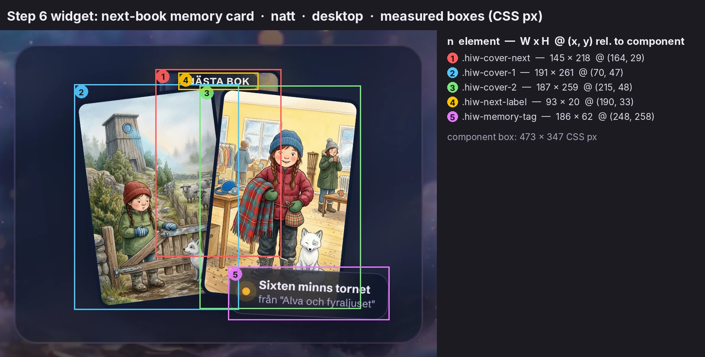

```css
/* source/css/3q17cp_jgfwol.pretty.css:3039-3123 */
.hiw-bookfan {
  justify-content: center;
  align-items: flex-end;
  padding: 34px 0 24px;
  display: flex;
  position: relative;
}
.hiw-cover {
  aspect-ratio: 2/3;
  object-fit: cover;
  border: 4px solid var(--frame);
  width: 38%;
  box-shadow: var(--card-shadow);
  border-radius: 14px;
}
.hiw-cover-next {
  opacity: 0.85;
  width: 34%;
  filter: drop-shadow(0 0 22px var(--map-glow));
  z-index: 0;
  position: absolute;
  top: 6px;
  left: 50%;
  transform: translate(-50%);
}
.hiw-cover-1 {
  z-index: 1;
  transform: rotate(-7deg) translate(6%);
}
.hiw-cover-2 {
  z-index: 2;
  transform: rotate(6deg) translate(-6%);
}
.hiw-next-label {
  font-family: var(--ui);
  letter-spacing: 0.05em;
  text-transform: uppercase;
  color: #fff7e9;
  z-index: 0;
  background: #0a0c188c;
  border-radius: 999px;
  padding: 3px 10px;
  font-size: 0.72rem;
  font-weight: 700;
  position: absolute;
  top: 10px;
  left: 50%;
  transform: translate(-50%);
}
.hiw-memory-tag {
  z-index: 3;
  background: var(--card);
  -webkit-backdrop-filter: blur(var(--card-blur));
  backdrop-filter: blur(var(--card-blur));
  border: 1px solid var(--card-line);
  color: var(--card-ink);
  box-shadow: var(--card-shadow);
  border-radius: 16px;
  align-items: center;
  gap: 10px;
  padding: 10px 14px;
  display: flex;
  position: absolute;
  bottom: 8px;
  right: 4%;
  transform: rotate(2.5deg);
}
.hiw-memory-tag .dotpulse {
  background: var(--gold);
  border-radius: 50%;
  flex: none;
  width: 9px;
  height: 9px;
  animation: 2.4s infinite pulse;
  box-shadow: 0 0 #f2b22e80;
}
.hiw-memory-tag b {
  font-size: 0.85rem;
  display: block;
}
.hiw-memory-tag div span {
  color: var(--card-sub);
  font-size: 0.75rem;
  display: block;
}
```

**Anatomy.**

* **Two covers:** `cover-tornet` at −7° and `cover-filten` at +6°, each 38% wide, 2:3, with a 4 px frame and radius 14. They overlap by 6%.
* **The ghost of the next book:** behind them, [`cover-next-book.webp`](../assets/landing/cover-next-book.webp) at 34% width and 85% opacity, glowing with `--map-glow`.
* **The label `nästa bok`** [next book] (en `next book`): uppercase 11.52 px/700 with 0.05 em tracking, **hard-coded** cream `#fff7e9` on near-black `#0a0c188c` in both themes.
* **The memory tag:** the hero badge's little sibling. It is a glass card with radius 16 and a **static** 2.5° tilt, a 9 px `.dotpulse`, and the text `Sixten minns tornet` / `från "Alva och fyraljuset"` at 13.6 px and 12 px. 186×62 (en 240×64).

**Crops.** [natt](../screenshots/components/landing/41-memory-card__natt__desktop.webp) · [morgon](../screenshots/components/landing/41-memory-card__morgon__desktop.webp) · [tag](../screenshots/components/landing/42-memory-tag__natt__desktop.png) · [mobile](../screenshots/components/landing/41-memory-card__morgon__mobile.png).

### 6.9 Closing CTAs

```css
/* source/css/3q17cp_jgfwol.pretty.css:3124-3131 */
.hiw-closing {
  flex-wrap: wrap;
  justify-content: center;
  align-items: center;
  gap: 14px;
  margin-top: 40px;
  display: flex;
}
```

Two buttons, centred under the steps with a 14 px gap:

* primary `Skapa er hjälte` → `/start`, tracked as `cta:"explainer_primary"`;
* ghost `Läs exempelboken` → `/share/iris-sparade-platsen`, tracked as `cta:"sample_book"`.

en: `Create your hero`, `Read the sample book`. On mobile they wrap into two centred rows (334×124). Crops: [natt](../screenshots/components/landing/43-hiw-closing-ctas__natt__desktop.png), [morgon](../screenshots/components/landing/43-hiw-closing-ctas__morgon__desktop.png).

---

## 7. "Din hjälte" (your hero)

These sections render as a demo of the logged-in "Min värld" (my world) builder. Every element is either decorative or links to `/signup` or `/login`.

### 7.1 Section head and section chip

```css
/* source/css/3q17cp_jgfwol.pretty.css:1038-1046, 1055-1062, 1087-1098 */
section {
  padding: 44px 0 8px;
}
.sec-head {
  align-items: center;
  gap: 14px;
  margin-bottom: 22px;
  display: flex;
}
/* … */
h2 {
  font-family: var(--display);
  letter-spacing: -0.01em;
  color: var(--page-ink);
  font-size: clamp(1.5rem, 2.4vw, 2rem);
  font-weight: 600;
  transition: color 0.5s;
}
/* … */
.sec-chip {
  color: var(--chip-ink);
  background: var(--chip-bg);
  border: 1px solid var(--chip-line);
  -webkit-backdrop-filter: blur(10px);
  backdrop-filter: blur(10px);
  border-radius: 999px;
  padding: 6px 12px;
  font-size: 0.8rem;
  font-weight: 700;
  transition: all 0.5s;
}
```

**Anatomy.** An H2 (Lora 600, 32 px on desktop, 24 px on mobile, −0.01 em tracking) is followed by a chip on the same line (gap 14). The chip uses the chip recipe at 12.8 px/700 with 6×12 padding and a 10 px blur.

**Intro line.** An inline-styled `<p>` is pulled up 12 px: `margin:-12px 0 20px; font-family:var(--ui); font-size:.92rem; color:var(--card-sub); line-height:1.5`.

| | H2 | Chip | Intro |
|---|---|---|---|
| sv | `Din hjälte` [Your hero] | `barnens favorit` [the children's favourite] | `Den som varje saga handlar om.` [The one every story is about.] |
| en | `Your hero` | `the family favorite` | `The one every story is about.` |

Chip sizes: 122×30 (en 139×30). The second section head is `Bokhyllan` [The bookshelf] with the chip `2 färdiga böcker` [2 finished books]; en `The bookshelf` / `2 finished books`.

**Crops.** [Head natt](../screenshots/components/landing/44-sec-head-din-hjalte__natt__desktop.png) · [morgon](../screenshots/components/landing/44-sec-head-din-hjalte__morgon__desktop.png) · [chip](../screenshots/components/landing/45-sec-chip__natt__desktop.png) · [Bokhyllan head](../screenshots/components/landing/58-sec-head-bokhyllan__natt__desktop.png).

### 7.2 Builder card: portrait frame, pencil FAB, name

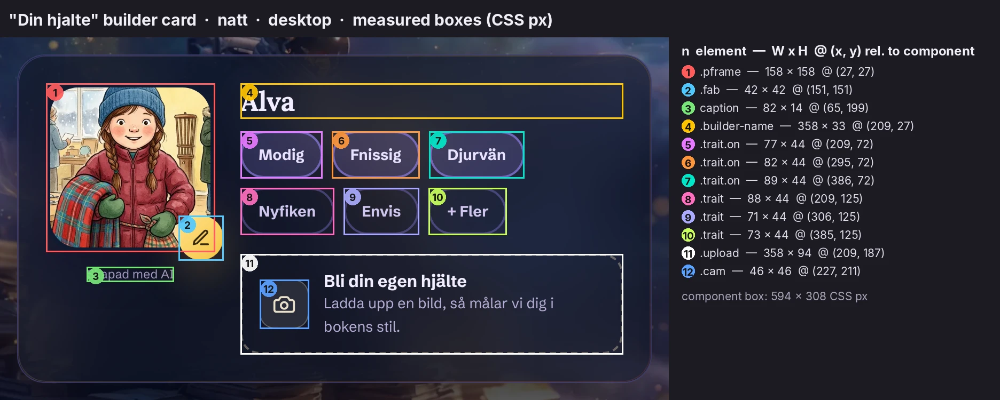

```css
/* source/css/3q17cp_jgfwol.pretty.css:1148-1216 */
.builder-grid {
  grid-template-columns: 1.25fr 0.95fr;
  gap: 18px;
  display: grid;
}
.builder-grid--summary {
  grid-template-columns: minmax(0, 1fr);
}
.builder {
  align-items: flex-start;
  gap: 24px;
  padding: 26px;
  display: flex;
}
.builder-pic {
  flex: none;
  width: 158px;
  position: relative;
}
.builder-pic .pframe {
  border: 4px solid var(--frame);
  border-radius: 30px;
  width: 158px;
  height: 158px;
  transition: border-color 0.5s;
  position: relative;
  overflow: hidden;
  box-shadow: 0 16px 36px #0a07204d;
}
.builder-pic .pframe img {
  object-fit: cover;
  object-position: 47% 18%;
  width: 100%;
  height: 100%;
  display: block;
  transform: scale(1.7);
}
.builder-pic .fab {
  cursor: pointer;
  background: var(--btn-grad);
  width: 42px;
  height: 42px;
  color: var(--btn-ink);
  box-shadow: var(--btn-shadow);
  border: none;
  border-radius: 50%;
  place-items: center;
  transition:
    transform 0.25s cubic-bezier(0.2, 0.7, 0.3, 1.4),
    background 0.5s;
  display: grid;
  position: absolute;
  bottom: -8px;
  right: -8px;
}
.builder-pic .fab:hover {
  transform: scale(1.1);
}
.builder-pic .fab svg {
  width: 18px;
  height: 18px;
}
.builder-name {
  font-family: var(--display);
  letter-spacing: -0.01em;
  margin-bottom: 12px;
  font-size: 1.6rem;
  font-weight: 700;
}
```

**Grid.** `1.25fr .95fr`, which comes to 594.3 | 451.7 px with an 18 px gap. One column at ≤880 px.

**Builder card.** A glass card with 26 px padding. The left column holds:

* **The portrait frame:** a 158 px rounded square (radius 30) with a 4 px `--frame` border and its own drop shadow. It shows [`cover-filten.webp`](../assets/assets/cover-filten.webp) **zoomed 1.7× and positioned at 47% 18%**, so the book cover is cropped into a face portrait. The same artwork serves as both cover and avatar.
* **The FAB:** a 42 px gradient disc with a pencil icon (`M12 20h9` + `M16.5 3.5a2.1 2.1 0 0 1 3 3L7 19l-4 1 1-4z`). It overhangs the bottom-right corner by 8 px and is a link to `/login` (aria-label `Ändra utseende` [Change appearance]; en `Change appearance`).
* **The caption:** an inline-styled `Skapad med AI` (11.52 px, `--card-sub`, 14 px top margin).

To the right, the name `Alva` is set in Lora 25.6 px/700.

**FAB hover.** `scale(1.1)` on the springy 0.25 s curve ([hover](../screenshots/components/landing/48-builder-portrait-fab--hover__natt__desktop.png)).

**Crops.** [Card natt](../screenshots/components/landing/47-hero-builder-card__natt__desktop.webp) · [morgon](../screenshots/components/landing/47-hero-builder-card__morgon__desktop.png) · [mobile morgon](../screenshots/components/landing/47-hero-builder-card__morgon__mobile.webp) · [portrait + FAB](../screenshots/components/landing/48-builder-portrait-fab__natt__desktop.png).

### 7.3 Trait chips (`.trait` vs `.trait.on`) and the upload tile

```css
/* source/css/3q17cp_jgfwol.pretty.css:1217-1283 */
.trait-row {
  flex-wrap: wrap;
  gap: 9px;
  margin-bottom: 18px;
  display: flex;
}
.trait {
  font-family: var(--ui);
  color: var(--trait-ink);
  border: 2px solid var(--trait-line);
  cursor: pointer;
  background: 0 0;
  border-radius: 999px;
  justify-content: center;
  align-items: center;
  min-height: 44px;
  padding: 8px 15px;
  font-size: 0.88rem;
  font-weight: 700;
  transition: all 0.25s;
  display: inline-flex;
}
.trait.on {
  background: var(--trait-on-bg);
  border-color: var(--trait-on-line);
  color: var(--trait-on-ink);
}
.trait:hover {
  border-color: var(--trait-on-line);
}
.upload {
  border: 2px dashed var(--dash-line);
  cursor: pointer;
  border-radius: 18px;
  align-items: center;
  gap: 14px;
  padding: 14px 16px;
  transition: border-color 0.3s;
  display: flex;
}
.upload:hover {
  border-color: var(--accent);
}
.upload .cam {
  background: var(--chip-bg);
  border: 1px solid var(--chip-line);
  width: 46px;
  height: 46px;
  color: var(--chip-ink);
  border-radius: 14px;
  flex: none;
  place-items: center;
  display: grid;
}
.upload .cam svg {
  width: 22px;
  height: 22px;
}
.upload b {
  font-size: 0.98rem;
  display: block;
}
.upload span {
  color: var(--card-sub);
  font-size: 0.85rem;
  line-height: 1.45;
}
```

**Traits.** Six `<span>`s in a wrapping row (gap 9). Each is a 44 px pill with a 2 px border, 8×15 padding and 14.08 px/700 type.

| Trait | sv [en] | State |
|---|---|---|
| 1 | `Modig` [Brave] | `.on` |
| 2 | `Fnissig` [Giggly] | `.on` |
| 3 | `Djurvän` [Animal lover] | `.on` |
| 4 | `Nyfiken` [Curious] | off |
| 5 | `Envis` [Stubborn] | off |
| 6 | `+ Fler` [+ More] | off |

The two states, measured:

| | `.trait` (off) | `.trait.on` | `.trait:hover` |
|---|---|---|---|
| natt fill | transparent | `rgba(155,135,245,.20)` (rendered `#2c2d51`) | unchanged |
| natt border | `rgba(155,135,245,.35)` | `rgba(155,135,245,.60)` | becomes `rgba(155,135,245,.60)` |
| natt ink | `#cfc5ec` | `#e9e2ff` | unchanged |
| morgon fill | transparent | `rgba(109,79,224,.12)` (rendered `#e9e5f7`) | unchanged |
| morgon border | `rgba(109,79,224,.28)` | `rgba(109,79,224,.42)` | becomes `rgba(109,79,224,.42)` |
| morgon ink | `#5f5878` | `#4a36a8` | unchanged |

**Read:** "on" is signalled by a tinted fill, a stronger border and brighter ink at once, never by a check mark. Hover previews the "on" border only.

**Not interactive.** The chips have `cursor: pointer` and a hover border, but they are inert `<span>`s: no handler, no `tabindex`, absent from the tab order.

Crops:

| | natt | morgon |
|---|---|---|
| on | [crop](../screenshots/components/landing/50-trait-on__natt__desktop.png) | [crop](../screenshots/components/landing/50-trait-on__morgon__desktop.png) |
| off | [crop](../screenshots/components/landing/51-trait-off__natt__desktop.png) | [crop](../screenshots/components/landing/51-trait-off__morgon__desktop.png) |
| off, hover | [crop](../screenshots/components/landing/51-trait-off--hover__natt__desktop.png) | |
| `+ Fler` | [crop](../screenshots/components/landing/52-trait-more__natt__desktop.png) | |
| row | [crop](../screenshots/components/landing/49-builder-name-traits__natt__desktop.png) | |

**Upload tile.** `a.upload` → `/signup`. A dashed 2 px `--dash-line` box (radius 18, 14×16 padding) holds a 46 px chip-styled camera square (radius 14, camera icon at 22 px) and two text lines:

* `Bli din egen hjälte` [Become your own hero] at 15.68 px bold
* `Ladda upp en bild, så målar vi dig i bokens stil.` [Upload a picture and we paint you in the book's style.] at 13.6 px, `--card-sub`

en: `Become your own hero` / `Upload a photo, and we paint you into the book's style.`

On hover the dashed border turns `--accent`: solid gold `#f5c542` in natt, `#6d4fe0` in morgon ([hover natt](../screenshots/components/landing/53-upload-tile--hover__natt__desktop.png), [hover morgon](../screenshots/components/landing/53-upload-tile--hover__morgon__desktop.png)). Focus shows the UA ring ([tab20](../screenshots/components/landing/53-upload-tile--focus-visible-tab20__natt__desktop.png)).

### 7.4 Friends card ("Ta med en vän") and "Lägg till en vän"

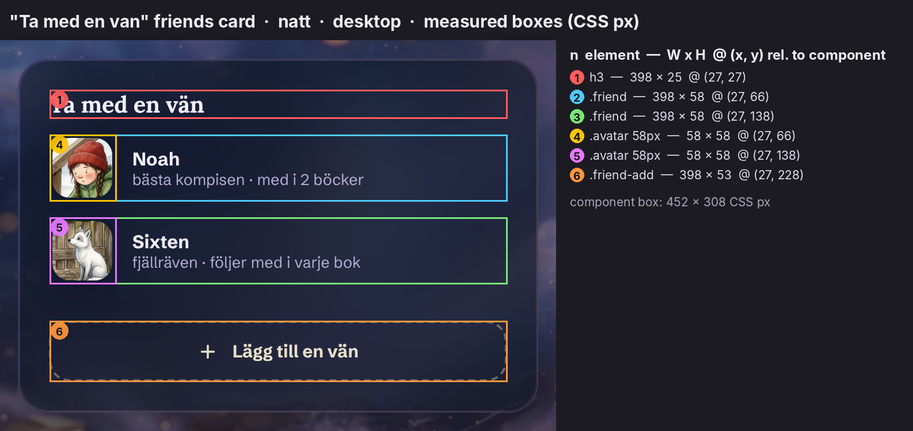

```css
/* source/css/3q17cp_jgfwol.pretty.css:1284-1348 */
.friends {
  flex-direction: column;
  gap: 14px;
  padding: 26px;
  display: flex;
}
.friends h3 {
  font-family: var(--display);
  letter-spacing: -0.01em;
  font-size: 1.25rem;
  font-weight: 700;
}
.friend {
  align-items: center;
  gap: 14px;
  display: flex;
}
.friend .avatar {
  border: 3px solid var(--frame);
  border-radius: 18px;
  flex: none;
  width: 58px;
  height: 58px;
  transition: border-color 0.5s;
  overflow: hidden;
  box-shadow: 0 10px 22px #0a072040;
}
.friend .avatar img {
  object-fit: cover;
  width: 100%;
  height: 100%;
  display: block;
}
.friend b {
  font-size: 1rem;
}
.friend span {
  color: var(--card-sub);
  font-size: 0.84rem;
  display: block;
}
.friend-add {
  border: 2px dashed var(--dash-line);
  cursor: pointer;
  color: var(--chip-ink);
  font-size: 0.95rem;
  font-weight: 700;
  font-family: var(--ui);
  background: 0 0;
  border-radius: 18px;
  justify-content: center;
  align-items: center;
  gap: 12px;
  margin-top: auto;
  padding: 15px;
  transition: border-color 0.3s;
  display: flex;
}
.friend-add:hover {
  border-color: var(--accent);
}
.friend-add svg {
  width: 18px;
  height: 18px;
}
```

**Anatomy.** A glass card (26 px padding, column, gap 14) holds:

* an h3 `Ta med en vän` [Bring a friend] in Lora 20 px/700;
* two `.friend` rows, each a **58 px rounded-square avatar** (radius 18, 3 px `--frame` border, its own shadow) next to a name (16 px bold) and a sub-line (13.44 px, `--card-sub`), using the same copy as §6.4;
* `a.friend-add` → `/signup`: a dashed 2 px box (radius 18, padding 15, `margin-top:auto` so it sticks to the card bottom) with a 18 px plus icon and `Lägg till en vän` [Add a friend] (en `Add a friend`) in 15.2 px/700 `--chip-ink`.

**States.** Hover turns the dashed border `--accent` ([hover](../screenshots/components/landing/56-friend-add--hover__natt__desktop.png)). Focus shows the UA ring ([tab21](../screenshots/components/landing/56-friend-add--focus-visible-tab21__natt__desktop.png)).

**Crops.** [Card natt](../screenshots/components/landing/54-friends-card__natt__desktop.png) · [morgon](../screenshots/components/landing/54-friends-card__morgon__desktop.png) · [row](../screenshots/components/landing/55-friend-row__natt__desktop.png) · [add](../screenshots/components/landing/56-friend-add__natt__desktop.png).

---

## 8. "Bokhyllan" (the bookshelf)

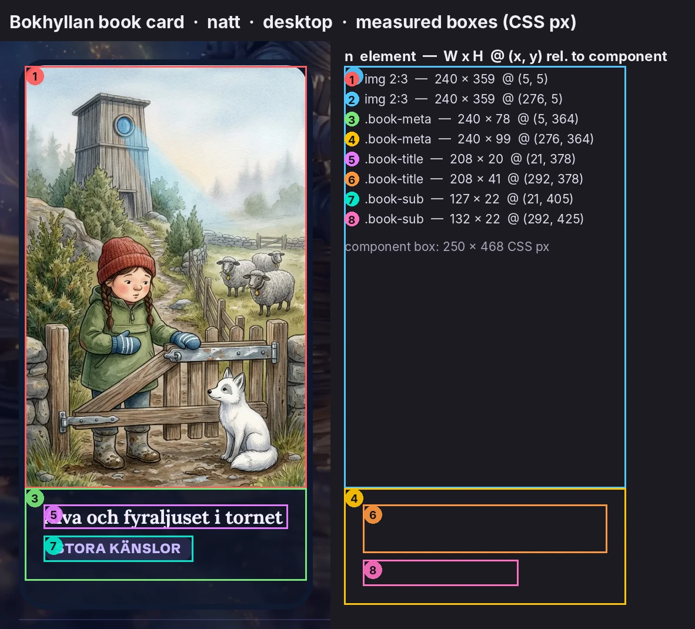

```css
/* source/css/3q17cp_jgfwol.pretty.css:1480-1531 */
.shelf {
  grid-template-columns: repeat(auto-fill, minmax(215px, 1fr));
  gap: 22px;
  display: grid;
}
.book {
  background: var(--card);
  border: 5px solid var(--frame);
  box-shadow: var(--card-shadow);
  cursor: pointer;
  color: var(--card-ink);
  border-radius: 22px;
  transition:
    transform 0.35s cubic-bezier(0.2, 0.7, 0.3, 1.2),
    box-shadow 0.35s,
    background 0.5s,
    border-color 0.5s,
    color 0.5s;
  position: relative;
  overflow: hidden;
}
.book:hover {
  transform: translateY(-10px) rotate(-1deg);
}
.book img {
  aspect-ratio: 2/3;
  object-fit: cover;
  width: 100%;
  display: block;
}
.book-meta {
  padding: 14px 16px 16px;
}
.book-title {
  font-family: var(--display);
  letter-spacing: -0.01em;
  font-size: 1.02rem;
  font-weight: 700;
  line-height: 1.25;
}
.book-sub {
  letter-spacing: 0.04em;
  text-transform: uppercase;
  background: var(--pill-bg);
  color: var(--pill-ink);
  border-radius: 999px;
  margin-top: 6px;
  padding: 4px 10px;
  font-size: 0.72rem;
  font-weight: 800;
  display: inline-flex;
}
```

**Shelf.** `grid-template-columns: repeat(auto-fill, minmax(215px, 1fr))` with a 22 px gap. At 1064 px that makes four 249.5 px columns, of which only two are filled. At 334 px it is one column, so each book is 334×574 on mobile.

**Book card.** `a.book` → `/signup` is a card-tinted block (`--card`, **no backdrop blur**). It has a 5 px `--frame` border (navy in natt, white in morgon), radius 22, the card shadow and `overflow:hidden`. Inside:

* the full 2:3 cover;
* `.book-meta`, padding 14/16/16;
* the title in Lora 16.32 px/700 at 1.25 leading;
* an uppercase **genre tag** pill: 11.52 px/800, 0.04 em tracking, `--pill-bg`/`--pill-ink`.

**Hover.** `translateY(-10px) rotate(-1deg)` on a 0.35 s spring: the book lifts off the shelf and tips slightly ([hover natt](../screenshots/components/landing/59-book-card--hover__natt__desktop.webp)). Focus shows the UA ring around the whole card ([tab22](../screenshots/components/landing/59-book-card--focus-visible-tab22__natt__desktop.webp)).

**Copy.**

| | sv | en |
|---|---|---|
| Book 1 title | `Alva och fyraljuset i tornet` [Alva and the four-light in the tower] | `Alva and the Fourth Candle in the Tower` |
| Book 1 tag | `Stora känslor` → `STORA KÄNSLOR` [Big feelings] | `Big feelings` |
| Book 2 title | `Alva och filten vid elementet` [Alva and the blanket by the radiator] | `Alva and the Blanket by the Radiator` |
| Book 2 tag | `Mysigt äventyr` [Cozy adventure] | `Cozy adventure` |

The book 2 title wraps to two lines and book 1 does not. Both cards stretch to the row height, so book 1 has spare space at the bottom.

**Crops.** [Shelf natt](../screenshots/components/landing/57-shelf-section__natt__desktop.webp) · [morgon](../screenshots/components/landing/57-shelf-section__morgon__desktop.webp) · [card natt](../screenshots/components/landing/59-book-card__natt__desktop.webp) · [card morgon](../screenshots/components/landing/59-book-card__morgon__desktop.webp) · [tag](../screenshots/components/landing/60-book-genre-tag__natt__desktop.png) · [mobile](../screenshots/components/landing/57-shelf-section__natt__mobile.webp).

---

## 9. Footer

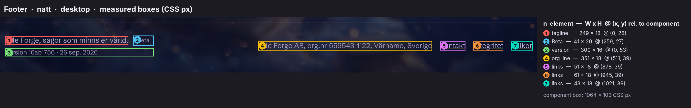

```css
/* source/css/3q17cp_jgfwol.pretty.css:1933-1947 */
.foot {
  border-top: 1px solid var(--card-line);
  color: var(--foot-ink);
  flex-wrap: wrap;
  justify-content: space-between;
  gap: 16px;
  margin-top: auto;
  padding: 26px 0 34px;
  font-size: 0.9rem;
  transition: color 0.5s;
  display: flex;
}
.foot a {
  color: var(--foot-ink);
}
```

**Layout.** A hairline (`--card-line`) above, then two clusters with `space-between`, wrapping on mobile.

**Left cluster** (inline column, gap 6):

* the tagline `Tale Forge, sagor som minns er värld.` [Tale Forge, stories that remember your world.] (en `Tale Forge, storybooks that remember your world.`), followed by a **Beta** pill;
* the version line `Version 16ab1756 · 26 sep. 2026` (en `… · 26 Sep 2026`).

**Right cluster** (inline-flex, gap 16):

* the org line `Tale Forge AB, org.nr 559543-1122, Värnamo, Sverige` (en `Tale Forge AB, reg. no. 559543-1122, Varnamo, Sweden`);
* three underlined links: `Kontakt` (a `mailto:` link), `Integritet` → `/integritet`, `Villkor` → `/villkor` (en `Contact`, `Privacy`, `Terms`).

Inline styles, verbatim from the DOM:

```css
/* Beta badge  [data-testid="beta-build-label"] */
padding: 2px 7px; border: 1px solid var(--card-line); border-radius: 999px;
font-family: var(--ui); font-size: 0.7rem; letter-spacing: 0.03em; opacity: 0.8;
/* version  [data-testid="footer-version"] */
color: var(--card-sub); opacity: 0.85; font-size: 0.8rem;
/* org line */
color: var(--card-sub); opacity: 0.85;
/* each link */
color: var(--card-sub); text-decoration-color: var(--accent);
```

**Measured.**

* Footer type is 14.4 px in `--foot-ink`: `#b7a9d6` (natt), `#5f5878` (morgon).
* Beta pill: 40.9×20, 11.2 px.
* Links keep the default underline, coloured `--accent`: a **gold underline under lavender text** in natt, a violet underline in morgon. They have no hover style ([hover](../screenshots/components/landing/63-footer-org-links--hover__natt__desktop.png)) and show the UA focus ring ([tab24](../screenshots/components/landing/63-footer-org-links--focus-visible-tab24__natt__desktop.png)).
* Mobile: 334×189, with each cluster on its own rows ([crop](../screenshots/components/landing/61-footer__morgon__mobile.png)).

**Crops.** [Footer natt](../screenshots/components/landing/61-footer__natt__desktop.png) · [morgon](../screenshots/components/landing/61-footer__morgon__desktop.png) · [beta](../screenshots/components/landing/62-beta-badge__natt__desktop.png) · [org + links](../screenshots/components/landing/63-footer-org-links__natt__desktop.png).

---

## 10. State matrix

These values come from computed styles read before and after `hover()` (700 ms settle), during `mouse.down()`, and while focused by Tab ([`_data/states.json`](../screenshots/components/landing/_data/states.json), [`_data/focus-order.json`](../screenshots/components/landing/_data/focus-order.json)). "UA ring" means Chromium's default `outline: auto 1px`, a dark `#101010` and white double ring on desktop (computed `rgb(229,151,0) auto` under mobile emulation). Visual sheets: [natt](../screenshots/components/landing/_sheet-states__natt__desktop.webp), [morgon](../screenshots/components/landing/_sheet-states__morgon__desktop.webp).

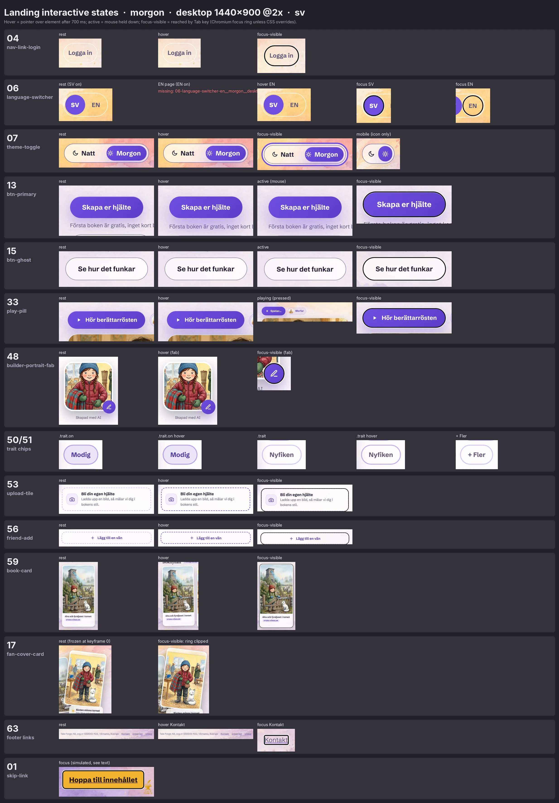

| Component | Rest | Hover | Active | Focus-visible | Selected / other |
|---|---|---|---|---|---|
| Skip link | hidden | n/a | n/a | **never reachable** (§3) | n/a |
| Logo | gold or violet wordmark | none | none | UA ring | n/a |
| Nav links | hairline pill | none | none | UA ring | signed-in variant (§4.3) |
| Language button | transparent, `--card-sub` | none | none | UA ring on the 44 px disc | `aria-pressed=true`: `--accent` disc, `--btn-ink`, 800 |
| Theme toggle | thumb under the current theme | none | none | **3 px accent outline +3 offset, 6 px halo** | `aria-checked=true` (morgon): thumb `translate(100%)` |
| `.btn-primary` | gradient + glow + inset highlight | `translateY(-3px)`, bigger glow, inset highlight lost | (mouse) same as hover, because hover beats `scale(.96)` | UA ring | n/a |
| `.btn-ghost` | translucent, blurred, hairline | **none** | `scale(.96)` | UA ring | n/a |
| Fan cover links | tilted, floating | none | none | **ring clipped, invisible** | n/a |
| `.hiw-play` | gradient pill, ▶ | `translateY(-2px)`, bigger glow | none | UA ring | playing: ❚❚ `Spelar...`, `aria-pressed=true` |
| `.hiw-map-btn` (×4) | invisible | engages the route, dims others | same | **3 px accent circle, offset 2** | `aria-pressed` on the lit route; `.map-medallion.is-active` scale 1.05, ring 3 px; `.is-dimmed` opacity .55 |
| `.fab` | gradient disc | `scale(1.1)` | none | UA ring | n/a |
| `.trait` (span) | hairline pill | border → on-line | n/a (inert) | not focusable | `.on`: tint + border + ink |
| `.upload` | dashed `--dash-line` | dashed `--accent` | none | UA ring | n/a |
| `.friend-add` | dashed `--dash-line` | dashed `--accent` | none | UA ring | n/a |
| `.book` | framed cover card | `translateY(-10px) rotate(-1deg)` | none | UA ring around the card | n/a |
| Footer links | underline in `--accent` | none | none | UA ring | n/a |
| Disabled | none on the landing page | | | | |

---

## 11. Keyboard: tab order and focus rings

Tab order from a fresh load, desktop, both themes (26 stops). The full data with boxes and computed outline is in [`_data/focus-order.json`](../screenshots/components/landing/_data/focus-order.json). Each crop is `NN-component--focus-visible-tabNN__{natt,morgon}__desktop.png`.

| Tab | Element | Outline (natt) |
|---|---|---|
| (skip link) | never focused | n/a |
| 1 | Logo `/` | UA `auto 1px` |
| 2–3 | `Logga in`, `Priser` | UA |
| 4–5 | `SV`, `EN` | UA |
| 6 | Theme switch | `3px solid #f5c542`, offset 3 (morgon `#6d4fe0`) + 6 px halo |
| 7–8 | Hero primary, hero ghost | UA |
| 9–10 | Fan cover links (aria-labels are the book titles) | UA, **clipped by `.fbook{overflow:hidden}`** |
| 11 | `Hör berättarrösten` | UA |
| 12–15 | Map ending buttons 1–4 | `3px solid` accent, offset 2 |
| 16 | `Läs exempelboken` (under the map) | UA |
| 17–18 | Closing `Skapa er hjälte`, `Läs exempelboken` | UA |
| 19 | FAB `Ändra utseende` | UA |
| 20 | Upload tile | UA |
| 21 | `Lägg till en vän` | UA |
| 22–23 | Book cards | UA |
| 24–26 | `Kontakt`, `Integritet`, `Villkor` | UA |

Contact strip of selected focus crops: [focus sheet column in the state sheet](../screenshots/components/landing/_sheet-states__natt__desktop.webp).

**Read:** two components got bespoke rings, the theme switch and the map buttons. In both the visual target is not the element's text: a sliding thumb, and an invisible hit area over a picture. Every ordinary link and button falls back to the browser ring, which on the dark nebula is a thin dark-and-white double ring.

---

## 12. Natt vs Morgon, per component

| Component | Natt | Morgon |
|---|---|---|
| Logo | gold `#f5c542` with a gold halo | violet `#6d4fe0` with a soft violet halo; the mark keeps its gold glow |
| Nav pills | lavender hairline `#9b87f542`, ink `#b5acd3` | white hairline `#ffffffe6`, ink `#5f5878` |
| Selected language | gold disc, brown text | violet disc, white text |
| Theme thumb | gold gradient, on the left | violet gradient, slid right |
| Kicker, section chip, voice chip | cream ink on cream at 10% | violet ink on violet at 8% |
| H1 accent | gold `#f5c542` + dark text halo | violet `#5b3fc7`, no shadow |
| Primary button / play pill / FAB | gold gradient `#ffe08a→#f5c542`, brown ink, gold glow | violet gradient `#6d4fe0→#5b3fc7`, white ink, violet glow |
| Ghost button | smoky glass `rgba(255,249,236,.1)`, cream ink, cream hairline | milky glass `rgba(255,255,255,.72)`, plum ink, solid `#887da0` hairline |
| Glass cards | navy glass `rgba(15,22,40,.68)`, blur 22 | white glass `rgba(255,255,255,.8)`, blur 24 |
| Cover frames, avatar frames, portrait frame | navy `#101a30` | white `#fff` |
| Step nodes | gold chip, light-gold numeral `#ffd98f` | gold chip, dark-gold numeral `#8f6a12` |
| Map dots / glow | lavender dots, gold medallion glow | violet dots, violet glow |
| Map choice diamonds, lit-path gradient, ring gradient | gold / gold→lavender / gold→violet | **unchanged** (hard-coded) |
| Drop cap | gold | violet |
| Mock choices | white at 6% on navy | solid white |
| Trait on | lavender tint | violet tint, deep-violet ink `#4a36a8` |
| Dashed borders (rail, upload, friend-add, invite) | cream `#ffecbe59` | violet `#6d4fe059` |
| Unchanged in both | AI chip (white label), `nästa bok` label (dark), skip link (gold), bake-bar gradient, `.dotpulse` gold, `.hiw-star` gold, fan cover gold glow | |

Side-by-side crops exist for every component as `…__natt__…` and `…__morgon__…`. See also the [morgon overview sheet](../screenshots/components/landing/_sheet-all__morgon__desktop.webp).

**Read:** gold survives the switch to morning wherever it means *story magic*: stars, pulse dots, choice diamonds, the anvil logo's glow. Only gold that means *action* turns violet: buttons, the thumb, the selected language.

---

## 13. Desktop vs mobile, per component

Breakpoints that touch the landing components: **880**, **768**, **720**, **560**, **480** and **400** px (`:2243-2348`, `:3146-3212`).

| Component | Desktop (1440) | Mobile (390) | Rule |
|---|---|---|---|
| Nav | one row, 96 px | two rows (logo / controls), 116 px; gaps 8/6 | `:746-767`, `:2276-2294` |
| Logo | 42 px mark, 27.5 px Cinzel, 3 px tracking | 28 px mark, 16.8 px, 1.5 px tracking | `:746-767` |
| Theme toggle | labels "Natt"/"Morgon", 199 px | icons only, 72 px | `:2286-2294` |
| Hero | 2 columns, fan right, 576 px | 1 column, fan below, 340 px tall | `:2243-2252` |
| H1 | 70.4 px | 43.2 px | clamp at `:855-866` |
| Hero CTAs | ghost wraps under the microcopy | same stack; microcopy wraps to 2 lines | n/a |
| HIW steps | 88 px rail, 40 px node, text + visual side by side, alternating | 44 px rail, 32 px node, text above visual, no alternation | `:3146-3170` |
| Endings map | horizontal SVG 960×540, labels "Val 1/2" | vertical SVG 360×620, no labels; 16×12 padding | `:3171-3200` |
| Play pill | content width | full width, max 320 (≤480) | `:3201-3207` |
| Mock choices | 2 columns | 1 column (≤400) | `:3208-3212` |
| Builder grid | 594 \| 452 | stacked; builder centred, traits centred | `:2243-2275` |
| Shelf | 4 tracks of 249.5 (2 used) | 1 track, 334 wide | auto-fill |
| Footer | one row, `space-between` | wrapped rows | flex-wrap |

---

## 14. Copy deck (sv + en)

These are all strings the landing components carry, in DOM order. Sources: [`dom__home__sv.html`](../source/rendered/dom__home__sv.html), [`dom__home__en.html`](../source/rendered/dom__home__en.html), `3d9nxlx1n5pdy.js` (how-it-works) and `390j9gbq0u9ce.js` (nav). The step bodies are in §6.2.

| Slot | sv (verbatim) | en (verbatim) |
|---|---|---|
| Skip link | Hoppa till innehållet | Skip to content |
| Nav links | Logga in · Priser (signed-in: Bokhylla · Konto · Priser) | Login · Pricing (Bookshelf · Account · Pricing) |
| Language group label | Byt språk | Change language |
| Theme switch | Byt tema · Natt · Morgon | Switch theme · Night · Morning |
| Kicker | Exempel: Alvas värld · 2 böcker | Demo: Alva's world · 2 books |
| H1 | En värld som **minns henne**. | A world that **remembers her**. |
| Lede | Den målade hjälten återvänder. Valen förändrar vad som händer, och senare böcker minns äventyren ni redan har delat. | The painted hero returns. Choices change what happens, and later books remember the adventures you have already shared. |
| Primary CTA | Skapa er hjälte | Create your hero |
| Microcopy | Första boken är gratis, inget kort behövs. Sedan 149 kr i månaden. | The first book is free, no card needed. After that $14.99 a month. |
| Ghost CTA | Se hur det funkar | See how it works |
| Fan cover aria-labels | Alva och fyraljuset i tornet · Alva och filten vid elementet | Alva and the Fourth Candle in the Tower · Alva and the Blanket by the Radiator |
| Memory badge / tag | Sixten minns tornet · från "Alva och fyraljuset" | Sixten remembers the tower · from "Alva and the Fourth Candle" |
| HIW eyebrow / H2 / lede | Så fungerar det · Äventyr värda att prata om. · Från ett foto till en uppläst bilderbok med fyra olika slut. Så här går en kväll till. | How it works · Adventures worth talking about. · From one photo to a narrated picture book with four different endings. Here is how an evening works. |
| AI tag | Skapad med AI | Created with AI |
| Portrait alt | Iris, den målade hjälten i exempelboken | Iris, the painted hero of the sample book |
| Friend rows | Noah · bästa kompisen · med i 2 böcker / Sixten · fjällräven · följer med i varje bok | Noah · best friend · in 2 books / Sixten · the mountain fox · comes along in every book |
| Bake line | Boken bakas. Ungefär tio minuter kvar. | The book is baking. About ten minutes to go. |
| Play pill | Hör berättarrösten / Spelar... | Hear the narrator / Playing... |
| Voice chip | Morfar | Grandpa Erik |
| Scene alt | Uppslag ur exempelboken, sidan före det första valet | A spread from the sample book, the page before the first choice |
| Map hidden text | Boken börjar likadant för alla. Vid två tillfällen väljer barnet mellan två vägar. Två val ger fyra olika slut. | The book starts the same for everyone. At two points the child chooses between two paths. Two choices make four different endings. |
| Map labels / buttons | Val 1 · Val 2 / Slut N av 4, visa vägen dit | Choice 1 · Choice 2 / Ending N of 4, show the path there |
| Map caption | Kartan över exempelboken Iris och den sparade platsen. Varje prick är en sida, varje guldstjärna ett val, varje medaljong ett slut. Alla fyra finns på riktigt. | The map of the sample book Iris and the Saved Place. Every dot is a page, every gold star a choice, every medallion an ending. All four really exist. |
| Sample CTA | Läs exempelboken | Read the sample book |
| Next-book label | nästa bok | next book |
| Section 2 | Din hjälte · barnens favorit · Den som varje saga handlar om. | Your hero · the family favorite · The one every story is about. |
| FAB / caption / name | Ändra utseende · Skapad med AI · Alva | Change appearance · Created with AI · Alva |
| Traits | Modig · Fnissig · Djurvän · Nyfiken · Envis · + Fler | Brave · Giggly · Animal lover · Curious · Stubborn · + More |
| Upload | Bli din egen hjälte · Ladda upp en bild, så målar vi dig i bokens stil. | Become your own hero · Upload a photo, and we paint you into the book's style. |
| Friends | Ta med en vän · Lägg till en vän | Bring a friend · Add a friend |
| Section 3 | Bokhyllan · 2 färdiga böcker | The bookshelf · 2 finished books |
| Books | Alva och fyraljuset i tornet · STORA KÄNSLOR / Alva och filten vid elementet · MYSIGT ÄVENTYR | Alva and the Fourth Candle in the Tower · BIG FEELINGS / Alva and the Blanket by the Radiator · COZY ADVENTURE |
| Footer | Tale Forge, sagor som minns er värld. · Beta · Version 16ab1756 · 26 sep. 2026 · Tale Forge AB, org.nr 559543-1122, Värnamo, Sverige · Kontakt · Integritet · Villkor | Tale Forge, storybooks that remember your world. · Beta · Version 16ab1756 · 26 Sep 2026 · Tale Forge AB, reg. no. 559543-1122, Varnamo, Sweden · Contact · Privacy · Terms |

**Copy notes.**

* sv addresses the parents in the plural, *er* ("Skapa er hjälte", "ert barn"); en uses "your".
* The hero headline is gendered (*henne*, "her") to match the demo heroine Alva.
* The sv microcopy is priced in kronor; the en version is priced in dollars.
* The voice chip translates *Morfar* as a named "Grandpa Erik".

---

## 15. Defects, inconsistencies and gaps

Each of these was observed live; the evidence is linked.

1. **The skip link is unreachable.** `.skip-link:not(:focus){visibility:hidden}` makes it unfocusable, so `:focus` never applies. The first Tab goes to the logo ([`_data/skip-link.json`](../screenshots/components/landing/_data/skip-link.json), `:473-492`). The fix is to use `opacity`/`transform` or a clip pattern instead of `visibility`.
2. **The hero cover links have an invisible focus ring.** The parent `.fbook` has `overflow:hidden` ([tab09](../screenshots/components/landing/17-fan-cover-card--focus-visible-tab09__natt__desktop.webp)).
3. **The primary button press is swallowed under a mouse.** `.btn-primary:hover` (`:914-917`) overrides `.btn:active` (`:904-906`) at equal specificity. The hover state also drops the inset highlight, because `box-shadow` is replaced rather than extended.
4. **The ghost buttons, nav pills, language buttons, theme switch and footer links have no hover feedback at all.** Only the gradient, dashed and book components react to the pointer.
5. **Trait chips advertise interactivity** (`cursor:pointer`, hover border) but are inert spans, outside the tab order. "+ Fler" looks like a button and does nothing.
6. **Copy and drawing disagree.** The map caption promises "guldstjärna" (gold stars) for choices; they are drawn as gold diamonds with chevrons.
7. **"Läs exempelboken" (×2) leads to a 404** on the server (`/share/iris-sparade-platsen`, see [`source/html/share_iris-sparade-platsen.404.sv.html`](../source/html/share_iris-sparade-platsen.404.sv.html)).
8. **The hero CTA cluster wraps on desktop.** The microcopy sets the primary column to 413 px, so the ghost button falls to its own line in a 538 px column. Whether this is intended is unclear.
9. **1.5 px borders compute to 1 px** in Chromium: nav pills, the language switcher, the step nodes.
10. **The badge tilt exists only inside the keyframes.** Under `prefers-reduced-motion` the hero badge sits level while the covers stay tilted; the step 6 tag is tilted statically.
11. **The `.reveal` fade-up is dead code on `/`.** All three sections ship as `.reveal.in` from the server.
12. **The theme thumb is half the switch, not the width of its label.** It overhangs "Natt" by 12.6 px and nearly touches the sun icon in morgon.
13. **The nav account links render only after a client auth check.** The server HTML has none, so they pop in after hydration.
14. **Some styling sits outside the stylesheet.** Inline styles carry the nav pills, language switcher, section intro, builder caption and footer, so they cannot be themed per page by CSS. An unused `.nav-cta` class exists.
15. **Hard-coded colours ignore the theme:** the AI chip, the `nästa bok` label, the skip link, the bake-bar gradient, the map gradients, the fan cover glow and the logo mark glow.

---

## 16. Read: the component language

* **Read:** **Everything is a capsule or a card; nothing is a box.** The UI has no square corners below 14 px except the skip link. Capsules carry actions and labels; 20–30 px cards carry pictures and stories. The softness matches the picture-book art, which is all rounded forms in watercolour.
* **Read:** **Glass over a painted sky.** Cards are translucent with a heavy blur, so the nebula or the watercolour backdrop always tints them. The UI reads as panes laid over an illustration, not as a separate app chrome. The faint violet-gold-coral rim is the only "border" a card has, and it is iridescent rather than drawn.
* **Read:** **Two kinds of gold.** Gold that means *act* (buttons, the thumb, the selected language) swaps to violet in the morning theme. Gold that means *wonder* stays gold in both themes: sparkles, pulse dots, choice diamonds, map gradients, the logo mark's glow. That split is the most reusable rule here.
* **Read:** **Demo-as-interface.** The landing does not use screenshots of the product. It rebuilds miniature, real-CSS versions of the product's own widgets (a builder card, a friend list, a reader page with choices, a progress bar, a narrator pill) and fills them with one coherent sample world: Alva, Noah, Sixten the fox, two books. Even the copy inside the widgets comes from the real sample book JSON. This turns the page into a guided tour of a single family's evening.
* **Read:** **Honest, warm microcopy.** "Det tar ungefär tio minuter, och det säger vi hellre ärligt än…" [It takes about ten minutes, and we'd rather say so honestly than…], "Lagom tid för tandborstning och pyjamas" [Just enough time for toothbrushing and pajamas]. Each step ends with a sparkle-bulleted reassurance line. The microcopy is set in the UI sans at 600 weight, as a quiet aside to the serif body text.
* **Read:** **Motion is ambient, not performative.** There are slow, desynchronised bobs (7, 8 and 9 s), a sonar pulse and one meaningful animation: the map drawing the route to an ending. Hover motion is small (2–10 px lifts, a 1° tip) and springy; nothing slides in.
* **Read:** **Tilt signals objects, level signals interface.** Physical things (book covers, the memory badge and tag, the theme-card fan) are rotated 2.5–8°; controls are always level.

---

## 17. Reproduce it: recipes for film and for emulation

These recipes are for a motion designer rebuilding these components in After Effects, Remotion or Figma. All values are from the sections above.

**Glass card (natt).**

1. Fill `rgba(15,22,40,.68)` over a background blurred by 22 px.
2. Radius 26 px at 1× (52 px on a 2× canvas).
3. 1 px stroke `rgba(155,135,245,.26)`.
4. Rim: a second 1 px stroke with a 135° gradient `#9b87f5`→`#f2b22e`→`#ff6154` at 45% opacity (about 0.5/0.35/0.3 alpha at the stops).
5. Shadow 0/18/44 `rgba(5,8,20,.42)`.

For morgon: fill white at 80%, blur 24, stroke white at 90%, and a two-layer plum shadow (0/4/12 at 10% plus 0/22/52 at 16%).

**Primary button.** A capsule at 54 px height × (text + 60 px).

1. Linear gradient at 135°: `#ffe08a` → `#f5c542` (natt) or `#6d4fe0` → `#5b3fc7` (morgon).
2. Inner top highlight: 1 px white at 45%.
3. Outer glow 0/14/40 of the end colour at 28% (natt) or 35% (morgon).
4. Label: Schibsted Grotesk 700 at 16.8 px, ink `#3a2b10` (natt) or white (morgon).

To animate the hover, lift 3 px over 250 ms on `cubic-bezier(.2,.7,.3,1.4)` (about 6% overshoot) while the glow grows to 0/20/55 at 42%.

**Theme toggle switch.** A track of 199×45 at radius 999 with 4 px padding. The thumb is half the track minus 4 px. Slide it 100% of its own width in 500 ms on `cubic-bezier(.2,.7,.3,1.2)`, which overshoots by about 3% and settles. Cross-fade the label inks over the same 500 ms. For the page-wide cross-fade frames, see [`screenshots/motion/`](../screenshots/motion/).

**Endings map.**

1. Draw it in a 960×540 comp with the geometry table in §6.7.
2. Base routes: dotted round-cap strokes (dash 0, gap 8) in cream at 35%.
3. Animate the lit route as a trim-path from 0 to 100% over 900 ms ease-out. Use a 2.4 px stroke with a horizontal gradient `#f5c542`→`#9b87f5` and opacity 0 → 90% over the first 200 ms.
4. Hold for 3.6 s, cross-fade the old route out over 250 ms, then start the next route. The cycle is 4.5 s per ending.
5. When "chosen", the target medallion scales to 105% and its ring thickens 2 → 3 px over 200 ms, while the others dim to 55%.

Frame references: `38-endings-map--draw-t*ms__*.png`.

**Idle hero.**

* Cover A: rotate −8° ↔ −8.6° and Y 0 ↔ −12 px, 7 s ease-in-out loop.
* Cover B: +7° ↔ +7.6° and 0 ↔ −16 px, 8 s.
* Badge: +2.5° ↔ +3° and 0 ↔ −7 px, 9 s.
* Gold dot: 10 px with a ring growing 0 → 12 px and fading to 0 over 1.68 s, then a 0.72 s rest, repeated every 2.4 s.

A 12 s capture of the live idle is in [`screenshots/motion/home-hero-idle-12s__sv__natt__desktop.webm`](../screenshots/motion/home-hero-idle-12s__sv__natt__desktop.webm).

**Step rail as a film device.** A dashed 2 px vertical line (Chromium renders the `2px dashed` border as 6 px dashes with 4 px gaps, measured in the step-1 crop) with 40 px gold-chip numerals. It works directly as a chapter spine for an explainer film: pair each numeral with a Lora 21.6 px heading and one serif sentence.

**Emulating in CSS.** Copy the two token blocks (`:493-590`) and the recipe blocks quoted above. Keep `--ui`, `--display` and `--serif` as Schibsted Grotesk, Lora and Source Serif 4. Re-use the class names: the components are self-contained and depend only on the tokens. Avoid the defects in §15.

---

## 18. Files produced for this dimension

Everything below is in [`../screenshots/components/landing/`](../screenshots/components/landing/).

| Files | What they show |
|---|---|
| `NN-<component>__{natt,morgon}__{desktop,mobile}.png` (62 components × 4 = 248) | Component crops at 2×, sv, with 8–30 CSS px padding over the live backdrop. Components 08 and 16–18 and 40–42 are frozen at keyframe 0. |
| `NN-<component>-en__natt__{desktop,mobile}.png` (124) | The same crops in English (natt), for copy and width comparison. |
| `NN-<component>--hover__{natt,morgon}__desktop.png` (13 × 2) | Hover state: 04, 06, 07, 13, 15, 33, 48, 50, 51, 53, 56, 59, 63. |
| `13-btn-primary--active__*`, `15-btn-ghost--active__*` | Mouse held down. |
| `33-play-pill--playing__{natt,morgon}__desktop.png` | Narrator pill while audio plays (pause icon, "Spelar..."). |
| `NN-<component>--focus-visible-tabNN__{natt,morgon}__desktop.png` (26 × 2) | Each Tab stop from a fresh load, with its focus ring. |
| `01-skip-link--focus-simulated__*.png`, `01-skip-link-en--focus-simulated__natt__desktop.png` | The intended skip-link look (forced visible, see §3). |
| `38-endings-map--ending-{1..4}-engaged__{natt,morgon}__desktop.png` | Map with each ending chosen (others dimmed). |
| `38-endings-map--draw-t{000,100,200,300,450,600,900}ms__{natt,morgon}__desktop.png` | Exact frames of the 0.9 s route-draw transition. |
| `_sheet-all__{natt,morgon}__{desktop,mobile}.webp` | Labelled contact sheets of every component crop. |
| `_sheet-states__{natt,morgon}__desktop.webp` | State matrix: rest / hover / active / focus / selected per interactive element. |
| `_sheet-endings-map__{natt,morgon}.webp` | Map: auto-cycle, 4 engaged states, 7 draw frames, mobile SVG, focus. |
| `_anatomy-{nav,hero,hiw-step-1,read-visual,memory-card,builder,friends,book,footer}__natt__desktop.png`, `_anatomy-{nav,hiw-step-4}__natt__mobile.png` | Numbered overlays of child elements with a measured legend (W×H and offset in CSS px). |
| `_data/measurements.json` | Box and computed style of every component, for all six capture sets (sv natt/morgon × desktop/mobile, en natt × desktop/mobile). |
| `_data/states.json` | Rest vs hover computed styles, active, playing, map engaged states. |
| `_data/focus-order.json` | Tab order with focus outline values, both themes. |
| `_data/skip-link.json` | Skip-link focusability test. |
| `_data/map-draw-transitions.json` | Transitions running during a map route switch. |
| `_data/anatomy-boxes.json` | Child boxes behind the anatomy overlays. |
| `_data/rendered-surface-samples.json` | Rendered colours of translucent surfaces sampled from the crops. |

Related library files: [01-brand-identity.md](01-brand-identity.md) (logo lockup), [02-color.md](02-color.md) (all tokens, the backdrop, the theme cross-fade) and [03-typography.md](03-typography.md) (type scale). The page-level crops are in [`screenshots/home-sections/`](../screenshots/home-sections/) and the earlier hover pairs in [`screenshots/states/`](../screenshots/states/).
