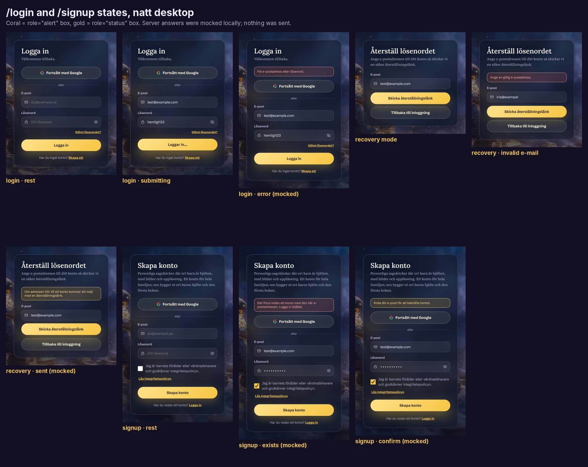
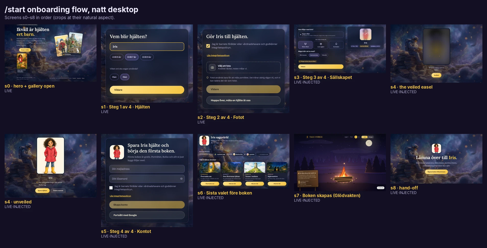
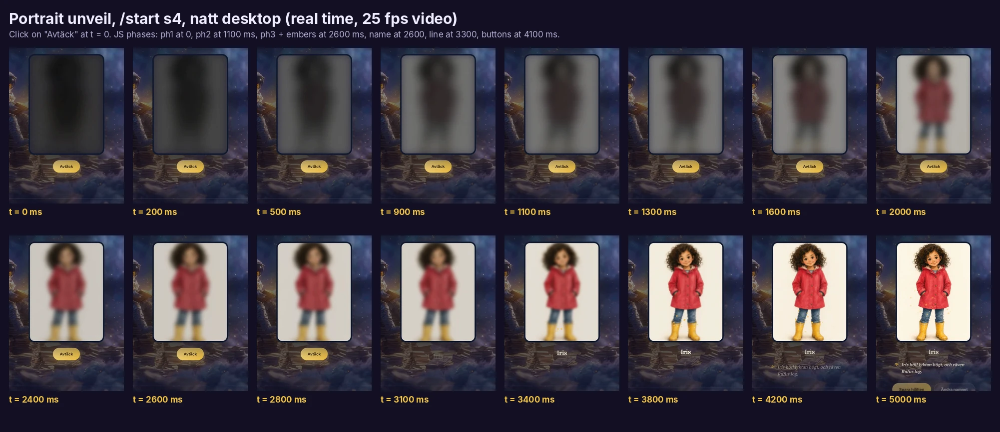
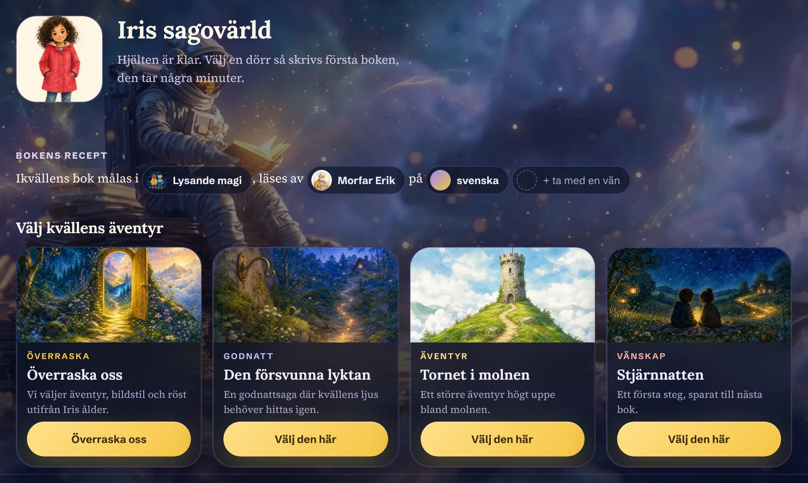
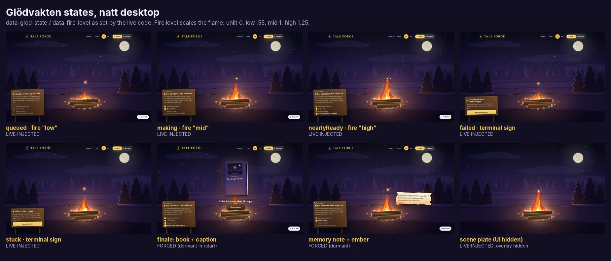
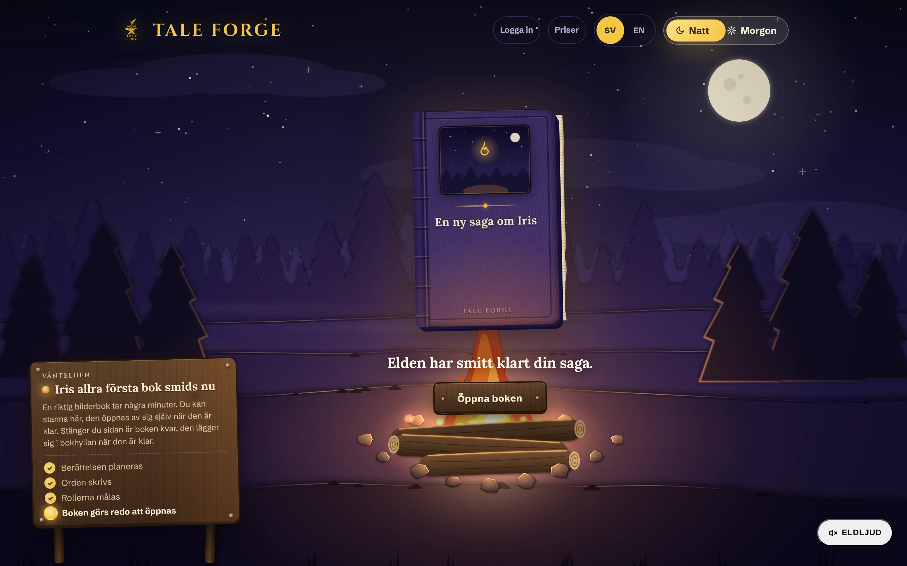
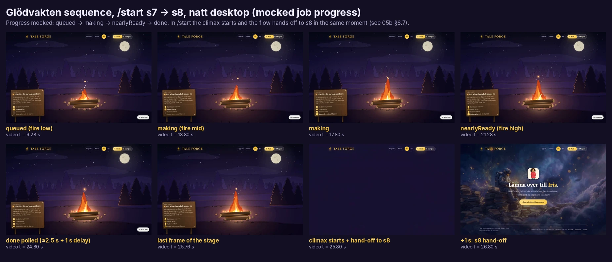
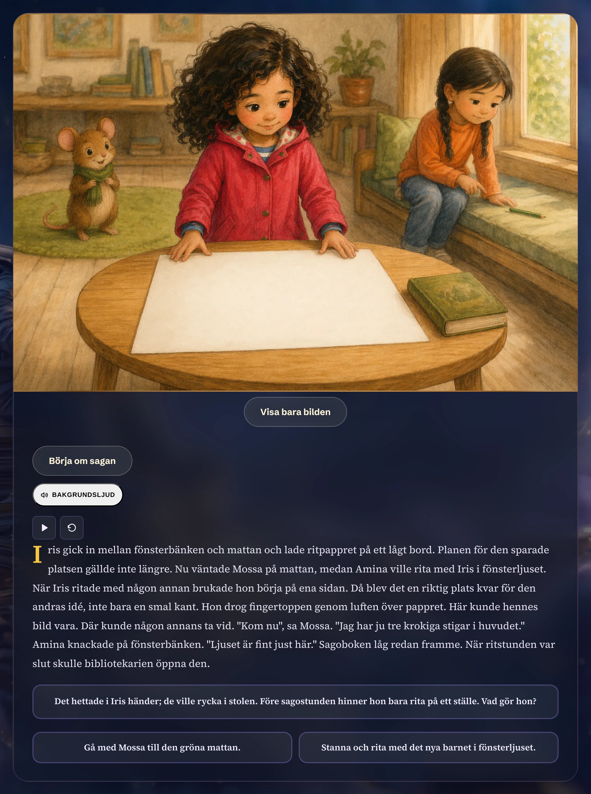

# 05b · Components: the app, the onboarding flow, forms and the quiet pages

This file covers every component outside the landing page. That means the `/start` onboarding flow (gallery toggle, cover fan, step cards, the portrait **unveil**, the adventure "doors" and the **Glödvakten** waiting fire where the book is "baked"), `/uppgradera` (pricing), `/login` and `/signup` (forms, provider button, validation and error states), the legal pages, the 404 page, and the app screens that need an account (reader, share page, end ceremony, create flow pieces).
The app uses the same small kit as the landing page: 26 px **glass cards**, 999 px **pills**, the **gradient button** (gold in Natt, violet in Morgon) and `.trait` toggle pills. Most of these pages are styled with **React inline style objects**, not CSS classes, so most literal styling here is quoted from the JS chunks.
Two places leave the glass kit for a hand-made material world. One is the onboarding **easel** (a blurred, veiled portrait that is "unveiled" with a gold sheen and rising embers). The other is the **Glödvakten** canvas: a night forest, a campfire, a nailed wooden signboard, a cloth-bound book with a Cinzel colophon, and a plank button.
Each screen is labelled with how it was obtained. LIVE screens were captured from the site. LIVE·INJECTED screens are the site's own code rendering a locally seeded draft, with a mocked backend. FORCED screens are live pages with a dormant element switched on by script. RECON screens are shipped CSS plus markup transcribed from the JSX. CODE-ONLY parts were not rendered. No account was created and nothing was written to the server.
Interpretation is marked **Read:**. Everything else is copied from shipped files or measured in Playwright Chromium, 9 Oct 2026.

## Contents

0. [Method, evidence labels and safety](#0-method-evidence-labels-and-safety)
1. [Inventory at a glance](#1-inventory-at-a-glance)
2. [Shared recipes as they appear in the app](#2-shared-recipes-as-they-appear-in-the-app)
3. [/login and /signup (AuthForm)](#3-login-and-signup-authform)
4. [/uppgradera (UpgradePanel)](#4-uppgradera-upgradepanel)
5. [/start: the onboarding flow, s0 to s8](#5-start-the-onboarding-flow-s0-to-s8)
6. [Glödvakten: the waiting fire where the book is "baked" (s7)](#6-glödvakten-the-waiting-fire-where-the-book-is-baked-s7)
7. [Reader and share page (StoryReader), reconstructed](#7-reader-and-share-page-storyreader-reconstructed)
8. [Create-flow pieces that exist only in CSS](#8-create-flow-pieces-that-exist-only-in-css)
9. [Legal pages: /integritet and /villkor](#9-legal-pages-integritet-and-villkor)
10. [404](#10-404)
11. [Discovered: the unlisted Bokmässan (book fair) kiosk](#11-discovered-the-unlisted-bokmässan-book-fair-kiosk)
12. [Copy deck: errors, notices, moderation](#12-copy-deck-errors-notices-moderation)
13. [Motion catalogue for the app](#13-motion-catalogue-for-the-app)
14. [Defects, quirks and dormant code](#14-defects-quirks-and-dormant-code)
15. [Read: the app's component language](#15-read-the-apps-component-language)
16. [Reproduce it: film and emulation recipes](#16-reproduce-it-film-and-emulation-recipes)
17. [Screenshot and video index](#17-screenshot-and-video-index)
18. [Uncertainties](#18-uncertainties)

---

## 0. Method, evidence labels and safety

**Sources.**
- CSS comes from the global sheet [`source/css/3q17cp_jgfwol.pretty.css`](../source/css/3q17cp_jgfwol.pretty.css) and from the three route sheets loaded on `/start`. [`2_gt301v4m-60.pretty.css`](../source/css/2_gt301v4m-60.pretty.css) holds the onboarding flow (`.start-flow …`). [`2h1wwdz1nvxwk.pretty.css`](../source/css/2h1wwdz1nvxwk.pretty.css) holds the "create start" world band, recipe line, sheets and doors (`.cs-*`). [`37m388zf6rymp.pretty.css`](../source/css/37m388zf6rymp.pretty.css) holds the Glödvakten stage (`.glod-*`); it is also loaded on the share route. Citations look like `2_gt301v4m-60.pretty.css:287-298`.
- Inline style objects, markup and copy come from the minified chunks in [`source/js/`](../source/js/). These files are one line each, so a citation gives the **character offset** of a unique search string, e.g. `1hcx0qn-qjgfn.js @3532 'padding:"14px 14px 14px 44px"'`.
- Hydrated DOMs ([`source/rendered/dom__*.html`](../source/rendered/)) and computed styles ([`source/rendered/computed-styles__*.json`](../source/rendered/)) provide the measured boxes.

| Chunk | What it holds (for this file) | Anchor (char offset, search string) |
|---|---|---|
| [`1hcx0qn-qjgfn.js`](../source/js/1hcx0qn-qjgfn.js) | `AuthForm` for /login and /signup: copy, inline styles, Google SVG, recovery mode | @3984 `"AuthForm"`, @3532 `padding:"14px 14px 14px 44px"`, @7010 `background:"var(--coral-chip-bg)"`, @7615 `fill:"#4285F4"` |
| [`2x2s34sgoij7z.js`](../source/js/2x2s34sgoij7z.js) | Auth error dictionary, age bands, input moderation, portrait polling, Swedish genitive helper | @142 `invalid_credentials`, @3907 `AGE_GROUPS`, @7725 `moderateInput`, @5304 `genitive` |
| [`26ye0kuppitcn.js`](../source/js/26ye0kuppitcn.js) | `UpgradePanel`: prices, copy, inline styles, the injected `<style>` block | @15546 `family:{monthly`, @19235 `UpgradePanel`, @23959 `.upgrade-proof-layout` |
| [`0ad0wel9cyv30.js`](../source/js/0ad0wel9cyv30.js) | `StartFlow` s0–s8: all onboarding copy, the strip, the unveil timeline | @201 `kicker:"Riktiga bilderböcker`, @16486 `title:"Steg 1 av 4`, @31221 `c(1),E(()=>c(2),1100),E(t,2600)`, @49316 `"start-strip"` |
| [`2j_-r8q4tgdka.js`](../source/js/2j_-r8q4tgdka.js) | `JobStatus`, `Glodvakten`, `DoorGrid`, `RecipeLine`, `WorldBand`, `StylePicker` | @238 `inProgress:"Your story`, @7423 `canvasLabel:"Väntelden`, @17473 `"DoorGrid"`, @18766 `"RecipeLine"`, @22357 `"WorldBand"`, @24716 `"StylePicker"`, @42570 `"Glodvakten"` |
| [`1pgfdvt65g9p-.js`](../source/js/1pgfdvt65g9p-.js) | `createGlodScene` (the canvas painter), `tornScrap`, ambient sound beds | @2588 `createGlodScene`, @24978 `unlit:0,low:.55,mid:1,high:1.25`, @34571 `startClimax:function`, @36448 `label:{sv:"Brasa"` |
| [`36tbz-w9v-p8v.js`](../source/js/36tbz-w9v-p8v.js) | `StoryReader` (reader and share page), sound panel, end ceremony, feedback forms | @202 `read:"Läs sagan"`, @4682 `soundTitle:"Bakgrundsljud"`, @14254 `emberHeading:"Nästa gång, kanske`, @22988 `"StoryReader"` |
| [`390j9gbq0u9ce.js`](../source/js/390j9gbq0u9ce.js) | Style presets, narrator voices, the `tf-start-draft` store, theme/locale keys | @32241 `CREATE_STYLE_PRESETS`, @32464 `nameSv:"Morfar Erik"`, @33891 `tf-start-draft` |

**Evidence labels.** Every screenshot and claim carries one of these labels.

| Label | Meaning |
|---|---|
| **LIVE** | Captured on tale-forge.app by ordinary navigation and clicks that stay on the client: toggles, typing, empty or malformed form submits. |
| **LIVE·INJECTED** | Captured on tale-forge.app. The site's own code renders a screen from a draft seeded into `localStorage['tf-start-draft']` (the key the flow uses itself, [`390j9gbq0u9ce.js @33891`](../source/js/390j9gbq0u9ce.js)). Calls to the backend (`taleforge-backend-production-…run.app`) and to Supabase are answered by a **local mock** inside Playwright. The screen is genuine rendering; the data (hero "Iris", the sample portrait [`assets/landing/iris/hero-portrait.webp`](../assets/landing/iris/hero-portrait.webp)) is ours. |
| **FORCED** | A live (or live·injected) page on which a script switched on an element that the shipped flow never shows (classes added, text filled in, geometry computed with the scene's own formula). Styling is genuine, the state is staged. |
| **RECON** | A static page in our scratch harness that loads the **unmodified shipped CSS** and fonts. Its markup is transcribed from the JSX in the chunks and filled with shipped copy and the sample book. No site JavaScript runs. Canvas layers are not reproduced. |
| **CODE-ONLY** | Read from CSS or JS only. Not rendered. |

**Safety.** Every Playwright context ran behind a request router (our scratch tool `lib.js`, kept outside the library). Only `GET`/`HEAD` to tale-forge.app (and Google Fonts) went out. Any other method was **aborted**, and the log recorded zero such attempts. Backend and Supabase requests were **fulfilled locally** and never sent. Analytics (`/ph/…`, PostHog) was aborted. Nothing was submitted except empty or malformed forms whose validation stays in the browser, plus mocked auth calls. No account, child, portrait or book was created.

**Viewports.** Desktop 1440×900 and mobile 390×844, both at deviceScaleFactor 2, so a crop is twice its CSS size. Themes `natt` and `morgon` were set through `localStorage['tf-theme']`. Language is `sv` unless a file name says `-en`.

## 1. Inventory at a glance

| Surface | Route | Main components | How it is styled | Evidence |
|---|---|---|---|---|
| Log in / sign up | `/login`, `/signup` | glass card, page title + lede, Google ghost button, "eller" divider, labelled icon inputs, password reveal, forgot link, attest checkbox, primary submit, footer link, coral alert, gold notice, recovery mode | inline style objects + `.glass .btn .page-title .lede .sec-head` | LIVE (+ mocked auth responses) |
| Upgrade | `/uppgradera` (`/priser` 307→ here) | intro card, "Det här ingår" card with sample-book figure, monthly/yearly `.trait` toggle, plan cards (Familj, Skola), "För skolor" expander, current/included chips, checkout alert | inline styles + an injected `<style>` block | LIVE (alert and chips CODE-ONLY) |
| Onboarding | `/start` s0–s2 | hero (home recipe), kicker, fan + badge, **gallery toggle with `.gbook`**, progress strip, step card, `.field`, trait rows, attest, dashed upload tile, privacy line, paint pill | `2_gt301v4m-60` + global | LIVE |
| Onboarding | `/start` s3–s6, s8 | build grid, picks, hero card with veiled portrait, **easel unveil**, account step, **world band**, **recipe line + chips**, **sheets** (style, voice, language), **adventure doors**, launch sheet, hand-off | `2_gt301v4m-60`, `2h1wwdz1nvxwk`, inline | LIVE·INJECTED |
| Book "baking" | `/start` s7 (also `/create`) | **Glödvakten** stage: canvas landscape, wooden signboard with steps, fire-sound chip, terminal signs, (dormant) memory note, (dormant in /start) book + caption + plank button | `37m388zf6rymp` + canvas | LIVE·INJECTED, FORCED |
| Reader / share | `/reader/{id}`, `/share/{slug}` (404 today) | cover spread, illustration with blurred fill, narration controls, sound panel, prose with drop cap, choice prompt + choice buttons, link-wait, "Slut", end ceremony, feedback forms, ember card, ambient glöd canvas | global `.reader*`, inline | RECON |
| Create | `/create` (login-gated) | customize `<details>`, carried thread, friend mode picker, friend photo step, family switcher, companion tiles, mobile adventure cards | global CSS | CODE-ONLY |
| Legal | `/integritet`, `/villkor` | 760 px glass article, language pill, Grotesk h3s, serif paragraphs in `--card-sub`, lists, inline links, `<details>` for the other language | inline + `.legal-language-details` | LIVE |
| 404 | any unknown path | 440 px glass card, centred h2, serif line, primary link-button | inline | LIVE |
| Book fair | `/bokmassan/saga`, `…/berattelser`, `…/berattelser/{slug}`, `…?view=skapa`, `/bokmassan/tavling` | chooser cards, curated gallery, **curated reader** with clue pins and choices, fair create form, contest page (own stylesheet) | CSS modules (not harvested) | LIVE |

## 2. Shared recipes as they appear in the app

The four landing recipes (pill, chip, glass card, gradient button) are documented in full in [05a §2](05a-components-landing.md#2-the-four-shared-recipes-pill-chip-glass-gradient-button). Below are only the parts the app pages lean on, plus the app-only additions.

### 2.1 Glass card

Every form, plan card, legal article, 404 card, step card, sheet and reader is a `.glass`.

```css
/* 3q17cp_jgfwol.pretty.css:1110-1124 */
.glass {
  background: var(--card);
  -webkit-backdrop-filter: blur(var(--card-blur));
  backdrop-filter: blur(var(--card-blur));
  border: 1px solid var(--card-line);
  box-shadow: var(--card-shadow);
  color: var(--card-ink);
  border-radius: 26px;
  transition: background 0.5s, border-color 0.5s, color 0.5s, box-shadow 0.4s;
  position: relative;
}
/* :1125-1147 — a 1px gradient rim drawn with a masked ::before */
.glass:before {
  content: ""; pointer-events: none; opacity: 0.45;
  background: linear-gradient(135deg, #9b87f580, #f2b22e59 50%, #ff61544d);
  border-radius: 26px; padding: 1px; position: absolute; inset: 0;
  mask-composite: exclude; /* + -webkit-mask-* xor longhands */
}
```

The app sets the width and padding **inline**, per page:

| Where | Inline style | Source |
|---|---|---|
| Auth card | `width:min(440px, 100%); padding:34px` | `1hcx0qn-qjgfn.js` (AuthForm render) |
| 404 card | `width:min(440px, 100%); padding:34px; text-align:center` | [`dom__404__sv.html`](../source/rendered/dom__404__sv.html) |
| Legal article | `<article class="glass" style="width:min(760px, 100%);padding:34px">` | [`dom__integritet__sv.html`](../source/rendered/dom__integritet__sv.html) |
| Upgrade cards | `d = {width:"min(560px, 100%)", padding:"28px", marginBottom:"20px"}` | `26ye0kuppitcn.js @18823` (`d={width:"min(560px, 100%)"`) |
| Start strip | `display:flex; align-items:center; gap:14px; max-width:600px (560 on s7); margin:0 auto 22px; padding:10px 16px` | `0ad0wel9cyv30.js` (`eg={display:"flex"…`) |
| Step card | `.start-flow .stepcard`: `max-width:560px; padding:30px 28px 28px; gap:20px` | `2_gt301v4m-60.pretty.css:44-51` |

Every single-card page (auth, 404, legal, upgrade) centres its card in a `section` with `flex:1; display:grid; place-items:center; padding:36px 0`. This is the "one glass card on the backdrop" layout described in [04 §7](04-layout-spacing-responsive.md#7-the-single-column-pages-uppgradera-login-signup-legal-404-start).

Measured (natt, desktop): `background-color: rgba(15, 22, 40, 0.68)` (= `--card #0f1628ad`), 26 px radius. The auth card is 440×591, the 404 card 440×226, the legal article 760×2714, and the upgrade cards 560 wide ([`computed-styles__login__sv__natt__desktop.json`](../source/rendered/computed-styles__login__sv__natt__desktop.json) and siblings). On mobile every card is the column width, 334 px (390 − 2×28).

### 2.2 Buttons

```css
/* 3q17cp_jgfwol.pretty.css:886-924 */
.btn { cursor: pointer; font-family: var(--ui); border: none; border-radius: 999px;
  align-items: center; gap: 10px; min-height: 52px; padding: 17px 30px;
  font-size: 1.05rem; font-weight: 700;
  transition: transform 0.25s cubic-bezier(0.2, 0.7, 0.3, 1.4), box-shadow 0.3s, background 0.5s, color 0.5s;
  display: inline-flex; }
.btn:active { transform: scale(0.96); }
.btn-primary { color: var(--btn-ink); background: var(--btn-grad);
  box-shadow: var(--btn-shadow), inset 0 1px 0 #ffffff73; }
.btn-primary:hover { box-shadow: var(--btn-shadow-hover); transform: translateY(-3px); }
.btn-ghost { background: var(--ghost-bg); color: var(--ghost-ink); border: 1px solid var(--ghost-line);
  -webkit-backdrop-filter: blur(14px); backdrop-filter: blur(14px); }
```

| Token | Natt | Morgon |
|---|---|---|
| `--btn-grad` | `linear-gradient(135deg, #ffe08a, #f5c542)` | `linear-gradient(135deg, #6d4fe0, #5b3fc7)` |
| `--btn-ink` | `#3a2b10` | `#fff` |
| `--btn-shadow` / `-hover` | `0 14px 40px #f5c54247` / `0 20px 55px #f5c5426b` | `0 14px 34px #6d4fe059` / `0 22px 48px #6d4fe073` |
| `--ghost-bg` / `--ghost-ink` / `--ghost-line` | `#fff9ec1a` / `#fff3d9` / `#fff3d952` | `#ffffffb8` / `#241f35` / `#887da0` |

(tokens: `3q17cp_jgfwol.pretty.css:493-590`)

Measured: every app button has the base height of 54 px (16.8 px Schibsted Grotesk 700 + 17 px padding). Full-width variants set `style="width:100%;justify-content:center"` inline (auth). **The `.btn` class has no `justify-content`**, so a full-width button that is stretched by a flex column (the start step cards) keeps its label **left-aligned**. See "Vidare" in [`start-s1-stepcard--filled__natt__desktop.webp`](../screenshots/components/app/start-s1-stepcard--filled__natt__desktop.webp).

The disabled state is not defined globally. It exists only in scoped rules, and they all use the same recipe:

```css
/* 2_gt301v4m-60.pretty.css:55-60 (step card); same recipe at 2h1wwdz1nvxwk.pretty.css:427-432 (doors),
   3q17cp_jgfwol.pretty.css:1850-1856 (reader), :1727-1732 (mobile adventure), :2231-2236 (friend photo, opacity .48) */
.start-flow .stepcard .btn:disabled { opacity: 0.5; cursor: not-allowed; box-shadow: none; transform: none; }
```

The auth submit button and the upgrade CTA have **no disabled style**, so a disabled "Skapa konto" looks exactly like an enabled one. Compare [`signup-attest--unchecked__natt__desktop.png`](../screenshots/components/app/signup-attest--unchecked__natt__desktop.png) with [`signup-attest--checked__natt__desktop.png`](../screenshots/components/app/signup-attest--checked__natt__desktop.png).

### 2.3 `.trait` toggle pill (segmented choices)

The app reuses the landing's trait pill as its universal toggle: billing period, age band, pronoun, keepsake object, language, narrator voice and companion.

```css
/* 3q17cp_jgfwol.pretty.css:1217-1246 */
.trait-row { flex-wrap: wrap; gap: 9px; margin-bottom: 18px; display: flex; }
.trait { font-family: var(--ui); color: var(--trait-ink); border: 2px solid var(--trait-line);
  cursor: pointer; background: 0 0; border-radius: 999px; justify-content: center; align-items: center;
  min-height: 44px; padding: 8px 15px; font-size: 0.88rem; font-weight: 700; transition: all 0.25s;
  display: inline-flex; }
.trait.on { background: var(--trait-on-bg); border-color: var(--trait-on-line); color: var(--trait-on-ink); }
.trait:hover { border-color: var(--trait-on-line); }
/* ≤880px: .trait-row { justify-content: center } (:2261-2263) */
```

In the app, `.trait` is a real `<button aria-pressed>`, while on the landing page it is inert (see 05a §15). The "on" state is a violet tint, 20 % in Natt (`#9b87f533`) and 12 % in Morgon (`#6d4fe01f`), with a 60 % / 42 % violet ring. Measured: "Årsvis" is 78×44 and "Månadsvis" 109×44 at 14.08 px ([`computed-styles__uppgradera__sv__natt__desktop.json`](../source/rendered/computed-styles__uppgradera__sv__natt__desktop.json)).

### 2.4 Chips

```css
/* 3q17cp_jgfwol.pretty.css:1567-1590 */
.chip { letter-spacing: 0.05em; text-transform: uppercase; border-radius: 999px; align-items: center; gap: 7px;
  width: fit-content; padding: 6px 13px; font-size: 0.76rem; font-weight: 800; display: inline-flex; }
.chip.gold   { background: var(--gold-chip-bg);  color: var(--gold-chip-ink); }
.chip.violet { background: var(--pill-bg);       color: var(--pill-ink); }
.chip.coral  { background: var(--coral-chip-bg); color: var(--coral-chip-ink); }
```

`.chip` is used for the hero-card "stamps" (s3), the "Nästa gång, kanske..." ember label, "Din nuvarande plan" (gold) and "Ingår i er plan" (plain). It is also used on **`<button>`s**: the reader's "Bakgrundsljud" toggle and the Glödvakten "Eldljud" toggle. `.chip` sets no background, so those two buttons show the **browser's default button face** (light grey/white) until pressed. See [`start-s7-glod-sound-chip__natt__desktop.png`](../screenshots/components/app/start-s7-glod-sound-chip__natt__desktop.png) (§14).

### 2.5 Inline alert and notice boxes (app-only)

Errors and confirmations are tinted boxes built from the chip tokens, declared inline. The same two recipes appear in AuthForm and UpgradePanel:

```js
// 1hcx0qn-qjgfn.js @7010 (error, role="alert")      — identical in 26ye0kuppitcn.js (checkoutError)
{ marginBottom:"18px", padding:"12px 14px", borderRadius:"14px", fontSize:".92rem",
  background:"var(--coral-chip-bg)", color:"var(--coral-chip-ink)", border:"1px solid var(--coral-chip-ink)" }
// (notice, role="status")
{ marginBottom:"18px", padding:"12px 14px", borderRadius:"14px", fontSize:".92rem",
  background:"var(--gold-chip-bg)", color:"var(--gold-chip-ink)", border:"1px solid var(--gold-chip-ink)" }
```

| | Natt | Morgon |
|---|---|---|
| coral bg / ink | `#ff615424` / `#ffab9f` | `#ff61541f` / `#c23a2b` |
| gold bg / ink | `#f2b22e29` / `#ffd98f` | `#f2b22e26` / `#8f6a12` |

Inline field errors in the onboarding flow are plain coral text: `.start-flow .field-error { font-family: var(--ui); color: var(--coral-chip-ink); margin: 0; font-size: 0.85rem; }` (`2_gt301v4m-60.pretty.css:81-86`).

### 2.6 Focus

```css
/* 3q17cp_jgfwol.pretty.css:2373-2378 */
input:focus-visible, textarea:focus-visible, select:focus-visible { outline: 2px solid var(--accent); outline-offset: 2px; }
```

`--accent` is gold-soft `#f5c542` in Natt and violet `#6d4fe0` in Morgon. Buttons get no general focus ring. Only `.tt`, `.choice`, `.reader-replay`, `.reader-illustration-toggle`, `.glod-mem-close`, `.glod-active-ember` and the fair-module links define one. The onboarding `.field` swaps its border instead (`.start-flow .field:focus { border-color: var(--accent) }`, `2_gt301v4m-60.pretty.css:74-76`) and sets `outline: none`, so it has no outline. Its focus shows only as the 2 px border turning gold or violet ([`start-s1-field--focus__natt__desktop.png`](../screenshots/components/app/start-s1-field--focus__natt__desktop.png)).


## 3. /login and /signup (AuthForm)

One component, `AuthForm({mode, locale})`, renders both pages and the password-recovery mode ([`1hcx0qn-qjgfn.js @3984`](../source/js/1hcx0qn-qjgfn.js)). It uses no route CSS. All styling is the global classes plus three inline style objects. Evidence: LIVE. The server answers (wrong password, account exists, confirmation sent, reset sent) were **mocked locally** so the error and notice boxes could be photographed.



*[auth-states-sheet__natt__desktop.webp](../screenshots/components/app/auth-states-sheet__natt__desktop.webp): nine states side by side ([Morgon version](../screenshots/components/app/auth-states-sheet__morgon__desktop.webp)).*

### 3.1 Anatomy

```
section  (flex:1; display:grid; place-items:center; padding:36px 0)
└─ div.glass  (width:min(440px,100%); padding:34px)
   ├─ div.sec-head (margin-bottom:6px) > h1.page-title         "Logga in" | "Skapa konto" | "Återställ lösenordet"
   ├─ p.lede (margin-bottom:24px; font-size:1rem; color:var(--card-sub))
   ├─ div[role=alert]   coral box   (only when an error exists)
   ├─ div[role=status]  gold box    (only when a notice exists)
   ├─ button.btn.btn-ghost (width:100%; justify-content:center)   [Google "G" svg 18×18] "Fortsätt med Google"
   ├─ div  "eller" divider: two 1px var(--card-line) rules + .85rem text in var(--card-sub)
   ├─ form
   │  ├─ div (mb 16) label[for=auth-email] + div(relative) > svg(mail, abs left 14) + input#auth-email
   │  ├─ div (mb 10 login / 22 signup) label + div(relative) > svg(lock) + input#auth-password + button(eye, 44×44)
   │  ├─ login:  div (mb 22, text-align:right) > button "Glömt lösenordet?"
   │  ├─ signup: label[for=signup-attest] > input[type=checkbox] 24×24 + span ; div > a "Läs integritetspolicyn"
   │  └─ button.btn.btn-primary[type=submit] (width:100%; justify-content:center)
   ├─ (recovery) button.btn.btn-ghost "Tillbaka till inloggning" (width:100%; margin-top:12px)
   └─ p (margin-top:22px; centered; .92rem; var(--card-sub)) "Har du inget konto? " + a (accent, 700, underline)
```

Measured, natt desktop ([`computed-styles__login__sv__natt__desktop.json`](../source/rendered/computed-styles__login__sv__natt__desktop.json)):

| Element | Box (x, y, w, h) | Type |
|---|---|---|
| card | 500, 132, 440 × 591 (signup 745) | — |
| h1 "Logga in" | 128 × 34 | Lora 600, 32 px / 33.92 (24 px on mobile) |
| lede "Välkommen tillbaka." | 370 × 26 | Source Serif 4, 16 px / 26.4, `#b5acd3` |
| Google button | 370 × 56 | Grotesk 700, 16.8 px, `#fff3d9` on `rgba(255,249,236,.1)` |
| label "E-post" | 370 × 18 | Grotesk 700, 14.4 px, `#b5acd3` |
| inputs | 370 × 50 | Grotesk 400, 16 px, `#f2eeff` on `rgba(255,255,255,.06)`, r 14 |
| eye button | 44 × 44 | inherits UA font (Arial 13.33 px, unused) |
| "Glömt lösenordet?" | 120 × 24 | Grotesk 700, **13.33 px** (UA button size, no font-size set), `#f5c542` |
| submit | 370 × 54 | Grotesk 700, 16.8 px, `#3a2b10` on the gold gradient |

Mobile: the card is 334 px wide (inner 264). Everything else is the same.

### 3.2 The inline style objects (verbatim)

```js
// 1hcx0qn-qjgfn.js @3532 — the input
h = { width:"100%", padding:"14px 14px 14px 44px", borderRadius:"14px",
      border:"1.5px solid var(--card-line)", background:"var(--choice-bg)",
      color:"var(--card-ink)", fontFamily:"var(--ui)", fontSize:"1rem" }
// password input: { ...h, paddingRight:"44px" }
// the leading icon
p = { position:"absolute", left:"14px", top:"50%", transform:"translateY(-50%)",
      width:"18px", height:"18px", color:"var(--card-sub)", pointerEvents:"none" }
// the label
m = { display:"block", marginBottom:"8px", fontFamily:"var(--ui)", fontWeight:700,
      fontSize:".9rem", color:"var(--card-sub)" }
// reveal button: position:absolute; right:2px; top:50%; translateY(-50%); 44×44; grid centre; no border/background; color var(--card-sub)
// forgot link:  { border:0, background:"none", padding:"4px 0", color:"var(--accent)", fontFamily:"var(--ui)", fontWeight:700, textDecoration:"underline", cursor:"pointer" }
// attest label: { display:"flex", alignItems:"center", gap:"12px", minHeight:"44px", marginBottom:"2px", fontFamily:"var(--ui)", fontSize:"16px", lineHeight:1.45, color:"var(--card-sub)", cursor:"pointer" }
// attest box:   { width:"24px", height:"24px", flexShrink:0, fontSize:"16px", accentColor:"var(--accent)", cursor:"pointer" }
// policy link:  { display:"inline-flex", alignItems:"center", minHeight:"44px", padding:"0 4px", fontFamily:"var(--ui)", fontSize:".9rem", color:"var(--accent)", fontWeight:700, textDecoration:"underline" }
```

The input fill is `--choice-bg`: `#ffffff0f` (6 % white) in Natt and **pure `#fff`** in Morgon. Its 1.5 px border is `--card-line`: `#9b87f542` (26 % violet) in Natt and `#ffffffe6` in Morgon. A white border on a white field inside a nearly white card is effectively invisible, so in Morgon the fields read as **borderless white slabs** ([`login-card__morgon__desktop.png`](../screenshots/components/app/login-card__morgon__desktop.png)).

### 3.3 Icons (verbatim SVG)

All icons are drawn inline at 24-unit viewBox, `stroke="currentColor" stroke-width="2" stroke-linecap="round" stroke-linejoin="round" fill="none"`, rendered at 18 px:

| Icon | Paths |
|---|---|
| mail | `<rect x="3" y="5" width="18" height="14" rx="2"/><path d="m3 7 9 6 9-6"/>` |
| lock | `<rect x="4" y="10" width="16" height="10" rx="2"/><path d="M8 10V7a4 4 0 0 1 8 0v3"/>` |
| eye (show) | `<path d="M2 12s3-8 10-8 10 8 10 8-3 8-10 8-10-8-10-8z"/><circle cx="12" cy="12" r="3"/>` |
| eye-off (hide) | `<path d="M9.9 4.24A9.1 9.1 0 0 1 12 4c7 0 10 8 10 8a18.5 18.5 0 0 1-2.16 3.19M6.6 6.6A18.5 18.5 0 0 0 2 12s3 8 10 8a9.1 9.1 0 0 0 5.4-1.6"/><path d="M9.9 9.9a3 3 0 0 0 4.2 4.2M2 2l20 20"/>` |

The Google provider mark is the standard four-colour "G", filled rather than stroked (`1hcx0qn-qjgfn.js @7615`). The same four paths were extracted into [`assets/svg-inline/login__btn__ee8ffa17.svg`](../assets/svg-inline/login__btn__ee8ffa17.svg). The mail, lock and eye icons are the three `login__svg__*.svg` files in the same folder.

```html
<svg viewBox="0 0 24 24" width="18" height="18" aria-hidden="true">
  <path fill="#4285F4" d="M22.56 12.25c0-.78-.07-1.53-.2-2.25H12v4.26h5.92c-.26 1.37-1.04 2.53-2.21 3.31v2.77h3.57c2.08-1.92 3.28-4.74 3.28-8.09z"/>
  <path fill="#34A853" d="M12 23c2.97 0 5.46-.98 7.28-2.66l-3.57-2.77c-.98.66-2.23 1.06-3.71 1.06-2.86 0-5.29-1.93-6.16-4.53H2.18v2.84C3.99 20.53 7.7 23 12 23z"/>
  <path fill="#FBBC05" d="M5.84 14.09c-.22-.66-.35-1.36-.35-2.09s.13-1.43.35-2.09V7.07H2.18C1.43 8.55 1 10.22 1 12s.43 3.45 1.18 4.93l2.85-2.22.81-.62z"/>
  <path fill="#EA4335" d="M12 5.38c1.62 0 3.06.56 4.21 1.64l3.15-3.15C17.45 2.09 14.97 1 12 1 7.7 1 3.99 3.47 2.18 7.07l3.66 2.84c.87-2.6 3.3-4.53 6.16-4.53z"/>
</svg>
```

Google is the only provider. It is styled as the **ghost** button, so the brand gradient stays reserved for the e-mail submit.

### 3.4 States

| State | How it was produced | What changes | Files (natt desktop; all exist for natt/morgon × desktop/mobile unless noted) |
|---|---|---|---|
| Rest | load | — | [`login-card`](../screenshots/components/app/login-card__natt__desktop.webp), [`signup-card`](../screenshots/components/app/signup-card__natt__desktop.webp), English: [`login-card-en`](../screenshots/components/app/login-card-en__natt__desktop.webp), [`signup-card-en`](../screenshots/components/app/signup-card-en__natt__desktop.webp) (+ `-en__morgon__mobile`) |
| Empty submit | click submit with both fields empty | **Native constraint validation only.** The browser focuses `#auth-email` and shows its own bubble, which a page screenshot cannot capture. Chromium's message was "Please fill out this field." (browser language, not the site's). The only page-visible change is the focus ring. | [`login-form--empty-submit`](../screenshots/components/app/login-form--empty-submit__natt__desktop.png) |
| Malformed e-mail | `iris@` + submit | Native message "Please enter a part following '@'. 'iris@' is incomplete." No styling for `:invalid` exists. | [`login-form--malformed-email`](../screenshots/components/app/login-form--malformed-email__natt__desktop.png) |
| Focus (keyboard) | Tab into the password field | `outline: 2px solid var(--accent); outline-offset: 2px` (gold in Natt, violet in Morgon), radius follows the 14 px field | [`login-field--focus`](../screenshots/components/app/login-field--focus__natt__desktop.png) |
| Password revealed | click the eye | `type` becomes `text`, the icon becomes eye-off, `aria-label` becomes "Dölj lösenord" | [`login-password--revealed`](../screenshots/components/app/login-password--revealed__natt__desktop.png) |
| Hover: Google | pointer over | **No change.** `.btn-ghost` has no hover rule | [`login-google-button--hover`](../screenshots/components/app/login-google-button--hover__natt__desktop.png) (desktop) |
| Hover: submit | pointer over | lifts 3 px, glow grows to `--btn-shadow-hover` | [`login-submit--hover`](../screenshots/components/app/login-submit--hover__natt__desktop.png) (desktop) |
| Hover: forgot link | pointer over | no change | [`login-forgot-link--hover`](../screenshots/components/app/login-forgot-link--hover__natt__desktop.png) (desktop) |
| Submitting | submit, mock delayed 4 s | label becomes "Loggar in..." and all controls are disabled. **No visual disabled style**, so only the label changes. | [`login-card--submitting`](../screenshots/components/app/login-card--submitting__natt__desktop.webp) |
| Wrong credentials | mocked `400 {error_code:"invalid_credentials"}` | coral box above the Google button: "Fel e-postadress eller lösenord." | [`login-card--error`](../screenshots/components/app/login-card--error__natt__desktop.webp) |
| Recovery mode | click "Glömt lösenordet?" | title "Återställ lösenordet". Google button, divider, password field, forgot link and footer link are removed. Submit becomes "Skicka återställningslänk", plus a full-width ghost "Tillbaka till inloggning" | [`login-recovery`](../screenshots/components/app/login-recovery__natt__desktop.png) |
| Recovery, invalid e-mail | `iris@exempel` (passes native `type=email`, fails the JS regex `/^[^\s@]+@[^\s@]+\.[^\s@]+$/`) | coral box "Ange en giltig e-postadress." (**client-side**, no request) | [`login-recovery--invalid-email`](../screenshots/components/app/login-recovery--invalid-email__natt__desktop.webp) |
| Recovery sent | mocked `200` | gold box "Om adressen hör till ett konto kommer ett mejl med en återställningslänk." | [`login-recovery--sent`](../screenshots/components/app/login-recovery--sent__natt__desktop.webp) |
| Signup, attest unchecked → checked | tick the box | submit goes from `disabled` to enabled. **Both look identical**, because there is no disabled style | [`signup-attest--unchecked`](../screenshots/components/app/signup-attest--unchecked__natt__desktop.png), [`signup-attest--checked`](../screenshots/components/app/signup-attest--checked__natt__desktop.png) |
| Signup, short password | `abc` | native: "Please lengthen this text to 6 characters or more (you are currently using 3 characters)." (`minlength=6`) | (bubble only) |
| Signup, account exists | mocked `422 user_already_exists` | coral "Det finns redan ett konto med den här e-postadressen. Logga in istället." | [`signup-card--error-exists`](../screenshots/components/app/signup-card--error-exists__natt__desktop.webp) |
| Signup, confirm e-mail | mocked `200`, no session | gold "Kolla din e-post för att bekräfta kontot." | [`signup-card--confirm-notice`](../screenshots/components/app/signup-card--confirm-notice__natt__desktop.webp) |

**Code-only.** `attestRequiredError` "Du behöver godkänna integritetspolicyn för att skapa ett konto." can only fire if the form is submitted without the checkbox. The disabled submit prevents that. `googleError` "Kunde inte starta Google-inloggning." When signup succeeds with a session, the client PUTs `/account/profile {consentVersion:"2026-07-06", parentAttestation:true}` ([`2x2s34sgoij7z.js`](../source/js/2x2s34sgoij7z.js), `CONSENT_VERSION`) and routes to `/start`.

### 3.5 Copy

| Key | sv | en |
|---|---|---|
| login heading / subtitle | Logga in / Välkommen tillbaka. | Log in / Welcome back. |
| signup heading | Skapa konto | Create account |
| signup subtitle | Personliga sagoböcker där ert barn är hjälten, med bilder och uppläsning. Ett konto för hela familjen; sen bygger ni ert barns hjälte och den första boken. | Personalized picture books where your child is the hero, with art and narration. One account for the whole family; then you build your child's hero and their first book. |
| provider / divider | Fortsätt med Google / eller | Continue with Google / or |
| labels / placeholders | E-post, Lösenord / du@exempel.se, Ditt lösenord | Email, Password / you@example.com, Your password |
| reveal | Visa lösenord / Dölj lösenord | Show password / Hide password |
| submit / busy | Logga in / Loggar in... ; Skapa konto / Skapar konto... | Log in / Logging in... ; Create account / Creating account... |
| footer | Har du inget konto? **Skapa ett** ; Har du redan ett konto? **Logga in** | No account yet? **Create one** ; Already have an account? **Log in** |
| attest | Jag är barnets förälder eller vårdnadshavare och godkänner integritetspolicyn. + Läs integritetspolicyn | I am the child's parent or guardian and I accept the privacy notice. + Read the privacy notice |
| recovery | Återställ lösenordet / Ange e-postadressen till ditt konto så skickar vi en säker återställningslänk. / Skicka återställningslänk / Skickar... / Tillbaka till inloggning | Reset your password / Enter the email address for your account and we will send a secure reset link. / Send reset link / Sending... / Back to login |

The localized server-error dictionary ([`2x2s34sgoij7z.js @142`](../source/js/2x2s34sgoij7z.js)) is in §12.

**Read:** The form is warm through restraint. The serif lede "Välkommen tillbaka." does the greeting, the labels are small and muted, and errors arrive as tinted boxes rather than red outlines. Error copy never blames ("Fel e-postadress eller lösenord." rather than "invalid"). The signup lede sells the product inside the form ("Personliga sagoböcker där ert barn är hjälten…"). The parental attestation is a full-size 24 px checkbox with a 44 px tap row, which is where the child-safety stance becomes physical UI.

## 4. /uppgradera (UpgradePanel)

`UpgradePanel({locale, currentTier, priceIds, authenticated})` ([`26ye0kuppitcn.js @19235`](../source/js/26ye0kuppitcn.js)). `/priser` redirects here (307). Evidence: LIVE. Clicking a plan CTA would open Stripe checkout and was **never done**. The checkout-error alert and the plan chips are CODE-ONLY.

### 4.1 Anatomy

```
section (flex:1; grid; place-items:center; padding:36px 0)
└─ div (width:min(560px,100%))
   ├─ div[role=alert] coral box            (checkout error, code-only)
   ├─ div.glass  d  > .sec-head(h1.page-title "Uppgradera") + p(c, mb 0)            intro card
   ├─ section.glass d [aria-labelledby=included-heading]
   │   ├─ .sec-head > h2#included-heading "Det här ingår"
   │   └─ div.upgrade-proof-layout
   │       ├─ a.upgrade-sample-link[href=/share/iris-sparade-platsen] > figure.upgrade-sample-figure
   │       │     ├─ next/image cover.webp 112×168 (aspect 2/3, contain)
   │       │     └─ figcaption.upgrade-sample-caption "Exempelbok: Iris och den sparade platsen"
   │       └─ ul.upgrade-proof-list (p, mb 0)  5 × li
   ├─ div.trait-row (mb 14) > button.trait "Månadsvis" + button.trait.on "Årsvis"   (aria-pressed)
   ├─ div.glass d  × 1 (Familj)  or × 2 (+ Skola once "För skolor" is opened)
   │   ├─ .sec-head > h2 "Familj"
   │   ├─ p(c, mb 12) body
   │   ├─ p(u) price "1490 kr per år"
   │   ├─ p(c, mb 12) "124 kr per månad vid årsbetalning"     (yearly only)
   │   ├─ ul(p) 2 × li features
   │   ├─ p(c + 700, mb 16) trial line
   │   └─ button.btn.btn-primary (justify-content:center) CTA  | span.chip.gold "Din nuvarande plan" | span.chip "Ingår i er plan"
   └─ div.trait-row (mb 20) > button.trait[aria-expanded=false] "För skolor"   (removed once opened)
```

```js
// 26ye0kuppitcn.js @18823 — style objects
d = { width:"min(560px, 100%)", padding:"28px", marginBottom:"20px" }                 // every card
c = { fontFamily:"var(--ui)", fontSize:".95rem", color:"var(--card-sub)", lineHeight:1.55, marginBottom:"18px" } // body copy
u = { fontFamily:"var(--display)", fontSize:"1.6rem", fontWeight:700, color:"var(--card-ink)", marginBottom:"4px" } // price
p = { fontFamily:"var(--ui)", fontSize:".95rem", color:"var(--card-ink)", lineHeight:1.7, listStyle:"none", margin:"0 0 18px", padding:0 } // lists
```

The proof layout is the only component in the app that ships its own `<style>` element (rendered inside the section; [`26ye0kuppitcn.js @23959`](../source/js/26ye0kuppitcn.js), also in [`dom__uppgradera__sv.html`](../source/rendered/dom__uppgradera__sv.html)):

```css
.upgrade-proof-layout { display: grid; grid-template-columns: minmax(0, 1fr) 112px; column-gap: 20px; align-items: start; }
.upgrade-proof-list { grid-column: 1; grid-row: 1; min-width: 0; }
.upgrade-sample-link { grid-column: 2; grid-row: 1; display: block; width: 112px; max-width: 100%; justify-self: end;
  color: var(--card-ink); text-decoration-color: currentColor; text-underline-offset: 3px; }
.upgrade-sample-figure { width: 100%; margin: 0; }
.upgrade-sample-caption { margin-top: 8px; color: var(--card-ink); font-family: var(--ui); font-size: 0.78rem;
  line-height: 1.35; text-align: center; overflow-wrap: anywhere; }
@media (max-width: 600px) {
  .upgrade-proof-layout { grid-template-columns: minmax(0, 1fr); row-gap: 16px; }
  .upgrade-sample-link { grid-column: 1; grid-row: 1; width: 128px; justify-self: center; }
  .upgrade-proof-list { grid-column: 1; grid-row: 2; }
}
```

Measured (natt desktop): intro card 560×147. The included card is 560×334, with the list 370 px wide on the left and the figure 112×227 on the right (image 112×168 + caption 51). On mobile the figure is centred above the list at 128 px. The **cover has no frame, radius or shadow**: it is the only book cover on the site shown as a bare rectangle, unlike the framed `.fbook` and `.gbook` ([`uppgradera-sample-figure__natt__desktop.png`](../screenshots/components/app/uppgradera-sample-figure__natt__desktop.png)). The caption is underlined because it sits inside the link.

### 4.2 Prices and formatting

```js
// 26ye0kuppitcn.js @15546
n = { family:  { monthly:{USD:14.99, EUR:13.99, SEK:149}, yearly:{USD:149, EUR:139, SEK:1490} },
      academy: { monthly:{USD:24.99, EUR:22.99, SEK:249}, yearly:{USD:249, EUR:229, SEK:2490} } }
o(e,t) = "SEK"===t ? `${Math.round(e)} kr` : `${"USD"===t?"$":"€"}${e.toFixed(2)}`
// currency: sv → SEK, en → USD
```

| Plan | Yearly (sv) | Per month at yearly (sv) | Monthly (sv) | Yearly (en) |
|---|---|---|---|---|
| Familj / Family | 1490 kr per år | 124 kr per månad vid årsbetalning | 149 kr per månad | $149.00 per year · $12.42 per month billed yearly |
| Skola / School | 2490 kr per år | 208 kr per månad vid årsbetalning | 249 kr per månad | $249.00 per year |

The yearly price is set in Lora 700 at 1.6 rem. It is the only Lora-set number in the app.

### 4.3 States

| State | Files |
|---|---|
| Intro card | [`uppgradera-intro-card__{natt,morgon}__{desktop,mobile}.png`](../screenshots/components/app/uppgradera-intro-card__natt__desktop.png) |
| Included card + figure | [`uppgradera-included-card…`](../screenshots/components/app/uppgradera-included-card__natt__desktop.webp), [`uppgradera-sample-figure…`](../screenshots/components/app/uppgradera-sample-figure__morgon__mobile.png) |
| Billing toggle yearly (default) / monthly / hover | [`uppgradera-billing-toggle--yearly`](../screenshots/components/app/uppgradera-billing-toggle--yearly__natt__desktop.png), [`--monthly`](../screenshots/components/app/uppgradera-billing-toggle--monthly__natt__desktop.png), [`--hover-monthly`](../screenshots/components/app/uppgradera-billing-toggle--hover-monthly__natt__desktop.png) (hover only darkens the ring to `--trait-on-line`) |
| Family plan yearly / monthly | [`uppgradera-plan-family--yearly`](../screenshots/components/app/uppgradera-plan-family--yearly__natt__desktop.png), [`--monthly`](../screenshots/components/app/uppgradera-plan-family--monthly__natt__desktop.png) (the "per månad vid årsbetalning" line disappears) |
| CTA hover | [`uppgradera-plan-cta--hover`](../screenshots/components/app/uppgradera-plan-cta--hover__natt__desktop.png) |
| "För skolor" expander → School plan | [`uppgradera-schools-toggle`](../screenshots/components/app/uppgradera-schools-toggle__natt__desktop.png), [`uppgradera-plan-school--monthly`](../screenshots/components/app/uppgradera-plan-school--monthly__natt__desktop.png), [`--yearly`](../screenshots/components/app/uppgradera-plan-school--yearly__natt__desktop.png) |
| Whole column, both plans | [`uppgradera-column--schools-open__{natt,morgon}__{desktop,mobile}`](../screenshots/components/app/uppgradera-column--schools-open__natt__desktop.webp) |
| Current plan / included plan | CODE-ONLY: the CTA is replaced by `span.chip.gold` "Din nuvarande plan" / "Your current plan" or by `span.chip` "Ingår i er plan" / "Included in your plan" (a plain chip with no colour class, so it is uppercase text with no fill) |
| Checkout error | CODE-ONLY: coral box "Kunde inte öppna kassan. Försök igen." above the first card |
| Logged out | CODE-ONLY: the CTA routes to `/login?returnTo=%2Fuppgradera` instead of checkout |

**Read:** This is a pricing page with no pricing-table furniture. There are no columns, no "most popular" ribbon and no feature matrix, just stacked glass cards on the backdrop. The second tier ("Skola") is hidden behind a pill, so families see one offer. The sample-book cover is the only proof device, and it is captioned like a library label rather than sold.


## 5. /start: the onboarding flow, s0 to s8

`StartFlow({locale, accountPresent})` ([`0ad0wel9cyv30.js`](../source/js/0ad0wel9cyv30.js)) is one page with nine screens, `SCREEN_ORDER = ["s0".."s8"]`. The flow keeps a **draft** in `localStorage['tf-start-draft']` (default `{ageBand:"B", currentScreen:"s0"}`, [`390j9gbq0u9ce.js @33891`](../source/js/390j9gbq0u9ce.js)) and moves between screens without changing the URL. Every screen is a `section.start-screen` that enters with `tfStartIn`:

```css
/* 2_gt301v4m-60.pretty.css:1-13 */
@keyframes tfStartIn { 0% { opacity: 0; transform: translateY(22px); } to { opacity: 1; transform: none; } }
.start-flow .start-screen { animation: 0.45s cubic-bezier(0.2, 0.7, 0.3, 1) tfStartIn; }
```



*[start-flow-map__natt__desktop.webp](../screenshots/components/app/start-flow-map__natt__desktop.webp): s0 to s8 in order ([Morgon](../screenshots/components/app/start-flow-map__morgon__desktop.webp)).*

| Screen | Strip title (sv) | Strip sub-line (sv) | Content | Evidence |
|---|---|---|---|---|
| s0 | (no strip) | | Landing-style hero, gallery toggle | LIVE |
| s1 | Steg 1 av 4 · Hjälten | Inget konto och inget kort ännu. Ni börjar med barnet. | name field, age band, pronoun | LIVE |
| s2 | Steg 2 av 4 · Fotot | Ett foto räcker för porträttet, och det går bra att hoppa över. | attest, photo upload, privacy line | LIVE |
| s3 | Steg 3 av 4 · Sällskapet | Porträttet målas i bakgrunden medan ni väljer. | companion picks, keepsake object, hero card | LIVE·INJECTED |
| s4 | (no strip) | | the easel and the unveil | LIVE·INJECTED |
| s5 | Steg 4 av 4 · Kontot | Hjälten och porträttet sparas i er värld. | save-the-hero account form | LIVE·INJECTED |
| s6 | Sista valet före boken | Ett äventyrsval startar bygget. Överraska oss går alltid att välja. | world band, recipe line, four doors | LIVE·INJECTED |
| s7 | Boken skapas | Boken lägger sig i bokhyllan när den är klar. | forge head + Glödvakten (§6) | LIVE·INJECTED |
| s8 | (no strip) | | hand-off | LIVE·INJECTED |

(Strip copy: [`0ad0wel9cyv30.js @16486`](../source/js/0ad0wel9cyv30.js). English: "Step 1 of 4 · The hero / The photo / The company / The account", "The last choice before the book", "The book is being made".)

### 5.1 The progress strip

The strip is a slim glass bar above the screen, made entirely from inline styles ([`0ad0wel9cyv30.js @48174`](../source/js/0ad0wel9cyv30.js), `eg`, `em`, `eb`):

```js
eg = { display:"flex", alignItems:"center", gap:"14px", maxWidth:"600px", margin:"0 auto 22px", padding:"10px 16px", fontFamily:"var(--ui)" }
em = { ...eg, maxWidth:"560px" }                       // used on s7
eb = { display:"grid", gap:"2px", fontSize:".9rem", lineHeight:1.4, color:"var(--card-sub)" }  // text block; <b> title in var(--card-ink)
// back button: 34×34, background none, 1px var(--card-line), radius 12px, chevron path "M15 5l-7 7 7 7" (stroke 2.4); visibility hidden on the first screen
// step dots: four <i> 8×8 circles, gap 6px; filled var(--trait-on-line) up to the current step, else var(--card-line)
```

Files: [`start-strip--s1`](../screenshots/components/app/start-strip--s1__natt__desktop.png), [`--s2`](../screenshots/components/app/start-strip--s2__natt__desktop.png), [`--s5`](../screenshots/components/app/start-strip--s5__natt__desktop.png) (all themes and viewports).

### 5.2 s0: hero, cover fan and the gallery toggle

s0 reuses the landing hero recipe without changes: `.hero` (1.05fr/0.95fr grid), `.kicker`, `h1` with `.grad`, `.lede`, `.cta-row`, `.fan` with `.fbook.fb1`/`.fb2` and the floating `.badge`. Their CSS is quoted in [05a §5](05a-components-landing.md#5-hero). Only the content differs:

| Part | sv | en |
|---|---|---|
| kicker (star icon `M12 3l1.9 5.6L20 10l-5 3.6 1.6 6L12 16l-4.6 3.6L9 13.6 4 10l6.1-1.4z`) | Riktiga bilderböcker, upplästa på svenska | Real picture books, read aloud |
| h1 | Ikväll är hjälten **ert barn**. | Tonight the hero is **your child**. |
| lede | Tale Forge skriver, målar och läser in en riktig bilderbok där ert barn är huvudpersonen. Porträttet ser ni om ett par minuter, den första boken är gratis. | Tale Forge writes, paints and narrates a real picture book where your child is the main character. You see the portrait in a couple of minutes, and the first book is free. |
| CTAs | Skapa er hjälte · Läs en exempelbok först | Create your hero · Read a sample book first |
| fan covers | [`cover-filten.webp`](../assets/assets/cover-filten.webp) (fb1, −8°), [`cover-tornet.webp`](../assets/assets/cover-tornet.webp) (fb2, +7°) | same |
| badge | **Exempelbok** / Iris och den sparade platsen · på svenska | **Sample book** / Iris och den sparade platsen · Swedish |

(copy: [`0ad0wel9cyv30.js @201`](../source/js/0ad0wel9cyv30.js))

**Gallery toggle.** The ghost CTA is a disclosure button (`aria-expanded`). When it opens, a `div.gallery.open` is inserted **under the CTA row inside the left column**, holding a single `figure.gbook` that links to `/share/iris-sparade-platsen` ([`0ad0wel9cyv30.js @19603`](../source/js/0ad0wel9cyv30.js)). The link is `href` only and the share page currently answers 404 ([`source/html/share_iris-sparade-platsen.404.sv.html`](../source/html/share_iris-sparade-platsen.404.sv.html)).

```css
/* 2_gt301v4m-60.pretty.css:14-43 */
.start-flow .gallery { grid-template-columns: repeat(3, 1fr); gap: 14px; padding: 22px 0 6px; display: none; }
.start-flow .gallery.open { animation: 0.4s tfStartIn; display: grid; }
.start-flow .gbook { border: 4px solid var(--frame); box-shadow: var(--card-shadow); border-radius: 16px; margin: 0; overflow: hidden; }
.start-flow .gbook img { aspect-ratio: 2/3; object-fit: cover; width: 100%; display: block; }
.start-flow .gbook figcaption { background: var(--card); color: var(--card-ink); padding: 8px 10px; font-size: 0.8rem; font-weight: 700; }
/* ≤880px: .gallery { grid-template-columns: repeat(3, 1fr); gap: 9px } (:863-882) */
```

```html
<!-- 0ad0wel9cyv30.js @19603 -->
<div class="gallery open" data-testid="start-gallery">
  <figure class="gbook">
    <a href="/share/iris-sparade-platsen" aria-label="Läs exempelboken: Iris och den sparade platsen" style="color:inherit;text-decoration:none">
      
      <figcaption>Iris och den sparade platsen · Läs exempelboken</figcaption>
    </a>
  </figure>
</div>
```

Measured: the gallery is 538 px wide on desktop, so one `.gbook` takes one of three tracks, **170 × 315** (image 170×255 at 2:3 + caption). The other two tracks stay empty. On mobile the book is 105 px wide. The frame is 4 px `--frame` (`#101a30` natt, `#fff` morgon) with a 16 px radius (the hero fan uses 5 px / 20 px). The caption is a solid `--card` strip. Hovering changes nothing, because `.gbook` has no hover rule ([`start-gbook--hover__natt__desktop.png`](../screenshots/components/app/start-gbook--hover__natt__desktop.png)). Files: [`start-gallery-open`](../screenshots/components/app/start-gallery-open__natt__desktop.webp), [`start-gbook`](../screenshots/components/app/start-gbook__morgon__desktop.png), [`start-hero-left--gallery-open`](../screenshots/components/app/start-hero-left--gallery-open__natt__mobile.webp), viewport [`start-s0-viewport--gallery-open`](../screenshots/components/app/start-s0-viewport--gallery-open__natt__desktop.webp). Hero parts: [`start-hero`](../screenshots/components/app/start-hero__natt__desktop.webp), [`start-kicker`](../screenshots/components/app/start-kicker__natt__desktop.png), [`start-fan`](../screenshots/components/app/start-fan__natt__desktop.webp), [`start-badge`](../screenshots/components/app/start-badge__natt__desktop.png), [`start-cta-row`](../screenshots/components/app/start-cta-row__natt__desktop.png), [`start-cta-row--primary-hover`](../screenshots/components/app/start-cta-row--primary-hover__natt__desktop.png).

**Read:** "A sample book" is presented as one physical, framed book that appears under the button, like a book laid on the table. The 3-column grid with one occupant suggests the gallery was meant to hold three books.

### 5.3 s1: the step card, the name field, age and pronoun

```css
/* 2_gt301v4m-60.pretty.css:44-86 */
.start-flow .stepcard { flex-direction: column; gap: 20px; max-width: 560px; margin: 0 auto; padding: 30px 28px 28px; display: flex; }
.start-flow .stepcard h2 { text-wrap: balance; }
.start-flow .field { width: 100%; font-family: var(--ui); color: var(--card-ink);
  background: var(--field-bg, var(--chip-bg)); border: 2px solid var(--field-line, var(--card-line));
  border-radius: 16px; outline: none; padding: 15px 18px; font-size: 1.15rem; font-weight: 700; transition: border-color 0.3s; }
.start-flow .field:focus { border-color: var(--accent); }
.start-flow .field::placeholder { color: var(--card-sub); font-weight: 400; }
.start-flow .field-error { font-family: var(--ui); color: var(--coral-chip-ink); margin: 0; font-size: 0.85rem; }
/* ≤480px: .stepcard { padding: 24px 18px 22px } */
```

`--field-bg` and `--field-line` are **never defined**, so the fallbacks always apply: `--chip-bg` (`#fff9ec1a` natt, `#6d4fe014` morgon) and `--card-line`. This field differs from the auth input. It is **bold 1.15 rem** text with no icon, a 2 px border and a 16 px radius, and it is 57 px tall versus the auth input's 50 px. **Read:** the hero's name is typed big, like writing it on a book plate.

Anatomy and copy ([`0ad0wel9cyv30.js @1289`](../source/js/0ad0wel9cyv30.js), age bands [`2x2s34sgoij7z.js @3907`](../source/js/2x2s34sgoij7z.js)):

```
div.stepcard.glass
├─ p (only when arriving signed in) "Kontot är klart. Nu bygger vi er hjälte."  (.9rem, card-sub)
├─ h2  "Vem blir hjälten?"                          / Who becomes the hero?
├─ input.field[placeholder="Barnets namn", maxlength=24]   / Your child's name
├─ p.field-error[role=alert]  (moderation message)
├─ div.trait-row  "4 till 5 år" "6 till 7 år" "8 till 9 år"   (band A/B/C, B pre-selected)
├─ p (margin:10px 0 4px; .85rem; card-sub) "Vilket ord ska sagan använda?"   / Which word should the story use?
├─ div.trait-row  "Han" "Hon"                                    / He, She
└─ button.btn.btn-primary "Vidare" (disabled until a name and a pronoun exist)   / Next
```

"Vidare" first runs `moderateInput(name)` locally ([`2x2s34sgoij7z.js @7725`](../source/js/2x2s34sgoij7z.js)). It checks against an injection pattern, a ~100-word blocklist (English and Swedish, including "fan", "död", "kniv", "svärdet"), e-mail, phone, street-address and Swedish personnummer patterns. A hit shows a coral `.field-error` such as "Vi håller sagorna snälla och trygga. Prova gärna andra ord." [We keep the stories kind and safe. Please try other words.] (§12). Captured by typing a blocked word: [`start-s1-stepcard--moderation-error`](../screenshots/components/app/start-s1-stepcard--moderation-error__natt__desktop.webp). Other files: [`start-s1-stepcard`](../screenshots/components/app/start-s1-stepcard__natt__desktop.webp) (rest, disabled button at opacity .5), [`--filled`](../screenshots/components/app/start-s1-stepcard--filled__morgon__desktop.png), [`start-s1-field--focus`](../screenshots/components/app/start-s1-field--focus__morgon__mobile.png), [`start-s1-age-row--hover`](../screenshots/components/app/start-s1-age-row--hover__natt__desktop.png).

### 5.4 s2: attest, photo upload, privacy, paint pill

```
div.stepcard.glass
├─ h2 "Gör Iris till hjälten."                         (Make Iris the hero.)
├─ label#start-attest row (same inline styles as signup, §3.2) + a "Läs integritetspolicyn" (target=_blank)
├─ input[type=file, accept="image/png,image/jpeg,image/webp,image/heic"]  visually hidden (1×1, clip)
├─ button.upload  (disabled until the attest box is ticked; inline: width:100%; background:transparent; text-align:left)
│   ├─ span.cam  > svg camera (stroke 1.8) | img (chosen photo)
│   └─ div > b "Välj ett foto" | "Fint. Det här fotot blir hjälten."  + span "Ansiktet räcker, resten målar vi."
├─ p.field-error  (too large: "Det fotot är för stort. Välj ett som är mindre än 6MB." | decode failed)
├─ div.privacy > svg shield (gold-chip-ink) + "Fotot används bara för att måla porträttet. Det tränar aldrig någon AI, och ni kan radera det när som helst."
├─ span.paintpill > span.dotpulse + "Porträttet har börjat målas"      (while painting)
├─ button.btn.btn-primary "Vidare"      (needs photo + attest)
└─ button.btn.btn-ghost  "Hoppa över, måla en hjälte åt oss"         (Skip, paint a hero for us)
```

```css
/* 3q17cp_jgfwol.pretty.css:1247-1283 — the dashed upload tile (shared with the landing builder) */
.upload { border: 2px dashed var(--dash-line); cursor: pointer; border-radius: 18px; align-items: center; gap: 14px; padding: 14px 16px; transition: border-color 0.3s; display: flex; }
.upload:hover { border-color: var(--accent); }
.upload .cam { background: var(--chip-bg); border: 1px solid var(--chip-line); width: 46px; height: 46px; color: var(--chip-ink); border-radius: 14px; flex: none; place-items: center; display: grid; }
/* 2_gt301v4m-60.pretty.css:87-133 */
.start-flow .upload.chosen .cam svg { display: none; }  .start-flow .upload.chosen .cam img { display: block; }
.start-flow .privacy { color: var(--card-sub); align-items: flex-start; gap: 10px; font-size: 0.85rem; line-height: 1.55; display: flex; }
.start-flow .privacy svg { width: 16px; height: 16px; color: var(--gold-chip-ink); flex: none; margin-top: 2px; }
.start-flow .paintpill { background: var(--gold-chip-bg); width: fit-content; color: var(--gold-chip-ink); border-radius: 999px; align-items: center; gap: 9px; padding: 8px 15px; font-size: 0.85rem; font-weight: 700; animation: 0.4s tfStartIn; display: inline-flex; }
.start-flow .paintpill .dotpulse { background: var(--gold); border-radius: 50%; width: 8px; height: 8px; animation: 2.4s infinite pulse; }
```

Icons: camera `M4 8h3l2-2.5h6L17 8h3a1.5 1.5 0 0 1 1.5 1.5V18a1.5 1.5 0 0 1-1.5 1.5H4A1.5 1.5 0 0 1 2.5 18V9.5A1.5 1.5 0 0 1 4 8z` + `circle(12,13.4,r 3.4)`; shield `M12 3l7 3v5.5c0 4.4-3 8-7 9.5-4-1.5-7-5.1-7-9.5V6z`.

The disabled upload tile and the disabled "Vidare" (half opacity) are visible together in [`start-s2-stepcard__natt__desktop.webp`](../screenshots/components/app/start-s2-stepcard__natt__desktop.webp). Ticking the box enables the tile and the skip button: [`start-s2-stepcard--attested`](../screenshots/components/app/start-s2-stepcard--attested__natt__desktop.webp). Hover on the tile turns the dashed border gold/violet: [`start-s2-upload--hover`](../screenshots/components/app/start-s2-upload--hover__natt__desktop.png). Privacy line: [`start-s2-privacy`](../screenshots/components/app/start-s2-privacy__morgon__mobile.png). **Neither the upload nor "Hoppa över" was clicked**: both create a child and a portrait job on the server.

### 5.5 s3: companion picks, keepsake object and the hero card (LIVE·INJECTED)

```
div.build-grid  (1.15fr .85fr, gap 18; ≤880 → 1fr)
├─ div.build-main.glass (padding 26, gap 20)
│   ├─ h3 "Vem följer med Iris?"
│   ├─ div.pick-row (3 cols, gap 12)
│   │   ├─ button.pick.pick--story(.on)  "✦" + strong "Sagan väljer" + small "Du behöver inte välja en färdig vän. Sagan hittar någon när det passar."
│   │   ├─ p.pick-divider "Eller välj en färdig vän"
│   │   └─ 3 × button.pick > svg 34×34 + label: "Rufus räven" (fox) · "Luna ugglan" (owl) · "Bo draken" (dragon)
│   ├─ h3 "Något kärt att ta med?" + .trait-row: "Röd halsduk" · "Gammal lykta" · "Träsvärd"
│   ├─ span.paintpill "Färgen torkar på porträttet"     (until the portrait arrives)
│   └─ button.btn.btn-primary "Vidare"
└─ aside.herocard.glass (sticky, top 76px; ≤880 static)  aria-label "Hjältekortet"
    ├─ div.pframe 148×148 > img (photo) + div.veil > svg brush (tfBrushBob)
    ├─ div.hname "Iris"
    └─ div.stamps > span.chip.violet "6 till 7 år" · span.chip.gold "Rufus räven" | "Sagan väljer" · span.chip.violet "Gammal lykta"
```

(copy and icons: [`0ad0wel9cyv30.js @1833`, `@2287`, `@2794`](../source/js/0ad0wel9cyv30.js))

```css
/* 2_gt301v4m-60.pretty.css:149-275 (abridged to the visual rules) */
.start-flow .pick { border: 2px solid var(--trait-line); color: var(--trait-ink); background: 0 0; border-radius: 18px;
  flex-direction: column; align-items: center; gap: 9px; padding: 16px 8px 13px; font-size: 0.88rem; font-weight: 700; transition: all 0.25s; display: flex; }
.start-flow .pick svg { width: 34px; height: 34px; }
.start-flow .pick.on { background: var(--trait-on-bg); border-color: var(--trait-on-line); color: var(--trait-on-ink); }
.start-flow .pick:hover { border-color: var(--trait-on-line); }
.start-flow .pick--story { text-align: left; flex-direction: row; grid-column: 1/-1; justify-content: flex-start; min-height: 76px; padding: 14px 18px; }
.start-flow .pick-story-copy small { color: var(--card-sub); font-size: 0.78rem; font-weight: 500; line-height: 1.4; }
.start-flow .pick-divider { color: var(--card-sub); font: 700 0.76rem/1.4 var(--ui); text-align: center; grid-column: 1/-1; margin: 1px 0 -2px; }
.start-flow .herocard { text-align: center; flex-direction: column; align-items: center; gap: 13px; padding: 22px; display: flex; position: sticky; top: 76px; }
.start-flow .pframe { border: 4px solid var(--frame); background: linear-gradient(160deg, var(--pill-bg), var(--gold-chip-bg));
  border-radius: 28px; width: 148px; height: 148px; transition: border-color 0.5s; position: relative; overflow: hidden; box-shadow: 0 16px 36px #0a07204d; }
.start-flow .pframe img { object-fit: cover; object-position: center 20%; width: 100%; height: 100%; display: block; }
.start-flow .pframe .veil { backdrop-filter: blur(8px); color: #fff7e9; background: linear-gradient(160deg, #9b87f58c, #f2b22e66);
  place-items: center; display: grid; position: absolute; inset: 0; }
.start-flow .pframe .veil svg { width: 30px; height: 30px; animation: 2.6s ease-in-out infinite tfBrushBob; }
@keyframes tfBrushBob { 0%, to { transform: rotate(-8deg) translateY(0); } 50% { transform: rotate(6deg) translateY(-5px); } }
.start-flow .hname { font-family: var(--display); letter-spacing: -0.01em; color: var(--card-ink); font-size: 1.45rem; font-weight: 700; }
.start-flow .stamps { flex-wrap: wrap; justify-content: center; gap: 7px; min-height: 30px; display: flex; }
/* ≤480px: .pick { padding: 12px 4px 10px; font-size: .78rem } .pick svg { 28×28 } */
```

Companion icons (stroke 1.7, 24 viewBox): fox `M5 4l4 4h6l4-4v6c0 5-3.4 9-7 9s-7-4-7-9z` + eyes `M9.4 11h.01M14.6 11h.01` + nose `M12 14l-1.1 1.5h2.2z`. Owl: `circle(12,13,7)`, two `circle r 1.5` eyes, beak, ear tufts `M5.6 8.4L8 5.6M18.4 8.4L16 5.6`. Dragon: a flame-drop `M12 3c3.2 3.1 6 5.7 6 9.2A6 6 0 0 1 6 12.2C6 8.7 8.8 6.1 12 3z` with a smile.

**The veiled portrait.** While the portrait is painted, the photo sits under a frosted gradient veil (lavender→gold, 8 px backdrop blur) and a paintbrush icon rocks between −8° and +6° (and bobs up 5 px) on a 2.6 s loop ([`start-s3-pframe-veil`](../screenshots/components/app/start-s3-pframe-veil__natt__desktop.png)). This veil is the first appearance of the flow's "behind the cloth" metaphor, which s4 pays off.

Files: [`start-s3-build`](../screenshots/components/app/start-s3-build__natt__desktop.webp) (Rufus chosen), [`start-s3-build--story-chooses`](../screenshots/components/app/start-s3-build--story-chooses__morgon__desktop.webp), [`start-s3-pick-row`](../screenshots/components/app/start-s3-pick-row__natt__desktop.png), [`start-s3-pick-row--hover`](../screenshots/components/app/start-s3-pick-row--hover__natt__desktop.png), [`start-s3-herocard`](../screenshots/components/app/start-s3-herocard__morgon__desktop.png), [`start-s3-paintpill`](../screenshots/components/app/start-s3-paintpill__natt__desktop.png); mobile stacking: [`start-s3-build__natt__mobile`](../screenshots/components/app/start-s3-build__natt__mobile.webp).

### 5.6 s4: the easel and the portrait unveil (LIVE·INJECTED)

This is the "reveal" moment of onboarding: the painted portrait on a dark easel, under a breathing gold veil, revealed with a sweep of light and a burst of embers. All of it is CSS filters and keyframes driven by three JS timers.

```
div.stage (column, centred, gap 24, padding 3vh 0 5vh)
├─ div.easel-wrap
│   ├─ div.easel[.ph1][.ph2][.ph3]  330×440 (min(76vw,330px), 3:4)
│   │   ├─ img (portrait)
│   │   ├─ div.sheen
│   │   ├─ div.veil-glow                    (only before the click)
│   │   └─ div.veil-specks > 5 × span.veil-speck  (--vl/--vs/--vd)
│   └─ div.embers.go > 18 × span.ember      (after ph3; random --x --y --d --s, left 35–65 %)
├─ p.veil-caption  "Er hjälte väntar bakom duken." | "Porträttet målas..."
├─ button  .btn.btn-primary.unveil-armed(.ready-pop) "Avtäck"  |  .btn.unveil-waiting "Målar..." (disabled)
├─ div.paint-retry > p.field-error "Färgen ville inte fastna den här gången. Allt ni byggt är kvar. Vi provar igen." + .btn-primary "Måla igen"
├─ div.reveal-name.on "Iris"
├─ p.reveal-line.on > svg speaker + "Iris höll lyktan högt, och räven Rufus log."
└─ div.reveal-actions.on > .btn-primary "Spara hjälten" + .btn-ghost "Ändra namnet"
```

The reveal line is generated from the s3 choices as `${name} ${object.clause}, ${companion.clause}.`. The clauses are "drog åt sin röda halsduk" / "höll lyktan högt" / "lyfte träsvärdet mot stjärnorna", and "och räven Rufus log" / "och ugglan Luna blinkade långsamt" / "och draken Bo blåste en liten rökring" ([`0ad0wel9cyv30.js @1833`](../source/js/0ad0wel9cyv30.js)). **Read:** the first sentence of the child's book is spoken the moment the portrait appears, with a speaker icon, as if the narrator has already started.

```css
/* 2_gt301v4m-60.pretty.css:287-526 */
.start-flow .easel { aspect-ratio: 3/4; border: 6px solid var(--frame); background: #1a1430; border-radius: 26px; width: min(76vw, 330px);
  position: relative; overflow: hidden; box-shadow: 0 30px 70px #0508148c, 0 0 60px #f5c54224; }
.start-flow .easel img { object-fit: cover; filter: blur(26px) brightness(0.22) saturate(0); width: 100%; height: 100%;
  transition: filter 1.5s, transform 1.6s cubic-bezier(0.2, 0.7, 0.3, 1); display: block; transform: scale(1.08); }
.start-flow .easel .sheen { pointer-events: none; opacity: 0; background: linear-gradient(115deg, #0000 42%, #ffe08a80 50%, #0000 58%);
  position: absolute; inset: -30%; transform: translate(-130%) rotate(0.001deg); }
.start-flow .easel.ph1 img { filter: blur(20px) brightness(0.5) saturate(0.15); }
.start-flow .easel.ph2 img { filter: blur(7px) brightness(0.85) saturate(0.7); }
.start-flow .easel.ph2 .sheen { opacity: 1; animation: 1.3s forwards tfSweep; }
@keyframes tfSweep { to { transform: translate(130%); } }
.start-flow .easel.ph3 img { filter: none; transform: scale(1); }
.start-flow .ember { width: var(--s, 5px); height: var(--s, 5px); opacity: 0; pointer-events: none;
  background: radial-gradient(circle, #ffe08a, #f2b22e 60%, #0000); border-radius: 50%; position: absolute; bottom: 8%; left: 50%; }
.start-flow .embers.go .ember { animation: 2.4s ease-out forwards tfRise; animation-delay: var(--d, 0s); }
@keyframes tfRise { 0% { opacity: 0; transform: translate(0); } 12% { opacity: 0.95; } to { opacity: 0; transform: translate(var(--x, 0), var(--y, -180px)); } }
.start-flow .easel .veil-glow { pointer-events: none; mix-blend-mode: screen;
  background: radial-gradient(circle at 50% 60%, #f5c54266, #9b87f52e 46%, #0000 72%);
  animation: 4.6s ease-in-out infinite tfVeilBreathe; position: absolute; inset: 0; }
@keyframes tfVeilBreathe { 0%, to { opacity: 0.42; transform: scale(1); } 50% { opacity: 0.9; transform: scale(1.06); } }
.start-flow .veil-speck { bottom: 16%; left: var(--vl, 50%); width: var(--vs, 4px); height: var(--vs, 4px); opacity: 0;
  animation: 5.4s ease-in-out infinite tfVeilDrift; animation-delay: var(--vd, 0s);
  background: radial-gradient(circle, #ffe08a, #f2b22e 60%, #0000); border-radius: 50%; position: absolute; }
@keyframes tfVeilDrift { 0% { opacity: 0; transform: translateY(0) scale(0.75); } 20% { opacity: 0.55; }
  50% { opacity: 0.7; transform: translateY(-28px) scale(1); } 80% { opacity: 0.3; } to { opacity: 0; transform: translateY(-56px) scale(0.7); } }
.start-flow .veil-caption { max-width: 26ch; font-family: var(--serif); color: var(--page-sub); margin: 0; font-size: 1.04rem;
  font-style: italic; line-height: 1.55; animation: 4.6s ease-in-out infinite tfVeilCaption; }
@keyframes tfVeilCaption { 0%, to { opacity: 0.72; } 50% { opacity: 1; } }
.start-flow .reveal-line { max-width: 34ch; font-family: var(--serif); color: var(--page-ink); text-align: left; align-items: flex-start;
  gap: 10px; margin: 0; font-size: 1.18rem; font-style: italic; line-height: 1.6; display: none; }
.start-flow .reveal-line svg { width: 19px; height: 19px; color: var(--accent); flex: none; margin-top: 4px; }
.start-flow .reveal-name { font-family: var(--display); letter-spacing: -0.01em; color: var(--page-ink); font-size: 1.7rem; font-weight: 700; display: none; }
.start-flow .reveal-line.on, .start-flow .reveal-name.on { animation: 0.7s tfStartIn; display: flex /* name: block */; }
.start-flow .reveal-actions.on { animation: 0.6s tfStartIn; display: flex; }
.start-flow .unveil-waiting { opacity: 0.5; background: var(--chip-bg); color: var(--card-sub); box-shadow: none; cursor: not-allowed; }
.start-flow .unveil-armed.ready-pop { animation: 0.42s cubic-bezier(0.2, 0.7, 0.3, 1.4) tfUnveilPop; }
@keyframes tfUnveilPop { 0% { transform: scale(0.92); box-shadow: 0 0 #f5c54200; } 45% { transform: scale(1.06); box-shadow: 0 0 26px #f5c5428c; }
  to { transform: scale(1); box-shadow: 0 0 #f5c54200; } }
```

The veil specks are fixed in JS ([`0ad0wel9cyv30.js @11858`](../source/js/0ad0wel9cyv30.js)):

```js
G = [ {vl:"24%",vs:"4px",vd:"0s"}, {vl:"44%",vs:"3px",vd:"1.4s"}, {vl:"60%",vs:"5px",vd:"0.7s"}, {vl:"78%",vs:"3px",vd:"2.1s"}, {vl:"52%",vs:"4px",vd:"3.0s"} ]
// embers on ph3, 18 of them (@30804):
{ x: `${(220*Math.random()-110).toFixed(0)}px`, y: `${(-120-160*Math.random()).toFixed(0)}px`,
  d: `${(.9*Math.random()).toFixed(2)}s`, s: `${(3+5*Math.random()).toFixed(1)}px`, left: `${(35+30*Math.random()).toFixed(0)}%` }
```

**Timeline** (click on "Avtäck" at t = 0; [`0ad0wel9cyv30.js @31221`](../source/js/0ad0wel9cyv30.js): `c(1), E(()=>c(2),1100), E(t,2600)`; inside `t`: `E(()=>u(!0),700), E(()=>g(!0),1500)`):

| t (ms) | Event | Visual |
|---|---|---|
| −460…0 | portrait ready → `ready-pop` for 460 ms | the button bounces 0.92→1.06→1 with a gold halo |
| 0 | `ph1`; veil glow and specks removed; caption hidden; button disabled | image goes from black (blur 26, brightness .22, grey) to dim (blur 20, brightness .5, sat .15) over a 1.5 s filter transition |
| 1100 | `ph2` | blur 7, brightness .85, sat .7. A diagonal gold sheen (`#ffe08a80` band, 115°) sweeps left to right in 1.3 s |
| 2600 | `ph3`, embers, name | the filter clears to `none` and scale goes 1.08→1 (1.5 s filter / 1.6 s transform). 18 gold embers rise 120–280 px over 2.4 s each (staggered 0–0.9 s). "Iris" fades up (0.7 s) |
| 3300 | reveal line | italic serif sentence with speaker icon slides in |
| 4100 | actions | "Spara hjälten" + "Ändra namnet" slide in |

With `prefers-reduced-motion`, everything happens at once (the `t` branch runs immediately) and every animation listed in `2_gt301v4m-60.pretty.css:913-951` is switched off.

Stills (fake clock, so each phase is clean): [`start-s4-stage--waiting`](../screenshots/components/app/start-s4-stage--waiting__natt__desktop.webp) → [`start-s4-unveil-1-ph1`](../screenshots/components/app/start-s4-unveil-1-ph1__natt__desktop.webp) → [`-2-ph2-sheen`](../screenshots/components/app/start-s4-unveil-2-ph2-sheen__natt__desktop.webp) → [`-3-ph2`](../screenshots/components/app/start-s4-unveil-3-ph2__natt__desktop.webp) → [`-4-ph3-embers`](../screenshots/components/app/start-s4-unveil-4-ph3-embers__natt__desktop.webp) → [`-5-revealed`](../screenshots/components/app/start-s4-unveil-5-revealed__natt__desktop.webp) (all four theme × viewport combinations). Details: [`start-s4-easel--veiled`](../screenshots/components/app/start-s4-easel--veiled__natt__desktop.png), [`start-s4-unveil-button--ready-pop`](../screenshots/components/app/start-s4-unveil-button--ready-pop__natt__desktop.png), [`start-s4-reveal-name`](../screenshots/components/app/start-s4-reveal-name__natt__desktop.png), [`start-s4-reveal-line`](../screenshots/components/app/start-s4-reveal-line__morgon__desktop.png). Other states: painting [`start-s4-stage--painting`](../screenshots/components/app/start-s4-stage--painting__natt__desktop.webp) (no image, "Porträttet målas...", disabled grey "Målar..."), failure [`start-s4-stage--paint-failed`](../screenshots/components/app/start-s4-stage--paint-failed__natt__desktop.webp).

**Real-time motion:** [`start-s4-unveil__natt__desktop.webm`](../screenshots/components/app/start-s4-unveil__natt__desktop.webm) and [`__morgon__desktop.webm`](../screenshots/components/app/start-s4-unveil__morgon__desktop.webm) (1440×900, 25 fps). The strip below samples it, with the click frame found from the luminance drop when the veil glow disappears (±1 frame; screen events lag the JS timers by about 0.2 s under recording load):



*[start-s4-unveil-strip__natt__desktop.webp](../screenshots/components/app/start-s4-unveil-strip__natt__desktop.webp) ([Morgon](../screenshots/components/app/start-s4-unveil-strip__morgon__desktop.webp)): 16 frames from t = 0 to 5000 ms.*

### 5.7 s5: save the hero (account step, LIVE·INJECTED)

```
div.stepcard.glass (max-width 600px)
├─ div.acct (flex, gap 22; ≤880 column + centred)
│   ├─ div.pframe 110×110 > img (the painted portrait)
│   └─ div.acct-copy > h2 "Spara Iris hjälte och börja den första boken." + p.trial-line "Första boken är gratis. Porträttet, Rufus och allt ni just byggt följer med."
├─ form (column, gap 14): input.field[type=email] "Din mejladress" · div(relative) input.field[type=password, padding-right 52] + eye button · attest row · .btn-primary "Skapa konto"
└─ button.btn.btn-ghost "Fortsätt med Google"
```

```css
/* 2_gt301v4m-60.pretty.css:527-550 */
.start-flow .acct { align-items: center; gap: 22px; display: flex; }
.start-flow .acct .pframe { flex: none; width: 110px; height: 110px; }
.start-flow .trial-line { font-family: var(--serif); color: var(--card-sub); margin: 0; font-size: 0.98rem; line-height: 1.6; }
```

Unlike AuthForm, this form uses the bold `.field` inputs with **no labels and no icons**, placeholders only (with `aria-label`). Google sits **below** the e-mail form here, while it sits above in AuthForm. The heading uses a Swedish genitive helper (`Iris` → "Iris"; names ending in s/x/z take no extra s; [`2x2s34sgoij7z.js @5304`](../source/js/2x2s34sgoij7z.js)). Files: [`start-s5-account`](../screenshots/components/app/start-s5-account__natt__desktop.webp), [`--attested-focus`](../screenshots/components/app/start-s5-account--attested-focus__morgon__desktop.png). Code-only branches: "Du har redan ett konto med den här adressen…" + "Mejla mig en inloggningslänk", a moderation block with "Ändra beskrivningen", and the "Spara hjälten" one-button variant for signed-in users.

### 5.8 s6: world band, book recipe, sheets and the four doors (LIVE·INJECTED)

This screen comes from three shared components in [`2j_-r8q4tgdka.js`](../source/js/2j_-r8q4tgdka.js), styled by [`2h1wwdz1nvxwk.pretty.css`](../source/css/2h1wwdz1nvxwk.pretty.css). The same components also serve the `/create` page.



*[start-s6-launch__natt__desktop.webp](../screenshots/components/app/start-s6-launch__natt__desktop.webp): world band, "Bokens recept" recipe line, "Välj kvällens äventyr" doors.*

**World band** (`WorldBand`, [`@22357`](../source/js/2j_-r8q4tgdka.js)): a 110 px portrait tile (r 26, 1 px line, gradient fallback, `.cs-portrait-initial` Lora 2.4 rem letter when there is no image) and an optional "Ändra hjälten" underlined text button. Then the title "**Iris sagovärld**" ("${genitive} sagovärld"; fallback "Er sagovärld") in Lora 700 1.92 rem with the h1 text shadow, and a serif lede of 0.94 rem in `--page-sub`. An optional right column, `.cs-memory`, holds a book spine (`linear-gradient(160deg,#3f2f68,#241b3f)` 56×72 r 8), a rotated paper memory tag (`.cs-memtag` italic serif 0.78 rem, rotate −1°) and overlapping 38 px friend coins (`margin-left:-9px`). s6 passes no memory or friends, so the memory column is shown only in RECON ([`recon-create-worldband-memory__natt__desktop.webp`](../screenshots/components/app/recon-create-worldband-memory__natt__desktop.webp)). CSS: `2h1wwdz1nvxwk.pretty.css:1-148`.

**Recipe line** (`RecipeLine`, [`@18766`](../source/js/2j_-r8q4tgdka.js)): a sentence with chips set into it.

```
h2.cs-recipe-title  "BOKENS RECEPT"           (Grotesk 800, .72rem, tracking .12em, uppercase, page-sub)
p.cs-recipe (Source Serif 4, .97rem, line-height 2.2)
  "Ikvällens bok målas i" [chip: thumb + "Lysande magi"] ", läses av" [chip: Morfar Erik portrait] "på" [chip: "svenska"] [chip--add: "+ ta med en vän"]
```

```css
/* 2h1wwdz1nvxwk.pretty.css:174-231 */
.cs-chip { vertical-align: middle; border: 1px solid var(--card-line); background: var(--card); font-family: var(--ui); color: var(--card-ink);
  cursor: pointer; border-radius: 999px; align-items: center; gap: 7px; padding: 4px 12px 4px 5px; font-size: 0.82rem; font-weight: 700;
  transition: border-color 0.25s; display: inline-flex; position: relative; }
.cs-chip:hover { border-color: var(--trait-on-line); }
.cs-chip:after { content: ""; height: 44px; position: absolute; top: 50%; left: 0; right: 0; transform: translateY(-50%); }  /* 44px hit area */
.cs-chip-th { width: 26px; height: 26px; font-family: var(--display); color: var(--gold-chip-ink);
  background: linear-gradient(135deg, var(--violet-soft), var(--gold-soft)); border-radius: 999px; flex: none; place-items: center; font-size: 0.8rem; font-weight: 700; display: grid; overflow: hidden; }
.cs-chip--add { color: var(--card-sub); font-weight: 500; }
.cs-chip--add .cs-chip-th { border: 1.5px dashed var(--dash-line); color: var(--card-sub); background: 0 0; }
```

**Read:** the book settings are a sentence ("Ikvällens bok målas i Lysande magi, läses av Morfar Erik på svenska"), so the child's book reads like a recipe and not like a form. The chip thumbnails (style preview, narrator portrait, a violet-gold orb for language) put pictures into the sentence. The copy writes "Ikvällens", a run-together of "Ikväll"/"kvällens".

**Sheets.** Each chip opens a modal sheet:

```css
/* 2h1wwdz1nvxwk.pretty.css:240-343 */
.cs-sheetwrap { z-index: 60; backdrop-filter: blur(6px); background: #0a081980; place-items: center; padding: 20px; display: grid; position: fixed; inset: 0; overflow: hidden; }
.cs-sheet { grid-template-rows: auto minmax(0, 1fr) auto; gap: 16px; width: min(100%, 560px); max-height: min(86dvh, 760px); padding: 24px; display: grid; overflow: hidden; }
.cs-sheet[data-sheet="style"] { width: min(100%, 920px); }   [data-sheet="voice"] 760px   [data-sheet="language"] 420px   [data-sheet="companion"] 820px
.cs-sheet-title { font-family: var(--display); color: var(--card-ink); margin: 0; font-size: 1.2rem; font-weight: 700; }
.cs-sheet-close { border: 1px solid var(--card-line); background: var(--choice-bg); width: 44px; height: 44px; color: var(--card-ink); font: 700 1.45rem/1 var(--ui); border-radius: 999px; }
.cs-sheet-actions { justify-content: flex-end; display: flex; }   .cs-sheet-done { justify-content: center; min-width: 104px; }
@media (max-width: 700px) { .cs-sheetwrap { align-items: end; padding: 12px; }  /* becomes a bottom sheet */
  .cs-sheet, .cs-sheet[data-sheet] { border-radius: 24px; width: 100%; max-height: calc(100dvh - 24px); padding: 18px 16px; }
  .cs-sheet-actions .btn { width: 100%; } }
```

The sheet is `div.glass.cs-sheet[role=dialog][aria-modal=true][data-sheet]`, with a focus trap and Escape-to-close. It contains `header.cs-sheet-head` (h3 title + × close), `div.cs-sheet-body` and `footer.cs-sheet-actions` > ghost "Klar" [Done].

- **Bildstil** [Art style] ([`start-s6-sheet-style`](../screenshots/components/app/start-s6-sheet-style__natt__desktop.webp), panel [`--panel`](../screenshots/components/app/start-s6-sheet-style--panel__natt__desktop.webp)). The `StylePicker` is a `role=listbox` grid (`.styles-grid`: 4 columns, 2 at ≤760 px, gap 14) of eight **3:2 picture tiles** (radius 18, inset 1 px `--card-line`). Each has a bottom caption on `linear-gradient(180deg, rgba(10,10,20,0) 0%, rgba(10,10,20,.72) 55%)` in white Grotesk 700 0.92 rem with a `0 1px 3px rgba(0,0,0,.6)` shadow. The selected tile scales to 1.02 with `inset 0 0 0 2px var(--gold), 0 4px 20px -10px var(--gold)` and a gold "Vald" [Selected] badge (inline styles [`2j_-r8q4tgdka.js @24716`](../source/js/2j_-r8q4tgdka.js)). Presets ([`390j9gbq0u9ce.js @32241`](../source/js/390j9gbq0u9ce.js)), default `neon`:

| id | sv label | en label | description (en, shipped) | preview |
|---|---|---|---|---|
| watercolor | Mjuk akvarell | Soft Watercolor | Warm painted scenes like a feature animation | `/style-previews/create/watercolor.jpg` |
| inkaccent | New Yorker-tusch, en accent | New Yorker ink, one accent | Bold black ink on white, one pop of color | `…/inkaccent.png` |
| comic | Seriestil | Comic book | Punchy inked panels with action energy | `…/comic.png` |
| crayon | Kritteckning | Crayon, drawn by a kid | Wobbly wax-crayon charm, taped to the fridge | `…/crayon.png` |
| neon | Lysande magi | Glowing magic | Glowing neon light on any scene | `…/neon.png` |
| pixel | Retrospel-pixel | Retro game pixel art | Chunky 16-bit pixels like a beloved old game | `…/pixel.png` |
| clay | Lera-animation | Claymation | Stop-motion clay characters with fingerprints and seams | `…/clay.png` |
| screenprint | Vintage screentryck | Vintage screen-print | 1960s poster colors, bold shapes, print texture | `…/screenprint.png` |

  All eight previews show the **same two children** (a girl in a yellow raincoat and a boy in a green striped jumper) re-rendered in each style. **Read:** this is a controlled style comparison, useful as a reference set for "the same character across looks".
- **Berättarröst** [Narrator voice] ([`start-s6-sheet-voice`](../screenshots/components/app/start-s6-sheet-voice__natt__desktop.webp)): `.voices` (flex wrap, gap 9) of `.trait.voice` pills with a 13 px filled play triangle `M7 4.5l12 7.5-12 7.5z`. Tapping one selects it and plays its sample. Voices ([`390j9gbq0u9ce.js @32464`](../source/js/390j9gbq0u9ce.js)): **Morfar Erik** (default, "En varm, vis berättare med en mysig godnattstämma"), Berättaren Lily, Berättaren Marcus, Unga Saga.
- **Bokens språk** [The book's language] ([`start-s6-sheet-language`](../screenshots/components/app/start-s6-sheet-language__natt__desktop.webp)): two `.trait` pills "Svenska" / "English". The PATCH is not sent here; it was not exercised.
- Mobile: the sheets become bottom sheets ([`start-s6-sheet-style__natt__mobile`](../screenshots/components/app/start-s6-sheet-style__natt__mobile.webp)).

**Doors** (`DoorGrid`, [`@17473`](../source/js/2j_-r8q4tgdka.js)): an h2 `.cs-h2` "Välj kvällens äventyr" (Lora 700 1.2 rem) and a `.cs-doors` grid (4 columns gap 13; 2 at ≤1000; 1 at ≤520).

```
article.glass.cs-door
├─ span.cs-door-art (120px tall; 140 at ≤520) > img  (/cards/generated/lost-lantern-v1.webp | tower-clouds-v1 | starry-friendship-v1; /images/create/surprise-us.webp)
└─ div.cs-door-foot (padding 11 13 13, gap 6)
    ├─ span.cs-door-reg.cs-door-reg--{godnatt|aventyr|vanskap|surprise}   "GODNATT" "ÄVENTYR" "VÄNSKAP" "ÖVERRASKA"
    ├─ h3.cs-door-title     (Lora 700 1.125rem)
    ├─ p.cs-door-hook       (Source Serif 4, .8rem/1.45, card-sub)
    └─ button.btn.btn-primary  "Välj den här" | "Överraska oss"   (full width, min-height 44, .84rem)
```

```css
/* 2h1wwdz1nvxwk.pretty.css:381-399 — register colours */
.cs-door-reg { font-family: var(--ui); letter-spacing: 0.14em; text-transform: uppercase; font-size: 0.66rem; font-weight: 700; }
.cs-door-reg--godnatt  { color: var(--pill-ink); }        /* violet */
.cs-door-reg--aventyr  { color: var(--gold-chip-ink); }   /* gold   */
.cs-door-reg--vanskap  { color: var(--coral-chip-ink); }  /* coral  */
.cs-door-reg--surprise { color: var(--logo-ink); }        /* logo gold / violet */
```

| Door | Register | Title (sv / en) | Hook (sv) |
|---|---|---|---|
| surprise | ÖVERRASKA | Överraska oss / Surprise us | Vi väljer äventyr, bildstil och röst utifrån Iris ålder. |
| ember | GODNATT | Den försvunna lyktan / The Lost Lantern | En godnattsaga där kvällens ljus behöver hittas igen. |
| register | ÄVENTYR | Tornet i molnen / The Tower in the Clouds | Ett större äventyr högt uppe bland molnen. |
| competency | VÄNSKAP | Stjärnnatten / The Starry Night | Ett första steg, sparat till nästa bok. |

(first-run cards: [`0ad0wel9cyv30.js @38791`](../source/js/0ad0wel9cyv30.js)) If the surprise image fails, `.cs-door-face--fallback` draws a "✦" at 44 px in `--logo-ink` on a dark gradient (`linear-gradient(160deg,#140f28e6,#281e46d9)`; morgon `#ded5f5→#c9bcf0`) inside an 18 px inset hairline frame (`2h1wwdz1nvxwk.pretty.css:433-486`, CODE-ONLY).

Files: [`start-s6-world-band`](../screenshots/components/app/start-s6-world-band__natt__desktop.webp), [`start-s6-recipe`](../screenshots/components/app/start-s6-recipe__morgon__desktop.png), [`start-s6-recipe--chip-hover`](../screenshots/components/app/start-s6-recipe--chip-hover__natt__desktop.png), [`start-s6-door-grid`](../screenshots/components/app/start-s6-door-grid__natt__desktop.webp), [`start-s6-door-card`](../screenshots/components/app/start-s6-door-card__natt__desktop.png), [`start-s6-door-surprise`](../screenshots/components/app/start-s6-door-surprise__morgon__desktop.png), [`start-s6-door-card--button-hover`](../screenshots/components/app/start-s6-door-card--button-hover__natt__desktop.png), mobile column [`start-s6-launch__natt__mobile`](../screenshots/components/app/start-s6-launch__natt__mobile.webp).

**Launch sheet.** Choosing a door opens `.sheetwrap.on > .sheet.glass[role=dialog]` (`2_gt301v4m-60.pretty.css:750-805`: overlay `#0a081980` + blur 6, sheet max 440 px, padding 28 26, gap 16):

```
h3 "Redo att tända glöden?"                         (Ready to light the ember?)
span.picked "Den försvunna lyktan"                   (gold pill; "Vi valde: …" for surprise)
p "Iris bok skrivs, målas och läses in när ni trycker på Sätt igång. Det tar några minuter, och ni kan stänga sidan under tiden. Boken lägger sig i bokhyllan när den är klar."
p.voice-line "Vilken hjälte ni har byggt. Jag börjar berätta så fort ni säger till."   (italic serif: the narrator speaking)
div.subcard.glass > h3 "Vem följer med?" + p + .trait "Rufus"
div.row > .btn-primary "Sätt igång" (→ "Glöden tänds...") + .btn-ghost "Inte än"
```

Files: [`start-s6-launch-sheet`](../screenshots/components/app/start-s6-launch-sheet__natt__desktop.webp), [`--panel`](../screenshots/components/app/start-s6-launch-sheet--panel__morgon__desktop.png). "Sätt igång" (enqueue, a paid generation) was **not** pressed. Its error copy (`capError`, `busyError`) is in §12.

### 5.9 s8: hand-off

```css
/* 2_gt301v4m-60.pretty.css:833-856 */
.start-flow .handoff { text-align: center; flex-direction: column; flex: 1; justify-content: center; align-items: center; gap: 20px; min-height: 62vh; padding: 4vh 0; display: flex; }
.start-flow .handoff .pframe { border-radius: 32px; width: 120px; height: 120px; }
.start-flow .handoff h1 { margin: 0; font-size: clamp(2.2rem, 5vw, 3.4rem); }
```

"Lämna över till **Iris**." [Hand it over to Iris.] / "Härifrån är boken Iris: stora bilder, berättarrösten, och ingenting Iris måste läsa själv." / "Öppna boken tillsammans" ([`0ad0wel9cyv30.js @14917`](../source/js/0ad0wel9cyv30.js)). The CTA goes to `/reader/{artifactId}?from=create`. File: [`start-s8-handoff`](../screenshots/components/app/start-s8-handoff__natt__desktop.webp). **Read:** the onboarding ends by telling the parent to give the device to the child. The last screen is a ceremony of handing over, not a confirmation.

### 5.10 Orphaned onboarding CSS

`2_gt301v4m-60.pretty.css` still styles components with **no markup in the current chunk**: `.worldrow/.wslots/.wslot` (dashed "world slots", :555-595), `.surprise` (:596-612), `.ordiv` ("— OR —" divider, :613-630), `.honest` (:631-638), `.advs/.adv/.adv-art/.adv-title` (start-scoped adventure cards, :639-679), `.subrow/.langcard` (:680-697) and `.stiles/.stile/.sw` (small style tiles with 38 px swatches, :698-735). They look like an earlier s6 layout ("world row + OR divider + adventure cards + style tiles"), replaced by the `cs-*` components. CODE-ONLY.


## 6. Glödvakten: the waiting fire where the book is "baked" (s7)

While the book is written, painted and narrated (a few minutes), the user waits by a fire. *Glödvakten* means "the ember watch" or "ember keeper", and the on-screen kicker is **Väntelden** ("the waiting fire"). The component is `Glodvakten` ([`2j_-r8q4tgdka.js @42570`](../source/js/2j_-r8q4tgdka.js)), styled by [`37m388zf6rymp.pretty.css`](../source/css/37m388zf6rymp.pretty.css). Its scenery is painted on a `<canvas>` by `createGlodScene` ([`1pgfdvt65g9p-.js @2588`](../source/js/1pgfdvt65g9p-.js); the palettes are in [02 §9.2](02-color.md#9-route-palettes-the-create-flow-and-the-glöd-hearth-stage)). The same component runs on `/create`.

Evidence: LIVE·INJECTED. The draft was seeded at s7 with a job id, and the two endpoints the component polls (`/jobs/story/{id}/progress` every 2.5 s, `/jobs/capacity-health` every 20 s) were answered by a local mock that stepped through the states.



*[start-s7-glod-states-sheet__natt__desktop.webp](../screenshots/components/app/start-s7-glod-states-sheet__natt__desktop.webp): queued, making, nearlyReady, failed, stuck, the forced finale, the forced memory note, and the scene plate with UI hidden ([Morgon](../screenshots/components/app/start-s7-glod-states-sheet__morgon__desktop.webp), mobile [natt](../screenshots/components/app/start-s7-glod-states-sheet__natt__mobile.webp) / [morgon](../screenshots/components/app/start-s7-glod-states-sheet__morgon__mobile.webp)).*

### 6.1 Stage, takeover and layers

```
section.glod-stage[.glod-climax] [data-glod-state][data-fire-level][data-narrow="1" when < 860px] aria-label="Väntelden. Fånga en glöd för att se vad den minns."
├─ canvas.glod-fire                 (landscape, moon, stars, trees, campfire, sparks)
├─ aside.glod-sign[role=status]     (wooden signboard, §6.2)
├─ button.chip.glod-sound           ("Eldljud", §6.4)
├─ div.glod-mem                     (memory note, dormant, §6.5)
├─ div.glod-hearth-box              (narrator line, never rendered, §6.5)
└─ div.glod-book + div.glod-caption (finale, §6.6)
```

```css
/* 37m388zf6rymp.pretty.css:1-60, 1073-1096 */
.glod-stage { background: #0b0e22; width: 100vw; height: clamp(560px, 78vh, 1150px); margin: 6px 0 30px -50vw; position: relative; left: 50%; overflow: hidden; }
@media (min-width: 860px) { .glod-stage { height: max(560px, 100dvh - 89px); margin-top: 0; } }
body[data-theme="morgon"] .glod-stage { background: #b7c0ea; }
.glod-stage .glod-fire { pointer-events: none; width: 100%; height: 100%; display: block; position: absolute; inset: 0; }
body.glod-takeover { overflow: hidden; }
body.glod-takeover .bg, body.glod-takeover .foot { display: none; }
body.glod-takeover nav { z-index: 10; position: relative; }
@media (max-width: 859px) { body.glod-takeover nav { display: none; } }
body.glod-takeover .glod-stage { z-index: 0; width: 100vw; height: 100dvh; margin: 0; position: fixed; inset: 0; }
```

On mount, `Glodvakten` adds `glod-takeover` to `<body>`. The stage then becomes a **full-screen fixed scene**: the nebula/morning backdrop and the footer disappear, the nav floats on top (desktop) or is hidden (phone), and the start strip and forge head are painted under the fixed stage. Measured: 1440×900 desktop, 390×844 mobile.

Fire level is a data attribute mapped from the job state: `{unlit:"unlit", queued:"low", making:"mid", nearlyReady:"high", ready:"high", failed:"low", gated:"low", stuck:"mid"}` ([`2j_-r8q4tgdka.js @37637`](../source/js/2j_-r8q4tgdka.js)). The canvas scales its flame by `{unlit:0, low:.55, mid:1, high:1.25}` ([`1pgfdvt65g9p-.js @24978`](../source/js/1pgfdvt65g9p-.js)). The fire therefore **grows as the book gets closer to done**. The theme is observed live (a MutationObserver on `data-theme`), so the scene repaints between the night palette and the lilac-dawn palette when the toggle is used.

### 6.2 The signboard (status)

A wooden board on two posts, with four brass nails, rotated −1.3°, in the lower left. On phones (`data-narrow="1"`) it hangs from two ropes at the top instead.

```css
/* 37m388zf6rymp.pretty.css:61-302 (visual rules) */
.glod-sign { z-index: 5; width: min(330px, 42vw); position: absolute; bottom: clamp(18px, 7vh, 92px); left: clamp(14px, 3.4vw, 64px); }
.glod-post { z-index: -1; background: linear-gradient(90deg, #33210f, #553d24 45%, #291908); border-radius: 3px; width: 15px;
  height: calc(54% + 58px); position: absolute; top: 46%; box-shadow: 0 12px 18px #04030c8c; }
.glod-post-1 { left: 11%; transform: rotate(-1deg); }  .glod-post-2 { right: 11%; transform: rotate(1.4deg); }
.glod-board { color: #fbeed2; background: linear-gradient(178deg, #5e4129, #4a3120 56%, #3c2717); border: 2px solid #281709; border-radius: 12px;
  padding: 15px 18px 13px; position: relative; transform: rotate(-1.3deg);
  box-shadow: 0 22px 34px #04030c99, 0 0 60px #ff963c12, inset 0 1px #ffd8a038, inset 0 -3px #00000059; }
.glod-board:before { /* wood grain + a knot */ opacity: 0.9;
  background: radial-gradient(circle at 80% 22%, #0003 0 4px, #00000017 7px, #0000 13px),
              repeating-linear-gradient(91deg, #0000001c 0 2px, #0000 2px 9px, #00000012 9px 10px, #0000 10px 21px); }
.glod-board:after { /* firelight from the right */ background: linear-gradient(263deg, #ff983c29, #0000 46%); }
.glod-nail { background: radial-gradient(circle at 35% 30%, #e8d5ac, #6b5335 62%, #2c1e12); border-radius: 50%; width: 7px; height: 7px; box-shadow: 0 1px 2px #0009; }
/* nails at 8px/9px from each corner */
.glod-wb-kicker { font-family: var(--wordmark); letter-spacing: 0.13em; text-transform: uppercase; color: #e4cfa4; opacity: 0.92; font-size: 0.64rem; font-weight: 700; }
.glod-wb-title { font-family: var(--display); color: #fbeed2; text-shadow: 0 1px #0006; margin: 0; font-size: 1.16rem; font-weight: 700; }
.glod-pulse-dot { background: radial-gradient(circle at 40% 35%, #ffe9b0, #f2a13c 65%, #c96a1f); border-radius: 50%; width: 11px; height: 11px;
  animation: 2.6s ease-in-out infinite glodPulse; box-shadow: 0 0 12px 3px #ffb2508c; }
@keyframes glodPulse { 0%, to { opacity: 0.85; transform: scale(1); } 50% { opacity: 1; transform: scale(1.25); } }
.glod-alert-dot { background: #f3c36b; border-radius: 50%; width: 11px; height: 11px; box-shadow: 0 0 10px 2px #f3c36b61; }
.glod-wb-expect { font-family: var(--ui); color: #e4cfa4; margin: 8px 0 0; font-size: 0.8rem; line-height: 1.5; }
.glod-wb-rewrite { /* a pinned paper slip */ color: #4a2f10; background: linear-gradient(#efdcb2, #e3cb9c); border-radius: 6px; margin: 9px 0 0;
  padding: 8px 10px; font-size: 0.74rem; font-weight: 600; transform: rotate(0.6deg); box-shadow: 0 3px 8px #04030c66; }
.glod-wb-action { color: #35210d; width: 100%; min-height: 42px; background: linear-gradient(#f7d77f, #eeb84e); border: 1px solid #ffe7b88c;
  border-radius: 6px; margin-top: 12px; font-size: 0.82rem; font-weight: 800; box-shadow: 0 5px 12px #04030c59; }
.glod-wb-steps { border-top: 1px dashed #ffd8a047; gap: 6px; margin: 10px 0 0; padding: 10px 0 0; list-style: none; display: grid; }
.glod-wb-steps li { color: #e4cfa4; opacity: 0.78; align-items: center; gap: 9px; font-size: 0.85rem; display: flex; }
.glod-wb-steps li .dot { color: #3a2b10; border: 2px solid #ffd8a066; border-radius: 50%; width: 18px; height: 18px; font-size: 0.64rem; font-weight: 900; display: grid; place-items: center; }
.glod-wb-steps li.active { color: #fbeed2; opacity: 1; font-weight: 700; }
.glod-wb-steps li.active .dot { background: radial-gradient(circle at 40% 35%, #ffe9b0, #f5c542 70%, #d98f26); border-color: #0000;
  animation: 2.6s ease-in-out infinite glodPulse; box-shadow: 0 0 10px 2px #ffc45a80; }
.glod-wb-steps li.done .dot { background: linear-gradient(135deg, #ffe08a, #f5c542); border-color: #0000; }   /* + "✓" */
/* ≥1800px: sign 384px wide, board padding 18 22 16, title 1.32rem … (:303-343). Narrow (:344-429): inset 14px 13px auto, ropes 2×70px, smaller type. */
```

The board is **theme-invariant**. Wood, brass and parchment are the same in Natt and Morgon; only the canvas landscape changes. The four step labels and the active/done dot logic come from `JobStatus` (§6.8).

| State (`data-glod-state`) | Board content | Fire | Sign file |
|---|---|---|---|
| queued (pending) | kicker VÄNTELDEN · pulse dot · "Iris allra första saga står i kö" · "Er saga väntar på att börja. Den startar av sig själv när sagosmedjan är redo. Ni kan stänga sidan; boken lägger sig i bokhyllan när den är klar." · 4 empty steps | low | [`start-s7-glod-sign--queued`](../screenshots/components/app/start-s7-glod-sign--queued__natt__desktop.png) |
| making | "Iris allra första bok smids nu" · "En riktig bilderbok tar några minuter. Du kan stanna här, den öppnas av sig själv när den är klar. Stänger du sidan är boken kvar, den lägger sig i bokhyllan när den är klar." · step 1 ✓, step 2 active | mid | [`start-s7-glod-sign--making`](../screenshots/components/app/start-s7-glod-sign--making__natt__desktop.png) |
| nearlyReady | same text, steps 1–3 ✓, step 4 active | high | [`start-s7-glod-sign--nearly`](../screenshots/components/app/start-s7-glod-sign--nearly__morgon__desktop.webp) |
| failed | `.glod-terminal`: alert dot · "Elden kunde inte slutföra sagan" · "Den ofärdiga sagan lades inte i bokhyllan. Gå tillbaka och välj ett nytt äventyr, så försöker vi igen." · gold plank button "Välj ett nytt äventyr" | low | [`start-s7-glod-sign--failed`](../screenshots/components/app/start-s7-glod-sign--failed__natt__desktop.png) |
| stuck (4 failed polls) | "Vi letar efter er saga" · "Den här sidan når inte väntelden just nu. Elden fortsätter att smida er bok hos oss, och boken lägger sig i bokhyllan när den är klar, även om ni stänger sidan." · "Kontrollera igen" | mid | [`start-s7-glod-sign--stuck`](../screenshots/components/app/start-s7-glod-sign--stuck__natt__mobile.png) |
| gated | "Den här sagan blev inte redo" / "Vi stoppade den innan den nådde bokhyllan. Välj ett nytt äventyr, så smider vi en helt ny saga." | low | CODE-ONLY |
| unlit (pending > 90 s with 0 live workers) | "Smedjan är tom just nu" / "Er saga står kvar och är sparad. Ingen annan familj står före er; smedjan är bara tom för stunden. …" | unlit (no flame) | CODE-ONLY |
| rewrite | adds the pinned slip "Vår redaktör skickade tillbaka utkastet, så berättaren skriver ett nytt. Bra böcker behöver en omskrivning ibland." | — | CODE-ONLY |

(copy: `GLOD_COPY` [`2j_-r8q4tgdka.js @7423`](../source/js/2j_-r8q4tgdka.js), `JOB_STATUS_COPY` [`@238`](../source/js/2j_-r8q4tgdka.js)) The "cold" headings ("{names} allra första …") are used when the family has no books yet. The general headings are "Din saga står i kö" / "Din saga växer fram". Full stages: [`start-s7-glod-stage--{queued,making,nearly,failed,stuck}__{theme}__{vp}`](../screenshots/components/app/start-s7-glod-stage--making__morgon__desktop.webp).

**Read:** the progress UI is a **trail sign by a campfire**. The checklist uses no percentages. It counts four craft steps ("Berättelsen planeras", "Orden skrivs", "Rollerna målas", "Boken görs redo att öppnas" [The story is planned, The words are written, The cast is painted, The book is made ready to open]), and the active step glows like an ember. Failure copy keeps the fire metaphor ("Elden kunde inte…", "smedjan är tom") and always reassures that nothing is lost.

### 6.3 Scene plate

With the sign, chip and nav hidden by a style tag, the canvas alone gives the "set" the waiting happens in: a starry violet night (Natt) or a lilac dawn with a pale sun (Morgon), cut-paper fir silhouettes with warm rim light, a stone-ringed log fire, a moon with craters, and drifting sparks. Files: [`start-s7-glod-scene-plate--making__natt__desktop`](../screenshots/components/app/start-s7-glod-scene-plate--making__natt__desktop.webp), [`--nearly`](../screenshots/components/app/start-s7-glod-scene-plate--nearly__natt__desktop.webp), and the same for morgon and mobile. **Read:** this is the most "animated film" frame in the product, a cut-paper diorama lit by its own fire. It is the natural establishing shot for a Tale Forge film.

### 6.4 The fire-sound chip

`button.chip.glod-sound[aria-pressed]` "Eldljud" [Fire sound] / "Fire sound", with a speaker-off icon (`M11 5 6 9H3v6h3l5 4V5z` + `m16 9 6 6M22 9l-6 6`) or speaker-on icon. It starts the ambient bed `hearth` (`/audio/atmosphere/v1/hearth.mp3`, [`assets/audio/atmosphere/v1/hearth.mp3`](../assets/audio/atmosphere/v1/hearth.mp3); default volume 0.18, max 0.4; [`1pgfdvt65g9p-.js @37211`](../source/js/1pgfdvt65g9p-.js)).

```css
/* 37m388zf6rymp.pretty.css:776-800 */
.glod-sound { z-index: 6; cursor: pointer; backdrop-filter: blur(4px); min-height: 44px; padding: 9px 16px; font-size: 0.8rem; position: absolute; bottom: clamp(16px, 3.4vh, 48px); right: 22px; }
.glod-sound[aria-pressed="true"] { background: var(--pill-bg); color: var(--pill-ink); border-color: var(--violet-soft); }
```

At rest the chip has no background or border rule, so it renders as the **UA's light button face** with black text. That is a white pill floating on the night scene. Pressed, it turns into a translucent violet pill. Files: [`start-s7-glod-sound-chip`](../screenshots/components/app/start-s7-glod-sound-chip__natt__desktop.png), [`--on`](../screenshots/components/app/start-s7-glod-sound-chip--on__natt__desktop.png).

### 6.5 Dormant pieces: memory note, active ember, hearth line

The stylesheet and the JSX hold three more layers that the current flow never shows:

- **Memory note** (`.glod-mem`, [`2j_-r8q4tgdka.js @30819`](../source/js/2j_-r8q4tgdka.js), `glod-mem-card`). This is a scrap of parchment that floats up beside the fire, showing a remembered line from an earlier book plus a "Spara till nästa saga" [Save for the next book] button. Its torn edge is a **seeded random `clip-path` polygon** generated by `tornScrap(el, 13)` (31 points; e.g. `polygon(0% 1.94%, 12.5% 1.5%, 25% 4.94%, …)`, [`1pgfdvt65g9p-.js @35907`](../source/js/1pgfdvt65g9p-.js) `tornScrap`). The card in CSS:

  ```css
  /* 37m388zf6rymp.pretty.css:430-610 (visual rules) */
  .glod-mem { z-index: 7; opacity: 0; filter: drop-shadow(0 16px 24px #0804128c) drop-shadow(0 4px 8px #280e0459) drop-shadow(0 0 28px #ffaa5026);
    width: min(360px, 86vw); transition: opacity 0.25s, transform 0.25s cubic-bezier(0.2, 0.7, 0.3, 1.2); position: absolute; transform: scale(0.9) translateY(12px); }
  .glod-mem.show { opacity: 1; pointer-events: auto; transform: scale(1) translateY(0); }
  .glod-mem-float { animation: 4.8s ease-in-out infinite glodMemBob; position: relative; }
  @keyframes glodMemBob { 0%, to { transform: translateY(0) rotate(0); } 50% { transform: translateY(-5px) rotate(0.4deg); } }
  .glod-mem-card { color: #3b2a16; padding: 24px 22px 28px; position: relative; transform: rotate(1.6deg);
    background: repeating-linear-gradient(97deg, #92704208 0 2px, #0000 2px 7px), radial-gradient(120% 90% at 80% 6%, #fdf4df 0%, #fdf4df00 55%),
                linear-gradient(172deg, #f9edd2 0%, #f2e2ba 60%, #ebd8ab 100%); }
  .glod-mem-card:before { /* scorched corner, bottom-left */ background: radial-gradient(37% 30% at 0 102%, #100602f5 0%, #2a1206e0 22%, #52260c9e 42%, #85481857 60%, #b2742e29 76%, #cda05014 86%, #0000 94%); }
  .glod-mem-card:after  { /* firelight from below */ background: linear-gradient(#0000 44%, #ff943a17 66%, #ff943a57), radial-gradient(85% 50% at 50% 106%, #ffaa5047, #0000 70%); }
  .glod-mem-hook { font-family: var(--serif); color: #33240f; margin: 0 26px 0 0; font-size: 0.97rem; line-height: 1.55; }
  .glod-mem-from { font-family: var(--serif); color: #7a6136; font-size: 0.9rem; font-style: italic; }
  .glod-mem-carry { color: #fff3d8; min-height: 44px; background: #5a3820; border: 1px solid #5c3a146b; border-radius: 6px; margin-top: 14px; padding: 9px 12px; font-size: 0.78rem; font-weight: 800; }
  .glod-mem-carry[aria-pressed="true"] { background: #31543d; border-color: #24422e; }   /* green = "carried" */
  .glod-mem-ember-core { /* the glowing ember that "holds" the memory, bottom-left of the card */
    background: radial-gradient(circle at 42% 38%, #fff3cf, #ffd98f 45%, #ff9a4c 78%, #e06a24 100%); border-radius: 50%; width: 14px; height: 14px;
    box-shadow: 0 0 10px 3px #ffc373f2, 0 0 26px 9px #ff983e8c, 0 0 52px 20px #ff823240; }
  @keyframes glodEmberBreath { 0%, to { transform: scale(1); /* … */ } 50% { transform: scale(1.25); box-shadow: 0 0 12px 4px #ffcd7d, 0 0 34px 12px #ffa044a6, 0 0 64px 26px #ff84344d; } }
  ```

  The component is always rendered with `mem: null` and the button that would open it (`glod-active-ember`) is rendered as `null`, so it is never visible. FORCED capture (classes added; hook text taken from the shipped `freshPreviewHook` template, filled for Iris): [`start-s7-glod-memory-note--forced`](../screenshots/components/app/start-s7-glod-memory-note--forced__natt__desktop.webp), card crop [`start-s7-glod-memory-note-card--forced`](../screenshots/components/app/start-s7-glod-memory-note-card--forced__natt__desktop.png). Copy: "Fånga en gnista som minns en stund ur era böcker" [Catch a spark that remembers a moment from your books], "Fånga en gnista", "Minns igen", "Den här glöden minns något ur en av era böcker.", "Den allra första gnistan. Den väntar på minnen från er första saga ikväll.", "Sparat: nästa gång ni skapar en bok är det här minnet det första valet ni ser."
- **Active ember** (`.glod-active-ember`, `37m388zf6rymp.pretty.css:622-717`). A 48 px tappable glowing coal near the fire (`top` 48 % / 53 % / 60 % / 66 % by fire level, transitioning over 2.6 s), optionally on a parchment tag with the cue "Fånga en gnista". CODE-ONLY.
- **Hearth line** (`.glod-hearth-box`, `:718-775`). Italic serif narrator text centred at the bottom of the scene ("kvällens bok smids i elden nu och tar några minuter…", `glodLineFor`). In the JSX the render condition is `!ev || ek || ea ? null : …` ([`2j_-r8q4tgdka.js @42286`](../source/js/2j_-r8q4tgdka.js)), and `ek` includes `ev`, so the box can **never** render. CODE-ONLY.

### 6.6 The finale: the book forged from sparks (dormant in /start)

When the job is done, `startClimax()` runs on the canvas ([`1pgfdvt65g9p-.js @34571`](../source/js/1pgfdvt65g9p-.js)):

1. **flare**: 30 spark particles burst up from the fire (`vy -70…-220`, life 0.9–1.7 s, colour `#ffe3a0`, additive blending).
2. after 0.8 s **swirl**: 64 sparks fly from the flame along curved paths (`swirl` offset ±65 px) to points evenly spaced around the **perimeter of the book's rectangle**. Each has a delay of 0–0.55 s and a duration of 1.5–2.2 s, ease `n()`.
3. at 1.2 s into the swirl, the DOM book fades in (`.glod-book.show`: opacity + `scale(.92)→1`, 1.1 s, `cubic-bezier(.2,.7,.3,1.2)`, held at −1.2°).
4. once every spark has arrived (≥ 2.3 s), the state becomes **book**: the sparks twinkle on the outline and fade (alpha × `1 − .25t`), and the caption appears (`.glod-caption.show`, opacity 0.9 s after 0.2 s).

Book geometry (from the scene code `ev()`, [`1pgfdvt65g9p-.js @23845`](../source/js/1pgfdvt65g9p-.js)): width `min(215 × clamp(H/800, .8, 1.5), .52·W, 330)`, height `1.42 × width`, centred on the flame. Top is `max(.06H, .385H − h/2)`, and the caption sits 44 px under the book. At 1440×900 that is **241.9 × 343.5 px at (657, 175)**. At 390×844 it is 202.8 × 288.

The DOM book is pure CSS cloth binding:

```css
/* 37m388zf6rymp.pretty.css:801-981 (visual rules) */
.glod-book { z-index: 7; opacity: 0; filter: drop-shadow(0 26px 44px #04030c99) drop-shadow(0 0 42px #ffb45a42);
  transition: opacity 1.1s, transform 1.1s cubic-bezier(0.2, 0.7, 0.3, 1.2); position: absolute; transform: scale(0.92) rotate(-1.2deg); }
.glod-book.show { opacity: 1; transform: scale(1) rotate(-1.2deg); }
.glod-book-pages { /* page block on the fore-edge */ background: repeating-linear-gradient(#fffcf000 0 4px, #926e404d 4px 5px),
  linear-gradient(90deg, #cdb689, #f2e6c8 34%, #e6d5b0 72%, #c4ab7e); width: 19px; position: absolute; top: 10px; bottom: 6px; right: 0; box-shadow: inset -2px 0 3px #5a3c1e66; }
.glod-book-cover { background: radial-gradient(150% 80% at 24% 0, #ffffff0d, #0000 55%), repeating-linear-gradient(98deg, #fff6e608 0 2px, #0000 2px 5px),
  repeating-linear-gradient(8deg, #0805160f 0 2px, #0000 2px 5px), linear-gradient(162deg, #322459 0%, #413067 58%, #4e2f5e 100%);
  border-radius: 9px 15px 15px 7px; flex-direction: column; align-items: center; padding: 0 16px 18px; display: flex; position: absolute; inset: 0 13px 0 0;
  box-shadow: inset 0 0 0 1px #090516a6, inset 0 2px #fff0d212, inset -5px 0 9px #06031066, inset 0 -4px 7px #06031059, 4px 5px 0 -1px #191140, 7px 9px 0 -2px #120c31; }
.glod-book-cover:before { /* blind-stamped inner frame */ border: 2px solid #10092499; border-radius: 7px; position: absolute; inset: 11px 13px; box-shadow: 0 1px #ffecc40f, inset 0 1px #ffecc40f; }
.glod-book-spine { background: repeating-linear-gradient(#0000 0 42px, #ffebbe21 42px 44px, #08051473 44px 47px),
  linear-gradient(90deg, #251a45 0%, #33255c 38%, #1e1440 66%, #ffe6b429 76%, #150e30 84%, #fff0 100%); border-radius: 9px 0 0 7px; width: 24px; position: absolute; top: 0; bottom: 0; left: 0; }
.glod-book-fire { background: radial-gradient(125% 90% at 50% 120%, #ff963c66, #ff8c3721 46%, #0000 70%); }
.glod-book-art { filter: drop-shadow(0 3px 8px #05030e80); width: 76%; height: auto; margin-top: 11%; display: block; position: relative; }
.glod-book-rule { background: linear-gradient(90deg, #0000, #f5c5428c 22% 78%, #0000); width: 52%; height: 2px; margin-top: 15px; }
.glod-book-rule:after { background: #f2b22e; width: 6px; height: 6px; transform: translate(-50%, -50%) rotate(45deg); box-shadow: 0 0 8px #f5c54299; } /* diamond */
.glod-book-title { font-family: var(--display); text-align: center; color: #f7e7c3; letter-spacing: 0.01em; text-shadow: 0 -1px #06031099, 0 1px 3px #06031066;
  margin-top: 12px; padding: 0 6px; font-size: clamp(0.92rem, 2.4vw, 1.14rem); font-weight: 700; line-height: 1.35; }
.glod-book-colophon { font-family: var(--wordmark); letter-spacing: 0.22em; text-transform: uppercase; color: #f7e7c38c; margin-top: auto; font-size: 0.58rem; font-weight: 700; }
.glod-caption-line { font-family: var(--display); letter-spacing: -0.01em; color: #fff7e9; text-shadow: 0 2px 20px #060410cc; font-size: clamp(1.15rem, 3.2vw, 1.45rem); font-weight: 700; }
body[data-theme="morgon"] .glod-caption-line { color: #2f2350; text-shadow: 0 2px 20px #fff8ebb3; }
```

The cover art (`.glod-book-art`) is an inline SVG vignette: a night sky `#0d0a24 → #2f2458`, hills `#241b49`/`#171130`, a moon `#efe6cd` with craters `#c9b894`, a warm glow `rgba(255,200,90,.4)` and a gold quill/flame stroke `#f5c542`, inside a hairline frame `rgba(245,197,66,.28)` (see [02](02-color.md)). The title is "En ny saga om Iris" [A new story about Iris]. The colophon is "TALE FORGE" in Cinzel.

**The plank button "Öppna boken"** [Open the book]:

```css
/* 37m388zf6rymp.pretty.css:982-1051 */
.glod-open { cursor: pointer; font-family: var(--ui); letter-spacing: 0.02em; color: #fbeed2; text-shadow: 0 1px #00000080;
  background: linear-gradient(178deg, #6a4a2f, #4a3120 58%, #38240f); border: 2px solid #241505; border-radius: 9px;
  justify-content: center; align-items: center; min-height: 52px; padding: 13px 36px; font-size: 0.95rem; font-weight: 800;
  transition: transform 0.25s cubic-bezier(0.2, 0.7, 0.3, 1.4), box-shadow 0.3s, border-color 0.3s; display: inline-flex; position: relative; transform: rotate(-0.6deg);
  box-shadow: 0 12px 26px #04030c8c, 0 0 30px #ffaa4629, inset 0 1px #ffd8a04d, inset 0 -3px #0006; }
.glod-open:before { /* two nail heads at 13px from each end + plank grain */ opacity: 0.85;
  background: radial-gradient(circle at 13px, #e8d5ace6 0 1.4px, #6b5335e6 2.2px, #2c1e12d9 3px, #0000 4.2px),
              radial-gradient(circle at calc(100% - 13px), #e8d5ace6 0 1.4px, #6b5335e6 2.2px, #2c1e12d9 3px, #0000 4.2px),
              repeating-linear-gradient(92deg, #0000001f 0 2px, #0000 2px 8px, #00000012 8px 9px, #0000 9px 19px); }
.glod-open:hover { border-color: #3a2408; transform: rotate(-0.6deg) translateY(-3px); box-shadow: 0 18px 38px #04030c99, 0 0 44px #ffb45047, inset 0 1px #ffd8a059, inset 0 -3px #0006; }
.glod-open:active { transform: rotate(-0.6deg) scale(0.97); }
```

**In the shipped /start flow this finale is never seen.** The effect that starts the climax also calls `onFinaleSettled` in the same tick ([`2j_-r8q4tgdka.js @40128`](../source/js/2j_-r8q4tgdka.js), `R.current?.startClimax(),er.current()`), and `/start` answers by switching straight to s8. Recorded: the stage jumps to the hand-off within one frame. See the sequence strip below and [`start-s8-after-glod-done`](../screenshots/components/app/start-s8-after-glod-done__natt__desktop.webp). On `/create` the same call does `router.replace('/reader/…')`, so the finale can show only while the reader route loads (not observable here). The book and caption were therefore captured FORCED: classes `show`/`glod-climax` were added and geometry was set with the formula above, on a live stage in the nearlyReady state ([`start-s7-glod-finale--forced`](../screenshots/components/app/start-s7-glod-finale--forced__natt__desktop.webp), [`start-s7-glod-book--forced`](../screenshots/components/app/start-s7-glod-book--forced__natt__desktop.webp), [`start-s7-glod-caption--forced`](../screenshots/components/app/start-s7-glod-caption--forced__morgon__desktop.png), hover [`start-s7-glod-open--hover--forced`](../screenshots/components/app/start-s7-glod-open--hover--forced__natt__desktop.png)). The spark choreography could not be captured, because it runs only together with the hand-off.



*[start-s7-glod-finale--forced__natt__desktop.webp](../screenshots/components/app/start-s7-glod-finale--forced__natt__desktop.webp): FORCED. The book, caption and plank button over the live fire.*

### 6.7 Real-time sequence

[`start-s7-glod-sequence__natt__desktop.webm`](../screenshots/components/app/start-s7-glod-sequence__natt__desktop.webm) and [`__morgon__desktop.webm`](../screenshots/components/app/start-s7-glod-sequence__morgon__desktop.webm) (1440×900, 25 fps, about 35 s) record the mocked job going queued (3 s) → making (7 s) → nearlyReady (7 s) → done. The fire visibly grows from the low to the high level, the board's dots advance, and then the screen cuts to s8.



*[start-s7-glod-sequence-strip__natt__desktop.webp](../screenshots/components/app/start-s7-glod-sequence-strip__natt__desktop.webp) ([Morgon](../screenshots/components/app/start-s7-glod-sequence-strip__morgon__desktop.webp)).*

### 6.8 JobStatus: the plain (non-fire) progress card

`JobStatus` without `renderActive` renders a plain glass card. `Glodvakten` always supplies `renderActive`, so on `/start` the plain card appears only in its terminal fallback. RECON: [`recon-create-jobstatus__natt__desktop.webp`](../screenshots/components/app/recon-create-jobstatus__natt__desktop.webp), [`recon-create-jobstatus-failed`](../screenshots/components/app/recon-create-jobstatus-failed__morgon__desktop.png).

```js
// 2j_-r8q4tgdka.js @2270 — container styles
o = { display:"flex", flexDirection:"column", gap:"16px", padding:"28px 30px", maxWidth:"560px", fontFamily:"var(--ui)", color:"var(--card-ink)" }   // running
d = { display:"flex", flexDirection:"column", gap:"10px", padding:"20px 22px", fontFamily:"var(--ui)", color:"var(--card-ink)" }                     // failed/gated/stuck
// heading row: 26px spinner arc "M12 3a9 9 0 1 0 9 9" stroke var(--accent) 2.4, <animateTransform rotate 0→360 dur .8s>; title Lora 700 1.35rem
// step dot: 22×22 round, .72rem 800; done/current → background var(--btn-grad), color var(--btn-ink); pending → var(--chip-bg) + 1px var(--chip-line)
// retry link: inline-flex gap 9, .9rem 700, var(--chip-ink), underline, with a circular-arrows icon
```


## 7. Reader and share page (StoryReader), reconstructed

`StoryReader({storyId, initialPage, locale, slug})` ([`36tbz-w9v-p8v.js @22988`](../source/js/36tbz-w9v-p8v.js)) renders `/reader/{id}` (login) and the public share page `/share/{slug}`, which today returns 404 for the advertised sample ([`share_iris-sparade-platsen.404.sv.html`](../source/html/share_iris-sparade-platsen.404.sv.html)). Neither route could be reached, so everything in this section is **RECON**. The markup was transcribed from the JSX, the shipped global CSS (`3q17cp_jgfwol.pretty.css:1757-2141`) was loaded unmodified, the copy is the shipped `sv` strings, and the pages are filled with the sample book ([`source/sample-book.iris-och-den-sparade-platsen.json`](../source/sample-book.iris-och-den-sparade-platsen.json), beats S2 and S6AA, cover and images from [`assets/share/iris-sparade-platsen/assets/`](../assets/share/iris-sparade-platsen/assets/)). The live reader also mounts a blurred **ambient glöd canvas** behind the card (§7.6). The reconstruction uses the ordinary site backdrop instead.



*[recon-reader-beat-choice__natt__desktop.webp](../screenshots/components/app/recon-reader-beat-choice__natt__desktop.webp): RECON. Page S2 with the choice prompt and two choices.*

### 7.1 Cover spread

```
div.glass.reader > div.reader-grid.reader-grid--cover       (minmax(280px,420px) 1fr; 1fr ≤880)
├─ div.reader-img.reader-img--cover (848/1264) > img.art-bg (blurred fill) + img.art-main (contain)
└─ div.reader-body (gap 14) > h1.reader-title "IRIS OCH DEN SPARADE PLATSEN"
      p.prose-plain "En saga för Iris" · p.prose-plain(.8rem, card-sub) "Skapad med AI."
      div.cta-row (margin-top:auto) > .btn-primary "Läs sagan" + .btn-ghost "Lyssna-läge"
```

```css
/* 3q17cp_jgfwol.pretty.css:1757-1822 */
.reader { border-radius: 30px; overflow: hidden; }
.reader-img { aspect-ratio: 1264/848; position: relative; overflow: hidden; }
.reader-img .art-bg { object-fit: cover; filter: blur(26px) saturate(1.08); opacity: 0.9; width: 100%; height: 100%; position: absolute; inset: 0; transform: scale(1.18); }
.reader-img .art-main { object-fit: contain; width: 100%; height: 100%; position: absolute; inset: 0; }
.reader-body { flex-direction: column; min-width: 0; padding: 34px 36px; display: flex; }
.reader-title { font-family: var(--wordmark); letter-spacing: 0; overflow-wrap: anywhere; color: var(--logo-ink); text-transform: uppercase;
  text-shadow: var(--logo-shadow); margin: 0; font-size: 2rem; line-height: 1.18; transition: color 0.5s; }
/* ≤560px: .reader-body { padding: 24px 20px } .reader-title { font-size: 1.55rem } .reader-img { aspect-ratio: 16/9 } cover img width min(300px,100%) */
```

The book title is set like the **logo**: Cinzel caps in `--logo-ink` (gold in Natt, violet in Morgon) with the logo's glow. Every illustration is letterboxed with `contain` over a 26 px blurred copy of itself, so pictures of any aspect fill the 1264:848 frame without cropping. File: [`recon-reader-cover`](../screenshots/components/app/recon-reader-cover__natt__desktop.webp) (+ morgon, mobile).

### 7.2 A page ("beat")

```
div.glass.reader[data-testid=reader-beat] > div.reader-grid[.reader-grid--illustration-only]
├─ div > div.reader-img > img.art-bg + img.art-main          | p "Bilden målas fortfarande." while missing
├─ button.btn.btn-ghost.reader-illustration-toggle  "Visa bara bilden" ⇄ "Tillbaka till sagan"
└─ div.reader-body[hidden when illustration-only]
    ├─ button.btn.btn-ghost.reader-replay "Börja om sagan"
    ├─ div.sound > button.chip.sound-toggle (speaker icon) "Bakgrundsljud"  (+ div.sound-panel, §7.3)
    ├─ div.reader-narration > 2 × button.reader-audio-control  (play/pause, restart page)
    ├─ p.prose[lang]   the page text
    ├─ p.reader-link-wait > span.dotpulse + note   ("Bilden och rösten är på väg." …)
    └─ one of: button.btn-primary "Nästa sida" (one link) | div.reader-choice-group (2+ links) | button.btn-primary "Slut" (no links)
```

```css
/* 3q17cp_jgfwol.pretty.css:1823-1932, 2039-2056 */
.prose { font-family: var(--serif); color: var(--prose-ink); overflow-wrap: anywhere; font-optical-sizing: auto; flex: 1; min-width: 0;
  font-size: 1.2rem; line-height: 1.85; transition: color 0.5s; }
.prose:first-letter { float: left; color: var(--accent); padding: 4px 10px 0 0; font-size: 2.5em; font-weight: 600; line-height: 0.9; }
.reader-choice-prompt { text-align: center; background: var(--choice-bg); color: var(--choice-ink); border: 2px solid var(--choice-line);
  border-radius: 16px; margin: 0; padding: 16px 18px; font-weight: 700; }
.choice-row { grid-template-columns: 1fr 1fr; gap: 12px; margin-top: 24px; display: grid; }   /* 1fr ≤880 */
.choice { font-family: var(--serif); color: var(--choice-ink); background: var(--choice-bg); border: 2px solid var(--choice-line); cursor: pointer;
  overflow-wrap: anywhere; border-radius: 16px; min-width: 0; max-width: 100%; min-height: 54px; padding: 16px 14px; font-size: 1.05rem; font-weight: 600;
  transition: transform 0.25s cubic-bezier(0.2, 0.7, 0.3, 1.2), box-shadow 0.25s, border-color 0.2s; }
.choice:hover { border-color: var(--violet-soft); transform: translateY(-3px); box-shadow: 0 14px 30px #6d4fe02e; }
.choice:focus-visible { outline: 3px solid var(--accent); outline-offset: 3px; border-color: var(--accent); }
.reader-link-wait { font-family: var(--ui); letter-spacing: 0.01em; color: var(--card-sub); align-items: center; gap: 8px; margin: 10px 0 0; font-size: 0.82rem; line-height: 1.4; display: flex; }
.reader-link-wait .dotpulse { background: var(--gold); border-radius: 50%; width: 9px; height: 9px; animation: 2.4s infinite pulse; }
.reader-audio-control { border: 1px solid var(--choice-line); background: var(--choice-bg); width: 44px; height: 44px; color: var(--choice-ink); border-radius: 8px; }
.reader-audio-control svg { fill: currentColor; stroke: currentColor; stroke-width: 2px; width: 20px; height: 20px; }
```

- **Prose.** Source Serif 4 at 1.2 rem / 1.85 in `--prose-ink` (`#eae4f5` / `#3a3450`) with a **2.5 em drop cap** in the accent colour (gold / violet). The text is a single `<p>` and `.prose` sets no `white-space`, so the `\n\n` paragraph breaks in the story text **collapse into one block** (visible in the RECON). Whether the API sends breaks in another form is unknown (§18).
- **Choices.** The prompt is a centred bold serif box. The two answers are serif buttons that lift 3 px with a violet glow on hover. The sample's S2 prompt and options are "Det hettade i Iris händer; de ville rycka i stolen. Före sagostunden hinner hon bara rita på ett ställe. Vad gör hon?" → "Gå med Mossa till den gröna mattan." / "Stanna och rita med det nya barnet i fönsterljuset." (JSON `beats[1].choice`).
- **Narration controls.** Square 44 px buttons with **8 px radius**, the only square controls in the product, so they read as transport controls. Icons: play `M8 5v14l11-7z` (filled), pause = two 4×16 rects, restart `M4 7v5h5` + `M5.5 16a8 8 0 1 0 .5-9l-2 5`. In listen mode the page auto-advances 900 ms after narration ends.

Files: [`recon-reader-beat-choice`](../screenshots/components/app/recon-reader-beat-choice__morgon__mobile.webp), [`-beat-illustration-only`](../screenshots/components/app/recon-reader-beat-illustration-only__natt__desktop.webp), [`-beat-next-wait`](../screenshots/components/app/recon-reader-beat-next-wait__natt__desktop.webp) ("Nästa sida" + "Nästa sida målas fortfarande."), [`-beat-the-end`](../screenshots/components/app/recon-reader-beat-the-end__morgon__desktop.webp) ("Slut"), [`-page-waiting`](../screenshots/components/app/recon-reader-page-waiting__natt__desktop.png) ("Den här sidan målas fortfarande."), [`-page-failed`](../screenshots/components/app/recon-reader-page-failed__natt__desktop.png) ("Den här sidan blev inte klar. Resten av boken är kvar." + "Tillbaka till bokhyllan").

### 7.3 Background-sound panel

```css
/* 3q17cp_jgfwol.pretty.css:1948-2032 */
.sound { margin: 14px 0 4px; }  .sound-toggle { cursor: pointer; min-height: 44px; }  .sound-toggle svg { width: 15px; height: 15px; }
.sound-panel { background: var(--ghost-bg); border: 1px solid var(--ghost-line); border-radius: 18px; flex-direction: column; gap: 14px; margin-top: 12px; padding: 16px; display: flex; }
.sound-group-label { color: var(--card-sub); letter-spacing: 0.09em; text-transform: uppercase; font-size: 0.72rem; font-weight: 800; font-family: var(--ui); }
.sound-bed { font-family: var(--ui); color: var(--choice-ink); background: var(--choice-bg); border: 2px solid var(--choice-line); border-radius: 999px;
  min-height: 44px; padding: 8px 16px; font-size: 0.9rem; font-weight: 700; transition: border-color 0.2s, background 0.2s, color 0.2s; }
.sound-bed:hover { border-color: var(--violet-soft); }
.sound-bed[aria-pressed="true"] { border-color: var(--violet-soft); background: var(--pill-bg); color: var(--pill-ink); }
.sound-volume input[type="range"] { accent-color: var(--violet-soft); cursor: pointer; flex: 1; }
```

Groups and beds ([`1pgfdvt65g9p-.js @36448`](../source/js/1pgfdvt65g9p-.js); audio in [`assets/audio/atmosphere/v1/`](../assets/audio/atmosphere/v1/)): **Stämning** [Ambience]: Brasa (hearth), Fönsterregn (rain), Sagoskogen (forest). **Musik** [Music]: Speldosa (musicbox), Månharpa (harp), Glödljus (fire). Plus "Av" [Off] and a "Volym" slider from 0 to 0.4 (default 0.18). Opening the panel starts *Brasa* if nothing is playing. File: [`recon-reader-beat-sound-open`](../screenshots/components/app/recon-reader-beat-sound-open__natt__desktop.webp).

### 7.4 End ceremony

```
div.reader-ceremony (column, gap 18)
├─ div.glass.adv  > div.reader-keepsake-head > img.reader-keepsake-cover (180px, 848/1264, r 14, card shadow) + h1.reader-ceremony-title (Cinzel, logo ink)
│                 + p.adv-sub "Läst ända till slutet. Den här boken bor nu i Iris värld."
├─ div.reader-ceremony-actions (auto-fit minmax(min(148px,100%),1fr), width min(420px,100%))
│     .btn-ghost "Läs igen" · .btn-primary "Nästa äventyr" · .btn-ghost "Till bokhyllan"
│     (share/anonymous: "Läs igen" · .btn-primary "Skapa er egen hjälte" → /start · .btn-ghost "Så funkar det" → /)
├─ feedback  (logged in: Yes/Not yet; share page: full form, §7.5)
└─ div.glass.adv.ember > span.chip.gold "Nästa gång, kanske..." + p.adv-sub (ember hook)
```

`.adv.ember:before` re-tints the glass rim to `linear-gradient(135deg, #f2b22ebf, #ff615466)` at opacity 0.85 (`3q17cp_jgfwol.pretty.css:1621-1624`), so the "next time" card has a **warm gold-coral edge** instead of the violet one. Files: [`recon-reader-ceremony`](../screenshots/components/app/recon-reader-ceremony__morgon__desktop.webp), [`recon-reader-ceremony-share`](../screenshots/components/app/recon-reader-ceremony-share__natt__mobile.webp). The ember hook text in the RECON is ours, written in the shipped template "Ur er förra saga: "…"".

### 7.5 Feedback forms

Both forms are inline-styled ([`36tbz-w9v-p8v.js @7738`, `@8987`](../source/js/36tbz-w9v-p8v.js)). Each sits under a 1 px `--card-line` rule at `width:min(680px,100%)`, with the small label "Till dig som vuxen" [For you as a grown-up] (.82rem 700 card-sub) and the question "Skulle er familj välja ett nytt äventyr som det här?" (Source Serif 600 1.05rem). The answers are a compact primary "Ja" and a ghost "Inte än" (min-height 44, padding 10 22, .95rem). On the share page, "Inte än" expands to a grid of up to 6 checkbox tags (`repeat(auto-fit, minmax(min(220px,100%),1fr))`, 8 px radius rows, selected rows tinted `--trait-on-bg`), a 112 px textarea (8 px radius) and "Skicka feedback". The tags are "Något var otydligt", "Valen kändes för lika", "För lång", "Väntan var för lång", "Fångade inte vårt intresse", "Problem med en bild", "Problem med ljudet", "Oro kring trygghet", "Oro kring integritet", "Tekniskt problem", "Något annat". The thank-you text is "Tack för att du berättade." **Read:** the feedback controls are deliberately plainer than everything else (8 px radii, UI font, small type), a "grown-up zone" under the child's book.

### 7.6 The ambient glöd layer behind the reader

```css
/* 37m388zf6rymp.pretty.css:21-52 */
.glod-ambient { z-index: -1; pointer-events: none; background: #0b0e22; height: 100lvh; position: fixed; top: 0; left: 0; right: 0; overflow: hidden; }
body[data-theme="morgon"] .glod-ambient { background: #cdb9d8; }
.glod-ambient canvas { filter: blur(3px) saturate(0.94); width: 100%; height: 100%; display: block; position: absolute; inset: 0; transform: scale(1.012); }
.glod-ambient:after { content: ""; background: linear-gradient(#07091780 0%, #07091742 42%, #07091770 100%); position: absolute; inset: 0; }
body[data-theme="morgon"] .glod-ambient:after { background: linear-gradient(#3b2c6433 0%, #fff6e814 45%, #ede9f661 100%); }
```

`StoryReader` always mounts `<div class="glod-ambient"><canvas/></div>` and runs `createGlodScene(..., {variant:"ambient"})` ([`36tbz-w9v-p8v.js @20112`](../source/js/36tbz-w9v-p8v.js)). This is the same campfire landscape as §6, but rendered at 1× pixel ratio, throttled to about 35 fps, softened by a 3 px blur and darkened (Natt) or hazed (Morgon) by the overlay gradient. Morgon uses a separate lighter palette (see [`derived/color/glod-canvas-palettes.json`](../derived/color/glod-canvas-palettes.json)). **Read:** you read every book "by the fire" where it was forged. The scene plate in §6.3 approximates the Natt look before the 3 px blur.

## 8. Create-flow pieces that exist only in CSS

The `/create` page is login-gated and its JSX chunk was not harvested. The global sheet still styles it. Everything here is **CODE-ONLY**; class names indicate the markup.

| Component | CSS (verbatim essentials) | Lines | Read |
|---|---|---|---|
| Family switcher (child tabs above the page) | `.family-switcher { flex-wrap: wrap; gap: 8px; width: min(1120px,100%); margin: 0 auto; padding: 14px 28px 0; display: flex }` `.family-switcher .chip { min-height: 34px; color: var(--chip-ink); background: var(--chip-bg); border: 1px solid var(--chip-line) }` `.chip.violet { background: var(--pill-bg); color: var(--pill-ink); border-color: #0000 }` | 1547-1566 | one uppercase chip per child, the active one violet |
| Customize disclosure | `.create-customize { background: var(--card); backdrop-filter: blur(var(--card-blur)); border: 1.5px solid var(--card-line); border-radius: 26px; margin-top: 34px }` `:hover, [open] { border-color: var(--trait-on-line); box-shadow: 0 6px 24px -14px var(--accent) }` `> summary { min-height: 64px; padding: 14px 22px; font-size: 1.05rem; font-weight: 800 }` `> summary small { /* chip */ margin-left: auto; padding: 6px 14px; font-size: .8rem }` `> summary:after { /* chevron */ border-right: 2.5px solid var(--gold-soft); border-bottom: 2.5px solid var(--gold-soft); width: 10px; height: 10px; transform: rotate(-45deg) }` `[open] > summary:after { transform: rotate(45deg) }` `.create-customize-section + .create-customize-section { border-top: 1px solid var(--card-line); margin-top: 22px }` | 2389-2474 | a glass `<details>` with a gold chevron that turns 90° |
| Carried thread | `.create-carried-thread { border-left: 3px solid var(--gold); background: color-mix(in srgb, var(--gold) 11%, transparent); color: var(--card-ink); font-family: var(--ui); margin: 0 0 16px; padding: 12px 14px; font-size: .9rem; line-height: 1.5 }` | 2379-2388 | a gold-ruled quote strip ("a thread from your last story") |
| Friend mode picker | `.friend-mode-options { grid-template-columns: 1fr 1fr; gap: 12px }` `.friend-mode-option { text-align: left; border: 2px solid var(--choice-line); background: var(--choice-bg); min-height: 112px; border-radius: 18px; gap: 6px; padding: 16px }` `[aria-pressed="true"] { border-color: var(--violet-soft); background: var(--pill-bg); box-shadow: 0 10px 26px #6d4fe024 }` `.friend-mode-lock { border-left: 3px solid var(--gold); background: color-mix(in srgb, var(--gold) 10%, transparent); padding: 12px 14px }` | 2142-2194 | two large option cards (title + explanation) |
| Friend photo step | `.friend-photo-step { border: 1px solid var(--card-line); background: var(--ghost-bg); border-radius: 18px; gap: 14px; padding: 18px }` `.friend-photo-attestation input { width: 22px; height: 22px; accent-color: var(--accent) }` `> .btn:disabled { opacity: .48 }` | 2195-2242 | the photo consent pattern from s2, nested |
| Companion tiles | `.comp-tile--gold / --violet / --coral { background-image: radial-gradient(130% 140% at 0% 0%, var(--gold-chip-bg) · var(--pill-bg) · var(--coral-chip-bg), transparent 58%) }` `.comp-tile--story:after { /* 5 gold dots */ }` `.comp-avatar { 48×48; border-radius: 16px; Lora 1.3rem 700; box-shadow: inset 0 0 0 1px var(--card-line) }` `.comp-chosen { uppercase .72rem 800 gold-chip-ink; opacity 0 → 1 when [aria-selected="true"] }` | 1349-1443 | tinted corner glow per friend, star-dust for "story chooses" |
| Adventure cards (create) | `.advs { repeat(auto-fit, minmax(250px,1fr)); gap: 18px }` `.adv { gap: 12px; padding: 22px; transition: transform .3s cubic-bezier(.2,.7,.3,1.2) } .adv:hover { translateY(-6px) }` `.adv-art { aspect-ratio: 16/9; border-radius: 25px 25px 0 0; margin: -22px -22px 2px }`; ≤600px a 92 px art strip on the left (areas "art chip/title/sub/why/action"); ≤760px `.create-adventure-picker--mobile` cards with `<details>` "+"/"-" disclosure | 1532-1546, 1591-1733, 2475-2527 | the precursor of the s6 doors |
| Custom style grid | `.styles-grid { grid-template-columns: repeat(4, 1fr) }` (2 at ≤760) | 1734-1741 | used by StylePicker |
| Hero frame variants | `.builder-pic .pframe--hero img { object-position: center 28%; transform: none }` `.pframe-initial { Lora 3.4rem 700; gold-chip-ink on linear-gradient(135deg, var(--gold-chip-bg), var(--pill-bg)) }` | 1742-1756 | portrait or a big initial |
| Inline companion builder (`2h1wwdz1nvxwk`) | `.cs-companion-actions { grid-template-columns: minmax(0,1fr) auto; gap: 12px }` `.cs-inline-friend { border: 1px solid var(--card-line); background: var(--ghost-bg); border-radius: 20px; gap: 15px; padding: 18px }` `.cs-inline-field input { border-radius: 12px; min-height: 44px; padding: 10px 12px }` | 2h1wwdz1nvxwk:487-574 | "bring a friend" inside the companion sheet |
| Hero canvas placeholder | `.HeroCanvasPlaceholder-module__H1HHWq__canvas { aspect-ratio: 1; isolation: isolate; background-color: var(--card) }` | 2h1wwdz1nvxwk:594-609 | square portrait slot |

## 9. Legal pages: /integritet and /villkor

Server-rendered with inline styles. Evidence: LIVE ([`dom__integritet__sv.html`](../source/rendered/dom__integritet__sv.html), [`dom__villkor__sv.html`](../source/rendered/dom__villkor__sv.html)).

```
section (flex:1; grid; place-items:center; padding:36px 0)
└─ article.glass (width:min(760px,100%); padding:34px)
   ├─ div.sec-head (mb 6) > h1.page-title "Integritetspolicy" | "Användarvillkor"
   ├─ p.lede (mb 18; 1.02rem; card-sub) bilingual intro
   ├─ div[lang=sv]
   │   ├─ span  language pill "SVENSKA"
   │   └─ n × div > h3 + p.prose-plain… (+ ul.prose-plain)
   └─ details.legal-language-details > summary "Read in English" > div(mt 24) > div[lang=en] (pill "ENGLISH" + same structure)
```

Inline styles (verbatim from the DOM):

```text
language pill:  display:inline-block;margin-top:8px;padding:4px 12px;border-radius:999px;font-family:var(--ui);font-weight:800;font-size:.78rem;
                letter-spacing:.08em;text-transform:uppercase;background:var(--choice-bg);color:var(--card-sub);border:1px solid var(--card-line)
h3:             margin:26px 0 8px;font-family:var(--ui);font-weight:800;font-size:1.02rem;color:var(--card-ink)
p.prose-plain:  margin:0 0 10px;color:var(--card-sub)
ul.prose-plain: margin:0 0 10px;color:var(--card-sub);padding-left:20px
a:              color:var(--accent);font-weight:700;text-decoration:underline
```

```css
/* 3q17cp_jgfwol.pretty.css:1073-1086, 1842-1849 */
.legal-language-details { border-top: 1px solid var(--card-line); margin-top: 32px; padding-top: 18px; }
.legal-language-details > summary { min-height: 44px; color: var(--accent); font-family: var(--ui); cursor: pointer; align-items: center; font-weight: 800; display: flex; }
.prose-plain { overflow-wrap: anywhere; min-width: 0; font-family: var(--serif); color: var(--prose-ink); font-size: 1.05rem; line-height: 1.7; }
```

Measured (natt desktop): the article is 760 × 2714 (mobile 334 × 5898). Body paragraphs are Source Serif 4 at 16.8 px / 28.56 in `#b5acd3` across a **690 px measure** (about 85–90 characters per line). h3s are Schibsted Grotesk 800 at 16.32 px in `#f2eeff`. The summary is gold 800 at 16 px. There is **no TOC, no tables and no numbered sections**. Each policy is 7 (integritet) or 10 (villkor) short h3 sections per language, with lists only in "Vem behandlar uppgifterna" (6 sub-processors) and its English twin. `display:flex` on `summary` hides the disclosure triangle, so "Read in English" looks like a plain gold link.

| Page | h3 sections (sv) |
|---|---|
| /integritet | I korthet · Vad vi samlar in · Fotot · Vem behandlar uppgifterna · AI-innehåll · Era rättigheter · Lagring och gallring |
| /villkor | I korthet · Konto och samtycke · Planer, provperiod och uppsägning · Ångerrätt · För skolor · Så får tjänsten användas · Era böcker och vår motor · AI-innehåll · Vårt ansvar · Ändringar och lag |

The English pages (`tf_locale=en`) invert the order: English first, "Läs på svenska" in the `<details>`. Files: [`integritet-article-head`](../screenshots/components/app/integritet-article-head__natt__desktop.webp), [`integritet-section-with-list`](../screenshots/components/app/integritet-section-with-list__natt__desktop.webp), [`integritet-section-with-links`](../screenshots/components/app/integritet-section-with-links__morgon__desktop.png), [`integritet-inline-link--hover`](../screenshots/components/app/integritet-inline-link--hover__natt__desktop.png) (no hover change), [`integritet-language-details--closed`](../screenshots/components/app/integritet-language-details--closed__natt__desktop.png), [`--open`](../screenshots/components/app/integritet-language-details--open__natt__desktop.png); and the same set for `villkor-*`.

**Read:** the legal text is set as a calm letter. Body copy is in the muted lilac `--card-sub` rather than the brighter `--prose-ink`, and headings are small bold grotesk rather than display serif. The plain-language tone ("Vi är Tale Forge AB, ett litet svenskt företag i Värnamo") and the honest disclosures ("Vi kan inte lova en bestämd raderingstid", "dela bara boklänkar med personer ni litar på") are part of the brand voice.

## 10. 404

```html
<section style="flex:1;display:grid;place-items:center;padding:36px 0">
  <div class="glass" style="width:min(440px, 100%);padding:34px;text-align:center">
    <div class="sec-head" style="justify-content:center;margin-bottom:10px"><h2>Sidan finns inte</h2></div>
    <p class="prose-plain" style="margin-bottom:22px">Den här sidan har vandrat iväg i sagovärlden.</p>
    <a class="btn btn-primary" href="/" style="text-decoration:none">Till startsidan</a>
  </div>
</section>
```

English: "Page not found" / "This page wandered off into the story world." / "Back to start". The heading is an `h2` (Lora 600, 32 px; 24 px on mobile) and there is no `h1` on the page. The serif line is in `--prose-ink`. Card 440 × 226 (mobile 334 × 244). Files: [`404-card`](../screenshots/components/app/404-card__natt__desktop.png) (4 variants), [`404-card--cta-hover`](../screenshots/components/app/404-card--cta-hover__morgon__desktop.png). **Read:** even the error page keeps the story frame ("vandrat iväg i sagovärlden" [wandered off into the story world]).

## 11. Discovered: the unlisted Bokmässan (book fair) kiosk

`robots.txt` and the sitemap do not list it, but `/bokmassan` 307-redirects to **`/bokmassan/saga`**, a public kiosk flow called **"Berättarstugan"** [the storytelling cottage], built for the Gothenburg Book Fair (24–27 September). It loads two CSS modules that are **not in the harvest**: `https://tale-forge.app/_next/static/immutable/chunks/3ybsg92hv6mr7.css` (chooser + fair create form) and `…/34912fpmh56jr.css` (curated gallery + reader). Their CSS is quoted below from the live URLs. Evidence: LIVE; reading only, plus empty-form validation. The global nav-right controls (log in, prices, language, theme) are hidden on these routes by `:is(body:has([data-testid="fair-story-chooser"]) .nav-right, …) { display: none }` (`3q17cp_jgfwol.pretty.css:722-730, 3228-3235`).

| Route | Title | What it is | Files |
|---|---|---|---|
| `/bokmassan/saga` | Berättarstugan | **Chooser**: kicker "TALE FORGE · BOKMÄSSAN", h1 "Vad vill ni göra först?", three tall picture cards: "SKAPA TILLSAMMANS / Gör er egen saga", "BÖRJA DIREKT / Läs en färdig saga", "TÄVLA / Vinn 3 månader". Each opens in a new tab. | [`bokmassan-chooser-viewport`](../screenshots/components/app/bokmassan-chooser-viewport__natt__desktop.webp), [`bokmassan-chooser-paths`](../screenshots/components/app/bokmassan-chooser-paths__morgon__desktop.webp), [`bokmassan-chooser-path-card-1--hover`](../screenshots/components/app/bokmassan-chooser-path-card-1--hover__natt__desktop.webp) |
| `/bokmassan/saga/berattelser` | Sagor från Bokmässan | **Curated gallery** of 9 hand-made fair stories ("Valen som bar små berättelser", "Rävens nya hem", "Nattåget från blå mattan", "Stjärnan som inte vågade lysa", "Den tysta platsen", "Drakens felknut", "Glasspinnens stora rymning", "Den försvunna bokstaven", "När mattan blev hav"), with a starry hero banner and 3:2 cover cards | [`bokmassan-gallery-viewport`](../screenshots/components/app/bokmassan-gallery-viewport__natt__desktop.webp), [`bokmassan-gallery-book-card`](../screenshots/components/app/bokmassan-gallery-book-card__natt__desktop.webp), [`--hover`](../screenshots/components/app/bokmassan-gallery-book-card--hover__morgon__desktop.webp) |
| `/bokmassan/saga/berattelser/{slug}` | (story title) | **Curated reader** (live). Hero banner, sticky page nav with gold progress dots, a picture + text spread, a pulsing **clue pin** on the image that opens a zoom dialog, an audio panel ("Lyssna på sidan · Berättad av Sanna"), the pill "Fortsätt äventyret →", a gold-tinted choice box, ending actions | [`bokmassan-reader-viewport`](../screenshots/components/app/bokmassan-reader-viewport__natt__desktop.webp), [`-reader-head`](../screenshots/components/app/bokmassan-reader-head__natt__desktop.webp), [`-reader-nav`](../screenshots/components/app/bokmassan-reader-nav__morgon__desktop.png), [`-reader-spread`](../screenshots/components/app/bokmassan-reader-spread__natt__desktop.webp), [`-reader-art-clue`](../screenshots/components/app/bokmassan-reader-art-clue__natt__desktop.webp), [`-reader-clue-dialog`](../screenshots/components/app/bokmassan-reader-clue-dialog__natt__desktop.webp), [`-reader-audio-panel`](../screenshots/components/app/bokmassan-reader-audio-panel__natt__desktop.png), [`-reader-forward`](../screenshots/components/app/bokmassan-reader-forward__natt__desktop.png), [`-reader-choice-box`](../screenshots/components/app/bokmassan-reader-choice-box__natt__desktop.png), [`--hover`](../screenshots/components/app/bokmassan-reader-choice-box--hover__natt__desktop.png), [`-reader-after-choice`](../screenshots/components/app/bokmassan-reader-after-choice__natt__desktop.webp), [`-reader-ending-actions`](../screenshots/components/app/bokmassan-reader-ending-actions__natt__desktop.png) |
| `/bokmassan/saga?view=skapa` | Berättarstugan | **Fair create form**: child name, age band, adult name and relation, photo mode, camera capture, two consent checkboxes, an optional "Anpassa sagan" (wish, 6 fair-only art styles: Filmisk gouache, Pappersteater, Leranimering, Färgstarkt bläck, Lysande glasmosaik, Nordiskt träsnitt; 5 voices: Sanna, Brage, Johnny, Mira, Janne). Submitting empty triggers native "Please fill out this field." on the first required input. **Never submitted** (it creates an anonymous account and a paid generation). | [`bokmassan-create-viewport`](../screenshots/components/app/bokmassan-create-viewport__natt__desktop.webp), [`bokmassan-create-form`](../screenshots/components/app/bokmassan-create-form__natt__desktop.webp), [`bokmassan-create-empty-submit`](../screenshots/components/app/bokmassan-create-empty-submit__natt__desktop.png) |
| `/bokmassan/tavling` | Tale Forge – Äventyr värda att prata om | **Contest landing**, a separate stand-alone page with its own inline stylesheet, its own icon logo (an open book with stars) and its own tokens. Name + e-mail form "Var med i tävlingen" (empty submit → native validation on "name"). | [`bokmassan-contest-viewport`](../screenshots/components/app/bokmassan-contest-viewport__natt__desktop.webp), [`bokmassan-contest-form`](../screenshots/components/app/bokmassan-contest-form__natt__desktop.png), [`--empty-submit`](../screenshots/components/app/bokmassan-contest-form--empty-submit__natt__mobile.png) |

Key CSS from the fair modules (class prefixes shortened: `chooser-module__TUtL9G__` → `ch-`, `curated-module__0dpsSW__` → `c-`):

```css
/* 3ybsg92hv6mr7.css (prettified) */
.ch-chooser { width: min(1380px, 100%); color: var(--page-ink); margin: 20px auto 70px; }
.ch-kicker { color: var(--accent-ink); letter-spacing: 0.14em; text-transform: uppercase; font-size: 0.78rem; font-weight: 800; }
.ch-intro h1 { font-family: var(--display); text-wrap: balance; margin: 10px 0; font-size: clamp(2.2rem, 5vw, 4.4rem); line-height: 1.06; }
.ch-paths { grid-template-columns: repeat(3, minmax(0, 1fr)); gap: clamp(12px, 1.6vw, 24px); display: grid; }       /* 1fr ≤700 */
.ch-path { background: var(--card); border: 1px solid #f7d99475; border-radius: 26px; flex-direction: column; overflow: hidden;
  box-shadow: 0 20px 60px #080b2d80; transition: transform 0.2s, box-shadow 0.2s; }
.ch-path:hover { transform: translateY(-4px); box-shadow: 0 25px 70px #080b2d99; }   .ch-path:hover .ch-picture img { transform: scale(1.045); }
.ch-path:focus-visible { outline-offset: 4px; outline: 4px solid #ffdc82; }
.ch-picture { background: #2c254f; height: clamp(180px, 19vw, 280px); }
.ch-copy h2 { font-family: var(--display); margin: 7px 0 10px; font-size: clamp(1.8rem, 3vw, 2.6rem); line-height: 1.1; }
.ch-copy strong { border-top: 1px solid var(--card-line); width: 100%; min-height: 48px; color: var(--accent-ink); justify-content: space-between; margin-top: auto; padding-top: 16px; display: flex; }

/* 34912fpmh56jr.css (prettified) */
.c-galleryHero, .c-readerHead { isolation: isolate; border: 1px solid #f9da9752; border-radius: 30px; box-shadow: 0 24px 70px #09091c55;
  background: radial-gradient(circle at 80% 5%, #ffcf753d, #0000 26%), radial-gradient(circle at 16% 95%, #977fe861, #0000 40%), linear-gradient(130deg, #25254b 2%, #38315e 54%, #272545); }
/* the banner is dark violet in BOTH themes; ::before adds 5 tiny star dots */
.c-kicker { color: #fbd78f; text-transform: uppercase; letter-spacing: 0.18em; font-size: 0.78rem; font-weight: 800; }
.c-readerHead h1 { color: #fff9ed; font-family: var(--display); text-shadow: 0 2px 20px #0b0e3180; font-size: clamp(2.2rem, 4vw, 3.8rem); line-height: 1.03; max-width: 20ch; }
.c-readerDetails span { color: #ffedc7; background: #fff8e60d; border: 1px solid #f8e6bc50; border-radius: 99px; padding: 7px 12px; font-size: 0.8rem; font-weight: 700; }
.c-readerNav { position: sticky; top: 8px; z-index: 8; border: 1px solid var(--card-line); background: var(--card); border-radius: 17px;
  grid-template-columns: 1fr auto 1fr; padding: 9px; box-shadow: 0 8px 28px #080c2355; }
.c-progressDots i { background: var(--card-line); border-radius: 50%; width: 7px; height: 7px; }
.c-progressDots i[data-current="true"] { background: var(--gold); box-shadow: 0 0 0 3px #f3c66044; }
.c-readerSpread { grid-template-columns: minmax(0, 1.08fr) minmax(0, 0.92fr); gap: 18px; }
.c-artFrame { aspect-ratio: var(--fair-art-aspect, 3 / 2); background: #3b3462; border: 3px solid #efcf93; border-radius: 22px;
  box-shadow: 0 18px 40px #03071566, inset 0 0 25px #d8bd9055; }                              /* a gold picture frame */
.c-cluePin { width: 53px; height: 53px; border-radius: 50%; background: #f2cf7988; border: 2px solid #fff6d6; backdrop-filter: blur(3px); color: #291b3d;
  animation: 3.5s ease-in-out infinite clueGlow; box-shadow: 0 0 0 7px #ffe3a03d, 0 0 25px 12px #ffe1a488; }
@keyframes clueGlow { 50% { box-shadow: 0 0 0 9px #ffe3a01e, 0 0 35px 16px #ffe1a499; } }
.c-storyProse { max-height: min(43vh, 460px); font-family: var(--reading, Georgia, serif); font-size: clamp(1rem, 1.6vw, 1.15rem); line-height: 1.77; overflow-y: auto; }
.c-storyProse p { white-space: pre-line; margin: 0 0 1.1em; }
.c-primaryLink, .c-forwardAction { color: #352519; min-height: 48px; background: linear-gradient(135deg, #ffe099, #f3c660); border-radius: 99px; padding: 12px 22px; font-weight: 800; }
.c-choiceBox { background: color-mix(in srgb, var(--gold) 9%, var(--card)); border: 1px solid #dcb97a8a; border-radius: 17px; padding: 17px; }
.c-choiceButton { border: 1px solid var(--card-line); background: var(--card); min-height: 58px; border-radius: 13px; grid-template-columns: auto 1fr auto; gap: 10px; padding: 12px; font-weight: 700; }
.c-choiceButton:hover, .c-choiceButton[data-selected="true"] { border-color: var(--accent); background: var(--ghost-bg); }
.c-clueOverlay { backdrop-filter: blur(9px); background: #090c1be8; }  .c-clueDialog { background: #242441; border: 1px solid #f2daaa; border-radius: 22px; width: min(600px, 100%); }
```

Contest page tokens (inline `<style>`, from the fetched HTML):

```css
:root{ --ink:#FFF7E9; --muted:#d8d2c8; --muted-2:#b9b4ad; --accent:#f5c542; --accent-soft:#ffe08a; --line:rgba(255,247,233,.16);
  --panel:rgba(8,23,43,.55); --field:rgba(8,23,43,.62); --button:linear-gradient(135deg,#ffe08a,#f5c542); --button-ink:#3A2B10;
  --display:'Lora',Georgia,serif; --serif:'Source Serif 4',Georgia,serif; --sans:'Schibsted Grotesk',system-ui,sans-serif; --wordmark:'Cinzel',Georgia,serif; }
body{ background:#102e4c; } body::before{ background-image: linear-gradient(180deg,rgba(7,24,47,.24),rgba(8,23,43,.52)), url('/bokmassan/atmosphere.webp'); }
```

Observed differences from the main system:
- **Fair reader type.** The curated reader sets its story prose in `var(--reading, Georgia, serif)`. `--reading` is defined nowhere, so the text renders in **Georgia**, not Source Serif 4. CDP `getPlatformFontsForNode` on our Linux runner reported *Liberation Serif*, the local Georgia substitute; the headline is Lora as intended. Unlike the main reader, it keeps paragraph breaks (`white-space: pre-line`).
- **Contest page fonts.** The contest page asks Google Fonts for Cinzel/Lora/Schibsted/Source Serif, but the site's CSP is `style-src 'self' 'unsafe-inline'; font-src 'self'` ([`source/meta/home-response-headers.txt`](../source/meta/home-response-headers.txt)), which blocks that stylesheet. The page therefore renders in **fallback fonts**. On our runner the h1 is *Liberation Serif Bold/BoldItalic* (Georgia's stand-in) and the body and button text are *Inter SemiBold* (system-ui), measured with CDP `getPlatformFontsForNode`. The headline is visibly not Lora ([`bokmassan-contest-viewport__natt__desktop.webp`](../screenshots/components/app/bokmassan-contest-viewport__natt__desktop.webp)). It also uses its own navy `#102e4c` background, `/bokmassan/atmosphere.webp` (a starry sky turning into golden clouds) and a different logo mark.
- The fair reader's banner and art frames are **fixed dark violet with gold** in both themes. Only the cards and nav follow the theme tokens.
- The curated stories show the booth's real people (illustrated) in a blue "sagotält" [story tent]. **Read:** the fair flow is a campaign skin on the same kit. It is gold-forward, more "museum label" (kickers, gold frames, clue pins) and less glassy.


## 12. Copy deck: errors, notices, moderation

Everything the app says when something goes wrong or needs patience. Glosses in brackets.

**Auth server errors** (`localizeAuthError`, [`2x2s34sgoij7z.js @142`](../source/js/2x2s34sgoij7z.js)). Any other error shows "Något gick fel. Försök igen." [Something went wrong. Try again.]

| code | sv | en |
|---|---|---|
| invalid_credentials | Fel e-postadress eller lösenord. | Wrong email address or password. |
| email_not_confirmed | Bekräfta din e-postadress först. Kolla inkorgen efter vårt mejl. | Please confirm your email address first. Check your inbox for our email. |
| user_already_exists / email_exists | Det finns redan ett konto med den här e-postadressen. Logga in istället. | An account with this email already exists. Log in instead. |
| weak_password | Lösenordet är för svagt. Använd minst 8 tecken. | That password is too weak. Use at least 8 characters. |
| same_password | Det nya lösenordet måste skilja sig från det gamla. | The new password needs to be different from the old one. |
| email_address_invalid | Ange en giltig e-postadress. | Enter a valid email address. |
| over_request_rate_limit | För många försök just nu. Vänta en liten stund och försök igen. | Too many attempts right now. Wait a moment and try again. |
| over_email_send_rate_limit | För många mejl har skickats. Vänta en liten stund och försök igen. | Too many emails have been sent. Wait a moment and try again. |
| signup_disabled | Det går inte att skapa nya konton just nu. Försök igen senare. | New accounts cannot be created right now. Please try again later. |
| user_banned | Det här kontot är tillfälligt avstängt. Kontakta oss om du tror att det är fel. | This account is temporarily suspended. Contact us if you think this is a mistake. |
| request_timeout | Anslutningen tog för lång tid. Försök igen. | The connection timed out. Please try again. |

(Note: the client asks for `minlength=6`, but the `weak_password` message says "minst 8 tecken" [at least 8 characters].)

**Input moderation** (`moderateInput`, [`2x2s34sgoij7z.js @7725`](../source/js/2x2s34sgoij7z.js)). In Swedish every message starts "Vi håller sagorna snälla och trygga." [We keep the stories kind and safe.]; in English "Let's keep our stories kind and safe!"

| reason | sv tail | en tail |
|---|---|---|
| injection (HTML/script) | Skriv gärna med vanlig text. | Please use only plain text. |
| blocked word | Prova gärna andra ord. | Please try different words. |
| e-mail | Ta inte med e-postadresser. | Please don't include email addresses. |
| phone | Ta inte med telefonnummer. | Please don't include phone numbers. |
| street address | Ta inte med adresser. | Please don't include addresses. |
| personnummer | Ta inte med personnummer. | Please don't include personal ID numbers. |

**Onboarding** ([`0ad0wel9cyv30.js`](../source/js/0ad0wel9cyv30.js)):
- Photo too large: "Det fotot är för stort. Välj ett som är mindre än 6MB."
- Unreadable photo: "Vi kunde inte läsa det fotot. Prova en JPEG eller PNG bild."
- Paint failed: "Färgen ville inte fastna den här gången." [The colour would not settle this time.] + "Allt ni byggt är kvar. Vi provar igen." + "Måla igen".
- Claim failed: "Något gick fel när hjälten skulle sparas. Allt ni byggt finns kvar, försök igen."
- Plan full: "Er plan har inte plats för fler böcker just nu. Allt ni byggt är kvar." + link "Se planer".
- Already baking: "En bok skapas redan för er. Den lägger sig i bokhyllan när den är klar."
- Language not saved: "Språket kunde inte sparas. Försök igen."
- Lost trace (s7 without a job): "Den här skärmen tappade bokens spår, men boken är kvar och lägger sig i bokhyllan när den är klar." + "Tillbaka till skapandet".

**Reader** ([`36tbz-w9v-p8v.js @21374`](../source/js/36tbz-w9v-p8v.js)): "Sidan gick inte att nå. Försök igen.", "Sagan kunde inte startas om. Försök igen.", "Nästa sida målas fortfarande.", "Den här sidan målas fortfarande.", "Bilden och rösten är på väg.", "Den här sidan har sina ord, men bilden eller rösten kom inte fram.", "Den här sidan blev inte klar. Resten av boken är kvar.", "Bilden målas fortfarande.", feedback "Det gick inte att skicka din feedback just nu. Försök igen."

**Upgrade:** "Kunde inte öppna kassan. Försök igen."

**Read:** the error voice has three habits. It reassures ("Allt ni byggt är kvar", "Resten av boken är kvar", "boken är kvar"), it stays inside the craft metaphor (paint that will not settle, a page still being painted, a smithy that is empty), and it never uses the word "error". Retry buttons are named for the craft action ("Måla igen", "Kontrollera igen"), not "Retry".

## 13. Motion catalogue for the app

| Name | Where | Duration / easing | What moves | Source |
|---|---|---|---|---|
| `tfStartIn` | every onboarding screen (.45 s), gallery (.4 s), paint pill (.4 s), sheets (.35 s), reveal line/name (.7 s), reveal actions/paint retry (.6 s) | `cubic-bezier(.2,.7,.3,1)` for screens, default `ease` elsewhere | opacity 0→1, translateY 22→0 | `2_gt301v4m-60.pretty.css:1-13` |
| `tfBrushBob` | brush on the veiled portrait | 2.6 s ease-in-out ∞ | rotate −8°→6°, y 0→−5 | :253-261 |
| `pulse` (`.dotpulse`) | paint pill, link-wait | 2.4 s ∞ | ring `0 0 #f2b22e73` → `0 0 0 12px` transparent | `3q17cp_jgfwol.pretty.css:1019-1029` |
| easel phases | s4 unveil | filter 1.5 s; transform 1.6 s `cubic-bezier(.2,.7,.3,1)` | blur 26→20→7→0, brightness .22→.5→.85→1, saturate 0→.15→.7→1, scale 1.08→1 | :299-336 |
| `tfSweep` | ph2 sheen | 1.3 s forwards | 115° gold band translate −130 %→130 % | :310-332 |
| `tfRise` | 18 embers at ph3 | 2.4 s ease-out, delays 0–0.9 s | translate to (±110, −120…−280 px), opacity 0→.95 (12 %)→0 | :337-364 |
| `tfVeilBreathe` | veil glow | 4.6 s ease-in-out ∞ | opacity .42↔.9, scale 1↔1.06, `mix-blend-mode: screen` | :365-388 |
| `tfVeilDrift` | 5 veil specks | 5.4 s ease-in-out ∞, delays 0/0.7/1.4/2.1/3.0 s | rise 56 px, scale .75→1→.7 | :395-426 |
| `tfVeilCaption` | caption under the easel | 4.6 s ∞ | opacity .72↔1 | :427-445 |
| `tfUnveilPop` | "Avtäck" when the portrait arrives | .42 s `cubic-bezier(.2,.7,.3,1.4)` | scale .92→1.06→1, gold halo 0→26 px→0 | :510-526 |
| `glodPulse` | sign status dot, active step dot | 2.6 s ease-in-out ∞ | scale 1↔1.25, opacity .85↔1 | `37m388zf6rymp.pretty.css:182-201` |
| `glodMemBob` | memory note (dormant) | 4.8 s ∞ | y 0↔−5, rotate 0↔.4° | :451-463 |
| `glodEmberBreath` / `glodActiveEmberGlow` | memory ember / active ember (dormant) | 2 s / 2.8 s ∞ | scale 1↔1.25 + glow; brightness .96↔1.2 | :563-579, :695-705 |
| `.glod-mem` show | memory note | .25 s `cubic-bezier(.2,.7,.3,1.2)` | scale .9→1, y 12→0 | :430-447 |
| `.glod-book` show | finale book | 1.1 s `cubic-bezier(.2,.7,.3,1.2)` | opacity 0→1, scale .92→1 at −1.2° | :801-815 |
| `.glod-caption` show | finale caption | opacity .9 s, delay .2 s | fade | :947-969 |
| narrow sign at climax | phone | .3 s / .35 s | sign lifts out `translateY(-130%) scale(.92)` | :352-361 |
| canvas climax | finale | flare .8 s → swirl (64 sparks, 1.5–2.2 s each, delays ≤.55 s) → book at 1.2 s → caption ≥2.3 s | spark particles | [`1pgfdvt65g9p-.js @34571`](../source/js/1pgfdvt65g9p-.js) |
| fire level | stage | applied on state change | flame scale 0 / .55 / 1 / 1.25 | @24978 |
| `.btn` | all buttons | transform .25 s `cubic-bezier(.2,.7,.3,1.4)`, shadow .3 s | hover −3 px, active scale .96 | `3q17cp_jgfwol.pretty.css:886-917` |
| `.choice` hover | reader choices | .25 s `cubic-bezier(.2,.7,.3,1.2)` | −3 px + violet glow | :1904-1927 |
| `.glod-open` hover/active | plank button | .25 s `cubic-bezier(.2,.7,.3,1.4)` | −3 px at −0.6°, active scale .97 | :997-1051 |
| fair `clueGlow` | clue pin | 3.5 s ease-in-out ∞ | glow ring 7→9 px, 25→35 px | fair CSS |
| fair card hover | chooser, gallery | .2 s / .25 s; image .6 s / .7 s | −4/−5 px, image scale 1.045 | fair CSS |

All app animations above are disabled or flattened under `prefers-reduced-motion: reduce` (`2_gt301v4m-60.pretty.css:913-951`, `37m388zf6rymp.pretty.css:1052-1072`, `2h1wwdz1nvxwk.pretty.css:589-593`). The glöd canvas renders one static frame. **Read:** the house easing `cubic-bezier(.2,.7,.3,1)` (a fast-out, long settle) appears everywhere. Its overshooting siblings `…,1.2)` and `…,1.4)` are used for things that should feel springy: books, buttons, notes.

## 14. Defects, quirks and dormant code

Observed facts; consequences are marked **Read:**.

1. **Full-width buttons with left-aligned labels.** `.btn` sets no `justify-content`. In the onboarding step cards the primary "Vidare" is stretched by the flex column, and its label sits at the left edge ([`start-s1-stepcard--filled__natt__desktop.webp`](../screenshots/components/app/start-s1-stepcard--filled__natt__desktop.webp), [`start-s2-stepcard--attested`](../screenshots/components/app/start-s2-stepcard--attested__natt__desktop.webp), [`start-s3-build`](../screenshots/components/app/start-s3-build__natt__desktop.webp)). AuthForm avoids this with inline `justify-content:center`.
2. **No disabled look for auth/upgrade buttons.** The signup submit is `disabled` until the attestation is ticked, but it looks identical either way. The same holds for "Loggar in..." while submitting. Only the onboarding, door, reader and friend-photo scopes define `.btn:disabled`.
3. **`.chip` on `<button>` shows the UA button face.** "Eldljud" (Glödvakten) and "Bakgrundsljud" (reader) render as light-grey/white pills with black uppercase text until pressed ([`start-s7-glod-sound-chip__natt__desktop.png`](../screenshots/components/app/start-s7-glod-sound-chip__natt__desktop.png)). **Read:** almost certainly unintended. The pressed state (violet pill) shows the intended look.
4. **"Glömt lösenordet?" is 13.33 px**, the UA default for buttons, because its inline style sets no font size. Every other link-like control is ≥14.4 px.
5. **Morgon inputs lose their border.** `--card-line` is `#ffffffe6` in Morgon, so the auth fields (1.5 px border) and the onboarding `.field` (2 px border) draw white lines on white. Only the pure-white fill separates them from the card.
6. **Native validation only.** Empty or malformed e-mail and password are handled by browser bubbles ("Please fill out this field.", in the browser's language), which have no site styling and break the bilingual copy. The site's own coral alert is used only for server errors and the recovery regex.
7. **Sample-book links are dead.** The onboarding gallery `.gbook` and the upgrade proof figure both link to `/share/iris-sparade-platsen`, which answers 404.
8. **The finale is never shown in /start.** The climax effect calls `onFinaleSettled` immediately, so `.glod-book`, `.glod-caption` and `.glod-open` (about 150 lines of CSS) do not appear before the s8 switch (§6.6). The **memory note** and the **active ember** are rendered `null` or with `mem: null`, and the **hearth line** has an unreachable render condition. **Read:** the waiting fire's richest material (torn parchment memories, the spark-built book, the plank button) exists in shipped code but is switched off.
9. **Reader prose may collapse paragraphs.** `.prose` is one `<p>` with no `white-space` rule, while the story text uses `\n\n` breaks (sample JSON). The fair reader uses `white-space: pre-line`. The behaviour of the real API text is unverified.
10. **Orphaned CSS** in `2_gt301v4m-60` (`.worldrow`, `.wslot`, `.surprise`, `.ordiv`, `.honest`, start-scoped `.advs/.adv`, `.subrow`, `.langcard`, `.stiles/.stile`). Defined, with no markup.
11. **Undefined custom properties with fallbacks**: `--field-bg`, `--field-line` (onboarding field), `--reading` (fair reader → Georgia), `--fair-art-aspect` (defaults 3/2).
12. **Contest page fonts blocked by CSP** (§11): the page asks for Google Fonts, but `style-src 'self'` blocks them, so it falls back to Georgia and system-ui.
13. **One book in a three-column gallery** (§5.2).
14. **The 404 page has no `h1`** (its heading is an `h2`). The legal and auth pages use `h1.page-title`.
15. **Inconsistent form recipes.** AuthForm has labelled 50 px icon inputs with a 1.5 px border and r 14, and Google on top. The onboarding s5 form has unlabelled 57 px bold `.field`s with a 2 px border and r 16, and Google at the bottom. The fair create form uses a third recipe.
16. **Copy nits:** "Ikvällens bok målas i" (recipe line); `weak_password` says 8 characters while the field allows 6.

## 15. Read: the app's component language

- **Two materials.** Ordinary UI is *glass on a painted sky*: translucent cards, pills, a gold (night) or violet (morning) gradient for the one primary action. At the moments that matter (the portrait reveal, the book being made, the finished book) the UI becomes *craft objects*: an easel with a veil, a wooden trail sign with brass nails, torn parchment, a cloth-bound book with a blind-stamped frame, a plank button. The material change marks the emotional peak.
- **Waiting is staged as storytelling.** No spinners, no percentages, except the plain fallback `JobStatus`. Waiting is a veil that breathes, a fire that grows, a checklist written as craft ("Orden skrivs", "Rollerna målas"), and a narrator line ("Jag skriver, målar och övar på att säga Iris precis rätt.").
- **The book is always an object.** Covers are framed and tilted (fan), framed and captioned (`.gbook`), printed in Cinzel caps like a title page (reader), or bound in CSS cloth (glöd). The one bare cover (upgrade) stands out.
- **Sentences instead of forms.** Settings read as prose: the recipe line ("Ikvällens bok målas i … läses av … på …"), the reveal line built from the child's choices, the launch sheet that restates the plan as a promise.
- **Parent vs. child zones.** Child-facing surfaces use display serif, large type, gold and story metaphors. Parent-facing controls (attestation, feedback "Till dig som vuxen", legal text) switch to small grotesk, muted lilac, 8 px radii and plain language.
- **Safety is visible UI.** The 24 px attestation checkbox, the shield-icon privacy line, the moderation copy and the "photo never trains AI" sentence are designed parts of the screen, not footnotes.
- **Theme is a palette swap, except the crafts.** Glass, pills and gradients re-point their tokens between Natt and Morgon. The wood, brass, parchment and book cloth of the glöd stage stay the same in both themes, and only the canvas sky changes.

## 16. Reproduce it: film and emulation recipes

The numbers below are taken from the shipped CSS/JS and are given at 30 fps for Remotion-style timelines.

### 16.1 "The unveil" (portrait reveal), about 5 s

| Frame @30 | Event | Values |
|---|---|---|
| −14…0 | button pop | scale .92→1.06 (at 45 %)→1 over 13 f, halo `0 0 26px #f5c5428c` at peak, ease `cubic-bezier(.2,.7,.3,1.4)` |
| 0 | phase 1 | portrait `filter: blur(26px) brightness(.22) saturate(0)` → `blur(20px) brightness(.5) saturate(.15)` over 45 f; veil glow (radial `#f5c54266`→`#9b87f52e`→transparent, screen blend) cut |
| 33 | phase 2 | → `blur(7px) brightness(.85) saturate(.7)` over 45 f. Gold sheen: a 115° linear band (`#ffe08a80` at 50 %, clear at 42 %/58 %) on a 160 %-oversized layer slides from −130 % to +130 % in 39 f |
| 78 | phase 3 | → `filter: none` over 45 f, `scale(1.08)→1` over 48 f with `cubic-bezier(.2,.7,.3,1)`. 18 embers (3–8 px radial `#ffe08a`→`#f2b22e`) rise 120–280 px and drift ±110 px over 72 f each, starts staggered 0–27 f, ease-out, peak opacity .95 at 12 % |
| 78 | name | "Iris": Lora 700 27 px, fade-up 22 px over 21 f |
| 99 | line | italic Source Serif 18.9 px, speaker icon in accent, fade-up over 21 f |
| 123 | buttons | primary + ghost pills, fade-up over 18 f |

Frame: 330×440 (3:4), 6 px `--frame` border, r 26, shadow `0 30px 70px #0508148c, 0 0 60px #f5c54224`, inner background `#1a1430`. Reference video: [`start-s4-unveil__natt__desktop.webm`](../screenshots/components/app/start-s4-unveil__natt__desktop.webm). Strip: [`start-s4-unveil-strip__natt__desktop.webp`](../screenshots/components/app/start-s4-unveil-strip__natt__desktop.webp).

### 16.2 "The waiting fire" (book baking)

- **Set:** use the scene plates ([`start-s7-glod-scene-plate--making__natt__desktop.webp`](../screenshots/components/app/start-s7-glod-scene-plate--making__natt__desktop.webp), morgon and mobile versions alongside) as styleframes. The palettes are in [`derived/color/glod-canvas-palettes.json`](../derived/color/glod-canvas-palettes.json). The fire grows in three steps (×0.55 → ×1 → ×1.25) as the job advances. The sound bed is `hearth.mp3` at volume 0.18.
- **Sign:** board gradient `178deg #5e4129 → #4a3120 56% → #3c2717`, 2 px `#281709` border, r 12, rotate −1.3°, grain = `repeating-linear-gradient(91deg, …)` (§6.2), four 7 px brass nails, Cinzel kicker `#e4cfa4` tracking .13em, Lora title `#fbeed2`, step dots that turn from hollow rings to gold coins. The active dot pulses ×1.25 every 2.6 s.
- **Climax (intended, never shown in /start):** 30 sparks burst (0–0.8 s). 64 sparks then curve from the flame to the outline of a 242×344 px book rectangle centred over the fire (each 1.5–2.2 s, curved ±65 px), the cloth book fades and scales in from .92 at 1.2 s, and "Elden har smitt klart din saga." with the plank "Öppna boken" appears beneath at about 2.3 s. Styleframe: [`start-s7-glod-finale--forced__natt__desktop.webp`](../screenshots/components/app/start-s7-glod-finale--forced__natt__desktop.webp).
- **Real sequence reference:** [`start-s7-glod-sequence__natt__desktop.webm`](../screenshots/components/app/start-s7-glod-sequence__natt__desktop.webm).

### 16.3 Minimal emulation CSS (app card + field + alert)

```css
/* tokens: see 3q17cp_jgfwol.pretty.css:493-590 */
.card  { background: var(--card); backdrop-filter: blur(var(--card-blur)); border: 1px solid var(--card-line);
         box-shadow: var(--card-shadow); color: var(--card-ink); border-radius: 26px; width: min(440px,100%); padding: 34px; }
.label { display: block; margin-bottom: 8px; font: 700 .9rem var(--ui); color: var(--card-sub); }
.input { width: 100%; padding: 14px 14px 14px 44px; border-radius: 14px; border: 1.5px solid var(--card-line);
         background: var(--choice-bg); color: var(--card-ink); font: 1rem var(--ui); }
.input:focus-visible { outline: 2px solid var(--accent); outline-offset: 2px; }
.alert { margin-bottom: 18px; padding: 12px 14px; border-radius: 14px; font-size: .92rem;
         background: var(--coral-chip-bg); color: var(--coral-chip-ink); border: 1px solid var(--coral-chip-ink); }
.notice{ /* same with --gold-chip-bg / --gold-chip-ink */ }
.btn-primary { min-height: 52px; padding: 17px 30px; border-radius: 999px; font: 700 1.05rem var(--ui); justify-content: center;
         background: var(--btn-grad); color: var(--btn-ink); box-shadow: var(--btn-shadow), inset 0 1px 0 #ffffff73; }
```

## 17. Screenshot and video index

All files are in [`../screenshots/components/app/`](../screenshots/components/app/). Suffix `__{natt|morgon}__{desktop|mobile}` (deviceScaleFactor 2). Crops are PNG. Full-viewport frames and very large crops are WebP q92 (marked .webp). Videos are WebM, 1440×900, 25 fps. "×4" means all four theme/viewport variants exist.


**Sheets and strips (composites made for this file)**

| File stem | Variants | Format |
|---|---|---|
| [`auth-states-sheet`](../screenshots/components/app/auth-states-sheet__natt__desktop.webp) | morgon/desktop, natt/desktop | png |
| [`start-flow-map`](../screenshots/components/app/start-flow-map__natt__desktop.webp) | morgon/desktop, natt/desktop | png |
| [`start-s4-unveil-strip`](../screenshots/components/app/start-s4-unveil-strip__natt__desktop.webp) | morgon/desktop, natt/desktop | png |
| [`start-s7-glod-sequence-strip`](../screenshots/components/app/start-s7-glod-sequence-strip__natt__desktop.webp) | morgon/desktop, natt/desktop | png |
| [`start-s7-glod-states-sheet`](../screenshots/components/app/start-s7-glod-states-sheet__natt__desktop.webp) | ×4 | png |

**/login**

| File stem | Variants | Format |
|---|---|---|
| [`login-card--error`](../screenshots/components/app/login-card--error__natt__desktop.webp) | ×4 | png |
| [`login-card--submitting`](../screenshots/components/app/login-card--submitting__natt__desktop.webp) | ×4 | png |
| [`login-card-en`](../screenshots/components/app/login-card-en__natt__desktop.webp) | morgon/mobile, natt/desktop | png |
| [`login-card`](../screenshots/components/app/login-card__natt__desktop.webp) | ×4 | png |
| [`login-field--focus`](../screenshots/components/app/login-field--focus__natt__desktop.png) | ×4 | png |
| [`login-forgot-link--hover`](../screenshots/components/app/login-forgot-link--hover__natt__desktop.png) | morgon/desktop, natt/desktop | png |
| [`login-form--empty-submit`](../screenshots/components/app/login-form--empty-submit__natt__desktop.png) | ×4 | png |
| [`login-form--malformed-email`](../screenshots/components/app/login-form--malformed-email__natt__desktop.png) | ×4 | png |
| [`login-google-button--hover`](../screenshots/components/app/login-google-button--hover__natt__desktop.png) | morgon/desktop, natt/desktop | png |
| [`login-password--revealed`](../screenshots/components/app/login-password--revealed__natt__desktop.png) | ×4 | png |
| [`login-recovery--invalid-email`](../screenshots/components/app/login-recovery--invalid-email__natt__desktop.webp) | ×4 | png |
| [`login-recovery--sent`](../screenshots/components/app/login-recovery--sent__natt__desktop.webp) | ×4 | png |
| [`login-recovery`](../screenshots/components/app/login-recovery__natt__desktop.png) | ×4 | png |
| [`login-submit--hover`](../screenshots/components/app/login-submit--hover__natt__desktop.png) | morgon/desktop, natt/desktop | png |

**/signup**

| File stem | Variants | Format |
|---|---|---|
| [`signup-attest--checked`](../screenshots/components/app/signup-attest--checked__natt__desktop.png) | ×4 | png |
| [`signup-attest--unchecked`](../screenshots/components/app/signup-attest--unchecked__natt__desktop.png) | ×4 | png |
| [`signup-card--confirm-notice`](../screenshots/components/app/signup-card--confirm-notice__natt__desktop.webp) | ×4 | png |
| [`signup-card--error-exists`](../screenshots/components/app/signup-card--error-exists__natt__desktop.webp) | ×4 | png |
| [`signup-card-en`](../screenshots/components/app/signup-card-en__natt__desktop.webp) | morgon/mobile, natt/desktop | png |
| [`signup-card`](../screenshots/components/app/signup-card__natt__desktop.webp) | ×4 | png |

**/uppgradera**

| File stem | Variants | Format |
|---|---|---|
| [`uppgradera-billing-toggle--hover-monthly`](../screenshots/components/app/uppgradera-billing-toggle--hover-monthly__natt__desktop.png) | morgon/desktop, natt/desktop | png |
| [`uppgradera-billing-toggle--monthly`](../screenshots/components/app/uppgradera-billing-toggle--monthly__natt__desktop.png) | ×4 | png |
| [`uppgradera-billing-toggle--yearly`](../screenshots/components/app/uppgradera-billing-toggle--yearly__natt__desktop.png) | ×4 | png |
| [`uppgradera-column--schools-open`](../screenshots/components/app/uppgradera-column--schools-open__natt__desktop.webp) | ×4 | png/webp |
| [`uppgradera-included-card`](../screenshots/components/app/uppgradera-included-card__natt__desktop.webp) | ×4 | png |
| [`uppgradera-intro-card`](../screenshots/components/app/uppgradera-intro-card__natt__desktop.png) | ×4 | png |
| [`uppgradera-plan-cta--hover`](../screenshots/components/app/uppgradera-plan-cta--hover__natt__desktop.png) | morgon/desktop, natt/desktop | png |
| [`uppgradera-plan-family--monthly`](../screenshots/components/app/uppgradera-plan-family--monthly__natt__desktop.png) | ×4 | png |
| [`uppgradera-plan-family--yearly`](../screenshots/components/app/uppgradera-plan-family--yearly__natt__desktop.png) | ×4 | png |
| [`uppgradera-plan-school--monthly`](../screenshots/components/app/uppgradera-plan-school--monthly__natt__desktop.png) | ×4 | png |
| [`uppgradera-plan-school--yearly`](../screenshots/components/app/uppgradera-plan-school--yearly__natt__desktop.png) | ×4 | png |
| [`uppgradera-sample-figure`](../screenshots/components/app/uppgradera-sample-figure__natt__desktop.png) | ×4 | png |
| [`uppgradera-schools-toggle`](../screenshots/components/app/uppgradera-schools-toggle__natt__desktop.png) | ×4 | png |

**/start s0–s2 (LIVE)**

| File stem | Variants | Format |
|---|---|---|
| [`start-badge`](../screenshots/components/app/start-badge__natt__desktop.png) | ×4 | png |
| [`start-cta-row--primary-hover`](../screenshots/components/app/start-cta-row--primary-hover__natt__desktop.png) | morgon/desktop, natt/desktop | png |
| [`start-cta-row`](../screenshots/components/app/start-cta-row__natt__desktop.png) | ×4 | png |
| [`start-fan`](../screenshots/components/app/start-fan__natt__desktop.webp) | ×4 | png/webp |
| [`start-gallery-open`](../screenshots/components/app/start-gallery-open__natt__desktop.webp) | ×4 | png |
| [`start-gbook--hover`](../screenshots/components/app/start-gbook--hover__natt__desktop.png) | morgon/desktop, natt/desktop | png |
| [`start-gbook`](../screenshots/components/app/start-gbook__natt__desktop.png) | ×4 | png |
| [`start-hero-left--gallery-open`](../screenshots/components/app/start-hero-left--gallery-open__natt__desktop.webp) | ×4 | png/webp |
| [`start-hero`](../screenshots/components/app/start-hero__natt__desktop.webp) | ×4 | webp |
| [`start-kicker`](../screenshots/components/app/start-kicker__natt__desktop.png) | ×4 | png |
| [`start-s0-viewport--gallery-open`](../screenshots/components/app/start-s0-viewport--gallery-open__natt__desktop.webp) | ×4 | webp |
| [`start-s1-age-row--hover`](../screenshots/components/app/start-s1-age-row--hover__natt__desktop.png) | morgon/desktop, natt/desktop | png |
| [`start-s1-field--focus`](../screenshots/components/app/start-s1-field--focus__natt__desktop.png) | ×4 | png |
| [`start-s1-stepcard--filled`](../screenshots/components/app/start-s1-stepcard--filled__natt__desktop.webp) | ×4 | png |
| [`start-s1-stepcard--moderation-error`](../screenshots/components/app/start-s1-stepcard--moderation-error__natt__desktop.webp) | ×4 | png |
| [`start-s1-stepcard`](../screenshots/components/app/start-s1-stepcard__natt__desktop.webp) | ×4 | png |
| [`start-s2-privacy`](../screenshots/components/app/start-s2-privacy__natt__desktop.png) | ×4 | png |
| [`start-s2-stepcard--attested`](../screenshots/components/app/start-s2-stepcard--attested__natt__desktop.webp) | ×4 | png |
| [`start-s2-stepcard`](../screenshots/components/app/start-s2-stepcard__natt__desktop.webp) | ×4 | png |
| [`start-s2-upload--hover`](../screenshots/components/app/start-s2-upload--hover__natt__desktop.png) | morgon/desktop, natt/desktop | png |
| [`start-strip--s1`](../screenshots/components/app/start-strip--s1__natt__desktop.png) | ×4 | png |
| [`start-strip--s2`](../screenshots/components/app/start-strip--s2__natt__desktop.png) | ×4 | png |
| [`start-strip--s5`](../screenshots/components/app/start-strip--s5__natt__desktop.png) | ×4 | png |

**/start s3–s6, s8 (LIVE·INJECTED)**

| File stem | Variants | Format |
|---|---|---|
| [`start-s3-build--story-chooses`](../screenshots/components/app/start-s3-build--story-chooses__natt__desktop.webp) | ×4 | png/webp |
| [`start-s3-build`](../screenshots/components/app/start-s3-build__natt__desktop.webp) | ×4 | png/webp |
| [`start-s3-herocard`](../screenshots/components/app/start-s3-herocard__natt__desktop.png) | ×4 | png |
| [`start-s3-paintpill`](../screenshots/components/app/start-s3-paintpill__natt__desktop.png) | ×4 | png |
| [`start-s3-pframe-veil`](../screenshots/components/app/start-s3-pframe-veil__natt__desktop.png) | ×4 | png |
| [`start-s3-pick-row--hover`](../screenshots/components/app/start-s3-pick-row--hover__natt__desktop.png) | morgon/desktop, natt/desktop | png |
| [`start-s3-pick-row`](../screenshots/components/app/start-s3-pick-row__natt__desktop.png) | ×4 | png |
| [`start-s4-easel--veiled`](../screenshots/components/app/start-s4-easel--veiled__natt__desktop.png) | ×4 | png |
| [`start-s4-reveal-line`](../screenshots/components/app/start-s4-reveal-line__natt__desktop.png) | ×4 | png |
| [`start-s4-reveal-name`](../screenshots/components/app/start-s4-reveal-name__natt__desktop.png) | ×4 | png |
| [`start-s4-stage--paint-failed`](../screenshots/components/app/start-s4-stage--paint-failed__natt__desktop.webp) | ×4 | png/webp |
| [`start-s4-stage--painting`](../screenshots/components/app/start-s4-stage--painting__natt__desktop.webp) | ×4 | png/webp |
| [`start-s4-stage--waiting`](../screenshots/components/app/start-s4-stage--waiting__natt__desktop.webp) | ×4 | png/webp |
| [`start-s4-unveil-1-ph1`](../screenshots/components/app/start-s4-unveil-1-ph1__natt__desktop.webp) | ×4 | png/webp |
| [`start-s4-unveil-2-ph2-sheen`](../screenshots/components/app/start-s4-unveil-2-ph2-sheen__natt__desktop.webp) | ×4 | png/webp |
| [`start-s4-unveil-3-ph2`](../screenshots/components/app/start-s4-unveil-3-ph2__natt__desktop.webp) | ×4 | png/webp |
| [`start-s4-unveil-4-ph3-embers`](../screenshots/components/app/start-s4-unveil-4-ph3-embers__natt__desktop.webp) | ×4 | png/webp |
| [`start-s4-unveil-5-revealed`](../screenshots/components/app/start-s4-unveil-5-revealed__natt__desktop.webp) | ×4 | png/webp |
| [`start-s4-unveil-button--ready-pop`](../screenshots/components/app/start-s4-unveil-button--ready-pop__natt__desktop.png) | ×4 | png |
| [`start-s4-unveil`](../screenshots/components/app/start-s4-unveil__natt__desktop.webm) | morgon/desktop, natt/desktop | webm |
| [`start-s5-account--attested-focus`](../screenshots/components/app/start-s5-account--attested-focus__natt__desktop.webp) | ×4 | png |
| [`start-s5-account`](../screenshots/components/app/start-s5-account__natt__desktop.webp) | ×4 | png |
| [`start-s6-door-card--button-hover`](../screenshots/components/app/start-s6-door-card--button-hover__natt__desktop.png) | morgon/desktop, natt/desktop | png |
| [`start-s6-door-card`](../screenshots/components/app/start-s6-door-card__natt__desktop.png) | ×4 | png |
| [`start-s6-door-grid`](../screenshots/components/app/start-s6-door-grid__natt__desktop.webp) | ×4 | webp |
| [`start-s6-door-surprise`](../screenshots/components/app/start-s6-door-surprise__natt__desktop.png) | ×4 | png |
| [`start-s6-launch-sheet--panel`](../screenshots/components/app/start-s6-launch-sheet--panel__natt__desktop.png) | ×4 | png |
| [`start-s6-launch-sheet`](../screenshots/components/app/start-s6-launch-sheet__natt__desktop.webp) | ×4 | png/webp |
| [`start-s6-launch`](../screenshots/components/app/start-s6-launch__natt__desktop.webp) | ×4 | webp |
| [`start-s6-recipe--chip-hover`](../screenshots/components/app/start-s6-recipe--chip-hover__natt__desktop.png) | morgon/desktop, natt/desktop | png |
| [`start-s6-recipe`](../screenshots/components/app/start-s6-recipe__natt__desktop.webp) | ×4 | png |
| [`start-s6-sheet-language--panel`](../screenshots/components/app/start-s6-sheet-language--panel__natt__desktop.png) | ×4 | png |
| [`start-s6-sheet-language`](../screenshots/components/app/start-s6-sheet-language__natt__desktop.webp) | ×4 | png/webp |
| [`start-s6-sheet-style--panel`](../screenshots/components/app/start-s6-sheet-style--panel__natt__desktop.webp) | ×4 | png/webp |
| [`start-s6-sheet-style`](../screenshots/components/app/start-s6-sheet-style__natt__desktop.webp) | ×4 | png/webp |
| [`start-s6-sheet-voice--panel`](../screenshots/components/app/start-s6-sheet-voice--panel__natt__desktop.png) | ×4 | png |
| [`start-s6-sheet-voice`](../screenshots/components/app/start-s6-sheet-voice__natt__desktop.webp) | ×4 | png/webp |
| [`start-s6-world-band`](../screenshots/components/app/start-s6-world-band__natt__desktop.webp) | ×4 | png |
| [`start-s8-after-glod-done`](../screenshots/components/app/start-s8-after-glod-done__natt__desktop.webp) | ×4 | png/webp |
| [`start-s8-handoff`](../screenshots/components/app/start-s8-handoff__natt__desktop.webp) | ×4 | png/webp |

**Glödvakten s7 (LIVE·INJECTED / FORCED)**

| File stem | Variants | Format |
|---|---|---|
| [`start-s7-glod-book--forced`](../screenshots/components/app/start-s7-glod-book--forced__natt__desktop.webp) | ×4 | png |
| [`start-s7-glod-caption--forced`](../screenshots/components/app/start-s7-glod-caption--forced__natt__desktop.png) | ×4 | png |
| [`start-s7-glod-finale--forced`](../screenshots/components/app/start-s7-glod-finale--forced__natt__desktop.webp) | ×4 | png/webp |
| [`start-s7-glod-memory-note--forced`](../screenshots/components/app/start-s7-glod-memory-note--forced__natt__desktop.webp) | ×4 | webp |
| [`start-s7-glod-memory-note-card--forced`](../screenshots/components/app/start-s7-glod-memory-note-card--forced__natt__desktop.png) | ×4 | png |
| [`start-s7-glod-open--hover--forced`](../screenshots/components/app/start-s7-glod-open--hover--forced__natt__desktop.png) | morgon/desktop, natt/desktop | png |
| [`start-s7-glod-scene-plate--making`](../screenshots/components/app/start-s7-glod-scene-plate--making__natt__desktop.webp) | ×4 | png/webp |
| [`start-s7-glod-scene-plate--nearly`](../screenshots/components/app/start-s7-glod-scene-plate--nearly__natt__desktop.webp) | ×4 | png/webp |
| [`start-s7-glod-sequence`](../screenshots/components/app/start-s7-glod-sequence__natt__desktop.webm) | morgon/desktop, natt/desktop | webm |
| [`start-s7-glod-sign--failed`](../screenshots/components/app/start-s7-glod-sign--failed__natt__desktop.png) | ×4 | png |
| [`start-s7-glod-sign--making`](../screenshots/components/app/start-s7-glod-sign--making__natt__desktop.png) | ×4 | png |
| [`start-s7-glod-sign--nearly`](../screenshots/components/app/start-s7-glod-sign--nearly__natt__desktop.png) | ×4 | png |
| [`start-s7-glod-sign--queued`](../screenshots/components/app/start-s7-glod-sign--queued__natt__desktop.png) | ×4 | png |
| [`start-s7-glod-sign--stuck`](../screenshots/components/app/start-s7-glod-sign--stuck__natt__desktop.png) | ×4 | png |
| [`start-s7-glod-sound-chip--on`](../screenshots/components/app/start-s7-glod-sound-chip--on__natt__desktop.png) | ×4 | png |
| [`start-s7-glod-sound-chip`](../screenshots/components/app/start-s7-glod-sound-chip__natt__desktop.png) | ×4 | png |
| [`start-s7-glod-stage--failed`](../screenshots/components/app/start-s7-glod-stage--failed__natt__desktop.webp) | ×4 | webp |
| [`start-s7-glod-stage--making`](../screenshots/components/app/start-s7-glod-stage--making__natt__desktop.webp) | ×4 | webp |
| [`start-s7-glod-stage--nearly`](../screenshots/components/app/start-s7-glod-stage--nearly__natt__desktop.webp) | ×4 | webp |
| [`start-s7-glod-stage--queued`](../screenshots/components/app/start-s7-glod-stage--queued__natt__desktop.webp) | ×4 | webp |
| [`start-s7-glod-stage--stuck`](../screenshots/components/app/start-s7-glod-stage--stuck__natt__desktop.webp) | ×4 | webp |

**Reader / create (RECON)**

| File stem | Variants | Format |
|---|---|---|
| [`recon-create-jobstatus-failed`](../screenshots/components/app/recon-create-jobstatus-failed__natt__desktop.png) | ×4 | png |
| [`recon-create-jobstatus`](../screenshots/components/app/recon-create-jobstatus__natt__desktop.webp) | ×4 | png |
| [`recon-create-worldband-memory`](../screenshots/components/app/recon-create-worldband-memory__natt__desktop.webp) | ×4 | png/webp |
| [`recon-reader-beat-choice`](../screenshots/components/app/recon-reader-beat-choice__natt__desktop.webp) | ×4 | png/webp |
| [`recon-reader-beat-illustration-only`](../screenshots/components/app/recon-reader-beat-illustration-only__natt__desktop.webp) | ×4 | png/webp |
| [`recon-reader-beat-next-wait`](../screenshots/components/app/recon-reader-beat-next-wait__natt__desktop.webp) | ×4 | png/webp |
| [`recon-reader-beat-sound-open`](../screenshots/components/app/recon-reader-beat-sound-open__natt__desktop.webp) | ×4 | png/webp |
| [`recon-reader-beat-the-end`](../screenshots/components/app/recon-reader-beat-the-end__natt__desktop.webp) | ×4 | png/webp |
| [`recon-reader-ceremony-share`](../screenshots/components/app/recon-reader-ceremony-share__natt__desktop.webp) | ×4 | webp |
| [`recon-reader-ceremony`](../screenshots/components/app/recon-reader-ceremony__natt__desktop.webp) | ×4 | png/webp |
| [`recon-reader-cover`](../screenshots/components/app/recon-reader-cover__natt__desktop.webp) | ×4 | webp |
| [`recon-reader-page-failed`](../screenshots/components/app/recon-reader-page-failed__natt__desktop.png) | ×4 | png |
| [`recon-reader-page-waiting`](../screenshots/components/app/recon-reader-page-waiting__natt__desktop.png) | ×4 | png |

**Legal**

| File stem | Variants | Format |
|---|---|---|
| [`integritet-article-head`](../screenshots/components/app/integritet-article-head__natt__desktop.webp) | ×4 | png |
| [`integritet-inline-link--hover`](../screenshots/components/app/integritet-inline-link--hover__natt__desktop.png) | natt/desktop | png |
| [`integritet-language-details--closed`](../screenshots/components/app/integritet-language-details--closed__natt__desktop.png) | ×4 | png |
| [`integritet-language-details--open`](../screenshots/components/app/integritet-language-details--open__natt__desktop.png) | ×4 | png |
| [`integritet-section-with-links`](../screenshots/components/app/integritet-section-with-links__natt__desktop.png) | ×4 | png |
| [`integritet-section-with-list`](../screenshots/components/app/integritet-section-with-list__natt__desktop.webp) | ×4 | png |
| [`villkor-article-head`](../screenshots/components/app/villkor-article-head__natt__desktop.webp) | ×4 | png |
| [`villkor-inline-link--hover`](../screenshots/components/app/villkor-inline-link--hover__natt__desktop.png) | natt/desktop | png |
| [`villkor-language-details--closed`](../screenshots/components/app/villkor-language-details--closed__natt__desktop.png) | ×4 | png |
| [`villkor-language-details--open`](../screenshots/components/app/villkor-language-details--open__natt__desktop.png) | ×4 | png |

**404**

| File stem | Variants | Format |
|---|---|---|
| [`404-card--cta-hover`](../screenshots/components/app/404-card--cta-hover__natt__desktop.png) | morgon/desktop, natt/desktop | png |
| [`404-card`](../screenshots/components/app/404-card__natt__desktop.png) | ×4 | png |

**Bokmässan kiosk (LIVE)**

| File stem | Variants | Format |
|---|---|---|
| [`bokmassan-chooser-path-card-1--hover`](../screenshots/components/app/bokmassan-chooser-path-card-1--hover__natt__desktop.webp) | morgon/desktop, natt/desktop | png |
| [`bokmassan-chooser-paths`](../screenshots/components/app/bokmassan-chooser-paths__natt__desktop.webp) | ×4 | webp |
| [`bokmassan-chooser-viewport`](../screenshots/components/app/bokmassan-chooser-viewport__natt__desktop.webp) | ×4 | webp |
| [`bokmassan-contest-form--empty-submit`](../screenshots/components/app/bokmassan-contest-form--empty-submit__natt__desktop.png) | morgon/desktop, natt/desktop, natt/mobile | png |
| [`bokmassan-contest-form`](../screenshots/components/app/bokmassan-contest-form__natt__desktop.png) | morgon/desktop, natt/desktop, natt/mobile | png |
| [`bokmassan-contest-viewport`](../screenshots/components/app/bokmassan-contest-viewport__natt__desktop.webp) | morgon/desktop, natt/desktop, natt/mobile | png/webp |
| [`bokmassan-create-empty-submit`](../screenshots/components/app/bokmassan-create-empty-submit__natt__desktop.png) | morgon/desktop, natt/desktop, natt/mobile | png |
| [`bokmassan-create-form`](../screenshots/components/app/bokmassan-create-form__natt__desktop.webp) | morgon/desktop, natt/desktop, natt/mobile | png |
| [`bokmassan-create-viewport`](../screenshots/components/app/bokmassan-create-viewport__natt__desktop.webp) | morgon/desktop, natt/desktop, natt/mobile | png/webp |
| [`bokmassan-gallery-book-card--hover`](../screenshots/components/app/bokmassan-gallery-book-card--hover__natt__desktop.webp) | morgon/desktop, natt/desktop | png |
| [`bokmassan-gallery-book-card`](../screenshots/components/app/bokmassan-gallery-book-card__natt__desktop.webp) | ×4 | png |
| [`bokmassan-gallery-viewport`](../screenshots/components/app/bokmassan-gallery-viewport__natt__desktop.webp) | ×4 | webp |
| [`bokmassan-reader-after-choice`](../screenshots/components/app/bokmassan-reader-after-choice__natt__desktop.webp) | ×4 | png/webp |
| [`bokmassan-reader-art-clue`](../screenshots/components/app/bokmassan-reader-art-clue__natt__desktop.webp) | ×4 | png/webp |
| [`bokmassan-reader-audio-panel`](../screenshots/components/app/bokmassan-reader-audio-panel__natt__desktop.png) | ×4 | png |
| [`bokmassan-reader-choice-box--hover`](../screenshots/components/app/bokmassan-reader-choice-box--hover__natt__desktop.png) | morgon/desktop, natt/desktop | png |
| [`bokmassan-reader-choice-box`](../screenshots/components/app/bokmassan-reader-choice-box__natt__desktop.png) | ×4 | png |
| [`bokmassan-reader-clue-dialog`](../screenshots/components/app/bokmassan-reader-clue-dialog__natt__desktop.webp) | ×4 | png/webp |
| [`bokmassan-reader-ending-actions`](../screenshots/components/app/bokmassan-reader-ending-actions__natt__desktop.png) | ×4 | png |
| [`bokmassan-reader-forward`](../screenshots/components/app/bokmassan-reader-forward__natt__desktop.png) | ×4 | png |
| [`bokmassan-reader-head`](../screenshots/components/app/bokmassan-reader-head__natt__desktop.webp) | ×4 | png |
| [`bokmassan-reader-nav`](../screenshots/components/app/bokmassan-reader-nav__natt__desktop.png) | ×4 | png |
| [`bokmassan-reader-spread`](../screenshots/components/app/bokmassan-reader-spread__natt__desktop.webp) | ×4 | png/webp |
| [`bokmassan-reader-viewport`](../screenshots/components/app/bokmassan-reader-viewport__natt__desktop.webp) | ×4 | webp |

## 18. Uncertainties

- **Injected screens show real code with our data.** s3–s8 were rendered by the live bundle from a seeded draft, with backend and Supabase answers mocked. Layout, CSS and copy are genuine. What a real account would show (its own portrait, the server's generation preview, `accountPresent` branches, existing-account flows) was not observed.
- **Mocked auth responses** follow the Supabase error shape (`error_code`). The localized messages shown are the ones the client maps for those codes. Real server messages for unmapped codes would fall back to "Något gick fel. Försök igen."
- **The reader and share page are reconstructions.** The JSX structure is followed closely, but parent wrappers outside `StoryReader` (page shell, padding, the route's own layout) and the ambient canvas are not reproduced. Whether the real page text keeps paragraph breaks (§14.9) is unknown.
- **The finale and memory note are FORCED.** The book's position uses the scene formula with the flame x approximated as 54 % (desktop) / 50 % (narrow) of the stage. The memory note's position is approximated, and its text is a filled shipped template. The canvas spark choreography is described from code only.
- **Video timing.** The real-time recordings lag the JS timers by roughly 0.1–0.3 s under recording load. The phase stills were taken with a paused fake clock instead, so each phase is clean, but CSS transitions still ran in real time between stills.
- **Validation bubbles** are browser UI. Their text depends on the browser language (here English) and is not part of the site.
- **Bokmässan pages** were live on 9 Oct 2026, after the fair (24–27 Sep). They may be removed, and their CSS modules are not in `source/`. The fair create form's full anatomy (camera capture, consent, advanced options) was only seen at rest and on empty submit.
- **Orphaned CSS** may still be used by chunks we did not harvest (`/create`, `/konto`, `/valkommen`). "Orphaned" means only "no markup in the harvested chunks".
- **Unlit and gated** Glödvakten states and the rewrite slip are from code only (unlit needs more than 90 s of pending with zero live workers).
