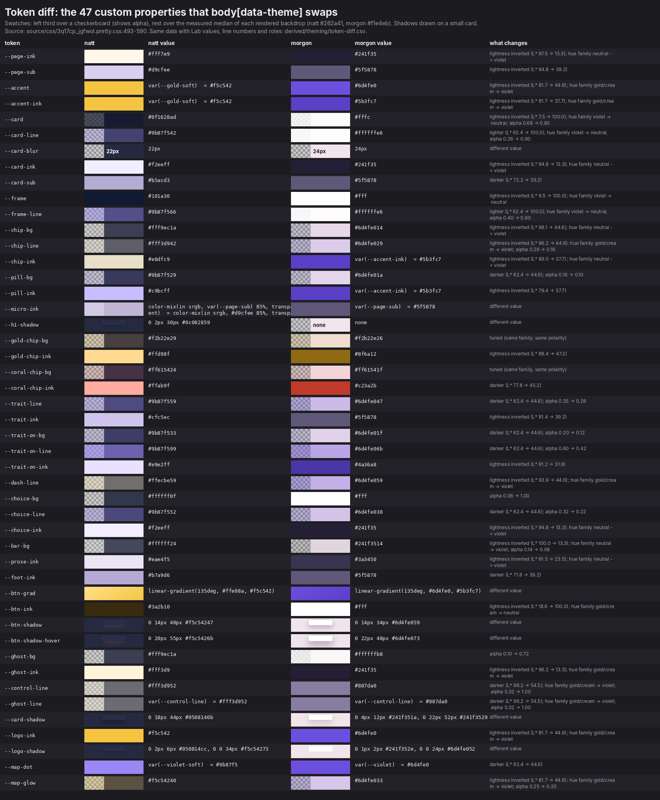
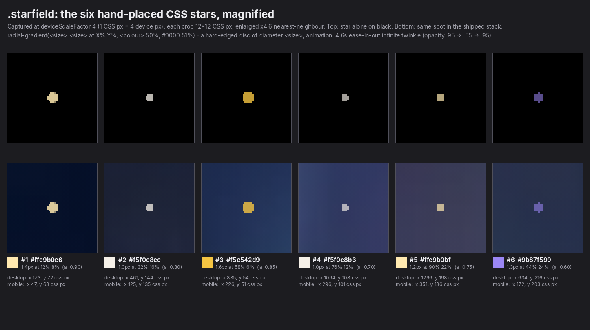
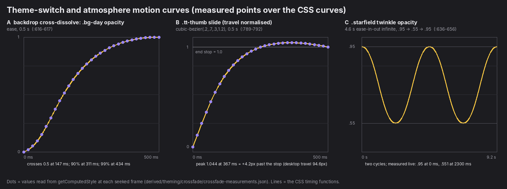
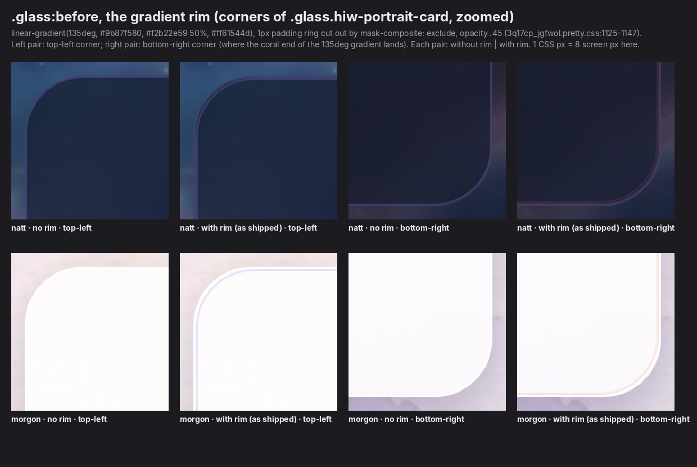

# Tale Forge: Theming and atmosphere

Tale Forge has two complete themes: **natt** (night, the default) and **morgon** (morning). One attribute, `body[data-theme]`, switches between them, and the choice is saved in `localStorage['tf-theme']`. Markup and layout are identical in both. What changes is 47 custom properties plus a fixed, full-viewport backdrop. In 0.5 s that backdrop dissolves from a photographic night painting (an astronaut reading a glowing book on hills of books in a nebula, under a dark scrim with six hand-placed CSS stars) to a pale watercolour sunrise.
Night is the bedtime-reading register: the copy keeps saying *ikväll* (tonight), and gold lamplight sits on indigo glass. Morning swaps gold for violet and dark glass for milky glass.
This file covers the switching mechanism (verbatim), the full token diff, every backdrop rule, a measured frame-by-frame crossfade, the glass and glow recipes, how text stays readable over the paintings, and a description of both paintings, plus recipes for film and web.
A standalone reconstruction, [derived/theming/recreate/theme-stack.html](../derived/theming/recreate/theme-stack.html), renders **pixel-identical** to the live backdrop in both themes at desktop and mobile size.

Observed facts cite a library path, with CSS line numbers in [source/css/3q17cp_jgfwol.pretty.css](../source/css/3q17cp_jgfwol.pretty.css) unless another file is named. Judgement is marked **Read:**. Colour values and contrast work overlap with [02-color.md](02-color.md), and this file links there rather than repeat the colour census.

## Contents

1. [At a glance](#1-at-a-glance)
2. [The concept: a bedtime night and a soft morning](#2-the-concept-a-bedtime-night-and-a-soft-morning)
3. [The mechanism, literally](#3-the-mechanism-literally)
4. [The complete token diff](#4-the-complete-token-diff)
5. [The backdrop stack](#5-the-backdrop-stack)
6. [The two paintings](#6-the-two-paintings)
7. [The crossfade between themes, measured](#7-the-crossfade-between-themes-measured)
8. [The theme toggle](#8-the-theme-toggle)
9. [Glass surfaces](#9-glass-surfaces)
10. [Glows](#10-glows)
11. [How text stays legible over the paintings](#11-how-text-stays-legible-over-the-paintings)
12. [Other themed atmospheres (behind login, from code)](#12-other-themed-atmospheres-behind-login-from-code)
13. [Every page and every home section, natt vs morgon](#13-every-page-and-every-home-section-natt-vs-morgon)
14. [Reproducing it](#14-reproducing-it)
15. [Files produced for this dimension](#15-files-produced-for-this-dimension)
16. [Caveats and open questions](#16-caveats-and-open-questions)

---

## 1. At a glance

| Fact | Value | Source |
|---|---|---|
| Switch | `body[data-theme="natt" \| "morgon"]` | [source/html/home.sv.html](../source/html/home.sv.html), :493, :542 |
| Default | `natt`, shipped in every server HTML; also the fallback for a missing or invalid stored value | all [source/html/*.html](../source/html/); measured (§3.3) |
| Persistence | `localStorage['tf-theme']`, per device; no cookie, no account setting | inline script; `ThemeToggle` in [source/js/390j9gbq0u9ce.js](../source/js/390j9gbq0u9ce.js) |
| OS dark/light preference | ignored: no `prefers-color-scheme` anywhere | grep of all CSS/JS |
| Tokens swapped | 47 custom properties, same names in the same order in both sets | :493-541, :542-590; [token-diff.csv](../derived/theming/token-diff.csv) |
| Other theme-scoped rules | 14 selectors outside the two token blocks (canvas colour, backdrop opacity, toggle thumb and labels, story-door card, glöd stage), plus two JS-driven differences | [theme-scoped-rules.csv](../derived/theming/theme-scoped-rules.csv) |
| Backdrop | `.bg.bg-night` (nebula `` + `.scrim` + `.starfield`) and `.bg.bg-day` (watercolour `<picture>`), both `position: fixed; height: 100lvh` | :612-676 |
| Switch motion | 0.5 s `ease` (`--theme-transition-duration`, `--theme-transition-easing`) on body colours, backdrop opacity and about 25 other selectors; the thumb uses `cubic-bezier(.2,.7,.3,1.2)` | :470-471, :602-617, :789-792 |
| Glass | `--card` navy at 68% + `blur(22px)` in natt; white at 80% + `blur(24px)` in morgon; plus a 1 px violet→gold→coral rim | :498-500, :547-549, :1110-1147 |
| Accent | gold `#f5c542` at night, violet `#6d4fe0` / `#5b3fc7` in the morning | :496-497, :545-546 |


*[derived/theming/compare/_overview__all-pages-folds.png](../derived/theming/compare/_overview__all-pages-folds.png): the first viewport of every harvested route (sv) in both themes, desktop and mobile. Each route uses the same backdrop stack, nav and toggle.*

---

## 2. The concept: a bedtime night and a soft morning

### 2.1 What the product says (verbatim copy)

The theme names are times of day, not "dark" and "light": `Natt` / `Morgon` (en `Night` / `Morning`), with the aria-label `Byt tema` (en `Switch theme`) (`ThemeToggle`, [source/js/390j9gbq0u9ce.js](../source/js/390j9gbq0u9ce.js)). The copy anchors the product in the evening:

| Copy (sv) | English (shipped en string or gloss) | Where |
|---|---|---|
| "Ikväll är hjälten ert barn." | "Tonight the hero is your child." | /start h1 ([source/html/start.sv.html](../source/html/start.sv.html), [start.en.html](../source/html/start.en.html)) |
| "Från ett foto till en uppläst bilderbok med fyra olika slut. Så här går en kväll till." | "… Here is how an evening works." | home, how-it-works lede ([source/js/3d9nxlx1n5pdy.js](../source/js/3d9nxlx1n5pdy.js)) |
| "Välj kvällens äventyr" | "Pick tonight's adventure" | home, step 3 |
| "Lagom tid för tandborstning och pyjamas." | "Just enough time for toothbrushing and pajamas." | home, step 3 micro line |
| "Er kväll kan sluta på ett sätt, och samma bok kan sluta helt annorlunda hemma hos en annan familj." | "Your evening can end one way, and the same book can end differently in another family's home." | home, step 5 |
| "En varm, vis berättare med en mysig godnattstämma" | "A warm, wise storyteller with a cozy bedtime voice" | narrator *Morfar Erik* [Grandpa Erik] ([390j9gbq0u9ce.js](../source/js/390j9gbq0u9ce.js)) |
| "Godnatt" | "Bedtime" | a story-mood card beside "Äventyr" [Adventure] and "Vänskap" [Friendship] ([source/js/2j_-r8q4tgdka.js](../source/js/2j_-r8q4tgdka.js)) |
| "En godnattsaga där kvällens ljus behöver hittas igen." | "A bedtime story where tonight's light needs finding again." | first-book premise ([source/js/0ad0wel9cyv30.js](../source/js/0ad0wel9cyv30.js)) |
| "Ikvällens bok målas i …" | "Tonight's book is painted in …" | create flow ([2j_-r8q4tgdka.js](../source/js/2j_-r8q4tgdka.js)) |

The ambient sound beds point the same way: `Brasa` [Fireplace], `Fönsterregn` [Window rain], `Sagoskogen` [Enchanted forest], `Speldosa` [Music box], `Månharpa` [Moonlit harp] and `Glödljus` [Ember glow]. The default bed while waiting is `hearth`, the default volume 0.18 and the maximum 0.4 ([source/js/1pgfdvt65g9p-.js](../source/js/1pgfdvt65g9p-.js); files in [assets/audio/atmosphere/v1/](../assets/audio/atmosphere/v1/)). The PWA manifest colours the installed app's chrome night indigo: `"background_color":"#171232","theme_color":"#171232"` ([source/meta/manifest.webmanifest](../source/meta/manifest.webmanifest)).

### 2.2 Read: why night is the default and what morning is for

- **Night is the use moment.** The product is a picture book read aloud at bedtime. The default theme is the room as it is when the book is open: dark, with one warm light. Gold (`--gold-soft #f5c542`) plays the lamp. It is the accent, the logo, the button and the glow, and it is the colour of the glowing book inside the night painting.
- **The night painting is the product in one image.** A small explorer reads a book that is the only light source in a vast dark space, sitting on hills of other books. The story lights the evening. The first-book premise says it in words: *"kvällens ljus behöver hittas igen"* [tonight's light needs finding again].
- **Morning is the daylight reading of the same room, not a "light mode".** It is called *morgon*, not *dag* (day). The plate is a dawn sky in watercolour, the medium of the picture books themselves, and colour sits at the edges like a stationery border. Its likely jobs: browsing or setting up a book in daylight, reading on a bright screen, and a gentler look for parents who find the nebula heavy. Nothing in the copy addresses morning use; it is offered, not promoted.
- **The two themes are one cycle: dusk-night and dawn, never noon.** Both canvases sit on the same violet hue axis (`#171232` and `#ede9f6` both at about 302° h; see [02-color.md §4](02-color.md#4-the-page-backdrop-nebula-night-watercolour-morning)), and the switch is a 0.5 s dissolve, like a time-lapse sunrise.

---

## 3. The mechanism, literally

### 3.1 Server HTML: the body tag and the pre-paint script

Every page ships `natt` and corrects itself before first paint. The script is the **first `<script>` inside `<body>`**, after an empty hidden `<div>` and before the backdrop markup. It is not in `<head>` ([source/html/home.sv.html](../source/html/home.sv.html), byte ~3400):

```html
<body data-theme="natt"><div hidden=""><!--$--><!--/$--></div><script>(function(){try{var t=localStorage.getItem('tf-theme');if(t==='natt'||t==='morgon'){document.body.dataset.theme=t;}}catch(e){}})();</script><div class="bg bg-night">…
```

The same string sits in the React Server Component payload as `dangerouslySetInnerHTML`, so React re-renders it on hydration. That is why the script appears twice per file (`grep -c` = 2 on every page except the share 404).

### 3.2 The toggle component (`ThemeToggle`)

Verbatim excerpt from [source/js/390j9gbq0u9ce.js](../source/js/390j9gbq0u9ce.js) (minified, module 22530):

```js
let n="tf-theme-change";function a(){return"morgon"===document.body.dataset.theme?"morgon":"natt"}function o(e){return window.addEventListener(n,e),()=>window.removeEventListener(n,e)}let l={en:{aria:"Switch theme",night:"Night",day:"Morning"},sv:{aria:"Byt tema",night:"Natt",day:"Morgon"}};e.s(["ThemeToggle",0,function({locale:e="sv"}){let i=l[e],u=(0,r.useSyncExternalStore)(o,a,()=>"natt");return(0,r.useLayoutEffect)(()=>{let e=function(){try{let e=localStorage.getItem("tf-theme");return"natt"===e||"morgon"===e?e:null}catch{return null}}();e&&a()!==e&&(document.body.dataset.theme=e,window.dispatchEvent(new Event(n)))},[]),(0,t.jsxs)("button",{className:"tt",role:"switch","aria-checked":"morgon"===u,"aria-label":i.aria,type:"button",onClick:function(){let e="natt"===a()?"morgon":"natt";document.body.dataset.theme=e;try{localStorage.setItem("tf-theme",e)}catch{}window.dispatchEvent(new Event(n))},children:[…]})}])
```

Readable transcription (same logic):

```js
const EVENT = 'tf-theme-change';
const current = () => document.body.dataset.theme === 'morgon' ? 'morgon' : 'natt'; // anything else counts as natt
const subscribe = cb => { addEventListener(EVENT, cb); return () => removeEventListener(EVENT, cb); };
function ThemeToggle({ locale = 'sv' }) {
  const theme = useSyncExternalStore(subscribe, current, () => 'natt');       // server snapshot: natt
  useLayoutEffect(() => {                                                       // belt and braces after hydration
    const saved = readStored();                                                 // 'natt' | 'morgon' | null
    if (saved && current() !== saved) { document.body.dataset.theme = saved; dispatchEvent(new Event(EVENT)); }
  }, []);
  return <button className="tt" role="switch" aria-checked={theme === 'morgon'} aria-label={…}
    onClick={() => { const next = current() === 'natt' ? 'morgon' : 'natt';
                     document.body.dataset.theme = next;
                     try { localStorage.setItem('tf-theme', next) } catch {}
                     dispatchEvent(new Event(EVENT)); }}>…</button>;
}
```

The DOM attribute is the single source of truth. React never holds the theme in state; it only mirrors `aria-checked` through the custom event. The `checked` state means **morgon**.

### 3.3 Measured behaviour

Live checks against https://tale-forge.app/ (script: scratchpad `tools/theming/loadcheck.js`):

| Stored `tf-theme` | `data-theme` at `readyState = interactive` | CSS transitions running after load | After one click |
|---|---|---|---|
| `morgon` | `morgon` | 0 | `natt`, stored `natt`, `aria-checked="false"` |
| `natt` | `natt` | 0 | `morgon`, stored `morgon`, `aria-checked="true"` |
| `dag` (invalid) | `natt` | 0 | `morgon` |
| none | `natt` | 0 | `morgon` |

**A saved morning theme loads without a flash and without an animated switch.** A synchronous script sets the attribute before the backdrop elements are even parsed, so their first computed style is already the morning one and no transition starts.

### 3.4 What is deliberately absent

- No `prefers-color-scheme` media query and no `matchMedia('(prefers-color-scheme…)')`. Everyone starts at night, whatever their OS setting. The only system preference read is `prefers-reduced-motion` (CSS, and the glöd canvas JS).
- No `color-scheme` property (computed `colorScheme: normal` in both themes) and no `<meta name="theme-color">`. Native form controls and scrollbars keep the browser default.
- No server-side or cookie persistence. Language is a cookie (`tf_locale`); theme is local storage. They are independent, and the toggle labels follow the language.

### 3.5 Reduced motion

`@media (prefers-reduced-motion: reduce)` (:2349-2372) stops the twinkle and turns the theme switch into a cut:

```css
@media (prefers-reduced-motion: reduce) {
  .fb1, .fb2, .badge, .dotpulse, .starfield { animation: none; }
  body, .bg, .tt, .tt-thumb, .tt-opt { transition: none; }
  .reveal { opacity: 1; transition: none; transform: none; }
  .comp-chosen { transition: none; }
}
```

(Shown here condensed onto one line per rule; the file has one property per line.)

### 3.6 Other listeners

The glöd hearth stage (create flow) and the reader's ambient canvas re-paint their palettes on the fly. Each one watches the attribute with `new MutationObserver(() => scene.setTheme(theme())).observe(document.body, { attributes: true, attributeFilter: ['data-theme'] })` ([source/js/2j_-r8q4tgdka.js](../source/js/2j_-r8q4tgdka.js), [source/js/36tbz-w9v-p8v.js](../source/js/36tbz-w9v-p8v.js)). See §12.

---

## 4. The complete token diff

Both sets live on `body[data-theme=…]`, not on `:root`. They define the same 47 names in the same order (checked by the parser in scratchpad `tools/theming/token_diff.py`). The full machine-readable diff, with CIELAB L*/C*/h for both values, alpha, line numbers, `var()` consumer counts and each token's role (roles taken from the colour agent's [tokens/color.json](../tokens/color.json)), is **[derived/theming/token-diff.csv](../derived/theming/token-diff.csv)**. Twelve extra rows at the end of the CSV list the canvas colour and the 11 theme-invariant `:root` settings.



*[derived/theming/token-diff.png](../derived/theming/token-diff.png): every token side by side. Each swatch shows a checkerboard in its left third to reveal alpha; the rest is composited over the measured median of that theme's rendered backdrop (natt `#262a41`, morgon `#f1e4eb`).*

### 4.1 Table

| Token | natt | morgon | What changes (L* = CIELAB lightness) | Lines |
|---|---|---|---|---|
| `--page-ink` | `#fff7e9` | `#241f35` | lightness inverted (L* 97.5 -> 13.3); hue family neutral -> violet | 494 / 543 |
| `--page-sub` | `#d9cfee` | `#5f5878` | lightness inverted (L* 84.8 -> 39.2) | 495 / 544 |
| `--accent` | `var(--gold-soft)` = `#f5c542` | `#6d4fe0` | lightness inverted (L* 81.7 -> 44.6); hue family gold/cream -> violet | 496 / 545 |
| `--accent-ink` | `var(--gold-soft)` = `#f5c542` | `#5b3fc7` | lightness inverted (L* 81.7 -> 37.7); hue family gold/cream -> violet | 497 / 546 |
| `--card` | `#0f1628ad` | `#fffc` | lightness inverted (L* 7.5 -> 100.0); hue family violet -> neutral; alpha 0.68 -> 0.80 | 498 / 547 |
| `--card-line` | `#9b87f542` | `#ffffffe6` | lighter (L* 62.4 -> 100.0); hue family violet -> neutral; alpha 0.26 -> 0.90 | 499 / 548 |
| `--card-blur` | `22px` | `24px` | different value | 500 / 549 |
| `--card-ink` | `#f2eeff` | `#241f35` | lightness inverted (L* 94.8 -> 13.3); hue family neutral -> violet | 501 / 550 |
| `--card-sub` | `#b5acd3` | `#5f5878` | darker (L* 72.2 -> 39.2) | 502 / 551 |
| `--frame` | `#101a30` | `#fff` | lightness inverted (L* 9.5 -> 100.0); hue family violet -> neutral | 503 / 552 |
| `--frame-line` | `#9b87f566` | `#ffffffe6` | lighter (L* 62.4 -> 100.0); hue family violet -> neutral; alpha 0.40 -> 0.90 | 504 / 553 |
| `--chip-bg` | `#fff9ec1a` | `#6d4fe014` | lightness inverted (L* 98.1 -> 44.6); hue family neutral -> violet | 505 / 554 |
| `--chip-line` | `#fff3d942` | `#6d4fe029` | lightness inverted (L* 96.2 -> 44.6); hue family gold/cream -> violet; alpha 0.26 -> 0.16 | 506 / 555 |
| `--chip-ink` | `#e8dfc9` | `var(--accent-ink)` = `#5b3fc7` | lightness inverted (L* 89.0 -> 37.7); hue family neutral -> violet | 507 / 556 |
| `--pill-bg` | `#9b87f529` | `#6d4fe01a` | darker (L* 62.4 -> 44.6); alpha 0.16 -> 0.10 | 508 / 557 |
| `--pill-ink` | `#c9bcff` | `var(--accent-ink)` = `#5b3fc7` | lightness inverted (L* 79.4 -> 37.7) | 509 / 558 |
| `--micro-ink` | `color-mix(in srgb, var(--page-sub) 85%, transparent)` = `color-mix(in srgb, #d9cfee 85%, transparent)` | `var(--page-sub)` = `#5f5878` | different value | 510 / 559 |
| `--h1-shadow` | `0 2px 30px #0c082859` | `none` | different value | 511 / 560 |
| `--gold-chip-bg` | `#f2b22e29` | `#f2b22e26` | tuned (same family, same polarity) | 512 / 561 |
| `--gold-chip-ink` | `#ffd98f` | `#8f6a12` | lightness inverted (L* 88.4 -> 47.2) | 513 / 562 |
| `--coral-chip-bg` | `#ff615424` | `#ff61541f` | tuned (same family, same polarity) | 514 / 563 |
| `--coral-chip-ink` | `#ffab9f` | `#c23a2b` | darker (L* 77.8 -> 45.2) | 515 / 564 |
| `--trait-line` | `#9b87f559` | `#6d4fe047` | darker (L* 62.4 -> 44.6); alpha 0.35 -> 0.28 | 516 / 565 |
| `--trait-ink` | `#cfc5ec` | `#5f5878` | lightness inverted (L* 81.4 -> 39.2) | 517 / 566 |
| `--trait-on-bg` | `#9b87f533` | `#6d4fe01f` | darker (L* 62.4 -> 44.6); alpha 0.20 -> 0.12 | 518 / 567 |
| `--trait-on-line` | `#9b87f599` | `#6d4fe06b` | darker (L* 62.4 -> 44.6); alpha 0.60 -> 0.42 | 519 / 568 |
| `--trait-on-ink` | `#e9e2ff` | `#4a36a8` | lightness inverted (L* 91.2 -> 31.6) | 520 / 569 |
| `--dash-line` | `#ffecbe59` | `#6d4fe059` | lightness inverted (L* 93.9 -> 44.6); hue family gold/cream -> violet | 521 / 570 |
| `--choice-bg` | `#ffffff0f` | `#fff` | alpha 0.06 -> 1.00 | 522 / 571 |
| `--choice-line` | `#9b87f552` | `#6d4fe038` | darker (L* 62.4 -> 44.6); alpha 0.32 -> 0.22 | 523 / 572 |
| `--choice-ink` | `#f2eeff` | `#241f35` | lightness inverted (L* 94.8 -> 13.3); hue family neutral -> violet | 524 / 573 |
| `--bar-bg` | `#ffffff24` | `#241f3514` | lightness inverted (L* 100.0 -> 13.3); hue family neutral -> violet; alpha 0.14 -> 0.08 | 525 / 574 |
| `--prose-ink` | `#eae4f5` | `#3a3450` | lightness inverted (L* 91.5 -> 23.5); hue family neutral -> violet | 526 / 575 |
| `--foot-ink` | `#b7a9d6` | `#5f5878` | darker (L* 71.8 -> 39.2) | 527 / 576 |
| `--btn-grad` | `linear-gradient(135deg, #ffe08a, #f5c542)` | `linear-gradient(135deg, #6d4fe0, #5b3fc7)` | different value | 528 / 577 |
| `--btn-ink` | `#3a2b10` | `#fff` | lightness inverted (L* 18.6 -> 100.0); hue family gold/cream -> neutral | 529 / 578 |
| `--btn-shadow` | `0 14px 40px #f5c54247` | `0 14px 34px #6d4fe059` | different value | 530 / 579 |
| `--btn-shadow-hover` | `0 20px 55px #f5c5426b` | `0 22px 48px #6d4fe073` | different value | 531 / 580 |
| `--ghost-bg` | `#fff9ec1a` | `#ffffffb8` | alpha 0.10 -> 0.72 | 532 / 581 |
| `--ghost-ink` | `#fff3d9` | `#241f35` | lightness inverted (L* 96.2 -> 13.3); hue family gold/cream -> violet | 533 / 582 |
| `--control-line` | `#fff3d952` | `#887da0` | darker (L* 96.2 -> 54.5); hue family gold/cream -> violet; alpha 0.32 -> 1.00 | 534 / 583 |
| `--ghost-line` | `var(--control-line)` = `#fff3d952` | `var(--control-line)` = `#887da0` | darker (L* 96.2 -> 54.5); hue family gold/cream -> violet; alpha 0.32 -> 1.00 | 535 / 584 |
| `--card-shadow` | `0 18px 44px #0508146b` | `0 4px 12px #241f351a, 0 22px 52px #241f3529` | different value | 536 / 585 |
| `--logo-ink` | `#f5c542` | `#6d4fe0` | lightness inverted (L* 81.7 -> 44.6); hue family gold/cream -> violet | 537 / 586 |
| `--logo-shadow` | `0 2px 6px #050814cc, 0 0 34px #f5c54273` | `0 1px 2px #241f352e, 0 0 24px #6d4fe052` | different value | 538 / 587 |
| `--map-dot` | `var(--violet-soft)` = `#9b87f5` | `var(--violet)` = `#6d4fe0` | darker (L* 62.4 -> 44.6) | 539 / 588 |
| `--map-glow` | `#f5c54240` | `#6d4fe033` | lightness inverted (L* 81.7 -> 44.6); hue family gold/cream -> violet; alpha 0.25 -> 0.20 | 540 / 589 |

The canvas colour is not a token: `body { background: #171232 }` (:606) and `body[data-theme="morgon"] { background: #ede9f6 }` (:609-611).

### 4.2 What the diff does, counted

From the `what_changes` column (classification rules in scratchpad `tools/theming/token_diff.py`):

| Kind of change | Tokens |
|---|---|
| Lightness inverted (crosses L* 50 by 35 or more) | 22 |
| Darker in morgon, same side of 50 | 11 |
| Lighter in morgon | 2 (`--card-line`, `--frame-line`: violet at 26-40% → white at 90%) |
| Alpha only (same colour) | 2 (`--choice-bg` `#fff` 6% → 100%; `--ghost-bg` 10% → 72%) |
| Tuned, same family and polarity | 2 (`--gold-chip-bg`, `--coral-chip-bg`) |
| Non-colour values (gradient, 4 shadows, blur length, `color-mix`) | 8 |
| …of the colour tokens, hue family also changes (cream/gold/neutral → violet, or violet → white) | 21 |

Alpha goes **up** in the morning for the surface tokens: `--card`, `--card-line`, `--frame-line`, `--choice-bg`, `--ghost-bg`, `--control-line`/`--ghost-line` (32% → opaque `#887da0`). It goes **down** for the tint tokens: `--chip-line`, `--pill-bg`, `--trait-line`, `--trait-on-bg`, `--trait-on-line`, `--choice-line`, `--bar-bg`.

**Read:**
- At night surfaces are veils. A 6-10% cream or 68% navy layer is enough, because light-on-dark contrast comes from the ink.
- In the morning a translucent white on a near-white painting would vanish. So surfaces become nearly opaque (80-100% white), and edges are drawn either with an opaque grey-violet line (`#887da0`) or with low-alpha violet tints.
- Shadows change character too. At night the card shadow is one long navy drop (`0 18px 44px #0508146b`). In the morning it is two soft plum layers (`0 4px 12px #241f351a, 0 22px 52px #241f3529`), closer to paper on paper.
- `--h1-shadow` exists only at night.

### 4.3 The non-token theme rules

Everything else that differs by theme: 14 selectors outside the token blocks, plus two JS-driven differences, in [derived/theming/theme-scoped-rules.csv](../derived/theming/theme-scoped-rules.csv):

| Selector | Property | natt | morgon | Source |
|---|---|---|---|---|
| `body` | `background` | `#171232` | `#ede9f6` | :606, :609-611 |
| `.bg-night` | `opacity` | 1 | 0 | :670-676 |
| `.bg-day` | `opacity` | 0 | 1 | :667-672 |
| `.tt-thumb` | `transform` | none | `translate(100%)` | :798-800 |
| `.tt-opt.night` / `.tt-opt.day` | `color` | `--btn-ink` on the active one | same, mirrored | :818-821 |
| `.cs-door-face` | `background` | `linear-gradient(160deg, #140f28e6, #281e46d9)` | `linear-gradient(160deg, #ded5f5, #c9bcf0)` | [2h1wwdz1nvxwk.pretty.css:433-444](../source/css/2h1wwdz1nvxwk.pretty.css) |
| `.glod-stage` | `background` | `#0b0e22` | `#b7c0ea` | [37m388zf6rymp.pretty.css:1-20](../source/css/37m388zf6rymp.pretty.css) |
| `.glod-ambient` | `background` | `#0b0e22` | `#cdb9d8` | [37m388zf6rymp.pretty.css:21-34](../source/css/37m388zf6rymp.pretty.css) |
| `.glod-ambient:after` | `background` (scrim) | `linear-gradient(#07091780 0%, #07091742 42%, #07091770 100%)` | `linear-gradient(#3b2c6433 0%, #fff6e814 45%, #ede9f661 100%)` | [37m388zf6rymp.pretty.css:44-52](../source/css/37m388zf6rymp.pretty.css) |
| `.glod-hearth-box p` | `color` / `text-shadow` | `#eee1c6` / `0 1px 10px #060410d9, 0 0 3px #060410b3` | `#fff6e4` / `0 1px 10px #2b1e4ee6, 0 0 4px #2b1e4ecc, 0 1px 2px #2b1e4ee6` | [37m388zf6rymp.pretty.css:744-758](../source/css/37m388zf6rymp.pretty.css) |
| `.glod-caption-line` | `color` / `text-shadow` | `#fff7e9` / `0 2px 20px #060410cc` | `#2f2350` / `0 2px 20px #fff8ebb3` | [37m388zf6rymp.pretty.css:970-981](../source/css/37m388zf6rymp.pretty.css) |

**Nothing else is theme-scoped.** Radii, spacing, type, motion and layout are shared, and page heights are identical in both themes ([04-layout-spacing-responsive.md](04-layout-spacing-responsive.md)). Some colours ignore the theme because they use primitives or raw hex:
- gold `.dotpulse` markers, `.hiw-star`, map choice diamonds, the skip link;
- the fan covers' gold halo, the AI chip;
- the modal scrims (`#0a081980` in both themes, [2h1wwdz1nvxwk.pretty.css:243-250](../source/css/2h1wwdz1nvxwk.pretty.css)).

[02-color.md §5](02-color.md#5-the-gold-and-violet-accent-swap) and [05a §12](05a-components-landing.md#12-natt-vs-morgon-per-component) list these per component.

---

## 5. The backdrop stack

### 5.1 Markup (verbatim)

From [source/html/home.sv.html](../source/html/home.sv.html). Identical on every route except the share 404, which has no stack:

```html
<div class="bg bg-night"><div class="scrim"></div><div class="starfield"></div></div>
<div class="bg bg-day"><picture><source media="(max-width: 760px)" srcSet="/assets/morgon-aurora-mobile.webp"/></picture></div>
<div class="wrap"> … all page content … </div>
```

Both images are decorative (`alt=""`) and load on every visit whatever the theme, because both layers are always in the DOM (`.bg-day` at opacity 0 still loads its image).

### 5.2 Every rule, verbatim

[source/css/3q17cp_jgfwol.pretty.css:598-680](../source/css/3q17cp_jgfwol.pretty.css):

```css
body {
  color: var(--page-ink);
  font-family: var(--ui);
  -webkit-font-smoothing: antialiased;
  transition:
    background-color var(--theme-transition-duration)
      var(--theme-transition-easing),
    color var(--theme-transition-duration) var(--theme-transition-easing);
  background: #171232;
  overflow-x: hidden;
}
body[data-theme="morgon"] {
  background: #ede9f6;
}
.bg {
  z-index: 0;
  pointer-events: none;
  height: 100lvh;
  transition: opacity var(--theme-transition-duration)
    var(--theme-transition-easing);
  position: fixed;
  top: 0;
  left: 0;
  right: 0;
}
.bg-night img {
  object-fit: cover;
  object-position: center 30%;
  width: 100%;
  height: 100%;
  position: absolute;
  inset: 0;
}
.bg-night .scrim {
  background: linear-gradient(#0b0f1e61 0%, #0b0f1e80 45%, #0d1122bd 100%);
  position: absolute;
  inset: 0;
}
.starfield {
  background-image:
    radial-gradient(1.4px 1.4px at 12% 8%, #ffe9b0e6 50%, #0000 51%),
    radial-gradient(1px 1px at 32% 16%, #f5f0e8cc 50%, #0000 51%),
    radial-gradient(1.6px 1.6px at 58% 6%, #f5c542d9 50%, #0000 51%),
    radial-gradient(1px 1px at 76% 12%, #f5f0e8b3 50%, #0000 51%),
    radial-gradient(1.2px 1.2px at 90% 22%, #ffe9b0bf 50%, #0000 51%),
    radial-gradient(1.3px 1.3px at 44% 24%, #9b87f599 50%, #0000 51%);
  animation: 4.6s ease-in-out infinite twinkle;
  position: absolute;
  inset: 0;
}
@keyframes twinkle {
  0%,
  to {
    opacity: 0.95;
  }
  50% {
    opacity: 0.55;
  }
}
.bg-day picture,
.bg-day img {
  width: 100%;
  height: 100%;
  position: absolute;
  inset: 0;
}
.bg-day img {
  object-fit: cover;
}
body[data-theme="natt"] .bg-day {
  opacity: 0;
}
body[data-theme="natt"] .bg-night,
body[data-theme="morgon"] .bg-day {
  opacity: 1;
}
body[data-theme="morgon"] .bg-night {
  opacity: 0;
}
.wrap {
  z-index: 1;
  position: relative;
}
```

### 5.3 The stack, back to front

| # | Layer | What it is | Rule |
|---|---|---|---|
| 0 | `body` background | flat `#171232` / `#ede9f6`; visible only where the plate does not reach (overscroll, and the long full-page captures) | :606-611 |
| 1 | `.bg.bg-night > img` | [nebula-hero.webp](../assets/assets/nebula-hero.webp), 2400×1340, `cover`, anchored `center 30%` | :623-630 |
| 2 | `.bg.bg-night > .scrim` | vertical navy gradient, alpha 0.38 → 0.50 (at 45%) → 0.74 | :631-635 |
| 3 | `.bg.bg-night > .starfield` | six 1-1.6 px CSS discs twinkling 0.95 ↔ 0.55 over 4.6 s | :636-656 |
| 4 | `.bg.bg-day > picture > img` | [morgon-aurora-desktop.webp](../assets/assets/morgon-aurora-desktop.webp) 2560×1440, or [-mobile.webp](../assets/assets/morgon-aurora-mobile.webp) 1440×2560 at ≤760 px; `cover`, centred; no scrim, no stars | :657-666 |
| 5 | `.wrap` | everything else, `z-index: 1` | :677-680 |

Both `.bg` layers are `position: fixed`, so the plate never scrolls. Every section of the long home page is read over the same picture ([04 §1](04-layout-spacing-responsive.md)). The height is `100lvh` (the *large* viewport height): on mobile the plate already fills the screen with the browser bars collapsed, so it never jumps when they hide. `.bg-day` comes later in the DOM and paints over `.bg-night`, so a switch fades the day layer in or out over the night layer.


*[derived/theming/night-stack/layers__desktop.png](../derived/theming/night-stack/layers__desktop.png): live captures with `.wrap` hidden and layers removed by injected CSS. (A) image only, (B) + scrim, (C) as shipped, (D) image + stars without the scrim, (E) the scrim alone over `#808080` with its rendered values at 0/45/100%, (F) the starfield alone on black, with dots re-drawn and circled (at tile scale the real 1 px stars vanish). Mobile: [layers__mobile.png](../derived/theming/night-stack/layers__mobile.png).*

### 5.4 The scrim

- **Literal:** `linear-gradient(#0b0f1e61 0%, #0b0f1e80 45%, #0d1122bd 100%)`. That is navy-black `#0b0f1e` at 38% (top) and 50% (45% down), ending on a slightly bluer `#0d1122` at 74% (bottom).
- **Measured over neutral grey `#808080`:** rgb(83,85,90) at the top, (69,71,78) at 45%, (43,46,58) at the bottom ([plate__scrim-only-over-808080__desktop.png](../derived/theming/night-stack/plate__scrim-only-over-808080__desktop.png)). In sRGB code values that is about −34%, −45% and −64%, with a slight blue cast.
- **Purpose:** the bottom is darkest because content below the fold scrolls over the lower part of a fixed plate. The top stays lighter so the nebula and the gold bokeh still read behind the nav.
- **Film element:** the exact gradient, recomputed in premultiplied alpha as CSS does, is supplied as an RGBA layer: [element__scrim-rgba__1920x1080.png](../derived/theming/night-stack/element__scrim-rgba__1920x1080.png), [element__scrim-rgba__3840x2160.png](../derived/theming/night-stack/element__scrim-rgba__3840x2160.png).

### 5.5 The starfield: six stars by hand

The `.starfield` is not a texture. Six `radial-gradient`s each draw one hard-edged disc: the colour runs solid to 50% of the gradient radius and is transparent from 51%. Each disc's diameter equals its stated size. Positions are percentages of the viewport, so the stars keep their relative places at every size. The painting supplies all the other stars and bokeh.

| # | Size | Position | Colour | Desktop 1440×900 (CSS px) | Mobile 390×844 |
|---|---|---|---|---|---|
| 1 | 1.4 px | 12% 8% | `#ffe9b0` at 0.90 (pale gold) | 173, 72 | 47, 68 |
| 2 | 1.0 px | 32% 16% | `#f5f0e8` at 0.80 (warm white) | 461, 144 | 125, 135 |
| 3 | 1.6 px | 58% 6% | `#f5c542` at 0.85 (`--gold-soft`) | 835, 54 | 226, 51 |
| 4 | 1.0 px | 76% 12% | `#f5f0e8` at 0.70 | 1094, 108 | 296, 101 |
| 5 | 1.2 px | 90% 22% | `#ffe9b0` at 0.75 | 1296, 198 | 351, 186 |
| 6 | 1.3 px | 44% 24% | `#9b87f5` at 0.60 (`--violet-soft`) | 634, 216 | 172, 203 |

- **Where they sit:** all six are in the top quarter, where the scrim is lightest and where the nav and kicker sit.
- **The twinkle:** the whole layer pulses together (one `opacity` animation, not per star): 0.95 → 0.55 → 0.95, 4.6 s, `ease-in-out`, infinite. Measured live: 0.95 at 0 ms, 0.551 at 2300 ms.
- **Reduced motion:** the animation is switched off.



*[derived/theming/night-stack/starfield-detail.png](../derived/theming/night-stack/starfield-detail.png): each star captured at deviceScaleFactor 4 and magnified; top row alone on black, bottom row in the shipped stack. At 1× a star is 1-2 device pixels.*

**Read:** the CSS stars are a garnish. Against the painting's own hundreds of specks they are almost invisible. Their job is to make the sky *move* very slightly: a 4.6 s breath, slower than a resting heartbeat. A film can use the same idea: a few sub-pixel sparkles on a slow sine over a still plate.

Film-ready RGBA star layers (positions and sizes from the CSS, drawn with 4× supersampling, at peak opacity 0.95): [element__starfield-rgba__1920x1080__peak-opacity.png](../derived/theming/night-stack/element__starfield-rgba__1920x1080__peak-opacity.png), [element__starfield-rgba__3840x2160__peak-opacity.png](../derived/theming/night-stack/element__starfield-rgba__3840x2160__peak-opacity.png) (sizes doubled for 4K).

### 5.6 Full-resolution plates

Live captures, content hidden, looping animations frozen at t = 0 (starfield at 0.95):

| Variant | Desktop 1440×900 | Mobile 390×844 @2× |
|---|---|---|
| Image only | [plate__image-only__desktop.png](../derived/theming/night-stack/plate__image-only__desktop.png) | [mobile](../derived/theming/night-stack/plate__image-only__mobile.png) |
| Image + scrim | [plate__image+scrim__desktop.png](../derived/theming/night-stack/plate__image+scrim__desktop.png) | [mobile](../derived/theming/night-stack/plate__image+scrim__mobile.png) |
| Image + starfield (no scrim) | [plate__image+starfield__desktop.png](../derived/theming/night-stack/plate__image+starfield__desktop.png) | [mobile](../derived/theming/night-stack/plate__image+starfield__mobile.png) |
| Full stack (as shipped) | [plate__full-stack__desktop.png](../derived/theming/night-stack/plate__full-stack__desktop.png) | [mobile](../derived/theming/night-stack/plate__full-stack__mobile.png) |
| Starfield alone on black | [plate__starfield-only-on-black__desktop.png](../derived/theming/night-stack/plate__starfield-only-on-black__desktop.png) | [mobile](../derived/theming/night-stack/plate__starfield-only-on-black__mobile.png) |
| Scrim alone over `#808080` | [plate__scrim-only-over-808080__desktop.png](../derived/theming/night-stack/plate__scrim-only-over-808080__desktop.png) | [mobile](../derived/theming/night-stack/plate__scrim-only-over-808080__mobile.png) |

The morning plate as rendered (no layers to remove) was captured by the colour agent: [derived/color/backdrop-layer__morgon__desktop.png](../derived/color/backdrop-layer__morgon__desktop.png), [__mobile.png](../derived/color/backdrop-layer__morgon__mobile.png).

---

## 6. The two paintings

### 6.1 Night: `nebula-hero.webp`


*[derived/theming/paintings/nebula-anatomy.png](../derived/theming/paintings/nebula-anatomy.png): the source image with the area visible at each viewport (desktop gold, tablet blue, mobile red) and the main elements labelled (positions by eye).*

**Subject.** An astronaut in a white-grey suit sits on top of a tall pile of old books. He holds an open book in his lap, and the book glows. Around him is a violet-blue nebula with teal wisps, a field of tiny stars, and large defocused gold bokeh orbs. Hills of more books stretch to the left and into the foreground. A billowing violet cloud bank rises on the right.

**Composition (2400×1340, about 1.79:1).**
- The figure sits in the left-centre third (about x 630-1090, y 350-855). The glowing book is at about (935, 575), roughly 39% across and 43% down.
- Book stacks fill the lower-left half. The lit, densest part of the nebula is upper centre-right, and the cloud bank fills the right third from the middle down.
- Defocused book debris crosses the bottom edge.
- The quietest areas are the dark sky at top left (sampled `#051a3c`) and the soft mid-blue gas at top centre.

**Light.**
- The single warm key light is the book itself (sampled page glow `#fbf8cd`, peak `#fffce7`). It lights the visor (which reflects gold) and the gloves, and it rim-lights the book edges in amber (`#ba8350`).
- Everything else is cool ambient light from the nebula: core `#6a83c6`, cloud bank `#58577e`.
- The gold bokeh orbs (`#be8c43`) echo the book's warmth through the depth of the scene.
- Shallow depth of field: the figure is sharp; the foreground books and the far orbs are blurred.

**Palette.** k-means (k = 8, CIELAB) from the colour agent ([derived/color/image-palettes.json](../derived/color/image-palettes.json)):

| Cluster | `#101B3F` | `#38446E` | `#746F8E` | `#352D3A` | `#6E7DB6` | `#7B5E58` | `#ACA1CB` | `#CBA181` |
|---|---|---|---|---|---|---|---|---|
| Share | 26% | 24% | 15% | 11% | 9% | 6% | 6% | 4% |

Median L* is 30.9 and median chroma 23.8. Nearly all chromatic mass is blue-violet, and the warm clusters (`#7B5E58`, `#CBA181`) are the books and the light.

**What each viewport shows** (`object-position: center 30%`; vertical crop is always zero because `cover` scales to height; image x-ranges in [crop-windows.json](../derived/theming/paintings/crop-windows.json)):
- **Desktop 1440×900** shows x 128-2272: the whole scene minus thin side strips.
- **Tablet 834×1112** shows x 698-1702: the astronaut's front half, the book and the nebula core.
- **Mobile 390×844** shows x 890-1510: only the glowing book and the astronaut's legs at the left edge, then the nebula core with bokeh. On a phone the night plate is mostly gas and gold specks ([plate__image-only__mobile.png](../derived/theming/night-stack/plate__image-only__mobile.png)).

**Read:**
- This is a cinematic 3D-render or photographic plate (volumetric clouds, bokeh, depth of field), not an illustration.
- It is the product's metaphor in one frame: a small reader whose book is the only light in a huge dark space, enthroned on stories. The astronaut stands for the child as explorer.
- The warm-in-cool lighting is exactly the UI's colour logic: gold accents on an indigo field.

### 6.2 Morning: `morgon-aurora-desktop.webp`


*[derived/theming/paintings/morgon-desktop-anatomy.png](../derived/theming/paintings/morgon-desktop-anatomy.png): the desktop morning painting with the desktop and tablet windows and the main elements labelled.*

**Subject.** A dawn sky painted wet-on-wet in watercolour on textured cold-press paper (the grain is visible across the pale centre). There is no figure and no object, only weather and plants.

**Composition (2560×1440, exactly 16:9).** It is built like a stationery frame: all the colour lies along the edges, with an empty paper centre.
- **Top left:** lavender cloud masses (sampled `#dcc9eb`) with tiny gold splatter specks.
- **Top right:** an apricot-yellow-coral sun-burst of wet blooms and dry-brush streaks (coral `#fab4a5`; apricot `#FCD8A6` cluster).
- **Left and right edges:** sprigs of coral and lavender leaves and berry stems (`#f5c4c7`, `#c8a5ca`).
- **Bottom:** misty lavender hills on a low horizon, and a pale river or meadow band.
- **Centre:** about 60% of the width and the middle half of the height is near-white paper (`#f1e9f0`).

**Light.** Soft and directionless. The "sun" is a warm bloom at the top right rather than a disc. There are no cast shadows. The value range is tiny: median L* 91.6, 10th-90th percentile 80.5-94.1.

**Palette** (k-means, [image-palettes.json](../derived/color/image-palettes.json)):

| Cluster | `#F3E9EF` | `#EEE2ED` | `#E4CEDE` | `#FAE0D3` | `#D5BBDC` | `#F8BAB9` | `#B69DD2` | `#FCD8A6` |
|---|---|---|---|---|---|---|---|---|
| Share | 40% | 24% | 11% | 10% | 7% | 3% | 3% | 3% |

Median chroma is only 7.0.

**Viewports.** Desktop 1440×900 shows x 128-2432, nearly everything. Tablet 834×1112 still gets the desktop file (the `<source>` breakpoint is 760 px) and shows only the centre strip, x 740-1820: the sun-burst at the top, paper below, hills at the bottom, and no sprigs.

### 6.3 Morning, portrait: `morgon-aurora-mobile.webp`


*[derived/theming/paintings/morgon-mobile-anatomy.png](../derived/theming/paintings/morgon-mobile-anatomy.png).*

This is a separate painting in the same hand and palette, not a crop:
- The sun-burst and the sprigs move to the top band.
- The lavender cloud band and an apricot horizon glow move to the bottom fifth, with flower stems in the bottom corners.
- The middle 60% is plain paper for the stacked mobile content.

At 390×844 the visible window is x 128-1312 of 1440 (full height). Palette: `#F2E6ED` 51%, `#F9EAE1` 16%, `#EAD5E8` 11%, `#F6DAD9` 7%, `#D0B4DC` 5%, `#FBE1C0` 4%, `#AE99D2` 3%, `#F7C6BE` 3% ([image-palettes.json](../derived/color/image-palettes.json)).

### 6.4 Where text can sit: measured busyness


*[derived/theming/paintings/text-safe-zones.png](../derived/theming/paintings/text-safe-zones.png): a heat map of local contrast (standard deviation of L* in a 25×25 CSS-px window) over each rendered plate, with the home page's text and control boxes on top. Numbers are in [text-safe-zones.json](../derived/theming/paintings/text-safe-zones.json).*

Mean local std of L* behind each element (lower = calmer) against the plate average:

| Plate | Whole plate | h1 | lede | CTA microcopy | cover fan | HIW lede |
|---|---|---|---|---|---|---|
| natt desktop | 2.52 | **3.25** | **4.64** | **4.03** | 2.67 | 1.18 |
| morgon desktop | 1.19 | 0.60 | 0.49 | 0.45 | 0.68 | 2.15 |
| natt mobile | 2.78 | 2.43 | 2.57 | **4.49** | 2.24 | — |
| morgon mobile | 1.61 | 0.86 | 0.72 | 1.04 | 2.83 | — |

- At **night** the hero text sits on the **busiest** part of the plate. The h1 and lede lie straight over the astronaut and the lit book stacks (see the desktop fold, [home__sv__natt__desktop__fold.png](../screenshots/pages/home/home__sv__natt__desktop__fold.png)). The calm dark sky at top left is used only by the logo and kicker.
- In the **morning** the hero text sits on the **calmest** paper, at about half the plate's average busyness.

**Read:**
- The two plates were made under different briefs. The morning watercolour was composed *around* the layout: a frame with an empty middle.
- The night nebula is a hero picture whose best feature, the glowing book, ends up behind the headline: "En värld som minns henne" [A world that remembers her] is written over the reader and his light. Whether intended or not, the effect is that the headline appears to come out of the book.
- Night legibility is therefore bought with treatment (scrim, text shadow, cream ink; §11), not with placement.

### 6.5 The pair, compared

| | Night | Morning |
|---|---|---|
| Medium | photographic / 3D render, volumetric | watercolour on paper, flat |
| Subject | a reader, books, deep space | sky, hills, plants; no figure |
| Light | one warm point source inside the scene (the book) | diffuse warm bloom at the top edge |
| Depth | deep, shallow DOF, bokeh | none: a paper plane |
| Colour placement | everywhere, darkest at top left | only at the edges; empty centre |
| Treatment in CSS | scrim + stars + h1 shadow | none |
| Rendered median (colour agent) | `#262a41` | `#f1e4eb` |

**Read:** night is "film", morning is "picture book". The picture books themselves are warm watercolour illustrations ([02-color.md §16](02-color.md#16-illustration-colour-versus-ui-colour)). The morning theme is therefore the one that shares a medium with the product, while the night theme shares its *mood* (lamplight in the dark).

---

## 7. The crossfade between themes, measured

The harvested frames in [screenshots/motion/](../screenshots/motion/) (`theme-toggle-natt-to-morgon__t000ms`…`t640ms`) are already fully morning by 80 ms because of capture latency. Their mean pixel value is identical from t080 to t640, so they do not show the transition. The colour agent re-captured the hero with slowed playback ([02-color.md §14](02-color.md#14-the-theme-crossfade-frame-by-frame), [theme-crossfade.png](../derived/color/theme-crossfade.png)). For this dimension the whole viewport was captured deterministically:
1. `.tt` was clicked through `element.click()`.
2. Immediately, every `CSSTransition` in `document.getAnimations()` was paused (182 of them on the home page).
3. Each transition was then seeked to t = i × 16.67 ms (i = 0…30).
4. Looping animations (twinkle, floats, pulse) were frozen at 0.

`getComputedStyle` was sampled at every frame. Both directions were captured, on desktop and mobile. Data: [crossfade-measurements.json](../derived/theming/crossfade/crossfade-measurements.json).


*[filmstrip__natt-to-morgon__desktop.png](../derived/theming/crossfade/filmstrip__natt-to-morgon__desktop.png): before the click, then every 50 ms. Also [morgon → natt, desktop](../derived/theming/crossfade/filmstrip__morgon-to-natt__desktop.png), [natt → morgon, mobile](../derived/theming/crossfade/filmstrip__natt-to-morgon__mobile.png), [morgon → natt, mobile](../derived/theming/crossfade/filmstrip__morgon-to-natt__mobile.png). Real-time videos (60 fps, 4 s: 1 s night, switch, 1 s morning, switch back, 1 s night): [desktop mp4](../derived/theming/crossfade/theme-switch__natt-morgon-natt__desktop__60fps.mp4), [mobile mp4](../derived/theming/crossfade/theme-switch__natt-morgon-natt__mobile__60fps.mp4).*

### 7.1 Timing



*[motion-curves.png](../derived/theming/crossfade/motion-curves.png): measured points (dots) on the CSS timing functions. (A) backdrop dissolve, (B) toggle thumb, (C) twinkle.*

- **Backdrop.** `.bg-day` opacity follows `ease` (`cubic-bezier(.25,.1,.25,1)`) exactly. It reaches 50% at **147 ms**, 90% at **311 ms** and 99% at **434 ms**. `.bg-night` is the mirror image. The direction does not matter: natt → morgon fades the day plate in over the night plate, and morgon → natt fades it out.
- **Body canvas and transitioned text colours** move on the same curve, interpolated in sRGB. For example the h1 accent goes `#f5c542` → `rgb(166,128,134)` at 150 ms → `#5b3fc7`. The mauve midpoint is sRGB arithmetic, not a designed colour ([02-color.md §14](02-color.md#14-the-theme-crossfade-frame-by-frame)).
- **Toggle thumb.** It overshoots: on desktop it travels 94.6 px, peaks **+4.2 px (4.4%) past the end stop at about 350-367 ms**, and settles by 500 ms. On mobile the travel is 31 px and the overshoot +1.4 px.

### 7.2 What fades and what snaps


*[snap-vs-fade__t150ms__desktop.png](../derived/theming/crossfade/snap-vs-fade__t150ms__desktop.png): the desktop fold at 150 ms into natt → morgon. Red boxes have no transition and already show their morning values. Green boxes are mid-fade.*

On the home page, 1,534 computed property values change. 388 of them **snap** (already at the final value at t = 0) and the rest fade, including colour inherited from fading parents. Every element-and-property pair is listed in `snaps_by_element_property` in the [measurements](../derived/theming/crossfade/crossfade-measurements.json).

- **Fades (0.5 s):**
  - `body`, both `.bg` layers, `.logo` colour, `.kicker` (`transition: all .5s`), `h1`, `h1 .grad` and `.lede`;
  - `.btn` colour and background-colour, the `.tt` track and labels, `.fan .fbook` frame colour, `.fan .badge` fill and ink;
  - `h2`, every `.glass` card (fill, border and ink over 0.5 s, shadow over 0.4 s), `.book`, `.foot`, `.sec-chip`;
  - `.trait` (0.25 s), and `.upload` / `.friend-add` borders (0.3 s).
- **Snaps:**
  - **every gradient**: `--btn-grad` on `.btn-primary`, `.tt-thumb`, `.hiw-play` and `.fab`. Gradients cannot interpolate in a CSS transition, so the gold button becomes violet in frame 0;
  - **every text-shadow** (`h1`, `.logo`) and `--card-shadow` on the badge and covers;
  - the **nav pills and the language switcher**, whose colours come from React inline styles (`color: var(--card-sub)`) with no transition;
  - `.cta-microcopy`;
  - all of the how-it-works section: `.hiw-kicker`, `.hiw-lede`, the step `h3`s, `.hiw-step-copy`, `.hiw-micro`, `.hiw-node`, `.hiw-cover` / `.hiw-fan-card` frames, `.hiw-choice`, `.hiw-bar`, `.hiw-voice-chip`, `.hiw-memory-tag`, and the story-map SVG (dots, halos, path, diamonds, numbers);
  - `.book-sub`, and the footer rule.

**The legibility dip** ([legibility-during-switch.json](../derived/theming/crossfade/legibility-during-switch.json); text colour per frame against the median of the two plates blended at the frame's opacity behind each text box):

| Text | Start | Worst | End | Below 3:1 |
|---|---|---|---|---|
| h1, natt → morgon | 11.99:1 | **1.11:1 at 150 ms** | 13.56:1 | ~100-200 ms |
| lede, natt → morgon | 7.03:1 | **1.02:1 at 150 ms** | 5.63:1 | ~83-250 ms |
| h1, morgon → natt | 13.56:1 | 1.04:1 at 150 ms | 11.99:1 | ~117-200 ms |
| lede, morgon → natt | 5.63:1 | 1.09:1 at 150 ms | 7.03:1 | ~83-233 ms |

**Read:**
- For a tenth of a second the hero text all but disappears. The text and the plate both pass through the same mid-grey at the same moment, because both run on the same curve.
- The snapped elements (violet button, dark microcopy, nav pills) meanwhile already show morning colours on a half-dark plate. Frames 6-12 therefore look unfinished: [frame at 150 ms](../derived/theming/crossfade/snap-vs-fade__t150ms__desktop.png).
- In real time (0.5 s) this reads as a soft dissolve, and the snaps are hardly noticed.
- A film should not copy the mixed state. Either dissolve the two finished frames (which is how the plate behaves), or stagger: plate first, then text.

---

## 8. The theme toggle


*[derived/theming/toggle/toggle-states-and-slide.png](../derived/theming/toggle/toggle-states-and-slide.png): states (rest, hover, `:focus-visible`, English labels, mobile icon-only), then the thumb slide every 50 ms in both directions on desktop and natt → morgon on mobile, with the measured thumb offset under each frame.*

**Markup (sv, server HTML):**

```html
<button class="tt" role="switch" aria-checked="false" aria-label="Byt tema" type="button"><span class="tt-thumb" aria-hidden="true"></span><span class="tt-opt night"><svg viewBox="0 0 24 24" fill="none" stroke="currentColor" stroke-width="2.2" stroke-linecap="round" stroke-linejoin="round"><path d="M21 12.8A8.5 8.5 0 1 1 11.2 3a7 7 0 0 0 9.8 9.8z"></path></svg>Natt</span><span class="tt-opt day"><svg viewBox="0 0 24 24" fill="none" stroke="currentColor" stroke-width="2.2" stroke-linecap="round"><circle cx="12" cy="12" r="4.2"></circle><path d="M12 2.5v2.4M12 19.1v2.4M2.5 12h2.4M19.1 12h2.4M4.9 4.9l1.7 1.7M17.4 17.4l1.7 1.7M19.1 4.9l-1.7 1.7M6.6 17.4l-1.7 1.7"></path></svg>Morgon</span></button>
```

English: `aria-label="Switch theme"`, labels `Night` / `Morning` ([source/html/home.en.html](../source/html/home.en.html)).

**CSS (:768-826):**

```css
.tt {
  background: var(--ghost-bg);
  border: 1px solid var(--control-line);
  min-height: 44px;
  font-family: var(--ui);
  cursor: pointer;
  -webkit-user-select: none;
  user-select: none;
  transition:
    background var(--theme-transition-duration) var(--theme-transition-easing),
    border-color var(--theme-transition-duration) var(--theme-transition-easing);
  border-radius: 999px;
  align-items: center;
  padding: 4px;
  display: flex;
  position: relative;
}
.tt-thumb {
  background: var(--btn-grad);
  width: calc(50% - 4px);
  box-shadow: var(--btn-shadow);
  transition:
    transform var(--theme-transition-duration) cubic-bezier(0.2, 0.7, 0.3, 1.2),
    background var(--theme-transition-duration) var(--theme-transition-easing);
  border-radius: 999px;
  position: absolute;
  top: 4px;
  bottom: 4px;
  left: 4px;
}
body[data-theme="morgon"] .tt-thumb {
  transform: translate(100%);
}
.tt-opt {
  z-index: 1;
  color: var(--ghost-ink);
  transition: color var(--theme-transition-duration)
    var(--theme-transition-easing);
  align-items: center;
  gap: 7px;
  padding: 8px 14px;
  font-size: 0.95rem;
  font-weight: 700;
  display: inline-flex;
  position: relative;
}
.tt-opt svg {
  width: 15px;
  height: 15px;
}
body[data-theme="natt"] .tt-opt.night,
body[data-theme="morgon"] .tt-opt.day {
  color: var(--btn-ink);
}
.tt:focus-visible {
  outline: 3px solid var(--accent);
  outline-offset: 3px;
  box-shadow: 0 0 0 6px color-mix(in srgb, var(--card) 88%, transparent);
}
```

Responsive (:2243 and :2286): at ≤880 px `.tt-opt { padding: 8px 10px }`; at ≤560 px `.tt-opt { gap: 0; padding: 8px; font-size: 0 }`, so the labels vanish and the switch is icon-only at 72×44 ([components crop](../screenshots/components/landing/07-theme-toggle__natt__mobile.png)).

Observations:
- The thumb is a miniature primary button: it carries `--btn-grad` and `--btn-shadow`, so it is gold with a gold glow at night and violet with a violet glow in the morning.
- The track is a ghost button (`--ghost-bg`, `--control-line`).
- Hover has no style. Focus gets the only bespoke focus ring in the nav.
- The thumb's gradient swaps in frame 0 while its position animates. During the first ~150 ms the old label ink sits on the new thumb colour (dark "Natt" on violet, white "Morgon" on gold); see the slide rows in the sheet.

**Read:** a moon and a sun on a sliding lamp. The option you are in is lit by the thumb. The overshoot (`1.2` in the bezier) is the one playful motion in an otherwise slow, eased switch.

---

## 9. Glass surfaces

### 9.1 The recipe (verbatim, :1110-1147)

```css
.glass {
  background: var(--card);                      /* natt #0f1628ad | morgon #fffc */
  -webkit-backdrop-filter: blur(var(--card-blur));
  backdrop-filter: blur(var(--card-blur));      /* natt 22px | morgon 24px */
  border: 1px solid var(--card-line);           /* natt #9b87f542 | morgon #ffffffe6 */
  box-shadow: var(--card-shadow);
  color: var(--card-ink);
  border-radius: 26px;
  transition: background 0.5s, border-color 0.5s, color 0.5s, box-shadow 0.4s;
  position: relative;
}
.glass:before {
  content: "";
  pointer-events: none;
  -webkit-mask-composite: xor;
  opacity: 0.45;
  background: linear-gradient(135deg, #9b87f580, #f2b22e59 50%, #ff61544d);
  border-radius: 26px;
  padding: 1px;
  position: absolute;
  inset: 0;
  -webkit-mask-image: linear-gradient(#fff 0 0), linear-gradient(#fff 0 0);
  -webkit-mask-clip: content-box, border-box;
  -webkit-mask-origin: content-box, border-box;
  -webkit-mask-composite: xor;
  mask-composite: exclude;
  /* (+ mask-position/size/repeat/source-type longhands) */
}
```

(The token comments are added here. The full longhand mask block is at :1125-1147.)

### 9.2 The blur ladder: every `backdrop-filter`

| Surface | Fill | Blur | Source |
|---|---|---|---|
| `.kicker`, `.sec-chip` | `--chip-bg` (cream 10% / violet 8%) | 10px | :835-852, :1087-1098 |
| `.hiw-ai-chip` | `#ffffffc7` both themes | 10px | :2684-2699 |
| `.btn-ghost` | `--ghost-bg` (cream 10% / white 72%) | 14px | :918-924 |
| `.glass`, `.fan .badge`, `.hiw-memory-tag`, `.create-customize` | `--card` | `--card-blur` 22 / 24px | :1110, :980, :3088, :2389 |
| `.start-flow .pframe .veil` | `linear-gradient(160deg, #9b87f58c, #f2b22e66)` | 8px | [2_gt301v4m-60.pretty.css:240](../source/css/2_gt301v4m-60.pretty.css) |
| `.cs-sheetwrap`, `.start-flow .sheetwrap` (modals) | `#0a081980` both themes | 6px | [2h1wwdz1nvxwk.pretty.css:243](../source/css/2h1wwdz1nvxwk.pretty.css), [2_gt301v4m-60.pretty.css:753](../source/css/2_gt301v4m-60.pretty.css) |
| `.glod-sound` (hearth sound button) | none in its own rule; `--pill-bg` when `aria-pressed="true"` | 4px | [37m388zf6rymp.pretty.css:776-796](../source/css/37m388zf6rymp.pretty.css) |

Image blurs that are not backdrop filters: the reader's `.art-bg` (a blurred copy of the illustration behind a contained one, `filter: blur(26px) saturate(1.08); opacity: .9; transform: scale(1.18)`, :1784-1793), and the glöd ambient canvas (`blur(3px) saturate(.94)`, [37m388zf6rymp.pretty.css:36](../source/css/37m388zf6rymp.pretty.css)).

### 9.3 Decomposed and measured


*[glass-decomposed__natt.png](../derived/theming/glass/glass-decomposed__natt.png) (and [__morgon](../derived/theming/glass/glass-decomposed__morgon.png)). For each surface: the backdrop behind it (element at opacity 0), fill only, fill + blur, and as shipped. Live crops at 2×.*

"Texture" below is the standard deviation of L* inside the element with its contents hidden (inset 0.6 × radius). The percentage is how much of the backdrop's texture is removed ([glass-measurements.json](../derived/theming/glass/glass-measurements.json)):

| Surface | natt: behind → fill → fill + blur | removed (fill only / with blur) | morgon: behind → fill → fill + blur | removed |
|---|---|---|---|---|
| `.fan .badge` | 8.45 → 2.96 → 1.30 | 65% / **85%** | 10.58 → 1.98 → 1.21 | 81% / 89% |
| `.glass.builder` | 10.96 → 3.80 → 3.01 | 65% / 73% | 0.71 → 0.18 → 0.14 | 75% / 80% |
| `.glass.hiw-portrait-card` | 7.41 → 2.64 → 2.04 | 64% / 73% | 1.04 → 0.22 → 0.17 | 79% / 84% |
| `.hiw-memory-tag` (over a cover) | 31.3 → 11.3 → 6.66 | 64% / 79% | 16.8 → 3.19 → 1.95 | 81% / 88% |
| `.btn-ghost` | 7.51 → 6.46 → 3.08 | 14% / 59% | 1.04 → 0.30 → 0.22 | 71% / 79% |
| `.kicker` | 2.07 → 1.78 → 1.29 | 14% / 38% | 2.10 → 1.95 → 1.53 | 7% / 27% |

- On the **cards** the fill does most of the work. A 68% navy layer alone removes about two-thirds of the backdrop's texture at night; the 22px blur turns the rest into soft colour fields.
- On the **thin night veils** (ghost button and chips at 10% alpha) the blur is the main tool. Without it the book stacks show straight through the "Se hur det funkar" [See how it works] button.
- Night glass darkens what is behind it (badge: L* 29 → 16). Morning glass lightens it (badge: L* 76 → 96).

**The rim.** `.glass:before` draws a second 1px line *inside* the border, a 135° gradient from violet `#9b87f5` at the top left through gold `#f2b22e` to coral `#ff6154` at the bottom right, at 45% opacity:



*[glass-rim-zoom.png](../derived/theming/glass/glass-rim-zoom.png): top-left and bottom-right corners of a glass card, without and with the rim, in both themes (1 CSS px = 8 screen px).*

At night it reads as a faint double hairline. In the morning, on white glass, it is the only coloured edge: lilac at the top left, blush at the bottom right. It uses three of the five brand primitives, the same in both themes.

**Read:** the glass is frosted, not clear. It makes the busy night painting quiet behind text, and in the morning it turns the watercolour into a sheet of paper laid on paper. Blur grows with surface size (10 → 14 → 22/24), so small chips still let the painting through.

---

## 10. Glows


*[derived/theming/glows/glows-on-off.png](../derived/theming/glows/glows-on-off.png): each glow switched off by injected CSS beside the shipped state, in both themes (and hover for the primary button). Live crops at 2×, scaled.*

| Glow | natt | morgon | Rule |
|---|---|---|---|
| Wordmark `--logo-shadow` | `0 2px 6px #050814cc, 0 0 34px #f5c54273`: dark drop + gold halo | `0 1px 2px #241f352e, 0 0 24px #6d4fe052`: hairline plum drop + violet halo | :696-710, :538/:587 |
| Logo mark | `filter: drop-shadow(0 0 14px #f5c54280)`, gold, **both themes** | same | :711-716 |
| Primary button | `0 14px 40px #f5c54247` → hover `0 20px 55px #f5c5426b`, plus `inset 0 1px 0 #ffffff73` | `0 14px 34px #6d4fe059` → hover `0 22px 48px #6d4fe073` | :907-917, :530-531/:579-580 |
| Toggle thumb, `.fab`, `.hiw-play` | `var(--btn-shadow)` | same token | :788, :1191, :2810 |
| h1 | `--h1-shadow: 0 2px 30px #0c082859` (a dark halo, not light) | `none` | :860, :511/:560 |
| Hero cover fan | `0 24px 50px #0a072066, 0 0 44px #f5c5421f`: navy drop + faint gold halo, **both themes** | same | :929-940 |
| Map medallions, "next book" cover | `drop-shadow(0 0 18px / 22px var(--map-glow))` = gold `#f5c54240` | violet `#6d4fe033` | :2977-2984, :3054-3058 |
| Pulse dot | ring `0 0 0 12px` from `#f2b22e73` to transparent, gold, **both themes** | same | :1010-1030 |
| Glass cards | `--card-shadow: 0 18px 44px #0508146b` (drop, not glow) | `0 4px 12px #241f351a, 0 22px 52px #241f3529` | :536/:585 |

The complete list of coloured shadows, including the ember glows of the glöd stage, is in [02-color.md §8](02-color.md#8-coloured-light-shadows-and-glows) and [tokens/color.json](../tokens/color.json) → `shadows_coloured`.

**Read:**
- At night, light is gold and comes from objects: the logo, the buttons, the covers, the map medallions. Shadows are navy, never black.
- In the morning the glows turn violet and smaller (the halo radius 34 → 24 px). The shadows lighten into plum, as if the light had moved from inside the objects to the room.
- The gold that survives in the morning (logo mark, cover halo, pulse dots) is "story magic", which is always lit.

---

## 11. How text stays legible over the paintings

Measured with the home page's text boxes over the live plates. Contrast is WCAG, page ink against the backdrop luminance inside the box ([legibility-measurements.json](../derived/theming/night-stack/legibility-measurements.json)). "p90" means against the brightest 10% of backdrop pixels behind the text, the worst realistic case.

| Text (desktop) | Image only: median / p90 | With scrim: median / p90 |
|---|---|---|
| h1 `#fff7e9` | 7.65 / **3.06** | 11.99 / **7.35** |
| lede `#d9cfee` | 3.31 / **1.63** | 7.03 / **4.65** |
| CTA microcopy `#d9cfee` | 8.67 / 1.97 | 11.20 / 6.17 |
| HIW lede `#d9cfee` (lower on the plate) | 9.39 / 6.30 | 11.81 / 10.90 |
| **mobile** h1 | 4.06 / 2.63 | 8.46 / 6.41 |
| **mobile** lede | 2.86 / 1.83 | 6.45 / 4.82 |


*[legibility__hero__desktop.png](../derived/theming/night-stack/legibility__hero__desktop.png) (and [mobile](../derived/theming/night-stack/legibility__hero__mobile.png)): the night hero as shipped, without the h1-shadow, without the scrim, and without both. Without the scrim the lede runs straight across the lit astronaut and the book stacks.*

The night theme uses six tactics, in order of strength:

1. **The scrim** (§5.4). It cuts the luminance of the bright patches behind the hero by about 70% (h1 box p90 L 0.272 → 0.084) and turns a failing lede (1.63:1 at p90) into an AA pass (4.65:1).
2. **Pale, warm ink on a cool plate.** `--page-ink #fff7e9` (L* 97.5) and `--page-sub #d9cfee` (L* 84.8). The cream sits apart from the blue-violet painting in hue as well as in value.
3. **`--h1-shadow: 0 2px 30px #0c082859`.** A wide, faint dark halo under the headline. Measured, it lowers the mean backdrop luminance around the glyphs by about 7% (max 19 RGB levels darker). Compare *glow off* with *as shipped* in [glows-on-off.png](../derived/theming/glows/glows-on-off.png).
4. **Frosted glass behind all small text** (§9). Card copy never touches the painting directly.
5. **10-14px blur behind chips and ghost buttons**, so their thin fills hold together.
6. **Large type.** The h1 is `clamp(2.7rem, 5.4vw, 4.4rem)` Lora 700 (:855-866), so the strokes are thick enough to survive a busy ground.

The morning theme needs none of this. The text sits on the calm paper centre (§6.4), and the ink is dark plum `#241f35` on near-white: 13.56:1 for the h1 against its plate, by the same method as the crossfade table. Contrast across both themes is measured in full in [02-color.md §13](02-color.md#13-contrast-wcag-measured-on-the-live-site).

---

## 12. Other themed atmospheres (behind login, from code)

These surfaces sit behind login and were **not rendered**. Executing the site's JS is out of bounds for this library, so they are described from the CSS and JS only.

- **The glöd hearth stage** (create flow; `.glod-stage`, [37m388zf6rymp.pretty.css](../source/css/37m388zf6rymp.pretty.css)) and the **reader's ambient layer** (`.glod-ambient`, a fixed canvas behind the story reader, `StoryReader` in [source/js/36tbz-w9v-p8v.js](../source/js/36tbz-w9v-p8v.js)) are drawn on `<canvas>` by `createGlodScene` ([source/js/1pgfdvt65g9p-.js](../source/js/1pgfdvt65g9p-.js)). The scene has:
  - a painted moonlit landscape: a sky gradient, a moon with halo, hill bands, trees, grass tufts, bulrushes, mist and a vignette;
  - a four-layer flame (`#c8441f`, `#ef7527`, `#ffab3d`, `#ffe9b8`) with floating embers.
- The scene has a palette per theme, swapped live through `setTheme`. The values are copied in [derived/color/glod-canvas-palettes.json](../derived/color/glod-canvas-palettes.json) and swatched in [glod-scene-palette.png](../derived/color/glod-scene-palette.png). Key differences:

| Palette key | natt | morgon | morgon, reader ambient variant |
|---|---|---|---|
| sky (top → bottom) | `#070917` → `#141134` → `#28204e` | `#a9b4e4` → `#dcc9e8` → `#f7ddba` | `#9db6e8` → `#f3cfc4` → `#ffe8b6` |
| stars | on | off | off |
| moon | `#efe6cd`, craters, halo 0.14 | `#fff3d2`, no craters, halo 0.34 | `#fff0b4`, halo 0.50 |
| near trees / ground | `#0f0b20` / `#191231` | `#4c3c7c` / `#5c4b8e` | `#5d4a92` / `#6d5aa4` |
| ember core, scale | `#ffd98f`, 1.0 | `#ffb35e`, 1.18 | `#ff9e4a`, 1.25 |
| vignette | rgb(5,3,14) at 0.42 | rgb(56,42,96) at 0.26 | rgb(88,64,128) at 0.18 |

  CSS scrims over the ambient canvas: natt `linear-gradient(#07091780 0%, #07091742 42%, #07091770 100%)`; morgon `linear-gradient(#3b2c6433 0%, #fff6e814 45%, #ede9f661 100%)` ([37m388zf6rymp.pretty.css:44-52](../source/css/37m388zf6rymp.pretty.css)).

  **Read:**
  - The behind-login world restates the landing concept in its own painted language: night is a dark lake under the moon with a campfire; morning is a periwinkle-to-apricot dawn over violet hills, with a warmer, bigger ember.
  - In the morning the moon stays up and loses its craters: a pale dawn moon. Stars switch off.
  - Text over the fire stays cream in **both** themes. The morning version gets a heavier three-layer plum halo instead of a polarity flip (`.glod-hearth-box p`, §4.3), because the fire scene is never truly light.
- **The story-door card** `.cs-door-face`: a deep indigo gradient at night, a pale lavender gradient in the morning ([2h1wwdz1nvxwk.pretty.css:433-444](../source/css/2h1wwdz1nvxwk.pretty.css)).
- **Modal scrims** are night-dark in both themes (`#0a081980` + 6px blur). A morning modal dims the room rather than whitening it.
- **Sound** is part of the atmosphere: the six ambient beds in §2.1 play under the waiting and reading screens. Audio is outside this dimension (see handoffs).

---

## 13. Every page and every home section, natt vs morgon

Side-by-side images stitched from the harvested screenshots (sv). Each has a header naming the page, viewport and scale, and the source paths underneath.

**First viewport per page**

| Page | Desktop (shown at 75%) | Mobile (shown at 50%) |
|---|---|---|
| / (home) | [fold__home__desktop.png](../derived/theming/compare/fold__home__desktop.png) | [fold__home__mobile.png](../derived/theming/compare/fold__home__mobile.png) · tablet: [fold__home__tablet.png](../derived/theming/compare/fold__home__tablet.png) |
| /start | [fold__start__desktop.png](../derived/theming/compare/fold__start__desktop.png) | [fold__start__mobile.png](../derived/theming/compare/fold__start__mobile.png) |
| /uppgradera (pricing) | [fold__uppgradera__desktop.png](../derived/theming/compare/fold__uppgradera__desktop.png) | [fold__uppgradera__mobile.png](../derived/theming/compare/fold__uppgradera__mobile.png) |
| /login | [fold__login__desktop.png](../derived/theming/compare/fold__login__desktop.png) | [fold__login__mobile.png](../derived/theming/compare/fold__login__mobile.png) |
| /signup | [fold__signup__desktop.png](../derived/theming/compare/fold__signup__desktop.png) | [fold__signup__mobile.png](../derived/theming/compare/fold__signup__mobile.png) |
| /integritet (privacy) | [fold__integritet__desktop.png](../derived/theming/compare/fold__integritet__desktop.png) | [fold__integritet__mobile.png](../derived/theming/compare/fold__integritet__mobile.png) |
| /villkor (terms) | [fold__villkor__desktop.png](../derived/theming/compare/fold__villkor__desktop.png) | [fold__villkor__mobile.png](../derived/theming/compare/fold__villkor__mobile.png) |
| 404 | [fold__404__desktop.png](../derived/theming/compare/fold__404__desktop.png) | [fold__404__mobile.png](../derived/theming/compare/fold__404__mobile.png) |


**Home sections** (from [screenshots/home-sections/](../screenshots/home-sections/)):

| Section | Desktop | Mobile (50%) |
|---|---|---|
| 01 nav | [home-section__01-nav__desktop.png](../derived/theming/compare/home-section__01-nav__desktop.png) | [mobile](../derived/theming/compare/home-section__01-nav__mobile.png) |
| 02 hero | [home-section__02-header__desktop.png](../derived/theming/compare/home-section__02-header__desktop.png) | [mobile](../derived/theming/compare/home-section__02-header__mobile.png) |
| 03 "Så fungerar det" [How it works] | [home-section__03-section-sa-funkar-det__desktop.png](../derived/theming/compare/home-section__03-section-sa-funkar-det__desktop.png) (60%) | [mobile](../derived/theming/compare/home-section__03-section-sa-funkar-det__mobile.png) |
| 04 "Din hjälte" [Your hero] | [home-section__04-section__desktop.png](../derived/theming/compare/home-section__04-section__desktop.png) | [mobile](../derived/theming/compare/home-section__04-section__mobile.png) |
| 05 "Bokhyllan" [The bookshelf] | [home-section__05-section__desktop.png](../derived/theming/compare/home-section__05-section__desktop.png) | [mobile](../derived/theming/compare/home-section__05-section__mobile.png) |

Caveat: in the long section 03 crops, everything below the first ~900 CSS px sits on flat canvas (`#171232` / `#ede9f6`). The element capture does not repaint the fixed plate; a scrolling viewer always sees the plate.

**Overall lightness of each fold** (mean L*, % of pixels with L* < 30, % with L* > 80), from the harvested screenshots:

| Page | natt desktop | morgon desktop | natt mobile | morgon mobile |
|---|---|---|---|---|
| home | 25.5 · 75% dark · 7% light | 84.5 · 2% · 81% | 34.9 · 56% · 12% | 83.0 · 2% · 80% |
| start | 24.8 · 75% · 6% | 84.8 · 2% · 82% | 34.9 · 55% · 12% | 82.6 · 3% · 79% |
| uppgradera | 17.8 · 87% · 1% | 89.3 · 1% · 90% | 20.0 · 87% · 3% | 88.3 · 3% · 86% |
| login | 18.8 · 87% · 2% | 89.3 · 0% · 90% | 20.8 · 89% · 5% | 89.2 · 0% · 87% |
| signup | 18.7 · 87% · 2% | 89.4 · 0% · 90% | 20.2 · 89% · 4% | 91.2 · 1% · 90% |
| integritet | 16.9 · 89% · 1% | 90.6 · 0% · 89% | 18.0 · 91% · 1% | 91.8 · 0% · 92% |
| villkor | 16.9 · 89% · 1% | 90.5 · 0% · 89% | 18.2 · 91% · 2% | 91.6 · 1% · 91% |
| 404 | 19.3 · 85% · 1% | 89.2 · 0% · 91% | 22.8 · 84% · 4% | 88.4 · 1% · 90% |

**Read:**
- The switch is a near-perfect value inversion: about L* 17-25 at night and 84-91 in the morning.
- Pages with big glass cards (pricing, auth, legal) are the darkest at night and the lightest in the morning, because the card glass amplifies the theme.
- The home and /start folds are the most mid-toned at night, because the illustrated covers bring their warm daylight colours into the dark.

---

## 14. Reproducing it

### 14.1 On the web: a verified reconstruction

[derived/theming/recreate/theme-stack.html](../derived/theming/recreate/theme-stack.html) is a single offline page that:
- copies verbatim the `:root` primitives, both token sets, the whole backdrop block (:598-680), the toggle (:768-826), the kicker, h1/lede, buttons and `.glass` CSS;
- uses the library's own image and font files by relative path;
- re-implements the toggle's behaviour in 10 lines of plain JS (same `tf-theme` key, same `tf-theme-change` event).

Open it from inside the library; `?theme=morgon` forces a theme and `?bare` hides the content.

**Verification:** rendered with `?bare` at 1440×900 @1× and 390×844 @2× and compared against the live captures. The mean absolute pixel difference is **0.0, max 0**, in all four theme/viewport combinations: the backdrop stack is reproduced exactly. Previews with content: [preview__natt__desktop.png](../derived/theming/recreate/preview__natt__desktop.png), [preview__morgon__desktop.png](../derived/theming/recreate/preview__morgon__desktop.png), [preview__natt__mobile.png](../derived/theming/recreate/preview__natt__mobile.png), [preview__morgon__mobile.png](../derived/theming/recreate/preview__morgon__mobile.png).

### 14.2 In a film (Remotion, 1920×1080)

Layers, back to front, using the library's files:

1. Night plate: [assets/assets/nebula-hero.webp](../assets/assets/nebula-hero.webp) scaled to cover (2400×1340 → 1934×1080, about 7 px trimmed per side at `center 30%`). Morning plate: [morgon-aurora-desktop.webp](../assets/assets/morgon-aurora-desktop.webp) is exactly 16:9.
2. Scrim (night only): [element__scrim-rgba__1920x1080.png](../derived/theming/night-stack/element__scrim-rgba__1920x1080.png).
3. Stars (night only): [element__starfield-rgba__1920x1080__peak-opacity.png](../derived/theming/night-stack/element__starfield-rgba__1920x1080__peak-opacity.png), opacity animated 0.95 → 0.55 → 0.95 over 4.6 s (138 frames at 30 fps), ease-in-out.
4. Day plate on top, opacity 0 → 1 for the switch.

```tsx
// Theme switch as in CSS: 0.5 s ease = 15 frames at 30 fps; thumb cubic-bezier(.2,.7,.3,1.2)
import { AbsoluteFill, Img, interpolate, Easing, staticFile, useCurrentFrame } from 'remotion';
const EASE = Easing.bezier(0.25, 0.1, 0.25, 1);
const THUMB = Easing.bezier(0.2, 0.7, 0.3, 1.2);          // overshoots ~4%
export const TaleForgeBackdrop: React.FC<{ switchAt: number }> = ({ switchAt }) => {
  const f = useCurrentFrame();
  const day = interpolate(f, [switchAt, switchAt + 15], [0, 1], { easing: EASE, extrapolateLeft: 'clamp', extrapolateRight: 'clamp' });
  const twinkle = 0.75 + 0.2 * Math.cos((2 * Math.PI * f) / 138); // 0.95 <-> 0.55, period 4.6 s (sine approximates ease-in-out)
  return (
    <AbsoluteFill style={{ background: '#171232' }}>
      
      <AbsoluteFill style={{ background: 'linear-gradient(#0b0f1e61 0%, #0b0f1e80 45%, #0d1122bd 100%)' }} />
      
      
    </AbsoluteFill>
  );
};
// thumb: translateX = interpolate(f, [switchAt, switchAt + 15], [0, travel], { easing: THUMB, ... })
```

Recipe notes (**Read:**):

- **Keep:**
  - one warm light source in a cool dark field at night;
  - cream text with a wide, faint dark halo;
  - frosted navy glass with a 1 px violet→gold→coral rim;
  - gold glows at night, violet glows in the morning;
  - a slow 4.6 s breathing of a few sub-pixel stars;
  - the 0.5 s eased dissolve between plates;
  - the morning's empty paper centre, with colour only at the frame edges.
- **Avoid copying:**
  - the mid-switch state where gradients and inline-styled parts have already flipped while text is still fading (§7.2). Dissolve between two finished frames instead, or stagger: plate (0-15 f), then text (6-18 f);
  - the sRGB mauve midpoint of the accent (gold → mauve → violet). Cut it on a beat or route it through coral ([02-color.md §14](02-color.md#14-the-theme-crossfade-frame-by-frame)).
- **For text over the night plate in a film:**
  - use the scrim or a soft local vignette, as the site does;
  - or place type over the calm top-left sky and the lower band (the HIW lede band measured 1.18 busyness, against 3.25-4.64 behind the hero copy).

Machine-readable summary of all of the above (storage key, layers, timing, crop windows, star table, film conversions): [derived/theming/theme-system.json](../derived/theming/theme-system.json).

---

## 15. Files produced for this dimension

All under [derived/theming/](../derived/theming/). Capture and build scripts live outside the library in the session scratchpad (`tools/theming/`: `bg_layers.js`, `crossfade.js`, `glass.js`, `glows.js`, `loadcheck.js`, `verify_recreate.js`, `stitch.py`, `night_stack.py`, `crossfade_out.py`, `glass_out.py`, `rim_zoom.py`, `glows_out.py`, `toggle_out.py`, `paintings.py`, `token_diff.py`, `token_chart.py`, `overview.py`).

| File | What it shows / holds |
|---|---|
| [token-diff.csv](../derived/theming/token-diff.csv) | 47 theme tokens: natt and morgon value, resolved value, alpha, CIELAB L/C/h, change class, source lines, consumer count, role; plus canvas colour and 11 `:root` invariants |
| [token-diff.png](../derived/theming/token-diff.png) | the same as a swatch chart, both themes side by side |
| [theme-scoped-rules.csv](../derived/theming/theme-scoped-rules.csv) | the non-token rules (14 selectors) and 2 JS-driven differences that change by theme |
| [theme-system.json](../derived/theming/theme-system.json) | machine-readable summary: mechanism, layers, stars, timing, crop windows, film conversions |
| [compare/_overview__all-pages-folds.png](../derived/theming/compare/_overview__all-pages-folds.png) | all 8 routes × 2 themes × desktop/mobile on one sheet |
| `compare/fold__<page>__<desktop\|mobile\|tablet>.png` (17 files, §13) | natt \| morgon side by side, first viewport of each page |
| `compare/home-section__NN-…__<desktop\|mobile>.png` (10 files, §13) | natt \| morgon side by side for nav, hero and the three home sections |
| [night-stack/layers__desktop.png](../derived/theming/night-stack/layers__desktop.png), [layers__mobile.png](../derived/theming/night-stack/layers__mobile.png) | the night backdrop built up layer by layer: image, + scrim, as shipped, no scrim, scrim alone, stars alone |
| `night-stack/plate__*.png` (12 files, §5.6) | full-resolution plates for each layer combination, desktop and mobile |
| [night-stack/starfield-detail.png](../derived/theming/night-stack/starfield-detail.png) | the six CSS stars at 4× device scale, alone and in place, with values and positions |
| `night-stack/element__scrim-rgba__{1920x1080,3840x2160}.png` | exact scrim gradient as RGBA overlays for compositing |
| `night-stack/element__starfield-rgba__{1920x1080,3840x2160}__peak-opacity.png` | the six stars as RGBA overlays |
| [night-stack/legibility-measurements.json](../derived/theming/night-stack/legibility-measurements.json) | hero text contrast over image-only / scrim / full stack; h1-shadow effect |
| [night-stack/legibility__hero__desktop.png](../derived/theming/night-stack/legibility__hero__desktop.png), [__mobile.png](../derived/theming/night-stack/legibility__hero__mobile.png) | the night hero with scrim and/or h1-shadow switched off |
| [paintings/nebula-anatomy.png](../derived/theming/paintings/nebula-anatomy.png) | night painting with viewport windows and labelled elements |
| [paintings/morgon-desktop-anatomy.png](../derived/theming/paintings/morgon-desktop-anatomy.png), [morgon-mobile-anatomy.png](../derived/theming/paintings/morgon-mobile-anatomy.png) | morning paintings, same treatment |
| [paintings/crop-windows.json](../derived/theming/paintings/crop-windows.json) | visible image rectangles per viewport and for 1920×1080 |
| [paintings/text-safe-zones.png](../derived/theming/paintings/text-safe-zones.png), [.json](../derived/theming/paintings/text-safe-zones.json) | busyness heat maps of the rendered plates with text boxes; per-element numbers |
| [crossfade/filmstrip__natt-to-morgon__desktop.png](../derived/theming/crossfade/filmstrip__natt-to-morgon__desktop.png) (+ morgon-to-natt, + mobile ×2) | the switch every 50 ms, full viewport |
| [crossfade/theme-switch__natt-morgon-natt__desktop__60fps.mp4](../derived/theming/crossfade/theme-switch__natt-morgon-natt__desktop__60fps.mp4), [__mobile__60fps.mp4](../derived/theming/crossfade/theme-switch__natt-morgon-natt__mobile__60fps.mp4) | real-time video of night → morning → night, assembled from deterministic frames |
| [crossfade/snap-vs-fade__t150ms__desktop.png](../derived/theming/crossfade/snap-vs-fade__t150ms__desktop.png) | annotated mid-switch frame: what fades, what snaps |
| [crossfade/motion-curves.png](../derived/theming/crossfade/motion-curves.png) | measured backdrop dissolve, thumb overshoot and twinkle against their CSS curves |
| [crossfade/crossfade-measurements.json](../derived/theming/crossfade/crossfade-measurements.json) | all transitions (element, property, duration, easing), snap list, per-frame computed values |
| [crossfade/legibility-during-switch.json](../derived/theming/crossfade/legibility-during-switch.json) | h1 and lede contrast per frame through the switch |
| [toggle/toggle-states-and-slide.png](../derived/theming/toggle/toggle-states-and-slide.png) | toggle states and the thumb slide frame by frame |
| [glass/glass-decomposed__natt.png](../derived/theming/glass/glass-decomposed__natt.png), [__morgon.png](../derived/theming/glass/glass-decomposed__morgon.png) | six glass surfaces: backdrop, fill only, fill + blur, shipped |
| [glass/glass-rim-zoom.png](../derived/theming/glass/glass-rim-zoom.png) | the `.glass:before` gradient rim magnified, both themes |
| [glass/glass-measurements.json](../derived/theming/glass/glass-measurements.json) | texture suppression and lightness per surface |
| [glows/glows-on-off.png](../derived/theming/glows/glows-on-off.png) | eight glows/shadows switched off vs shipped, both themes |
| [recreate/theme-stack.html](../derived/theming/recreate/theme-stack.html) | offline reconstruction of the theme system (pixel-identical backdrop) |
| `recreate/preview__{natt,morgon}__{desktop,mobile}.png` | screenshots of the reconstruction with demo content |

---

## 16. Caveats and open questions

- **Behind-login atmospheres are code-only.** The glöd hearth stage and the reader's ambient canvas were not rendered (they need an account, and the site's JS is not executed here). Their description in §12 rests on palette objects and CSS, not on pixels.
- **"Snap" counts are for the home page only.** Other routes have other components; the mechanism (inline styles, gradients and shadows don't transition) is the same.
- **The harvested motion frames** ([screenshots/motion/theme-toggle-*](../screenshots/motion/)) do not show the transition (captured too late). Use the derived filmstrips and videos instead.
- **Crossfade frames are seeked, not filmed.** Frames come from paused transitions at exact times, which is what the browser would paint at those times. Real devices may drop frames during the 22-24px backdrop blurs, which the seek method does not show.
- **Painting labels are by eye.** Element positions in the anatomy sheets and some spot-sampled hex values (book glow, bokeh, sky) are approximate. The k-means palettes and busyness maps are measured.
- **Legibility numbers use page-ink and page-sub only.** They ignore the h1 shadow's local effect (measured separately at about −7% luminance) and anti-aliasing. WCAG ratios over a photographic ground are an estimate by nature; the p90 column is the conservative one.
- **Why** night is the default, and whether morning was meant for daytime use, is not stated anywhere in the shipped copy. §2.2 is interpretation.
- **Native controls and scrollbars in morning:** with no `color-scheme` set, native controls stay in the browser's default (light) scheme in both themes. This was not visually checked.
