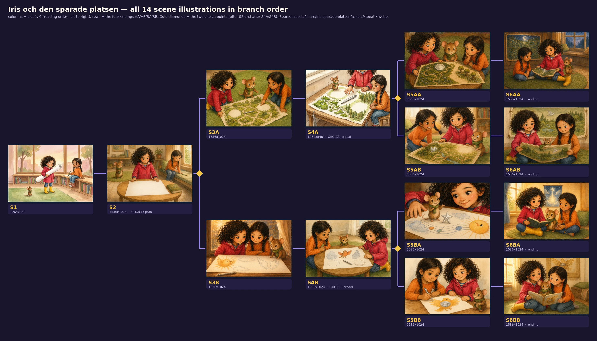
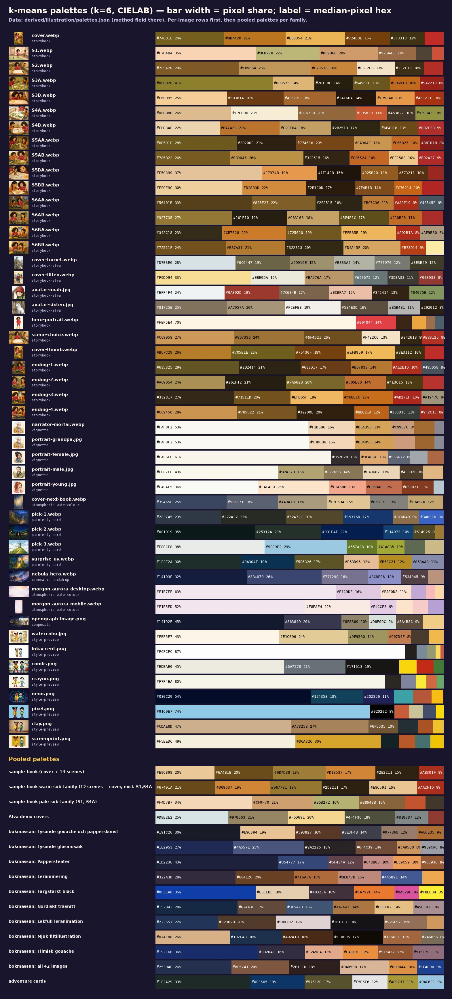
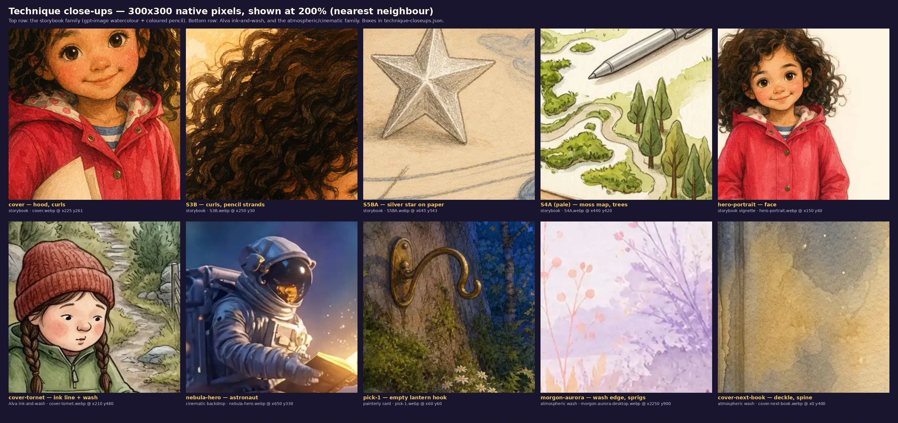
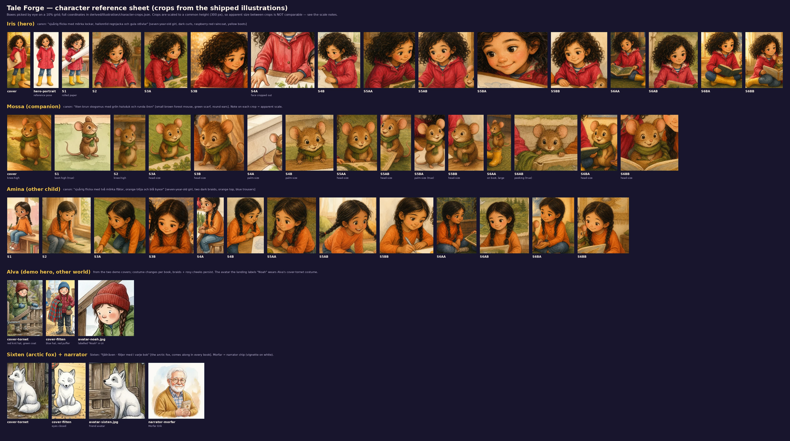
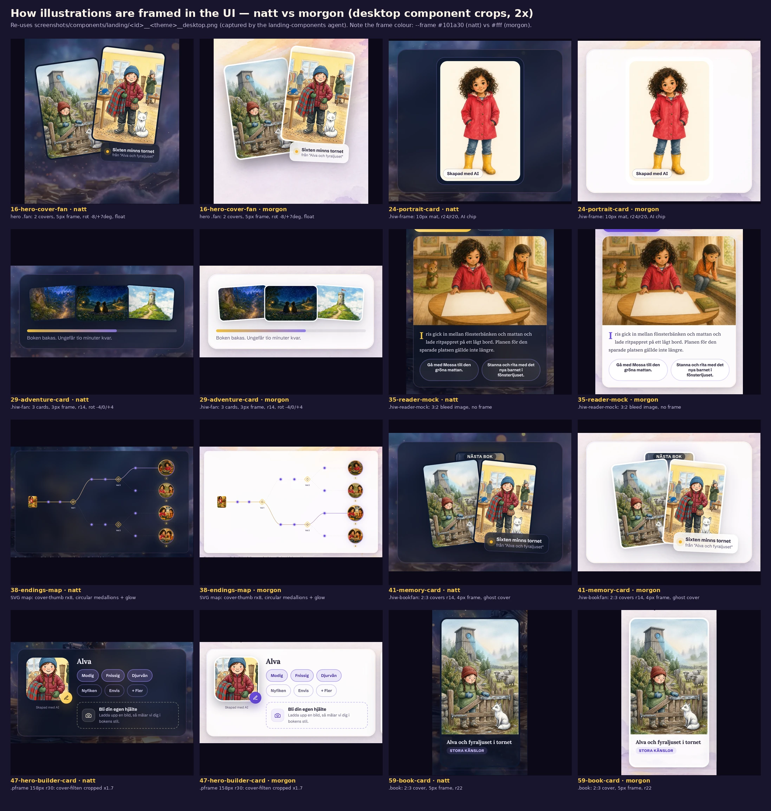
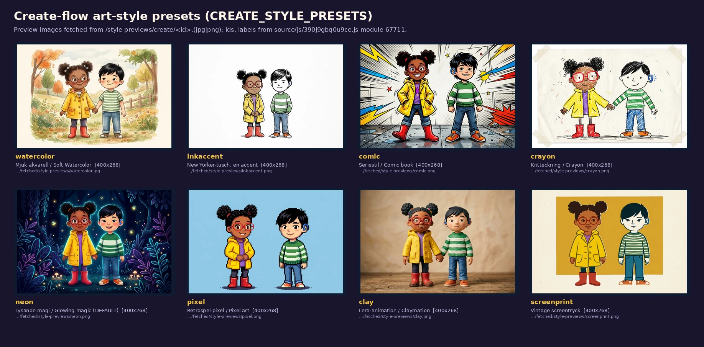

# 07 — Illustration and imagery

Tale Forge sells pictures first. Every book is a set of AI-generated scenes in one warm style: watercolour with coloured pencil, gold evening light, brown pencil line, big-eyed children. All of it comes from a 29-word style line repeated at the end of every image prompt. The site wraps those warm pictures in two very different backdrops: a cool, cinematic nebula at night (*natt*) and an almost-white watercolour dawn in the morning (*morgon*).

This file holds the literal prompts (verbatim, in [../prompts/](../prompts/)), measured palettes and texture metrics for every raster image, contact sheets, a character reference sheet, and the CSS that frames each image in the UI. It ends with a section on how to prompt this style.

Observed facts cite a library path. Judgement is marked **Read:** or kept under an *Interpretation* heading.

## Contents

1. [At a glance](#1-at-a-glance)
2. [Inventory of every raster image](#2-inventory-of-every-raster-image)
3. [The image families, and the storybook-vs-atmosphere contrast](#3-the-image-families-and-the-storybook-vs-atmosphere-contrast)
4. [Medium, technique and line (storybook family)](#4-medium-technique-and-line-storybook-family)
5. [Palette, measured](#5-palette-measured)
6. [Light](#6-light)
7. [Composition, framing and perspective](#7-composition-framing-and-perspective)
8. [Characters: design, faces, consistency](#8-characters-design-faces-consistency)
9. [Setting: Scandinavian cues](#9-setting-scandinavian-cues)
10. [The sample book as an image sequence (all 14 beats)](#10-the-sample-book-as-an-image-sequence-all-14-beats)
11. [The prompt system, literally](#11-the-prompt-system-literally)
12. [How images are framed in the UI (CSS)](#12-how-images-are-framed-in-the-ui-css)
13. [Landing images are crops of the book](#13-landing-images-are-crops-of-the-book)
14. [The other style families: create presets and Bokmässan](#14-the-other-style-families-create-presets-and-bokmässan)
15. [How to prompt this style](#15-how-to-prompt-this-style)
16. [Read: using this in film](#16-read-using-this-in-film)
17. [Files in this dimension](#17-files-in-this-dimension)
18. [Uncertainties and open questions](#18-uncertainties-and-open-questions)

---

## 1. At a glance

| Topic | Observed fact | Source |
|---|---|---|
| Style prompt | `Warm watercolor and colored-pencil children's-book illustration style, soft light, rounded shapes, expressive small gestures. Absolutely no text, no letters, no numbers, no labels, no signage anywhere in the image.` 29 words, 214 characters. It is the last line of all 15 image prompts (14 beats + cover). | [../prompts/style-block.txt](../prompts/style-block.txt); `styleBlock` in [../source/sample-book.iris-och-den-sparade-platsen.json](../source/sample-book.iris-och-den-sparade-platsen.json) |
| Image model | Cover and the two character reference portraits: `azure-images:gpt-image-2`. The cover took 57 340 ms. The 14 beat images record `provider: "existing"`. | `cover`, `portraits`, `beats[].assets.image` in the sample-book JSON |
| Native sizes | 12 scenes are 1536×1024 (3:2). **S1 and S4A are 1264×848.** The cover is 1024×1536 (2:3). The Alva demo covers are 848×1264. | [../derived/illustration/image-metrics.json](../derived/illustration/image-metrics.json) `native_size` |
| Palette | Pooled over cover + 14 scenes (k=6, CIELAB): `#E9C898` 20 %, `#6A4B1B` 20 %, `#9D7D38` 18 %, `#D18537` 17 %, `#2E2211` 15 %, `#AB301F` 8 % | [../derived/illustration/palettes.json](../derived/illustration/palettes.json) → `pooled` |
| Warmth | 72–96 % of each storybook image's pixels are warm-hued (chroma > 10, hue 340°–100°). Cool-hued pixels never exceed 3.9 % (S6AA). | `share_warm_hue`, `share_cool_hue` in image-metrics.json |
| Backdrops | Night: `nebula-hero.webp` (2400×1340), 84 % cool-hued, L\* median 30.8. Morning: `morgon-aurora-desktop.webp` (2560×1440), L\* median 91.7, chroma median 7.0, 61 % paper-white. | image-metrics.json |
| UI framing | Images sit inside solid "frame" borders of 3–5 px, or a 10 px mat, coloured `--frame`: `#101a30` in natt, `#fff` in morgon. Corners are rounded 14–30 px. Covers fan out at −8°/+7°, cards at −4°/0°/+4°. | `source/css/3q17cp_jgfwol.pretty.css:503,552,925-979,2744-2769` |
| Reuse | The landing's scene, cover thumbnail and four ending medallions are downscaled or centre-cropped copies of the sample book's own files (mean absolute difference 3.2–5.0 / 255). | [../derived/illustration/landing-image-derivations.json](../derived/illustration/landing-image-derivations.json) |
| Default style in the create flow | `DEFAULT_CREATE_STYLE_ID = "neon"` ("Lysande magi" [Glowing magic]), not watercolour | `source/js/390j9gbq0u9ce.js @30781`; [../prompts/app-style-strings.md](../prompts/app-style-strings.md) §1 |

---

## 2. Inventory of every raster image

Contact sheets (each shows native aspect, size and file path):

- [../derived/illustration/contact-sheet__scenes-branch-tree.webp](../derived/illustration/contact-sheet__scenes-branch-tree.webp): all 14 scenes laid out as the story tree. Columns are slots 1–6, rows are the endings AA/AB/BA/BB, and gold diamonds mark the two choices.
- [../derived/illustration/contact-sheet__covers.webp](../derived/illustration/contact-sheet__covers.webp): every 2:3 cover.
- [../derived/illustration/contact-sheet__landing-images.webp](../derived/illustration/contact-sheet__landing-images.webp): every other raster on home and /start, with where it is used.
- [../derived/illustration/contact-sheet__create-style-presets.webp](../derived/illustration/contact-sheet__create-style-presets.webp): the 8 art-style previews.
- [../derived/illustration/contact-sheet__bokmassan-stories.webp](../derived/illustration/contact-sheet__bokmassan-stories.webp): the 42 kiosk-story images.



| File | Native px | Family | Where used | Content (observed) |
|---|---|---|---|---|
| [cover.webp](../assets/share/iris-sparade-platsen/assets/cover.webp) | 1024×1536 | storybook | sample-book cover; `/start` gallery | Iris standing full length with a board under her arm; Mossa on the rug pointing; a silver pen on a low round table; bookshelves and a cushioned window bench behind, golden backlight |
| [S1](../assets/share/iris-sparade-platsen/assets/S1.webp) … [S6BB](../assets/share/iris-sparade-platsen/assets/S6BB.webp) (14) | 1536×1024; S1, S4A 1264×848 | storybook | book pages (reader) | see §10 |
| [hero-portrait.webp](../assets/landing/iris/hero-portrait.webp) | 512×768 | storybook vignette | landing step 1 `.hiw-frame` | Iris full length, hands in pockets, on blank cream paper (66 % paper-white) |
| [scene-choice.webp](../assets/landing/iris/scene-choice.webp) | 640×427 | storybook | landing step 4 reader mock | = S2 downscaled |
| [cover-thumb.webp](../assets/landing/iris/cover-thumb.webp) | 128×192 | storybook | endings-map cover (52×68 / 40×52 SVG units) | = cover downscaled 8× |
| [ending-1..4.webp](../assets/landing/iris/ending-1.webp) | 256×256 | storybook | endings-map medallions AA/AB/BA/BB | = centre squares of S6AA/S6AB/S6BA/S6BB |
| [cover-tornet.webp](../assets/assets/cover-tornet.webp) | 848×1264 | Alva ink-and-wash | hero fan, shelf book card, memory bookfan, OG image | Alva (red knit hat, braids, green anorak, mittens) at a wooden gate in a stone wall; white arctic fox; sheep; a wooden tower with a round blue window; misty pines |
| [cover-filten.webp](../assets/assets/cover-filten.webp) | 848×1264 | Alva ink-and-wash | hero fan, shelf, bookfan, builder portrait (cropped), OG image | Alva (blue knit hat, braids, red puffer, green mittens) holding a red-green tartan blanket in a second-hand shop; snow outside; radiator; white fox |
| [cover-next-book.webp](../assets/landing/cover-next-book.webp) | 848×1264 | atmospheric wash | landing step 6 "nästa bok" [next book] ghost cover | blank book cover: navy watercolour wash with a gold glow, tiny 4-point sparkles, deckled edge, darker spine band at left |
| [avatar-noah.jpg](../assets/assets/avatar-noah.jpg) | 256×256 | Alva ink-and-wash | friend rows (36 px, 58 px) | a child in a red cable-knit hat with brown braids and a green zip jacket, under a wooden beam |
| [avatar-sixten.jpg](../assets/assets/avatar-sixten.jpg) | 256×256 | Alva ink-and-wash | friend rows | white arctic fox with a grey eye patch, in profile, before a weathered wooden gate |
| [narrator-morfar.webp](../assets/landing/voice/narrator-morfar.webp) | 256×256 | vignette | voice chip (28 px circle) | grandfather in a mustard cardigan and checked shirt, round glasses, white beard, holding a small book; loose watercolour on white |
| [pick-1.webp](../assets/landing/cards/pick-1.webp) | 800×537 | painterly card | step 3 fan, left | night forest path lit by a golden trail; an empty lantern hook on a tree |
| [pick-2.webp](../assets/landing/cards/pick-2.webp) | 800×537 | painterly card | step 3 fan, centre | two children from behind under a dense starry sky, a lantern between them |
| [pick-3.webp](../assets/landing/cards/pick-3.webp) | 800×537 | painterly card | step 3 fan, right | stone tower with a red pennant on a green hill, white cumulus, daylight |
| [surprise-us.webp](../assets/images/create/surprise-us.webp) | 800×537 | painterly card | /start "Överraska oss" [Surprise us] door | ornate golden door open in a flowering hillside at dusk, a sunlit path seen through it |
| [nebula-hero.webp](../assets/assets/nebula-hero.webp) | 2400×1340 | cinematic backdrop | natt `.bg-night` | an astronaut sitting on stacked old books, reading a glowing book, in violet-blue nebula clouds with golden bokeh |
| [morgon-aurora-desktop.webp](../assets/assets/morgon-aurora-desktop.webp) / [-mobile.webp](../assets/assets/morgon-aurora-mobile.webp) | 2560×1440 / 1440×2560 | atmospheric wash | morgon `.bg-day` | pale watercolour dawn: peach, pink and lilac washes and lavender sprigs at the edges, misty hills at the bottom, empty centre |
| [opengraph-image.png](../assets/brand/opengraph-image.png) | 1200×630 | composite | OG/Twitter | nebula backdrop, logo and gold "Tale Forge" wordmark, the two Alva covers in white frames (covered in [01-brand-identity.md](01-brand-identity.md) §7) |
| narrator portraits ([../derived/brand/narrators/](../derived/brand/narrators/)) | 400×400 | vignette | create-flow voice picker | grandpa, female (Lily), male (Marcus), young (Saga): same vignette treatment as Morfar |
| style previews ([../derived/illustration/fetched/style-previews/](../derived/illustration/fetched/style-previews/)) | 400×268 | style-preview | create-flow "Bildstil" [art style] sheet | §14 |
| Bokmässan pages ([../derived/illustration/fetched/bokmassan/](../derived/illustration/fetched/bokmassan/)) | 1536×1024 / 1376×768 | kiosk stories | `/bokmassan/saga/berattelser/<slug>` | §14 |

All shipped `.webp` files are lossy VP8 with no EXIF, XMP or provenance chunks. The only exception is `tf-logo.webp` (VP8X + alpha). Checked by reading the RIFF chunk list. Storybook scenes weigh 161–364 KB each.

---

## 3. The image families, and the storybook-vs-atmosphere contrast

| Family | Members | Medium (observed) | L\* median | Chroma median | Warm / cool share | Detail (mean abs. Laplacian of L\*) |
|---|---|---|---|---|---|---|
| **Storybook watercolour** (the product) | cover, S1–S6BB (and the landing crops of them) | watercolour washes + coloured-pencil hatching, warm brown line, toned paper | 32.9–73.9 | 26.3–45.2 | 0.72–0.96 / 0–0.039 | 4.79–8.20 |
| **Alva ink-and-wash** (demo world) | cover-tornet, cover-filten, avatars | dark ink outlines, cross-hatching, flat watercolour fills, white paper | 61.8 / 77.1 | 10.6 / 27.5 | 0.27 / 0.69 warm | 10.86 / 9.64 |
| **Vignettes** | narrator portraits, hero-portrait | figure painted on blank white or cream paper | 85.7–96.8 | 7.7–15.5 | — | 3.13–8.02 |
| **Painterly cards** | pick-1..3, surprise-us | glossy digital fantasy painting, fine foliage detail, glow | 14.2–80.3 | 12.2–20.2 | 0.07–0.33 / 0.29–0.41 | 6.60–11.86 |
| **Cinematic backdrop** | nebula-hero | photoreal-leaning digital painting, smooth gradients, bokeh | 30.8 | 23.8 | 0.10 / 0.84 | 2.58 |
| **Atmospheric wash** | morgon-aurora ×2, cover-next-book | wet-in-wet watercolour, blooms, spatter, empty centre | 91.7 / 91.9 / 54.4 | 7.0 / 6.6 / 17.3 | balanced | 1.43 / 1.93 / 6.24 |

All values come from [../derived/illustration/image-metrics.json](../derived/illustration/image-metrics.json), measured at a 1024 px long side. The method is in the file's `method` field. [../derived/illustration/palette-strips.webp](../derived/illustration/palette-strips.webp) shows every image's six-colour palette as share-proportional bars.



### Interpretation: two worlds, one bedtime

- **Read:** the storybook pictures are *indoor, close and warm*. Their highlights are gold (hue 68–95°) and their shadows warm brown (hue 54–81°, chroma 5–24), with no blue anywhere. The night backdrop is the opposite: outer space, cool violet-blue (84 % cool pixels), smooth digital rendering, a lone astronaut. On the natt theme the warm pictures float in glass cards over that cosmos. The effect is lit windows in a night sky, the bedtime-story metaphor the copy also uses (*"Boken bakas"* [the book is baking], *"Lagom tid för tandborstning och pyjamas"* [just enough time for brushing teeth and pyjamas]).
- **Read:** the morning backdrop does the opposite job. It is nearly blank paper (61 % paper-white) with colour only at the edges, like a watercolour block before painting starts. On morgon the same warm pictures sit in white frames on white, like plates in a printed picture book. The theme switch is covered in [06-theming-and-atmosphere.md](06-theming-and-atmosphere.md) ("The two paintings").
- **Read:** the painterly cards are a third register: more saturated, more fantasy and more "concept art" than the storybook scenes. They are not book pages; they are *choices*, and they look like the mood boards for an adventure. The nebula astronaut is the only science-fiction image on the site. Nothing in the products references space, so it reads as a brand metaphor (reading as exploration) rather than as content.

---

## 4. Medium, technique and line (storybook family)

[../derived/illustration/technique-closeups.webp](../derived/illustration/technique-closeups.webp) shows 300×300 native-pixel crops at 200 %, nearest-neighbour. Boxes are in [technique-closeups.json](../derived/illustration/technique-closeups.json).



Observed in the close-ups:

- **Watercolour fields with blooms.** Iris's raincoat (cover, x225 y261) is a mottled red wash with darker pooled edges and lighter lifts, not a flat fill. The "white" drawing paper is painted as a warm cream, never pure white.
- **Coloured-pencil texture on top.** Hair is built from hundreds of individual dark-brown pencil strands (S3B, x250 y30). Cheeks are stippled pink. The silver star in S5BA is rendered in graphite-like hatching, so it reads as a 3D pencil object sitting on the paper.
- **Paper grain.** Mid-tones show a fine, regular tooth (S5BA toned beige paper with visible fibre). The pale S4A shows a smoother white.
- **Line.** Outlines are warm dark brown pencil, thin and slightly broken, never black ink. The darkest decile of each storybook image averages L\* 5–30 with hue 54–81°, a brown and not a neutral black (`shadow_decile_lab`). Compare the Alva covers' crisp dark ink contour with cross-hatching (cover-tornet close-up, x210 y480).
- **Rounded shapes.** Heads, cheeks, buns of hair, the round table, the round braided rug, the sun bird. All follow the prompt's "rounded shapes".
- **Detail level.** The storybook images sit at a mean |Laplacian| of 4.79–8.20. That is busier than the washes (1.43–1.93) but calmer than the ink-and-wash Alva covers (9.64–10.86).

**Read:** this is the generic "gpt-image warm storybook" finish: watercolour and pencil *simulated* evenly over the whole frame, with no unpainted paper showing through inside the picture (paper-white share is 0.000–0.017 in 14 of the 15 storybook images, cover + 14 scenes). Only the pale S4A (0.111) and the hero-portrait vignette (0.657) leave real white paper. A hand-painted book would leave more white paper and vary more between pages.

---

## 5. Palette, measured

Method: k-means++ with k=6 in CIELAB on a 360 px thumbnail, 4 attempts, seed 7. `hex` is the median pixel of each cluster, so it is a colour that really occurs. Full data: [../derived/illustration/palettes.json](../derived/illustration/palettes.json). Per-image metrics: [image-metrics.csv](../derived/illustration/image-metrics.csv).

### 5.1 Pooled palettes

| Group | k=6 palette (hex : share) |
|---|---|
| sample book, cover + 14 scenes | `#E9C898`:20 `#6A4B1B`:20 `#9D7D38`:18 `#D18537`:17 `#2E2211`:15 `#AB301F`:8 |
| warm sub-family (12 scenes + cover, excl. S1, S4A) | `#67491A`:21 `#D08637`:19 `#967731`:18 `#2D2211`:17 `#E8C591`:16 `#AA2F1D`:9 |
| pale sub-family (S1, S4A) | `#F4D7B7`:34 `#CF9F70`:21 `#B5B272`:16 `#88643B`:16 `#C55332`:7 `#41382C`:6 |
| Alva demo covers | `#D8E2E2`:25 `#978663`:21 `#F5D691`:20 `#4F4F3C`:18 `#818887`:12 `#8E3B33`:5 |
| adventure cards (pick-1..3 + surprise) | `#1E2A29`:33 `#0E3565`:19 `#57512D`:17 `#E5E6E6`:12 `#A89737`:11 `#9AC6E1`:9 |
| Bokmässan, all 42 images | `#25304E`:26 `#805741`:20 `#2B1F1D`:18 `#DAB598`:17 `#DD9044`:10 `#1E4090`:9 |

**Read:** the sample-book palette is five browns, ochres and creams plus one red, which is Iris's raincoat. Green appears only as olive or moss (`#9D7D38`, `#8E802B`). The book has almost no blue: only denim, Iris's striped top and the night window in S6AA. Colour-wise, this is a sepia world with a red accent.

### 5.2 Per scene (k=6, share %)

| Beat | Palette | L\* med | C\* med | Highlight (top 10 %) | Shadow (bottom 10 %) |
|---|---|---|---|---|---|
| cover | `#74601E`24 `#BB7420`21 `#EBB354`21 `#72400E`16 `#3F3313`12 `#C22C28`6 | 46.1 | 45.2 | `#F7CA71` | `#392710` |
| S1 | `#F7D4B4`35 `#BCB778`22 `#D09B6B`20 `#976A45`13 `#4E4334`6 `#CD5039`4 | 73.9 | 29.2 | `#FBE7C7` | `#633D2A` |
| S2 | `#7F5A28`29 `#C0965A`25 `#C7853B`16 `#F5E2C6`13 `#3E2F16`10 `#B22E27`7 | 54.1 | 36.9 | `#F5E3C7` | `#3E2815` |
| S3A | `#8E802B`41 `#DDB575`14 `#281F0E`14 `#6A561E`13 `#C0691B`10 `#9A2218`8 | 50.2 | 43.3 | `#E3BF83` | `#23190D` |
| S3B | `#F6CD95`25 `#6B3B14`20 `#A3672E`18 `#24160A`14 `#E79848`13 `#A63211`10 | 48.0 | 37.1 | `#FAD9A3` | `#1D1208` |
| S4A | `#DCBB8D`26 `#F7EDD6`23 `#91673B`20 `#C95830`11 `#453827`10 `#939342`10 | 67.1 | 26.3 | `#FBF5E2` | `#452D1B` |
| S4B | `#EBD3AE`22 `#BA742B`21 `#C29F64`18 `#2B2513`17 `#6B4918`13 `#B02F2B`9 | 54.8 | 32.8 | `#F0D9B5` | `#211B0F` |
| S5AA | `#6D591E`28 `#2D200F`21 `#774616`20 `#CA964E`13 `#C66B25`10 `#881D1B`8 | 36.6 | 38.1 | `#D99E56` | `#1E150B` |
| S5AB | `#785B22`26 `#BB9046`26 `#322515`16 `#C36524`14 `#EEC588`10 `#B02A27`9 | 48.2 | 41.1 | `#EECB94` | `#271C11` |
| S5BA | `#E5C399`37 `#E7974B`19 `#1E140B`15 `#925B20`13 `#573211`10 `#99261F`5 | 63.4 | 28.6 | `#EED0A5` | `#160F08` |
| S5BB | `#EFCE9C`30 `#D28B3D`22 `#2B1C0D`17 `#7E4B1B`14 `#C76214`10 `#B02625`7 | 57.7 | 35.0 | `#F5DBB2` | `#1E140A` |
| S6AA | `#56401B`33 `#805E27`22 `#2B2515`16 `#BC7C36`11 `#AA2E19`9 `#48545E`9 | 32.9 | 29.1 | `#C18545` | `#221B11` |
| S6AB | `#927735`27 `#261F10`19 `#C6A166`18 `#5F4E1C`17 `#C16B25`11 `#A92D2A`7 | 45.8 | 35.9 | `#D7AE76` | `#1C160D` |
| S6BA | `#342C18`23 `#CB7B28`22 `#725620`19 `#EEB65B`19 `#AD2B1A`8 `#AE9B80`8 | 48.3 | 44.0 | `#F7D081` | `#261C10` |
| S6BB | `#72511F`24 `#B37A31`21 `#322813`20 `#D4A45F`20 `#B73D14`9 `#FCEAA6`6 | 47.2 | 39.9 | `#F4D68F` | `#261A0E` |

S6AA is the only scene with a blue-grey cluster (`#48545E`, 9 %), from the night window. It is also the darkest scene (L\* median 32.9).

### 5.3 Signature costume colours

Measured inside the character crops ([character-crops.json](../derived/illustration/character-crops.json)) by hue window. Data: [../derived/illustration/costume-colour-consistency.json](../derived/illustration/costume-colour-consistency.json).

| Garment | Hue range (CIELAB h°) | Chroma | L\* | Darkest / lightest median hex |
|---|---|---|---|---|
| Iris's raincoat ("hallonröd" [raspberry red]) | 27.3–36.3 | 55.0–69.9 | 32.4–51.6 | `#90231E` (S5BA) … `#DF4043` (hero-portrait) |
| Amina's top ("orange tröja" [orange jumper]) | 54.4–64.3 | 52.7–66.6 | 52.2–62.1 | `#C95D19` (S6AA) … `#DC7D35` (S1) |

**Read:** hue holds within about ±5° across all 16 Iris images and all 13 Amina images. What drifts is lightness, which follows each scene's light. "Raspberry" in the prompt actually renders as a tomato-to-crimson red (h ≈ 33°), not a pink-leaning raspberry (which would be h ≈ 0–15°). Mossa's scarf could not be measured this way because it shares the rug's moss-green hue.

---

## 6. Light

- **Key light is warm, low and from a window.** Every brief asks for evening or window light ("evening window light", "warm evening light", "Warm window light falls across all three"). The images deliver gold highlights: the brightest decile averages `#F7CA71` on the cover, `#F7D081` in S6BA and `#FAD9A3` in S3B.
- **No cool fill.** Shadows are warm brown (§5.2). Rim light comes from behind in the cover: a glowing window halo around the curls.
- **Time of day drifts.** S1 shows a pink-peach sunset through the window. The middle scenes are amber interior light. S6AA has a deep blue night window with a crescent moon on the hung map, although the brief says "the broad window bench is empty in evening light". S6BA and S6BB are back to sunny gold.
- **Window position is not locked.** It is behind the characters in S1, to the right in S2/S3B/S6AA, and to the left in S6BA/S6BB.
- **The two pale scenes (S1, S4A)** have a flatter, high-key light: L\* median 73.9 and 67.1 against 32.9–63.4 for the other 13 storybook images. S4A also has the most white paper (11 %).

**Read:** the light is a mood, not a set. That suits single images, but it would show in film as continuity jumps between shots.

---

## 7. Composition, framing and perspective

- **Centred mass.** The L\*-weighted luminance centroid of every storybook scene falls within x 0.47–0.54 and y 0.45–0.60 of the frame (`luminance_centroid_xy`). Figures are placed symmetrically around the drawing paper, which sits low-centre.
- **Camera height.** The briefs ask for "High three-quarter view", "overhead-three-quarter frame", "Tight tabletop frame" and "close view" shots. The images mostly use a slightly high three-quarter view looking down at a table or rug, at a child's eye height or a little above. S4A is the most top-down. There are no low angles, no extreme wides and no Dutch tilts.
- **Two-child "shoulder to shoulder" framing** recurs (S3B, S5AB, S5BB, S6AB, S6BA, S6BB): two faces side by side filling the top half, with the shared paper or book in the bottom half as a horizontal band. This is the book's signature composition.
- **Cropping.** Several images crop heads at the top edge (S3A, S5AB, S5BB). S4A crops Iris's face out entirely. S5BA crops her to a quarter-face at the right edge, as the brief asks ("her smiling face enters at one edge").
- **Depth.** Shallow interior space: a figure plane, a table or rug plane, and a softly painted back wall (bookshelves, window). Background detail is lower but not blurred photographically.
- **No text.** Across the 15 storybook images there are no letters, numbers or signs. The hung pictures and the open books show only drawn shapes. The style line's text ban works here. The Bokmässan family breaks it on purpose (§14).

---

## 8. Characters: design, faces, consistency

The character reference sheet: [../derived/illustration/character-reference-sheet.webp](../derived/illustration/character-reference-sheet.webp). Crop boxes are in [character-crops.json](../derived/illustration/character-crops.json). Crops are scaled to a common height, so apparent size between crops is not comparable.



### 8.1 Canon (verbatim from the book JSON)

| Entity | Look (verbatim) [gloss] | Mannerism (verbatim) [gloss] |
|---|---|---|
| Hero **Iris**, *barnhjälte* [child hero] | "sjuårig flicka med mörka lockar, hallonröd regnjacka och gula stövlar" [seven-year-old girl with dark curls, raspberry-red raincoat and yellow boots] | "lämnar alltid lite plats på sidan när hon ritar med någon annan" [always leaves a little space on the page when she draws with someone else] |
| Companion **Mossa**, *talande skogsmus* [talking forest mouse] | "liten brun skogsmus med grön halsduk och runda öron" [small brown forest mouse with a green scarf and round ears] | "snurrar halsduken ett varv när han tänker" [twirls his scarf one turn when he thinks] |
| Other **Amina**, *barn* [child] | "sjuårig flicka med två mörka flätor, orange tröja och blå byxor" [seven-year-old girl with two dark braids, orange jumper and blue trousers] | "knackar lätt med pekfingret mot pappret när hon får en idé" [taps the paper lightly with her index finger when she gets an idea] |
| Place **kvartersbiblioteket** [the neighbourhood library] | "låga bokhyllor, en bred fönsterbänk och en mjuk grön matta" [low bookshelves, a wide window bench and a soft green rug] | — |
| Object **stort ritpapper** [big drawing paper] | "ett brett vitt ritpapper med plats för flera tecknare" [a wide white drawing paper with room for several artists] | states: slot 1 "tomt under Iris arm" [empty under Iris's arm]; slot 3 "förvandlat till en gemensam bild med öppna ritplatser" [turned into a shared picture with open drawing spots]; slot 5 "färdigt och upphängt med ett enda sista silvertecken" [finished and hung with one single last silver mark] |
| Object **silverpenna** [silver pen] | "en vanlig tjock penna som lämnar blanka silverstreck" [an ordinary thick pen that leaves shiny silver lines] | states: slot 3 "ligger bredvid bilden med en ritningstur kvar" [lies beside the picture with one drawing turn left]; slot 5 "har använts till bildens sista tecken" [has been used for the picture's last mark] |

Source: `canon` in the sample-book JSON, also copied to [../prompts/sample-book-image-canon.json](../prompts/sample-book-image-canon.json).

### 8.2 Iris: observed design

- Big shoulder-length mass of dark-brown, tightly spiralled curls drawn in pencil strands. Warm tan-brown skin. Large dark-brown eyes with one or two white catchlights. Rosy stippled cheeks, a small button nose, thin dark brows and a closed-mouth smile.
- Raspberry or crimson knee-length raincoat with brass snap buttons, two pockets and a hood. Yellow rubber boots. Blue jeans.
- **Two details that are in no prompt but appear in nearly every image:** a pink hood lining with white polka dots, and a blue-and-white striped top under the coat. Both are visible on the cover, the hero portrait and most close scenes (see the Iris row of the sheet).
- **Read:** those unprompted details are strong evidence that the beat images were conditioned on a reference picture (the JSON lists `portraits.hero` → `/share/iris-sparade-platsen/assets/refs/hero.png`, provider `azure-images:gpt-image-2`; it returned 404 when fetched read-only on 2026-10-10). The landing [hero-portrait.webp](../assets/landing/iris/hero-portrait.webp), a full-length figure on blank paper, looks like that reference or a sibling of it. This matches the landing copy: *"Porträttet styr både bilderna och berättelsen."* [The portrait shapes both the pictures and the story.]

### 8.3 Mossa: scale drift is the main consistency failure

- Design is stable: warm brown fur, a pale belly, large round ears with pink insides, a long pink tail, a moss-green knitted scarf and big glossy black eyes.
- **Size is not stable.** By eye against the children (noted under each crop on the sheet), Mossa is boot-high in S1, knee-high on the cover and in S2, and as big as a child's head in S3A, S3B, S5AA, S5AB, S5BB, S6BA and S6BB. He is truly palm-sized only in S4A, S4B, S5BA and S6AB.
- **The prompts show the engine fighting this.** Later briefs add explicit scale clauses: "Palm-sized Mossa, much smaller than Iris's hand" (S4B, S5BA), "Palm-sized Mossa with his green scarf" (S5BB) and "only Mossa's tiny mouse head and two little front paws peek over the page … making his true mouse scale unmistakable" (S6AB). Where the clause is used, scale is mostly correct (S4B, S5BA, S6AB). S5BB is the exception: Mossa is head-size there despite "Palm-sized". See [../prompts/beats/S4B.md](../prompts/beats/S4B.md), [S5BA.md](../prompts/beats/S5BA.md), [S5BB.md](../prompts/beats/S5BB.md), [S6AB.md](../prompts/beats/S6AB.md).
- **Read:** the model treats "companion" as a co-star and sizes him up to share the frame. To emulate the look *and* fix it, give an anchoring comparison in every shot (§15).

### 8.4 Amina

Long dark hair in two braids, a centre parting, warm brown skin, an orange crew-neck jumper and blue jeans. Pink-and-white sneakers in S1. Hue-stable orange (§5.3). Her face shape and eyes are close to Iris's. **Read:** without the hair (curls vs braids) and the coat colour, the two girls would be hard to tell apart. The style has one child face, varied by hair and costume.

### 8.5 Faces and expressions

- One face template across both girls: big round eyes set low in a round face, small nose, small mouth, pink cheeks, about 1:4 head-to-body proportion in full figures (hero-portrait, cover).
- Expressions are gentle and low-amplitude, as the prompt asks ("expressive small gestures"): attentive looks down at the paper, small smiles, one open-mouth grin (Amina in S5AB) and a mild frown of thought (Iris in S1). There are no tears, anger or big theatrical poses, even where the prose says hands "burned" (S4A) or were "hot" (S4B). The tension is carried by hands hovering over the pen, not by faces.

### 8.6 The Alva world (demo covers, avatars)

- **Alva** appears on both demo covers. She has brown braids, round rosy cheeks, dot-like eyes and a round nose, drawn in **ink outline + wash**, a clearly different hand from the Iris book. Her costume changes per book: a red cable-knit hat with a green anorak (*"Alva och fyraljuset i tornet"* [Alva and the Fourth Candle in the Tower]), then a blue knit hat with a red puffer (*"Alva och filten vid elementet"* [Alva and the Blanket by the Radiator]).
- **Sixten**, "fjällräven · följer med i varje bok" [the arctic fox · comes along in every book], is a white arctic fox with a grey eye patch and a bushy tail. He appears on both covers (eyes closed and smiling on cover-filten) and as [avatar-sixten.jpg](../assets/assets/avatar-sixten.jpg).
- **"Noah"**, "bästa kompisen · med i 2 böcker" [best friend · in 2 books]: the image the site uses, [avatar-noah.jpg](../assets/assets/avatar-noah.jpg), shows a child in a red cable-knit hat, brown braids and a green zip jacket. That is the same costume Alva wears on cover-tornet. A coarse search for it inside cover-tornet found no match (best normalised cross-correlation 0.43). **Read:** it is probably a crop from another Alva-world illustration used as a placeholder, so on the landing page "Noah" looks like Alva.
- The landing builder card shows "Alva" with a portrait that is `cover-filten.webp` scaled 1.7× and positioned at `47% 18%` (`source/css/3q17cp_jgfwol.pretty.css:1177-1184`).

### 8.7 Narrator portraits

Five grown-up faces exist (Morfar/Grandpa Erik, Lily, Marcus, Saga). All are loose watercolour vignettes on white, half-length, warm and smiling. They are a cousin of the storybook style but airier, with 37–51 % white paper. See [../derived/brand/narrator-cast.png](../derived/brand/narrator-cast.png) (brand dimension).

---

## 9. Setting: Scandinavian cues

Observed:

- **Iris book (indoors):** a small public library with low pale-wood bookshelves, a broad window bench with moss-green cushions, a round braided rug in moss green (a rag-rug type), a round pine table, potted plants, warm wood floors and big multi-pane windows. Bare deciduous trees outside in S1.
- **Alva covers (outdoors and winter):** a dry-stone wall, a weathered wooden gate with iron strap hinges, sheep, misty pines and a tall wooden tower with a round window (cover-tornet). Then a second-hand shop with clothes rails, a cast-iron radiator, snow falling outside, a wool tartan blanket, knitted hats, mittens and a coffee mug (cover-filten). The title words *fyraljuset* [the fourth candle, i.e. the fourth Advent candle] and *elementet* [the radiator] place both stories in a Swedish winter.
- **Fauna:** a forest mouse (*skogsmus*) and an arctic fox (*fjällräv*), both native Nordic species.

**Read:** the Nordic quality is in *materials and climate* (pine, wool, rain gear, snow, stone walls, Advent) more than in landmarks or flags. The Iris book is the more generic of the two. Without the Swedish words it could be any Northern-European or North-American library. The Alva covers are the more specifically Swedish images on the site.

---

## 10. The sample book as an image sequence (all 14 beats)

Each beat has its own page in [../prompts/beats/](../prompts/beats/) with the verbatim prose, choice data and full illustration brief. The prose is also collected by the copy dimension in [../copy/sample-book-text.sv.md](../copy/sample-book-text.sv.md). The structure is S1 → S2 (choice 1: *path*) → S3A/S3B → S4A/S4B (choice 2: *ordeal*) → S5xx → S6xx (four endings).

| Beat | Path | Shot requested (verbatim opening) | What the image shows (observed) | Deviations from brief |
|---|---|---|---|---|
| [S1](../prompts/beats/S1.md) | trunk | "Wide establishing frame in kvartersbiblioteket." | Iris standing with a **rolled** paper tube, Amina on the window bench with a green pen, tiny Mossa on the rug; pink sunset window | paper rolled, not "under her arm"; pale palette, 1264×848 |
| [S2](../prompts/beats/S2.md) | trunk, choice 1 | "Pre-choice. A balanced overhead-three-quarter frame at the low table…" | Iris at a round table, hands on the blank sheet; Mossa standing on the rug at left; Amina drawing on the bench; a green book on the table | camera closer to eye level than "overhead"; Amina draws rather than taps |
| [S3A](../prompts/beats/S3A.md) | A | "High three-quarter view on the green rug." | three around the moss map on the rug; two blank ovals; the silver pen between them | Mossa head-size |
| [S3B](../prompts/beats/S3B.md) | B | "Intimate window-bench frame in warm evening light." | Iris and Amina shoulder to shoulder over the sun bird, clouds and wings; Mossa at right; pen at lower left | Mossa head-size |
| [S4A](../prompts/beats/S4A.md) | A, choice 2 | "Pre-choice. Tight tabletop frame at the low table by the wall." | near top-down on the map; Iris's torso and hands (face out of frame); small Mossa on the table; Amina on a stool; clips at the table edge | pale palette, 1264×848; Iris's face cropped |
| [S4B](../prompts/beats/S4B.md) | B, choice 2 | "Pre-choice tight three-quarter view of the low table." | Amina left, Iris right, palm-size Mossa behind the table; a **coloured orange bird** in the centre of the drawing; pen at lower right | the "round sun bird" redrawn as an orange robin |
| [S5AA](../prompts/beats/S5AA.md) | A→A | "Settled result, close view of the finished mosskarta on the low table." | the moss map with a silver full moon; Mossa large between the girls; Amina chin-in-hand | Mossa head-size |
| [S5AB](../prompts/beats/S5AB.md) | A→B | "Settled result, close view of the finished mosskarta." | a silver dove on the map; Amina grinning, braids swinging; Iris's hands on the edge | — |
| [S5BA](../prompts/beats/S5BA.md) | B→A | "Settled result in a tight tabletop crop." | palm-size Mossa standing on the paper by a 3D silver star; Iris's hand and quarter-face at right; sun with a face; added coloured planets on a line | added planets |
| [S5BB](../prompts/beats/S5BB.md) | B→B | "Settled result in a tight two-child tabletop crop." | Amina drawing with the pen; a silver nest inside a yellow bird's wings; Mossa at right | Mossa head-size despite "Palm-sized" |
| [S6AA](../prompts/beats/S6AA.md) | ending AA | "Final wide return image during sagostunden." | the three on the rug with an open book; Mossa standing on Iris's yellow boot; the hung map with a **crescent** moon; night-blue window | night instead of evening; crescent instead of round moon |
| [S6AB](../prompts/beats/S6AB.md) | ending AB | "Final warm medium close-up on the green rug." | girls shoulder to shoulder holding a map-like open book; Mossa's head and paws peeking over the page; the hung landscape with a silver dove | — (scale correct) |
| [S6BA](../prompts/beats/S6BA.md) | ending BA | "Final warm window-side sagostund frame." | girls with a green book; Mossa between them; the hung blue banner with a radiant star | Mossa head-size; cupped-hands nest not legible |
| [S6BB](../prompts/beats/S6BB.md) | ending BB | "Final close return image at the edge of the green rug." | girls with an open book; Mossa between them; above, a golden bird with a nest | Mossa between, not "on Iris’s knee" |

**Drawn-object drift:** the "solfågel" [sun bird] that Iris draws is a yellow sun with a beak in S3B, an orange robin in S4B, a smiling sun in S5BA and a yellow bird with spread wings in S5BB and S6BB. The moss map stays recognisable. **Read:** prompts name these drawn objects ("Iris's round sun bird") but never describe them, so each render re-invents them. Any emulation should fix a one-line visual description for every drawn or diegetic object.

**Mid-book image provenance:** all 14 beats say `provider: "existing"` (reused renders). The `storyId` is `causal-e2e-DC-KERNEL-SV-18-MEDIA`, which looks like a test-harness name. S1 and S4A differ from the other 12 in size (1264×848), lightness and line crispness. **Read:** those two probably come from a different render run or model setting than the rest. Note that the reader's image box is `aspect-ratio: 1264/848` (`source/css/3q17cp_jgfwol.pretty.css:1765-1769`), so the CSS was laid out around the 1264×848 output size.

---

## 11. The prompt system, literally

Files: [../prompts/style-block.txt](../prompts/style-block.txt), [../prompts/cover-brief.txt](../prompts/cover-brief.txt), [../prompts/beats/](../prompts/beats/) (14 files), [../prompts/sample-book-image-canon.json](../prompts/sample-book-image-canon.json), [../prompts/app-style-strings.md](../prompts/app-style-strings.md). An index is in [../prompts/README.md](../prompts/README.md).

### 11.1 The style block (verbatim)

```text
Warm watercolor and colored-pencil children's-book illustration style, soft light, rounded shapes, expressive small gestures. Absolutely no text, no letters, no numbers, no labels, no signage anywhere in the image.
```

Its five positive cues are: medium (*watercolor and colored-pencil*), genre (*children's-book illustration*), light (*soft light*), form (*rounded shapes*) and acting (*expressive small gestures*). It has one negative cue, repeated five ways (text, letters, numbers, labels, signage).

### 11.2 The cover brief (verbatim)

```text
Wordless portrait 2:3 book cover in warm evening light at kvartersbiblioteket. Iris, a seven-year-old girl with dark curls, a raspberry-red raincoat, and yellow boots, stands decisively between the broad window bench and the soft green rug, holding exactly one stort ritpapper under her arm. Mossa, a small brown forest mouse with round ears and a green scarf, points toward the rug from Iris's yellow boot. On a low table between them lies exactly one silverpenna, catching the window light. Low bookcases frame the scene; no typography.

Appearance reference for entities already named in the shot above. Never add a character, object, flower, or prop merely because it is listed here:
Hero Iris, barnhjälte: sjuårig flicka med mörka lockar, hallonröd regnjacka och gula stövlar
Companion Mossa, talande skogsmus: liten brun skogsmus med grön halsduk och runda öron
Place kvartersbiblioteket: låga bokhyllor, en bred fönsterbänk och en mjuk grön matta
Object stort ritpapper: ett brett vitt ritpapper med plats för flera tecknare
Object silverpenna: en vanlig tjock penna som lämnar blanka silverstreck

Style: Warm watercolor and colored-pencil children's-book illustration style, soft light, rounded shapes, expressive small gestures. Absolutely no text, no letters, no numbers, no labels, no signage anywhere in the image.
```

The cover is the only prompt that restates the character looks in English inside the shot paragraph. Its shot paragraph is 86 words. Observed result: "from Iris's yellow boot" was not followed (Mossa stands on the rug beside her), and "exactly one silverpenna" was.

### 11.3 Anatomy of every beat brief (observed invariants)

Checked programmatically over all 15 prompts:

1. **Shot paragraph** of 55–72 words and 3–5 sentences in the 14 beats (the cover's is 86 words). The first words are a *phase tag* plus a *shot type*: "Pre-choice." (S2, S4A, S4B), "Settled result" (S5xx) or "Final … return image" / "Final warm …" (S6xx), followed by "Wide establishing frame", "High three-quarter view", "Tight tabletop frame", "close view", "medium close-up" and so on.
2. A blank line, then the **fixed header** (identical in all 15): `Appearance reference for entities already named in the shot above. Never add a character, object, flower, or prop merely because it is listed here:`
3. One line per entity *present in this shot*, in the order Hero, Companion, Other, Place, Object. Format: `<Role> <Name>, <kind>: <look>`, with the look in **Swedish** even though the rest of the prompt is English. S5BA lists only Hero and Companion because Amina is not in that shot.
4. A blank line, then `Style: ` + the style block. This tail is identical in all 15.

Control vocabulary that recurs in the shot paragraphs (counts over 15 prompts): *clearly* ×6, *remain(s)* ×6, *exactly* ×4, *unmarked* ×3, *visibly* ×3, *empty* ×3, *Palm-sized* ×3, *untouched* ×2, *much smaller than* ×2, *plainly* ×1, *no one touching* ×1, *true mouse scale* ×1. The cover adds *Wordless* and *no typography*.

**Read:** the prompts are written for state-tracking, not beauty. They spend their words on which spaces are blank, how many pens there are and who touches what, because the branching story depends on those facts being legible. All of the *look* comes from the one style line plus the reference portrait.

---

## 12. How images are framed in the UI (CSS)

Visual summary: [../derived/illustration/ui-image-framing-sheet.webp](../derived/illustration/ui-image-framing-sheet.webp), built from the landing-component crops in [../screenshots/components/landing/](../screenshots/components/landing/), natt vs morgon.



### 12.1 The frame token

```css
/* source/css/3q17cp_jgfwol.pretty.css:503-504 — body[data-theme="natt"] */
  --frame: #101a30;
  --frame-line: #9b87f566;
/* :552-553 — body[data-theme="morgon"] */
  --frame: #fff;
  --frame-line: #ffffffe6;
/* :536 natt / :585 morgon */
  --card-shadow: 0 18px 44px #0508146b;
  --card-shadow: 0 4px 12px #241f351a, 0 22px 52px #241f3529;
```

So "white frame borders" exist only in morgon. In natt the same border is a near-black navy that reads as a dark mount.

### 12.2 Every image treatment

| Element | Image | Frame | Radius | Rotation / motion | Shadow | CSS |
|---|---|---|---|---|---|---|
| Hero cover fan `.fan .fbook` | cover-tornet (`.fb1`), cover-filten (`.fb2`) on home; swapped on /start | `5px solid var(--frame)` | 20px | `.fb1` rotate(−8deg), `.fb2` rotate(7deg); float 7 s / 8 s, ±0.6° and −12/−16 px | `0 24px 50px #0a072066, 0 0 44px #f5c5421f` (gold halo) | `3q17cp_jgfwol.pretty.css:925-979` |
| Portrait card `.hiw-frame` | hero-portrait | `background: var(--frame)`, `1px solid var(--frame-line)`, **10px padding mat** | 24px outer / 20px image | — | — | `:2671-2683`; AI chip `:2684-2698` |
| Adventure fan `.hiw-fan-card` | pick-1..3 | `3px solid var(--frame)` | 14px | −4deg/+10 % x, 0, +4deg/−10 % x; centre card 36 % wide vs 34 % | `var(--card-shadow)` | `:2744-2769` |
| Reader mock `.hiw-reader-mock > img` | scene-choice | none (full bleed, top of a glass card) | card radius | — | — | `:2853-2862` |
| Memory bookfan `.hiw-cover` | cover-tornet, cover-filten, cover-next-book (ghost) | `4px solid var(--frame)` | 14px | −7deg / +6deg; ghost cover at 0.85 opacity with `drop-shadow(0 0 22px var(--map-glow))` | `var(--card-shadow)` | `:3039-3071` |
| Endings map | cover-thumb (rx 8), ending-1..4 in circles | SVG ring `r` 44 (desktop) / 34 (mobile) around image `r` 42 / 32, stroke = gradient `#f5c542 → #6D4FE0`, 2px (3px active) | circle | active `scale(1.05)`, others dimmed to 0.55 | `drop-shadow(0 0 18px var(--map-glow))` (`#f5c54240` natt, `#6d4fe033` morgon) | `:2977-2996`; geometry in `derived/story/js-excerpts/landing-explainer…pretty.js:184-187, 235-242, 246-248, 292-299, 334-342` |
| Voice chip `.hiw-voice-chip img` | narrator-morfar | none | 50 % (28 px circle) | — | — | `:2847-2852` |
| Friend rows `.hiw-friend-row img` | avatars | none | 50 % (36 px) | — | — | `:2709-2715` |
| Friends card `.friend .avatar` | avatars | `3px solid var(--frame)` | 18px (58 px squircle) | — | `0 10px 22px #0a072040` | `:1301-1316` |
| Builder portrait `.builder-pic .pframe` | cover-filten, `scale(1.7)`, `object-position: 47% 18%` | `4px solid var(--frame)` | 30px (158 px) | — | `0 16px 36px #0a07204d` | `:1162-1184` |
| Shelf book `.book` | cover-tornet, cover-filten | `5px solid var(--frame)` | 22px | hover `translateY(-10px) rotate(-1deg)` | `var(--card-shadow)` | `:1485-1509` |
| /start gallery `.gbook` | sample cover + Alva covers | `4px solid var(--frame)` | 16px | — | `var(--card-shadow)` | `2_gt301v4m-60.pretty.css:24-36` |
| /start door art `.cs-door-art` | cards/generated/*, surprise-us (`object-position: center 55%`) | none; 120 px tall band (140 px ≤ 520 px) | card radius | — | — | `2h1wwdz1nvxwk.pretty.css:363-373, 458-463, 580-588` |
| World-band portrait `.cs-portrait` | painted hero | `1px solid var(--card-line)` on a gradient | 26px (110 px) | — | `0 6px 22px #0000002e` | `2h1wwdz1nvxwk.pretty.css:14-29` |
| World-band friend coins `.cs-coin` | friend portraits | `2px solid var(--card-line)`, overlapping by −9 px | 999px | — | — | `2h1wwdz1nvxwk.pretty.css:114-134` |
| Reader page `.reader-img` | every book picture | none | — | `aspect-ratio: 1264/848` (16/9 at ≤ 560 px); `.art-bg` copy `blur(26px) saturate(1.08)`, `opacity 0.9`, `scale(1.18)` behind `.art-main` `object-fit: contain` | — | `3q17cp_jgfwol.pretty.css:1761-1800`; ≤ 560 px `:2286, 2301-2308` |
| Reader cover `.reader-img--cover` | cover | — | — | `aspect-ratio: 848/1264` | — | `:1776-1778` |
| Night backdrop `.bg-night img` | nebula-hero | — | — | `object-position: center 30%`, scrim `linear-gradient(#0b0f1e61 0%, #0b0f1e80 45%, #0d1122bd 100%)` | — | `:623-635` (see [06-theming-and-atmosphere.md](06-theming-and-atmosphere.md)) |

Key CSS, verbatim:

```css
/* source/css/3q17cp_jgfwol.pretty.css:929-961 */
.fan .fbook {
  border: 5px solid var(--frame);
  border-radius: 20px;
  width: min(46%, 240px);
  transition:
    transform 0.5s cubic-bezier(0.2, 0.7, 0.3, 1.2),
    border-color 0.5s;
  position: absolute;
  overflow: hidden;
  box-shadow:
    0 24px 50px #0a072066,
    0 0 44px #f5c5421f;
}
.fan .fbook img {
  aspect-ratio: 2/3;
  object-fit: cover;
  width: 100%;
  display: block;
}
.fb1 {
  z-index: 1;
  animation: 7s ease-in-out infinite float1;
  top: 10%;
  left: 6%;
  transform: rotate(-8deg);
}
.fb2 {
  z-index: 2;
  animation: 8s ease-in-out infinite float2;
  top: 2%;
  right: 8%;
  transform: rotate(7deg);
}
```

```css
/* source/css/3q17cp_jgfwol.pretty.css:1784-1800 — the reader's two-layer picture */
.reader-img .art-bg {
  object-fit: cover;
  filter: blur(26px) saturate(1.08);
  opacity: 0.9;
  width: 100%;
  height: 100%;
  position: absolute;
  inset: 0;
  transform: scale(1.18);
}
.reader-img .art-main {
  object-fit: contain;
  width: 100%;
  height: 100%;
  position: absolute;
  inset: 0;
}
```

**Read:** the framing system has three moves:

- **The mount.** A solid border in the theme's frame colour treats every picture as a physical print or book.
- **The tilt.** Small rotations (±4–8°) make a hand-dealt fan.
- **The glow.** Gold or violet halos and drop-shadows make the pictures feel lit.

Book pictures are never shown unframed on the marketing pages, except in the reader mock, which imitates a book page. Only the backdrops run full bleed. The reader itself never crops a picture: it letterboxes it with a blurred, saturated copy of itself (`contain` over `cover`), which suits 3:2, 2:3 and 1264×848 alike.

---

## 13. Landing images are crops of the book

Verified by resizing the source (or its centre square) to the landing file's size and comparing. Data: [../derived/illustration/landing-image-derivations.json](../derived/illustration/landing-image-derivations.json).

| Landing file | Source | Crop | Scale | Mean abs. diff (0–255) | NCC (luma) | MAD if crop shifted ±64 px |
|---|---|---|---|---|---|---|
| scene-choice.webp 640×427 | S2.webp 1536×1024 | full | 2.4× | 3.16 | 0.9979 | — |
| cover-thumb.webp 128×192 | cover.webp 1024×1536 | full | 8× | 5.00 | 0.9964 | — |
| ending-1.webp 256×256 | S6AA.webp | x 256–1280, y 0–1024 | 4× | 4.61 | 0.9935 | 28.4 / 27.8 |
| ending-2.webp | S6AB.webp | same | 4× | 4.11 | 0.9965 | 32.4 / 33.1 |
| ending-3.webp | S6BA.webp | same | 4× | 4.62 | 0.9976 | 37.3 / 36.9 |
| ending-4.webp | S6BB.webp | same | 4× | 4.09 | 0.9970 | 35.4 / 33.9 |

pick-1..3 are byte-identical (same MD5) to `/cards/generated/{lost-lantern,starry-friendship,tower-clouds}-v1.webp` (fetched read-only for comparison; not stored). The landing therefore shows only real product output, never mock-ups. **Read:** the landing pictures are the product's own output, which makes the marketing honest, a point the copy makes repeatedly (*"Alla fyra finns på riktigt."* [All four really exist.]).

---

## 14. The other style families: create presets and Bokmässan

### 14.1 Eight create-flow presets

[../derived/illustration/contact-sheet__create-style-presets.webp](../derived/illustration/contact-sheet__create-style-presets.webp). Literal data is in [../prompts/app-style-strings.md](../prompts/app-style-strings.md) §1.



The *"Bildstil"* [art style] sheet in /start shows the eight presets as 2×4 tiles. In the captured state the *"Lysande magi"* tile carries the *"Vald"* [Selected] badge ([../screenshots/components/app/start-s6-sheet-style--panel__natt__desktop.webp](../screenshots/components/app/start-s6-sheet-style--panel__natt__desktop.webp)), which matches `DEFAULT_CREATE_STYLE_ID = "neon"`. All previews show the same two diverse children (glasses, puffs, a hearing aid, a yellow raincoat). **Read:** the product is style-agnostic, and watercolour is one option among eight. The *brand* look is still watercolour, because every marketing image uses it and the sample book uses it.

### 14.2 Bokmässan kiosk stories

[../derived/illustration/contact-sheet__bokmassan-stories.webp](../derived/illustration/contact-sheet__bokmassan-stories.webp). Data: [../derived/illustration/fetched/bokmassan/stories-image-meta.json](../derived/illustration/fetched/bokmassan/stories-image-meta.json). Style labels are in [../prompts/app-style-strings.md](../prompts/app-style-strings.md) §9.

Nine short branching stories for a book-fair booth. Each has its own declared style (gouache and paper art, glass mosaic, paper theatre, two clay styles, vivid ink, Nordic woodcut, felt, cinematic gouache). Observed shared traits:

- dark navy-blue grounds (pooled `#25304E` 26 %, `#1E4090` 9 %)
- string lights and a lilac tent repeated across stories (the booth's real props)
- 1536×1024 or 1376×768 frames
- **letters inside the image on purpose** in the puzzle story (*"V Ä N"* on the floor) and a sign reading *"STÄNGD"* [Closed] in *Nattåget*

These stories star the fair staff and visitors, described by clothing in the alt text. **Read:** this family shows the same engine pushed toward event-specific, night-blue, multi-style output. It is useful as evidence of the pipeline's range, not as the house style.

---

## 15. How to prompt this style

Built from the literal prompts in §11. The house template keeps the engine's three-part structure and adds what the images show but the prompts never say. Lines marked *(added)* are our additions.

### 15.1 Template

```text
<PHASE>. <SHOT TYPE> <WHERE>. <Who is where, doing what — name every figure; give counts with "exactly">. <State of every prop that matters: what is drawn, what is "plainly unmarked">. <One small gesture that carries the emotion>. <Light: warm evening/window light from <side>>.
<(added) Scale anchor for any small companion: "<Name> is palm-sized, much smaller than <Hero>'s hand.">

Appearance reference for entities already named in the shot above. Never add a character, object, flower, or prop merely because it is listed here:
Hero <Name>, <kind>: <look>
Companion <Name>, <kind>: <look>
Other <Name>, <kind>: <look>
Place <name>: <look>
Object <name>: <look>

Style: Warm watercolor and colored-pencil children's-book illustration style, soft light, rounded shapes, expressive small gestures. Absolutely no text, no letters, no numbers, no labels, no signage anywhere in the image.
```

Vocabulary taken verbatim from the 15 prompts:

- **Phase tags:** "Pre-choice.", "Settled result", "Final … return image"
- **Shot types:** "Wide establishing frame"; "balanced overhead-three-quarter frame"; "High three-quarter view"; "Intimate window-bench frame"; "Tight tabletop frame"; "tight three-quarter view"; "close view"; "tight tabletop crop"; "tight two-child tabletop crop"; "Final wide return image"; "Final warm medium close-up"; "window-side … frame"; "Final close return image"
- **Controls:** "exactly one", "exactly two blank drawing spaces", "remains plainly unmarked", "untouched", "no one touching the pen", "clearly visible", "Palm-sized … much smaller than Iris's hand", "making his true mouse scale unmistakable"

### 15.2 Style amplifiers (added, from the measured images)

To reproduce the *look* and not just the prompt, add to the style line or the reference image:

- "dark-brown coloured-pencil outlines and hatching over soft watercolour washes on warm cream paper with visible tooth; no black ink"
- "golden evening window light, warm brown shadows, no blue fill; palette of ochre, amber, cream, moss green and one accent red"
- "big dark round eyes with a white catchlight, stippled rosy cheeks, small nose, gentle closed-mouth smiles"
- "low, rounded wooden furniture, braided moss-green rug, pine shelves"
- Target numbers (§5): L\* median about 45–55; chroma median 30–45; at least 85 % warm-hued pixels; highlights around `#F5D6A0`; shadows around `#2B1E10`.

### 15.3 Consistency kit (lessons from §8 and §10)

1. Generate a **full-length hero portrait on blank paper first** (like [hero-portrait.webp](../assets/landing/iris/hero-portrait.webp)) and pass it as an image reference to every shot. The unprompted polka-dot hood and striped top show the engine relies on this.
2. Write the costume **in the language of the prompt**. The engine mixes English shots with Swedish looks, and that works with gpt-image-2, but a single language is safer elsewhere.
3. Give every **drawn or diegetic object** a fixed visual description (the "sun bird" drifted four ways).
4. Lock the **set**: name the window side and the time of day in every shot (§6).
5. Put a **scale anchor** in every shot with a small companion.

### 15.4 Worked example (constructed by us, not from the site)

```text
Settled result in a warm medium close-up at the window bench. Iris sits with the finished moss map across her knees, both hands flat on its edges; a single round silver moon shines above the winding paths, the space beside the trees remains plainly unmarked. Mossa is palm-sized, much smaller than Iris's hand, and stands on the map's top edge twisting his green scarf once. Golden evening window light comes from the left.

Appearance reference for entities already named in the shot above. Never add a character, object, flower, or prop merely because it is listed here:
Hero Iris, child hero: seven-year-old girl with dark curls, raspberry-red raincoat with a pink polka-dot hood lining over a blue-and-white striped top, blue jeans and yellow boots
Companion Mossa, talking forest mouse: small brown forest mouse with a green knitted scarf and round ears
Object moss map: a wide sheet of cream drawing paper with green moss islands, winding pale paths and small pine trees

Style: Warm watercolor and colored-pencil children's-book illustration style, soft light, rounded shapes, expressive small gestures. Absolutely no text, no letters, no numbers, no labels, no signage anywhere in the image.
```

### 15.5 The other families (constructed descriptions; no source prompts exist)

- **Alva ink-and-wash:** "contemporary Nordic picture-book illustration, fine dark ink outlines with light cross-hatching, transparent watercolour washes on white paper, muted grey-green and ochre, small dot eyes and round rosy cheeks, overcast daylight."
- **Night backdrop:** "cinematic digital painting, an astronaut sitting on a hill of stacked old books reading a glowing book, drifting violet-blue nebula clouds, golden bokeh specks, deep navy shadows, wide 16:9 with the subject left of centre and open space on the right."
- **Morning backdrop:** "pale watercolour sky on white paper, peach, pink and lilac washes and lavender sprigs only at the edges, misty hills along the bottom, a large empty centre for text."
- **Adventure cards:** "glowing fantasy landscape painting, high detail foliage, dusk or night blues with warm lantern gold, a single story hook (an empty lantern hook, a lone tower, a door standing open)."

---

## 16. Read: using this in film

- **Two-layer plates.** The site already treats every picture as a mounted print over an atmosphere. For film, separate the warm storybook plates from the cool backdrop: drift or float the plate (the CSS float is ±0.6° and −12/−16 px over 7–8 s, `:962-979`) in front of a slowly moving nebula or a blooming wash.
- **Letterbox like the reader.** The reader's blurred-copy fill (`blur(26px) saturate(1.08)`, `scale(1.18)`) is a ready-made way to put 3:2 storybook frames into 16:9 or 9:16 without cropping faces.
- **Push-ins work best on the shoulder-to-shoulder compositions** (§7). The faces sit in the top half and the shared object in the lower half: a slow tilt from object to faces tells each beat.
- **Watch continuity.** Expect jumps in window side, time of day and Mossa's size between consecutive scenes. Either regenerate with the §15.3 kit or cut so the jumps fall at choice points.
- **The unveil.** In /start the hero portrait is revealed from a blurred dark veil to sharp over about 3.8 s ([../screenshots/components/app/start-s4-unveil-strip__natt__desktop.png](../screenshots/components/app/start-s4-unveil-strip__natt__desktop.png)). This is a strong on-brand reveal for a film title or a "your hero" moment. The timing belongs to the motion dimension.

---

## 17. Files in this dimension

**Prompts (literal, verbatim):**

| File | What it holds |
|---|---|
| [../prompts/README.md](../prompts/README.md) | index of the prompts folder |
| [../prompts/style-block.txt](../prompts/style-block.txt) | the style prompt |
| [../prompts/cover-brief.txt](../prompts/cover-brief.txt) | the cover prompt |
| [../prompts/beats/S1.md](../prompts/beats/S1.md) … [S6BB.md](../prompts/beats/S6BB.md) | 14 beat pages: metadata table, image, verbatim prose with English summary, verbatim choice data with glosses, verbatim illustration brief, anatomy |
| [../prompts/sample-book-image-canon.json](../prompts/sample-book-image-canon.json) | verbatim subset of the book JSON: canon, styleBlock, portraits, cover, throughline |
| [../prompts/app-style-strings.md](../prompts/app-style-strings.md) | every style, look and painting string in the client JS, with offsets |

**Derived (derived/illustration/):**

| File | What it shows |
|---|---|
| [contact-sheet__scenes-branch-tree.webp](../derived/illustration/contact-sheet__scenes-branch-tree.webp) | 14 scenes as the story tree, labelled with beat id, size and choice kind |
| [contact-sheet__covers.webp](../derived/illustration/contact-sheet__covers.webp) | 5 cover-format images |
| [contact-sheet__landing-images.webp](../derived/illustration/contact-sheet__landing-images.webp) | 18 landing and /start rasters with usage |
| [contact-sheet__create-style-presets.webp](../derived/illustration/contact-sheet__create-style-presets.webp) | 8 style previews with sv/en labels |
| [contact-sheet__bokmassan-stories.webp](../derived/illustration/contact-sheet__bokmassan-stories.webp) | 42 kiosk-story images labelled story · page · style |
| [character-reference-sheet.webp](../derived/illustration/character-reference-sheet.webp) + [character-crops.json](../derived/illustration/character-crops.json) | crops of Iris (16), Mossa (15), Amina (13), Alva (3), Sixten (3) and Morfar (1), with scale notes |
| [technique-closeups.webp](../derived/illustration/technique-closeups.webp) + [technique-closeups.json](../derived/illustration/technique-closeups.json) | 10 native-pixel crops at 200 % showing medium and texture per family |
| [palette-strips.webp](../derived/illustration/palette-strips.webp) | k=6 palettes for every image plus pooled palettes, as share bars |
| [ui-image-framing-sheet.webp](../derived/illustration/ui-image-framing-sheet.webp) | 8 framing treatments, natt vs morgon |
| [palettes.json](../derived/illustration/palettes.json) | k-means palettes per image and pooled (method inside) |
| [image-metrics.json](../derived/illustration/image-metrics.json) / [.csv](../derived/illustration/image-metrics.csv) | lightness, chroma, warm/cool share, paper-white, ink-dark, highlight and shadow colour, luminance centroid, detail and edge density |
| [costume-colour-consistency.json](../derived/illustration/costume-colour-consistency.json) | raincoat and orange-top colours per image |
| [landing-image-derivations.json](../derived/illustration/landing-image-derivations.json) | proof that the landing images are crops of the book |
| [fetched/style-previews/](../derived/illustration/fetched/style-previews/) | 8 preview images from `/style-previews/create/` |
| [fetched/bokmassan/](../derived/illustration/fetched/bokmassan/) | 42 kiosk images + `stories-image-meta.json` |

Scripts that produced these live in the session scratchpad (`tools/illustration/`), not in the library.

---

## 18. Uncertainties and open questions

- **Image provenance.** All beat images say `provider: "existing"`, and the book id looks like a test fixture. Which model or run made S1 and S4A (the pale 1264×848 pair) is unknown.
- **Reference conditioning** is inferred, not proven: `refs/hero.png` and `refs/companion.png` return 404 (read-only GET, 2026-10-10).
- **Default style "neon"** is read from client code and the captured style sheet. The server could still override per age ("Överraska oss" says style is chosen by age).
- **Character crop boxes and Mossa's scale classes** are by eye (±3 % of frame).
- **Texture metrics** (Laplacian, edge density) are measured on lossy WebP/JPEG, so compression adds a little detail. Small images (256 px avatars) are measured at native size and are not comparable with 1024 px measurements.
- **"Noah"**: the avatar's identity (a placeholder Alva crop or a real Noah design) cannot be resolved from public material.
- **Alva covers' provider** is not recorded anywhere public.
- **Bokmässan stories** depict booth staff by clothing and first name in alt text. They are kept here only as fetched data for style range, not as house style.
