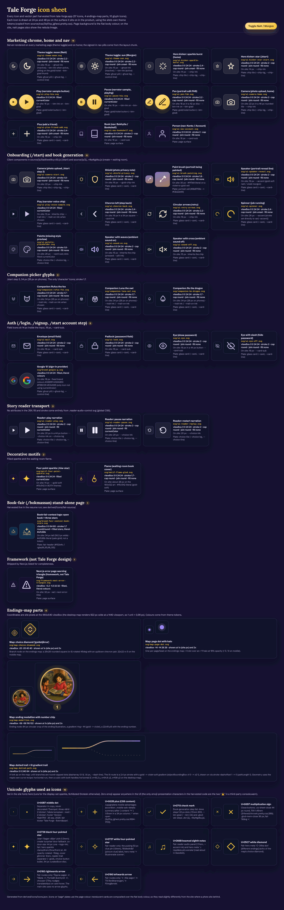
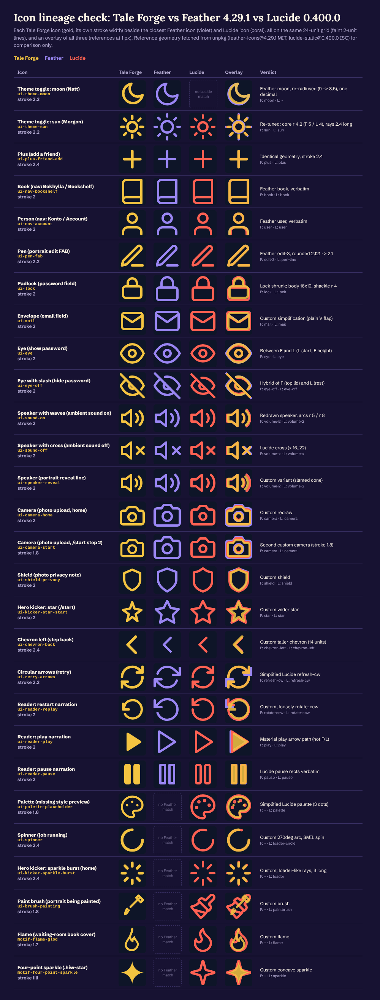
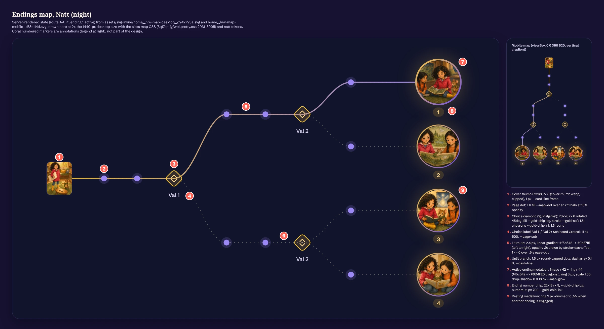

# Tale Forge: Iconography and vector graphics

Tale Forge has no icon library and no icon font. Every icon is a small inline SVG written into the React components: 34 distinct icon drawings, one decorative SVG illustration (the waiting-room book cover), and one large data-driven diagram, the **endings map**. The map is the site's signature vector piece.
The house idiom is a Feather/Lucide-style line icon: a 24-unit grid, `stroke="currentColor"`, round caps and joins, and a stroke that is heavier than Feather's at 2.2–2.4 for marketing chrome and 2 for forms. Colour always comes from the theme tokens through `currentColor`. Only the Google "G" and the waiting-room cover art carry literal colours.
Around that core sits a family of soft decorative marks: a concave four-point gold sparkle, round-capped dotted trails, gold-ringed medallions and nodes, and diamond "gold stars". On the book-fair routes these turn into Unicode glyphs (✦ ✧ ♫ ◇ → ←). No emoji appear anywhere in the UI.
This file covers every SVG, verbatim, with its viewBox, stroke, caps, paint, colour source and rendered size. It also includes a library-lineage check against Feather 4.29.1 and Lucide 0.400.0, the endings map in full, the decorative motifs, a glyph census, and recipes for film.

Observed facts cite a library path. CSS line numbers refer to [source/css/3q17cp_jgfwol.pretty.css](../source/css/3q17cp_jgfwol.pretty.css) unless another file is named. `file.js@N` means character offset N in that chunk. Judgement is marked **Read:**.

## Contents

1. [At a glance](#1-at-a-glance)
2. [Where the vectors live](#2-where-the-vectors-live)
3. [The icon style, described](#3-the-icon-style-described)
4. [Library or custom? The lineage check](#4-library-or-custom-the-lineage-check)
5. [Full inventory](#5-full-inventory)
6. [Every icon, verbatim](#6-every-icon-verbatim)
7. [How icons are sized and coloured in CSS](#7-how-icons-are-sized-and-coloured-in-css)
8. [The endings map](#8-the-endings-map)
9. [Decorative vector motifs](#9-decorative-vector-motifs)
10. [The waiting-room book art (glöd)](#10-the-waiting-room-book-art-glöd)
11. [Unicode glyphs and emoji](#11-unicode-glyphs-and-emoji)
12. [Animated icons](#12-animated-icons)
13. [Icon accessibility](#13-icon-accessibility)
14. [Reproducing the style (web and film)](#14-reproducing-the-style-web-and-film)
15. [Files produced for this dimension](#15-files-produced-for-this-dimension)
16. [Caveats and open questions](#16-caveats-and-open-questions)

---

## 1. At a glance



*[derived/icons/icon-sheet-natt.png](../derived/icons/icon-sheet-natt.png). Every icon at 24 px and 48 px, on the surface it sits on in the product, with Natt tokens. The Morgon version is [icon-sheet-morgon.png](../derived/icons/icon-sheet-morgon.png). The live, toggleable page is [icon-sheet.html](../derived/icons/icon-sheet.html).*

| Measure | Value | Evidence |
|---|---|---|
| Icon libraries or icon fonts loaded | **none** (no lucide/feather/heroicons/phosphor/tabler/material package in any chunk; every `<svg>` is written inline in JSX or server HTML) | grep over [source/js/](../source/js/), [source/html/](../source/html/), [source/css/](../source/css/) |
| Inline SVG elements in the harvested client JS | 35 Tale Forge `jsx("svg")` calls in 6 chunks, plus 1 Next.js error glyph and 4 non-icon `viewBox` mentions | [derived/icons/icons.json](../derived/icons/icons.json); sources listed per icon in §5 |
| Inline SVGs in the server HTML | 16 unique files: 13 icons and 3 endings-map renders | [assets/svg-inline/](../assets/svg-inline/) |
| Distinct icon drawings | **34** (33 Tale Forge drawings plus the Google "G"), plus the flame motif, the book-cover illustration and the endings map. One more SVG logo was found on the stand-alone book-fair contest page | §5 |
| Grid | 24 x 24 viewBox for every icon. The book-fair logo uses 64 x 60 and the map uses 960 x 540 (desktop) or 360 x 620 (mobile) | §6 |
| Stroked vs filled | 30 stroked (two of them filled and stroked by CSS) and 5 filled. The filled five are the gold sparkle, two play triangles, a pause and the Google G | §5 |
| Stroke widths in use | 2 (15 icons), 2.2 (4), 2.4 (4), 1.8 (3), 1.7 (4) | §3 |
| Caps / joins | round caps on all 30 stroked icons. Round joins on 26. The other 4 omit `stroke-linejoin`: sun, sparkle burst, plus, spinner | §3 |
| Colour source | `currentColor` on every Tale Forge icon. The spinner sets `stroke="var(--accent)"` directly, the Google G uses 4 brand hexes, and the cover art uses literals | §7 |
| Rendered sizes | 13, 14, 15, 16, 18, 19, 20, 22, 26, 30, 34 px (companions 28 px on phones); a 12 px `.wslot svg` rule exists but nothing renders it | §7 |
| Emoji in UI copy | **0** | [derived/icons/glyph-census.json](../derived/icons/glyph-census.json) |
| Unicode glyphs used as icons | 10 (· + ✓ × ✦ ✧ ♫ ◇ → ←); the arrows, ✧, ♫ and ◇ occur only on the /bokmassan book-fair routes | §11 |

**Read:** this is a hand-maintained house set. Someone started from Feather and Lucide (a few icons are verbatim), then redrew or re-tuned most of them in the same idiom: one-decimal coordinates, slightly heavier strokes, softer proportions. It also added a small vocabulary of storybook marks: sparkles, companions, a brush and a flame. The icons stay quiet. Illustration does the emotional work on this site, and the icons only label and operate.

---

## 2. Where the vectors live

| Where | What | Files |
|---|---|---|
| Server HTML (every page) | Theme toggle moon and sun | [assets/svg-inline/404__tt-opt__80ee85dd.svg](../assets/svg-inline/404__tt-opt__80ee85dd.svg), [404__tt-opt__ddbc3897.svg](../assets/svg-inline/404__tt-opt__ddbc3897.svg). Also in [390j9gbq0u9ce.js@28685/@28966](../source/js/390j9gbq0u9ce.js) |
| Server HTML, home | Kicker sparkle burst, five `.hiw-star`, narrator play, endings map (desktop and mobile), portrait FAB pen, upload camera, add-friend plus. 14 `<svg>` in [home.sv.html](../source/html/home.sv.html) | `home__*.svg` in [assets/svg-inline/](../assets/svg-inline/) |
| Server HTML, /login and /signup | Google G, mail, lock, eye (6 `<svg>` per page including the toggle) | `login__*.svg` |
| Server HTML, /start | Kicker star | [start__kicker__ad275afb.svg](../assets/svg-inline/start__kicker__ad275afb.svg) |
| Client JS | /start onboarding [0ad0wel9cyv30.js](../source/js/0ad0wel9cyv30.js) (12 svgs), AuthForm [1hcx0qn-qjgfn.js](../source/js/1hcx0qn-qjgfn.js) (5), create + waiting room [2j_-r8q4tgdka.js](../source/js/2j_-r8q4tgdka.js) (6), reader [36tbz-w9v-p8v.js](../source/js/36tbz-w9v-p8v.js) (4), layout/nav [390j9gbq0u9ce.js](../source/js/390j9gbq0u9ce.js) (4), landing [3d9nxlx1n5pdy.js](../source/js/3d9nxlx1n5pdy.js) (4) | extraction log: §5 |
| Book-fair routes (fetched live in this run) | Contest-page logo SVG, plus glyph icons in the curated gallery and reader | [derived/icons/fair-source/](../derived/icons/fair-source/) |
| Raster, not SVG | The logo [assets/assets/tf-logo.webp](../assets/assets/tf-logo.webp) (512 x 512), favicons and PWA icons ([assets/brand/](../assets/brand/), [assets/icons/](../assets/icons/)). These are covered in [01-brand-identity.md](01-brand-identity.md) and [derived/brand/icon-sheet.png](../derived/brand/icon-sheet.png) | |

Non-icon `viewBox` mentions in the JS: Next/Image's blur-placeholder template (`getImageBlurSvg`, in [26ye0kuppitcn.js@10748](../source/js/26ye0kuppitcn.js) and in the fair chunks), React DOM's attribute switch ([3sehtyhn4u4zd.js@185496](../source/js/3sehtyhn4u4zd.js)), and the two map-geometry objects in [3d9nxlx1n5pdy.js@7140 and @8366](../source/js/3d9nxlx1n5pdy.js). Next.js's own error-page warning triangle ([36s0t0o8ux5as.js@2960](../source/js/36s0t0o8ux5as.js)) is kept as [framework-next-error-triangle.svg](../derived/icons/svg/framework-next-error-triangle.svg) for completeness. It is not Tale Forge design.

---

## 3. The icon style, described

**Observed.**

- **Grid and geometry.** 24 x 24 viewBox, with live area mostly inside x 2–22, y 2.5–21.5. Coordinates are written to one decimal (`M21 12.8A8.5 8.5 0 1 1 11.2 3`, `M12 2.5v2.4`) where Feather uses two (`12.79`, `11.21`). Primitives are paths, `circle` and `rect`. There are no `<line>` or `<polyline>` elements; Feather uses those.
- **Stroke weight by role.** Marketing chrome runs heavier. The theme toggle, FAB pen and retry are 2.2. The kicker burst, plus, back chevron and spinner are 2.4. Forms and system UI use Feather's 2 (mail, lock, eye, nav pills, sound, shield, speaker, kicker star, reader). Illustrative or "soft" icons drop to 1.7–1.8: the three companions and the flame at 1.7, the /start camera, brush and palette at 1.8.
- **Caps and joins.** Always `stroke-linecap="round"`. Joins are round except on four icons made only of separate strokes or arcs, where the join never shows.
- **Fill vs stroke.** Line icons are `fill="none"`. Filled shapes are kept for "media" verbs (play, pause) and for the gold sparkle. The reader's play and pause are both filled *and* stroked 2 px by CSS, which rounds the triangle's corners: `.reader-audio-control svg { fill: currentColor; stroke: currentColor; stroke-width: 2px; stroke-linecap: round; stroke-linejoin: round }` (2053-2061).
- **Colour.** `stroke="currentColor"` / `fill="currentColor"` everywhere. The parent sets `color` to a theme token (`--ghost-ink`, `--chip-ink`, `--btn-ink`, `--card-sub`, `--accent`, `--gold-soft`, `--gold-chip-ink`, `--trait-ink`, `--choice-ink`), so every icon re-themes for free between Natt and Morgon. Measured: the home kicker icon computes to `rgb(232, 223, 201)` = `#e8dfc9` (`--chip-ink`) in Natt and `rgb(91, 63, 199)` = `#5b3fc7` in Morgon. The play icon on the gold button is `rgb(58, 43, 16)` = `#3a2b10` in Natt and `#fff` on the violet button in Morgon ([computed-styles__home__sv__natt__desktop.json](../source/rendered/computed-styles__home__sv__natt__desktop.json), [..morgon..](../source/rendered/computed-styles__home__sv__morgon__desktop.json)).
- **Size.** Icons are drawn at 24 and displayed small: 13–22 px in UI, 26–34 px for feature glyphs. Size is set by CSS (`.kicker svg { width: 14px; height: 14px }`) or by `width`/`height` attributes in JSX (auth fields 18, nav pills 16, back chevron 16, spinner 26).
- **Containers.** Icons almost always sit in a soft container: a round gold FAB (42 px), a rounded chip tile (46 px, r 14), a 44 px square transport button (r 8), the pill toggle thumb, or a 2 px dashed "add" card. They are rarely bare.

**Read.**

- The extra weight (2.2–2.4 at 14–16 px) makes the icons read as *drawn with a soft pencil* rather than engineered. At small sizes they stay sturdy on the busy painted backgrounds and the translucent glass cards.
- The round caps and the concave sparkle carry the "storybook" feel. There are no sharp corners anywhere except the Material-style play triangle on the narrator button, and the reader rounds even that with its CSS stroke.
- Icons are functional and modest. Ornament comes from separate decorative motifs (§9), never from the icons themselves.

---

## 4. Library or custom? The lineage check

Each icon was compared with the closest Feather 4.29.1 and Lucide 0.400.0 icon. Reference SVGs were fetched from unpkg (feather-icons MIT, lucide-static ISC) for comparison only.



*[derived/icons/lineage-compare.png](../derived/icons/lineage-compare.png) ([html](../derived/icons/lineage-compare.html)). Gold = Tale Forge at its own stroke width, violet = Feather, coral = Lucide, then an overlay of all three on the 24 grid.*

**Tally of the 34 drawings:**

| Verdict | Count | Icons |
|---|---|---|
| Library geometry, verbatim | 5 | Feather `book` (nav Bokhylla), Feather `user` (nav Konto), `plus` (same in both libraries), Lucide `pause` rects (reader), Material `play_arrow` path `M8 5v14l11-7z` (reader) |
| Library, near-verbatim (rounded or one radius changed) | 2 | Feather `moon` (outer arc r 9 -> 8.5), Feather `edit-3` (FAB pen, `2.121` -> `2.1`) |
| Library-derived, re-tuned | 9 | sun, lock, eye, eye-off, retry (`refresh-cw`), palette, sound on (`volume-2`), sound off (`volume-x`), narrator play (Material, nudged) |
| Custom, in the same idiom | 17 | kicker burst, kicker star, gold sparkle, narrator pause, both cameras, shield, brush, reveal speaker, voice-chip play, back chevron, mail, fox, owl, dragon, spinner, replay |
| Third-party mark | 1 | Google G |

The full per-icon notes are below (also in [icons.json](../derived/icons/icons.json) as `lineage`):

| Icon | Lineage (what it was compared with, what differs) |
|---|---|
| Theme toggle: moon (Natt) | Feather `moon` re-scaled: Feather is `M21 12.79A9 9 0 1 1 11.21 3 7 7 0 0 0 21 12.79z`; Tale Forge rounds to one decimal and shrinks the outer arc radius 9 -> 8.5. |
| Theme toggle: sun (Morgon) | Lucide/Feather `sun` geometry re-tuned: core circle r 4 (Lucide) / 5 (Feather) -> 4.2, rays 2 long -> 2.4 long, diagonals 1.41 -> 1.7. No stroke-linejoin attribute (the only stroked icon without one; irrelevant for straight rays). |
| Hero kicker: sparkle burst (home) | Custom. Eight detached rays with an empty centre (structure of Lucide `loader`, but shorter 3-unit rays and no rotation). Reads as a twinkle/burst. |
| Hero kicker: star (/start) | Custom five-point star, wider and squatter than Feather `star` (which is `polygon 12 2 15.09 8.26 22 9.27 ...`). Hand-placed one-decimal points. |
| Play (narrator sample button) | Material `play_arrow` (`M8 5v14l11-7z`) nudged: starts at y 5.5, height 13, apex at 12. Filled, no stroke. |
| Pause (narrator sample, playing) | Custom: two square-cornered 4x14 bars (Material pause is 4x14 at x 6 and 14; this one sits at x 7 and 13, so the gap is narrower). |
| Pen (portrait edit FAB) | Feather `edit-3` almost verbatim (Feather: `M12 20h9` + `M16.5 3.5a2.121 2.121 0 0 1 3 3L7 19l-4 1 1-4L16.5 3.5z`); Tale Forge rounds 2.121 -> 2.1 and closes with z. |
| Camera (photo upload, home) | Custom redraw of Feather/Lucide `camera`: body 20x12 with 2-unit corner arcs, a short bumped top, lens r 3.4 at y 13.5. |
| Plus (add a friend) | Identical geometry to Lucide/Feather `plus` (`M12 5v14` + `M5 12h14`), merged into one path, heavier 2.4 stroke. |
| Book (nav: Bokhylla / Bookshelf) | Feather `book`, verbatim. |
| Person (nav: Konto / Account) | Feather `user`, verbatim. |
| Four-point sparkle (.hiw-star) | Custom. Concave four-point 'twinkle' built from four quadratic-like cubic arcs (`c.7 5.6 4.4 9.3 10 10`). Same silhouette family as the four sparkles in the logo (assets/assets/tf-logo.webp). |
| Flame (waiting-room book cover) | Custom flame with an inner tongue; same 24-grid stroke language as the UI icons. |
| Camera (photo upload, /start step 2) | Custom; a second, thinner (1.8) camera with a flatter top (`M4 8h3l2-2.5h6L17 8h3`) and 1.5-unit corners. Note: two different camera drawings ship. |
| Shield (photo privacy note) | Custom shield (flat top shoulders at y 6, point at y 21). Feather `shield` is `M12 22s8-4 8-10V5l-8-3-8 3v7c0 6 8 10 8 10z`. |
| Paint brush (portrait being painted) | Custom brush: handle line + ferrule square rotated 45deg + a teardrop tip with a flick. |
| Speaker (portrait reveal line) | Custom variant of Feather `volume-2` (cone 3..11 wide with a slanted top `L6.5 8.5`; arcs r 4.2 and 8). |
| Play (narrator voice chip) | Custom filled triangle `M7 4.5l12 7.5-12 7.5z` (a third distinct play triangle). |
| Chevron left (step back) | Custom: a taller chevron (14 units, `M15 5l-7 7 7 7`) than Lucide `chevron-left` (12 units, `m15 18-6-6 6-6`). |
| Circular arrows (retry) | Simplified Lucide `refresh-cw`: same arrowheads `M21 3v5h-5` / `M3 21v-5h5`, but the arcs are single `a9 9` arcs instead of Lucide's two-segment arcs. |
| Spinner (job running) | Custom 270-degree arc (`M12 3a9 9 0 1 0 9 9`) spun with SMIL `animateTransform`, not CSS. Comparable to Lucide `loader-circle`. |
| Palette (missing style preview) | Simplified redraw of Lucide `palette` (Lucide has 4 dots of r .5; this has 3 dots of r 1 with fill and no stroke). |
| Speaker with waves (ambient sound on) | Feather `volume-2` redrawn: speaker polygon `11 5 6 9 2 9 ...` becomes path `M11 5 6 9H3v6h3l5 4V5z`; wave arcs r 5 and r 8. |
| Speaker with cross (ambient sound off) | Lucide `volume-x` cross coordinates (x 16..22; Feather uses 17..23) on the redrawn speaker. |
| Companion: Rufus the fox | Custom mascot glyph: fox mask with pointed ears, dot eyes (`h.01` zero-length strokes) and a small triangle nose. |
| Companion: Luna the owl | Custom: round head r 7, two ring eyes r 1.5, triangle beak, two ear tufts. |
| Companion: Bo the dragon | Custom: a flame/egg teardrop with a smile; reads as a friendly little fire-breather rather than a literal dragon. |
| Envelope (email field) | Custom simplification: Lucide `mail` is `rect 20x16 at 2,4` + a flap with a rounded bottom; Tale Forge uses an 18x14 rect and a plain V flap `m3 7 9 6 9-6`. |
| Padlock (password field) | Feather/Lucide `lock` shrunk: body 16x10 (vs 18x11), shackle radius 4 (vs 5). |
| Eye (show password) | Between the two libraries: starts at x 2 with 3/10 arms like Lucide `eye` (`M2 12s3-7 10-7 ...`) but keeps Feather's 8-unit height (`M1 12s4-8 11-8 ...`). |
| Eye with slash (hide password) | Hybrid: the top lid keeps Feather `eye-off` numbers (`M9.9 4.24A9.12 9.12 0 0 1 12 4` rounded to 9.1, `a18.5 18.5 0 0 1-2.16 3.19`); the lower lid, inner arc and slash follow Lucide (`M6.61 6.61A13.526 ...`, `a9.74 9.74 0 0 0 5.39-1.61`, `M9.88 9.88a3 3 0 ... 4.24 4.24`, slash 2,2 -> 22,22), rounded to one decimal. |
| Google 'G' (sign-in provider) | The standard four-path Google 'G' mark (third-party brand asset, not Tale Forge styling). |
| Reader: play narration | Material `play_arrow` path verbatim (`M8 5v14l11-7z`); styled by CSS with fill AND a 2px round stroke, which rounds the triangle's corners. |
| Reader: pause narration | Lucide `pause` rects verbatim (x 6 / 14, 4x16, rx 1), thickened by the CSS 2px stroke. |
| Reader: restart narration | Custom counter-clockwise arrow: `M4 7v5h5` arrowhead + an r 8 arc `M5.5 16a8 8 0 1 0 .5-9l-2 5` (the tail kinks back into the arrowhead). Loosely Lucide `rotate-ccw`. |
| Book-fair contest logo: open book + three stars | Custom. Open book drawn as two curved page fans meeting at a spine (x 32), a ground line `M3 57c11-2 20-2 29 0 9-2 18-2 29 0`, and three filled four-point stars (`m31 4 3 10 10 3-10 3-3 10-3-10-10-3 10-3Z` is a straight-sided diamond-star, unlike the concave .hiw-star). Same idea as the raster logo's book + sparkles, minus the anvil and quill. |
| Next.js error page warning triangle (framework, not Tale Forge) | Next.js / Vercel Geist warning glyph (filled, 5-decimal coordinates; a different drawing tradition from every Tale Forge icon). |

**Read:** a developer working from memory of Feather would produce exactly this mix: a few icons pasted in, most redrawn by hand to one decimal, and new ones (companions, brush, flame, sparkle) drawn in the same 24-grid round-cap language. One sign it is hand-maintained rather than systematic is that there are **three different play triangles** (`M8 5.5v13l11-6.5z` narrator button, `M7 4.5l12 7.5-12 7.5z` voice chip, `M8 5v14l11-7z` reader) and **two different cameras** (home: stroke 2, 2-unit corners; /start: stroke 1.8, 1.5-unit corners).

---

## 5. Full inventory

Colours and sizes are what the product applies. "Source" links the first harvested occurrence; [icons.json](../derived/icons/icons.json) has every source, the CSS citation and the context sentence for each icon.

| # | Icon (id) | Group | viewBox | Paint | Stroke | Cap / join | Colour on site | Size on site | Source | Clean file |
|---|---|---|---|---|---|---|---|---|---|---|
| 1 | Theme toggle: moon (Natt) (`ui-theme-moon`) | Chrome | `0 0 24 24` | stroke | 2.2 | round / round | --ghost-ink (inactive); --btn-ink when active, sitting on the gold/violet --btn-grad thumb | 15 px | [`404__tt-opt__80ee85dd.svg`](../assets/svg-inline/404__tt-opt__80ee85dd.svg), [`390j9gbq0u9ce.js@28685`](../source/js/390j9gbq0u9ce.js) | [svg](../derived/icons/svg/ui-theme-moon.svg) |
| 2 | Theme toggle: sun (Morgon) (`ui-theme-sun`) | Chrome | `0 0 24 24` | stroke | 2.2 | round / unset | --ghost-ink (inactive) / --btn-ink (active) | 15 px | [`404__tt-opt__ddbc3897.svg`](../assets/svg-inline/404__tt-opt__ddbc3897.svg), [`390j9gbq0u9ce.js@28966`](../source/js/390j9gbq0u9ce.js) | [svg](../derived/icons/svg/ui-theme-sun.svg) |
| 3 | Hero kicker: sparkle burst (home) (`ui-kicker-sparkle-burst`) | Chrome | `0 0 24 24` | stroke | 2.4 | round / unset | --chip-ink | 14 px | [`home__kicker__822f9609.svg`](../assets/svg-inline/home__kicker__822f9609.svg), [`home.sv.html`](../source/html/home.sv.html) | [svg](../derived/icons/svg/ui-kicker-sparkle-burst.svg) |
| 4 | Hero kicker: star (/start) (`ui-kicker-star-start`) | Chrome | `0 0 24 24` | stroke | 2 | round / round | --chip-ink | 14 px | [`start__kicker__ad275afb.svg`](../assets/svg-inline/start__kicker__ad275afb.svg), [`0ad0wel9cyv30.js@18893`](../source/js/0ad0wel9cyv30.js) | [svg](../derived/icons/svg/ui-kicker-star-start.svg) |
| 5 | Play (narrator sample button) (`ui-play-hiw`) | Chrome | `0 0 24 24` | fill | – | – | --btn-ink on --btn-grad | 16 px | [`home__hiw-play__2ef55bb7.svg`](../assets/svg-inline/home__hiw-play__2ef55bb7.svg), [`3d9nxlx1n5pdy.js@15498`](../source/js/3d9nxlx1n5pdy.js) | [svg](../derived/icons/svg/ui-play-hiw.svg) |
| 6 | Pause (narrator sample, playing) (`ui-pause-hiw`) | Chrome | `0 0 24 24` | fill | – | – | --btn-ink on --btn-grad | 16 px | [`3d9nxlx1n5pdy.js@15340`](../source/js/3d9nxlx1n5pdy.js) | [svg](../derived/icons/svg/ui-pause-hiw.svg) |
| 7 | Pen (portrait edit FAB) (`ui-pen-fab`) | Chrome | `0 0 24 24` | stroke | 2.2 | round / round | --btn-ink on --btn-grad | 18 px in a 42 px disc | [`home__fab__9184410d.svg`](../assets/svg-inline/home__fab__9184410d.svg), [`home.sv.html`](../source/html/home.sv.html) | [svg](../derived/icons/svg/ui-pen-fab.svg) |
| 8 | Camera (photo upload, home) (`ui-camera-home`) | Chrome | `0 0 24 24` | stroke | 2 | round / round | --chip-ink | 22 px in a 46 px rounded tile | [`home__cam__a7a7e275.svg`](../assets/svg-inline/home__cam__a7a7e275.svg), [`home.sv.html`](../source/html/home.sv.html) | [svg](../derived/icons/svg/ui-camera-home.svg) |
| 9 | Plus (add a friend) (`ui-plus-friend-add`) | Chrome | `0 0 24 24` | stroke | 2.4 | round / unset | --chip-ink | 18 px | [`home__friend-add__b68ae682.svg`](../assets/svg-inline/home__friend-add__b68ae682.svg), [`home.sv.html`](../source/html/home.sv.html) | [svg](../derived/icons/svg/ui-plus-friend-add.svg) |
| 10 | Book (nav: Bokhylla / Bookshelf) (`ui-nav-bookshelf`) | Chrome | `0 0 24 24` | stroke | 2 | round / round | --card-sub | 16 px | [`390j9gbq0u9ce.js@24934`](../source/js/390j9gbq0u9ce.js) | [svg](../derived/icons/svg/ui-nav-bookshelf.svg) |
| 11 | Person (nav: Konto / Account) (`ui-nav-account`) | Chrome | `0 0 24 24` | stroke | 2 | round / round | --card-sub | 16 px | [`390j9gbq0u9ce.js@25344`](../source/js/390j9gbq0u9ce.js) | [svg](../derived/icons/svg/ui-nav-account.svg) |
| 12 | Four-point sparkle (.hiw-star) (`motif-four-point-sparkle`) | Motif | `0 0 24 24` | fill | – | – | --gold-soft #f5c542 in BOTH themes | 14 px | [`home__hiw-star__700fa96f.svg`](../assets/svg-inline/home__hiw-star__700fa96f.svg), [`3d9nxlx1n5pdy.js@14639`](../source/js/3d9nxlx1n5pdy.js) | [svg](../derived/icons/svg/motif-four-point-sparkle.svg) |
| 13 | Flame (waiting-room book cover) (`motif-flame-glod`) | Motif | `0 0 24 24` | stroke | 1.7 | round / round | #f5c542 literal (gold-soft) | about 28 px on the 160x122 art | [`2j_-r8q4tgdka.js@32230`](../source/js/2j_-r8q4tgdka.js) | [svg](../derived/icons/svg/motif-flame-glod.svg) |
| 14 | Camera (photo upload, /start step 2) (`ui-camera-start`) | App | `0 0 24 24` | stroke | 1.8 | round / round | --chip-ink | 22 px | [`0ad0wel9cyv30.js@24336`](../source/js/0ad0wel9cyv30.js) | [svg](../derived/icons/svg/ui-camera-start.svg) |
| 15 | Shield (photo privacy note) (`ui-shield-privacy`) | App | `0 0 24 24` | stroke | 2 | round / round | --gold-chip-ink | 16 px | [`0ad0wel9cyv30.js@24997`](../source/js/0ad0wel9cyv30.js) | [svg](../derived/icons/svg/ui-shield-privacy.svg) |
| 16 | Paint brush (portrait being painted) (`ui-brush-painting`) | App | `0 0 24 24` | stroke | 1.8 | round / round | #fff7e9 literal on a violet-to-gold veil | 30 px | [`0ad0wel9cyv30.js@27730`](../source/js/0ad0wel9cyv30.js) | [svg](../derived/icons/svg/ui-brush-painting.svg) |
| 17 | Speaker (portrait reveal line) (`ui-speaker-reveal`) | App | `0 0 24 24` | stroke | 2 | round / round | --accent (gold-soft natt / violet morgon) | 19 px | [`0ad0wel9cyv30.js@31686`](../source/js/0ad0wel9cyv30.js) | [svg](../derived/icons/svg/ui-speaker-reveal.svg) |
| 18 | Play (narrator voice chip) (`ui-play-voice-sample`) | App | `0 0 24 24` | fill | – | – | inherits chip: --trait-ink / --trait-on-ink when chosen | 13 px | [`0ad0wel9cyv30.js@42695`](../source/js/0ad0wel9cyv30.js) | [svg](../derived/icons/svg/ui-play-voice-sample.svg) |
| 19 | Chevron left (step back) (`ui-chevron-back`) | App | `0 0 24 24` | stroke | 2.4 | round / round | --card-ink | 16 px in a 34 px square | [`0ad0wel9cyv30.js@49744`](../source/js/0ad0wel9cyv30.js) | [svg](../derived/icons/svg/ui-chevron-back.svg) |
| 20 | Circular arrows (retry) (`ui-retry-arrows`) | App | `0 0 24 24` | stroke | 2.2 | round / round | --chip-ink | 18 px | [`2j_-r8q4tgdka.js@5231`](../source/js/2j_-r8q4tgdka.js) | [svg](../derived/icons/svg/ui-retry-arrows.svg) |
| 21 | Spinner (job running) (`ui-spinner`) | App | `0 0 24 24` | stroke | 2.4 | round / unset | --accent (stroke set directly to var(--accent)) | 26 px | [`2j_-r8q4tgdka.js@5762`](../source/js/2j_-r8q4tgdka.js) | [svg](../derived/icons/svg/ui-spinner.svg) |
| 22 | Palette (missing style preview) (`ui-palette-placeholder`) | App | `0 0 24 24` | stroke | 1.8 | round / round | --card-sub; dots filled currentColor | 26 px | [`2j_-r8q4tgdka.js@25842`](../source/js/2j_-r8q4tgdka.js) | [svg](../derived/icons/svg/ui-palette-placeholder.svg) |
| 23 | Speaker with waves (ambient sound on) (`ui-sound-on`) | App | `0 0 24 24` | stroke | 2 | round / round | inherits the chip (pressed: --pill-ink) | 15 px | [`2j_-r8q4tgdka.js@36176`](../source/js/2j_-r8q4tgdka.js), [`36tbz-w9v-p8v.js@6140`](../source/js/36tbz-w9v-p8v.js) | [svg](../derived/icons/svg/ui-sound-on.svg) |
| 24 | Speaker with cross (ambient sound off) (`ui-sound-off`) | App | `0 0 24 24` | stroke | 2 | round / round | inherits the chip | 15 px | [`2j_-r8q4tgdka.js@36460`](../source/js/2j_-r8q4tgdka.js) | [svg](../derived/icons/svg/ui-sound-off.svg) |
| 25 | Companion: Rufus the fox (`companion-rufus-fox`) | Companion | `0 0 24 24` | stroke | 1.7 | round / round | --trait-ink; --trait-on-ink when chosen | 34 px (28 px on phones) | [`0ad0wel9cyv30.js@3520`](../source/js/0ad0wel9cyv30.js) | [svg](../derived/icons/svg/companion-rufus-fox.svg) |
| 26 | Companion: Luna the owl (`companion-luna-owl`) | Companion | `0 0 24 24` | stroke | 1.7 | round / round | --trait-ink / --trait-on-ink | 34 px (28 px on phones) | [`0ad0wel9cyv30.js@3852`](../source/js/0ad0wel9cyv30.js) | [svg](../derived/icons/svg/companion-luna-owl.svg) |
| 27 | Companion: Bo the dragon (`companion-bo-dragon`) | Companion | `0 0 24 24` | stroke | 1.7 | round / round | --trait-ink / --trait-on-ink | 34 px (28 px on phones) | [`0ad0wel9cyv30.js@4269`](../source/js/0ad0wel9cyv30.js) | [svg](../derived/icons/svg/companion-bo-dragon.svg) |
| 28 | Envelope (email field) (`ui-mail`) | Auth | `0 0 24 24` | stroke | 2 | round / round | --card-sub | 18 px | [`login__svg__b5c88077.svg`](../assets/svg-inline/login__svg__b5c88077.svg), [`1hcx0qn-qjgfn.js@8841`](../source/js/1hcx0qn-qjgfn.js) | [svg](../derived/icons/svg/ui-mail.svg) |
| 29 | Padlock (password field) (`ui-lock`) | Auth | `0 0 24 24` | stroke | 2 | round / round | --card-sub | 18 px | [`login__svg__25d1a9b6.svg`](../assets/svg-inline/login__svg__25d1a9b6.svg), [`1hcx0qn-qjgfn.js@9505`](../source/js/1hcx0qn-qjgfn.js) | [svg](../derived/icons/svg/ui-lock.svg) |
| 30 | Eye (show password) (`ui-eye`) | Auth | `0 0 24 24` | stroke | 2 | round / round | --card-sub | 18 px in a 44 px button | [`login__svg__12e05ebd.svg`](../assets/svg-inline/login__svg__12e05ebd.svg), [`1hcx0qn-qjgfn.js@10825`](../source/js/1hcx0qn-qjgfn.js) | [svg](../derived/icons/svg/ui-eye.svg) |
| 31 | Eye with slash (hide password) (`ui-eye-off`) | Auth | `0 0 24 24` | stroke | 2 | round / round | --card-sub | 18 px | [`1hcx0qn-qjgfn.js@10421`](../source/js/1hcx0qn-qjgfn.js), [`0ad0wel9cyv30.js@37742`](../source/js/0ad0wel9cyv30.js) | [svg](../derived/icons/svg/ui-eye-off.svg) |
| 32 | Google 'G' (sign-in provider) (`brand-google-g`) | Auth | `0 0 24 24` | fill | – | – | fixed brand colours #4285F4 #34A853 #FBBC05 #EA4335 (only icon not using currentColor) | 18 px | [`login__btn__ee8ffa17.svg`](../assets/svg-inline/login__btn__ee8ffa17.svg), [`1hcx0qn-qjgfn.js@7505`](../source/js/1hcx0qn-qjgfn.js) | [svg](../derived/icons/svg/brand-google-g.svg) |
| 33 | Reader: play narration (`ui-reader-play`) | Reader | `0 0 24 24` | fill + 2 px stroke from CSS | 2 | round / round | --choice-ink on --choice-bg | 20 px in a 44 px button | [`36tbz-w9v-p8v.js@4103`](../source/js/36tbz-w9v-p8v.js) | [svg](../derived/icons/svg/ui-reader-play.svg) |
| 34 | Reader: pause narration (`ui-reader-pause`) | Reader | `0 0 24 24` | fill + 2 px stroke from CSS | 2 | round / round | --choice-ink | 20 px | [`36tbz-w9v-p8v.js@3908`](../source/js/36tbz-w9v-p8v.js) | [svg](../derived/icons/svg/ui-reader-pause.svg) |
| 35 | Reader: restart narration (`ui-reader-replay`) | Reader | `0 0 24 24` | stroke from CSS | 2 | round / round | --choice-ink | 20 px | [`36tbz-w9v-p8v.js@4477`](../source/js/36tbz-w9v-p8v.js) | [svg](../derived/icons/svg/ui-reader-replay.svg) |
| 36 | Book-fair contest logo: open book + three stars (`brand-fair-contest-book-stars`) | Fair | `0 0 64 60` | stroke + filled stars | 1.7 | round / round | #e7c98b literal (pale gold; not a token) | 34 px tall (36.3 px wide) | [`bokmassan-tavling.sv.html`](../derived/icons/fair-source/bokmassan-tavling.sv.html) | [svg](../derived/icons/svg/brand-fair-contest-book-stars.svg) |
| 37 | Next.js error page warning triangle (framework, not Tale Forge) (`framework-next-error-triangle`) | Framework | `-0.2 -1.5 32 32` | fill | – | – | var(--next-error-title) | 32 px | [`36s0t0o8ux5as.js@2960`](../source/js/36s0t0o8ux5as.js) | [svg](../derived/icons/svg/framework-next-error-triangle.svg) |

Endings-map parts (not 24-grid icons; coordinates are map units, see §8): [map-choice-diamond.svg](../derived/icons/svg/map-choice-diamond.svg), [map-page-dot.svg](../derived/icons/svg/map-page-dot.svg), [map-medallion.svg](../derived/icons/svg/map-medallion.svg), [map-dotted-path.svg](../derived/icons/svg/map-dotted-path.svg). Illustration: [illus-glod-book-art.svg](../derived/icons/svg/illus-glod-book-art.svg).

---

## 6. Every icon, verbatim

Markup as harvested. Only two things change: React camelCase attributes are written in SVG kebab-case, and `aria-hidden`/`focusable` are left out. Each cleaned standalone file in [derived/icons/svg/](../derived/icons/svg/) adds `xmlns`, `width="24" height="24"`, a `<title>` and a comment naming its source and on-site colour. `gen_svgs.py` checked every `d`, `cx`, `r`, `x`, `y`, `width`, `height` and `rx` value against the harvested source text, with zero mismatches.

**Marketing chrome and nav**

```svg
<!-- ui-theme-moon -->
<svg viewBox="0 0 24 24" fill="none" stroke="currentColor" stroke-width="2.2" stroke-linecap="round" stroke-linejoin="round"><path d="M21 12.8A8.5 8.5 0 1 1 11.2 3a7 7 0 0 0 9.8 9.8z"/></svg>
<!-- ui-theme-sun -->
<svg viewBox="0 0 24 24" fill="none" stroke="currentColor" stroke-width="2.2" stroke-linecap="round"><circle cx="12" cy="12" r="4.2"/><path d="M12 2.5v2.4M12 19.1v2.4M2.5 12h2.4M19.1 12h2.4M4.9 4.9l1.7 1.7M17.4 17.4l1.7 1.7M19.1 4.9l-1.7 1.7M6.6 17.4l-1.7 1.7"/></svg>
<!-- ui-kicker-sparkle-burst -->
<svg viewBox="0 0 24 24" fill="none" stroke="currentColor" stroke-width="2.4" stroke-linecap="round"><path d="M12 3v3M12 18v3M3 12h3M18 12h3M5.6 5.6l2.1 2.1M16.3 16.3l2.1 2.1M18.4 5.6l-2.1 2.1M7.7 16.3l-2.1 2.1"/></svg>
<!-- ui-kicker-star-start -->
<svg viewBox="0 0 24 24" fill="none" stroke="currentColor" stroke-width="2" stroke-linecap="round" stroke-linejoin="round"><path d="M12 3l1.9 5.6L20 10l-5 3.6 1.6 6L12 16l-4.6 3.6L9 13.6 4 10l6.1-1.4z"/></svg>
<!-- ui-play-hiw -->
<svg viewBox="0 0 24 24" fill="currentColor"><path d="M8 5.5v13l11-6.5z"/></svg>
<!-- ui-pause-hiw -->
<svg viewBox="0 0 24 24" fill="currentColor"><path d="M7 5h4v14H7zM13 5h4v14h-4z"/></svg>
<!-- ui-pen-fab -->
<svg viewBox="0 0 24 24" fill="none" stroke="currentColor" stroke-width="2.2" stroke-linecap="round" stroke-linejoin="round"><path d="M12 20h9"/><path d="M16.5 3.5a2.1 2.1 0 0 1 3 3L7 19l-4 1 1-4z"/></svg>
<!-- ui-camera-home -->
<svg viewBox="0 0 24 24" fill="none" stroke="currentColor" stroke-width="2" stroke-linecap="round" stroke-linejoin="round"><path d="M4 8h2.4l1.4-2.2A2 2 0 0 1 9.5 5h5a2 2 0 0 1 1.7.8L17.6 8H20a2 2 0 0 1 2 2v8a2 2 0 0 1-2 2H4a2 2 0 0 1-2-2v-8a2 2 0 0 1 2-2z"/><circle cx="12" cy="13.5" r="3.4"/></svg>
<!-- ui-plus-friend-add -->
<svg viewBox="0 0 24 24" fill="none" stroke="currentColor" stroke-width="2.4" stroke-linecap="round"><path d="M12 5v14M5 12h14"/></svg>
<!-- ui-nav-bookshelf -->
<svg viewBox="0 0 24 24" fill="none" stroke="currentColor" stroke-width="2" stroke-linecap="round" stroke-linejoin="round"><path d="M4 19.5A2.5 2.5 0 0 1 6.5 17H20"/><path d="M6.5 2H20v20H6.5A2.5 2.5 0 0 1 4 19.5v-15A2.5 2.5 0 0 1 6.5 2z"/></svg>
<!-- ui-nav-account -->
<svg viewBox="0 0 24 24" fill="none" stroke="currentColor" stroke-width="2" stroke-linecap="round" stroke-linejoin="round"><path d="M20 21v-2a4 4 0 0 0-4-4H8a4 4 0 0 0-4 4v2"/><circle cx="12" cy="7" r="4"/></svg>
```

**Motifs**

```svg
<!-- motif-four-point-sparkle -->
<svg viewBox="0 0 24 24" fill="currentColor"><path d="M12 2c.7 5.6 4.4 9.3 10 10-5.6.7-9.3 4.4-10 10-.7-5.6-4.4-9.3-10-10 5.6-.7 9.3-4.4 10-10z"/></svg>
<!-- motif-flame-glod -->
<svg viewBox="0 0 24 24" fill="none" stroke="currentColor" stroke-width="1.7" stroke-linecap="round" stroke-linejoin="round"><path d="M12 2.6c.5 3.1-1.8 4.5-1.8 7a4.6 4.6 0 0 0 2.1 3.9c-.2-1.6.6-2.6 1.5-3.4.2 2.6 3.1 3 3.1 6.2A5.4 5.4 0 0 1 6.2 17c0-4.3 4.7-5.6 5.8-14.4z"/></svg>
```

**Onboarding and book generation**

```svg
<!-- ui-camera-start -->
<svg viewBox="0 0 24 24" fill="none" stroke="currentColor" stroke-width="1.8" stroke-linecap="round" stroke-linejoin="round"><path d="M4 8h3l2-2.5h6L17 8h3a1.5 1.5 0 0 1 1.5 1.5V18a1.5 1.5 0 0 1-1.5 1.5H4A1.5 1.5 0 0 1 2.5 18V9.5A1.5 1.5 0 0 1 4 8z"/><circle cx="12" cy="13.4" r="3.4"/></svg>
<!-- ui-shield-privacy -->
<svg viewBox="0 0 24 24" fill="none" stroke="currentColor" stroke-width="2" stroke-linecap="round" stroke-linejoin="round"><path d="M12 3l7 3v5.5c0 4.4-3 8-7 9.5-4-1.5-7-5.1-7-9.5V6z"/></svg>
<!-- ui-brush-painting -->
<svg viewBox="0 0 24 24" fill="none" stroke="currentColor" stroke-width="1.8" stroke-linecap="round" stroke-linejoin="round"><path d="M19 4l-8.5 8.5M9 15.5c-1 1-1.2 3-3.4 3.4.4-2.2 1-3.8 2-4.8"/><path d="M17.5 2.5l4 4-2 2-4-4z"/></svg>
<!-- ui-speaker-reveal -->
<svg viewBox="0 0 24 24" fill="none" stroke="currentColor" stroke-width="2" stroke-linecap="round" stroke-linejoin="round"><path d="M11 5L6.5 8.5H3v7h3.5L11 19z"/><path d="M15 9a4.2 4.2 0 0 1 0 6M17.8 6.5a8 8 0 0 1 0 11"/></svg>
<!-- ui-play-voice-sample -->
<svg viewBox="0 0 24 24" fill="currentColor"><path d="M7 4.5l12 7.5-12 7.5z"/></svg>
<!-- ui-chevron-back -->
<svg viewBox="0 0 24 24" fill="none" stroke="currentColor" stroke-width="2.4" stroke-linecap="round" stroke-linejoin="round"><path d="M15 5l-7 7 7 7"/></svg>
<!-- ui-retry-arrows -->
<svg viewBox="0 0 24 24" fill="none" stroke="currentColor" stroke-width="2.2" stroke-linecap="round" stroke-linejoin="round"><path d="M3 12a9 9 0 0 1 15-6.7L21 8"/><path d="M21 3v5h-5"/><path d="M21 12a9 9 0 0 1-15 6.7L3 16"/><path d="M3 21v-5h5"/></svg>
<!-- ui-spinner -->
<svg viewBox="0 0 24 24" fill="none" stroke="currentColor" stroke-width="2.4" stroke-linecap="round"><path d="M12 3a9 9 0 1 0 9 9"><animateTransform attributeName="transform" type="rotate" from="0 12 12" to="360 12 12" dur="0.8s" repeatCount="indefinite"/></path></svg>
<!-- ui-palette-placeholder -->
<svg viewBox="0 0 24 24" fill="none" stroke="currentColor" stroke-width="1.8" stroke-linecap="round" stroke-linejoin="round"><path d="M12 3a9 9 0 1 0 0 18c1 0 1.6-.8 1.6-1.7 0-.5-.2-.9-.5-1.2-.3-.3-.5-.7-.5-1.1 0-.9.8-1.7 1.7-1.7H16a5 5 0 0 0 5-5c0-3.9-4-7.3-9-7.3z"/><circle cx="7.5" cy="10.5" r="1" fill="currentColor" stroke="none"/><circle cx="12" cy="7.5" r="1" fill="currentColor" stroke="none"/><circle cx="16.5" cy="10.5" r="1" fill="currentColor" stroke="none"/></svg>
<!-- ui-sound-on -->
<svg viewBox="0 0 24 24" fill="none" stroke="currentColor" stroke-width="2" stroke-linecap="round" stroke-linejoin="round"><path d="M11 5 6 9H3v6h3l5 4V5z"/><path d="M15.5 8.5a5 5 0 0 1 0 7M18.5 6a8 8 0 0 1 0 12"/></svg>
<!-- ui-sound-off -->
<svg viewBox="0 0 24 24" fill="none" stroke="currentColor" stroke-width="2" stroke-linecap="round" stroke-linejoin="round"><path d="M11 5 6 9H3v6h3l5 4V5z"/><path d="m16 9 6 6M22 9l-6 6"/></svg>
```

**Companion picker**

```svg
<!-- companion-rufus-fox -->
<svg viewBox="0 0 24 24" fill="none" stroke="currentColor" stroke-width="1.7" stroke-linecap="round" stroke-linejoin="round"><path d="M5 4l4 4h6l4-4v6c0 5-3.4 9-7 9s-7-4-7-9z"/><path d="M9.4 11h.01M14.6 11h.01"/><path d="M12 14l-1.1 1.5h2.2z"/></svg>
<!-- companion-luna-owl -->
<svg viewBox="0 0 24 24" fill="none" stroke="currentColor" stroke-width="1.7" stroke-linecap="round" stroke-linejoin="round"><circle cx="12" cy="13" r="7"/><circle cx="9.4" cy="11.6" r="1.5"/><circle cx="14.6" cy="11.6" r="1.5"/><path d="M12 14.6l-1.2 1.6h2.4z"/><path d="M5.6 8.4L8 5.6M18.4 8.4L16 5.6"/></svg>
<!-- companion-bo-dragon -->
<svg viewBox="0 0 24 24" fill="none" stroke="currentColor" stroke-width="1.7" stroke-linecap="round" stroke-linejoin="round"><path d="M12 3c3.2 3.1 6 5.7 6 9.2A6 6 0 0 1 6 12.2C6 8.7 8.8 6.1 12 3z"/><path d="M10 14a2 2 0 0 0 4 0"/></svg>
```

**Auth**

```svg
<!-- ui-mail -->
<svg viewBox="0 0 24 24" fill="none" stroke="currentColor" stroke-width="2" stroke-linecap="round" stroke-linejoin="round"><rect x="3" y="5" width="18" height="14" rx="2"/><path d="m3 7 9 6 9-6"/></svg>
<!-- ui-lock -->
<svg viewBox="0 0 24 24" fill="none" stroke="currentColor" stroke-width="2" stroke-linecap="round" stroke-linejoin="round"><rect x="4" y="10" width="16" height="10" rx="2"/><path d="M8 10V7a4 4 0 0 1 8 0v3"/></svg>
<!-- ui-eye -->
<svg viewBox="0 0 24 24" fill="none" stroke="currentColor" stroke-width="2" stroke-linecap="round" stroke-linejoin="round"><path d="M2 12s3-8 10-8 10 8 10 8-3 8-10 8-10-8-10-8z"/><circle cx="12" cy="12" r="3"/></svg>
<!-- ui-eye-off -->
<svg viewBox="0 0 24 24" fill="none" stroke="currentColor" stroke-width="2" stroke-linecap="round" stroke-linejoin="round"><path d="M9.9 4.24A9.1 9.1 0 0 1 12 4c7 0 10 8 10 8a18.5 18.5 0 0 1-2.16 3.19M6.6 6.6A18.5 18.5 0 0 0 2 12s3 8 10 8a9.1 9.1 0 0 0 5.4-1.6"/><path d="M9.9 9.9a3 3 0 0 0 4.2 4.2M2 2l20 20"/></svg>
<!-- brand-google-g -->
<svg viewBox="0 0 24 24"><path fill="#4285F4" d="M22.56 12.25c0-.78-.07-1.53-.2-2.25H12v4.26h5.92c-.26 1.37-1.04 2.53-2.21 3.31v2.77h3.57c2.08-1.92 3.28-4.74 3.28-8.09z"/><path fill="#34A853" d="M12 23c2.97 0 5.46-.98 7.28-2.66l-3.57-2.77c-.98.66-2.23 1.06-3.71 1.06-2.86 0-5.29-1.93-6.16-4.53H2.18v2.84C3.99 20.53 7.7 23 12 23z"/><path fill="#FBBC05" d="M5.84 14.09c-.22-.66-.35-1.36-.35-2.09s.13-1.43.35-2.09V7.07H2.18C1.43 8.55 1 10.22 1 12s.43 3.45 1.18 4.93l2.85-2.22.81-.62z"/><path fill="#EA4335" d="M12 5.38c1.62 0 3.06.56 4.21 1.64l3.15-3.15C17.45 2.09 14.97 1 12 1 7.7 1 3.99 3.47 2.18 7.07l3.66 2.84c.87-2.6 3.3-4.53 6.16-4.53z"/></svg>
```

**Reader**

```svg
<!-- ui-reader-play (paint attributes added here from .reader-audio-control svg CSS; the JSX carries only viewBox and aria-hidden) -->
<svg viewBox="0 0 24 24" fill="currentColor" stroke="currentColor" stroke-width="2" stroke-linecap="round" stroke-linejoin="round"><path d="M8 5v14l11-7z"/></svg>
<!-- ui-reader-pause (paint attributes added here from .reader-audio-control svg CSS; the JSX carries only viewBox and aria-hidden) -->
<svg viewBox="0 0 24 24" fill="currentColor" stroke="currentColor" stroke-width="2" stroke-linecap="round" stroke-linejoin="round"><rect x="6" y="4" width="4" height="16" rx="1"/><rect x="14" y="4" width="4" height="16" rx="1"/></svg>
<!-- ui-reader-replay (paint attributes added here from .reader-audio-control svg CSS; the JSX carries only viewBox and aria-hidden) -->
<svg viewBox="0 0 24 24" fill="none" stroke="currentColor" stroke-width="2" stroke-linecap="round" stroke-linejoin="round"><path d="M4 7v5h5"/><path d="M5.5 16a8 8 0 1 0 .5-9l-2 5"/></svg>
```

**Book fair (/bokmassan)**

```svg
<!-- brand-fair-contest-book-stars -->
<svg viewBox="0 0 64 60" fill="none"><g stroke="#e7c98b" stroke-width="1.7" stroke-linecap="round" stroke-linejoin="round"><path d="M6 38c9-3 18-1 26 9 8-10 17-12 26-9l-3 15c-9-2-15-2-23 1-8-3-14-3-23-1L6 38Z"/><path d="M10 34c9 0 16 5 22 13 6-8 13-13 22-13M12 43c7 0 12 3 16 6m8 0c4-3 9-6 16-6M3 57c11-2 20-2 29 0 9-2 18-2 29 0M32 47v7"/><path d="m31 4 3 10 10 3-10 3-3 10-3-10-10-3 10-3Z" fill="#e7c98b" stroke="none"/><path d="m48 23 2 6 6 2-6 2-2 6-2-6-6-2 6-2Z" fill="#e7c98b" stroke="none"/><path d="m13 22 1 4 4 1-4 1-1 4-1-4-4-1 4-1Z" fill="#e7c98b" stroke="none"/></g></svg>
```

**Framework (Next.js)**

```svg
<!-- framework-next-error-triangle -->
<svg viewBox="-0.2 -1.5 32 32" fill="none"><path d="M16.9328 0C18.0839 0.000116771 19.1334 0.658832 19.634 1.69531L31.4299 26.1309C32.0708 27.4588 31.1036 28.9999 29.6291 29H2.00215C0.527541 29 -0.439628 27.4588 0.201371 26.1309L11.9973 1.69531C12.4979 0.658823 13.5474 7.75066e-05 14.6984 0H16.9328ZM3.59493 26H28.0363L16.9328 3H14.6984L3.59493 26ZM15.8156 19C16.9202 19.0001 17.8156 19.8955 17.8156 21C17.8156 22.1045 16.9202 22.9999 15.8156 23C14.7111 23 13.8156 22.1046 13.8156 21C13.8156 19.8954 14.7111 19 15.8156 19ZM17.3156 16.5H14.3156V8.5H17.3156V16.5Z" fill="currentColor"/></svg>
```


---

## 7. How icons are sized and coloured in CSS

Verbatim rules, grouped by where they apply.

**Theme toggle** (every page; 801-821, 2290-2294):

```css
.tt-opt {
  z-index: 1;
  color: var(--ghost-ink);
  transition: color var(--theme-transition-duration)
    var(--theme-transition-easing);
  align-items: center;
  gap: 7px;
  padding: 8px 14px;
  font-size: 0.95rem;
  font-weight: 700;
  display: inline-flex;
  position: relative;
}
.tt-opt svg {
  width: 15px;
  height: 15px;
}
body[data-theme="natt"] .tt-opt.night,
body[data-theme="morgon"] .tt-opt.day {
  color: var(--btn-ink);
}
@media (max-width: 560px) {
  .tt-opt {
    gap: 0;
    padding: 8px;
    font-size: 0;      /* label hidden: the moon and sun carry the control alone */
  }
}
```

The active option's icon turns `--btn-ink` (Natt `#3a2b10`, Morgon `#fff`) because it sits on the sliding `.tt-thumb` (`background: var(--btn-grad)`, 785-797). The inactive one stays `--ghost-ink` (Natt `#fff3d9`, Morgon `#241f35`). Crops: [07-theme-toggle__natt__desktop.png](../screenshots/components/landing/07-theme-toggle__natt__desktop.png), [..morgon..](../screenshots/components/landing/07-theme-toggle__morgon__desktop.png). The 0.5 s crossfade is filmed in [screenshots/motion/](../screenshots/motion/) (`theme-toggle-natt-to-morgon__tNNNms.png`).

**Chips, buttons and tiles on home:**

```css
.kicker svg { width: 14px; height: 14px; }                     /* 851-854, chip ink: .kicker { color: var(--chip-ink) } 835-850 */
.builder-pic .fab {                                              /* 1185-1202 */
  cursor: pointer; background: var(--btn-grad); width: 42px; height: 42px;
  color: var(--btn-ink); box-shadow: var(--btn-shadow); border: none; border-radius: 50%;
  place-items: center;
  transition: transform 0.25s cubic-bezier(0.2, 0.7, 0.3, 1.4), background 0.5s;
  display: grid; position: absolute; bottom: -8px; right: -8px;
}
.builder-pic .fab:hover { transform: scale(1.1); }              /* 1203-1205 */
.builder-pic .fab svg { width: 18px; height: 18px; }            /* 1206-1209 */
.upload .cam {                                                   /* 1260-1270 */
  background: var(--chip-bg); border: 1px solid var(--chip-line);
  width: 46px; height: 46px; color: var(--chip-ink); border-radius: 14px;
  flex: none; place-items: center; display: grid;
}
.upload .cam svg { width: 22px; height: 22px; }                 /* 1271-1274 */
.friend-add { border: 2px dashed var(--dash-line); color: var(--chip-ink); border-radius: 18px; gap: 12px; padding: 15px; ... } /* 1325-1341 */
.friend-add svg { width: 18px; height: 18px; }                  /* 1345-1348 */
.hiw-star { width: 14px; height: 14px; color: var(--gold-soft); flex: none; }   /* 2655-2660 */
.hiw-play svg { flex: none; width: 16px; height: 16px; }        /* 2829-2833; button: 48 px pill, --btn-grad, --btn-ink, gap 10px (2804-2824) */
```

Crops: [09-hero-kicker-chip](../screenshots/components/landing/09-hero-kicker-chip__natt__desktop.png), [23-hiw-micro-line](../screenshots/components/landing/23-hiw-micro-line__natt__desktop.png), [33-play-pill](../screenshots/components/landing/33-play-pill__natt__desktop.png) and [--playing](../screenshots/components/landing/33-play-pill--playing__natt__desktop.png), [48-builder-portrait-fab](../screenshots/components/landing/48-builder-portrait-fab__morgon__desktop.png) and [--hover](../screenshots/components/landing/48-builder-portrait-fab--hover__natt__desktop.png), [53-upload-tile](../screenshots/components/landing/53-upload-tile--hover__natt__desktop.png).

`.hiw-star` is the one icon that ignores the theme. It stays `--gold-soft` `#f5c542` in Morgon too (computed `rgb(245, 197, 66)` in both themes).

**/start onboarding** ([2_gt301v4m-60.pretty.css](../source/css/2_gt301v4m-60.pretty.css)):

```css
.start-flow .upload.chosen .cam svg { display: none; }                                     /* 93-95: camera swaps for the chosen photo */
.start-flow .privacy svg { width: 16px; height: 16px; color: var(--gold-chip-ink); flex: none; margin-top: 2px; } /* 107-113 */
.start-flow .pick svg { width: 34px; height: 34px; }                                       /* 170-173; 28 x 28 at max-width 480px (888-891) */
.start-flow .pick.on { background: var(--trait-on-bg); border-color: var(--trait-on-line); color: var(--trait-on-ink); } /* 174-178 */
.start-flow .pframe .veil {                                                                /* 238-247 */
  backdrop-filter: blur(8px); color: #fff7e9;
  background: linear-gradient(160deg, #9b87f58c, #f2b22e66);
  place-items: center; display: grid; position: absolute; inset: 0;
}
.start-flow .pframe .veil svg { width: 30px; height: 30px; animation: 2.6s ease-in-out infinite tfBrushBob; } /* 248-252 */
@keyframes tfBrushBob {                                                                    /* 253-261 */
  0%, to { transform: rotate(-8deg) translateY(0); }
  50%    { transform: rotate(6deg) translateY(-5px); }
}
.start-flow .reveal-line svg { width: 19px; height: 19px; color: var(--accent); flex: none; margin-top: 4px; } /* 459-465 */
.start-flow .wslot svg { width: 12px; height: 12px; }                                      /* 592-595: no JS renders .wslot (dead rule) */
.start-flow .voice svg { width: 13px; height: 13px; }                                      /* 746-749 */
```

Crops: [start-s3-pick-row](../screenshots/components/app/start-s3-pick-row__natt__desktop.png), [start-s3-pframe-veil](../screenshots/components/app/start-s3-pframe-veil__natt__desktop.png), [start-s2-privacy](../screenshots/components/app/start-s2-privacy__natt__desktop.png), [start-s2-upload--hover](../screenshots/components/app/start-s2-upload--hover__natt__desktop.png), [start-s4-reveal-line](../screenshots/components/app/start-s4-reveal-line__natt__desktop.png).

**Reader and waiting room:**

```css
.sound-toggle svg { width: 15px; height: 15px; }                                    /* 1955-1958 */
.reader-audio-control {                                                              /* 2039-2052 */
  border: 1px solid var(--choice-line); background: var(--choice-bg);
  width: 44px; height: 44px; color: var(--choice-ink); cursor: pointer;
  border-radius: 8px; ...
}
.reader-audio-control svg {                                                          /* 2053-2061 */
  fill: currentColor; stroke: currentColor; stroke-width: 2px;
  stroke-linecap: round; stroke-linejoin: round; width: 20px; height: 20px;
}
.reader-audio-control
  svg
  path:not([d="M8\ 5v14l11-7z"]):not([d="m19 6-9 6 9 6z"]) {
  fill: none;                                                                         /* 2062-2066 */
}
.reader-audio-control:hover { border-color: var(--violet-soft); }
/* 37m388zf6rymp.pretty.css */
.glod-sound svg { width: 15px; height: 15px; }                                       /* 788-791 */
.glod-sound[aria-pressed="true"] { background: var(--pill-bg); color: var(--pill-ink); border-color: var(--violet-soft); } /* 792-796 */
```

The `:not([d="m19 6-9 6 9 6z"])` exception names a left-pointing filled triangle, a rewind or back-a-page icon, that **no harvested component renders**. It is either a removed icon or one in an unharvested chunk.

**Inline styles in JSX** (no stylesheet): auth field icons are `position:absolute; left:14px; top:50%; transform:translateY(-50%); width:18px; height:18px; color:var(--card-sub)` ([1hcx0qn-qjgfn.js@8841](../source/js/1hcx0qn-qjgfn.js)). The eye toggle is a 44 x 44 transparent button, `color: var(--card-sub)` (@10421). The /start back chevron is a 16 px icon in a 34 x 34 button, `border: 1px solid var(--card-line); border-radius: 12px; color: var(--card-ink)` ([0ad0wel9cyv30.js@49744](../source/js/0ad0wel9cyv30.js)). The signed-in nav pills use 16 px icons in `--card-sub` ([390j9gbq0u9ce.js@24934](../source/js/390j9gbq0u9ce.js)). The retry link is 18 px, gap 9 px, `.9rem` 700 `--chip-ink`, underlined. The spinner is 26 px with `stroke="var(--accent)"`. The palette fallback is 26 px `--card-sub` on `--choice-bg` ([2j_-r8q4tgdka.js@5231/@5762/@25842](../source/js/2j_-r8q4tgdka.js)).

**Measured on the live pages** (computed styles, desktop 1440 px, Natt; [source/rendered/](../source/rendered/)):

| Element | Rect (x, y, w, h) | Computed colour |
|---|---|---|
| Toggle moon (active) | 1072, 41, 15, 15 | `rgb(58, 43, 16)` `--btn-ink` |
| Toggle sun (inactive) | 1154, 41, 15, 15 | `rgb(255, 243, 217)` `--ghost-ink` |
| Home kicker burst | 205, 150, 14, 14 | `rgb(232, 223, 201)` `--chip-ink` |
| `.hiw-star` | 276, 1191, 14, 14 | `rgb(245, 197, 66)` `--gold-soft` |
| Narrator play | 298, 1863, 16, 16 | `rgb(58, 43, 16)` |
| Endings map (desktop) | 303, 2689, 922, 519 | `rgb(242, 238, 255)` (inherited `--card-ink`; the map paints with classes, not currentColor) |
| FAB pen | 351, 4155, 18, 18 | `rgb(58, 43, 16)` |
| Upload camera | 427, 4215, 22, 22 | `rgb(232, 223, 201)` |
| Add-friend plus | 956, 4238, 18, 18 | `rgb(232, 223, 201)` |
| Login mail / eye | 549, 412 / 872, 504; 18 x 18 | `rgb(181, 172, 211)` `--card-sub` |
| Home mobile (390 px): endings map | 85, 4049, 264, 455 | |

---

## 8. The endings map

The map is the "Fyra olika slut" [Four different endings] step of How it works on home. It is the only large vector graphic on the site, and it explains the product's branching idea with no words. The site's own caption gives the visual grammar:

> "Kartan över exempelboken Iris och den sparade platsen. Varje prick är en sida, varje guldstjärna ett val, varje medaljong ett slut. Alla fyra finns på riktigt." [The map of the sample book Iris and the Saved Place. Every dot is a page, every gold star a choice, every medallion an ending. All four really exist.] ([3d9nxlx1n5pdy.js](../source/js/3d9nxlx1n5pdy.js), `caption`)



*[derived/icons/endings-map-enlarged__natt.webp](../derived/icons/endings-map-enlarged__natt.webp) and [..morgon.webp](../derived/icons/endings-map-enlarged__morgon.webp). The server-rendered state (route AA lit, ending 1 active), drawn at 2x desktop size with the site's own CSS and tokens, with numbered annotations and the mobile map. Clean versions without annotations, for use as plates: [endings-map-clean__natt.webp](../derived/icons/endings-map-clean__natt.webp), [endings-map-clean__morgon.webp](../derived/icons/endings-map-clean__morgon.webp). Source page: [endings-map.html](../derived/icons/endings-map.html). Live crops: [38-endings-map__natt__desktop.png](../screenshots/components/landing/38-endings-map__natt__desktop.png), draw-on frames `38-endings-map--draw-t000ms…t900ms`, and the hover states `38-endings-map--ending-N-engaged` in [screenshots/components/landing/](../screenshots/components/landing/).*

### 8.1 Geometry (verbatim from the component config)

From [3d9nxlx1n5pdy.js@7140](../source/js/3d9nxlx1n5pdy.js) (desktop `g`) and the mobile `u` that follows it:

| Part | Desktop (`viewBox 0 0 960 540`, gradient axis horizontal) | Mobile (`viewBox 0 0 360 620`, gradient axis vertical) |
|---|---|---|
| Cover thumb | x 50, y 236, 52 x 68, rx 8, image `/landing/iris/cover-thumb.webp` clipped, 1 px `--card-line` frame | x 160, y 20, 40 x 52, rx 8 |
| Page dots | r 6 over halo r 11; 10 dots at (168,270) (236,270) (420,138) (500,138) (420,402) (500,402) (676,72) (676,204) (676,336) (676,468) | r 5 / halo 9; (180,108) (180,150) (104,252) (104,296) (256,252) (256,296) (52,404) (137,404) (223,404) (308,404) |
| Choice diamonds | half 13 (26 x 26), rx 6, rotated 45deg, at (312,270) (576,138) (576,402) | half 11 (22 x 22), rx 5, at (180,196) (104,342) (256,342) |
| Choice labels | "Val 1" at (312,308), "Val 2" at (576,176) and (576,440). EN: "Choice 1", "Choice 2" | none |
| Base paths (dotted) | 13 segments, e.g. `M 76 270 L 312 270`, `M 312 270 C 355.2 270 376.8 138 420 138`, `M 576 138 C 616 138 636 72 676 72`, `M 676 72 L 856 72` | 13 segments, e.g. `M 180 46 L 180 196`, `M 180 196 C 180 218.4 104 229.6 104 252` |
| Lit routes | AA `M 76 270 L 312 270 C 355.2 270 376.8 138 420 138 L 576 138 C 616 138 636 72 676 72 L 856 72`, and AB, BA, BB likewise | AA `M 180 46 L 180 196 C 180 218.4 104 229.6 104 252 L 104 342 C 104 366.8 52 379.2 52 404 L 52 480`, etc. |
| Ending medallions | centres (856,72) (856,204) (856,336) (856,468); image r 42, ring r 44; number chip at y + 50 | centres (52,480) (137,480) (223,480) (308,480); image r 32, ring r 34; chip y 519 |

The curve recipe is constant: a horizontal run into a cubic whose two handles are both horizontal at 40% and 60% of the span (`C 355.2 270 376.8 138 420 138` spans 312→420). The result is an S-bend that leaves and arrives flat, like a railway switch. On mobile the same recipe turns vertical.

### 8.2 Defs (verbatim)

```svg
<linearGradient id="hiwD-path" x1="0" y1="0" x2="1" y2="0">   <!-- mobile: x2="0" y2="1" -->
  <stop offset="0" stop-color="#f5c542"/><stop offset="1" stop-color="#9b87f5"/>
</linearGradient>
<linearGradient id="hiwD-ring" x1="0" y1="0" x2="1" y2="1">
  <stop offset="0" stop-color="#f5c542"/><stop offset="1" stop-color="#6D4FE0"/>
</linearGradient>
<clipPath id="hiwD-cover"><rect x="50" y="236" width="52" height="68" rx="8"/></clipPath>
<clipPath id="hiwD-m0"><circle cx="856" cy="72" r="42"/></clipPath>   <!-- m1..m3 at y 204, 336, 468 -->
```

The gradient stops are **hard-coded hexes**, the same in both themes. Gold `#f5c542` = `--gold-soft`, violet-soft `#9b87f5`, violet `#6D4FE0` (upper-case only here). Everything else on the map is token-driven.

### 8.3 CSS (verbatim, 2931-3005)

```css
.hiw-map .map-path { stroke: var(--dash-line); fill: none; stroke-width: 1.6px; stroke-dasharray: 0.1 8; stroke-linecap: round; }
.hiw-map .map-path-lit { stroke-width: 2.4px; fill: none; }
.hiw-map .map-path-lit--lit { transition: stroke-dashoffset 0.9s ease-out, opacity 0.2s; }
.hiw-map .map-path-lit--fading { transition: opacity 0.25s; }
.hiw-map .map-path-lit--off { transition: none; }
.hiw-map .map-dot { fill: var(--map-dot); }
.hiw-map .map-dot-halo { fill: var(--map-dot); opacity: 0.18; }
.hiw-map .map-choice { fill: var(--gold-chip-bg); stroke: var(--gold-soft); stroke-width: 1.5px; }
.hiw-map .map-choice-glyph { stroke: var(--gold-chip-ink); stroke-width: 1.6px; stroke-linecap: round; stroke-linejoin: round; }
.hiw-map .map-choice-label { font-family: var(--ui); fill: var(--page-sub); font-size: 11px; font-weight: 600; }
.hiw-map .map-medallion { transform-box: fill-box; transform-origin: 50%; filter: drop-shadow(0 0 18px var(--map-glow)); transition: transform 0.2s, opacity 0.2s; }
.hiw-map .map-medallion-ring { stroke-width: 2px; }
.hiw-map .map-medallion.is-active { transform: scale(1.05); }
.hiw-map .map-medallion.is-active .map-medallion-ring { stroke-width: 3px; }
.hiw-map .map-medallion.is-dimmed { opacity: 0.55; }
.hiw-map .map-num-bg { fill: var(--gold-chip-bg); }
.hiw-map .map-num { font-family: var(--ui); fill: var(--gold-chip-ink); font-size: 11px; font-weight: 700; }
```

(Re-flowed one rule per line; the pretty file has one declaration per line.)

The "dots" of the unlit trail come from `stroke-dasharray: 0.1 8` with round caps. Each 0.1-unit dash becomes a 1.6-unit round dot, spaced 8 units apart. No circle elements are involved.

### 8.4 Map tokens, both themes

| Token | Natt | Morgon | Used for |
|---|---|---|---|
| `--map-dot` | `var(--violet-soft)` `#9b87f5` | `var(--violet)` `#6d4fe0` | page dots and halos |
| `--map-glow` | `#f5c54240` | `#6d4fe033` | medallion drop-shadow |
| `--dash-line` | `#ffecbe59` | `#6d4fe059` | unlit dotted trail |
| `--gold-chip-bg` | `#f2b22e29` | `#f2b22e26` | diamond fill, number-chip fill |
| `--gold-soft` | `#f5c542` | `#f5c542` (root) | diamond outline |
| `--gold-chip-ink` | `#ffd98f` | `#8f6a12` | diamond chevrons, ending numeral |
| `--page-sub` | `#d9cfee` | `#5f5878` | "Val 1 / Val 2" labels |
| `--card-line` | `#9b87f542` | `#ffffffe6` | cover-thumb frame |

(Token definitions: `body[data-theme="natt"]` 493-541 and `body[data-theme="morgon"]` 542-597. The root primitives are at 460-472.)

### 8.5 Behaviour (from the component, [3d9nxlx1n5pdy.js@9744-14600](../source/js/3d9nxlx1n5pdy.js))

- **Initial state:** route `AA` lit and ending 1 active. The server HTML ships this state, which is why the harvested SVG shows it.
- **Draw-on:** when 40% of the stage is visible (`IntersectionObserver` threshold `.4`), the component waits **600 ms** and then lights `AA`. The lit path uses `pathLength="1"` and `stroke-dasharray="1"`; `stroke-dashoffset` animates 1 → 0 over **0.9 s ease-out** and opacity goes to 0.9.
- **Auto-cycle:** every **4500 ms** the lit route advances AA → AB → BA → BB → AA. The previous route gets the `--fading` class (opacity out over 0.25 s; the state clears after 300 ms). The newly lit medallion scales to 1.05 with a 3 px ring.
- **Engagement:** four invisible round buttons sit over the medallions (`.hiw-map-btn`, `width: 9.6%; min-width/min-height: 44px; left: 89.2%; top: 13.3 / 37.8 / 62.2 / 86.7%`, 3006-3038). Hover, focus or click lights that ending, dims the other three medallions to 0.55 and pauses the cycle. On leave or blur the cycle resumes after **6000 ms**. The buttons are labelled "Slut 1 av 4, visa vägen dit" [Ending 1 of 4, show the path there].
- **Reduced motion:** with `prefers-reduced-motion: reduce` the observer and the cycle never start. The map stays statically on AA.
- **Breakpoint:** below 720 px the desktop SVG hides and the mobile SVG shows (`@media (max-width: 720px)`, 3171+). The mobile SVG is a vertical tree with four medallions in a row at the bottom.
- **Screen readers:** both SVGs are `aria-hidden="true" focusable="false"`. A visually hidden paragraph carries the structure: "Boken börjar likadant för alla. Vid två tillfällen väljer barnet mellan två vägar. Två val ger fyra olika slut." [The book starts the same for everyone. At two points the child chooses between two paths. Two choices make four different endings.]

**Read:** the map borrows the look of a subway or board-game diagram: flat runs, rounded switches, beads for stops. The palette makes it a storybook: gold where the journey starts, violet where it ends, and the illustration crops as destinations. The draw-on gives one slow, satisfying beat, and the auto-cycle then quietly proves the "four endings" claim without asking for a click. It is the most "film-ready" element on the site.

---

## 9. Decorative vector motifs

| Motif | Where it appears | Literal | Evidence |
|---|---|---|---|
| **Concave four-point sparkle** (the brand twinkle) | `.hiw-star` bullets (5 on home); the four sparkles around the quill in the raster logo; the ✦/✧ glyphs on the fair pages; the three straight-sided stars on the fair contest logo | `M12 2c.7 5.6 4.4 9.3 10 10-5.6.7-9.3 4.4-10 10-.7-5.6-4.4-9.3-10-10 5.6-.7 9.3-4.4 10-10z`, gold `#f5c542` in both themes | [motif-four-point-sparkle.svg](../derived/icons/svg/motif-four-point-sparkle.svg), [tf-logo.webp](../assets/assets/tf-logo.webp), [brand-fair-contest-book-stars.svg](../derived/icons/svg/brand-fair-contest-book-stars.svg) |
| **Burst / twinkle** | home hero kicker chip "Exempel: Alvas värld · 2 böcker" [Example: Alva's world · 2 books] | eight 3-unit rays around an empty centre | [ui-kicker-sparkle-burst.svg](../derived/icons/svg/ui-kicker-sparkle-burst.svg) |
| **Point stars** | the night backdrop's `.starfield`: six CSS radial-gradient stars 1–1.6 px, colours `#ffe9b0e6 #f5f0e8cc #f5c542d9 #f5f0e8b3 #ffe9b0bf #9b87f599`, twinkling opacity .95 ↔ .55 over 4.6 s (636-656); eight `#efe6cd` dots (r .8–1.1) in the waiting-room cover art | `radial-gradient(1.4px 1.4px at 12% 8%, #ffe9b0e6 50%, #0000 51%)` … | [06-theming-and-atmosphere.md](06-theming-and-atmosphere.md) covers the backdrop |
| **Dotted trail** | endings map unlit routes | `stroke-dasharray: 0.1 8; stroke-linecap: round; stroke-width: 1.6px; stroke: var(--dash-line)` | §8.3 |
| **Dashed rail and borders** | How-it-works vertical rail `.hiw-rail-col:before { border-left: 2px dashed var(--dash-line) }` (2587-2595); add-friend card `border: 2px dashed var(--dash-line)` (1325-1341); unused `.wslot` `1.5px dashed` ([2_gt301v4m-60.pretty.css:575-585](../source/css/2_gt301v4m-60.pretty.css)) | the same `--dash-line` token throughout | [22-hiw-node](../screenshots/components/landing/22-hiw-node__natt__desktop.png), [27-friend-card](../screenshots/components/landing/27-friend-card__natt__desktop.png) |
| **Gold-ringed node** | How-it-works step numbers `.hiw-node`: 40 px circle, `background: var(--gold-chip-bg); border: 1.5px solid color-mix(in srgb, var(--gold-soft) 55%, transparent)`, Lora 1.05rem 700 in `--gold-chip-ink` (2599-2613) | | [22-hiw-node__natt__desktop.png](../screenshots/components/landing/22-hiw-node__natt__desktop.png) |
| **Ringed medallion** | endings map endings (r 42 image + r 44 gold→violet ring); fair reader clue pin (53 px disc `#f2cf7988`, 2 px `#fff6d6` border, `box-shadow: 0 0 0 7px #ffe3a03d, 0 0 25px 12px #ffe1a488`, pulsing 3.5 s) | | §8; [34912fpmh56jr.curated-module.pretty.css:388-412](../derived/icons/fair-source/34912fpmh56jr.curated-module.pretty.css) |
| **Diamond** | map choice nodes (rounded square rotated 45deg); waiting-room cover rule `.glod-book-rule:after` (6 x 6 `#f2b22e` square rotated 45deg, `box-shadow: 0 0 8px #f5c54299`) at the centre of a 2 px gold hairline fading out at both ends ([37m388zf6rymp.pretty.css:902-920](../source/css/37m388zf6rymp.pretty.css)); fair "◇ Olika slut" | | [start-s7-glod-book--forced](../screenshots/components/app/start-s7-glod-book--forced__natt__desktop.png) |
| **CSS-drawn chevron** | create "customise" disclosure: `border-right/bottom: 2.5px solid var(--gold-soft)`, 10 x 10, `rotate(-45deg)` closed and `rotate(45deg)` open, 0.25 s (2434-2446) | | |
| **CSS + / -** | /uppgradera mobile accordion: `summary:after { content: "+" }`, `"-"` when open, 1.15rem in a 24 px column (1694-1703) | | |
| **Flame / ember ("glöd")** | the waiting-room book cover, gold stroke 1.7 | §10 | [motif-flame-glod.svg](../derived/icons/svg/motif-flame-glod.svg) |

**Read:** the decorative grammar has three parts: *twinkles* (four-point sparkles and point stars), *trails* (dotted and dashed lines in one token), and *rings* (gold-edged circles, medallions and nodes). Gold marks the magic and the choices, violet marks the journey and the ending. Every motif is drawn small and soft, at partial opacity, with round ends.

---

## 10. The waiting-room book art (glöd)

While a book is generated, the waiting room shows a closed picture book whose cover is an inline SVG vignette ([2j_-r8q4tgdka.js@32230](../source/js/2j_-r8q4tgdka.js); clean file [illus-glod-book-art.svg](../derived/icons/svg/illus-glod-book-art.svg)). It is the only Tale Forge SVG with literal colours:

| Element | Literal |
|---|---|
| Sky | `linearGradient` top→bottom `#0d0a24` → `#2f2458`, inside a 154 x 116 rect, rx 8 |
| Stars | eight circles `#efe6cd`, r .8–1.1, opacity .45–.7 |
| Moon | r 8 `#efe6cd` at opacity .92, two craters `#c9b894` at .7 |
| Glow behind the flame | `radialGradient` `rgba(255,200,90,.4)` → `rgba(255,200,90,0)`, r 26 |
| Hills | back `#241b49`, front `#171130` (zig-zag paths) |
| Ground glow | ellipse rx 38 ry 11 `rgba(255,158,68,.22)` |
| Flame | the 24-grid flame, `translate(66.5,28) scale(1.15)`, stroke `#f5c542` 1.7, round |
| Frame | outer `rgba(10,6,24,.85)` 1.6 px at rx 8, inner hairline `rgba(245,197,66,.28)` 1 px at rx 7 |

Live crop: [start-s7-glod-book--forced__natt__desktop.png](../screenshots/components/app/start-s7-glod-book--forced__natt__desktop.png). The cover title is "En ny saga om Iris" [A new story about Iris], with "TALE FORGE" in Cinzel at the foot (see [05b-components-app-and-forms.md](05b-components-app-and-forms.md)).

**Read:** this is the icon language scaled up into a tiny illustration: the same round-cap gold stroke, set into a flat-colour night scene that echoes the site's nebula. It shows how Tale Forge would draw a "spot illustration" if it drew vectors at all.

---

## 11. Unicode glyphs and emoji

Census of every icon-like character in the harvested JS (with `\uXXXX` escapes decoded), server HTML and CSS, plus the book-fair pages fetched in this run: [derived/icons/glyph-census.json](../derived/icons/glyph-census.json), with every occurrence and its context in [fair-source/glyph-contexts.txt](../derived/icons/fair-source/glyph-contexts.txt). Server HTML repeats strings in its RSC payload, so the counts include those duplicates.

| Glyph | Main site | Book-fair routes | How it is used |
|---|---|---|---|
| `·` U+00B7 | 67 | 13 | Separator inside copy: "Exempel: Alvas värld · 2 böcker", "bästa kompisen · med i 2 böcker" [best friend · in 2 books], "fjällräven · följer med i varje bok" [the mountain fox · comes along in every book], footer "Version 16ab1756 · 26 sep. 2026", fair kicker "Tale Forge · Bokmässan" |
| `+` / `-` | CSS only | | /uppgradera mobile accordion marker (1694-1703) |
| `✓` U+2713 | 2 | | Book-generation step list: done steps show ✓ in 22 px round dots (`.72rem` 800, `--btn-grad`/`--btn-ink`) and in `.glod-wb-steps .dot` ([2j_-r8q4tgdka.js](../source/js/2j_-r8q4tgdka.js)) |
| `×` U+00D7 | 2 | 1 | Close buttons: `.cs-sheet-close` 44 px round, `font: 700 1.45rem/1 var(--ui)` ([2h1wwdz1nvxwk.pretty.css:289-301](../source/css/2h1wwdz1nvxwk.pretty.css)); `.glod-mem-close` 36 px ([37m388zf6rymp.pretty.css:474-492](../source/css/37m388zf6rymp.pretty.css)); fair "Stäng ×" [Close ×] |
| `✦` U+2726 | 2 | 24 | /start "Sagan väljer" [The story chooses] pick (`fontSize: 1.3rem`); create "surprise" door fallback `.cs-door-star` (Lora 44 px, `--logo-ink`, [2h1wwdz1nvxwk.pretty.css:452-457](../source/css/2h1wwdz1nvxwk.pretty.css)). Fair: hero sparkle `clamp(4rem, 13vw, 11rem)` at opacity .44, rotated -11deg, `drop-shadow(0 0 35px #ffdb8688)`; cover glimmer 3rem `#fff0c5`; reader-trail separator in `--gold`; choice-button bullet; 54 px "curatedIcon" disc |
| `✧` U+2727 | | 5 | Fair reader clue pin (1.8rem inside the pulsing 53 px disc), "✧ Bildledtråd" [Picture clue], hero meta "✧ Illustrerade scener" [Illustrated scenes] |
| `♫` U+266B | | 4 | Fair reader audio panel (1.7rem, `--accent-ink`), hero meta "♫ Upplästa på svenska" [Read aloud in Swedish] |
| `◇` U+25C7 | | 2 | Fair hero meta "◇ Olika slut" [Different endings] |
| `→` U+2192 | 0 | 32 | Fair only: "Öppna sagan →" [Open the story], "Nästa →" [Next], "Fortsätt äventyret →" [Continue the adventure], chooser cards "Skapa vår saga →" [Create our story]; moves `translate(4px)` on card hover |
| `←` U+2190 | 0 | 7 | Fair only: "← Alla sagor" [All stories], "← Till Berättarstugan" [To the storytelling cabin], "← Föregående" [Previous] |
| `«` `»` | 1 each | | framework only (`<meta name="«nxt-icon»">`) |
| Emoji | **0** | **0** | The only emoji-presentation characters in any harvested file are two "⚠️" in the Supabase client's `console.warn` banner ([3b8x_a43l2l_h.js](../source/js/3b8x_a43l2l_h.js)) |

Fair-route CSS: [34912fpmh56jr.curated-module.pretty.css](../derived/icons/fair-source/34912fpmh56jr.curated-module.pretty.css) (heroSparkle 64-74, heroMeta pills 104-121, coverGlimmer 165-172, bookAction arrow 200-217, readerTrail 263-273, cluePin 388-412, audioPanel 457-468, choiceButton 509-532, clueGlow keyframes 625-631), [3ybsg92hv6mr7.fair-story-module.pretty.css](../derived/icons/fair-source/3ybsg92hv6mr7.fair-story-module.pretty.css) (curatedIcon 67-77, curatedArrow 91-94).

**Read:** the main product never uses an arrow glyph or an emoji. CTAs are words ("Skapa er hjälte" [Create your hero]), and icons are SVG. The book-fair module (a separate CSS-modules codebase with its own warmer palette) falls back to text glyphs for its icons. That makes it the one place where the icon language drifts: ✦/✧ stand in for the SVG sparkle, and ♫/◇/→ appear nowhere else. The SVG logo on the fair contest page ([brand-fair-contest-book-stars.svg](../derived/icons/svg/brand-fair-contest-book-stars.svg); `#e7c98b`, stroke 1.7, 34 px tall) is likewise a one-off, outside the token system.

---

## 12. Animated icons

| Icon / motif | Animation | Source | Reduced motion |
|---|---|---|---|
| Job spinner | SMIL `<animateTransform type="rotate" from="0 12 12" to="360 12 12" dur="0.8s" repeatCount="indefinite">` on a 270deg arc | [2j_-r8q4tgdka.js@5762](../source/js/2j_-r8q4tgdka.js) | not guarded (SMIL ignores the media query) |
| Portrait brush | `tfBrushBob` 2.6 s ease-in-out infinite: rotate -8deg → 6deg with a 5 px lift | [2_gt301v4m-60.pretty.css:248-261](../source/css/2_gt301v4m-60.pretty.css) | `animation: none` inside `@media (prefers-reduced-motion: reduce)` ([2_gt301v4m-60.pretty.css:913, 928-931](../source/css/2_gt301v4m-60.pretty.css)) |
| Portrait FAB | hover `scale(1.1)`, 0.25 s `cubic-bezier(0.2, 0.7, 0.3, 1.4)` (overshoot) | 1185-1205 | |
| Narrator pill | hover `translateY(-2px)`, same overshoot curve; play ↔ pause icon swap while the sample plays | 2804-2828; [3d9nxlx1n5pdy.js@15340/@15498](../source/js/3d9nxlx1n5pdy.js) | |
| Theme toggle | thumb slides `transform` 0.5 s `cubic-bezier(0.2, 0.7, 0.3, 1.2)`; the icons recolour over 0.5 s | 785-813 | |
| Endings map | draw-on 0.9 s ease-out, 4.5 s cycle, 0.2 s medallion scale | §8.5 | cycle disabled |
| Starfield | opacity twinkle 4.6 s | 636-656 | see [06](06-theming-and-atmosphere.md) |
| Fair clue pin | `clueGlow` 3.5 s, glow ring 7 px → 9 px | fair CSS 388-412, 625-631 | `animation: none` (fair CSS 735-744) |
| Fair arrows | `→` `translate(4px)` on card hover, 0.2 s | fair CSS 210-217 | `transition: none` |

**Read:** icons move like soft objects: overshoot pops, bobbing and twinkling, never spinning flourishes. The one hard-mechanical motion is the 0.8 s spinner, the same as any web spinner.

---

## 13. Icon accessibility

- 32 of the 35 JSX `svg` elements carry `aria-hidden="true"`; the ones in the landing chunk ([3d9nxlx1n5pdy.js](../source/js/3d9nxlx1n5pdy.js)) also have `focusable="false"`. The three without are the two theme-toggle icons, whose button has `aria-label="Byt tema"` [Switch theme] and visible text labels "Natt"/"Morgon" ("Night"/"Morning"), and the /start camera inside a labelled upload button.
- Icon-only controls get labels from the i18n dictionaries: the back chevron `aria-label`, the eye toggle "Visa lösenord" / "Dölj lösenord" [Show / Hide password] ([1hcx0qn-qjgfn.js](../source/js/1hcx0qn-qjgfn.js)), the reader `title` and `aria-label` (`restartNarration`), and the map buttons "Slut N av 4, visa vägen dit". The theme toggle on phones (≤560 px) becomes icon-only visually but keeps its `aria-label`.
- Hit areas: the eye button, map buttons, reader controls and close buttons are all 44 px. The FAB is 42 px, and the /start back chevron is 34 px (below 44).
- Glyph icons (✦ → × ♫ ✧) are wrapped in `aria-hidden="true"` spans in every case found.

See [14-accessibility-and-craft.md](14-accessibility-and-craft.md) for the measured contrast and target-size audit.

---

## 14. Reproducing the style (web and film)

**Drawing rules for a new Tale Forge icon**

1. 24 x 24 artboard, live area about 2–22. Paths, circles and rects only. One-decimal coordinates.
2. `fill="none" stroke="currentColor" stroke-linecap="round" stroke-linejoin="round"`.
3. Stroke 2 for form and system icons, 2.2–2.4 for marketing chrome shown at 14–18 px, 1.7–1.8 for friendly "character" glyphs shown at 26–34 px.
4. Prefer rounded, slightly squat silhouettes (the star is wider than Feather's, the shield has soft shoulders, the chevron is taller). Use filled shapes only for media verbs and the sparkle.
5. Colour by token through `color:`. Natt: `--chip-ink #e8dfc9`, `--ghost-ink #fff3d9`, `--card-sub #b5acd3`, gold accents `#f5c542`; icons on gold buttons `#3a2b10`. Morgon: `--accent-ink #5b3fc7`, `--ghost-ink #241f35`, `--card-sub #5f5878`; icons on violet buttons `#fff`.
6. Put it in a container: a 42–46 px gold disc or rounded chip tile, or a 44 px square for transport controls.

Starter template:

```svg
<svg xmlns="http://www.w3.org/2000/svg" viewBox="0 0 24 24" width="24" height="24"
     fill="none" stroke="currentColor" stroke-width="2.2" stroke-linecap="round" stroke-linejoin="round">
  <!-- draw here -->
</svg>
```

**For film (1920 x 1080, as in the studio's Remotion projects)**

- **Scale the stroke with the icon.** On site the ratio is 2.2/24 = 9.2% of the icon box. A 96 px icon in a 1080p frame wants a stroke of about 8.8 px (keep `vector-effect` off so the stroke scales). The clean SVGs in [derived/icons/svg/](../derived/icons/svg/) scale losslessly.
- **The endings map is a ready-made animated sequence.** At 30 fps the draw-on is 27 frames ease-out (`stroke-dashoffset` 1→0 with `pathLength=1`), each route holds for 135 frames (4.5 s), the previous route fades out over 7–8 frames, the medallion scales 1→1.05 in 6 frames, and the start delay is 18 frames (600 ms). The geometry is in §8.1, and [endings-map-clean__natt.webp](../derived/icons/endings-map-clean__natt.webp) is a still plate. For a vertical (9:16) cut, the mobile tree (`viewBox 0 0 360 620`) is the native composition.
- **Twinkles.** Use the concave sparkle path (§9) in `#f5c542`, at 0.4–0.9 opacity, with a slow scale/opacity breathe (the site's starfield runs 4.6 s from .95 to .55). Rotate a large one -11deg at 0.3–0.45 opacity, as the fair hero does.
- **Avoid** sharp-cornered icons, emoji, arrow glyphs in the main-brand look (they belong only to the fair sub-brand), thin 1 px strokes, and multi-colour icons.

---

## 15. Files produced for this dimension

| File | What it shows |
|---|---|
| [derived/icons/svg/](../derived/icons/svg/) | 47 cleaned standalone SVGs: 37 icons (`ui-*`, `companion-*`, `motif-*`, `brand-*`, `framework-*`), 4 endings-map parts (`map-*`, with Natt tokens inlined as CSS variables), 5 full endings maps (`hiw-endings-map-desktop__natt.svg`, `__morgon.svg`, `__natt__en.svg`, `hiw-endings-map-mobile__natt.svg`, `__morgon.svg`; image paths rewritten to the library) and the waiting-room cover art `illus-glod-book-art.svg`. Each has a `<title>` and a source comment |
| [derived/icons/icons.json](../derived/icons/icons.json) | The registry: per icon `id`, `name`, `group`, `context`, `sources`, `css` citation, on-site `size` and `colour`, `lineage`, `root` attributes, verbatim `inner` markup; plus `map_parts` and the map tokens for both themes |
| [derived/icons/icon-sheet.html](../derived/icons/icon-sheet.html) | Toggleable sheet (`?theme=morgon`) with every icon at 24 and 48 px on its product surface, the map parts at 1x and 2x, and the glyph icons, using the site's real token blocks and fonts |
| [derived/icons/icon-sheet-natt.png](../derived/icons/icon-sheet-natt.png), [icon-sheet-morgon.png](../derived/icons/icon-sheet-morgon.png) | Playwright renders of the sheet, 1600 px wide (256-colour PNG with dithering, to stay under 500 KB) |
| [derived/icons/endings-map.html](../derived/icons/endings-map.html) | The desktop map at 2x with numbered annotations and a legend, plus the mobile map, for both themes |
| [derived/icons/endings-map-enlarged__natt.webp](../derived/icons/endings-map-enlarged__natt.webp), [__morgon.webp](../derived/icons/endings-map-enlarged__morgon.webp) | Annotated enlarged renders (2400 px wide) |
| [derived/icons/endings-map-clean__natt.webp](../derived/icons/endings-map-clean__natt.webp), [__morgon.webp](../derived/icons/endings-map-clean__morgon.webp) | The same map card without annotations (1936 px wide), usable as a plate |
| [derived/icons/lineage-compare.html](../derived/icons/lineage-compare.html), [lineage-compare.png](../derived/icons/lineage-compare.png) | Tale Forge vs Feather vs Lucide, side by side and overlaid on the 24 grid, 28 rows |
| [derived/icons/glyph-census.json](../derived/icons/glyph-census.json) | Every icon-like Unicode glyph and emoji with counts (main / fair / vendor) and up to 14 contexts each |
| [derived/icons/fair-source/](../derived/icons/fair-source/) | Live-fetched (2026-10-10) book-fair sources not in `source/`: `bokmassan-tavling.sv.html` (contest page with the SVG logo and its inline stylesheet), `bokmassan-saga.sv.html` (chooser), `bokmassan-saga-berattelser.sv.html` (curated gallery), `bokmassan-saga-reader.den-tysta-platsen.sv.html` (reader), `0rxc8jrwvgkmc.js` (reader chunk), the two prettified CSS modules, and `glyph-contexts.txt` |

The generator scripts are kept outside the library (scratchpad `tools/icons/`: `registry.py`, `gen_svgs.py`, `build_sheet.py`, `build_lineage.py`, `glyph_census2.py`, `render_*.js`).

---

## 16. Caveats and open questions

- **Behind-login coverage.** Icons in logged-in screens are known only from the client chunks that were harvested: reader, create, waiting room, nav pills. Screens in chunks that were never loaded (for example /konto or the bookshelf grid) may hold more SVGs. The reader CSS names a left-pointing triangle `m19 6-9 6 9 6z` that no harvested chunk draws.
- **The fair routes** (/bokmassan/…) were fetched as server HTML plus their client chunks. Interactive states (an opened clue dialog, for example) were not rendered here; the component screenshots in [screenshots/components/app/](../screenshots/components/app/) (`bokmassan-*`) cover them.
- **Lineage.** The comparison is against Feather 4.29.1 and Lucide 0.400.0 only. "Material `play_arrow`" is identified from the well-known path string, not from a fetched file. "Custom" means no close match in those two sets, not proof that it was drawn from scratch.
- **The icon sheet's plates** are composited over a flat body colour (`#171232` / `#ede9f6`). On the site, translucent cards sit over the painted backdrop, so the absolute pixel colours differ slightly. Token values are exact.
- **Counts** in the glyph census include RSC-payload duplicates of server-rendered strings. They show where a glyph appears, not how many are visible on screen.

Handoffs: the raster logo, favicon and PWA icons are in [01-brand-identity.md](01-brand-identity.md). The backdrop stars and theme crossfade are in [06-theming-and-atmosphere.md](06-theming-and-atmosphere.md). Component context for every icon is in [05a-components-landing.md](05a-components-landing.md) and [05b-components-app-and-forms.md](05b-components-app-and-forms.md).
