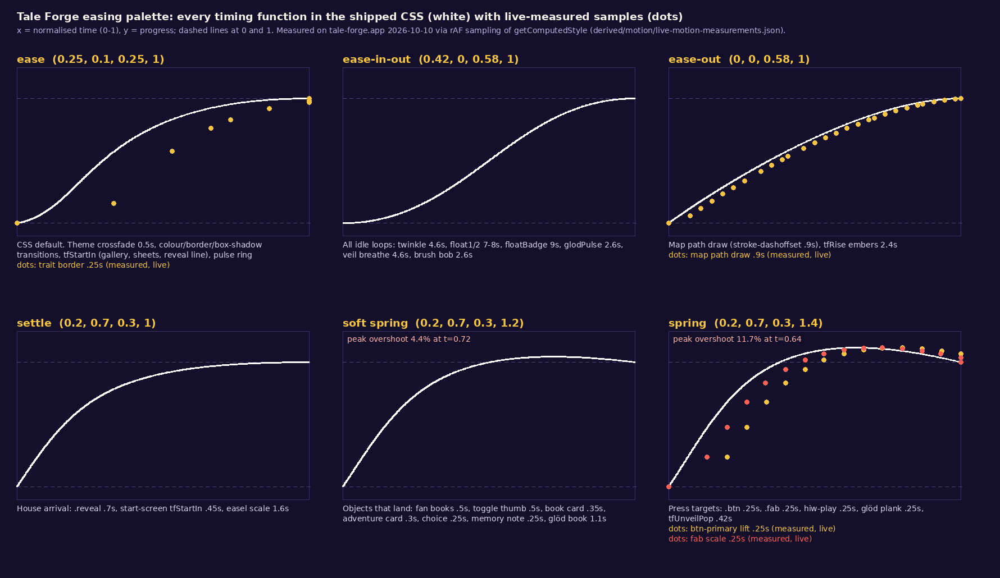
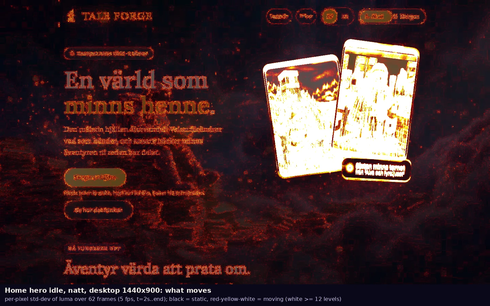
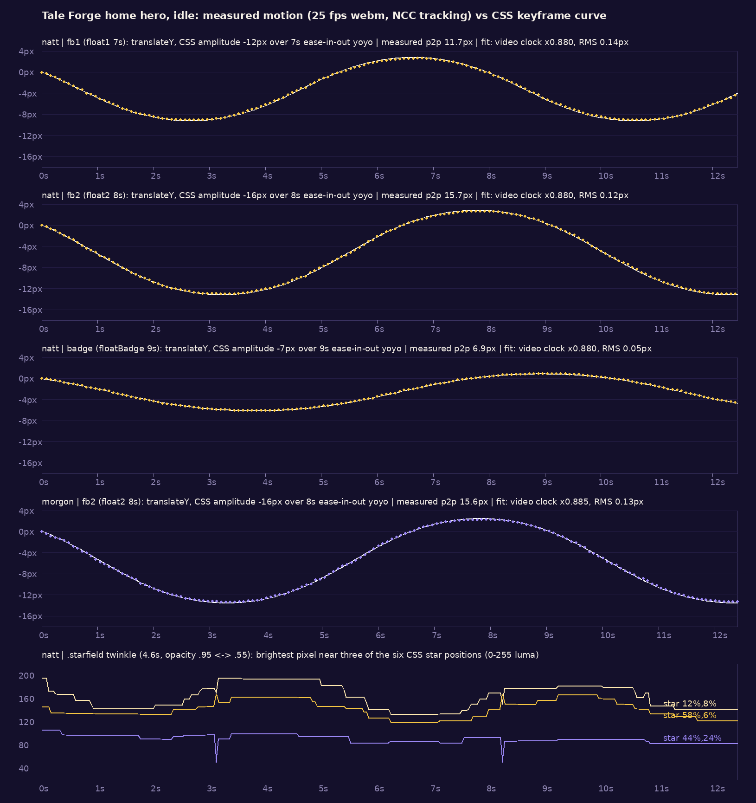

# 09 · Motion and interaction

Tale Forge moves like a bedtime room: slow, floaty loops that breathe (4.6 to 9 s cycles, 7 to 16 px of drift, never faster than 7 px/s), one sprung "lift" for anything you can press, and a few staged set-pieces (a story map that draws itself, a portrait unveiled under a veil, a canvas fire that bakes the book).
This file holds the literal material: every `@keyframes` (17), every transition (108 items) and animation declaration (41), every reduced-motion rule, and the JS that times things (IntersectionObserver, `setInterval`, `requestAnimationFrame`, canvas formulas).
It also holds measurements: the idle loops tracked in video to ±0.13 px, hover curves sampled frame by frame on the live site, the map's timeline, and live reduced-motion checks.
It ends with a Motion Spec for film (Remotion / After Effects) and Remotion-ready tokens ([derived/motion/motion-tokens.ts](../derived/motion/motion-tokens.ts)).
The onboarding unveil and the glöd waiting fire are covered in depth in [05b](05b-components-app-and-forms.md). The theme crossfade is covered frame by frame in [06](06-theming-and-atmosphere.md#7-the-crossfade-between-themes-measured). This file summarises both and links to them.

## Contents

0. [Sources, method and caveats](#0-sources-method-and-caveats)
1. [At a glance](#1-at-a-glance)
2. [The timing system: durations and curves](#2-the-timing-system-durations-and-curves)
3. [Idle loops: what moves when nobody touches anything](#3-idle-loops-what-moves-when-nobody-touches-anything)
4. [Hover, press and focus](#4-hover-press-and-focus)
5. [Theme switch (natt ⇄ morgon)](#5-theme-switch-natt--morgon)
6. [Scrolling and the dormant `.reveal`](#6-scrolling-and-the-dormant-reveal)
7. [The story map: a path that draws itself](#7-the-story-map-a-path-that-draws-itself)
8. [Language switch](#8-language-switch)
9. [/start: screens, gallery, veil and unveil](#9-start-screens-gallery-veil-and-unveil)
10. [The glöd canvas: a procedural fire](#10-the-glöd-canvas-a-procedural-fire)
11. [Other timers: polling, page turns, sound beds, torn edges](#11-other-timers-polling-page-turns-sound-beds-torn-edges)
12. [Reduced motion](#12-reduced-motion)
13. [Motion Spec for film](#13-motion-spec-for-film)
14. [Read: the motion personality](#14-read-the-motion-personality)
15. [Files produced for this dimension](#15-files-produced-for-this-dimension)
16. [Uncertainties](#16-uncertainties)

---

## 0. Sources, method and caveats

| Evidence | What it is | Where |
|---|---|---|
| CSS | The four prettified stylesheets, parsed rule by rule. Every `@keyframes`, `transition`, `animation` and stateful selector was extracted with its line numbers. | [source/css/](../source/css/) → [keyframes.css](../derived/motion/keyframes.css), [timing-table.csv](../derived/motion/timing-table.csv), [interaction-states.csv](../derived/motion/interaction-states.csv), [reduced-motion.css](../derived/motion/reduced-motion.css), [css-motion-inventory.json](../derived/motion/css-motion-inventory.json) |
| JS | The chunks in [source/js/](../source/js/), read as text and never executed. Timers, observers, rAF loops and canvas formulas were located and then copied verbatim (prettier-formatted). | [js-timing-hooks.csv](../derived/motion/js-timing-hooks.csv) (35 hooks with byte offsets), [js-motion-excerpts.js](../derived/motion/js-motion-excerpts.js) (each excerpt has a grep anchor) |
| Harvest | `document.getAnimations()` at load, for 8 pages | [source/rendered/running-animations__*.json](../source/rendered/) |
| Video | The harvested webm files (hero idle 12 s, home scroll) and five new clips recorded for this file | [screenshots/motion/](../screenshots/motion/), [derived/motion/clips/](../derived/motion/clips/) |
| Live sampling | Playwright on tale-forge.app (2026-10-10, 1440×900, cookie `tf_locale=sv`). `getComputedStyle` was sampled every animation frame during hover-in and hover-out. The map's classes, dash offsets and opacities were logged for 26 s. `getAnimations()` was dumped on /start. Language switch timing was measured, and the site was loaded with `reducedMotion: 'reduce'` | [live-motion-measurements.json](../derived/motion/live-motion-measurements.json), [reduced-motion-live-check.json](../derived/motion/reduced-motion-live-check.json) |

**Caveat on video timing.** Playwright's screencast does not run at real speed. When the tracked float curves are fitted against the CSS keyframes, the recorded webm runs at **0.88× real time** (fit factor 0.880 for all three floats, 0.885 in morgon; [hero-idle-fit.json](../derived/motion/hero-idle-fit.json)). Durations read off any webm in this library are therefore about 13 % too long. Take timing from the CSS/JS or the rAF samples. Take shape, amplitude and order from the videos. The `t=` stamps on the strips are video time.

**Caveat on the harvested theme-toggle frames.** `screenshots/motion/theme-toggle-natt-to-morgon__t000ms…t640ms.png` are already fully morning from the first frame because of capture latency (also noted in [06 §7](06-theming-and-atmosphere.md#7-the-crossfade-between-themes-measured)). The real crossfade was captured by pausing and seeking transitions in [derived/theming/crossfade/](../derived/theming/crossfade/).

---

## 1. At a glance

| Fact | Value | Source |
|---|---|---|
| `@keyframes` | 17: 5 global (`twinkle`, `float1`, `float2`, `floatBadge`, `pulse`), 4 glöd (`glodPulse`, `glodMemBob`, `glodEmberBreath`, `glodActiveEmberGlow`), 8 onboarding (`tfStartIn`, `tfBrushBob`, `tfSweep`, `tfRise`, `tfVeilBreathe`, `tfVeilDrift`, `tfVeilCaption`, `tfUnveilPop`); none in `2h1wwdz1nvxwk` | [keyframes.css](../derived/motion/keyframes.css) |
| Transition items | 108 (75 global, 22 glöd, 9 onboarding, 2 create-sheet). 11 have zero duration: 9 `transition: none` overrides and 2 `visibility 0s linear <delay>` | [timing-table.csv](../derived/motion/timing-table.csv) |
| Animation declarations | 41 (24 onboarding, 9 global, 8 glöd), including the `animation: none` overrides | same |
| Reduced-motion blocks | 6 (1 `no-preference`, 5 `reduce`) | [reduced-motion.css](../derived/motion/reduced-motion.css) |
| Most common duration | **0.5 s** (40 of 97 non-zero transitions): the theme token `--theme-transition-duration` and the colour fades | [3q17cp_jgfwol.pretty.css:470-471](../source/css/3q17cp_jgfwol.pretty.css) |
| House curves | `ease` (default), `ease-in-out` (all loops), `cubic-bezier(.2,.7,.3,1)` "settle", `…,1.2)` "soft spring", `…,1.4)` "spring" | §2 |
| Idle loops on / | 6 running animations: twinkle 4.6 s, float1 7 s, float2 8 s, floatBadge 9 s, pulse 2.4 s ×2 | [running-animations__home.json](../source/rendered/running-animations__home.json) |
| Idle loops elsewhere | /start: 5 (same fan). Every other page (login, signup, uppgradera, integritet, villkor, 404): only the starfield twinkle | [running-animations__*.json](../source/rendered/) |
| Peak idle speed | 6.9 px/s (the right cover, `float2`) | computed from CSS, §3.2 |
| Fan composition repeats | every 504 s (LCM of 7, 8, 9 s). With the twinkle it repeats only every 11 592 s (3.2 h) | §3.2 |
| Press lift | −3 px on a 0.25 s spring that peaks at −3.35 px (+11.6 %) | §4, measured |
| Scroll-triggered reveal | **none in practice**. `.reveal` exists, but all three sections ship already `.in` | §6 |
| JS-timed motion | story map (0.6 s after 40 % visible, then every 4.5 s), unveil (0 / 1.1 / 2.6 / 3.3 / 4.1 s), glöd canvas (rAF, sines) | §7, §9, §10 |
| Exit animations | none. Screens, galleries, sheets and language changes cut out and the new state fades or slides in | §8, §9 |

---

## 2. The timing system: durations and curves

### 2.1 Curves



*[derived/motion/easing-palette.png](../derived/motion/easing-palette.png): every timing function in the shipped CSS (white), with dots measured on the live site. The `btn-primary` lift and the `fab` scale sit on the spring, the map path draw sits on `ease-out`, and the trait border sits on `ease`. The dots lag the curve slightly at the start because sampling is quantised to frames: the sampler anchors on the frame before the first change.*

| Name used here | Value | Shape (computed) | Used for |
|---|---|---|---|
| `ease` (CSS default) | `cubic-bezier(.25,.1,.25,1)` | 50 % at t = .29, 90 % at t = .62 | theme crossfade (`--theme-transition-easing: ease`), colour/border/shadow fades, `tfStartIn` on gallery, sheets, paint pill and reveal line, `pulse`, `tfSweep` |
| `ease-in-out` | `cubic-bezier(.42,0,.58,1)` | symmetric, peak slope 1.72 | **every looping idle animation**: `twinkle`, `float1/2`, `floatBadge`, `glodPulse`, `glodMemBob`, `glodEmberBreath`, `glodActiveEmberGlow`, `tfBrushBob`, `tfVeilBreathe/Drift/Caption` |
| `ease-out` | `cubic-bezier(0,0,.58,1)` | 50 % at .34 | map path draw (`stroke-dashoffset .9s ease-out`), `tfRise` embers |
| settle | `cubic-bezier(.2,.7,.3,1)` | 50 % at .16, 90 % at .48: a fast arrival with a long settle | `.reveal` (.7 s), `.start-screen` `tfStartIn` (.45 s), easel `transform 1.6s` |
| soft spring | `cubic-bezier(.2,.7,.3,1.2)` | overshoots **4.4 %** at t = .72 | objects that land: `.fan .fbook` (.5 s), `.tt-thumb` (.5 s), `.book` (.35 s), `.adv` (.3 s), `.choice` (.25 s), `.glod-mem` (.25 s), `.glod-book` (1.1 s) |
| spring | `cubic-bezier(.2,.7,.3,1.4)` | overshoots **11.7 %** at t = .64 | things you press: `.btn` (.25 s), `.builder-pic .fab` (.25 s), `.hiw-play` (.25 s), `.glod-open` (.25 s), `tfUnveilPop` (.42 s) |
| glöd JS ease | `t<.5 ? 2t² : 1-(-2t+2)²/2` (easeInOutQuad) | symmetric | canvas ember lift (0.9 s) and settle (1.2 s) ([js-motion-excerpts.js](../derived/motion/js-motion-excerpts.js), `1pgfdvt65g9p-` L130-132) |

**Per-keyframe easing.** In every loop the timing function applies **between keyframes**, not over the whole cycle. So `0% → 50% → 100%` with `ease-in-out` is two eased halves: the motion stops dead at the top and at the bottom, like a pendulum that pauses. `getAnimations()` therefore reports effect easing `linear`, while each keyframe carries `ease-in-out`. Both the /start dump ([live-motion-measurements.json](../derived/motion/live-motion-measurements.json) `start.at_load[*].kf[*].easing`) and the running-animations harvest ([source/rendered/running-animations__home.json](../source/rendered/running-animations__home.json) `timing.easing: "linear"`) show this.

### 2.2 Durations

| Band | Values (s) | What lives there |
|---|---|---|
| Micro | 0.18, 0.2, 0.25 | ember-core hover (.18), map medallion and opacity (.2), press lifts, traits, choices (.25) |
| Short | 0.3, 0.35, 0.4, 0.42, 0.45 | shadows (.3), book lift and sheets (.35), gallery and paint pill (.4), unveil pop (.42), screen enter (.45) |
| Theme | **0.5** | everything that changes with natt/morgon (`--theme-transition-duration`) |
| Reveal | 0.6, 0.7, 0.9 | onboarding reveal actions/line (.6/.7), `.reveal` (.7), map path draw and glöd hearth/caption fades (.9) |
| Ceremony | 1.1, 1.3, 1.5, 1.6, 2.4, 2.6 | glöd book (1.1), sheen sweep (1.3), easel filter/scale (1.5/1.6), embers rising (2.4), active ember moving to a new fire level (2.6) |
| Loops | 2.0, 2.4, 2.6, 2.8, 4.6, 4.8, 5.4, 7, 8, 9 | ember breath (2), gold pulse (2.4), status dot and brush (2.6), active ember glow (2.8), twinkle and veil breathe (4.6), memory bob (4.8), veil specks (5.4), hero fan (7/8/9) |
| JS beats | 0.3, 0.46, 0.6, 0.9, 1.0, 1.1, 1.5, 2.6, 4.5, 6 | map fade hand-off (.3), ready-pop window (.46), map first draw delay (.6), reader auto-advance and ember lift (.9), book open (1.0), unveil phases (1.1 / 2.6), unveil actions (+1.5), map cycle (4.5), map resume (6) |

---

## 3. Idle loops: what moves when nobody touches anything

### 3.1 What moves on the home page



*[hero-idle-what-moves__natt__desktop.webp](../derived/motion/hero-idle-what-moves__natt__desktop.webp): per-pixel temporal standard deviation of luma over the 12 s idle video (5 fps, after load), drawn as heat over a dimmed frame. Only the two covers and the badge move clearly. The faint red on text and the painting is codec noise. The six stars are too small to register at this scale (they are tracked in §3.3). Morning version: [hero-idle-what-moves__morgon__desktop.webp](../derived/motion/hero-idle-what-moves__morgon__desktop.webp).*

The backdrop painting does not move at all: no parallax, no Ken Burns, no drifting clouds. `.bg` is `position: fixed; height: 100lvh` ([3q17cp_jgfwol.pretty.css:612-622](../source/css/3q17cp_jgfwol.pretty.css)), so the painting stays still while the page scrolls over it. That stillness is the only "parallax" there is.

### 3.2 The cover fan (hero; also /start s0)

Verbatim, [source/css/3q17cp_jgfwol.pretty.css:948-1029](../source/css/3q17cp_jgfwol.pretty.css). The `.fan .badge` rule (:980-1000) is abridged to its motion lines in a comment; everything else is byte-for-byte.

```css
.fb1 {
  z-index: 1;
  animation: 7s ease-in-out infinite float1;
  top: 10%;
  left: 6%;
  transform: rotate(-8deg);
}
.fb2 {
  z-index: 2;
  animation: 8s ease-in-out infinite float2;
  top: 2%;
  right: 8%;
  transform: rotate(7deg);
}
@keyframes float1 {
  0%,
  to {
    transform: rotate(-8deg) translateY(0);
  }
  50% {
    transform: rotate(-8.6deg) translateY(-12px);
  }
}
@keyframes float2 {
  0%,
  to {
    transform: rotate(7deg) translateY(0);
  }
  50% {
    transform: rotate(7.6deg) translateY(-16px);
  }
}
/* .fan .badge { … transition: background 0.5s, color 0.5s; animation: 9s ease-in-out infinite floatBadge; … } */
@keyframes floatBadge {
  0%,
  to {
    transform: rotate(2.5deg) translateY(0);
  }
  50% {
    transform: rotate(3deg) translateY(-7px);
  }
}
.badge .dotpulse {
  background: var(--gold);
  border-radius: 50%;
  flex: none;
  width: 10px;
  height: 10px;
  animation: 2.4s infinite pulse;
  box-shadow: 0 0 #f2b22e80;
}
@keyframes pulse {
  0% {
    box-shadow: 0 0 #f2b22e73;
  }
  70% {
    box-shadow: 0 0 0 12px #f2b22e00;
  }
  to {
    box-shadow: 0 0 #f2b22e00;
  }
}
```

**Measured** with normalised cross-correlation tracking in the harvested idle videos (template from t = 2 s, ±24 px search, sub-pixel fit; per-frame series in [hero-idle-tracking__natt.json](../derived/motion/hero-idle-tracking__natt.json) and [__morgon.json](../derived/motion/hero-idle-tracking__morgon.json), fit in [hero-idle-fit.json](../derived/motion/hero-idle-fit.json)):

| Element | CSS amplitude | Measured peak-to-peak | Residual vs CSS curve (after the 0.88 clock fit) | Peak speed (CSS) | Mean speed |
|---|---|---|---|---|---|
| `.fb1` (left cover, behind) | 12 px, 0.6° | 11.7 px | 0.14 px RMS | 5.9 px/s | 3.4 px/s |
| `.fb2` (right cover, front) | 16 px, 0.6° | 15.7 px (morgon 15.6) | 0.12 px RMS (morgon 0.13) | 6.9 px/s | 4.0 px/s |
| `.badge` (glass caption chip) | 7 px, 0.5° | 7.0 px | 0.05 px RMS | 2.7 px/s | 1.6 px/s |



*[hero-idle-measured-vs-css.png](../derived/motion/hero-idle-measured-vs-css.png): tracked vertical position (dots) against the CSS keyframe curve (white line), natt and morgon. The bottom panel shows the brightest pixel near three of the six starfield stars. The stepping comes from the VP8 codec. The 4.6 s twinkle period appears as about 5.2 s because of the 0.88 recording clock.*

Observations:
- All three floats **start in phase** at page load (fitted phase 1.08 to 1.16 s at video t = 2 s for all three). They then drift apart, because 7, 8 and 9 s share no short common period: the fan returns to its starting arrangement only every **504 s**. The rotation (0.5 to 0.6°) is almost invisible. The vertical bob carries the motion.
- The back cover moves less than the front cover (12 vs 16 px), and the small badge moves least (7 px). That reads as depth: nearer things sway more.
- The covers also have a `transition: transform .5s cubic-bezier(.2,.7,.3,1.2)` ([:929-941](../source/css/3q17cp_jgfwol.pretty.css)), but no hover rule targets them, so it never fires on /.
- Frame strips of the fan region at 2 fps: [hero-idle__sv__natt__desktop__fan-crop__2fps.webp](../derived/motion/strips/hero-idle__sv__natt__desktop__fan-crop__2fps.webp), [morgon](../derived/motion/strips/hero-idle__sv__morgon__desktop__fan-crop__2fps.webp). The drift is too gentle to see in stills. Use them with the plot above.

**The gold dot pulse.** A 10 px `--gold` dot sends out a ring that grows to a 12 px spread and fades from alpha .45 to 0 over 70 % of 2.4 s (1.68 s), then rests for 0.72 s. This is the "live" signal: it appears in the hero badge, the how-it-works memory tag (`.hiw-memory-tag .dotpulse`, [:3106-3112](../source/css/3q17cp_jgfwol.pretty.css)), the reader's link-wait (`.reader-link-wait .dotpulse`, [:1876-1882](../source/css/3q17cp_jgfwol.pretty.css)) and the onboarding paint pill ([2_gt301v4m-60.pretty.css:127-133](../source/css/2_gt301v4m-60.pretty.css), 8 px dot).

### 3.3 The starfield (natt only, every page)

Verbatim, [source/css/3q17cp_jgfwol.pretty.css:636-656](../source/css/3q17cp_jgfwol.pretty.css):

```css
.starfield {
  background-image:
    radial-gradient(1.4px 1.4px at 12% 8%, #ffe9b0e6 50%, #0000 51%),
    radial-gradient(1px 1px at 32% 16%, #f5f0e8cc 50%, #0000 51%),
    radial-gradient(1.6px 1.6px at 58% 6%, #f5c542d9 50%, #0000 51%),
    radial-gradient(1px 1px at 76% 12%, #f5f0e8b3 50%, #0000 51%),
    radial-gradient(1.2px 1.2px at 90% 22%, #ffe9b0bf 50%, #0000 51%),
    radial-gradient(1.3px 1.3px at 44% 24%, #9b87f599 50%, #0000 51%);
  animation: 4.6s ease-in-out infinite twinkle;
  position: absolute;
  inset: 0;
}
@keyframes twinkle {
  0%,
  to {
    opacity: 0.95;
  }
  50% {
    opacity: 0.55;
  }
}
```

- These are **six stars**, each 1 to 1.6 px, at fixed viewport percentages: cream (`#ffe9b0`), off-white (`#f5f0e8`), gold (`#f5c542`) and one violet (`#9b87f5`). They sit on top of a painting that already contains hundreds of painted stars. The six all dim together (one layer, one opacity), from .95 to .55 and back over 4.6 s.
- In the video, the brightest star (12 %, 8 %) swings between luma 133 and 196 ([hero-idle-measured-vs-css.png](../derived/motion/hero-idle-measured-vs-css.png), bottom panel). In morgon the starfield sits inside `.bg-night` at opacity 0 ([:667-675](../source/css/3q17cp_jgfwol.pretty.css)). It keeps animating (it is in `getAnimations()` on every page) but cannot be seen: at the same six positions the morgon video varies by at most 9 luma levels, against 63 in natt ([hero-idle-tracking__morgon.json](../derived/motion/hero-idle-tracking__morgon.json) `stars`, [hero-idle-tracking__natt.json](../derived/motion/hero-idle-tracking__natt.json)).
- **Read:** the twinkle is a breath across the whole sky, not a sparkle. A film should keep it as one slow, synchronised dimming of a few highlights. Independent random twinkles would be wrong (the glöd canvas does that, see §10).

---

## 4. Hover, press and focus

### 4.1 The press-target recipe (verbatim)

[source/css/3q17cp_jgfwol.pretty.css:886-917](../source/css/3q17cp_jgfwol.pretty.css). Layout declarations of `.btn` are elided with `…`; the motion lines are byte-for-byte.

```css
.btn {
  …
  transition:
    transform 0.25s cubic-bezier(0.2, 0.7, 0.3, 1.4),
    box-shadow 0.3s,
    background 0.5s,
    color 0.5s;
  display: inline-flex;
}
.btn:active {
  transform: scale(0.96);
}
.btn-primary {
  color: var(--btn-ink);
  background: var(--btn-grad);
  box-shadow:
    var(--btn-shadow),
    inset 0 1px 0 #ffffff73;
}
.btn-primary:hover {
  box-shadow: var(--btn-shadow-hover);
  transform: translateY(-3px);
}
```

Tokens ([:530-531](../source/css/3q17cp_jgfwol.pretty.css) natt, [:579-580](../source/css/3q17cp_jgfwol.pretty.css) morgon):

| Token | natt | morgon |
|---|---|---|
| `--btn-shadow` | `0 14px 40px #f5c54247` (gold, α .28) | `0 14px 34px #6d4fe059` (violet, α .35) |
| `--btn-shadow-hover` | `0 20px 55px #f5c5426b` (α .42) | `0 22px 48px #6d4fe073` (α .45) |

**Measured on the live site** ([live-motion-measurements.json](../derived/motion/live-motion-measurements.json) `hover.natt[".hero .btn-primary"]`, sampler clock): the first moved frame is at 90 ms (−0.73 px), so motion started one frame earlier (about 74 ms). translateY passes −2.04 px at 124 ms, peaks at **−3.348 px** at 240 ms (about 166 ms into the move, +11.6 %; the curve predicts 160 ms and +11.7 %), and is back at exactly −3 px at 324 ms (250 ms into the move). Over 0.3 s the shadow grows from 14 px / 40 px blur to 20 px / 55 px. The **inset top highlight fades out** on hover: `--btn-shadow-hover` has no inset part, so the 1 px white rim goes from α .45 to 0. The button lifts and loses its gloss at the same moment. Peak lift speed is about 44 px/s, roughly 6× the fastest idle loop.

Strip: [home-cta-hover__sv__natt__desktop__15fps.webp](../derived/motion/strips/home-cta-hover__sv__natt__desktop__15fps.webp) (15 fps crop of the hover tour). Rest/hover stills: [rest](../screenshots/states/sv__natt/04_btn.btn-primary_Skapa_er_hj_lte__rest.png) / [hover](../screenshots/states/sv__natt/04_btn.btn-primary_Skapa_er_hj_lte__hover.png). Clip: [home-hover-tour__sv__natt__desktop.webm](../derived/motion/clips/home-hover-tour__sv__natt__desktop.webm). Its markers are in the [.marks.json](../derived/motion/clips/home-hover-tour__sv__natt__desktop.marks.json); Playwright does not draw the cursor.

### 4.2 Every hover/press/active state

All rows come from [interaction-states.csv](../derived/motion/interaction-states.csv) and [timing-table.csv](../derived/motion/timing-table.csv). "Measured" means rAF-sampled on the live site.

| Element | Change on hover / active | Timing | Lines |
|---|---|---|---|
| `.btn-primary` | translateY −3 px; shadow → `--btn-shadow-hover`; inset gloss off | .25 s spring / .3 s ease (measured, above) | 3q17:886-917 |
| `.btn:active` | scale .96 | .25 s spring | 3q17:904-906 |
| `.btn-ghost` | **nothing** (no hover rule; measured: no change in 800 ms) | | 3q17:918-924 |
| `.hiw-play` ("Hör berättarrösten" [Hear the narrator]) | translateY −2 px (measured peak −2.23); shadow → hover; gloss off | .25 s spring / .3 s | 3q17:2804-2828 |
| `.builder-pic .fab` (photo button) | scale 1.1 (measured peak 1.1116) | .25 s spring | 3q17:1185-1205 |
| `.book` (bookshelf card) | translateY −10 px, rotate −1° (measured peak −10.44 px about 250 ms into the move, +4.4 %, settled at −10 px by 350 ms) | .35 s soft spring; shadow .35 s | 3q17:1485-1503 |
| `.adv` (adventure card) | translateY −6 px | .3 s soft spring | 3q17:1537-1546 |
| `.choice` (reader choice) | translateY −3 px, border `--violet-soft`, shadow `0 14px 30px #6d4fe02e` | .25 s soft spring; shadow .25 s; border .2 s | 3q17:1904-1927 |
| `.trait` (pill) | border → `--trait-on-line` (natt α .35 → .6, morgon α .28 → .42, measured) | `all .25s` | 3q17:1223-1246 |
| `.upload`, `.friend-add` | border → `--accent` | .3 s | 3q17:1254-1259, 1339-1344 |
| `.comp-tile` | border → `--trait-on-line` | (no own transition) | 3q17:1349-1351 |
| `.sound-bed`, `.reader-audio-control` | border → `--violet-soft`; `[aria-pressed=true]` fills with `--pill-bg` | .2 s | 3q17:2000-2013, 2067-2069 |
| `.create-customize` | border + `0 6px 24px -14px var(--accent)`; the summary chevron rotates 45° | .3 s; chevron .25 s | 3q17:2389-2446 |
| `.hiw-map-btn` (four ending hotspots) | no visual of its own; hover or focus **drives the map** (§7) | JS | 3q17:3006-3022 |
| `.cs-chip`, `.cs-sheet-close`, `.cs-andra` | border / colour | .25 s | 2h1w:187-193, 302-304, 53-55 |
| `.start-flow .adv` | translateY −6 px | .3 s soft spring | 2_gt:645-658 |
| `.start-flow .pick`, `.stile` | `all .25s` (border on hover, fill when `.on`) | .25 s | 2_gt:167-181, 717-735 |
| `.glod-open` (plank button) | rotate −0.6°, translateY −3 px, warmer shadow; active scale .97 | .25 s spring; shadow/border .3 s | 37m3:982-1051 |
| `.glod-active-ember` (dormant) | core scale 1.22 + brighter glow | .18 s | 37m3:666-694 |
| Style tile (inline style, StylePicker) | selected: `scale(1.02)` + `inset 0 0 0 2px var(--gold), 0 4px 20px -10px var(--gold)` | `transform .2s ease, box-shadow .3s ease` | [source/js/2j_-r8q4tgdka.js](../source/js/2j_-r8q4tgdka.js) (anchor `style-tile-`) |

**No hover feedback at all:** the logo, the nav pills, the language switcher (inline React styles with no transition), the theme toggle (`.tt` has only `:focus-visible`), ghost buttons, chips and the selected `.trait.on` pills. A pixel diff of the harvested rest/hover pairs agrees: only `btn-primary` (23 % of pixels change) and the unselected traits (3.7 %, border only) differ in [screenshots/states/en__morgon/](../screenshots/states/en__morgon/) (the same holds in the other three folders).

**Focus** is an outline, never an animation: `outline: 3px solid var(--accent)` (+ `outline-offset: 3px` and a 6 px halo on `.tt`, [:822-826](../source/css/3q17cp_jgfwol.pretty.css)). Outlines are not transitioned.

**Read:** hover means "lift the object off the table", and how far it lifts depends on its size. Buttons rise 2 to 3 px, story cards 6 px, the bookshelf book 10 px with a 1° tilt. Large objects get the softer spring (1.2) and press targets the bouncier one (1.4). Nothing changes colour on hover except borders. Gold and violet fills stay put.

---

## 5. Theme switch (natt ⇄ morgon)

Covered in full in [06 §7-8](06-theming-and-atmosphere.md#7-the-crossfade-between-themes-measured). The motion essentials, condensed to one line per rule (values verbatim, line numbers in the comments):

```css
:root { --theme-transition-duration: 0.5s; --theme-transition-easing: ease; }        /* 3q17cp_jgfwol.pretty.css:470-471 */
body { transition: background-color var(--theme-transition-duration) var(--theme-transition-easing),
                   color var(--theme-transition-duration) var(--theme-transition-easing); }   /* :598-605 */
.bg  { transition: opacity var(--theme-transition-duration) var(--theme-transition-easing); } /* :612-622 */
.tt-thumb { transition: transform var(--theme-transition-duration) cubic-bezier(0.2, 0.7, 0.3, 1.2),
                        background var(--theme-transition-duration) var(--theme-transition-easing); } /* :785-797 */
body[data-theme="morgon"] .tt-thumb { transform: translate(100%); }                          /* :798-800 */
```

- The night and morning paintings dissolve into each other over **0.5 s `ease`**. The toggle thumb slides one segment on the soft spring (+4.4 % overshoot). Text colours fade on the same curve.
- Gradients (gold or violet buttons, thumb, `.hiw-play`, `.fab`) **snap** at frame 0, because gradients cannot be transitioned. So do text-shadows and the inline-styled nav pills (measured in 06).
- A stored morning theme loads with no flash and no animation: the attribute is set before first paint ([06 §3](06-theming-and-atmosphere.md#3-the-mechanism-literally)).
- References: [filmstrip__natt-to-morgon__desktop.webp](../derived/theming/crossfade/filmstrip__natt-to-morgon__desktop.webp), [motion-curves.png](../derived/theming/crossfade/motion-curves.png), [theme-switch 60 fps video](../derived/theming/crossfade/theme-switch__natt-morgon-natt__desktop__60fps.mp4).

---

## 6. Scrolling and the dormant `.reveal`

The brief assumed a scroll-triggered reveal. The CSS exists ([source/css/3q17cp_jgfwol.pretty.css:1099-1109](../source/css/3q17cp_jgfwol.pretty.css)):

```css
.reveal {
  opacity: 0;
  transition:
    opacity 0.7s cubic-bezier(0.2, 0.7, 0.3, 1),
    transform 0.7s cubic-bezier(0.2, 0.7, 0.3, 1);
  transform: translateY(26px);
}
.reveal.in {
  opacity: 1;
  transform: none;
}
```

**But nothing ever toggles it.** All three home sections ship from the server as `class="reveal in"`: `<section id="sa-funkar-det" class="reveal in hiw">` plus two `<section class="reveal in">` ([source/html/home.sv.html](../source/html/home.sv.html), same in `home.en.html` and the hydrated [dom__home__sv.html](../source/rendered/dom__home__sv.html)). The only `"reveal…"` class names in the JS are the hard-coded `className:"reveal in hiw"` in `ExplainerChapter` ([source/js/3d9nxlx1n5pdy.js](../source/js/3d9nxlx1n5pdy.js)) and the onboarding's own `reveal-line on` / `reveal-name on` / `reveal-actions on` ([source/js/0ad0wel9cyv30.js](../source/js/0ad0wel9cyv30.js)). No IntersectionObserver adds `.in`: the only two observers in the chunks are the story map (§7) and Next.js's link prefetcher (`rootMargin:"200px"`, [source/js/3fiu7rxb0vmhg.js](../source/js/3fiu7rxb0vmhg.js)). Live check: every `.reveal` has computed opacity 1 and transform `none` at load ([reduced-motion-live-check.json](../derived/motion/reduced-motion-live-check.json) `reveal`). [05a §6](05a-components-landing.md#6-så-fungerar-det-how-it-works) and [05a §15](05a-components-landing.md#15-defects-inconsistencies-and-gaps) reach the same conclusion.

What scrolling does produce:
- `html { scroll-behavior: smooth; }` ([:595-597](../source/css/3q17cp_jgfwol.pretty.css)). In-page anchors such as "Se hur det funkar" [See how it works] (`#sa-funkar-det`) glide instead of jumping. The browser-native smooth scroll from the hero to the map (about 2 500 px, almost three viewports; the map card sits at y = 2662 px, [computed-styles__home__sv__natt__desktop.json](../source/rendered/computed-styles__home__sv__natt__desktop.json)) took about 0.7 s of video time ([home-smooth-scrollIntoView-to-map__sv__natt__desktop__10fps.webp](../derived/motion/strips/home-smooth-scrollIntoView-to-map__sv__natt__desktop__10fps.webp)). This is not disabled under reduced motion (§12).
- The fixed painting and the fixed starfield stay still while glass cards slide over them.
- The story map starts drawing when it is 40 % visible (§7). Nothing else on the page responds to scroll.

Strips: [home-slow-scroll__sv__natt__desktop__1fps.webp](../derived/motion/strips/home-slow-scroll__sv__natt__desktop__1fps.webp) (new clip, 90 px wheel steps every 110 ms, [clip](../derived/motion/clips/home-slow-scroll__sv__natt__desktop.webm)). Every section arrives fully formed. The harvested scroll videos ([natt desktop](../derived/motion/strips/home-scroll__sv__natt__desktop__1fps.webp), [natt mobile](../derived/motion/strips/home-scroll__sv__natt__mobile__1fps.webp), [morgon desktop](../derived/motion/strips/home-scroll__sv__morgon__desktop__1fps.webp), [morgon mobile](../derived/motion/strips/home-scroll__sv__morgon__mobile__1fps.webp)) mostly sit on the hero and then jump to the footer, so they show no section transitions either. Their first second is blank white (page loading), and the hero covers appear about 1 s after the text (images decode late).

---

## 7. The story map: a path that draws itself

Section "Så funkar det" [How it works], step 3 "Fyra olika slut" [Four different endings]. A branching map of the sample book (cover → Val 1 → Val 2 → four ending medallions) lights one route at a time, like a pen tracing it.

### 7.1 Logic (JS, verbatim excerpt in [js-motion-excerpts.js](../derived/motion/js-motion-excerpts.js), `3d9nxlx1n5pdy`)

- `let c = ["AA", "AB", "BA", "BB"]`: the four endings, in order.
- Mount: if `prefers-reduced-motion: reduce` matches or IntersectionObserver is missing, it returns early, and route **AA stays drawn statically**. Otherwise `drawn = false` (no route lit).
- `new IntersectionObserver(…, { threshold: 0.4 })`: on the first intersection it disconnects, then `setTimeout(() => { B("AA"); M(); }, 600)`.
- `M()` = `setInterval(() => …B(next), 4500)`: the next ending every **4.5 s**, looping AA → AB → BA → BB → AA.
- `B(e)`: the previous ending is set to `fading`. After **300 ms** `fading` is cleared and that path snaps to `off` (dash offset 1, no transition).
- Hover or focus on an ending hotspot (`onMouseEnter`/`onFocus` → `L(e)`): the loop pauses (`engaged`), that ending is lit, its medallion becomes `.is-active`, and the others go `.is-dimmed`. On leave or blur (`N`), the loop resumes after **6 s** (`setTimeout(…, 6e3)`).

Each lit path is an SVG `<path pathLength="1" strokeDasharray="1" strokeDashoffset={off ? 1 : 0} opacity={lit ? .9 : 0} stroke="url(#…-path)">`, so the CSS transition does the drawing.

### 7.2 CSS (verbatim, [source/css/3q17cp_jgfwol.pretty.css:2931-2996](../source/css/3q17cp_jgfwol.pretty.css); the static dot/diamond/label rules at :2953-2976 are elided)

```css
.hiw-map .map-path {
  stroke: var(--dash-line);
  fill: none;
  stroke-width: 1.6px;
  stroke-dasharray: 0.1 8;
  stroke-linecap: round;
}
.hiw-map .map-path-lit {
  stroke-width: 2.4px;
  fill: none;
}
.hiw-map .map-path-lit--lit {
  transition:
    stroke-dashoffset 0.9s ease-out,
    opacity 0.2s;
}
.hiw-map .map-path-lit--fading {
  transition: opacity 0.25s;
}
.hiw-map .map-path-lit--off {
  transition: none;
}
/* … */
.hiw-map .map-medallion {
  transform-box: fill-box;
  transform-origin: 50%;
  filter: drop-shadow(0 0 18px var(--map-glow));
  transition:
    transform 0.2s,
    opacity 0.2s;
}
.hiw-map .map-medallion.is-active {
  transform: scale(1.05);
}
.hiw-map .map-medallion.is-active .map-medallion-ring {
  stroke-width: 3px;
}
.hiw-map .map-medallion.is-dimmed {
  opacity: 0.55;
}
```

The unlit routes are dotted lines (`stroke-dasharray: .1 8` with round caps gives a row of dots every 8 px). The lit route is a solid gradient line drawn over them.

### 7.3 Measured timeline (live, [live-motion-measurements.json](../derived/motion/live-motion-measurements.json) `map.log`)

| t (ms, page clock) | Event | Path states (AA, AB, BA, BB) |
|---|---|---|
| 13 | at load, below the fold | off, off, off, off (opacity 0) |
| 1504 | `scrollIntoView` (smooth) | |
| 2629 | AA lights: dash 1 → 0.88 (100 ms) → 0.54 (317 ms) → 0.08 (734 ms) → 0 (950 ms); opacity 0 → .9 within 200 ms | lit, off, off, off |
| 7129 | +4500: AB lights, AA fades (.9 → .38 → .01 by 250 ms); AA snaps off at +300 ms | fading, lit, off, off |
| 11629 | +4500: BA | off, fading, lit, off |
| 16112 | +4483: BB | off, off, fading, lit |
| 16552 | hover on ending 3 (BA): immediate switch, medallions `ddAd` | off, off, lit, fading |
| 19118 | leave | |
| 25128 | +6010: dimming cleared, loop resumes | |

Strips: the first draw at 8 fps, [home-hiw-map-first-draw__sv__natt__desktop__8fps.webp](../derived/motion/strips/home-hiw-map-first-draw__sv__natt__desktop__8fps.webp). The line runs left to right through Val 1 and Val 2 to medallion 1, which swells to 1.05. The full loop at 1 fps: [home-hiw-map-loop__sv__natt__desktop__1fps.webp](../derived/motion/strips/home-hiw-map-loop__sv__natt__desktop__1fps.webp). Clip with hover and resume: [home-hiw-map-loop__sv__natt__desktop.webm](../derived/motion/clips/home-hiw-map-loop__sv__natt__desktop.webm).

**Read:** the four endings are shown as one route that redraws and branches, at the slow tempo of turning a page (4.5 s per ending). This is the only place on the landing page where motion explains something rather than decorating it.

---

## 8. Language switch

Clicking SV/EN (cookie `tf_locale`, same URL) re-renders in place: **a hard cut, no transition**. Live: the `h1` changed from "En värld som minns henne." [A world that remembers her.] to "A world that remembers her." **294 ms** after the click. No finite animations were running afterwards ([live-motion-measurements.json](../derived/motion/live-motion-measurements.json) `lang`). In the recording, the whole text layer swaps between two consecutive frames, while the floating covers keep their phase ([home-language-switch__sv-to-en__natt__desktop__25fps.webp](../derived/motion/strips/home-language-switch__sv-to-en__natt__desktop__25fps.webp), [clip](../derived/motion/clips/home-language-switch__sv__natt__desktop.webm)). The language pills are inline-styled and have no transition, so the gold dot jumps from SV to EN in the same frame.

---

## 9. /start: screens, gallery, veil and unveil

The onboarding is documented component by component in [05b §5](05b-components-app-and-forms.md#5-start-the-onboarding-flow-s0-to-s8) and its motion catalogue in [05b §13](05b-components-app-and-forms.md#13-motion-catalogue-for-the-app). The motion grammar:

- **Screens enter, never exit.** `.start-flow .start-screen { animation: 0.45s cubic-bezier(0.2, 0.7, 0.3, 1) tfStartIn; }` ([2_gt301v4m-60.pretty.css:1-13](../source/css/2_gt301v4m-60.pretty.css)): opacity 0 → 1 and translateY 22 px → 0. The old screen is unmounted in one frame. Live: clicking "Skapa er hjälte" [Create your hero] started a 450 ms `tfStartIn` on the new section with keyframe easing `cubic-bezier(0.2, 0.7, 0.3, 1)` ([live-motion-measurements.json](../derived/motion/live-motion-measurements.json) `start.after_cta_click`). Strip: [start-step1-enter__sv__natt__desktop__12fps.webp](../derived/motion/strips/start-step1-enter__sv__natt__desktop__12fps.webp): the hero is visible in frame 7, and in frame 8 the step card "Steg 1 av 4 · Hjälten" [Step 1 of 4 · The hero] is already rising in at low opacity.
- **The gallery** ("Läs en exempelbok först" [Read a sample book first]) uses `display: none → grid` plus `animation: 0.4s tfStartIn` (default `ease`) ([:14-23](../source/css/2_gt301v4m-60.pretty.css)). Live: a 400 ms `tfStartIn` on `DIV.gallery.open` ([live-motion-measurements.json](../derived/motion/live-motion-measurements.json) `start.after_gallery_click`). It opens below the fold with a single `.gbook`, and closing is a cut. Overview strip: [start-gallery-and-step__sv__natt__desktop__2fps.webp](../derived/motion/strips/start-gallery-and-step__sv__natt__desktop__2fps.webp), clip [start-gallery-and-step__sv__natt__desktop.webm](../derived/motion/clips/start-gallery-and-step__sv__natt__desktop.webm).
- **Waiting is a veil that breathes.** While the portrait is being painted: `tfBrushBob` (brush icon rotates −8° → 6° and lifts 5 px, 2.6 s), `tfVeilBreathe` (gold glow opacity .42 ↔ .9, scale 1 ↔ 1.06, 4.6 s, `mix-blend-mode: screen`), five `tfVeilDrift` specks rising 56 px over 5.4 s. The specks are staggered by inline `--vd` 0 / 1.4 / 0.7 / 2.1 / 3.0 s at left 24 / 44 / 60 / 78 / 52 % with sizes 4 / 3 / 5 / 3 / 4 px ([source/js/0ad0wel9cyv30.js](../source/js/0ad0wel9cyv30.js), anchor `vl:"24%"`). The caption below breathes with `tfVeilCaption` (opacity .72 ↔ 1, 4.6 s), in step with the glow.
- **Ready-pop:** when the portrait arrives, the "Avtäck" [Unveil] button gets `.ready-pop` for 460 ms (`setTimeout(() => k(!1), 460)`) and plays `tfUnveilPop` (.42 s spring: scale .92 → 1.06 → 1, gold halo 0 → 26 px → 0).
- **The unveil timeline** (JS, verbatim in [js-motion-excerpts.js](../derived/motion/js-motion-excerpts.js) `0ad0wel9cyv30` L1585-1617): click → `ph1` at 0 ms → `ph2` at **1100 ms** → `ph3` + 18 embers at **2600 ms** → reveal line at **+700 ms** (3.3 s) → actions at **+1500 ms** (4.1 s). The filters step through `blur(26px) brightness(.22) saturate(0)` → `blur(20px) brightness(.5) saturate(.15)` → `blur(7px) brightness(.85) saturate(.7)` (with a 115° gold sheen sweeping −130 % → 130 % in 1.3 s) → `none`, each over 1.5 s `ease`, while the image scales 1.08 → 1 over 1.6 s settle. Each ember gets `--x` −110…110 px, `--y` −120…−280 px, `--d` 0…0.9 s, `--s` 3…8 px and `left` 35…65 %. Frame-accurate stills and video are in [05b §5.6](05b-components-app-and-forms.md#56-s4-the-easel-and-the-portrait-unveil-liveinjected) and [05b §16.1](05b-components-app-and-forms.md#161-the-unveil-portrait-reveal-about-5-s): [start-s4-unveil__natt__desktop.webm](../screenshots/components/app/start-s4-unveil__natt__desktop.webm), [start-s4-unveil-strip__natt__desktop.webp](../screenshots/components/app/start-s4-unveil-strip__natt__desktop.webp).

---

## 10. The glöd canvas: a procedural fire

`createGlodScene` ([source/js/1pgfdvt65g9p-.js](../source/js/1pgfdvt65g9p-.js), anchor `unlit:0,low:.55,mid:1,high:1.25`) paints the waiting fire ("Väntelden" [the waiting fire], /start s7) on a 2D canvas. It also paints the dim ambient layer behind the reader (`variant: "ambient"`, [05b §7.6](05b-components-app-and-forms.md#76-the-ambient-glöd-layer-behind-the-reader)). Palettes are in [02-color](02-color.md) and [derived/color/glod-canvas-palettes.json](../derived/color/glod-canvas-palettes.json). The motion is all code:

| Part | Formula / number (verbatim in [js-motion-excerpts.js](../derived/motion/js-motion-excerpts.js)) | Feel |
|---|---|---|
| Frame loop | `requestAnimationFrame(eH)`. The ambient variant skips frames closer than **28 ms** (`M && !T && e - ek < 28`, about 36 fps max). dt is clamped to **0.1 s**. The loop stops on `visibilitychange` when hidden and restarts on return | calm, power-aware |
| Canvas resolution | `devicePixelRatio` capped at 2, at 1.25 above 2.4 MP, and at 1 for the ambient variant | |
| Fire level | `{ unlit: 0, low: 0.55, mid: 1, high: 1.25 }`. The flame scale **slews at 0.35 per second** toward the target (`eR += clamp(r − eR, ±0.35·dt)`), so a level change takes 0.7 s (mid → high) to 1.6 s (unlit → low), and 3.6 s from unlit to high | the fire grows, it does not jump |
| Flicker | `0.5 + 0.32·sin(5.7t) + 0.18·sin(2.3t + 1.4)` drives the glow alpha, plus four flame tongues (colours `#c8441f`, `#ef7527`, `#ffab3d`, `#ffe9b8`). Tongue height wobbles ±5.5 % at 2.7 / 3.5 / 4.3 / 5.1 rad/s; sideways sway at 1.6 / 2.2 / 2.9 / 3.4 rad/s, ±6.5 % of flame width for the outer tongue rising to ±17 % for the innermost. Two outer licks at 3.3 and 3.9 rad/s | two incommensurate sines, so it never visibly repeats |
| Coals | glow `0.26 + 0.14·(0.5 + 0.28·sin(3.3t) + 0.22·sin(5.1t + 1))`, each coal `0.62 + 0.38·(0.5 + 0.5·sin(1.7t + ph))` | slow ember breathing |
| Sparks | spawn rate `(2.8 + (scale − 1)·4)·fire` per s while baking (5 per s in the climax), at most **38**, colour `#ffdf9e` plus a soft halo. They rise at 32 to 72 px/s × scene scale with ±4.5 px/s horizontal drift plus `7·sin(ph + 2.1·life)` px/s sway and drag `vy *= 1 − 0.12·dt`. Life 2.4 to 5.2 s, fading with height | lazy, wandering sparks |
| Stars (sky) | 130 stars, of which **14 twinkle independently**: alpha `0.3 + 0.55·(0.5 + 0.5·sin(t·sp + ph))`, `sp` 0.6 to 2.0 rad/s (periods 3 to 10 s), 28 % warm `#ffe3a8`, the rest `#e9e4f5` | unlike the landing's synchronised twinkle |
| Memory embers (dormant) | drift `x = 8·sin(.7φ + i) + 10·sin(.19φ + 2i)`, `y = 6·sin(1.1φ) + 13·sin(.23φ)`, brightness `.74 + .26·sin(2.1φ)`. Lift to the card over 0.9 s, settle back over 1.2 s, both easeInOutQuad | floating |
| Climax (dormant in /start) | `startClimax()` 500 ms after the finale state: **flare** (fire ×1 → 2.1 over 0.8 s) → **swirl** (sparks fly to the book outline; `onBookVisible` at 1.2 s) → **book** (`onCaptionVisible` at 2.3 s; fire decays `2.1 − 0.6·t`) | the book forged from sparks ([05b §6.6](05b-components-app-and-forms.md#66-the-finale-the-book-forged-from-sparks-dormant-in-start)) |
| Reduced motion | `T = true` zeroes every sine (`i = +!T`), sets flicker to 0.5, spawns no sparks and fixes the coals at 0.8. The ambient variant draws one frame and stops (`M && T && eL()`). The waiting-fire variant keeps the loop running but static. Climax thresholds shrink to 0.2 / 0.4 s | |

CSS loops on the same stage ([37m388zf6rymp.pretty.css](../source/css/37m388zf6rymp.pretty.css)): `glodPulse` (status dot and active step dot: scale 1 ↔ 1.25, opacity .85 ↔ 1, 2.6 s, [:182-201](../source/css/37m388zf6rymp.pretty.css), [:290-295](../source/css/37m388zf6rymp.pretty.css)). The dormant `glodMemBob` (memory note y 0 ↔ −5 px, rotate 0 ↔ .4°, 4.8 s; paused while the note is shown, [:443-463](../source/css/37m388zf6rymp.pretty.css)), `glodEmberBreath` (2 s) and `glodActiveEmberGlow` (2.8 s). The finale book fades in over 1.1 s from scale .92 at −1.2° (soft spring, [:801-815](../source/css/37m388zf6rymp.pretty.css)), and the caption follows after a 0.2 s delay over 0.9 s ([:947-969](../source/css/37m388zf6rymp.pretty.css)). On narrow screens the sign lifts away at the climax: `translateY(-130%) scale(.92)`, opacity .3 s, transform .35 s ([:344-361](../source/css/37m388zf6rymp.pretty.css)).

Real-time reference: [start-s7-glod-sequence__natt__desktop.webm](../screenshots/components/app/start-s7-glod-sequence__natt__desktop.webm) (from 05b). The canvas was not re-recorded here.

---

## 11. Other timers: polling, page turns, sound beds, torn edges

From [js-timing-hooks.csv](../derived/motion/js-timing-hooks.csv) (35 hooks):

| Timer | Value | Effect | Source |
|---|---|---|---|
| Job status poll | `setInterval(…, 2500)`; 4 failures → "stuck" | the waiting sign's steps advance on poll results, so step changes land on a 2.5 s grid | `2j_-r8q4tgdka.js` @3785 |
| Capacity poll | `setInterval(…, 2e4)` (20 s) | | `2j_` @4346 |
| Book ready → open | `setTimeout(…, 1e3)` after cover and critical path are ready | a 1 s beat before the finished book opens | `2j_` @3685 |
| Glöd note ember | `setTimeout(() => e.liftFirstEmber(), 900)` | | `2j_` @39847 |
| Glöd climax | `setTimeout(() => e.startClimax(), 500)` | | `2j_` @40004 |
| Reader page poll | `setInterval(r, 2500)` | | `36tbz-w9v-p8v.js` @23760 |
| Reader auto-advance | `setTimeout(…X(e.toPageId)…, 900)` after narration ends, when the page has exactly one onward link | a 0.9 s breath between narrated pages | `36tbz` @26688 |
| Sound bed release | `claimBed` releases with `setTimeout(() => 0 === d && s?.pause(), 400)` | **no audio fades anywhere**: beds start and stop at full set volume (default **0.18**, max **0.4**). The 400 ms grace avoids a stop/start when one view hands over to another | `1pgfdvt65g9p-.js` @37332 |

**`decklePages` and `tornScrap`**, next to `AMBIENT_BEDS` in the same chunk, are **not animation**. They are seeded generators for static `clip-path: polygon(…)` shapes. `decklePages` makes the right edge of a page block ragged (15 points at 73 to 97 % x). `tornScrap` makes torn parchment edges (9 + 8 + 8 + 7 points around the four sides; edge depth normally 0.3 to 1.2 × a base of 1.7 to 2.6 %, with a 20 % chance per point of a deeper tear at 2 to 3.2 × the base). They run once per element ([js-motion-excerpts.js](../derived/motion/js-motion-excerpts.js), L2094-2141). Sound beds: six 30 s loops in [assets/audio/atmosphere/v1/](../assets/audio/atmosphere/v1/) (`hearth`, `rain`, `forest`, `musicbox`, `harp`, `fire`; labels Brasa / Fönsterregn / Sagoskogen / Speldosa / Månharpa / Glödljus [Fireplace / Window rain / Enchanted forest / Music box / Moonlit harp / Ember glow]).

---

## 12. Reduced motion

All six blocks, verbatim: [derived/motion/reduced-motion.css](../derived/motion/reduced-motion.css). The global one ([3q17cp_jgfwol.pretty.css:2349-2372](../source/css/3q17cp_jgfwol.pretty.css)):

```css
@media (prefers-reduced-motion: reduce) {
  .fb1,
  .fb2,
  .badge,
  .dotpulse,
  .starfield {
    animation: none;
  }
  body,
  .bg,
  .tt,
  .tt-thumb,
  .tt-opt {
    transition: none;
  }
  .reveal {
    opacity: 1;
    transition: none;
    transform: none;
  }
  .comp-chosen {
    transition: none;
  }
}
```

The JS also checks `matchMedia("(prefers-reduced-motion: reduce)")` in four places: the story map (stays on AA, no loop), the unveil (skips the phases and embers, shows the result at once), and the glöd scene on /start and in the reader (`reducedMotion` flag, §10).

**Live check** (`reducedMotion: 'reduce'`, [reduced-motion-live-check.json](../derived/motion/reduced-motion-live-check.json)):

| | no-preference | reduce |
|---|---|---|
| Running animations on / | twinkle, float1, float2, floatBadge, pulse ×2 | **floatBadge, pulse** (×1) |
| Map | off until 40 % visible, then draws and cycles | AA drawn at load, never cycles |
| `.btn` transition | spring lift | **unchanged** (no reduce rule) |
| `html` scroll-behavior | smooth | **still smooth** |

**Defect: a specificity leak.** `.badge` and `.dotpulse` (specificity 0,1,0) in the reduce block lose to the original rules `.fan .badge` and `.badge .dotpulse` (0,2,0), which set the animation. So under reduced motion the hero badge keeps floating and its gold dot keeps pulsing. On / and /start, the badge float and the hero pulse remain. The second `.dotpulse` on / (`.hiw-memory-tag`) is stopped by its own 0,2,0 rule ([:3213-3227](../source/css/3q17cp_jgfwol.pretty.css)). Button lifts and smooth scrolling are not reduced either. The onboarding, glöd and create blocks are scoped correctly (`.start-flow …`).

---

## 13. Motion Spec for film

Machine-readable: [derived/motion/motion-spec.json](../derived/motion/motion-spec.json) (26 motifs). Remotion helpers: [derived/motion/motion-tokens.ts](../derived/motion/motion-tokens.ts) (`EASE`, `DUR`, `yoyo`, `heroIdle`, `pulseRing`, `fadeUp`, `hoverLift`, `pathDraw`, `themeMix`, `emberRise`). Frames are given at **30 fps** (multiply by 2 for 60 fps). All loops use per-segment easing (§2.1).

### 13.1 Per motif

| Motif | Property | Amplitude | Duration (s / f@30) | Curve | Loop / stagger |
|---|---|---|---|---|---|
| Night sky breath | opacity of a few bright highlights (one layer) | .95 ↔ .55 | 4.6 / 138 | ease-in-out per half | infinite, all in sync |
| Front cover float | translateY, rotate | 0 ↔ −16 px, 7° ↔ 7.6° | 8 / 240 | ease-in-out per half | infinite; starts in phase with the others |
| Back cover float | translateY, rotate | 0 ↔ −12 px, −8° ↔ −8.6° | 7 / 210 | ease-in-out | infinite |
| Caption chip float | translateY, rotate | 0 ↔ −7 px, 2.5° ↔ 3° | 9 / 270 | ease-in-out | infinite |
| Live dot | ring spread, alpha | 0 → 12 px, .45 → 0 (`#f2b22e`) | 2.4 / 72 (ring 1.68 s, rest .72 s) | ease per segment | infinite |
| Press lift | translateY + shadow | −3 px (peak −3.35); shadow 14/40 → 20/55 px, α .28 → .42; inset gloss off | .25 / 7.5 (shadow .3 / 9) | spring (.2,.7,.3,1.4); shadow ease | once; reverse on leave |
| Press down | scale | .96 | .25 / 7.5 | spring | once |
| Card lift | translateY, rotate | −10 px, −1° (book); −6 px (adventure) | .35 / 10.5; .3 / 9 | soft spring (.2,.7,.3,1.2) | once |
| Theme dissolve | crossfade of plates + text colours | 0 → 1 | .5 / 15 | ease | once; gradients cut at f0 |
| Toggle thumb | translateX | one segment (100 %) | .5 / 15 | soft spring | once |
| Map route draw | stroke trim (path length 0 → 1), opacity 0 → .9 | full path | 0.9 / 27 (opacity .2 / 6) | ease-out | first draw 0.6 s / 18 f after 40 % visible; next route every 4.5 s / 135 f; previous fades 0.25 s / 7.5 f |
| Ending medallion | scale / opacity | 1.05 active; .55 dimmed | .2 / 6 | ease | with the route |
| Screen enter | opacity, translateY | 0 → 1, 22 → 0 px | .45 / 13.5 | settle (.2,.7,.3,1) | once; no exit (cut) |
| Sheet / gallery enter | same | same | .35-.4 / 10.5-12 | ease | once |
| Veil breathe | glow opacity, scale | .42 ↔ .9, 1 ↔ 1.06 | 4.6 / 138 | ease-in-out | infinite, with the caption .72 ↔ 1 |
| Veil specks | translateY, scale, opacity | 0 → −56 px, .75 → 1 → .7, 0 → .7 → 0 | 5.4 / 162 | ease-in-out | 5 specks, delays 0 / 1.4 / 0.7 / 2.1 / 3.0 s |
| Brush bob | rotate, translateY | −8° ↔ 6°, 0 ↔ −5 px | 2.6 / 78 | ease-in-out | infinite |
| Unveil | blur / brightness / saturate / scale | 26→20→7→0 px, .22→.5→.85→1, 0→.15→.7→1, 1.08→1 | phases at 0 / 1.1 / 2.6 s (0 / 33 / 78 f), each 1.5 s; scale 1.6 s | ease; scale settle | once |
| Gold sheen | translateX of a 115° band | −130 % → 130 % | 1.3 / 39 | ease | once at phase 2 |
| Ember burst | translate, opacity | x ±110, y −120…−280 px; 0 → .95 (12 %) → 0 | 2.4 / 72 | ease-out | 18 embers, random delay 0-0.9 s (0-27 f) |
| Unveil button pop | scale, gold halo | .92 → 1.06 → 1; 0 → 26 px → 0 | .42 / 12.6 | spring | once |
| Fire | flicker sines, sparks | see §10 | continuous | sines | never repeats |
| Fire level change | flame scale | 0 / .55 / 1 / 1.25 | 0.35 units per s | linear slew | on state change |

### 13.2 After Effects conversion

For a two-keyframe move of Δ over T seconds, `cubic-bezier(x1, y1, x2, y2)` maps to: outgoing influence = x1 × 100 %, outgoing speed = (y1 / x1) × Δ/T; incoming influence = (1 − x2) × 100 %, incoming speed = ((1 − y2) / (1 − x2)) × Δ/T.

| Curve | Out influence | Out speed | In influence | In speed |
|---|---|---|---|---|
| ease (.25,.1,.25,1) | 25 % | 0.4 × Δ/T | 75 % | 0 |
| ease-in-out (.42,0,.58,1) | 42 % | 0 | 42 % | 0 |
| ease-out (0,0,.58,1) | 0.1 % (minimum) | 1.72 × Δ/T | 42 % | 0 |
| settle (.2,.7,.3,1) | 20 % | 3.5 × Δ/T | 70 % | 0 |
| soft spring (.2,.7,.3,1.2) | 20 % | 3.5 × Δ/T | 70 % | −0.29 × Δ/T → use 3 keys: 0, **104.4 % at 72 %** of T, 100 % |
| spring (.2,.7,.3,1.4) | 20 % | 3.5 × Δ/T | 70 % | −0.57 × Δ/T → use 3 keys: 0, **111.7 % at 64 %** of T, 100 % |

For loops, set keyframes at 0 / 50 / 100 % of the period with 42 %/0 ease on every key (ease-in-out per segment) and use `loopOut("cycle")`.

### 13.3 Shot recipes

1. **Hero idle plate (any length).** Night painting held still. Two framed covers (5 px `--frame` border, r 20 px) and a glass chip float with the three loops above, all starting at frame 0. Six 1 to 1.6 px highlights breathe .95 ↔ .55 every 4.6 s. One gold dot pulses every 2.4 s. Nothing else moves. The camera does not move.
2. **"Press" beat.** Cursor arrives (cursor ease is free). Button rises 3 px in 7.5 frames with an 11.7 % overshoot, the shadow deepens over 9 frames, and the white top-rim gloss fades out. On click: scale .96 on the same spring, then release.
3. **Choice → endings.** Dotted routes visible (dots every 8 px). The lit route draws left to right in 27 frames ease-out, its medallion swells to 1.05 in 6 frames, holds 108 frames, then the next route draws while the previous fades over 7.5 frames. A full cycle of four endings is 18 s.
4. **Night → morning.** Dissolve the finished frames over 15 frames `ease` (not the mixed state the site shows, see [06 §7](06-theming-and-atmosphere.md#7-the-crossfade-between-themes-measured)). The thumb slides with the soft spring. Stars stop being visible.
5. **Unveil.** Use [05b §16.1](05b-components-app-and-forms.md#161-the-unveil-portrait-reveal-about-5-s) frame by frame, with the button pop 14 frames before.
6. **Waiting fire.** Canvas fire with two-sine flicker (5.7 and 2.3 rad/s), up to 38 sparks drifting up for 2.4 to 5.2 s, 14 independently twinkling stars, and a fire that grows in steps over 1 to 3 s. Recipe in [05b §16.2](05b-components-app-and-forms.md#162-the-waiting-fire-book-baking).
7. **Transitions between scenes.** The site's own grammar is a **cut followed by a 0.45 s settle-in from 22 px below**. No slides sideways, no zooms, no wipes.

---

## 14. Read: the motion personality

- **Bedtime tempo.** Loops last 4.6 to 9 s, while UI responses last 0.25 s. The ratio between the slow world and the fast hand is about 30:1. The world breathes and only touched things react quickly. Idle drift never exceeds 7 px/s, slower than a lullaby rock.
- **Weightless, layered depth.** Back cover 12 px, front cover 16 px, chip 7 px, each on its own period (7 / 8 / 9 s), so the fan never syncs up and never visibly loops. The painting is a still backdrop, so depth comes only from the floating objects.
- **Pendulum easing.** Every loop eases to a full stop at both ends (ease-in-out per half). It looks like floating, not bouncing.
- **Springs only where a hand is involved.** Overshoot (4.4 % or 11.7 %) is kept for things that are pressed or set down. Ambient motion never overshoots.
- **Light is the effect.** Gold rings that grow and fade, glows that breathe, a gold sheen, embers rising and a path drawing itself. Everything that "happens" is light appearing or travelling. Colour changes are dissolves, never wipes.
- **Patience as craft.** Waiting is staged as breathing (veil 4.6 s, fire, signpost). The map takes 4.5 s per ending. The reader pauses 0.9 s between pages. No spinner turns anywhere on the site.
- **Unfinished edges.** The scroll reveal is wired but dormant. The finale, memory notes and the active ember are written but switched off. Reduced motion leaks the badge float, and there are no exit animations. In practice the shipped site moves less than its CSS suggests.

---

## 15. Files produced for this dimension

| File | What it shows |
|---|---|
| [derived/motion/keyframes.css](../derived/motion/keyframes.css) | All 17 `@keyframes` verbatim, each with source lines and every rule that applies it (duration, easing as bezier, delay, iterations, direction, fill) |
| [derived/motion/timing-table.csv](../derived/motion/timing-table.csv) | 149 rows: every transition item (108) and animation declaration (41), parsed (property, duration, easing + bezier, delay, iteration, fill, raw) |
| [derived/motion/interaction-states.csv](../derived/motion/interaction-states.csv) | 157 declarations in `:hover/:active/:focus*/:disabled/.on/.open/.show/[aria-pressed]` rules |
| [derived/motion/reduced-motion.css](../derived/motion/reduced-motion.css) | The six `prefers-reduced-motion` blocks verbatim |
| [derived/motion/css-motion-inventory.json](../derived/motion/css-motion-inventory.json) | Machine-readable union of the above |
| [derived/motion/js-timing-hooks.csv](../derived/motion/js-timing-hooks.csv) | 35 JS hooks (`setTimeout`/`setInterval` with delay, rAF, IntersectionObserver, reduced-motion checks) with byte offsets and snippets |
| [derived/motion/js-motion-excerpts.js](../derived/motion/js-motion-excerpts.js) | Verbatim prettified excerpts: story map, unveil timeline, glöd canvas loop and formulas, deckle/torn clip-paths, sound beds, polling and page turns |
| [derived/motion/live-motion-measurements.json](../derived/motion/live-motion-measurements.json) | Live rAF samples of hovers (natt and morgon), the 26 s map log, `getAnimations()` on /start, language switch timing |
| [derived/motion/reduced-motion-live-check.json](../derived/motion/reduced-motion-live-check.json) | / and /start with and without `reducedMotion: 'reduce'` |
| [derived/motion/hero-idle-fit.json](../derived/motion/hero-idle-fit.json) | Float tracking vs CSS: measured peak-to-peak, residual, recording clock factor, phase |
| [derived/motion/hero-idle-tracking__natt.json](../derived/motion/hero-idle-tracking__natt.json), [__morgon.json](../derived/motion/hero-idle-tracking__morgon.json) | Per-frame tracked dy of the two covers and the badge (25 fps from t = 2 s), brightest pixel at the six star positions, sky mean |
| [derived/motion/hero-idle-measured-vs-css.png](../derived/motion/hero-idle-measured-vs-css.png) | Plot: tracked float positions vs CSS curves (natt, morgon) and starfield twinkle |
| [derived/motion/hero-idle-what-moves__natt__desktop.webp](../derived/motion/hero-idle-what-moves__natt__desktop.webp), [__morgon__](../derived/motion/hero-idle-what-moves__morgon__desktop.webp) | Heat map of what moves in the idle hero |
| [derived/motion/easing-palette.png](../derived/motion/easing-palette.png) | The six CSS curves with live-measured samples |
| [derived/motion/motion-spec.json](../derived/motion/motion-spec.json) | 26 motifs for film: property, values, duration, curve, loop, stagger, source |
| [derived/motion/motion-tokens.ts](../derived/motion/motion-tokens.ts) | Remotion 4 helpers and constants (`EASE`, `DUR`, `yoyo`, `heroIdle`, `pulseRing`, `fadeUp`, `hoverLift`, `pathDraw`, `themeMix`, `emberRise`) |
| [derived/motion/clips/](../derived/motion/clips/) | New recordings, 1440×900, natt, sv, each with a `.marks.json` of event times: `home-hover-tour` (31 s), `home-hiw-map-loop` (33 s), `home-slow-scroll` (17 s), `start-gallery-and-step` (14 s), `home-language-switch` (12 s) |
| [strips/hero-idle__sv__{natt,morgon}__desktop__fan-crop__2fps.webp](../derived/motion/strips/hero-idle__sv__natt__desktop__fan-crop__2fps.webp) | 24 frames of the fan region at 2 fps from the harvested idle videos |
| [strips/home-scroll__sv__{natt,morgon}__{desktop,mobile}__1fps.webp](../derived/motion/strips/home-scroll__sv__natt__desktop__1fps.webp) | Harvested scroll videos at 1 fps |
| [strips/home-slow-scroll__sv__natt__desktop__1fps.webp](../derived/motion/strips/home-slow-scroll__sv__natt__desktop__1fps.webp) | New wheel-scroll through the whole home page |
| [strips/home-smooth-scrollIntoView-to-map__sv__natt__desktop__10fps.webp](../derived/motion/strips/home-smooth-scrollIntoView-to-map__sv__natt__desktop__10fps.webp) | `scroll-behavior: smooth` in action (hero → map) |
| [strips/home-hiw-map-first-draw__sv__natt__desktop__8fps.webp](../derived/motion/strips/home-hiw-map-first-draw__sv__natt__desktop__8fps.webp) | The first route drawing itself, 8 fps |
| [strips/home-hiw-map-loop__sv__natt__desktop__1fps.webp](../derived/motion/strips/home-hiw-map-loop__sv__natt__desktop__1fps.webp) | 30 s of the map cycling, hover and resume |
| [strips/home-cta-hover__sv__natt__desktop__15fps.webp](../derived/motion/strips/home-cta-hover__sv__natt__desktop__15fps.webp) | Primary CTA lifting on hover |
| [strips/home-language-switch__sv-to-en__natt__desktop__25fps.webp](../derived/motion/strips/home-language-switch__sv-to-en__natt__desktop__25fps.webp) | sv → en as a one-frame cut |
| [strips/start-gallery-and-step__sv__natt__desktop__2fps.webp](../derived/motion/strips/start-gallery-and-step__sv__natt__desktop__2fps.webp) | /start: load, gallery open/close, step 1 enter |
| [strips/start-step1-enter__sv__natt__desktop__12fps.webp](../derived/motion/strips/start-step1-enter__sv__natt__desktop__12fps.webp) | The cut from s0 to s1 and the `tfStartIn` rise |

Scripts (outside the library, in the session scratchpad `tools/motion/`): `inventory.py` + `cssparse.py` (CSS inventory), `js_timers.py`, `excerpts.py`, `track2.py` (NCC tracker), `plot_idle.py`, `motion_map.py`, `easing_palette.py`, `measure.js`, `record.js`, `reduced.js`.

---

## 16. Uncertainties

- **Video timing.** All webm recordings (harvested and new) run at about 0.88× real time. The factor was fitted, not instrumented, and it may vary within a clip (CPU load). The event marks in `clips/*.marks.json` are wall-clock and do not line up exactly with video time.
- **Hover sampling** starts within one frame (about 16.7 ms) of the pointer move. The early points in the easing palette therefore lag, but the peaks and end values are exact.
- **The glöd canvas was read, not re-measured.** The numbers in §10 come from code. The live sequence video is from 05b. Spark speeds scale with the scene's `s` (0.72 to 1.8, from viewport size).
- **The theme-toggle frames** in `screenshots/motion/` do not show the transition (capture latency). This file relies on 06's seeked capture.
- **Behind-login motion** (reader page turns, end ceremony, JobStatus) is inferred from code and from 05b's reconstructions. It was not observed live.
- **`.book` hover and the map** were measured in natt and sv only for the timeline. Morgon hover curves are in the measurements file.
- **Live-site drift.** All live measurements are from 2026-10-10. The site deploys often (the footer shows a version string).
