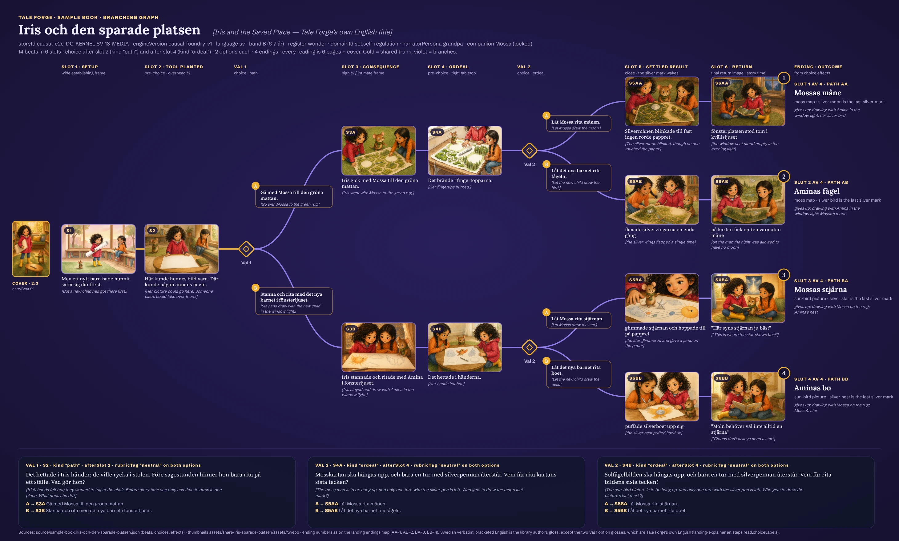
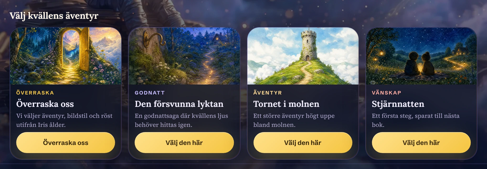
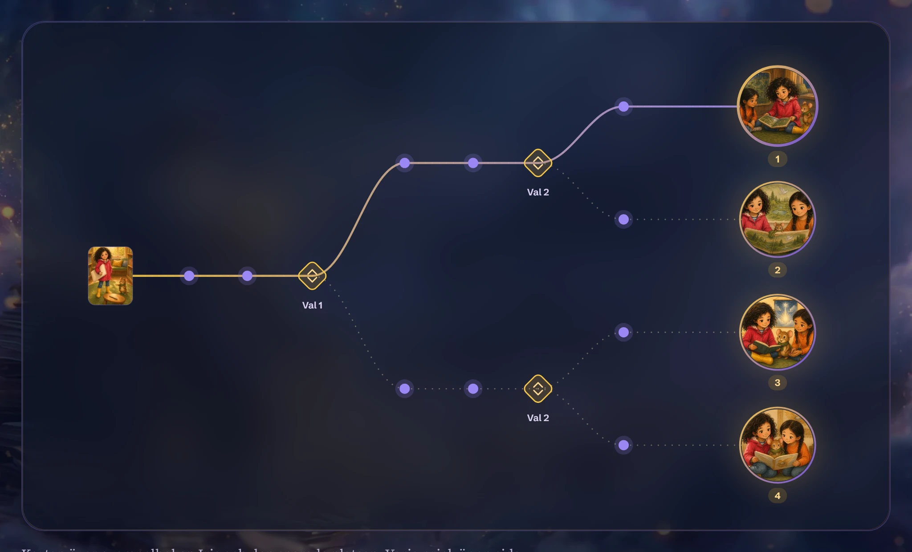

# Tale Forge: Story and content model

Tale Forge sells one idea: a picture book in which your child is the hero, the child makes real choices, and **the world remembers** from book to book. This file looks at that idea as data and as prose, using the only public book, the sample *Iris och den sparade platsen* [Iris and the Saved Place]. Its JSON spans 6 slots and 14 beats, with 2 choices and 4 endings. The prose is plain Swedish past tense for 6–7-year-olds. It names no emotions and turns feelings into hands and fingertips. It is framed as social-emotional learning (`sel.self-regulation`). The file also lists the full content taxonomy mined from the JS: ages, registers, adventure doors, "Surprise us", companions, keepsakes, voices, styles, ambient beds and the world-memory fields. Finally it shows how the landing page stages all of this in six steps and an endings map.

Observed facts cite a library path. Line numbers in `derived/story/js-excerpts/*.pretty.js` refer to verbatim, prettier-formatted copies of single Turbopack modules (the chunk and module id are in each file's header and in [`js-excerpts/index.json`](../derived/story/js-excerpts/index.json)). CSS line numbers refer to [`source/css/3q17cp_jgfwol.pretty.css`](../source/css/3q17cp_jgfwol.pretty.css) unless another file is named. Judgement is marked **Read:**. English glosses in [brackets] are mine. Where an English string is Tale Forge's own, it is marked *(official)*.

## Contents

1. [At a glance](#1-at-a-glance)
2. [The sample book as a data object](#2-the-sample-book-as-a-data-object)
3. [The branching graph](#3-the-branching-graph)
4. [The four paths, read in full](#4-the-four-paths-read-in-full)
5. [Narrative style, measured](#5-narrative-style-measured)
6. [How choices are written](#6-how-choices-are-written)
7. [The social-emotional-learning frame](#7-the-social-emotional-learning-frame)
8. ["The world remembers": the continuity mechanic](#8-the-world-remembers-the-continuity-mechanic)
9. [Content taxonomy](#9-content-taxonomy)
10. [How the landing page dramatises the structure](#10-how-the-landing-page-dramatises-the-structure)
11. [The illustration-brief grammar (a ready shot list)](#11-the-illustration-brief-grammar-a-ready-shot-list)
12. [Reproducing the story style](#12-reproducing-the-story-style)
13. [Files produced for this dimension](#13-files-produced-for-this-dimension)
14. [Caveats and open questions](#14-caveats-and-open-questions)

---

## 1. At a glance

| Aspect | Value | Source |
|---|---|---|
| Sample book | *Iris och den sparade platsen*. Official English title "Iris and the Saved Place" | [`source/sample-book…json`](../source/sample-book.iris-och-den-sparade-platsen.json) `title`; [`landing-explainer…pretty.js:141-143`](../derived/story/js-excerpts/landing-explainer.3d9nxlx1n5pdy.m29416.pretty.js) |
| Engine | `engineVersion` / `textEngine` = `causal-foundry-v1`; `storyId` `causal-e2e-DC-KERNEL-SV-18-MEDIA`; `validation.passed: true` with no findings | JSON top level |
| Shape | 6 slots · 14 beats · 2 choices (after slot 2 `kind:"path"`, after slot 4 `kind:"ordeal"`) · 2 options each · 4 endings · 6 pages per reading + cover | JSON `beats[]`; [`derived/story/graph.json`](../derived/story/graph.json) |
| Reader | `ageBand` B = "6 till 7 år" [6 to 7 years]; hero "sjuårig flicka" [seven-year-old girl] | JSON `spec.child`; [`age-groups…pretty.js:12-27`](../derived/story/js-excerpts/age-groups.2x2s34sgoij7z.m32123.pretty.js) |
| Register / domain | `register: "wonder"` · `domainId: "sel.self-regulation"` | JSON `spec` |
| Length | 1,514 words, 178 sentences, 8.51 words per sentence, LIX 27.8 (easy); about 660–670 words per path | [`derived/story/prose-metrics.json`](../derived/story/prose-metrics.json) |
| Narration | `narratorPersona: "grandpa"` ("Morfar Erik"), Gemini TTS voice *Enceladus*, 53–73 s per page, 6:18–6:35 per path | JSON `beats[].assets.audio`; [`prose-metrics.csv`](../derived/story/prose-metrics.csv) |
| Pictures | Cover 1024×1536 (2:3). Pages 1536×1024 (3:2), except S1 and S4A at 1264×848. One global `styleBlock`: "Warm watercolor and colored-pencil…" | [`graph.json`](../derived/story/graph.json) `nodes[].imageSize`; [`briefs-and-canon.md`](../copy/sample-book/briefs-and-canon.md) |
| Core promise | "Världen minns" [The world remembers]. Footer: "Tale Forge, sagor som minns er värld." [Tale Forge, storybooks that remember your world *(official)*] | [`landing-explainer…pretty.js:67-77`](../derived/story/js-excerpts/landing-explainer.3d9nxlx1n5pdy.m29416.pretty.js); [`copy/pages/home.sv.md`](../copy/pages/home.sv.md) |



*[`derived/story/branch-graph.webp`](../derived/story/branch-graph.webp) (raster, 2920×1760, WebP q90) and [`branch-graph.svg`](../derived/story/branch-graph.svg) (vector, links the page images relatively): every beat, both choice points with their verbatim prompts and options, the four endings with the silver mark each one leaves, and what each ending gives up.*

---

## 2. The sample book as a data object

The book arrives as one JSON document, [`source/sample-book.iris-och-den-sparade-platsen.json`](../source/sample-book.iris-och-den-sparade-platsen.json). The landing chunk also bundles the same JSON as module `19359` and reads it at runtime ([`landing-explainer…pretty.js:12`](../derived/story/js-excerpts/landing-explainer.3d9nxlx1n5pdy.m29416.pretty.js)). Every field is reproduced verbatim in [`copy/sample-book/briefs-and-canon.md`](../copy/sample-book/briefs-and-canon.md).

### 2.1 Top-level fields

| Field | Type / value (verbatim) | Role |
|---|---|---|
| `storyId` | `"causal-e2e-DC-KERNEL-SV-18-MEDIA"` | id. "e2e" suggests a pipeline end-to-end run |
| `createdAt` | `"2026-07-12T16:40:44.936Z"` | timestamp |
| `engineVersion` | `"causal-foundry-v1"` | text engine |
| `spec` | object: `child`, `language`, `companion`, `setting`, `domainId`, `register`, `world`, `premiseAnchor`, `textEngine`, `companionMode` | the **order**: what the parent picked, plus the world memory |
| `pii` | `["spec.child.firstName","spec.companion","canon.hero.name","canon.companion.name","canon.others.0.name"]` | fields to scrub, so names are treated as personal data |
| `title`, `language`, `band` | `"Iris och den sparade platsen"`, `"sv"`, `"B"` | |
| `throughline` | "Iris vill dela sin sista ritstund före sagostunden, men fönsterplatsen hon sparat åt Mossa är tagen; nu måste hon välja var hon ritar och vem som får bildens sista silvertecken." [Iris wants to share her last drawing time before story time, but the window seat she saved for Mossa is taken; now she must choose where she draws and who gets the picture's last silver mark.] | the one-sentence logline |
| `canon` | `hero`, `companion`, `others[]`, `place`, `objects[]` | the cast bible (see 2.3) |
| `fills` | `need`, `want`, `ordealType`, `tool{what, plantedSlot}`, `elixir`, `rubric{preferred, unpreferred}` | the causal story slots (see 2.4) |
| `styleBlock` | one paragraph (see §11) | appended to every image prompt |
| `beats[]` | 14 objects | pages |
| `entryBeat` | `"S1"` | |
| `coverBrief` | wordless 2:3 cover prompt | |
| `validation` | `{"passed": true, "hardFindings": [], "softFindings": [], "judgeNotes": []}` | an automated judge ran and found nothing |
| `narratorPersona` | `"grandpa"` | TTS voice persona |
| `portraits` | `hero`, `companion` → `/share/iris-sparade-platsen/assets/refs/*.png`, provider `azure-images:gpt-image-2` | character reference images (not harvested) |
| `cover` | `/share/iris-sparade-platsen/assets/cover.webp`, provider `azure-images:gpt-image-2`, `meta.ms` 57340 | |

### 2.2 `spec` and the world memory (verbatim)

```json
"spec": {
 "child": {"firstName": "Iris", "ageBand": "B", "gender": "girl"},
 "language": "sv",
 "companion": "Mossa, en talande skogsmus",
 "setting": "kvartersbiblioteket",
 "domainId": "sel.self-regulation",
 "register": "wonder",
 "world": {
  "child": {"firstName": "Iris"},
  "keepsakes": [],
  "skills": [{"what": "gör plats utan att sudda ut sin egen idé", "domainId": "sel.self-regulation",
              "fromStory": "memory-shared-page-001", "storyTitle": "Den tomma sidan"}],
  "shelf": [{"storyId": "memory-shared-page-001", "title": "Den tomma sidan",
             "throughline": "Iris upptäckte att plats för någon annan också kan förändra hennes egen bild.",
             "language": "sv", "band": "B", "domainId": "sel.self-regulation"}],
  "embers": [],
  "places": [{"id": "neighborhood-library", "name": "kvartersbiblioteket",
              "look": "låga bokhyllor, en bred fönsterbänk och en mjuk grön matta",
              "fromStory": "memory-shared-page-001", "storyTitle": "Den tomma sidan"}],
  "friends": [{"name": "Mossa", "kind": "talande skogsmus",
               "look": "liten brun skogsmus med grön halsduk och runda öron",
               "mannerism": "snurrar halsduken ett varv när han tänker"}],
  "cast": [], "readJourneys": {},
  "hero": {"name": "Iris", "kind": "barnhjälte",
           "look": "sjuårig flicka med mörka lockar, hallonröd regnjacka och gula stövlar",
           "mannerism": "lämnar alltid lite plats på sidan när hon ritar med någon annan"}
 },
 "premiseAnchor": "Iris hade sparat fönsterplatsen åt Mossa, men ett nytt barn hann sätta sig där först.",
 "textEngine": "causal-foundry-v1",
 "companionMode": "locked"
}
```

Glosses: *gör plats utan att sudda ut sin egen idé* [makes room without erasing her own idea]; *Den tomma sidan* [The Empty Page]; the shelf throughline: [Iris discovered that room for someone else can also change her own picture]; *låga bokhyllor, en bred fönsterbänk och en mjuk grön matta* [low bookcases, a broad window bench and a soft green rug]; *premiseAnchor* [Iris had saved the window seat for Mossa, but a new child got there first].

**Read:** the sample is a **sequel**. Its world already holds a previous book (*Den tomma sidan*), a learned skill, a remembered place and a friend. Section 8 shows how that memory turns into the plot.

### 2.3 `canon`: the cast bible

| Entity | `kind` | `look` (verbatim) [gloss] | `mannerism` (verbatim) [gloss] | Prose echoes |
|---|---|---|---|---|
| Iris (hero) | barnhjälte [child hero] | sjuårig flicka med mörka lockar, hallonröd regnjacka och gula stövlar [seven-year-old girl with dark curls, raspberry-red raincoat and yellow boots] | lämnar alltid lite plats på sidan när hon ritar med någon annan [always leaves a little space on the page when drawing with someone else] | the whole plot; "lämnade" ×8, "öppna" ×8 ([`motifs.json`](../derived/story/motifs.json)) |
| Mossa (companion) | talande skogsmus [talking wood mouse] | liten brun skogsmus med grön halsduk och runda öron [small brown wood mouse with a green scarf and round ears] | snurrar halsduken ett varv när han tänker [twirls his scarf once round when he thinks] | "halsduken" ×8 |
| Amina (other, `gender: girl`) | barn [child] | sjuårig flicka med två mörka flätor, orange tröja och blå byxor [seven-year-old girl with two dark braids, orange top and blue trousers] | knackar lätt med pekfingret mot pappret när hon får en idé [taps the paper lightly with her index finger when she gets an idea] | "knackade" ×3; `emberHook`: "ritar gärna fåglar och letar efter nya ritkompisar" [likes drawing birds and looks for new drawing friends] |
| kvartersbiblioteket (place) | — | låga bokhyllor, en bred fönsterbänk och en mjuk grön matta | — | every page |

Objects carry **per-slot state**, like a continuity sheet (`canon.objects[].states`):

| Object (`role`) | `look` | slot 1 | slot 3 | slot 5 |
|---|---|---|---|---|
| stort ritpapper [big drawing paper] (`prop`) | ett brett vitt ritpapper med plats för flera tecknare [a wide white paper with room for several artists] | tomt under Iris arm [empty under Iris's arm] | förvandlat till en gemensam bild med öppna ritplatser [turned into a shared picture with open drawing spots] | färdigt och upphängt med ett enda sista silvertecken [finished and hung with one single last silver mark] |
| silverpenna [silver pen] (`tool`) | en vanlig tjock penna som lämnar blanka silverstreck [an ordinary thick pen that leaves shiny silver strokes] | — | ligger bredvid bilden med en ritningstur kvar [lies by the picture with one drawing turn left] | har använts till bildens sista tecken [has been used for the picture's last mark] |

### 2.4 `fills`: the causal story slots

```json
"fills": {
 "need": "a huge feeling will pass if you can hold steady through it",
 "want": "att bestämma vad hon ska göra när fönsterplatsen hon sparat åt Mossa är tagen och bara en ritstund återstår",
 "ordealType": "vänta och välja mellan två rättvisa önskemål när händerna vill rycka åt sig turen",
 "tool": {"what": "Iris vana att lämna tydlig plats för någon annans idé utan att sudda ut sin egen", "plantedSlot": 2},
 "elixir": "Iris kan göra verklig plats för andra och ändå stå kvar i sitt eget val",
 "rubric": {"preferred": "pause, breathe, go slow, try again gently", "unpreferred": "force it, rush, run away, give up"}
}
```

Glosses: *want* [to decide what to do when the window seat she saved for Mossa is taken and only one drawing time is left]. *ordealType* [to wait and choose between two fair wishes when the hands want to snatch the turn]. *tool* [Iris's habit of leaving clear room for someone else's idea without erasing her own]. *elixir* [Iris can make real room for others and still stand by her own choice].

**Read:** the slot names (need, want, ordeal, tool, elixir) are screenwriting vocabulary: the hero's-journey "return with the elixir", and the want/need split. `need` and `rubric` are in English while the other fills are in Swedish. That suggests a language-neutral pedagogy layer (`domainId` → `need` + `rubric`) with story-specific Swedish slots generated on top of it. `tool.plantedSlot: 2` is a set-up/pay-off instruction: the tool must appear on page 2. It does. S2 is the paragraph "När Iris ritade med någon annan brukade hon börja på ena sidan…" [When Iris drew with someone else she usually started on one side…].

### 2.5 `beats[]`

Each beat has `beatId`, `slot`, `pathTag` (`"neutral"` on all 14), `prose`, `illustrationBrief` and `assets{audio, image}`. A linear beat adds `nextBeatId`. A choice beat adds a `choice` object, and a terminal beat has neither. The first choice, verbatim:

```json
"choice": {
 "afterSlot": 2, "kind": "path",
 "prompt": "Det hettade i Iris händer; de ville rycka i stolen. Före sagostunden hinner hon bara rita på ett ställe. Vad gör hon?",
 "options": [
  {"id": "A", "label": "Gå med Mossa till den gröna mattan.", "leadsTo": "S3A", "rubricTag": "neutral",
   "effects": {"set": {"consequence.S2.gain": "en sista ritstund med Mossa på den gröna mattan",
                       "consequence.S2.cost": "en sista ritstund med det nya barnet i fönsterljuset",
                       "history.choice.S2": "S2:A"}}},
  {"id": "B", "label": "Stanna och rita med det nya barnet i fönsterljuset.", "leadsTo": "S3B", "rubricTag": "neutral",
   "effects": {"set": {"consequence.S2.gain": "en sista ritstund med det nya barnet i fönsterljuset",
                       "consequence.S2.cost": "en sista ritstund med Mossa på den gröna mattan",
                       "history.choice.S2": "S2:B"}}}
 ]
}
```

Audio assets, verbatim from S1: `{"kind":"audio","path":"/share/iris-sparade-platsen/assets/S1.mp3","provider":"vertex-gemini-tts:gemini-3.1-flash-tts-preview:Enceladus","meta":{"ms":34596,"normalization":"ffmpeg-loudnorm:-23LUFS:-2dBTP:11LRA"}}`. The image asset of every page reads `"provider": "existing"`.

Machine-readable versions of the graph: [`derived/story/graph.json`](../derived/story/graph.json) (14 nodes and 13 edges, with labels, effects, image sizes, measured audio durations and the framing sentence from each brief) and [`derived/story/prose-metrics.json`](../derived/story/prose-metrics.json).

---

## 3. The branching graph

| Slot | Function (from the briefs' own framing words) | Beats | Choice after? |
|---|---|---|---|
| 1 | set-up: "Wide establishing frame". The saved seat is taken | S1 | — |
| 2 | the tool is planted, then a "Pre-choice" frame | S2 | **Val 1** `kind:"path"`: where to draw |
| 3 | consequence of the path: two different pictures get drawn (mosskarta [moss map] vs solfågelbild [sun-bird picture]) | S3A · S3B | — |
| 4 | the ordeal: one silver turn left, the hands burn. "Pre-choice" | S4A · S4B | **Val 2** `kind:"ordeal"`: who draws the last mark |
| 5 | "Settled result": the chosen silver mark comes alive | S5AA · S5AB · S5BA · S5BB | — |
| 6 | "Final … return image": story time begins and Iris makes room | S6AA · S6AB · S6BA · S6BB | — (terminal, `Slut`) |

The structure is a **binary tree with a shared trunk**: 2 + 2×2 + 4×2 = 14 beats. There is no merging and no dead end. Every path is exactly 6 pages long. Branch B's slot-3 beat (S3B) has its own picture, its own Mossa line and its own objects (clouds, star, sun bird, nest). The branches are not reskins of one text.

### 3.1 The four endings

Numbering follows the landing endings map (`c = ["AA","AB","BA","BB"]` → `ending-1…4.webp`, [`landing-explainer…pretty.js:177-183`](../derived/story/js-excerpts/landing-explainer.3d9nxlx1n5pdy.m29416.pretty.js)). The gains and costs are the verbatim `effects.set` values.

| Ending | Path | Picture hung | Last silver mark | `gain` (choice 2) | `cost` (choice 2) | Closing image |
|---|---|---|---|---|---|---|
| 1 | AA | mosskartan | Mossas måne [moon] | Mossas måne får bli mosskartans sista silvertecken | det nya barnets fågel får bli mosskartans sista silvertecken | the window seat stands empty in evening light |
| 2 | AB | mosskartan | Aminas fågel [bird] | det nya barnets fågel får bli mosskartans sista silvertecken | Mossas måne får bli mosskartans sista silvertecken | "på kartan fick natten vara utan måne" [on the map the night was allowed to have no moon] |
| 3 | BA | solfågelbilden | Mossas stjärna [star] | Mossas stjärna får bli solfågelbildens sista silvertecken | det nya barnets bo får bli solfågelbildens sista silvertecken | the star jumps again, as when Mossa drew it |
| 4 | BB | solfågelbilden | Aminas bo [nest] | det nya barnets bo får bli solfågelbildens sista silvertecken | Mossas stjärna får bli solfågelbildens sista silvertecken | "Moln behöver väl inte alltid en stjärna" [Clouds don't always need a star] |

Observed, on every path:

- All six options carry `rubricTag: "neutral"`. No option is marked as the better one.
- Each option's `effects` names a **gain and a cost of equal size**, and the gain and cost swap between the two options.
- Slot 5 always states the absent mark explicitly: "någon silverfågel fanns inte där" [there was no silver bird on it] (S5AA), "Ingen silvermåne fanns där" (S5AB), "Där blev inget silverbo" (S5BA), "Någon silverstjärna fanns inte ovanför molnen" (S5BB).
- Slot 6 always opens with the same frame sentence, "Bibliotekarien hängde upp [mosskartan|solfågelbilden], och sagostunden började." [The librarian hung up the … and story time began.] It then restates what was gained and what did not happen, e.g. "Ritstunden med Amina i fönsterljuset hade inte blivit av." [The drawing time with Amina in the window light had not happened.] (S6AA).
- In slot 6 Iris always physically **makes room** for someone on the rug (beside her knee, on the book's edge, in an opening between them, on one knee), and the page ends on a warm reading tableau with the magic echoing behind them.

**Read:** the moral design is "there is no wrong answer, but every choice costs something". The cost is named calmly and then consoled by a small act of inclusion. This is the self-regulation lesson of `fills.need`, and it is why all four endings can be equally happy without the choices feeling fake. The reader feedback form has a tag for exactly this failure: `choices_felt_same` = "Valen kändes för lika" [Choices felt too similar] ([`reader…pretty.js:522-525`](../derived/story/js-excerpts/reader.36tbz-w9v-p8v.m88374.pretty.js)).

Related: [`derived/illustration/contact-sheet__scenes-branch-tree.webp`](../derived/illustration/contact-sheet__scenes-branch-tree.webp) (illustration dimension) arranges the same 14 pictures as a tree for colour work.

---

## 4. The four paths, read in full

Each file gives the six pages of one path. Swedish is verbatim. A full English translation follows each page, marked as mine, apart from the official sentences of S2. Each file also has the choice tables with the chosen option marked, page images, narration links, per-page metrics and the final `effects` state.

| File | Choices | Pages | Words | LIX | Narration (shipped MP3s) | One-line synopsis |
|---|---|---|---|---|---|---|
| [`copy/sample-book/path-AA.md`](../copy/sample-book/path-AA.md) | rug · Mossa | S1 S2 S3A S4A S5AA S6AA | 669 | 24.9 | 6:18 | They draw a moss map on the rug; Mossa's silver moon blinks; Iris leaves a wide space by her knee for Amina. |
| [`copy/sample-book/path-AB.md`](../copy/sample-book/path-AB.md) | rug · Amina | S1 S2 S3A S4A S5AB S6AB | 660 | 26.0 | 6:21 | Iris's fingers cling to the pen, then let go; Amina's silver bird flaps once; Iris lets Mossa choose the first path in the story. |
| [`copy/sample-book/path-BA.md`](../copy/sample-book/path-BA.md) | window · Mossa | S1 S2 S3B S4B S5BA S6BA | 667 | 27.0 | 6:25 | They draw a sun bird in the window light; Mossa steers the pen with his whole body; the silver star jumps. |
| [`copy/sample-book/path-BB.md`](../copy/sample-book/path-BB.md) | window · Amina | S1 S2 S3B S4B S5BB S6BB | 662 | 27.2 | 6:35 | Iris covers the space with her hand, says "Vänta" [Wait], then slides the pen over; the silver nest puffs up. |

Generation inputs (spec, canon, fills, style block, cover brief and all 14 illustration briefs, verbatim) are in [`copy/sample-book/briefs-and-canon.md`](../copy/sample-book/briefs-and-canon.md). The index is [`copy/sample-book/README.md`](../copy/sample-book/README.md). Word counts, LIX and durations come from [`prose-metrics.json`](../derived/story/prose-metrics.json) `perPath`.

---

## 5. Narrative style, measured

### 5.1 Numbers

| Metric | Value | Source |
|---|---|---|
| Words per page | 100–128 (S4A 100, S1 128) | [`prose-metrics.csv`](../derived/story/prose-metrics.csv) |
| Sentences per page | 12–15 | same |
| Paragraphs per page | 4–5 | same |
| Mean sentence length | 8.51 words (book); 7.64 (S5BB) to 9.50 (S5BA) per page | same |
| Longest / shortest sentence | 18 words (S5AA) / 2 words (S1) | same |
| Sentences of 10 words or fewer | 69.7 % of 178 | [`motifs.json`](../derived/story/motifs.json) `shareSentencesAtMost10Words` |
| LIX (Björnsson) | 27.8 book; 21.8 (S1) to 32.3 (S5BA) per page | `prose-metrics.json` |
| Vocabulary | 1,514 tokens, 427 distinct word forms | `prose-metrics.json` `wholeBook` |
| Quoted speech | 20 quoted segments; dialogue share falls from 37.5 % of the words on S1 to 0 % on S5AA/S5AB/S5BA | `prose-metrics.csv` `dialogueShare` |
| Speech verbs | *sa* ×10, *viskade* ×2, *frågade* ×1, *mumlade* ×1 | `motifs.json` `speechVerbs` |
| Narrative tense probe | 13–20 past-tense finite verbs per page in narration, 0 present-tense | `prose-metrics.csv` |
| Narration speed | 86.8–114.5 words per minute of file; pauses take up 13.8–27.1 % of each file | `prose-metrics.csv` `wpmVsMp3`; [`derived/audio/narration-text-match.csv`](../derived/audio/narration-text-match.csv) |

LIX scale (method note in `prose-metrics.json`): under 25 = children's books, 25–30 = easy, 30–40 = normal fiction. The tense probe counts a fixed list of common verbs and is only indicative.

### 5.2 Register and vocabulary for band B (6–7 years)

- **Short, mostly single-clause sentences** with "och" [and] or "men" [but] as the main joiners: "Hon hade sparat fönsterplatsen åt Mossa. Där skulle kvällsljuset räcka över hela deras teckning. Men ett nytt barn hade hunnit sätta sig där först." (S1).
- **Long words are transparent compounds of concrete nouns.** The 23 forms of 11 or more letters are almost all of this kind (`motifs.json` `longWordsAtLeast11Letters`): *bibliotekarien* ×11, *silverpennan* ×11, *fönsterljuset* ×9, *fönsterbänken* ×5, *sagostunden* ×5, *fönsterplatsen* ×3, *solfågelbilden* ×3, *kvartersbiblioteket* ×1. They push LIX up but are easy to decode. The only long words that are not concrete compounds are *berättelsen* [the story] and the adverb *fortfarande* [still].
- **Abstract nouns are rare and concrete:** *plan* [plan], *idé* [idea], *tur* [turn], *plats* [place/space]. The key abstraction, "making room for someone", is always shown as literal space on paper or on a rug.
- **Recurring key words** form a small working vocabulary the child learns while listening: the *plats* family ×29, *silver-* ×32, *sista/tur/bara/före/direkt* (time pressure) ×32, *ljus*-words ×23 (`motifs.json` `totals`).

### 5.3 Tense and person

- Narration is **third person, past tense** (preteritum and pluperfect), held close to Iris. "Iris såg från den tagna fönsterplatsen till mattan."
- **The choice prompts switch to present tense** at the moment of decision. Verbatim: "Före sagostunden *hinner* hon bara rita på ett ställe. Vad *gör* hon?"; "Mosskartan *ska* hängas upp, och bara en tur med silverpennan *återstår*. Vem *får* rita kartans sista tecken?"
- The prompt says *hon* [she], not *du* [you]. The child decides *for* Iris rather than role-playing as Iris, even when Iris is the child's own name.

**Read:** the tense switch is the only place where the story steps out of its own time. It works like a narrator pausing and turning to the listener, which matches the "grandpa" read-aloud persona.

### 5.4 Sensory concreteness: feelings live in the body

A search for emotion words (*arg, ledsen, glad, rädd, besviken, avundsjuk, känsla, kände, orolig, lugn, stolt, lättad* …) over all 14 pages finds **none**. The only affect words are *förvåning* [surprise] (S5BA), *log* [smiled] ×2 and *skrattade* [laughed]. Feelings are written as hands and heat instead:

| Beat | Verbatim | Gloss |
|---|---|---|
| S2 (prompt) | "Det hettade i Iris händer; de ville rycka i stolen." | Iris's hands felt hot; they wanted to tug at the chair. |
| S4A | "Det brände i fingertopparna. Hon ville rycka åt sig pennan och försöka hinna allt på en gång." | Her fingertips burned. She wanted to snatch the pen and try to fit everything in at once. |
| S4B | "Det hettade i händerna. De ville gripa pennan och fara över pappret fortare än någon hann säga stopp." | Her hands felt hot. They wanted to grab the pen and race across the paper faster than anyone could say stop. |
| S5AB | "Hon räckte fram silverpennan, men fingrarna knep kvar om mitten." | She held out the silver pen, but her fingers kept pinching its middle. |
| S5BB | "Händerna ville fortfarande hinna först. Men under handflatan fanns platsen hon hade sparat åt någon annans idé." | Her hands still wanted to get there first. But under her palm was the space she had saved for someone else's idea. |

Self-regulation is also shown through the body: the palm placed on the paper's edge, "Iris höll pappret stadigt" [Iris held the paper steady], "Iris rätade på ryggen" [Iris straightened her back]. Hand and body words occur 28 times (`motifs.json` `hands_body`).

The other senses are **light and texture, with no smell and little sound**: *kvällsljuset* [the evening light], *fönsterljuset* [the window light], *en mjuk grön matta* [a soft green rug], *blanka silverstreck* [shiny silver strokes], *silverblank* [silver-shiny]. Colour words copy the canon exactly: grön halsduk [green scarf], gula stövlar [yellow boots], hallonröd regnjacka [raspberry-red raincoat] (cited in the briefs).

**Read:** this is a deliberate SEL technique. Children learn to notice the body signal ("my hands feel hot") before they can name the emotion, and the story never moralises or labels. For a film this means acting through hands, not faces.

### 5.5 Dialogue

Dialogue is short, one or two lines per speaker, and tagged mostly with plain *sa* [said]. A tag often comes with a mannerism beat: `"Jaha", sa han och snurrade halsduken.` ["Oh well," he said, twirling his scarf.] (S3B). Each character speaks in a recognisable way:

- **Mossa** gives soft, kind concessions with the particles *ju* [you know] and *väl* [surely]: "Det var ju platsen vi skulle ha… Fast nu sitter du där, och jag vill inte tränga bort dig." (S1); "Moln behöver väl inte alltid en stjärna" (S6BB).
- **Amina** speaks in short, sensory, place-bound lines: "Ljuset är fint just här." [The light is nice just here.] (S2).
- **Iris** has only one spoken word in the whole book: "Vänta" [Wait] (S5BB), plus one whisper in S6AB. The hero is defined by what she does, not by what she says.

Dialogue disappears at slot 5. Three of the four settled-result pages have no quoted speech at all (`dialogueShare` 0), so the magic moment plays out in narration only.

### 5.6 Mannerisms and props as continuity devices

The canon mannerisms recur like visual rhymes. Mossa twirls or handles his scarf 8 times over the 14 pages, on 2 to 4 of the 6 pages of each path (AA 2, AB 3, BA 3, BB 4). Amina taps 3 times (S2, S5AA, S6BB; per-beat counts in [`motifs.json`](../derived/story/motifs.json) `perBeat`). The silver pen moves through its declared `states`. The paper goes from "tomt under Iris arm" to a shared picture to "upphängt" [hung up]. In the two S3 beats the librarian always "höll upp ett finger" [held up one finger], the sign of time pressure. The `illustrationBrief`s repeat every look string word for word on every page (section 11). Together this works as a continuity system that holds text and pictures together across all 14 beats.

### 5.7 Scandinavian everyday settings

Observed settings and objects are ordinary and Nordic, never fantasy kingdoms:

- **This book:** *kvartersbiblioteket* [the neighbourhood library], *sagostund* [the library's story-time session], a low table, a window bench, a green rug, a librarian with clips. The hero wears a rain jacket and yellow rubber boots.
- **Demo shelf** (landing): "Alva och filten vid elementet" [Alva and the Blanket by the Radiator] tagged "Mysigt äventyr" [Cozy adventure]; "Alva och fyraljuset i tornet" [Alva and the Fourth Candle in the Tower *(official)*] tagged "Stora känslor" [Big feelings] ([`copy/pages/home.sv.md`](../copy/pages/home.sv.md)).
- **First-run premises:** `lost-lantern-home-lanes`, `tower-in-the-clouds-stair`, `starry-night-hilltop-meadow` ([`start-flow…pretty.js:2112-2155`](../derived/story/js-excerpts/start-flow.0ad0wel9cyv30.m9181.pretty.js)).
- **Fauna:** räv [fox], uggla [owl], drake [dragon], skogsmus [wood mouse], and Sixten the "fjällräv" [arctic fox].
- **Ambient beds:** Brasa [Fireplace], Fönsterregn [Window rain], Sagoskogen [Enchanted forest], Speldosa [Music box], Månharpa [Moonlit harp], Glödljus [Ember glow] ([`ambient-beds…pretty.js:10-41`](../derived/story/js-excerpts/ambient-beds.1pgfdvt65g9p-.m77147.pretty.js)).

**Read:** the magic is small and comes into an ordinary place. There are no portals or quests. The world is the child's own neighbourhood on a rainy evening, with *mys* [coziness] and *ikväll* [tonight] as the emotional temperature.

### 5.8 The "wonder" beat

`register: "wonder"` is honoured by exactly one quiet magic event per ending, always at slot 5, always when the last silver mark is finished, and always physical and small:

| Beat | Verbatim | Gloss |
|---|---|---|
| S5AA | "Silvermånen blinkade till fast ingen rörde pappret." | The silver moon gave a blink, though no one touched the paper. |
| S5AB | "När näbben blev klar, flaxade silvervingarna en enda gång fast pappret låg stilla." | When the beak was finished, the silver wings flapped a single time, though the paper lay still. |
| S5BA | "När Mossa ritade sista spetsen, glimmade stjärnan och hoppade till på pappret." | When Mossa drew the last point, the star glimmered and gave a little jump on the paper. |
| S5BB | "När sista kvisten var ritad, puffade silverboet upp sig som om en osynlig fågel landat där." | When the last twig was drawn, the silver nest puffed itself up as if an invisible bird had landed there. |

Slot 6 echoes it once more in the background ("glimmade månen", "blinkade silverfågeln", "hoppade silverstjärnan till", "puffade silverboet till"). The register cards describe *wonder* as "stilla magi" [quiet magic] (section 9.2). The talking mouse is taken as normal and is never explained.

---

## 6. How choices are written

| Beat | Prompt (verbatim) | Option A | Option B |
|---|---|---|---|
| S2 · `path` | Det hettade i Iris händer; de ville rycka i stolen. Före sagostunden hinner hon bara rita på ett ställe. Vad gör hon? | Gå med Mossa till den gröna mattan. *(official en: "Go with Mossa to the green rug.")* | Stanna och rita med det nya barnet i fönsterljuset. *(official en: "Stay and draw with the new child in the window light.")* |
| S4A · `ordeal` | Mosskartan ska hängas upp, och bara en tur med silverpennan återstår. Vem får rita kartans sista tecken? | Låt Mossa rita månen. | Låt det nya barnet rita fågeln. |
| S4B · `ordeal` | Solfågelbilden ska hängas upp, och bara en tur med silverpennan återstår. Vem får rita bildens sista tecken? | Låt Mossa rita stjärnan. | Låt det nya barnet rita boet. |

Observed rules (labels from [`motifs.json`](../derived/story/motifs.json) `choiceLabels`):

1. **Always two options**, written as **verb-first imperatives** ending in a full stop: *Gå* [Go], *Stanna* [Stay], *Låt* [Let] ×4. They are 4–9 words long.
2. The two options of a pair are **built the same way**, and the ordeal options differ only in who draws and which object: "Låt Mossa rita månen." / "Låt det nya barnet rita fågeln."
3. The prompt has three parts: a body cue ("Det hettade i Iris händer"), a constraint ("bara … ett ställe", "bara en tur … återstår"), then a short question ("Vad gör hon?", "Vem får…?"). The first choice is about **where** (`path`), the second about **who** (`ordeal`).
4. **The labels never name Amina.** She is "det nya barnet" [the new child], the premise's own words, while the prose names her from page 1 and the next page opens "Iris lät Amina rita fågeln." Mossa is named in labels. `pii` lists `canon.others.0.name` as personal data. **Read:** the template probably keeps labels at premise level so they survive renaming. In the UI this makes the choice slightly more abstract than the story around it.
5. Both options are good. There is no "wrong" button (`rubricTag: "neutral"` on all six), and the next page always shows the hero choosing *calmly*: "Hon hade inte ryckt åt sig pennan." [She had not snatched the pen.] (S5AA); "Hon hade valt utan att knuffa sig före" [She had chosen without pushing ahead] (S5BA).

In the reader, the prompt is a bordered serif box and the options are two equal serif buttons side by side, one column under 880 px. CSS verbatim:

```css
/* source/css/3q17cp_jgfwol.pretty.css:1888-1922 */
.reader-choice-prompt {
  text-align: center;
  background: var(--choice-bg);
  color: var(--choice-ink);
  border: 2px solid var(--choice-line);
  border-radius: 16px;
  margin: 0;
  padding: 16px 18px;
  font-weight: 700;
}
.choice-row {
  grid-template-columns: 1fr 1fr;
  gap: 12px;
  margin-top: 24px;
  display: grid;
}
.choice {
  font-family: var(--serif);
  color: var(--choice-ink);
  background: var(--choice-bg);
  border: 2px solid var(--choice-line);
  cursor: pointer;
  overflow-wrap: anywhere;
  border-radius: 16px;
  min-width: 0;
  max-width: 100%;
  min-height: 54px;
  padding: 16px 14px;
  font-size: 1.05rem;
  font-weight: 600;
  transition:
    transform 0.25s cubic-bezier(0.2, 0.7, 0.3, 1.2),
    box-shadow 0.25s,
    border-color 0.2s;
}
```

The hover state lifts the button 3 px with a violet glow (`.choice:hover`, lines 1923-1927). Mobile layout: `@media (max-width: 880px)` (line 2243) sets `.choice-row { grid-template-columns: 1fr }` (lines 2264-2267). The JSX renders the group as `role="group"` labelled by the prompt ([`reader…pretty.js:1664-1690`](../derived/story/js-excerpts/reader.36tbz-w9v-p8v.m88374.pretty.js)). Reconstruction: [`screenshots/components/app/recon-reader-beat-choice__natt__desktop.webp`](../screenshots/components/app/recon-reader-beat-choice__natt__desktop.webp).

---

## 7. The social-emotional-learning frame

| Layer | Evidence |
|---|---|
| Domain id | `sel.self-regulation`. It is the **only** `domainId` anywhere in the harvested JS (6 occurrences: the sample book and all three first-run cards) ([`taxonomy.json`](../derived/story/taxonomy.json) `domains`) |
| Pedagogical need | "a huge feeling will pass if you can hold steady through it" (`fills.need`) |
| Behaviour rubric | preferred "pause, breathe, go slow, try again gently"; unpreferred "force it, rush, run away, give up" (`fills.rubric`) |
| Skill memory | `world.skills[0].what` "gör plats utan att sudda ut sin egen idé", tagged with `domainId` and `fromStory` |
| Product copy | the competency card: "En saga steg längre" [A story one step further *(official)*], "Nästa saga smyger in något nytt att öva, mitt i äventyret." [The next story tucks something new to practice inside the adventure. *(official)*] ([`assemble-cards…pretty.js:77-107`](../derived/story/js-excerpts/assemble-cards.2j_-r8q4tgdka.m16335.pretty.js)). The door label is "Vänskap" [Friendship] |
| Safety | `moderateInput()` blocks violence, sex, drugs and insults in sv and en, plus e-mail addresses, phone numbers, addresses and *personnummer* [Swedish personal ID numbers]. Message: "Vi håller sagorna snälla och trygga. Prova gärna andra ord." ([`moderation…pretty.js:9-49`](../derived/story/js-excerpts/moderation.2x2s34sgoij7z.m40070.pretty.js)) |
| Parent check | after "Slut": "Till dig som vuxen · Skulle er familj välja ett nytt äventyr som det här?" [For grown-ups · Would your family choose another adventure like this? *(official)*] plus 9 issue tags ([`reader…pretty.js:515-596`](../derived/story/js-excerpts/reader.36tbz-w9v-p8v.m88374.pretty.js)) |

How the prose carries out the rubric: **pause** ("Vänta", S5BB), **go slow** ("snurrade halsduken långsamt" [twirled his scarf slowly]), **hold steady** ("höll pappret stadigt"), **try again gently** (S5AB: the fingers cling, then let go). The "unpreferred" behaviours appear only as urges that are *not* carried out: rycka [snatch], gripa [grab], fara över pappret [race across the paper], knuffa sig före [push ahead].

**Read:** the SEL layer is never named to the child. It shows up as plot (one turn, two fair wishes), as body language, and in the parent-facing copy ("något nytt att öva" [something new to practise]). The child hears a cozy library story. The parent is told it is practice.

---

## 8. "The world remembers": the continuity mechanic

### 8.1 The data

`spec.world` holds ten fields (section 2.2): `child`, `keepsakes`, `skills`, `shelf`, `embers`, `places`, `friends`, `cast`, `readJourneys`, `hero`. Entries keep their provenance (`fromStory`, `storyTitle`). In the sample book:

- **shelf**: one prior book, *Den tomma sidan* [The Empty Page], with its throughline.
- **skills**: one skill from that book, "gör plats utan att sudda ut sin egen idé".
- **places**: *kvartersbiblioteket*, with a `look` string that is copied into the new canon and every brief.
- **friends**: Mossa, with look and mannerism; `companionMode: "locked"`.
- **hero**: Iris's look and mannerism. The mannerism ("lämnar alltid lite plats på sidan…") is the remembered skill turned into a character trait.

### 8.2 How memory becomes plot (observed chain)

1. The remembered **skill** (world) becomes the hero's **mannerism** (`canon.hero.mannerism`), then the planted **tool** (`fills.tool`, `plantedSlot: 2`), then the S2 paragraph "När Iris ritade med någon annan brukade hon börja på ena sidan. Då blev det en riktig plats kvar för den andras idé, inte bara en smal kant."
2. The tool is tested in the **ordeal** (slot 4): she left room for two ideas, but there is only one silver turn.
3. The **elixir** (slot 6): "Iris kan göra verklig plats för andra och ändå stå kvar i sitt eget val". The final page shows it as physical room on the rug.
4. The remembered **place** and **friend** are the set and the co-star.

**Read:** this is the brand promise made into mechanics. "The world remembers" does not only mean that characters return. A lesson learned in book *n* becomes the hero's habit and the tool that solves book *n+1*. That gives the series a learning curve, a franchise bible written by the reader's own history.

### 8.3 How the product talks about memory

| Surface | sv (verbatim) | en (official) | Source |
|---|---|---|---|
| Landing step 6 | Världen minns · "Nästa bok vet vem hjälten är, vilka vänner som var med och vilka platser ni har varit på. Ni fyller inte en hylla med lösa sagor. Ni bygger en värld." | The world remembers · "The next book knows who the hero is, which friends came along, and the places you have been. You are not filling a shelf with loose stories. You are building a world." | [`landing-explainer…pretty.js:67-77, 146-156`](../derived/story/js-excerpts/landing-explainer.3d9nxlx1n5pdy.m29416.pretty.js) |
| Memory tag (hero + step 6) | "Sixten minns tornet" · från "Alva och fyraljuset" | "Sixten remembers the tower" · from "Alva and the Fourth Candle" | same; [`screenshots/components/landing/42-memory-tag__natt__desktop.png`](../screenshots/components/landing/42-memory-tag__natt__desktop.png) |
| Home hero | "En värld som minns henne." · kicker "Exempel: Alvas värld · 2 böcker" | "A world that remembers her." · "Demo: Alva's world · 2 books" | [`copy/pages/home.sv.md`](../copy/pages/home.sv.md), [`home.en.md`](../copy/pages/home.en.md) |
| World band (/start s6) | "${genitive} sagovärld" → "Iris sagovärld"; "Världen minns:" | "${name}'s story world"; "The world remembers:" | [`doors-recipe-worldband…pretty.js:486-499`](../derived/story/js-excerpts/doors-recipe-worldband.2j_-r8q4tgdka.m83876.pretty.js); RECON [`recon-create-worldband-memory__natt__desktop.webp`](../screenshots/components/app/recon-create-worldband-memory__natt__desktop.webp) (its hook text is illustrative, not from source) |
| Ember (next-book card) | "En saga som spinner vidare" · "Ur er förra saga: "${hook}"" | "A story that carries on" · "From your last story: "${hook}"" | [`assemble-cards…pretty.js:108-137`](../derived/story/js-excerpts/assemble-cards.2j_-r8q4tgdka.m16335.pretty.js) |
| Waiting fire (s7) | "Fånga en gnista som minns en stund ur era böcker" · "Spara till nästa saga" · "Sparat: nästa gång ni skapar en bok är det här minnet det första valet ni ser." | "Catch a spark that remembers a moment from your books" · "Save for the next book" · "Saved: next time you make a book, this memory is the first choice you see." | [`job-status…pretty.js:405-455`](../derived/story/js-excerpts/job-status.2j_-r8q4tgdka.m78128.pretty.js) |
| End ceremony | "Läst ända till slutet. Den här boken bor nu i ${genitive} värld." · "Vad ${name} bär med sig" · "Nästa gång, kanske..." | "Read to the end. This book now lives in ${name}'s world." · "What ${name} carries forward" · "Next time, maybe..." | [`reader…pretty.js:893-917`](../derived/story/js-excerpts/reader.36tbz-w9v-p8v.m88374.pretty.js); RECON [`recon-reader-ceremony__natt__desktop.webp`](../screenshots/components/app/recon-reader-ceremony__natt__desktop.webp) |
| Footer tagline | "Tale Forge, sagor som minns er värld." | "Tale Forge, storybooks that remember your world." | [`copy/pages/home.sv.md`](../copy/pages/home.sv.md) |

The Swedish possessive helper used in all these templates, verbatim ([`genitive…pretty.js:11-13`](../derived/story/js-excerpts/genitive.2x2s34sgoij7z.m35768.pretty.js)):

```js
function (e, t) {
  return "en" === t ? `${e}'s` : /[sxz]$/i.test(e) ? e : `${e}s`;
}
```

This gives "Iris sagovärld" (no extra s after a final s) and "Alvas värld".

The metaphor system around memory is **fire and smithing**. The book is *smidd* [forged], the waiting screen is *Väntelden* [the waiting fire], memories are *glöd* [embers] and *gnistor* [sparks], and the finished state is "Elden har smitt klart din saga." [The fire has forged your story. *(official)*]. Generation steps: "Berättelsen planeras · Orden skrivs · Rollerna målas · Boken görs redo att öppnas" [The story is planned · The words are written · The cast is painted · The book is made ready to open *(official)*] ([`job-status…pretty.js:48-53`](../derived/story/js-excerpts/job-status.2j_-r8q4tgdka.m78128.pretty.js)). The name *Tale Forge* is built from the same metaphor.

---

## 9. Content taxonomy

All values are in [`derived/story/taxonomy.json`](../derived/story/taxonomy.json) with sv/en labels and source chunk, module and excerpt for every group. A verification pass searched each of its 303 labels verbatim in the sources and found all of them (`_verification` in the file).

### 9.1 Age groups (bands)

| value | band | sv | en |
|---|---|---|---|
| 4-5 | A | 4 till 5 år | 4 to 5 years |
| 6-7 | **B** (default) | 6 till 7 år | 6 to 7 years |
| 8-9 | C | 8 till 9 år | 8 to 9 years |

Source: [`age-groups…pretty.js:12-27`](../derived/story/js-excerpts/age-groups.2x2s34sgoij7z.m32123.pretty.js). The default draft is `{ ageBand: "B", currentScreen: "s0" }` ([`start-draft…pretty.js:12-14`](../derived/story/js-excerpts/start-draft.390j9gbq0u9ce.m33570.pretty.js)). The bands are letters, not ages, in the story JSON (`band: "B"`).

### 9.2 Registers (moods) and the three door labels

| register | title sv / en | invitation sv | whyLine sv | Door |
|---|---|---|---|---|
| cozy | Ett mysigt äventyr / A cozy adventure | Nästa gång, ett lugnt och mysigt äventyr nära hemma. | …blir nästa bok stilla och trygg. | GODNATT [Bedtime] |
| adventure | Ett stort äventyr / A big adventure | Nästa gång, ett större äventyr ute i världen. | …blir nästa bok modig och vild. | ÄVENTYR [Adventure] |
| silly | Ett larvigt äventyr / A silly adventure | Nästa gång, ett larvigt äventyr att skratta åt. | …blir nästa bok tokig och full av fniss. | GODNATT |
| wonder | Ett underbart äventyr / A wonder-filled adventure | Nästa gång, ett äventyr fullt av under och magi. | …fylls nästa bok av stilla magi. | ÄVENTYR |

Every whyLine begins "Samma hjälte, ny stämning: väljer ni det här…" [Same hero, new mood: pick this and… *(official)*]. Sources: [`assemble-cards…pretty.js:9-75`](../derived/story/js-excerpts/assemble-cards.2j_-r8q4tgdka.m16335.pretty.js). The door mapping (competency → Vänskap; adventure|wonder → Äventyr; cozy|silly → Godnatt) is in [`doors-recipe-worldband…pretty.js:13-38`](../derived/story/js-excerpts/doors-recipe-worldband.2j_-r8q4tgdka.m83876.pretty.js). Card kinds are `ember` ("En saga som spinner vidare"), `register` and `competency` ("En saga steg längre"). `assembleCards()` always returns three cards, and the register rotates with `shelf.length % 4`.

Observed mood labels on the landing shelf: **"Stora känslor"** [Big feelings] and **"Mysigt äventyr"** [Cozy adventure]. The live Book Fair gallery uses free-text "kinds": Mod och gemenskap, En bildgåta, Att förstå varandra, Att göra det bra igen, En rolig röra, Ett stort äventyr, Ett tokigt äventyr, Trygghet och mod, Mod och känslor ([`derived/illustration/fetched/bokmassan/stories-image-meta.json`](../derived/illustration/fetched/bokmassan/stories-image-meta.json)). Those fair books use a simpler shape with **one** choice and two endings.

### 9.3 The adventure doors at "Sista valet före boken" [The last choice before the book]



*[`start-s6-door-grid__natt__desktop.webp`](../screenshots/components/app/start-s6-door-grid__natt__desktop.webp): heading "Välj kvällens äventyr" [Choose tonight's adventure], then four doors. The surprise door comes first.*

| Door | Kind / register | premiseId | Title | Body line shown |
|---|---|---|---|---|
| ÖVERRASKA | surprise | — (enqueue sends none) | Överraska oss [Surprise us] | "Vi väljer äventyr, bildstil och röst utifrån Iris ålder." [We pick the adventure, art style and voice for Iris's age.] |
| GODNATT | ember · cozy | `lost-lantern-home-lanes` | Den försvunna lyktan [The Lost Lantern] | En godnattsaga där kvällens ljus behöver hittas igen. |
| ÄVENTYR | register · adventure | `tower-in-the-clouds-stair` | Tornet i molnen [The Tower in the Clouds] | Ett större äventyr högt uppe bland molnen. |
| VÄNSKAP | competency | `starry-night-hilltop-meadow` | Stjärnnatten [The Starry Night] | (whyLine) Ett första steg, sparat till nästa bok. |

Sources: [`start-flow…pretty.js:2112-2155`](../derived/story/js-excerpts/start-flow.0ad0wel9cyv30.m9181.pretty.js) (the cards) and [`doors-recipe-worldband…pretty.js:76-150`](../derived/story/js-excerpts/doors-recipe-worldband.2j_-r8q4tgdka.m83876.pretty.js) (surprise copy). The `/create/enqueue` body is `childId, ageBand, language, stylePresetId, narratorPersona`, plus either `premiseId` (+ `domainId`) or `register`, or nothing for surprise, plus an optional `companionOverride` ([`start-flow…pretty.js:2204-2226`](../derived/story/js-excerpts/start-flow.0ad0wel9cyv30.m9181.pretty.js)). All three cards carry `domainId: "sel.self-regulation"`. The landing step-3 fan uses the same three scenes: [`pick-1`](../assets/landing/cards/pick-1.webp) (lantern), [`pick-2`](../assets/landing/cards/pick-2.webp) (starry friendship), [`pick-3`](../assets/landing/cards/pick-3.webp) (tower). The surprise art is [`assets/images/create/surprise-us.webp`](../assets/images/create/surprise-us.webp), with "✦" as fallback glyph. The step subtitle promises: "Överraska oss går alltid att välja." [Surprise us is always an option.]

### 9.4 Companions, keepsakes, traits

| Group | Values (sv / en) | Source |
|---|---|---|
| Starter companions (`Sällskapet` step) | default **"Sagan väljer"** [The story chooses] ("Du behöver inte välja en färdig vän. Sagan hittar någon när det passar.") · Rufus räven / Rufus the fox · Luna ugglan / Luna the owl · Bo draken / Bo the dragon | [`start-flow…pretty.js:77-158`](../derived/story/js-excerpts/start-flow.0ad0wel9cyv30.m9181.pretty.js) |
| Companion story clauses | "och räven Rufus log" · "och ugglan Luna blinkade långsamt" · "och draken Bo blåste en liten rökring" | same |
| Keepsake objects ("Något kärt att ta med?") | Röd halsduk / Red scarf ("drog åt sin röda halsduk") · Gammal lykta / Old lantern ("höll lyktan högt") · Träsvärd / Wooden sword ("lyfte träsvärdet mot stjärnorna") | same, lines 103-125 |
| Hero trait chips (landing demo for Alva) | **Modig** / Brave · **Fnissig** / Giggly · **Djurvän** / Animal lover (on) · Nyfiken / Curious · Envis / Stubborn · + Fler / + More | [`source/html/home.sv.html`](../source/html/home.sv.html), [`home.en.html`](../source/html/home.en.html); [`49-builder-name-traits__natt__desktop.png`](../screenshots/components/landing/49-builder-name-traits__natt__desktop.png) |
| Pronoun choice | "Vilket ord ska sagan använda?" · Han / Hon [He / She] | [`start-flow…pretty.js:44-60`](../derived/story/js-excerpts/start-flow.0ad0wel9cyv30.m9181.pretty.js) |
| Landing friends | Noah "bästa kompisen · med i 2 böcker" · Sixten "fjällräven · följer med i varje bok" | home HTML |

### 9.5 Voices, styles, languages, sound

| Group | Values | Default | Source |
|---|---|---|---|
| Narrator voices | Morfar Erik / Grandpa Erik ("En varm, vis berättare med en mysig godnattstämma") · Berättaren Lily / Storyteller Lily · Berättaren Marcus / Narrator Marcus · Unga Saga / Young Saga | `grandpa` (also the sample's `narratorPersona`) | [`narrator-voices…pretty.js:10-55`](../derived/story/js-excerpts/narrator-voices.390j9gbq0u9ce.m99026.pretty.js) |
| Art styles | Mjuk akvarell (watercolor) · New Yorker-tusch, en accent (inkaccent) · Seriestil (comic) · Kritteckning (crayon) · Lysande magi (neon) · Retrospel-pixel (pixel) · Lera-animation (clay) · Vintage screentryck (screenprint) | **`neon`** ("Lysande magi" / "Glowing magic") | [`style-presets…pretty.js:9-81`](../derived/story/js-excerpts/style-presets.390j9gbq0u9ce.m67711.pretty.js); previews in [`derived/illustration/fetched/style-previews/`](../derived/illustration/fetched/style-previews/) |
| Languages | Svenska · English (book language can differ from UI language) | UI locale | [`start-flow…pretty.js:585-588`](../derived/story/js-excerpts/start-flow.0ad0wel9cyv30.m9181.pretty.js) |
| Ambient beds | ambience: Brasa, Fönsterregn, Sagoskogen · music: Speldosa, Månharpa, Glödljus | off | [`ambient-beds…pretty.js:10-41`](../derived/story/js-excerpts/ambient-beds.1pgfdvt65g9p-.m77147.pretty.js); files in [`assets/audio/atmosphere/v1/`](../assets/audio/atmosphere/v1/) |

The "Bokens recept" [Book recipe] line on s6 reads as a sentence: "Ikvällens bok målas i [style], läses av [voice] på [language] tillsammans med [companion]" ([`doors-recipe-worldband…pretty.js:216-245`](../derived/story/js-excerpts/doors-recipe-worldband.2j_-r8q4tgdka.m83876.pretty.js), assembled in that order at lines 325-390). [Tonight's book is painted in …, read by … in … together with … *(official)*]

### 9.6 Book shape, cadence and plan

| Item | Value | Source |
|---|---|---|
| Pages per reading | 6 + cover; 14 unique pages | sample JSON |
| Choices per book | 2 ("Två gånger i varje bok stannar berättelsen") | landing step 4 |
| Endings | 4 ("Två val ger fyra vägar genom samma bok.") | landing step 5 |
| Generation time | "Det tar ungefär tio minuter" (landing); `WAIT_PHRASE` "några minuter" / "a few minutes" (app) | [`landing-explainer…pretty.js:42-46`](../derived/story/js-excerpts/landing-explainer.3d9nxlx1n5pdy.m29416.pretty.js); [`wait-phrase…pretty.js:9`](../derived/story/js-excerpts/wait-phrase.2j_-r8q4tgdka.m56020.pretty.js) |
| Books per month | Familj: "3 nya böcker varje månad, oanvända följer med"; up to 4 children (Skola: 30) | [`source/rendered/dom__uppgradera__sv.html`](../source/rendered/dom__uppgradera__sv.html) |
| Onboarding | s1 "Steg 1 av 4 · Hjälten" · s2 "Fotot" · s3 "Sällskapet" · s5 "Kontot" · s6 "Sista valet före boken" · s7 "Boken skapas" | [`start-flow…pretty.js:714-787`](../derived/story/js-excerpts/start-flow.0ad0wel9cyv30.m9181.pretty.js) |

---

## 10. How the landing page dramatises the structure

The section `#sa-funkar-det` ("Så fungerar det" [How it works]) tells the product as one evening in six numbered steps. Copy is in [`landing-explainer…pretty.js:19-89`](../derived/story/js-excerpts/landing-explainer.3d9nxlx1n5pdy.m29416.pretty.js) (sv) and `:90-168` (en). Headline: "Äventyr värda att prata om." [Adventures worth talking about. *(official)*]. Lede: "Från ett foto till en uppläst bilderbok med fyra olika slut. Så här går en kväll till."

| # | Title sv / en | Visual | Micro line (sv) | Story concept staged |
|---|---|---|---|---|
| 1 | Bygg er hjälte / Build your hero | painted Iris portrait [`hero-portrait.webp`](../assets/landing/iris/hero-portrait.webp), chip "Skapad med AI" | Porträttet styr både bilderna och berättelsen. | `canon.hero` + `portraits.hero` |
| 2 | Ta med en vän / Bring a friend | Noah + Sixten rows, "+" slot | I Alvas värld är Noah och räven Sixten med i varje bok. | `world.friends` |
| 3 | Välj kvällens äventyr / Pick tonight's adventure | three fanned cards `pick-1…3` + "Boken bakas. Ungefär tio minuter kvar." | Lagom tid för tandborstning och pyjamas. | doors / registers |
| 4 | Läs och välj / Read and choose | reader mock: [`scene-choice.webp`](../assets/landing/iris/scene-choice.webp) (= S2), the **real** first two sentences of S2, both **real** choice labels, play pill "Hör berättarrösten" with chip "Morfar" | Inga låtsasval. Båda vägarna är skrivna, målade och inlästa. | `beats[S2].choice` |
| 5 | Fyra olika slut / Four different endings | the endings map (below) | — (caption) | the branch graph |
| 6 | Världen minns / The world remembers | the next book's cover over two earlier covers, tag "Sixten minns tornet" | Hjältar, vänner och platser följer med från bok till bok. | `spec.world` |

Literal evidence that step 4 reads the real book ([`landing-explainer…pretty.js:12-17`](../derived/story/js-excerpts/landing-explainer.3d9nxlx1n5pdy.m29416.pretty.js)):

```js
let r = e.i(19359).default.beats.find((e) => "S2" === e.beatId),
  t = r?.choice?.options.map((e) => e.label) ?? [],
  i = (r?.prose ?? "")
    .split(/(?<=\.)\s+/)
    .slice(0, 2)
    .join(" "),
```

The English reader mock is hard-coded (`:122-138`), and that is where the only official English sample-book sentences come from. The mock styles the prose with a gold drop cap (`.hiw-mock-prose:first-letter`, CSS lines 2870-2877, the same idea as the reader's `.prose:first-letter` at 1834-1841). The choices are pills (`.hiw-choice`, `border-radius: 999px`, `var(--ui)`, CSS 2884-2896), whereas the real reader uses 16 px-radius serif buttons (section 6). Voice samples: [`grandpa-sample.mp3`](../assets/audio/landing-voice/grandpa-sample.mp3) 13.06 s and [`grandpa-sample-en.mp3`](../assets/audio/landing-voice/grandpa-sample-en.mp3) 12.05 s (ffprobe).

### 10.1 The endings map



*[`38-endings-map__natt__desktop.webp`](../screenshots/components/landing/38-endings-map__natt__desktop.webp): cover thumbnail, then dots (pages), gold diamonds (choices, labelled "Val 1"/"Val 2") and medallions (endings 1–4). Path AA is lit. Engaged states: [`--ending-1-engaged`](../screenshots/components/landing/38-endings-map--ending-1-engaged__natt__desktop.webp) … [`--ending-4-engaged`](../screenshots/components/landing/38-endings-map--ending-4-engaged__natt__desktop.webp).*

Geometry, verbatim from the desktop object `g` ([`landing-explainer…pretty.js:184-245`](../derived/story/js-excerpts/landing-explainer.3d9nxlx1n5pdy.m29416.pretty.js)): `viewBox: "0 0 960 540"`, `cover: { x: 50, y: 236, w: 52, h: 68, rx: 8 }`, `dotR: 6`, `haloR: 11`, ten `dots`, three `diamonds` at `[312,270]`, `[576,138]`, `[576,402]` (`diamondHalf: 13`, `diamondRx: 6`), four `medallions` at x 856 (`medallionImageR: 42`, `medallionRingR: 44`). The mobile object `u` uses `viewBox: "0 0 360 620"` and runs top to bottom (`:246-306`).

**The map matches the JSON exactly.** Along any path there are 2 dots (S1, S2), then diamond 1 (`afterSlot: 2`), 2 dots (S3, S4), diamond 2 (`afterSlot: 4`), 1 dot (S5) and the medallion (S6). That makes the 6 pages of a reading. The medallions are 256×256 centre crops of S6AA/S6AB/S6BA/S6BB (my luma comparison, mean squared error ≈ 0.6 against ≥ 2,300 for any other page; also [`derived/illustration/landing-image-derivations.json`](../derived/illustration/landing-image-derivations.json)).

Behaviour ([`landing-explainer…pretty.js:524-600`](../derived/story/js-excerpts/landing-explainer.3d9nxlx1n5pdy.m29416.pretty.js)): once the map is 40 % visible (`threshold: 0.4`), it lights AA after 600 ms. It then cycles AA → AB → BA → BB every **4500 ms** (`setInterval(…, 4500)`). Hovering, focusing or clicking a medallion button lights that path and pauses the cycle (`onClick`/`onMouseEnter`/`onFocus`), and the cycle resumes **6 s** after `onMouseLeave`/`onBlur` (lines 640-648). With `prefers-reduced-motion: reduce`, nothing cycles. The lit path draws on with `stroke-dashoffset 0.9s ease-out` (CSS 2942-2946) over a dotted base path (`stroke-dasharray: 0.1 8`, CSS 2931-2937). Hidden text for screen readers: "Boken börjar likadant för alla. Vid två tillfällen väljer barnet mellan två vägar. Två val ger fyra olika slut." The caption: "Kartan över exempelboken Iris och den sparade platsen. Varje prick är en sida, varje guldstjärna ett val, varje medaljong ett slut. Alla fyra finns på riktigt." [… Every dot is a page, every gold star a choice, every medallion an ending. All four really exist. *(official)*]

**Read:** the landing never tells the sample story. It shows the *shape* of the story (a trunk that forks twice) and lets the four end pictures carry the emotional proof. Its one argument is honesty ("Inga låtsasval", "på riktigt", "det säger vi hellre ärligt…"). The "Läs exempelboken" link it offers 404s server-side ([`source/html/share_iris-sparade-platsen.404.sv.html`](../source/html/share_iris-sparade-platsen.404.sv.html)). The sample can be read here only through the JSON, so this library's path files are the readable version.

---

## 11. The illustration-brief grammar (a ready shot list)

Every `illustrationBrief` has three parts (all 14 are verbatim in [`briefs-and-canon.md`](../copy/sample-book/briefs-and-canon.md)):

1. **A shot sentence in English** that opens with the framing and story function, then blocks the characters and states what must be visible (and what must still be empty).
2. **"Appearance reference for entities already named in the shot above. Never add a character, object, flower, or prop merely because it is listed here:"**, then one line per entity in the shot, with its Swedish canon `look`.
3. **The style block**, verbatim:

```text
Style: Warm watercolor and colored-pencil children's-book illustration style, soft light, rounded shapes, expressive small gestures. Absolutely no text, no letters, no numbers, no labels, no signage anywhere in the image.
```

Framing per page (first sentence(s) of each brief, from [`graph.json`](../derived/story/graph.json) `nodes[].framing`):

| Slot | A side | B side |
|---|---|---|
| 1 | S1: "Wide establishing frame in kvartersbiblioteket." | — |
| 2 | S2: "Pre-choice. A balanced overhead-three-quarter frame at the low table…" | — |
| 3 | S3A: "High three-quarter view on the green rug." | S3B: "Intimate window-bench frame in warm evening light." |
| 4 | S4A: "Pre-choice. Tight tabletop frame at the low table by the wall." | S4B: "Pre-choice tight three-quarter view of the low table." |
| 5 | S5AA "Settled result, close view of the finished mosskarta on the low table." · S5AB "Settled result, close view of the finished mosskarta." | S5BA "Settled result in a tight tabletop crop." · S5BB "Settled result in a tight two-child tabletop crop." |
| 6 | S6AA "Final wide return image during sagostunden." · S6AB "Final warm medium close-up on the green rug." | S6BA "Final warm window-side sagostund frame." · S6BB "Final close return image at the edge of the green rug." |

Recurring prompt devices: exact counts ("exactly two blank drawing spaces", "Exactly one untouched silverpenna"); stating what is still **empty** before a choice ("Both open spaces remain empty… with no one touching the pen", S4A); fixing scale ("Palm-sized Mossa, much smaller than Iris's hand", S4B, S5BA); and keeping the unchosen mark absent ("the space beside Amina's trees remains plainly unmarked", S5AA). The cover brief is "Wordless portrait 2:3 book cover in warm evening light" and ends "no typography".

**Read (for film):** the briefs already form a shot list with a clear camera grammar: wide to establish → overhead three-quarter at the decision → tighter and tighter through the ordeal → close insert on the magic → wide or medium on the return. Choice moments are **held frames with an empty space and an untouched object**. Endings are **two-shots or three-shots in warm window light with the hung picture behind**.

---

## 12. Reproducing the story style

A checklist taken from the observations above, for writing a new Tale Forge-like book or film script:

1. **Premise** in one sentence, with an everyday Nordic place and a small social snag ("…men ett nytt barn hann sätta sig där först").
2. **Fill the engine slots** before writing: need (one SEL sentence), want, ordeal type, a tool planted on page 2, elixir, and a rubric of preferred and unpreferred behaviours.
3. **Six pages:** set-up · tool + choice 1 (*where*) · consequence · ordeal + choice 2 (*who / which*) · settled result with one small magic event · return to a ritual (story time, bedtime) with the hero making room.
4. **About 100–130 words per page** in 4–5 paragraphs and 12–15 sentences, about 8–9 words each. Past tense, third person. Present tense only in the choice prompt.
5. **No emotion words.** Put the feeling in the hands ("det hettade i händerna", "det brände i fingertopparna"). Show regulation as a still body (palm on the paper, "Vänta").
6. **Give each character one mannerism** and repeat it (scarf twirl, finger tap). Give each prop declared states per slot.
7. **Choices:** a body cue, a constraint ("bara en tur"), a short question with *hon/han*. Then two verb-first imperatives of matching build (*Gå… / Stanna…*, *Låt X rita Y.*). Both are good, and each costs something you name.
8. **Endings:** restate gain and loss plainly in the first paragraph of the final page, then end on a warm tableau and an echo of the magic.
9. **Pictures:** one style block appended to every prompt. An appearance-reference list containing only the entities in the shot. No text in images. Exact counts and explicit empty spaces before choices.
10. **Narration:** a warm grandfather voice at about 90–115 words per minute with generous pauses (14–27 % of file time is pause, [`narration-text-match.csv`](../derived/audio/narration-text-match.csv)) and loudness normalised to −23 LUFS (`ffmpeg-loudnorm:-23LUFS:-2dBTP:11LRA`).

A template for the page skeleton, in the book's own wording patterns:

```text
S1  [Hero] kom till [plats] med [föremål]. Hon hade [plan]. Men [hinder]. … Före [ritual] fanns det bara tid för [en sak].
S2  [Hero] … När [Hero] [aktivitet] med någon annan brukade hon [tool]. …        → CHOICE (path): Gå med … / Stanna och …
S3x [Hero] gick/stannade … [två idéer, en sista tur]. [Vuxen] höll upp ett finger.
S4x [Föremål] låg mitt emellan dem. "…", sa X. "…", sa Y. Det hettade/brände i [kroppsdel].  → CHOICE (ordeal): Låt X rita … / Låt Y rita …
S5xx [Hero] lät X rita … [kroppslig självreglering]. När [sista detaljen] var klar, [silvermärket] [rörde sig en enda gång]. Någon [annat märke] fanns inte där.
S6xx [Vuxen] hängde upp …, och [ritual] började. [Vinst]. [Förlust]. [Hero] lämnade plats … "…", viskade/sa X. [Magin ekar], och [ljuset] föll över alla tre.
```

---

## 13. Files produced for this dimension

| Path | What it is |
|---|---|
| [`analysis/12-story-and-content-model.md`](12-story-and-content-model.md) | this file |
| [`derived/story/branch-graph.svg`](../derived/story/branch-graph.svg) | hand-written SVG of the sample book's graph: cover, 14 beat thumbnails (linked relatively to `assets/share/…`), the Val 1/Val 2 diamonds, option chips with Swedish labels and English glosses, ending medallion numbers 1–4, outcome column (last silver mark, what is given up), and three cards with the verbatim choice prompts. It uses the site's own Lora, Source Serif 4 and Schibsted Grotesk woff2 files and natt colours (`#171232` body, `#f2b22e` gold, `#9b87f5` violet-soft, `#f2eeff` ink, `#b5acd3` sub) |
| [`derived/story/branch-graph.webp`](../derived/story/branch-graph.webp) | the same graph rendered by Chromium, 2920×1760, WebP q90 (a PNG would be 3.0 MB) |
| [`derived/story/graph.json`](../derived/story/graph.json) | nodes (slot, paths, image path and size, audio path, measured MP3 duration, JSON `meta.ms`, TTS provider, framing sentence, landing ending number) and edges (next / choice, with prompt, label, `rubricTag`, `effects`) |
| [`derived/story/taxonomy.json`](../derived/story/taxonomy.json) | the content taxonomy (section 9) with sv/en labels, chunk, module and excerpt per group, and a `_verification` block (303 strings checked, 0 missing) |
| [`derived/story/prose-metrics.json`](../derived/story/prose-metrics.json), [`.csv`](../derived/story/prose-metrics.csv) | per-beat, per-path and whole-book metrics: words, sentences, LIX, dialogue share, tense probe, MP3 duration vs JSON `meta.ms`, words per minute, top content words |
| [`derived/story/motifs.json`](../derived/story/motifs.json) | motif-family counts per beat (space, silver, light, body, urge, waiting, mannerisms, time pressure, story-time frame) with the regexes, speech verbs, long compounds, choice-label grammar, sentence-length histogram |
| [`derived/story/js-excerpts/`](../derived/story/js-excerpts/) | 16 verbatim Turbopack modules, prettier-formatted, with [`index.json`](../derived/story/js-excerpts/index.json) (chunk, module, character range): age groups, moderation, genitive, start flow, style presets, narrator voices, start draft, generation preview, job status / waiting fire, doors / recipe / world band, assembleCards, wait phrase, landing explainer, ambient beds, reader |
| [`copy/sample-book/path-AA.md`](../copy/sample-book/path-AA.md), [`path-AB.md`](../copy/sample-book/path-AB.md), [`path-BA.md`](../copy/sample-book/path-BA.md), [`path-BB.md`](../copy/sample-book/path-BB.md) | the full book along each path: Swedish verbatim, English translation (mine, official sentences marked), choice tables, page images, audio links, metrics, final `effects` state |
| [`copy/sample-book/briefs-and-canon.md`](../copy/sample-book/briefs-and-canon.md) | spec, world memory, canon, fills, style block, cover brief, all 14 illustration briefs, asset providers (verbatim) |
| [`copy/sample-book/README.md`](../copy/sample-book/README.md) | index of the folder |

Related material from other dimensions, linked above: [`derived/audio/narration-text-match.csv`](../derived/audio/narration-text-match.csv) (ASR check that each MP3 reads its beat's prose, WER 0.9–10.7 %), [`derived/illustration/landing-image-derivations.json`](../derived/illustration/landing-image-derivations.json), [`derived/illustration/contact-sheet__scenes-branch-tree.webp`](../derived/illustration/contact-sheet__scenes-branch-tree.webp), [`copy/pages/home.sv.md`](../copy/pages/home.sv.md). The scripts that built this dimension's files live outside the library (scratchpad `tools/story/`: `metrics.py`, `excerpts.py`, `graph_and_motifs.py`, `taxonomy.py`, `branch_graph.py`, `render_svg.js`, `paths_md.py`, `translations.py`).

---

## 14. Caveats and open questions

- **One book.** Every prose measurement comes from a single sample (band B, `wonder`, `sel.self-regulation`). How bands A and C or the other registers change sentence length, vocabulary or tone is not observable without logging in. The fair stories ([`stories-image-meta.json`](../derived/illustration/fetched/bokmassan/stories-image-meta.json)) are hand-curated and differently shaped (one choice, two endings), and their prose was not harvested.
- **Only one domain is visible.** `sel.self-regulation` is the only `domainId` in the client. Other SEL domains may exist server-side, and the "competency" card hints at a progression ("Nästa steg … valt för att bygga vidare på sagan").
- **The audio metadata does not match the audio.** JSON `meta.ms` totals 192.7–205.6 s per path, but the shipped MP3s last 378.1–395.5 s. ASR shows the files read the same text ([`narration-text-match.csv`](../derived/audio/narration-text-match.csv)), so the files were most likely re-rendered more slowly after the JSON was written.
- **Image sizes differ:** S1 and S4A are 1264×848, all other pages 1536×1024. Both are about 3:2. Every page asset is marked `provider: "existing"`, so the pages may have been re-used or re-rendered separately from the cover (`azure-images:gpt-image-2`).
- **Default art style is `neon`** ("Lysande magi"), yet the sample book, the landing art and the door art are all warm watercolour. What new users actually get by default may differ from the showcase.
- **Translations** in [`copy/sample-book/`](../copy/sample-book/) and the bracketed glosses are mine. They aim for literal fidelity with natural English and are not Tale Forge's voice. The only official English for the book is the title, the first two sentences of S2 and the two S2 choice labels.
- **Interpretive labels.** The slot functions (set-up, ordeal, return…) and the motif families in [`motifs.json`](../derived/story/motifs.json) are my groupings. The regex counts are exact for the patterns given, but the categories are judgement.
- **RECON screenshots** of the reader, ceremony and world band were built by the components dimension from shipped JSX, CSS and copy. The memory hook text shown in them is illustrative and not from source.
