# 13 · Pages, information architecture and flows

Tale Forge is a small site: seven public pages in the sitemap, one onboarding route (`/start`) that holds nine screens under a single URL, four gated app routes that bounce to `/login?returnTo=…`, and one advertised public page, the sample book at `/share/iris-sparade-platsen`, which answers 404.
Every page shares one shell (nav, painted backdrop, footer) and uses one of two templates: a **storybook scroll** (home, `/start` s0) or a **quiet card** (a single glass card centred in the column: login, signup, pricing, legal, 404).
Language is a cookie and theme is a localStorage key, so the URL never changes when either changes. Both persist across navigation, reloads and new tabs (measured).
This file maps every route, describes each page (purpose, outline, CTAs, metadata, page-specific styling), walks through the interactive flows captured with Playwright (226 screenshots, both themes, desktop and mobile), and reads the user journey from landing to reader.

## Contents

0. [Method, evidence and safety](#0-method-evidence-and-safety)
1. [At a glance](#1-at-a-glance)
2. [Route inventory](#2-route-inventory)
3. [The shared shell: nav, backdrop, footer](#3-the-shared-shell-nav-backdrop-footer)
4. [Two page templates](#4-two-page-templates)
5. [Page by page](#5-page-by-page)
6. [Metadata per page](#6-metadata-per-page)
7. [Flows, step by step](#7-flows-step-by-step)
8. [The user journey and how the style holds](#8-the-user-journey-and-how-the-style-holds)
9. [Extra viewports: 1920, 2560 and 360](#9-extra-viewports-1920-2560-and-360)
10. [Read: what the IA says](#10-read-what-the-ia-says)
11. [Defects and oddities](#11-defects-and-oddities)
12. [For film and emulation](#12-for-film-and-emulation)
13. [Files produced for this dimension](#13-files-produced-for-this-dimension)
14. [Uncertainties](#14-uncertainties)

---

## 0. Method, evidence and safety

- **Sources.** Server HTML in [`source/html/`](../source/html/), hydrated DOM and computed styles in [`source/rendered/`](../source/rendered/), CSS cited from the prettified files in [`source/css/`](../source/css/) with line numbers, JS chunks in [`source/js/`](../source/js/) (read with grep, never executed), robots/sitemap/manifest in [`source/meta/`](../source/meta/).
- **Live probes.**
  - Route statuses were checked with `curl` (no cookies) on 2026-10-10. Results: [`derived/ia/routes.csv`](../derived/ia/routes.csv).
  - Flows were driven with Playwright on 2026-10-09 and 2026-10-10. Desktop is 1440×900 at dpr 1, mobile 390×844 at dpr 2. Each flow ran four times: starting theme natt or morgon, on desktop and mobile.
  - Every step is logged in [`derived/ia/flows.csv`](../derived/ia/flows.csv): URL after the step, `document.title`, `<html lang>`, `body[data-theme]`, `localStorage['tf-theme']`, `document.cookie`, scroll position and page height.
- **Safety.** The Playwright context aborted every non-GET request to tale-forge.app, every request to the analytics path `/ph`, and every request to third-party hosts except Google Fonts. Nothing was ever submitted. Dummy text typed into fields was never sent. Checkboxes were ticked only as local state. No account was created and no checkout was opened. Two clicks in a flow touch the backend, and the flows stop before both: the `/start` "Vidare" after s2, and any auth submit.
- **Labels.** "Observed" means measured or read from a cited file. Judgement is under **Read** headings or prefixed "Read:".
- **Naming.** Flow screenshots are `screenshots/flows/<flow>__<NN-step>__<starting-theme>__<desktop|mobile>.png`. "Starting theme" is the theme the context began with. In `theme-persist` the theme flips at step 02.

## 1. At a glance

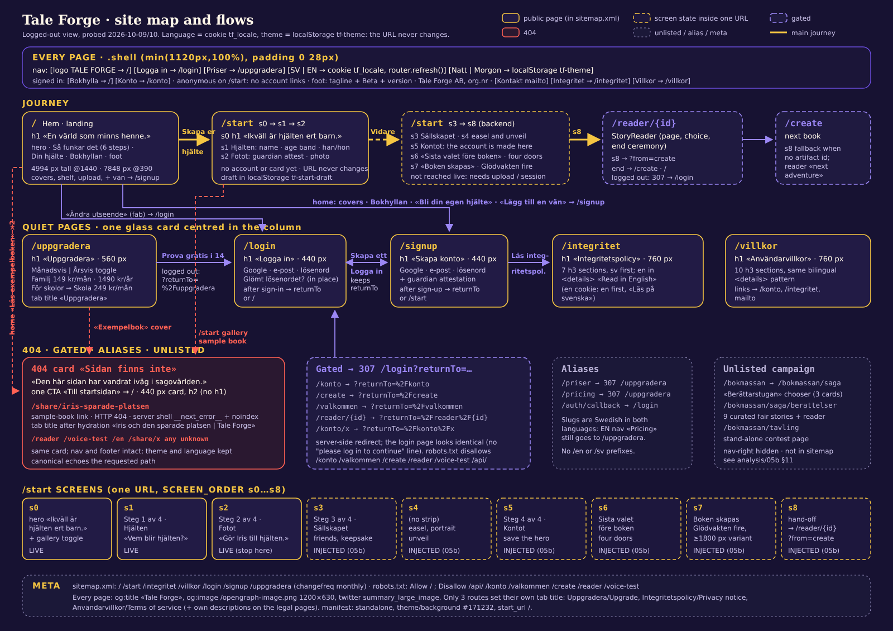

*[`derived/ia/sitemap.svg`](../derived/ia/sitemap.svg) (hand-written; PNG render [`sitemap.png`](../derived/ia/sitemap.png)). Rows, top to bottom: the global shell; the main journey; the quiet pages; 404 and gated routes, aliases and the unlisted campaign; the nine `/start` screens; meta files. Gold: public pages and the main journey. Violet: gated routes and secondary links. Coral: links that end on the 404 card.*

Key facts:

| | Observed | Evidence |
|---|---|---|
| Public pages | `/`, `/start`, `/uppgradera`, `/login`, `/signup`, `/integritet`, `/villkor` (exactly the sitemap) | [`sitemap.xml`](../source/meta/sitemap.xml) |
| Slugs | Swedish in both languages (`uppgradera` [upgrade], `integritet` [privacy], `villkor` [terms], `konto` [account], `valkommen` [welcome]); English aliases only for pricing (`/pricing`, plus Swedish `/priser`) | [`routes.csv`](../derived/ia/routes.csv) |
| Language | cookie `tf_locale=sv\|en` (default sv), set by the nav switch, `router.refresh()`, URL unchanged; no `/en` routes, no hreflang | §7.10 |
| Theme | `body[data-theme="natt"\|"morgon"]`, server default natt, persisted in `localStorage['tf-theme']`, re-applied by an inline script at the top of `<body>` | §7.11 |
| Gated | `/konto`, `/create`, `/valkommen`, `/reader/{id}` → HTTP 307 → `/login?returnTo=<path>` | [`gated` flow](#77-gated-redirects-and-404s) |
| Broken | `/share/iris-sparade-platsen` (the sample book, linked 4×) → 404 | §5.8 |
| Unlisted | `/bokmassan/*` book-fair kiosk (see [05b §11](05b-components-app-and-forms.md#11-discovered-the-unlisted-bokmässan-book-fair-kiosk)) | [`routes.csv`](../derived/ia/routes.csv) |
| Templates | storybook scroll (home 4994 px tall at 1440) vs quiet card (440 / 560 / 760 px wide) | §4 |
| Onboarding | `/start` = `SCREEN_ORDER` s0…s8, one URL, draft in `localStorage['tf-start-draft']` | §5.2, [05b §5](05b-components-app-and-forms.md#5-start-the-onboarding-flow-s0-to-s8) |

## 2. Route inventory

Probed with `curl -o /dev/null -w "%{http_code} %{redirect_url}"`, without cookies, on 2026-10-10. The full table with notes is in [`derived/ia/routes.csv`](../derived/ia/routes.csv).

| Route | HTTP | Goes to | In sitemap | robots.txt | Kind |
|---|---|---|---|---|---|
| `/` | 200 | | yes | | public |
| `/start` | 200 | | yes | | public (onboarding, s0…s8) |
| `/uppgradera` | 200 | | yes | | public (pricing) |
| `/priser`, `/pricing` | 307 | `/uppgradera` | no | | alias |
| `/login` | 200 | | yes | | public |
| `/signup` | 200 | | yes | | public |
| `/auth/callback` | 307 | `/login` | no | | auth plumbing |
| `/integritet` | 200 | | yes | | public (privacy) |
| `/villkor` | 200 | | yes | | public (terms) |
| `/konto`, `/konto/x` | 307 | `/login?returnTo=%2Fkonto` (sub-path kept: `%2Fkonto%2Fx`) | no | Disallow | gated |
| `/create`, `/create/x` | 307 | `/login?returnTo=%2Fcreate…` | no | Disallow | gated |
| `/valkommen` | 307 | `/login?returnTo=%2Fvalkommen` | no | Disallow | gated |
| `/reader/{id}` | 307 | `/login?returnTo=%2Freader%2F{id}` | no | Disallow `/reader` | gated |
| `/reader` | 404 | | no | Disallow | 404 card |
| `/share/iris-sparade-platsen` | **404** | | no | | **broken public link** |
| `/share/x` | 404 | | no | | 404 card |
| `/voice-test` | 404 | | no | Disallow | 404 card (named only in robots.txt) |
| `/en` | 404 | | no | | 404 card |
| `/api/` | 308 | `/api` | no | Disallow `/api/` | backend (not explored) |
| `/bokmassan` | 307 | `/bokmassan/saga` | no | | unlisted campaign |
| `/bokmassan/saga`, `…/saga/berattelser`, `/bokmassan/tavling` | 200 | | no | | unlisted campaign |
| `/robots.txt`, `/sitemap.xml`, `/manifest.webmanifest`, `/opengraph-image.png` | 200 | | | | meta |

robots.txt, verbatim ([`source/meta/robots.txt`](../source/meta/robots.txt)):

```text
User-Agent: *
Allow: /
Disallow: /api/
Disallow: /konto
Disallow: /valkommen
Disallow: /create
Disallow: /reader
Disallow: /voice-test

Sitemap: https://tale-forge.app/sitemap.xml
```

The sitemap ([`source/meta/sitemap.xml`](../source/meta/sitemap.xml)) lists 7 URLs in this order, each with `<changefreq>monthly</changefreq>` and no `lastmod` or `priority`: `/`, `/start`, `/integritet`, `/villkor`, `/login`, `/signup`, `/uppgradera`.

Response headers on `/start` (curl -I): `cache-control: private, no-cache, no-store, max-age=0, must-revalidate`, `x-matched-path: /start`, `x-vercel-cache: MISS`, `vary: rsc, next-router-state-tree, …`. The pages are rendered per request and never cached, which fits a language read from a cookie. The CSP and other headers are in [`source/meta/home-response-headers.txt`](../source/meta/home-response-headers.txt) ([14 §15](14-accessibility-and-craft.md#15-security-headers-and-csp)).

## 3. The shared shell: nav, backdrop, footer

Every route except the book-fair pages renders the same frame. The RSC payload in [`source/html/home.sv.html`](../source/html/home.sv.html) shows the order:

```text
body[data-theme="natt"]
├─ <script> theme pre-paint (first element that runs)
├─ div.bg.bg-night  (img /assets/nebula-hero.webp + .scrim + .starfield)
├─ div.bg.bg-day    (picture: /assets/morgon-aurora-mobile.webp ≤760px, else …-desktop.webp)
└─ div.wrap > div.shell
   ├─ a.skip-link "Hoppa till innehållet" → #main-content
   ├─ nav: a.logo (img + "Tale Forge") · div.nav-right [AccountNavLink · LanguageSwitcher · ThemeToggle]
   ├─ main#main-content  ← the page
   └─ div.foot
```

The shell CSS, verbatim ([`3q17cp_jgfwol.pretty.css:681-695`](../source/css/3q17cp_jgfwol.pretty.css)):

```css
.shell {
  flex-direction: column;
  width: min(1120px, 100%);
  min-height: 100dvh;
  margin: 0 auto;
  padding: 0 28px;
  display: flex;
}
.shell > nav {
  justify-content: space-between;
  align-items: center;
  gap: 14px;
  padding: 22px 0;
  display: flex;
}
```

The content column is therefore 1064 px wide at any viewport of 1120 px or more (measured: nav rect `[188, 0, 1064, 96]` at 1440, [`computed-styles__home__sv__natt__desktop.json`](../source/rendered/computed-styles__home__sv__natt__desktop.json)). The shell is a column flex box with `min-height: 100dvh`, and `.foot` has `margin-top: auto` ([`:1933-1944`](../source/css/3q17cp_jgfwol.pretty.css)). So on short pages (login, 404, `/start` s0) the footer sits on the bottom edge of the viewport and never floats mid-screen.

### 3.1 Nav variations

| State | Nav right side | Evidence |
|---|---|---|
| Signed out (every capture) | `Logga in` → `/login` · `Priser` → `/uppgradera` · `SV`/`EN` · `Natt`/`Morgon` switch | all `screenshots/flows/*` |
| Signed in (from code) | `Bokhylla` [bookshelf] (book icon) → `/` · `Konto` [account] (icon) → `/konto` · language · theme | `AccountNavLink`, [`390j9gbq0u9ce.js`](../source/js/390j9gbq0u9ce.js): `i={sv:"Konto",en:"Account"},u={sv:"Bokhylla",en:"Bookshelf"},s={sv:"Logga in",en:"Login"},c={sv:"Priser",en:"Pricing"}` |
| Auth unresolved, or a Supabase **anonymous** user on `/start…` | no account links at all (language and theme stay). The server HTML is in this state, so «Logga in» and «Priser» appear only after hydration ([`copy/pages/start.sv.md` §4](../copy/pages/start.sv.md)) | same function: `"unresolved"===l\|\|"anonymous"===l&&h?.startsWith("/start"))?null:…` |
| Book-fair pages | the whole `.nav-right` is hidden | [`3q17cp_jgfwol.pretty.css:722-730`](../source/css/3q17cp_jgfwol.pretty.css) |

- There is no current-page state. On `/uppgradera` the `Priser` link has the same transparent fill and ink `rgb(181,172,211)` (#b5acd3) as on every other page ([`computed-styles__uppgradera__sv__natt__desktop.json`](../source/rendered/computed-styles__uppgradera__sv__natt__desktop.json)), and no DOM file contains `aria-current`.
- Read: for a signed-in family the home URL `/` is labelled "Bokhylla", so the logo and the first nav item lead to their bookshelf. The landing page is for visitors only.

Responsive behaviour of the nav (CSS):

- `@media (max-width: 768px)`: nav and `.nav-right` wrap; the controls align right ([`:2276-2285`](../source/css/3q17cp_jgfwol.pretty.css)).
- `@media (max-width: 560px)`: the logo shrinks to 1.05rem with a 28 px mark ([`:746-767`](../source/css/3q17cp_jgfwol.pretty.css)). The theme switch drops its words and shows icons only: `.tt-opt { font-size: 0 }` ([`:2286-2294`](../source/css/3q17cp_jgfwol.pretty.css)).

Measured nav height:

| Viewport | Nav height | Rows |
|---|---|---|
| 1440 | 96 px | one row |
| 390 | 116 px | logo row + one control row |
| 360 | 166 px | the theme switch wraps onto a third row ([`extra-viewports.json`](../derived/ia/extra-viewports.json); [`home__sv__morgon__360x740__fold.webp`](../screenshots/flows/extra-viewports/home__sv__morgon__360x740__fold.webp)) |

### 3.2 Footer

Identical on every page. Copy is from the server HTML, verbatim. The contact address is shortened here because it is a first-name mailbox; it is in the DOM files.

| Footer part | Content |
|---|---|
| Left, line 1 | «Tale Forge, sagor som minns er värld.» [Tale Forge, stories that remember your world.] + a `Beta` pill (`data-testid="beta-build-label"`, 0.7rem, 1px `var(--card-line)` border, opacity .8) |
| Left, line 2 | «Version 16ab1756 · 26 sep. 2026» (`data-testid="footer-version"`, 0.8rem, `var(--card-sub)`, opacity .85) |
| Right | «Tale Forge AB, org.nr 559543-1122, Värnamo, Sverige» · links `Kontakt` (mailto) · `Integritet` → `/integritet` · `Villkor` → `/villkor`. The links are coloured `var(--card-sub)` with the underline in `var(--accent)` |

English: «Tale Forge, storybooks that remember your world.», «Tale Forge AB, reg. no. 559543-1122, Varnamo, Sweden», links Contact / Privacy / Terms ([`start-resume__02-after-en__natt__desktop.png`](../screenshots/flows/start-resume__02-after-en__natt__desktop.png)).

The server HTML ships the contact link as a Cloudflare `/cdn-cgi/l/email-protection#…` link, which client JS rewrites to `mailto:` ([`copy/pages/start.sv.md` §4](../copy/pages/start.sv.md)).

## 4. Two page templates

### 4.1 Storybook scroll (home, `/start` s0)

- `header.hero` (or `div.hero` on `/start`) is a two-column grid with `grid-template-columns: 1.05fr 0.95fr; gap: 40px; min-height: 64vh; padding: 4vh 0 2vh` ([`:827-834`](../source/css/3q17cp_jgfwol.pretty.css)).
  - Left column: kicker chip, h1 at Lora 700 `clamp(2.7rem, 5.4vw, 4.4rem)` (70.4 px at 1440, 43.2 px on mobile; [`:855-866`](../source/css/3q17cp_jgfwol.pretty.css)), lede, `.cta-row`.
  - Right column: `.fan` of two tilted book covers with a floating badge ([`:925-…`](../source/css/3q17cp_jgfwol.pretty.css)).
  - At `max-width: 880px` the grid collapses to one column, `min-height: auto`, and the fan becomes 340 px tall ([`:2243-2252`](../source/css/3q17cp_jgfwol.pretty.css)).
- Below the hero, home continues with `.reveal` sections. Each fades up 26 px over 0.7 s `cubic-bezier(0.2, 0.7, 0.3, 1)` when it enters the viewport ([`:1099-1109`](../source/css/3q17cp_jgfwol.pretty.css)).
- Section-level detail: [04 §5](04-layout-spacing-responsive.md#5-home-section-by-section-desktop-1440), [05a §5-9](05a-components-landing.md#5-hero).

### 4.2 Quiet card (login, signup, 404, uppgradera, integritet, villkor)

The same inline style is on every one of these pages ([`source/rendered/dom__login__sv.html`](../source/rendered/dom__login__sv.html) etc.). Only the card width changes:

```html
<section style="flex:1;display:grid;place-items:center;padding:36px 0">
  <div class="glass" style="width:min(440px, 100%);padding:34px">…</div>
</section>
```

| Page | Element | Width | Extra | Card rect at 1440 (x, y, w, h) | Page height 1440 / 390 |
|---|---|---|---|---|---|
| `/login` | `div.glass` | `min(440px, 100%)` | | 500, 132, 440, 591 | 900 / 960 |
| `/signup` | `div.glass` | `min(440px, 100%)` | | 500, 132, 440, 745 | 1016 / 1163 |
| 404 | `div.glass` | `min(440px, 100%)` | `text-align:center` | 500, 132, 440, 226 | 900 / 844 |
| `/uppgradera` | plain `div` column of 3 glass cards | `min(560px, 100%)` | inline `<style>` ([`uppgradera-inline-style.pretty.css`](../derived/layout/uppgradera-inline-style.pretty.css)) | 440, 132, 560, … | 1312 / 1690 |
| `/integritet` | `article.glass` | `min(760px, 100%)` | | 340, 132, 760, 2714 | 2985 / 6275 |
| `/villkor` | `article.glass` | `min(760px, 100%)` | | 340, 132, 760, 2198 | 2469 / 4496 |

Rects and heights are from [`source/rendered/computed-styles__<page>__sv__natt__desktop.json`](../source/rendered/) (`div.shell` height).

- The quiet pages share these traits:
  - The title is `h1.page-title`: Lora 600, `clamp(1.5rem, 2.4vw, 2rem)`, which is 32 px at 1440 and 24 px at 390 ([`:1064-1072`](../source/css/3q17cp_jgfwol.pretty.css)). The 404 card is the exception (h2, §5.7).
  - The card is the standard `.glass`: 26 px radius, `backdrop-filter: blur(var(--card-blur))`, and a gradient hairline drawn by `.glass:before` (`linear-gradient(135deg, #9b87f580, #f2b22e59 50%, #ff61544d)`, opacity .45). See [`:1110-1147`](../source/css/3q17cp_jgfwol.pretty.css) and [06 §9](06-theming-and-atmosphere.md#9-glass-surfaces).
  - The painted backdrop does all the decorating.
- Read: three fixed card widths form a de-facto page-width scale. 440 is a form, 560 is a narrow column (pricing, and the `/start` step card `max-width: 560px`, [`2_gt301v4m-60.pretty.css:44-51`](../source/css/2_gt301v4m-60.pretty.css)), and 760 is reading prose.

## 5. Page by page

Verbatim copy for every page is in the per-page copy decks in [`copy/pages/`](../copy/pages/). This section keeps to the structure, the controls and their destinations. The machine-readable table is [`derived/ia/pages.csv`](../derived/ia/pages.csv), and outgoing links per page and language are in [`derived/ia/link-graph.json`](../derived/ia/link-graph.json).

### 5.1 `/` Home (landing)

- **Purpose.** Sell the idea of "a world that remembers": a painted hero who comes back from book to book, choices that matter, read aloud. Then send the visitor to `/start`.
- **Outline (sv, hydrated DOM [`dom__home__sv.html`](../source/rendered/dom__home__sv.html)):**
  1. `header.hero`:
     - kicker «Exempel: Alvas värld · 2 böcker» [Example: Alva's world · 2 books]
     - h1 «En värld som **minns henne**.» [A world that remembers her.]
     - lede «Den målade hjälten återvänder. Valen förändrar vad som händer, och senare böcker minns äventyren ni redan har delat.»
     - CTA row with microcopy «Första boken är gratis, inget kort behövs. Sedan 149 kr i månaden.» [First book free, no card needed. Then 149 kr a month.]
     - fan of two covers with the badge «Sixten minns tornet / från "Alva och fyraljuset"»
  2. `section.hiw#sa-funkar-det`:
     - kicker «Så fungerar det» (uppercase via CSS)
     - h2 «Äventyr värda att prata om.» [Adventures worth talking about.]
     - an ordered list of six h3 steps: «Bygg er hjälte» · «Ta med en vän» · «Välj kvällens äventyr» · «Läs och välj» · «Fyra olika slut» · «Världen minns»
     - closing CTA pair
  3. `section.reveal`: h2 «Din hjälte» + chip «barnens favorit» (hero builder card and friends card, with h3 «Ta med en vän»).
  4. `section.reveal`: h2 «Bokhyllan» + chip «2 färdiga böcker» (two book cards).
  5. Footer.
- **Layout.** Storybook scroll, 4994 px tall at 1440 and 7848 px at 390. The hero measures 576 px (64vh of 900) at 1440. The how-it-works chapter alternates text and glass cards in a 2-column timeline ([04 §5.4](04-layout-spacing-responsive.md#54-så-fungerar-det-sectionhiw-y-672-3855)).
- **CTAs and destinations** (counted from [`link-graph.json`](../derived/ia/link-graph.json), `home.sv`):

| Control | Destination | Count |
|---|---|---|
| `a.btn-primary` «Skapa er hjälte» [Create your hero] (hero; repeated at the end of the chapter). It is a `CtaLink` with analytics ids `cta:"hero_primary"`, `surface:"home"` | `/start` | 2 |
| `a.btn-ghost` «Se hur det funkar» [See how it works] | `#sa-funkar-det` (smooth scroll: `html { scroll-behavior: smooth }`, [`:595-597`](../source/css/3q17cp_jgfwol.pretty.css); the URL gains the hash) | 1 |
| `a.btn-ghost` «Läs exempelboken» [Read the sample book] (under the endings map, and in the closing pair) | `/share/iris-sparade-platsen` → **404** | 2 |
| Hero covers (aria-labels «Alva och fyraljuset i tornet», «Alva och filten vid elementet»), «Bli din egen hjälte» upload card, «Lägg till en vän», the two Bokhyllan books | `/signup` | 6 |
| `a.fab` «Ändra utseende» [Change appearance] (pencil on the hero portrait) | `/login` | 1 |
| `button.hiw-play` «Hör berättarrösten» [Hear the narrator] | plays `/landing/voice/grandpa-sample.mp3` in place | 1 |
| `button.hiw-map-btn` ×4 «Slut N av 4, visa vägen dit» [Ending N of 4, show the way there] | highlights a path on the endings map, in place | 4 |

- **Page-specific styling.** Only the global stylesheet loads. Six images are preloaded: `nebula-hero.webp`, `tf-logo.webp`, `cover-tornet.webp`, `cover-filten.webp`, `avatar-noah.jpg`, `avatar-sixten.jpg` ([`head-metadata.json`](../derived/ia/head-metadata.json)). All landing components are in [05a](05a-components-landing.md).
- **Screens:**
  - Full page: [`home__sv__natt__desktop__full.webp`](../screenshots/pages/home/home__sv__natt__desktop__full.webp), [`home__sv__morgon__mobile__full.webp`](../screenshots/pages/home/home__sv__morgon__mobile__full.webp).
  - Tablet 834: [`home__sv__natt__tablet__full.webp`](../screenshots/pages/home/home__sv__natt__tablet__full.webp).
  - Paths out of home: the [`home-paths` flow](#72-home-paths).

### 5.2 `/start` (onboarding entry, s0…s8)

- **Purpose.** Start making the hero before any account or card exists: «Inget konto och inget kort ännu. Ni börjar med barnet.» [No account and no card yet. You start with your child.] (s1 strip).
- **Structure.** `StartFlow` renders one `section.start-screen` at a time (`SCREEN_ORDER` s0…s8) under the same URL. A draft (`{ageBand:"B", currentScreen:"s0"}` by default) lives in `localStorage['tf-start-draft']`. A build in progress is flagged by the cookie `tf-start-inflight` ([`390j9gbq0u9ce.js`](../source/js/390j9gbq0u9ce.js)). Each screen enters with `tfStartIn` (0.45 s, `cubic-bezier(0.2, 0.7, 0.3, 1)`, from `translateY(22px)` and opacity 0; [`2_gt301v4m-60.pretty.css:1-13`](../source/css/2_gt301v4m-60.pretty.css)). Full component detail is in [05b §5](05b-components-app-and-forms.md#5-start-the-onboarding-flow-s0-to-s8).
- **s0 outline:**
  - `div.hero`: kicker «Riktiga bilderböcker, upplästa på svenska» [Real picture books, read aloud in Swedish]
  - h1 «Ikväll är hjälten **ert barn**.» [Tonight the hero is your child.]
  - lede «Tale Forge skriver, målar och läser in en riktig bilderbok där ert barn är huvudpersonen. Porträttet ser ni om ett par minuter, den första boken är gratis.»
  - two **buttons** (not links): `btn-primary` «Skapa er hjälte» and `btn-ghost` «Läs en exempelbok först» [Read a sample book first] (`aria-expanded`)
  - a fan of `cover-filten` and `cover-tornet` with the badge «Exempelbok / Iris och den sparade platsen · på svenska». Note that the badge names the Iris book while the covers show Alva.
- **Screens and strip titles** ([`0ad0wel9cyv30.js`](../source/js/0ad0wel9cyv30.js)):

| Screen | Strip title (sv) | Content | Captured live? |
|---|---|---|---|
| s0 | none | hero + gallery toggle | yes |
| s1 | «Steg 1 av 4 · Hjälten» | h2 «Vem blir hjälten?», name field, age band (4–5 / 6–7 / 8–9, 6–7 preselected), pronoun Han/Hon | yes |
| s2 | «Steg 2 av 4 · Fotot» | h2 «Gör {namn} till hjälten.», guardian attestation, photo picker, privacy line, «Vidare», «Hoppa över, måla en hjälte åt oss» | yes (the flow stops here) |
| s3 | «Steg 3 av 4 · Sällskapet» [the company] | companions, keepsake, hero card | injected, see [05b §5.5](05b-components-app-and-forms.md#55-s3-companion-picks-keepsake-object-and-the-hero-card-liveinjected) |
| s4 | none | the easel and the portrait unveil | injected |
| s5 | «Steg 4 av 4 · Kontot» | **the account is created here** | injected |
| s6 | «Sista valet före boken» [The last choice before the book] | four adventure doors | injected |
| s7 | «Boken skapas» [The book is being made] | the Glödvakten "waiting fire" ([05b §6](05b-components-app-and-forms.md#6-glödvakten-the-waiting-fire-where-the-book-is-baked-s7)) | injected |
| s8 | none | hand-off: `r.push(e.artifactId?`/reader/${e.artifactId}?from=create`:"/create")` | code only |

- **Layout.**
  - s0 is the storybook hero again, fitting one screen: 900 px page height at 1440, 1220 px at 390.
  - From s1 on, a glass progress strip sits under the nav: back chevron, four dots, title, sub-line ([05b §5.1](05b-components-app-and-forms.md#51-the-progress-strip)).
  - Below the strip is a 560 px `.stepcard` with `padding: 30px 28px 28px; gap: 20px` ([`2_gt301v4m-60.pretty.css:44-51`](../source/css/2_gt301v4m-60.pretty.css)).
  - The name field is a 2 px-bordered, 16 px-radius input at 1.15rem/700 ([`:61-73`](../source/css/2_gt301v4m-60.pretty.css)).
  - A disabled «Vidare» drops to opacity .5 ([`:55-60`](../source/css/2_gt301v4m-60.pretty.css)): the dull gold bar in [`journey__04-start-s1__natt__desktop.png`](../screenshots/flows/journey__04-start-s1__natt__desktop.png).
- **Route CSS** (the only page besides the share route that loads more than the global sheet):
  - [`2_gt301v4m-60`](../source/css/2_gt301v4m-60.pretty.css) (`.start-flow`, 951 lines)
  - [`2h1wwdz1nvxwk`](../source/css/2h1wwdz1nvxwk.pretty.css) (`.cs-` companion/world band, 609 lines)
  - [`37m388zf6rymp`](../source/css/37m388zf6rymp.pretty.css) (`.glod-` hearth, 1096 lines, which also holds the site's only `min-width: 1800px` query, [`:303-343`](../source/css/37m388zf6rymp.pretty.css))
- **Destinations.**
  - «Skapa er hjälte» → s1 (same URL).
  - «Läs en exempelbok först» toggles a `.gallery` (CSS grid `repeat(3, 1fr)`, [`:14-23`](../source/css/2_gt301v4m-60.pretty.css)) holding one framed cover. The cover links to `/share/iris-sparade-platsen` (404).
  - s8 → `/reader/{id}?from=create`.
- **Observed draft behaviour** ([`start-resume` flow](#74-start-resume)):
  - Reloading on s1 restores s1, but the typed name is gone: the draft held only `{"ageBand":"B","currentScreen":"s1"}`.
  - After the reload the back chevron is missing; its slot stays empty.
  - Switching to EN keeps the screen.

### 5.3 `/uppgradera` (pricing)

- **Purpose.** Convert to the paid Familj plan; the Skola plan is behind a toggle.
- **Outline (sv):**
  1. `div.glass`: h1 «Uppgradera», lede «Nya personliga böcker varje månad, i en värld som minns. Ingen bindningstid, avsluta när du vill.»
  2. `section.glass[aria-labelledby=included-heading]`:
     - h2 «Det här ingår» [What is included]
     - five-item list: «Personliga, illustrerade sagoböcker» · «Uppläsning till varje berättelse» · «Meningsfulla val som formar berättelsen» · «Plats för upp till 4 barn med Familj och 30 i Skola» · «Avsluta när du vill»
     - a 112 px sample cover linking to the 404 share page, captioned «Exempelbok: Iris och den sparade platsen»
  3. Billing toggle: `button.trait` «Månadsvis» / «Årsvis» (`aria-pressed`; yearly preselected).
  4. `div.glass`: h2 «Familj», «För familjen som vill fortsätta berätta tillsammans.», price, perks («3 nya böcker varje månad, oanvända följer med», «Upp till 4 barn»), «14 dagar gratis, avsluta när du vill. Kort krävs.», CTA.
  5. `button.trait` «För skolor» (`aria-expanded="false"`).
- **States** ([`upgrade` flow](#75-upgrade)):

| State | Price line(s) | Page height (desktop) |
|---|---|---|
| Årsvis (default) | «1490 kr per år» + «124 kr per månad vid årsbetalning» | 1312 |
| Månadsvis | «149 kr per månad» | 1276 |
| + För skolor | adds the «Skola» card: «För klassrummet. Samma sagovärld, med plats för hela klassen.», «249 kr per månad», «6 nya böcker varje månad, oanvända följer med», «Upp till 30 barn», «Ingen bindningstid, avsluta när du vill.», CTA «Uppgradera till Skola». The «För skolor» toggle is removed once the card shows, so the expansion is one-way | 1575 |

- **CTA logic** ([`26ye0kuppitcn.js`](../source/js/26ye0kuppitcn.js)): `if(!h)return void _(`/login?returnTo=${encodeURIComponent("/uppgradera")}`)`. If logged out, the CTA goes to `/login?returnTo=%2Fuppgradera`. If logged in, it POSTs `/stripe/checkout` and redirects (not exercised).
- **Styling.** A 560 px column of three stacked glass cards with the `.trait` pill toggles. The page ships an inline `<style>` for the proof list and the 112 px sample figure ([`derived/layout/uppgradera-inline-style.pretty.css`](../derived/layout/uppgradera-inline-style.pretty.css)). Tab title «Uppgradera» / «Upgrade».

### 5.4 `/login`

- **Outline.** A 440 px glass card containing:
  - h1 «Logga in»
  - lede «Välkommen tillbaka.»
  - `btn-ghost` «Fortsätt med Google»
  - divider «eller»
  - form: «E-post» (`du@exempel.se`, `type=email`, required); «Lösenord» (`Ditt lösenord`, `autocomplete=current-password`, required), with an eye button (`aria-label` «Visa lösenord» ↔ «Dölj lösenord»)
  - text button «Glömt lösenordet?»
  - `btn-primary` «Logga in»
  - foot line «Har du inget konto? Skapa ett»
- **Client-side states** ([`auth` flow](#76-auth-login-and-signup)):
  - The eye button reveals the password.
  - An empty submit gives only browser-native validation (`validationMessage` "Please fill out this field."; the bubble is browser chrome and is not in the screenshot).
  - «Glömt lösenordet?» swaps the card in place to h1 «Återställ lösenordet» with «Skicka återställningslänk» / «Tillbaka till inloggning».
- **Destinations** ([`1hcx0qn-qjgfn.js`](../source/js/1hcx0qn-qjgfn.js)):
  - After sign-in: `returnTo` if present, else `/`.
  - `returnTo` is sanitised to a same-origin path; anything else becomes `/`.
  - The foot link carries `returnTo` across: `D="/"!==b?`${y.footHref}?returnTo=${encodeURIComponent(b)}`:y.footHref`.

```js
// 1hcx0qn-qjgfn.js (minified, verbatim): returnTo sanitiser and default destinations
b=k?function(e,t="https://tale-forge.invalid"){if(!e||!e.startsWith("/")||e.includes("\\"))return"/";
try{let r=new URL(t),o=new URL(e,r);if(o.origin!==r.origin)return"/";return`${o.pathname}${o.search}${o.hash}`}catch{return"/"}}(k):"/",
w=k?b:"signup"===e?"/start":"/"
```

### 5.5 `/signup`

- **Outline.** The same 440 px card as login, with:
  - h1 «Skapa konto»
  - a longer lede: «Personliga sagoböcker där ert barn är hjälten, med bilder och uppläsning. Ett konto för hela familjen; sen bygger ni ert barns hjälte och de…» (full text in [`copy/pages/signup.sv.md`](../copy/pages/signup.sv.md))
  - Google, e-mail, and a password field with `autocomplete=new-password`
  - a checkbox `#signup-attest`: «Jag är barnets förälder eller vårdnadshavare och godkänner integritetspolicyn.» [I am the child's parent or guardian and accept the privacy policy.], followed by the link «Läs integritetspolicyn» → `/integritet` (same tab)
  - `btn-primary` «Skapa konto»
  - foot line «Har du redan ett konto? Logga in»
- **After sign-up.** Goes to `returnTo`, else `/start`.
- Read: the visible submit looks the same whether or not the box is ticked ([`auth__07-signup-attested__natt__desktop.png`](../screenshots/flows/auth__07-signup-attested__natt__desktop.png)).

### 5.6 `/integritet` and `/villkor` (legal)

- **Template.** A 760 px `article.glass` with:
  - h1 (`Integritetspolicy` / `Användarvillkor`)
  - a bilingual lede: «Hur vi tar hand om uppgifterna om ert barn. Samma text finns på svenska och engelska nedan. How we look after your child's information. …»
  - the Swedish sections as **h3** (no h2 level)
  - then `details.legal-language-details` with `summary` «Read in English», which holds the full English text
- **With the EN cookie the order flips:** English first, then «Läs på svenska». The summary is styled as an accent-coloured 44 px row ([`:1073-1086`](../source/css/3q17cp_jgfwol.pretty.css)).
- **Sections:**
  - Integritet (7): I korthet · Vad vi samlar in · Fotot · Vem behandlar uppgifterna · AI-innehåll · Era rättigheter · Lagring och gallring.
  - Villkor (10): I korthet · Konto och samtycke · Planer, provperiod och uppsägning · Ångerrätt · För skolor · Så får tjänsten användas · Era böcker och vår motor · AI-innehåll · Vårt ansvar · Ändringar och lag.
- **Links out:**
  - Integritet: «ert konto» → `/konto` (gated) ×2 and mailto ×2.
  - Villkor: `/konto` ×4, `/integritet` ×2, mailto ×4.
  - Both counts include the English half.
- These are the only pages besides `/uppgradera` with their own `<title>`, and the only ones with their own `description` («Hur Tale Forge tar hand om uppgifterna om ert barn.» / «Enkla villkor för att använda Tale Forge.»).
- **Heights.** At 1440: 2985 px (integritet) and 2469 px (villkor). With the English `<details>` open: 5431 and 4399 px ([`legal` flow](#79-legal)).

### 5.7 404 (any unknown path)

- **Outline.** A 440 px centred glass card (`text-align:center`) with:
  - **h2** «Sidan finns inte» [The page does not exist]
  - `p.prose-plain` «Den här sidan har vandrat iväg i sagovärlden.» [This page has wandered off into the story world.]
  - one `btn-primary` «Till startsidan» → `/`
  - EN: «Page not found» / «Back to start».
- The markup is the RSC `notFound` slot inside the shell. Nav, backdrop and footer stay, and theme and language are kept.
- **Metadata quirks:**
  - The title is the generic «Tale Forge».
  - There is no h1.
  - The canonical echoes the requested path (`https://tale-forge.app/this-page-does-not-exist`, [`404.sv.html`](../source/html/404.sv.html)).
- **Pixel check.** The `/reader`, `/share/iris-sparade-platsen` and unknown-path captures differ from each other by at most 4 pixels at a >40 threshold. The differences are starfield twinkle (NumPy diff of the natt desktop PNGs).
- **Screenshots:** [`not-found__01-404__natt__desktop.png`](../screenshots/flows/not-found__01-404__natt__desktop.png), [`not-found__01-404__morgon__mobile.png`](../screenshots/flows/not-found__01-404__morgon__mobile.png).

### 5.8 `/share/iris-sparade-platsen` (the broken sample-book link)

- **Linked from four places:** home ×2 («Läs exempelboken»), the `/start` s0 gallery card, and the `/uppgradera` sample cover.
- **Server response.** HTTP 404 with a Next.js error shell ([`share_iris-sparade-platsen.404.sv.html`](../source/html/share_iris-sparade-platsen.404.sv.html)): `<html id="__next_error__">` with no `lang`, an empty `<body>` with no `data-theme`, `<meta name="robots" content="noindex">`, title «Tale Forge», and a canonical pointing at the share URL.
- **Client render.** The full shell plus the standard 404 card. After hydration `document.title` becomes **«Iris och den sparade platsen | Tale Forge»** ([`flows.csv`](../derived/ia/flows.csv), `gated` step 06).
- Read: the page metadata resolves the book while the page body does not. The book exists in data, but its public share page is unpublished or switched off.
- The book it would show is in the library in full: [`source/sample-book.iris-och-den-sparade-platsen.json`](../source/sample-book.iris-och-den-sparade-platsen.json), [`assets/share/iris-sparade-platsen/assets/`](../assets/share/iris-sparade-platsen/assets/), and the reader reconstruction in [05b §7](05b-components-app-and-forms.md#7-reader-and-share-page-storyreader-reconstructed).

### 5.9 Gated routes, aliases, unlisted pages

- **Gated.** `/konto`, `/create`, `/valkommen`, `/reader/{id}` and any sub-path answer a server-side **307** to `/login?returnTo=<url-encoded path>`. The login page then looks pixel-identical to a plain `/login`: the [`gated__01-konto`](../screenshots/flows/gated__01-konto__natt__desktop.png) vs [`auth__01-login-rest`](../screenshots/flows/auth__01-login-rest__natt__desktop.png) diff is 2 px (starfield). Nothing tells the visitor why they landed there.
- **Aliases.** `/priser` and `/pricing` → 307 `/uppgradera`. `/auth/callback` → 307 `/login` when hit directly.
- **Unlisted.** `/bokmassan/…` (the Gothenburg Book Fair kiosk "Berättarstugan", 24–27 September) is public but outside the sitemap and the nav. It is documented with screenshots in [05b §11](05b-components-app-and-forms.md#11-discovered-the-unlisted-bokmässan-book-fair-kiosk).

## 6. Metadata per page

All values are from the server HTML ([`derived/ia/head-metadata.json`](../derived/ia/head-metadata.json), parsed from [`source/html/`](../source/html/)). The `en` columns are the same page fetched with `tf_locale=en`.

| Page | `<title>` sv / en | `description` sv / en | canonical |
|---|---|---|---|
| `/` | Tale Forge / Tale Forge | Riktiga bilderböcker, skapade för ditt barn. / Real picture books, made for your child. | `https://tale-forge.app` (no trailing slash) |
| `/start` | Tale Forge | (same generic) | `/start` |
| `/uppgradera` | **Uppgradera / Upgrade** | (generic) | `/uppgradera` |
| `/login` | Tale Forge | (generic) | `/login` |
| `/signup` | Tale Forge | (generic) | `/signup` |
| `/integritet` | **Integritetspolicy / Privacy notice** | **Hur Tale Forge tar hand om uppgifterna om ert barn. / How Tale Forge looks after your child's information.** | `/integritet` |
| `/villkor` | **Användarvillkor / Terms of service** | **Enkla villkor för att använda Tale Forge. / Plain terms for using Tale Forge.** | `/villkor` |
| 404 | Tale Forge | (generic) | echoes the requested path |
| `/share/iris-…` | Tale Forge (server) → «Iris och den sparade platsen \| Tale Forge» (client) | (generic) + `robots: noindex` | `/share/iris-sparade-platsen` |

Constant on every page:

```html
<meta name="viewport" content="width=device-width, initial-scale=1"/>
<meta name="tf-release-sha" content="4be07efd68ad299089d33297742e56589f587460"/>
<meta property="og:title" content="Tale Forge"/>                  <!-- even where <title> differs -->
<meta property="og:description" content="Riktiga bilderböcker, skapade för ditt barn."/>  <!-- generic even on legal pages -->
<meta property="og:site_name" content="Tale Forge"/>
<meta property="og:locale" content="sv_SE"/>                      <!-- en_US with tf_locale=en -->
<meta property="og:image" content="https://tale-forge.app/opengraph-image.png?opengraph-image.2xzm_0q_kwhgm.png"/>  <!-- 1200×630 -->
<meta property="og:type" content="website"/>
<meta name="twitter:card" content="summary_large_image"/>
<meta name="twitter:image" content="https://tale-forge.app/twitter-image.png?twitter-image.2xzm_0q_kwhgm.png"/>
<link rel="manifest" href="/manifest.webmanifest"/>
<link rel="icon" href="/favicon.ico?favicon.0k8s-ucsp6yre.ico" sizes="48x48"/>
<link rel="icon" href="/icon.png?icon.1q_fj2hxfdn0a.png" sizes="256x256"/>
<link rel="apple-touch-icon" href="/apple-icon.png?apple-icon.1qwtxz8ono1wt.png" sizes="180x180"/>
```

- There is no `hreflang` alternate on any page and no JSON-LD.
- The share image [`assets/brand/opengraph-image.png`](../assets/brand/opengraph-image.png) (1200×630) shows:
  - the night painting (the astronaut reading on stacks of books)
  - the gold logo mark with «TALE FORGE» under it
  - the name «Tale Forge» in a large gold title-case serif (not the site's uppercase Cinzel wordmark; see [01](01-brand-identity.md))
  - the two Alva covers (`cover-tornet`, `cover-filten`) as white-framed cards.
- [`twitter-image.png`](../assets/brand/twitter-image.png) is the same size.
- PWA manifest ([`source/meta/manifest.webmanifest`](../source/meta/manifest.webmanifest)): `"display":"standalone"`, `"start_url":"/"`, `"background_color":"#171232"`, `"theme_color":"#171232"`, `description` «Riktiga bilderböcker, skapade för ditt barn.». The manifest is Swedish only.

## 7. Flows, step by step

Each flow has a contact sheet in [`derived/ia/flow-sheets/`](../derived/ia/flow-sheets/). Rows are natt desktop, morgon desktop, natt mobile and morgon mobile; columns are the steps; the header shows the URL after each step and a note. Per-step state is in [`flows.csv`](../derived/ia/flows.csv). The tables below link the natt desktop capture. Swap `natt`→`morgon` or `desktop`→`mobile` in the file name for the other three. Hover steps exist for desktop only.

### 7.1 `journey`

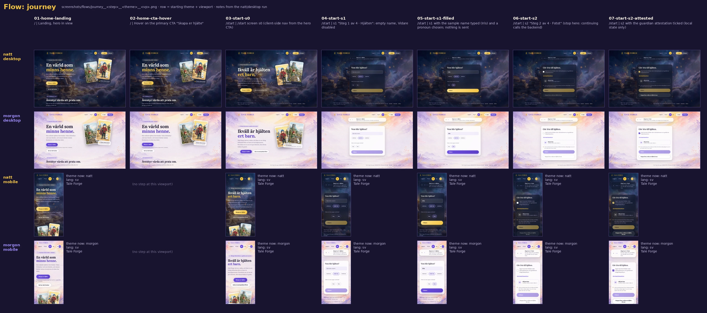

| Step | What happens | URL after | Capture |
|---|---|---|---|
| 01 home-landing | Landing, hero in view | `/` | [png](../screenshots/flows/journey__01-home-landing__natt__desktop.png) |
| 02 home-cta-hover | Hover on «Skapa er hjälte»: lifts 3 px, stronger shadow (`.btn-primary:hover`, [`:914-917`](../source/css/3q17cp_jgfwol.pretty.css)) | `/` | [png](../screenshots/flows/journey__02-home-cta-hover__natt__desktop.png) |
| 03 start-s0 | Click: client-side navigation to `/start` s0 | `/start` | [png](../screenshots/flows/journey__03-start-s0__natt__desktop.png) |
| 04 start-s1 | «Skapa er hjälte» → s1, empty name, «Vidare» disabled | `/start` | [png](../screenshots/flows/journey__04-start-s1__natt__desktop.png) |
| 05 start-s1-filled | Name «Iris» typed, a pronoun chosen; «Vidare» enabled | `/start` | [png](../screenshots/flows/journey__05-start-s1-filled__natt__desktop.png) |
| 06 start-s2 | «Vidare» → s2 «Gör Iris till hjälten.». Both «Vidare» (dull gold, sampled `rgb(143,124,77)` vs `rgb(250,211,104)` when enabled on s1) and «Hoppa över, måla en hjälte åt oss» are disabled | `/start` | [png](../screenshots/flows/journey__06-start-s2__natt__desktop.png) |
| 07 start-s2-attested | Attestation ticked (local only): the checkbox fills gold and «Hoppa över…» becomes enabled; «Vidare» stays disabled until a photo is chosen. The flow stops: the next click calls the backend | `/start` | [png](../screenshots/flows/journey__07-start-s2-attested__natt__desktop.png) |

### 7.2 `home-paths`

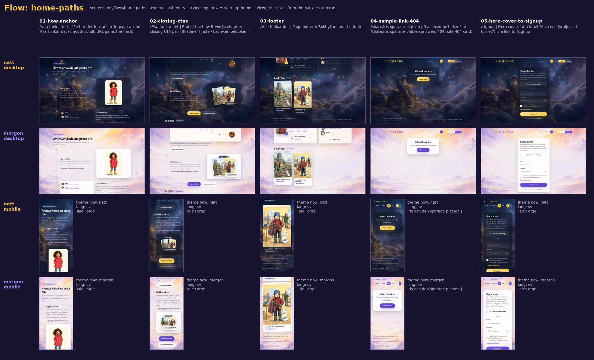

| Step | What happens | URL after | Capture |
|---|---|---|---|
| 01 how-anchor | «Se hur det funkar» smooth-scrolls to the chapter | `/#sa-funkar-det` (scrollY 648) | [png](../screenshots/flows/home-paths__01-how-anchor__natt__desktop.png) |
| 02 closing-ctas | End of the chapter: closing pair «Skapa er hjälte» / «Läs exempelboken» | same | [png](../screenshots/flows/home-paths__02-closing-ctas__natt__desktop.png) |
| 03 footer | Page bottom: Bokhyllan + footer | same | [png](../screenshots/flows/home-paths__03-footer__natt__desktop.png) |
| 04 sample-link-404 | «Läs exempelboken» → 404 card; tab title «Iris och den sparade platsen \| Tale Forge» | `/share/iris-sparade-platsen` | [png](../screenshots/flows/home-paths__04-sample-link-404__natt__desktop.png) |
| 05 hero-cover-to-signup | Hero cover (it floats constantly, so the click had to be forced) → `/signup` | `/signup` | [png](../screenshots/flows/home-paths__05-hero-cover-to-signup__natt__desktop.png) |

### 7.3 `start-gallery`

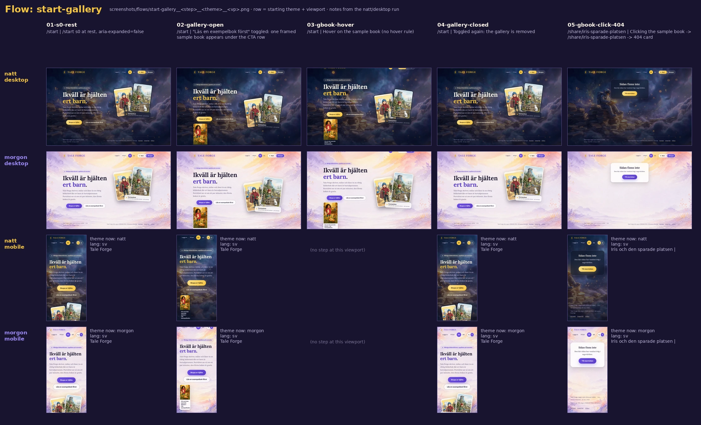

| Step | What happens | Capture |
|---|---|---|
| 01 s0-rest | `/start` s0, toggle `aria-expanded="false"` | [png](../screenshots/flows/start-gallery__01-s0-rest__natt__desktop.png) |
| 02 gallery-open | «Läs en exempelbok först» opens the gallery: one framed cover (4 px `var(--frame)` border, 16 px radius, 2:3) taking one of three grid columns; page grows 900 → 1093 px | [png](../screenshots/flows/start-gallery__02-gallery-open__natt__desktop.png) |
| 03 gbook-hover | Hover on the cover: no change (no hover rule exists for `.gbook`) | [png](../screenshots/flows/start-gallery__03-gbook-hover__natt__desktop.png) |
| 04 gallery-closed | Toggled again: removed | [png](../screenshots/flows/start-gallery__04-gallery-closed__natt__desktop.png) |
| 05 gbook-click-404 | Click on the cover → `/share/iris-sparade-platsen` → 404 | [png](../screenshots/flows/start-gallery__05-gbook-click-404__natt__desktop.png) |

### 7.4 `start-resume`

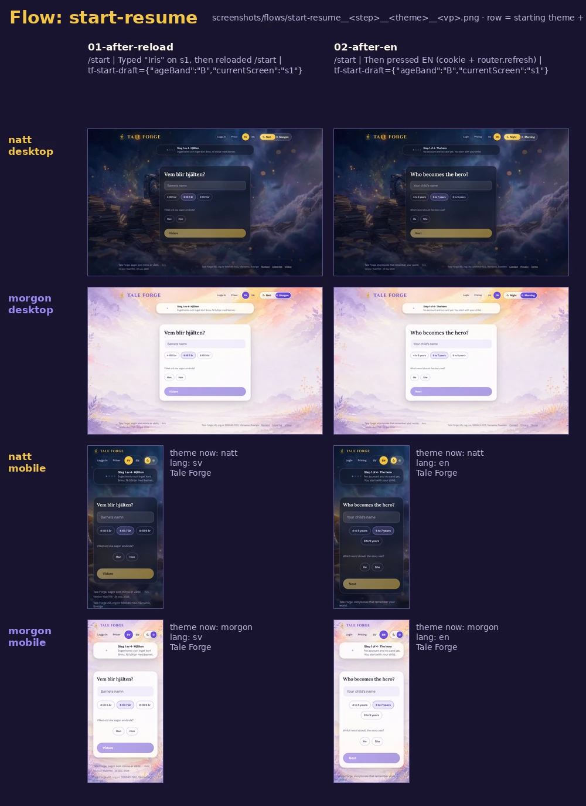

| Step | What happens | `tf-start-draft` after | Capture |
|---|---|---|---|
| 01 after-reload | s0 → s1, «Iris» typed, then **reload**: s1 comes back with an empty name and **no back chevron** | `{"ageBand":"B","currentScreen":"s1"}` | [png](../screenshots/flows/start-resume__01-after-reload__natt__desktop.png) |
| 02 after-en | **EN** pressed: s1 re-renders in English («Step 1 of 4 · The hero», «Who becomes the hero?»), same screen, same URL | unchanged | [png](../screenshots/flows/start-resume__02-after-en__natt__desktop.png) |

### 7.5 `upgrade`

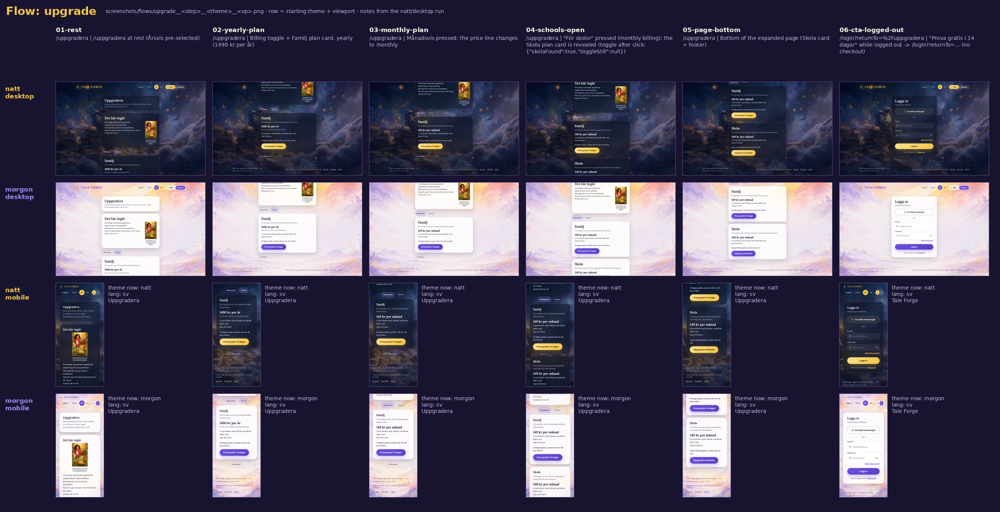

| Step | What happens | URL after | Capture |
|---|---|---|---|
| 01 rest | `/uppgradera`, Årsvis preselected | `/uppgradera` | [png](../screenshots/flows/upgrade__01-rest__natt__desktop.png) |
| 02 yearly-plan | Toggle + Familj card: «1490 kr per år» | | [png](../screenshots/flows/upgrade__02-yearly-plan__natt__desktop.png) |
| 03 monthly-plan | «Månadsvis» pressed: «149 kr per månad» | | [png](../screenshots/flows/upgrade__03-monthly-plan__natt__desktop.png) |
| 04 schools-open | «För skolor» pressed: the Skola card appears and the toggle is removed | | [png](../screenshots/flows/upgrade__04-schools-open__natt__desktop.png) |
| 05 page-bottom | Bottom of the expanded page (1575 px) | | [png](../screenshots/flows/upgrade__05-page-bottom__natt__desktop.png) |
| 06 cta-logged-out | «Prova gratis i 14 dagar» while logged out | `/login?returnTo=%2Fuppgradera` | [png](../screenshots/flows/upgrade__06-cta-logged-out__natt__desktop.png) |

### 7.6 `auth` (login and signup)

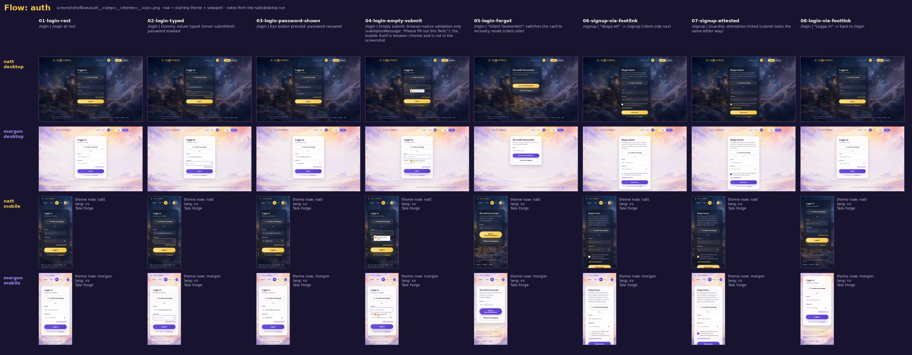

| Step | What happens | URL after | Capture |
|---|---|---|---|
| 01 login-rest | `/login` | `/login` | [png](../screenshots/flows/auth__01-login-rest__natt__desktop.png) |
| 02 login-typed | Dummy values typed (never sent); password masked | | [png](../screenshots/flows/auth__02-login-typed__natt__desktop.png) |
| 03 login-password-shown | Eye pressed: password visible, label → «Dölj lösenord» | | [png](../screenshots/flows/auth__03-login-password-shown__natt__desktop.png) |
| 04 login-empty-submit | Empty submit: native validation only, nothing styled by the site | | [png](../screenshots/flows/auth__04-login-empty-submit__natt__desktop.png) |
| 05 login-forgot | «Glömt lösenordet?»: same card becomes «Återställ lösenordet» | `/login` | [png](../screenshots/flows/auth__05-login-forgot__natt__desktop.png) |
| 06 signup-via-footlink | «Skapa ett» → `/signup` (client-side) | `/signup` | [png](../screenshots/flows/auth__06-signup-via-footlink__natt__desktop.png) |
| 07 signup-attested | Attestation ticked; submit unchanged | | [png](../screenshots/flows/auth__07-signup-attested__natt__desktop.png) |
| 08 login-via-footlink | «Logga in» → back to `/login` | `/login` | [png](../screenshots/flows/auth__08-login-via-footlink__natt__desktop.png) |

### 7.7 `gated`: redirects and 404s

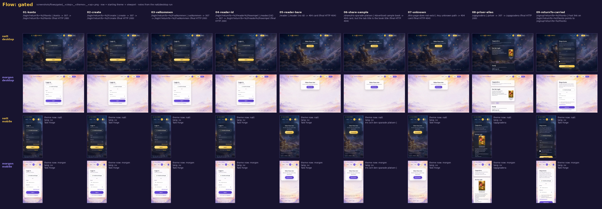

| Step | Request | Final URL | Final HTTP | Capture |
|---|---|---|---|---|
| 01 konto | `/konto` | `/login?returnTo=%2Fkonto` | 200 | [png](../screenshots/flows/gated__01-konto__natt__desktop.png) |
| 02 create | `/create` | `/login?returnTo=%2Fcreate` | 200 | [png](../screenshots/flows/gated__02-create__natt__desktop.png) |
| 03 valkommen | `/valkommen` | `/login?returnTo=%2Fvalkommen` | 200 | [png](../screenshots/flows/gated__03-valkommen__natt__desktop.png) |
| 04 reader-id | `/reader/exempel` | `/login?returnTo=%2Freader%2Fexempel` | 200 | [png](../screenshots/flows/gated__04-reader-id__natt__desktop.png) |
| 05 reader-bare | `/reader` | `/reader` (404 card) | 404 | [png](../screenshots/flows/gated__05-reader-bare__natt__desktop.png) |
| 06 share-sample | `/share/iris-sparade-platsen` | same (404 card, book title in tab) | 404 | [png](../screenshots/flows/gated__06-share-sample__natt__desktop.png) |
| 07 unknown | `/this-page-does-not-exist` | same (404 card) | 404 | [png](../screenshots/flows/gated__07-unknown__natt__desktop.png) |
| 08 priser-alias | `/priser` | `/uppgradera` | 200 | [png](../screenshots/flows/gated__08-priser-alias__natt__desktop.png) |
| 09 returnTo-carried | On `/login?returnTo=%2Fkonto` the foot link is `/signup?returnTo=%2Fkonto` | `/signup?returnTo=%2Fkonto` | 200 | [png](../screenshots/flows/gated__09-returnTo-carried__natt__desktop.png) |

### 7.8 `not-found`

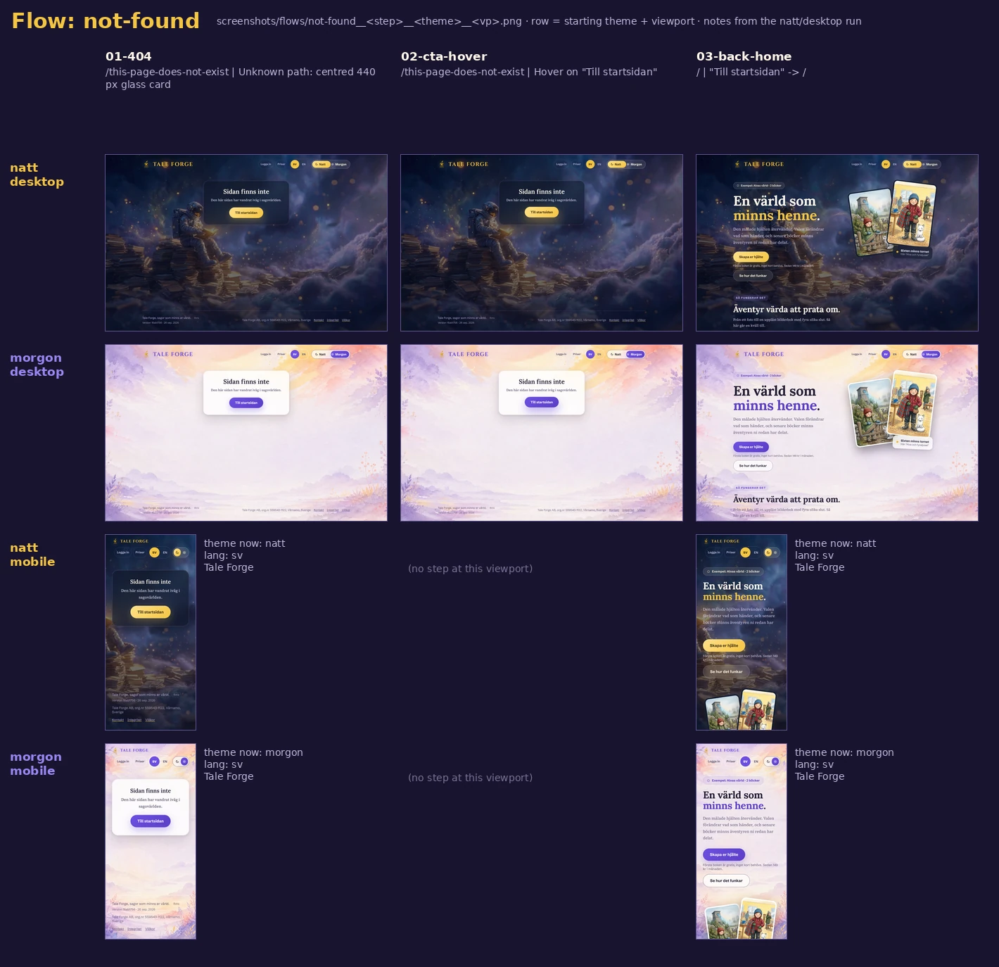

Steps: 01 the 404 card at rest ([png](../screenshots/flows/not-found__01-404__natt__desktop.png)); 02 hover on «Till startsidan» ([png](../screenshots/flows/not-found__02-cta-hover__natt__desktop.png)); 03 click → `/` ([png](../screenshots/flows/not-found__03-back-home__natt__desktop.png)).

### 7.9 `legal`

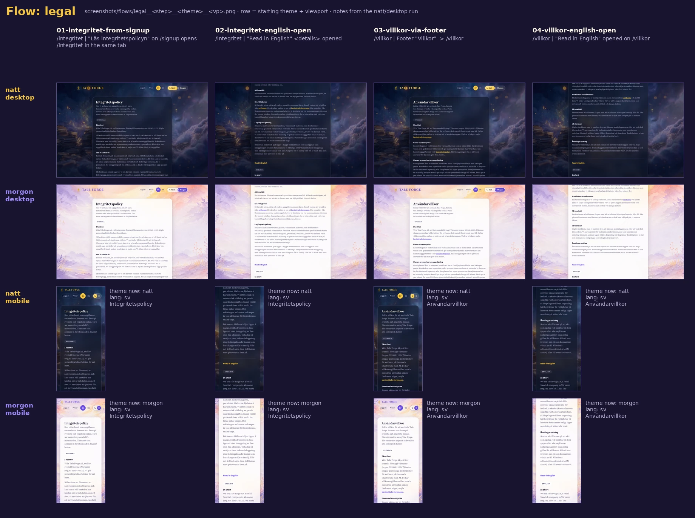

| Step | What happens | URL after | Capture |
|---|---|---|---|
| 01 integritet-from-signup | «Läs integritetspolicyn» on `/signup` opens `/integritet` in the **same tab** (no `target`). Any typed form data is left behind; on `/start` s2 the same link opens a new tab | `/integritet` | [png](../screenshots/flows/legal__01-integritet-from-signup__natt__desktop.png) |
| 02 integritet-english-open | «Read in English» opened: the page grows 2985 → 5431 px | | [png](../screenshots/flows/legal__02-integritet-english-open__natt__desktop.png) |
| 03 villkor-via-footer | Footer «Villkor» | `/villkor` | [png](../screenshots/flows/legal__03-villkor-via-footer__natt__desktop.png) |
| 04 villkor-english-open | English opened: 2469 → 4399 px | | [png](../screenshots/flows/legal__04-villkor-english-open__natt__desktop.png) |

### 7.10 `lang-switch`

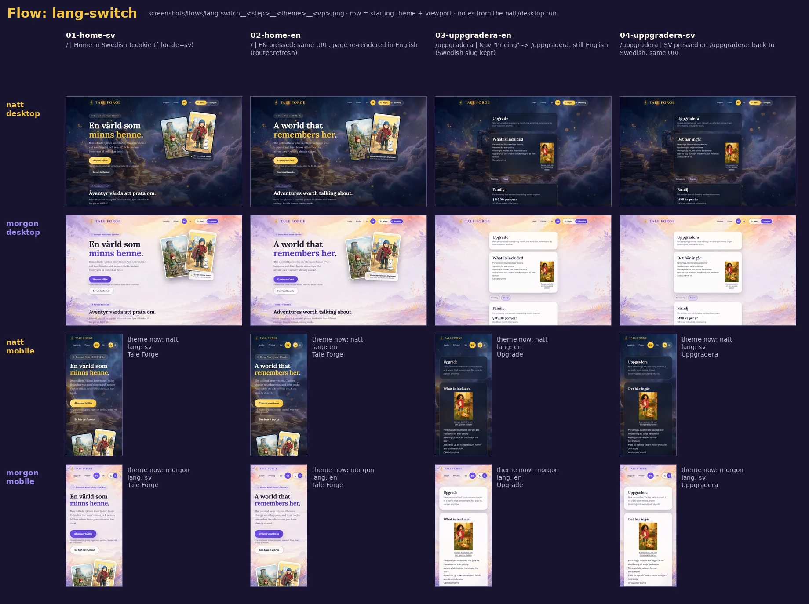

| Step | What happens | URL | `<html lang>` / cookie / title | Capture |
|---|---|---|---|---|
| 01 home-sv | Default | `/` | sv / `tf_locale=sv` / Tale Forge | [png](../screenshots/flows/lang-switch__01-home-sv__natt__desktop.png) |
| 02 home-en | **EN** pressed: same URL, page re-rendered in English (h1 «A world that remembers her.») | `/` | en / `tf_locale=en` | [png](../screenshots/flows/lang-switch__02-home-en__natt__desktop.png) |
| 03 uppgradera-en | Nav «Pricing» → still `/uppgradera` | `/uppgradera` | en / en / **Upgrade** | [png](../screenshots/flows/lang-switch__03-uppgradera-en__natt__desktop.png) |
| 04 uppgradera-sv | **SV** pressed: back to Swedish, same URL | `/uppgradera` | sv / sv / **Uppgradera** | [png](../screenshots/flows/lang-switch__04-uppgradera-sv__natt__desktop.png) |

The switch, verbatim from `LanguageSwitcher` ([`390j9gbq0u9ce.js`](../source/js/390j9gbq0u9ce.js); `LOCALE_COOKIE` = `"tf_locale"`):

```js
onClick:()=>(function(t){if(t!==e){try{document.cookie=`${n.LOCALE_COOKIE}=${"en"===t?"en":"sv"}; path=/; max-age=31536000; SameSite=Lax`}catch{}i.refresh()}})(r),
style:{padding:"5px 11px",borderRadius:"999px",border:"none",background:a?"var(--accent)":"transparent",
       color:a?"var(--btn-ink)":"var(--card-sub)",fontFamily:"var(--ui)",fontWeight:a?800:700,fontSize:".82rem",
       letterSpacing:".02em",cursor:a?"default":"pointer",minHeight:"44px",minWidth:"44px"}
```

- The cookie lasts one year.
- `router.refresh()` re-renders the server components without a full page load, so the backdrop, theme and client state survive. For example, `/start` stays on s1 ([§7.4](#74-start-resume)).
- The theme switch labels change language too: Natt/Morgon → Night/Morning.

### 7.11 `theme-persist`

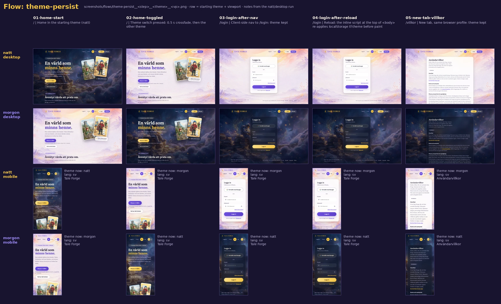

| Step | What happens | `body[data-theme]` / `tf-theme` (start natt) | Capture |
|---|---|---|---|
| 01 home-start | Home in the starting theme | natt / natt | [png](../screenshots/flows/theme-persist__01-home-start__natt__desktop.png) |
| 02 home-toggled | Theme switch pressed: 0.5 s crossfade ([06 §7](06-theming-and-atmosphere.md#7-the-crossfade-between-themes-measured)) | morgon / morgon | [png](../screenshots/flows/theme-persist__02-home-toggled__natt__desktop.png) |
| 03 login-after-nav | Nav «Logga in»: client-side, theme kept | morgon / morgon | [png](../screenshots/flows/theme-persist__03-login-after-nav__natt__desktop.png) |
| 04 login-after-reload | Reload: the inline script at the top of `<body>` re-applies the stored theme before the backdrop paints | morgon / morgon | [png](../screenshots/flows/theme-persist__04-login-after-reload__natt__desktop.png) |
| 05 new-tab-villkor | New tab, same profile, `/villkor`: kept | morgon / morgon | [png](../screenshots/flows/theme-persist__05-new-tab-villkor__natt__desktop.png) |

The pre-paint script, verbatim. It is the first script in `<body>`, right after an empty hidden `div`, in every page's server HTML (e.g. [`home.sv.html`](../source/html/home.sv.html)):

```html
<script>(function(){try{var t=localStorage.getItem('tf-theme');if(t==='natt'||t==='morgon'){document.body.dataset.theme=t;}}catch(e){}})();</script>
```

The toggle's click handler (`ThemeToggle`, [`390j9gbq0u9ce.js`](../source/js/390j9gbq0u9ce.js)):

```js
onClick:function(){let e="natt"===a()?"morgon":"natt";document.body.dataset.theme=e;try{localStorage.setItem("tf-theme",e)}catch{}window.dispatchEvent(new Event(n))}
// n = "tf-theme-change"; a() = "morgon"===document.body.dataset.theme?"morgon":"natt"
```

- No `prefers-color-scheme` query exists in any of the four CSS files. A first visit is always natt, whatever the OS setting.
- The theme is per browser (localStorage). It is not per account and not part of the URL.

## 8. The user journey and how the style holds

### 8.1 The intended path

```text
/ (landing) ──«Skapa er hjälte»──▶ /start s0 ──▶ s1 Hjälten ──▶ s2 Fotot ──▶ s3 Sällskapet ──▶ s4 unveil
   │                                  │                                                         │
   │                                  └─«Läs en exempelbok först»→ gallery → /share/… (404)       ▼
   ├─ covers / shelf / upload / «Lägg till en vän» → /signup ──(after sign-up)──▶ /start      s5 Kontot (account made here)
   ├─ «Läs exempelboken» ×2 → /share/… (404)                                                   │
   └─ nav «Priser» → /uppgradera ──CTA (logged out)──▶ /login?returnTo=%2Fuppgradera           ▼
                                                                                  s6 four doors → s7 «Boken skapas» (Glödvakten)
                                                                                                │
                                                                                                ▼
                                                                         s8 → /reader/{id}?from=create → end: /create · /
```

- **Observed:**
  - The landing has two `/start` links and six `/signup` links. The `/signup` links are all on illustrations or decorative cards (covers, shelf books, upload card, add-a-friend), never on a button.
  - `/start` never sends you to `/signup`. The account is created inside the flow at s5, after the portrait has been painted (s4).
  - A visitor who does go to `/signup` is sent to `/start` after sign-up (`"signup"===e?"/start":"/"`), so both paths meet at the same place.
- Read: the IA is a funnel with one mouth (`/start`). Everything else on the landing either explains (the chapter), proves (the sample book, currently broken), or reassures (pricing, legal). The account wall is pushed as late as possible: the parent sees their child painted before being asked for an e-mail. The microcopy repeats this promise («inget kort behövs», «Inget konto och inget kort ännu»).

### 8.2 What stays the same along the way

- **Frame:**
  - The same `.shell` (1120 column, 28 px gutters), nav, footer and painted backdrop on every step.
  - The backdrop is `position: fixed` and is never re-rendered by client-side navigation, so moving between pages never flashes.
  - Theme and language carry over everywhere (§7.10, §7.11).
- **Material.** Every surface is the same `.glass` recipe: 26 px radius, blur, and a violet→gold→coral hairline at 135°. Buttons are pills:
  - primary = gold gradient `linear-gradient(135deg, #ffe08a, #f5c542)` with ink `#3a2b10` in natt
  - violet `linear-gradient(135deg, #6d4fe0, #5b3fc7)` with white ink in morgon
  - (`--btn-grad`/`--btn-ink` at [`:528-529`](../source/css/3q17cp_jgfwol.pretty.css) and [`:577-578`](../source/css/3q17cp_jgfwol.pretty.css))
  - ghost = translucent fill with a hairline and a 14 px backdrop blur ([`:918-924`](../source/css/3q17cp_jgfwol.pretty.css)).
- **Type.** Lora for display headings and Schibsted Grotesk for UI are used on every step ([03](03-typography.md)).
- **Motion grammar.** Content rises into place with the same ease-out curve `cubic-bezier(0.2, 0.7, 0.3, 1)`:

| Element | Distance | Duration |
|---|---|---|
| landing sections (`.reveal`) | 26 px | 0.7 s |
| `/start` screens (`tfStartIn`) | 22 px | 0.45 s |
| `/start` gallery | | 0.4 s |

  Primary buttons lift 3 px on hover and press to `scale(0.96)` ([`:886-917`](../source/css/3q17cp_jgfwol.pretty.css)).

### 8.3 What changes

| Stage | Density and imagery | Heading scale | Notes |
|---|---|---|---|
| Landing `/` | Richest: painted hero, cover fan, six-step chapter with portraits, scene, endings map, covers; 4994 px | h1 70.4 px (Lora 700) | gold primary / ghost secondary pairs |
| `/start` s0 | Same hero recipe compressed to one screen; different h1 («Ikväll är hjälten ert barn.») | h1 70.4 px | CTAs become buttons |
| `/start` s1–s2 | Illustrations disappear; one 560 px card, progress strip | step h2 in the card | dimmed «Vidare» until valid |
| s3–s6 (injected, [05b](05b-components-app-and-forms.md)) | Imagery returns: hero card, the easel unveil, adventure doors | | |
| s7 Glödvakten | The most theatrical screen: a hearth fire and a hanging signboard (special layout at ≥1800 px) | | [05b §6](05b-components-app-and-forms.md#6-glödvakten-the-waiting-fire-where-the-book-is-baked-s7) |
| `/reader/{id}` | Book spreads, choices, end ceremony | | [05b §7](05b-components-app-and-forms.md#7-reader-and-share-page-storyreader-reconstructed) |
| Quiet pages (login, signup, pricing, legal, 404) | No illustration except the 112 px pricing cover; one card | `.page-title` 32 px (Lora 600) | the backdrop carries the mood |

- Read: the style "breathes" along the funnel. It is loud and pictorial where it persuades (landing), drops to a single quiet card where it asks for effort (name, photo, e-mail, payment), and turns theatrical again where it pays off (unveil, waiting fire, reader). Because the painted backdrop and the glass never change, the quiet pages still feel like the same night (or morning) sky.

## 9. Extra viewports: 1920, 2560 and 360

Home (sv) captured live on 2026-10-10, both themes, viewport and full page. The images are WebP q90 because each PNG was over 500 KB. Measurements are in [`derived/ia/extra-viewports.json`](../derived/ia/extra-viewports.json).

| Viewport | Column x / width | Nav h | Hero h | h1 size | Page height | Viewport capture | Full page |
|---|---|---|---|---|---|---|---|
| 1440×900 (reference) | 188 / 1064 | 96 | 576 | 70.4 px | 4994 | [natt](../screenshots/pages/home/home__sv__natt__desktop__fold.png) | [natt](../screenshots/pages/home/home__sv__natt__desktop__full.webp) |
| 1920×1080 | 428 / 1064 | 96 | 691 | 70.4 px | 5110 | [natt](../screenshots/flows/extra-viewports/home__sv__natt__1920x1080__fold.webp) · [morgon](../screenshots/flows/extra-viewports/home__sv__morgon__1920x1080__fold.webp) | [natt](../screenshots/flows/extra-viewports/home__sv__natt__1920x1080__full.webp) · [morgon](../screenshots/flows/extra-viewports/home__sv__morgon__1920x1080__full.webp) |
| 2560×1440 | 748 / 1064 | 96 | 922 | 70.4 px | 5340 | [natt](../screenshots/flows/extra-viewports/home__sv__natt__2560x1440__fold.webp) · [morgon](../screenshots/flows/extra-viewports/home__sv__morgon__2560x1440__fold.webp) | [natt](../screenshots/flows/extra-viewports/home__sv__natt__2560x1440__full.webp) · [morgon](../screenshots/flows/extra-viewports/home__sv__morgon__2560x1440__full.webp) |
| 390×844 @2 (reference) | 28 / 334 | 116 | 909 | 43.2 px | 7848 | [natt](../screenshots/pages/home/home__sv__natt__mobile__fold.png) | |
| 360×740 @2 | 28 / 304 | 166 | 904 | 43.2 px | 7911 | [natt](../screenshots/flows/extra-viewports/home__sv__natt__360x740__fold.webp) · [morgon](../screenshots/flows/extra-viewports/home__sv__morgon__360x740__fold.webp) | [natt](../screenshots/flows/extra-viewports/home__sv__natt__360x740__full.webp) · [morgon](../screenshots/flows/extra-viewports/home__sv__morgon__360x740__full.webp) |

- **Large screens.** Nothing on the landing grows past the 1120 column.
  - The only element that scales is the hero, through `min-height: 64vh` (576 → 691 → 922 px). The extra page height equals exactly the hero difference (4994 + 115 = 5109 ≈ 5110; 4994 + 346 = 5340).
  - The h1 is capped at 4.4rem (70.4 px) from about 1304 px wide (5.4vw = 70.4 px).
  - At 2560 the column fills 42% of the width, and the rest is painted sky: the nebula plate is `object-fit: cover; object-position: center 30%` in a fixed layer ([`:623-630`](../source/css/3q17cp_jgfwol.pretty.css)).
  - The `min-width: 1800px` breakpoint lives only in the `/start` route CSS, for the Glödvakten signboard ([`37m388zf6rymp.pretty.css:303-343`](../source/css/37m388zf6rymp.pretty.css)). It does not touch the landing.
- **Small screens.**
  - At 360 the nav needs a third row for the theme switch (166 px vs 116 at 390). The page is 63 px taller than at 390, 50 px of it from the nav.
  - Everything else reflows exactly as at 390: one column, gutters stay 28 px, h1 at its 2.7rem floor.
- Read: the site is designed for laptop and phone. On a 4K or ultrawide display it reads as a centred book on a painted wall. For film this is useful: a 16:9 frame has generous negative space on both sides of the column (§12).

## 10. Read: what the IA says

1. **One URL per page, whatever the language.**
   - The language is invisible in the address bar. A shared link opens in the recipient's language (or Swedish by default).
   - This keeps the URL space tiny and the slugs Swedish, signalling a Swedish product with an English courtesy layer.
   - The cost: no hreflang, crawlers see Swedish only, and `og:locale` follows whoever fetched the page.
2. **Funnel, not catalogue.** There is no blog, FAQ, about or examples gallery. The "how it works" page is a chapter of the landing (anchor `#sa-funkar-det`), not a route. Proof is meant to come from one sample book.
3. **Deferred commitment.** Pricing is a nav item, but the price is first stated as microcopy under the primary CTA («Sedan 149 kr i månaden»). The account step is the fourth of four numbered steps.
4. **Quiet pages are honest and plain.**
   - The legal pages are bilingual on a single URL, with both texts complete.
   - Tab titles and descriptions exist only where a person might search or bookmark (pricing, legal).
5. **Gating is server-side and silent.** The redirects preserve the destination (`returnTo`, sanitised to same-origin), but the login card does not acknowledge it.

## 11. Defects and oddities

| # | Observation | Evidence |
|---|---|---|
| 1 | The advertised sample book `/share/iris-sparade-platsen` returns 404 from 4 entry points (home ×2, `/start` gallery, `/uppgradera` cover) | §5.8, `gated` 06, `home-paths` 04, `start-gallery` 05 |
| 2 | On that 404, the tab title is the book's title («Iris och den sparade platsen \| Tale Forge») | [`flows.csv`](../derived/ia/flows.csv) |
| 3 | 404 canonical echoes the requested path; the 404 card has no h1 (h2 only) | [`404.sv.html`](../source/html/404.sv.html), [`dom__404__sv.html`](../source/rendered/dom__404__sv.html) |
| 4 | `og:title` is «Tale Forge» everywhere, and the legal pages' own descriptions are not used for `og:description` | §6 |
| 5 | Login reached through a gated redirect gives no reason ("log in to see your account") | §5.9 |
| 6 | No current-page state in the nav | §3.1 |
| 7 | `/start` s0 badge says «Iris och den sparade platsen» while the two covers above it are the Alva books | [`journey__03-start-s0__natt__desktop.png`](../screenshots/flows/journey__03-start-s0__natt__desktop.png) |
| 8 | `/start` reload keeps the screen but drops the typed name and the back chevron | §7.4 |
| 9 | «Läs integritetspolicyn» on `/signup` navigates away in the same tab, while the same link on `/start` s2 opens a new tab (`target:"_blank",rel:"noopener noreferrer"`, [`0ad0wel9cyv30.js`](../source/js/0ad0wel9cyv30.js)) | `legal` 01 |
| 10 | Footer «Version 16ab1756» does not match `<meta name="tf-release-sha" content="4be07efd…">` | §3.2, §6 |
| 11 | Hero covers float continuously, so they never become "stable" for automation (Playwright needed `force`) | `home-paths` 05 |
| 12 | `robots.txt` disallows `/voice-test`, which 404s (an internal tool name left public) | §2 |

The accessibility side of several of these (h1, focus, targets) is covered in [14 §18](14-accessibility-and-craft.md#18-defect-list-ranked).

## 12. For film and emulation

- **Plates.**
  - `screenshots/flows/` gives every page and state in both themes at desktop and mobile.
  - `screenshots/flows/extra-viewports/` gives the home page at 1920×1080 and 2560×1440, ready as 16:9 backgrounds.
  - At 1920 the content column runs from x = 428 to 1492, so a 16:9 frame has about 428 px of painted sky on each side for titles or a presenter.
- **Transitions to imitate** (all observed on the site):
  - **Page change:** keep the backdrop locked. Only the content swaps, because navigation is client-side.
  - **Screen change inside `/start`:** new card rises 22 px and fades in over 0.45 s, `cubic-bezier(0.2, 0.7, 0.3, 1)`.
  - **Scroll reveal on the landing:** 26 px, 0.7 s, same curve.
  - **Theme change:** 0.5 s `ease` dissolve between the night and morning paintings. The toggle thumb overshoots about 4% ([06 §7](06-theming-and-atmosphere.md#7-the-crossfade-between-themes-measured); frames in [`screenshots/motion/`](../screenshots/motion/)).
  - **Language change:** no transition. The words swap in place (`router.refresh()`), and the layout barely moves.
  - **Button press:** lift −3 px on hover over 0.25 s `cubic-bezier(0.2, 0.7, 0.3, 1.4)`; press to 0.96.
- **A 30-second "journey" storyboard in the house style.** All copy below is verbatim from the site.

| Time | Shot |
|---|---|
| 0–4 s | Night sky plate. The hero h1 «En värld som minns henne.» rises in the way `.reveal` does |
| 4–8 s | The gold «Skapa er hjälte» pill lifts and presses |
| 8–14 s | Cut to the `/start` card stack: s1 «Vem blir hjälten?» with the name typed. Each card enters with `tfStartIn` |
| 14–18 s | s2 «Gör Iris till hjälten.» with the attestation ticking |
| 18–24 s | The unveil and Glödvakten from [05b §16](05b-components-app-and-forms.md#16-reproduce-it-film-and-emulation-recipes) |
| 24–30 s | Reader spread, then a 0.5 s theme dissolve to morning on the end card |

- **Emulating the IA.** For a site in this style:
  - one landing that tells the story as a chapter
  - one route that starts making before asking for an account
  - quiet single-card pages at 440 / 560 / 760 px for forms, pricing and prose
  - language as a preference rather than a path
  - one shared frame (nav, painted fixed backdrop, footer) that never re-renders.

## 13. Files produced for this dimension

All paths are relative to the library root.

| Path | What it is |
|---|---|
| [`analysis/13-pages-ia-and-flows.md`](13-pages-ia-and-flows.md) | this file |
| [`derived/ia/sitemap.svg`](../derived/ia/sitemap.svg) | hand-written site map and flow diagram (1600×1130, site colours) |
| [`derived/ia/sitemap.png`](../derived/ia/sitemap.png) | the SVG rendered by Chromium at 1600×1130 |
| [`derived/ia/pages.csv`](../derived/ia/pages.csv) | page-by-page table: purpose, titles, descriptions, canonical, h1 sv/en, outline, CTAs, template, widths, route CSS, heights, screenshot, copy deck |
| [`derived/ia/routes.csv`](../derived/ia/routes.csv) | 30 probed routes with status, redirect, sitemap and robots membership, kind, notes |
| [`derived/ia/link-graph.json`](../derived/ia/link-graph.json) | every `a`/`button`/`summary` per page and language with region (nav/main/foot), text, href, aria state; plus `client_destinations` for buttons (from JS) |
| [`derived/ia/head-metadata.json`](../derived/ia/head-metadata.json) | parsed `<head>` of every server HTML file (title, meta, links, scripts, body attributes) |
| [`derived/ia/flows.csv`](../derived/ia/flows.csv) | 226 flow steps with URL, title, lang, theme, localStorage, cookie, scroll, height and note |
| [`derived/ia/extra-viewports.json`](../derived/ia/extra-viewports.json) | measured rects at 1920, 2560 and 360 |
| [`derived/ia/flow-sheets/`](../derived/ia/flow-sheets/) | 11 contact sheets (WebP): `journey`, `home-paths`, `start-gallery`, `start-resume`, `upgrade`, `auth`, `gated`, `not-found`, `legal`, `lang-switch`, `theme-persist` |
| [`screenshots/flows/`](../screenshots/flows/) | 226 step captures (PNG): `<flow>__<NN-step>__<natt\|morgon>__<desktop\|mobile>.png` |
| [`screenshots/flows/extra-viewports/`](../screenshots/flows/extra-viewports/) | 12 home captures (WebP q90): 1920×1080, 2560×1440, 360×740@2; natt and morgon; viewport and full page |

Each flow sheet shows every step of one flow. Rows are the starting theme and viewport (natt/morgon × desktop/mobile). Over each column is the URL after the step and the natt/desktop note. Mobile cells also print the theme, language and tab title after the step.

## 14. Uncertainties

- **Behind login.** Signed-in behaviour (the Bokhylla/Konto nav, the `/stripe/checkout` call, post-auth redirects, `/valkommen`, `/konto`, `/create`) is read from minified JS, not observed. s3–s8 and the reader were not reached live; [05b](05b-components-app-and-forms.md) reconstructs them by injection.
- **Why the share page 404s.** It is unknown whether the sample book was unpublished on purpose or is a bug. The client-side title suggests the record exists.
- **Analytics.** `CtaLink` carries `cta`/`surface` ids and a `LandingPing` component exists, but their requests were blocked, so the event names actually sent are not captured.
- **Anonymous sessions.** The "anonymous user on `/start`" nav state comes from code; a fresh visitor in these runs was always "signed out".
- **Version label.** The meaning of the footer «Version 16ab1756» vs `tf-release-sha` 4be07efd… (two different builds, or a short id of another repo) is unknown.
- **Book-fair routes.** `/bokmassan/*` was not re-captured here; it is covered in 05b §11 and may be taken down after the fair.
