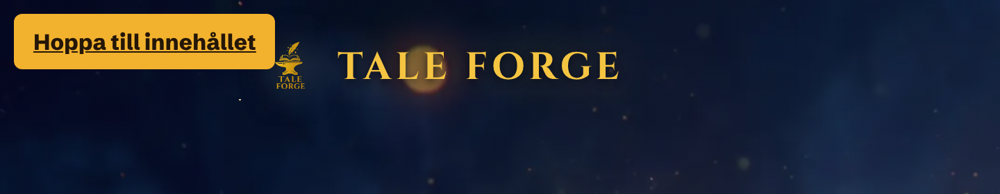
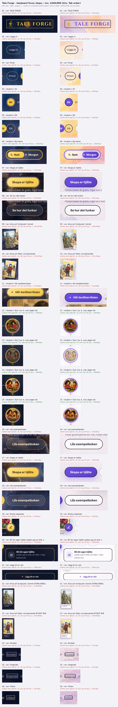

# 14 · Accessibility and technical craft

Tale Forge's accessibility work is deliberate but incomplete. It has real semantics: a `role="switch"` theme toggle, an `aria-pressed` language group, 44 px minimum targets written into the CSS, `prefers-reduced-motion` blocks in all four stylesheets, metric-matched font fallbacks, and a strict CSP. There are also a few clear slips. The skip link can never receive focus. Most controls show the browser's default focus ring instead of a branded one. Two hero animations ignore reduced motion because of a specificity bug. Small footer text drops below AA in morgon. The footer sits outside any landmark.

This file collects the literal material: verbatim CSS and JS, axe-core results for 9 routes × 2 languages × 2 themes, keyboard focus captures, a token × surface contrast matrix and page weights. It separates what was measured from how to read it. All figures are for desktop at 1440×900 unless a mobile figure is named. Runs used `tf_locale=sv` unless English is named.

## Contents

1. [Scorecard](#1-scorecard)
2. [Method and files](#2-method-and-files)
3. [Document skeleton: lang, titles, landmarks, headings](#3-document-skeleton-lang-titles-landmarks-headings)
4. [The skip link ("Hoppa till innehållet")](#4-the-skip-link-hoppa-till-innehållet)
5. [Keyboard order and focus styling](#5-keyboard-order-and-focus-styling)
6. [ARIA patterns, verbatim](#6-aria-patterns-verbatim)
7. [Images, alt text and decorative SVG](#7-images-alt-text-and-decorative-svg)
8. [Target sizes (the 44 px rule)](#8-target-sizes-the-44-px-rule)
9. [Motion and `prefers-reduced-motion`](#9-motion-and-prefers-reduced-motion)
10. [Colour contrast: token × surface matrix](#10-colour-contrast-token--surface-matrix)
11. [axe-core results](#11-axe-core-results)
12. [Reflow, zoom and viewport](#12-reflow-zoom-and-viewport)
13. [Font loading](#13-font-loading)
14. [Image strategy](#14-image-strategy)
15. [Security headers and CSP](#15-security-headers-and-csp)
16. [PWA manifest and icons](#16-pwa-manifest-and-icons)
17. [Page weights](#17-page-weights)
18. [Defect list (ranked)](#18-defect-list-ranked)
19. [Read: what the craft says about the brand, and how to emulate it](#19-read-what-the-craft-says-about-the-brand-and-how-to-emulate-it)
20. [Uncertainties](#20-uncertainties)
21. [File index](#21-file-index)

---

## 1. Scorecard

| Area | Observed | Verdict |
|---|---|---|
| `lang` | `<html lang="sv">` or `lang="en"`, set server-side from the `tf_locale` cookie. Legal pages wrap each language column in `<div lang="sv">` / `<div lang="en">` | Good |
| `translate="no"` | Only on the wordmark link `a.logo` | Good (brand protected from auto-translate) |
| Skip link | Present on every page (`#main-content`). It cannot be focused, because `visibility: hidden` takes it out of the tab order | **Broken** |
| Landmarks | `nav`, `main#main-content`. Footer is a `div.foot` outside all landmarks: axe `region` fails on all 36 runs | Partial |
| Headings | One `h1` per content page. 404 and share route have only an `h2`. Legal pages jump h1→h3 | Partial |
| Focus styling | 5 custom `:focus-visible` rules in the global CSS: switch, map medallions, form fields, reader controls, story choices. All other links and buttons show Chromium's default `auto` ring | Partial |
| ARIA widgets | switch, toggle buttons (`aria-pressed`), `aria-expanded`, dialogs with focus trap and Escape, `role=status/alert` | Good |
| Targets | Nav, switch and language buttons are ≥44 px. 0 failures of WCAG 2.5.8 (24 px). 51 desktop / 46 mobile targets miss 44 × 44 | Good (AA), mixed (AAA) |
| Reduced motion | 6 → 2 running animations under `reduce`. `.fan .badge` float and its `.dotpulse` keep running (specificity bug) | Mostly good, 1 bug |
| Contrast | Body copy, cards and buttons pass AA by a wide margin. Morgon footer meta text fails, 3.66:1 and 4.04:1 per axe. Natt page text can fall under 4.5 over the brightest 5 % of the nebula | Mostly good |
| Fonts | 4 woff2 preloaded via `Link` header, `font-display: swap`, `size-adjust` fallbacks | Excellent |
| Images | All WebP except 2 JPG avatars; preloads; `<picture>` art direction; `loading="lazy"` below the fold | Good |
| Security | CSP, HSTS 2 y, `X-Frame-Options: DENY`, `nosniff`, `Referrer-Policy`. `script-src 'unsafe-inline'` | Good |
| Weight | Home 1,605 KiB / 45 requests; other routes ~760 KiB | Reasonable |

---

## 2. Method and files

- **axe-core 4.14.0**, injected with `page.addScriptTag`, run with `axe.run(document)` and its default rule set (all non-experimental rules, best-practice included). It ran after one scroll-through on all 9 routes (home, start, uppgradera, login, signup, integritet, villkor, 404 and the share-sample route that returns 404) × sv/en × natt/morgon = **36 runs**. Raw results are in [derived/a11y/axe/](../derived/a11y/axe/) as `<page>__<theme>.json` (sv) and `<page>__en__<theme>.json`. The rollups are [axe-summary.csv](../derived/a11y/axe-summary.csv) (one row per run × rule × result type) and [axe-summary.json](../derived/a11y/axe-summary.json).
- **Keyboard walk.** Playwright Chromium at 1440×900 @2x pressed real `Tab` keys from the top of the page. It captured a crop of each focus stop with 28 px padding, and the full viewport for stops 1, 2 and the theme toggle. It also recorded computed `outline-*`, `box-shadow`, `aria-*` and `:focus-visible` per stop. Results are in [derived/a11y/focus/](../derived/a11y/focus/), with `home__natt`, `home__morgon`, `login__natt` and `login__morgon` each holding a `focus-order.json`. The contact sheets are [focus-sheet__home.webp](../derived/a11y/focus-sheet__home.webp) and [focus-sheet__login.webp](../derived/a11y/focus-sheet__login.webp).
- **Contrast.** [derived/a11y/contrast.csv](../derived/a11y/contrast.csv) crosses 26 text colours with 17 surfaces in 2 themes, 884 rows. Translucent surfaces are composited over the solid body colour and over the measured `.bg` plate: its darkest 5 %, median and lightest 95 % pixels, on desktop and mobile. The plates are the live captures in [derived/color/backdrop-layer__*.png](../derived/color/). Glass surfaces are sampled from a Gaussian-blurred plate (σ = the CSS blur). The samples are in [contrast-backdrop-samples.json](../derived/a11y/contrast-backdrop-samples.json). Per-element live measurements were made by the colour dimension and are not repeated here: [derived/color/contrast.csv](../derived/color/contrast.csv), method in [02-color.md §13](02-color.md#13-contrast-wcag-measured-on-the-live-site).
- **Targets, reflow, reduced motion, skip link.** One Playwright pass produced [target-sizes.csv](../derived/a11y/target-sizes.csv) (256 rows: 8 routes × desktop/mobile), [reflow-320.json](../derived/a11y/reflow-320.json), [reduced-motion.json](../derived/a11y/reduced-motion.json) and [skip-link-test.json](../derived/a11y/skip-link-test.json).
- **Static inventory.** BeautifulSoup parsed every server HTML and hydrated DOM for landmarks, headings, ARIA, images, SVGs, forms, preloads, `lang` and `translate`. Output: [static-inventory.json](../derived/a11y/static-inventory.json).
- **Weights and fonts.** Playwright `request.sizes()` gives the encoded body bytes as received. Files: [page-weights.csv](../derived/a11y/page-weights.csv), [page-weights-requests.csv](../derived/a11y/page-weights-requests.csv) (every request), [image-strategy.csv](../derived/a11y/image-strategy.csv) and [fonts-loaded.json](../derived/a11y/fonts-loaded.json) (`document.fonts` with status `loaded`).

---

## 3. Document skeleton: lang, titles, landmarks, headings

### 3.1 Language

- `<html lang>` follows the cookie: `home.sv.html` opens `<html data-dpl-id="dpl_5Vpduq8opRp7BMxHMDGP7rAXoCjG" lang="sv" …>` and `home.en.html` opens with `lang="en"` ([source/html/home.sv.html](../source/html/home.sv.html), [home.en.html](../source/html/home.en.html)). The URL does not change.
- Each of the bilingual legal pages renders both languages and marks each block with `lang`. In [dom__integritet__sv.html](../source/rendered/dom__integritet__sv.html) there is `<div lang="sv">` ("Svenska I korthet Vi är Tale Forge AB …") followed by `<div lang="en">` ("English In short We are Tale Forge AB …"). The same pattern is in villkor. Screen readers switch voice correctly.
- `translate="no"` appears exactly once per page, on the wordmark: `<a class="logo" translate="no" style="text-decoration:none" href="/">Tale Forge</a>`.
- The language switcher's group label is localised: `"Byt språk"` / `"Change language"` ([source/js/390j9gbq0u9ce.js](../source/js/390j9gbq0u9ce.js)).

### 3.2 Titles

| Route | sv `<title>` | en `<title>` |
|---|---|---|
| `/`, `/start`, `/login`, `/signup`, 404 | `Tale Forge` | `Tale Forge` |
| `/uppgradera` | `Uppgradera` | `Upgrade` |
| `/integritet` | `Integritetspolicy` | `Privacy notice` |
| `/villkor` | `Användarvillkor` | `Terms of service` |

Read: five routes share the bare brand title, so tabs and history entries are indistinguishable (WCAG 2.4.2 is met only nominally). The routes that do have titles drop the brand suffix.

### 3.3 Landmarks

The hydrated home DOM, as an outline ([static-inventory.json](../derived/a11y/static-inventory.json), key `source/rendered/dom__home__sv.html`):

```
body[data-theme]
├─ div[hidden]                      (React Suspense placeholder)
├─ div.bg.bg-night   img[alt=""] · div.scrim · div.starfield      ← decorative plate
├─ div.bg.bg-day     picture > source[media="(max-width: 760px)"] + img[alt=""]
└─ div.wrap > div.shell
   ├─ a.skip-link[href="#main-content"]  "Hoppa till innehållet"
   ├─ nav                                (no aria-label; only one nav)
   │   ├─ a.logo[translate=no]
   │   └─ div.nav-right: a "Logga in" · a "Priser" · div.language-switcher[role=group] · button.tt[role=switch]
   ├─ main#main-content
   │   ├─ header.hero        (inside main → not a banner landmark)
   │   ├─ section#sa-funkar-det.reveal.in.hiw   (+ span#how-it-works.hiw-anchor-alias[aria-hidden])
   │   ├─ section.reveal.in  ("Din hjälte")
   │   └─ section.reveal.in  ("Bokhyllan")
   └─ div.foot           ← NOT a <footer>; outside every landmark (axe "region")
```

- **No `contentinfo`.** The footer is `<div class="foot">`. axe flags `region` on `.foot` in **all 36 runs** ([axe-summary.csv](../derived/a11y/axe-summary.csv)). It carries "Tale Forge, sagor som minns er värld." [Tale Forge, stories that remember your world.], the "Beta" pill, the build version, the company line, and the links Kontakt / Integritet / Villkor.
- **Bilingual anchor alias.** `#sa-funkar-det` is the Swedish anchor ("Se hur det funkar" links to it). An empty `span#how-it-works.hiw-anchor-alias[aria-hidden="true"]` inside the section keeps English deep links working without exposing a duplicate to assistive tech ([source/js/3d9nxlx1n5pdy.js](../source/js/3d9nxlx1n5pdy.js), `ExplainerChapter`).

### 3.4 Headings

| Route | Outline (sv, from hydrated DOM) | axe |
|---|---|---|
| home | h1 "En värld som minns henne." [A world that remembers her.] → h2 "Äventyr värda att prata om." → h3 ×6 (Bygg er hjälte, Ta med en vän, Välj kvällens äventyr, Läs och välj, Fyra olika slut, Världen minns) → h2 "Din hjälte" → h3 "Ta med en vän" → h2 "Bokhyllan" | pass |
| start | h1 "Ikväll är hjälten ert barn." [Tonight the hero is your child.] | pass |
| uppgradera | h1 "Uppgradera" → h2 "Det här ingår" → h2 "Familj" | pass |
| login / signup | h1 "Logga in" / "Skapa konto" | pass |
| integritet / villkor | h1 → **h3** "I korthet" … (both language columns) | `heading-order` (8 runs) |
| 404, share route | only h2 "Sidan finns inte" [The page does not exist] | `page-has-heading-one` (8 runs) |

---

## 4. The skip link ("Hoppa till innehållet")

Markup is on every route, in sv and en ("Skip to content"), and is server-rendered:

```html
<a class="skip-link" href="#main-content">Hoppa till innehållet</a>
```

CSS, verbatim from [source/css/3q17cp_jgfwol.pretty.css:473-492](../source/css/3q17cp_jgfwol.pretty.css):

```css
.skip-link {
  z-index: 1000;
  background: var(--gold);
  color: #241608;
  font-family: var(--ui);
  border-radius: 6px;
  padding: 10px 14px;
  font-weight: 800;
  position: fixed;
  top: 10px;
  left: 10px;
  transform: translateY(-160%);
}
.skip-link:not(:focus) {
  visibility: hidden;
}
.skip-link:focus {
  visibility: visible;
  transform: translateY(0);
}
```

**Observed defect.** `visibility: hidden` makes an element unfocusable, so `:focus` can never match. The rule waits for a state that its own hiding prevents.

- At rest the computed style is `visibility: hidden`, `transform: matrix(1, 0, 0, 1, 0, -64)`, `position: fixed` ([skip-link-test.json](../derived/a11y/skip-link-test.json)).
- The first `Tab` lands on `a.logo` "TALE FORGE", not the skip link. `Tab` then `Enter` follows the logo: hash `""`, focus stays on `A.logo`. The next `Tab` goes to "Logga in". This held on home and login, in both themes (`skipLinkTest` in each [focus-order.json](../derived/a11y/focus/home__natt/focus-order.json)).
- Even programmatic `skipLink.focus()` fails (`programmaticFocusSucceeds: false`).
- Firefox and WebKit binaries were not installed, so only Chromium was tested. Read: the outcome follows from the CSS specification, so other engines should behave the same.

**Design intent, forced visible.** The rest-state CSS was overridden to show what a keyboard user was meant to see: a gold (`#f2b22e`) tab with dark-brown `#241608` 800-weight Schibsted Grotesk and 6 px radius, pinned 10 px from the top-left over the wordmark. Contrast is 9.37:1.
[focus/home__natt/00_skip-link__FORCED-visible__viewport-top.png](../derived/a11y/focus/home__natt/00_skip-link__FORCED-visible__viewport-top.png) · [home__morgon/…](../derived/a11y/focus/home__morgon/00_skip-link__FORCED-visible__viewport-top.png)



The fix would be one line: replace `visibility:hidden` with an off-screen transform or clip on `:not(:focus)`, or drop the `:not(:focus)` rule and let `translateY(-160%)` hide it.

---

## 5. Keyboard order and focus styling

### 5.1 Every `:focus` / `:focus-visible` rule in the site CSS (verbatim)

Global stylesheet ([3q17cp_jgfwol.pretty.css](../source/css/3q17cp_jgfwol.pretty.css)):

```css
/* :822-826 — theme switch: accent ring + a halo cut from the card colour */
.tt:focus-visible {
  outline: 3px solid var(--accent);
  outline-offset: 3px;
  box-shadow: 0 0 0 6px color-mix(in srgb, var(--card) 88%, transparent);
}
/* :1928-1932 — story choice buttons (reader, behind login) */
.choice:focus-visible {
  outline: 3px solid var(--accent);
  outline-offset: 3px;
  border-color: var(--accent);
}
/* :2092-2096 — reader controls */
.reader-replay:focus-visible,
.reader-illustration-toggle:focus-visible {
  outline: 3px solid var(--accent);
  outline-offset: 3px;
}
/* :2373-2378 — all form fields */
input:focus-visible,
textarea:focus-visible,
select:focus-visible {
  outline: 2px solid var(--accent);
  outline-offset: 2px;
}
/* :3019-3022 — endings-map medallions */
.hiw-map-btn:focus-visible {
  outline: 3px solid var(--accent);
  outline-offset: 2px;
}
```

Route stylesheets:

```css
/* source/css/2_gt301v4m-60.pretty.css:61-73 + 74-76 — /start name field: outline removed, border recoloured instead */
.start-flow .field { … border: 2px solid var(--field-line, var(--card-line)); border-radius: 16px; outline: none; … transition: border-color 0.3s; }
.start-flow .field:focus { border-color: var(--accent); }

/* source/css/2h1wwdz1nvxwk.pretty.css:286-288 — sheet title receives programmatic focus, ring suppressed */
.cs-sheet-title:focus { outline: none; }

/* source/css/37m388zf6rymp.pretty.css:496-499, 682-694 — the "glöd" (ember) stage */
.glod-mem-close:focus-visible { outline-offset: 1px; outline: 3px solid #7a3f0c; }
.glod-active-ember:hover .glod-active-ember-core,
.glod-active-ember:active .glod-active-ember-core,
.glod-active-ember:focus-visible .glod-active-ember-core {
  transform: scale(1.22);
  box-shadow: 0 0 13px 5px #ffd782, 0 0 34px 14px #ffa546b8, 0 0 62px 27px #ff84344d;
}
.glod-active-ember:focus-visible { outline-offset: 3px; outline: 3px solid #fff1bf; }
```

**The house focus formula** is `outline: 3px solid var(--accent); outline-offset: 2–3px`: 3 px for buttons, 2 px for fields. `--accent` is `var(--gold-soft)` = `#f5c542` at night and `#6d4fe0` in the morning (:496, :545). The ring therefore follows the theme, as the CTA does: gold at night, violet in the morning. The glöd stage swaps in its own warm literals (`#7a3f0c` umber, `#fff1bf` candle-cream) to suit its firelit palette. Only two rules remove the outline. One is the programmatically focused sheet title. The other is the /start name field, where `.start-flow .field` (specificity 0-2-0) beats the global `input:focus-visible` (0-1-1), so its only focus cue is the 2 px border turning `--accent`, a colour-only change.

### 5.2 Measured Tab order, home (sv, desktop)

From [focus/home__natt/focus-order.json](../derived/a11y/focus/home__natt/focus-order.json). In morgon the order is identical; only the colours change ([home__morgon](../derived/a11y/focus/home__morgon/focus-order.json)). Stop 27 returns focus to `body`.

| # | Element | Accessible name | Size (px) | Focus indicator (computed) |
|---|---|---|---|---|
| 1 | `a.logo` | TALE FORGE | 261 × 42 | UA `auto` ring |
| 2 | `a` | Logga in | 74.5 × 44 | UA `auto` |
| 3 | `a` | Priser | 61.3 × 44 | UA `auto` |
| 4 | `button[aria-pressed=true]` | SV | 44 × 44 | UA `auto`, offset 0 |
| 5 | `button[aria-pressed=false]` | EN | 44 × 44 | UA `auto`, offset 0 |
| 6 | `button.tt[role=switch]` | Byt tema | 199.2 × 45 | **3 px solid `#f5c542` / `#6d4fe0`, offset 3 px + 6 px halo** |
| 7 | `a.btn.btn-primary` | Skapa er hjälte | 182.7 × 54 | UA `auto` |
| 8 | `a.btn.btn-ghost` | Se hur det funkar | 202.9 × 56 | UA `auto` |
| 9–10 | `a` (fanned covers) | Alva och fyraljuset i tornet · Alva och filten vid elementet | ≈257 × 347 | UA `auto` |
| 11 | `button.hiw-play[aria-pressed]` | Hör berättarrösten | 210.2 × 48 | UA `auto` |
| 12–15 | `button.hiw-map-btn` | Slut 1–4 av 4, visa vägen dit | 88.5 × 88.5 | **3 px solid accent, offset 2 px** |
| 16, 18 | `a.btn.btn-ghost` | Läs exempelboken | 215.5 × 56 | UA `auto` |
| 17 | `a.btn.btn-primary` | Skapa er hjälte | 182.7 × 54 | UA `auto` |
| 19 | `a.fab` | Ändra utseende | 42 × 42 | UA `auto` |
| 20 | `a.upload` | Bli din egen hjälte … | 358.3 × 94.4 | UA `auto` |
| 21 | `a.friend-add` | Lägg till en vän | 397.7 × 53 | UA `auto` |
| 22–23 | `a.book` | Alva och fyraljuset i tornet / … filten vid elementet | 249.5 × 468 | UA `auto` |
| 24–26 | footer `a` | Kontakt · Integritet · Villkor | 51 / 61 / 43 × 18 | UA `auto` |

- Login adds, in order: "Fortsätt med Google" [Continue with Google], the email field, the password field, "Visa lösenord" (44 × 44), "Glömt lösenordet?" (120 × 24), "Logga in" and "Skapa ett" ([login__natt/focus-order.json](../derived/a11y/focus/login__natt/focus-order.json)). Fields get the 2 px accent ring.
- The order follows the visual reading order everywhere. Source order equals visual order, with no positive `tabindex`.
- `UA auto` is Chromium's default two-tone ring: a dark `rgb(16,16,16)` ring paired with a thin white ring, 1 px offset (0 px on the language buttons). Its dark ring alone has only 1.41:1 against the median natt plate `#282d46`, but the paired white ring has 13.51:1. It stays visible in both themes, as the crops show, but it is the browser's ring, not the brand's.

### 5.3 What focus looks like



*[focus-sheet__home.webp](../derived/a11y/focus-sheet__home.webp) (1352 × 8038, WebP q90) shows all 26 home stops with natt on the left and morgon on the right. Each label gives the computed outline: red means the UA `auto` ring, green a custom ring. [focus-sheet__login.webp](../derived/a11y/focus-sheet__login.webp) does the same for /login. Individual @2x crops are in [focus/home__natt/](../derived/a11y/focus/home__natt/), [focus/home__morgon/](../derived/a11y/focus/home__morgon/), [focus/login__natt/](../derived/a11y/focus/login__natt/) and [focus/login__morgon/](../derived/a11y/focus/login__morgon/). Full viewports for stops 1, 2 and 6 are the `*__viewport.png` files.*

Key crops:

| Crop | Shows |
|---|---|
| [home__natt/06_button_byt-tema.png](../derived/a11y/focus/home__natt/06_button_byt-tema.png) | Gold 3 px ring, 3 px gap, then a 6 px dark halo (`--card` at 88 %): a double-ring "medallion" |
| [home__morgon/06_button_byt-tema.png](../derived/a11y/focus/home__morgon/06_button_byt-tema.png) | The same ring in violet `#6d4fe0` with a white 70 % halo |
| [home__natt/12_button_slut-1-av-4-visa-vagen-dit.png](../derived/a11y/focus/home__natt/12_button_slut-1-av-4-visa-vagen-dit.png) | Ending medallion: gold ring hugging the circular portrait (`border-radius: 50%`) |
| [home__natt/07_a_skapa-er-hjalte.png](../derived/a11y/focus/home__natt/07_a_skapa-er-hjalte.png), [home__morgon/07_…](../derived/a11y/focus/home__morgon/07_a_skapa-er-hjalte.png) | Primary CTA with the default UA ring, which follows the 999 px pill radius |
| [login__natt/08_input_du-exempel-se.png](../derived/a11y/focus/login__natt/08_input_du-exempel-se.png) | Email field: 2 px gold ring, 2 px offset, around the 14 px-radius field |

**Focus-ring contrast against the surroundings** (WCAG 1.4.11 / 2.4.13): gold `#f5c542` on the natt plate is 11.32 / 8.33 / 4.29:1 against the darkest 5 % / median / lightest 5 %. Violet `#6d4fe0` on the morgon plate is 3.65 / 4.52 / 4.75:1. Both stay ≥3:1 everywhere. Plate samples are in [contrast-backdrop-samples.json](../derived/a11y/contrast-backdrop-samples.json).

### 5.4 Focus management in JS (dialogs)

- The recipe sheet on /start (`.cs-sheet`, [source/js/2j_-r8q4tgdka.js](../source/js/2j_-r8q4tgdka.js)) is `role:"dialog","aria-modal":"true","aria-labelledby":"cs-sheet-title"`. It has a hand-written Tab trap, verbatim:
  ```js
  onKeyDown:e=>{if("Tab"!==e.key)return;let t=Array.from(e.currentTarget.querySelectorAll('button:not([disabled]), a[href], input:not([disabled]), select:not([disabled]), textarea:not([disabled]), [tabindex]:not([tabindex="-1"])'));if(0===t.length){e.preventDefault(),v.current?.focus();return}let r=t[0],a=t[t.length-1],n=document.activeElement;n!==v.current&&e.currentTarget.contains(n)?e.shiftKey&&n===r?(e.preventDefault(),a.focus()):e…
  ```
  On open it locks body scroll (`document.body.style.overflow="hidden"`) and focuses the title (`v.current?.focus()`, which is why `.cs-sheet-title:focus{outline:none}` exists). Escape closes it (`"Escape"===e.key&&b()`). On close it restores focus to the opener (`t?.isConnected&&t.fo[cus()]`).
- The start launch sheet (`.sheet.glass`, [source/js/0ad0wel9cyv30.js](../source/js/0ad0wel9cyv30.js)) is `role:"dialog","aria-modal":"true","aria-labelledby":"start-launch-sheet-heading"`.
- The glöd memory card is `role:"dialog","aria-modal":"false","aria-labelledby":…,"aria-live":"polite"`. It is a non-modal, announced pop-over with its own close button (`aria-label: closeMemory`). On open, focus moves to that button (`f.current?.focus()`), and Escape closes it (`"Escape"===e.key&&(e.preventDefault(),u())`). While closed, the note wrapper is `aria-hidden` (`id:"glod-memory-note"`, [2j_-r8q4tgdka.js](../source/js/2j_-r8q4tgdka.js)).

---

## 6. ARIA patterns, verbatim

### 6.1 Theme toggle: `role="switch"`

[source/js/390j9gbq0u9ce.js](../source/js/390j9gbq0u9ce.js) (`ThemeToggle`):

```js
(0,t.jsxs)("button",{className:"tt",role:"switch","aria-checked":"morgon"===u,"aria-label":i.aria,type:"button",onClick:function(){let e="natt"===a()?"morgon":"natt";document.body.dataset.theme=e;try{localStor…
```

with `aria:"Byt tema"` (sv) / `aria:"Switch theme"` (en), and visible labels `night:"Natt", day:"Morgon"`. Rendered:

```html
<button class="tt" role="switch" aria-checked="false" aria-label="Byt tema" type="button">
  <span class="tt-thumb" aria-hidden="true"></span>
  <span class="tt-opt night"><svg …/>Natt</span>
  <span class="tt-opt day"><svg …/>Morgon</span>
</button>
```

- **Semantics:** "checked" means *morgon*. The server HTML ships `data-theme="natt"`. An inline pre-paint script then applies the stored choice before first render, so a returning morning user never sees a night flash:
  `<script>(function(){try{var t=localStorage.getItem('tf-theme');if(t==='natt'||t==='morgon'){document.body.dataset.theme=t;}}catch(e){}})();</script>` ([source/html/home.sv.html](../source/html/home.sv.html)).
- The OS setting is ignored. No site CSS uses `prefers-color-scheme`. The one occurrence in the JS chunks is an embedded CSS string (`@media (prefers-color-scheme: dark) {`) in `36s0t0o8ux5as.js`, not the theme logic. Night is the default for everyone.
- axe reports `label-content-name-mismatch` as **incomplete** on `.tt` in all 36 runs, because the visible text "Natt Morgon" is not part of the name "Byt tema". Read: for a switch whose visible text names both states, this is defensible, but a voice-control user who says "click Morgon" will not hit it.

### 6.2 Language switcher: `role="group"` + `aria-pressed`

Same chunk, verbatim (style object included, because the 44 px minimum lives here):

```js
l={display:"inline-flex",alignItems:"center",gap:"2px",padding:"3px",borderRadius:"999px",border:"1.5px solid var(--card-line)",fontFamily:"var(--ui)"};
…(0,t.jsx)("div",{className:"language-switcher",role:"group","aria-label":a[e],style:l,children:o.map(r=>{let a=r===e;return(0,t.jsx)("button",{type:"button","aria-pressed":a,onClick:()=>…document.cookie=`${n.LOCALE_COOKIE}=${"en"===t?"en":"sv"}; path=/; max-age=31536000; SameSite=Lax`…i.refresh()…,style:{padding:"5px 11px",borderRadius:"999px",border:"none",background:a?"var(--accent)":"transparent",color:a?"var(--btn-ink)":"var(--card-sub)",fontFamily:"var(--ui)",fontWeight:a?800:700,fontSize:".82rem",letterSpacing:".02em",cursor:a?"default":"pointer",minHeight:"44px",minWidth:"44px"},children:r.toU…
```

The buttons are labelled by their visible "SV" and "EN". The pressed state shows in both colour and weight (800 vs 700), so it does not rely on colour alone.

### 6.3 Other widgets

| Widget | Markup (observed) | Source |
|---|---|---|
| Narrator sample "Hör berättarrösten" [Hear the narrator voice] | `<button type="button" class="hiw-play" aria-pressed="false">` with an `<audio src="/landing/voice/grandpa-sample.mp3" preload="none">` (en: `grandpa-sample-en.mp3`). No autoplay; nothing downloads until pressed | [dom__home__sv.html](../source/rendered/dom__home__sv.html) |
| Endings map medallions | `<button type="button" class="hiw-map-btn hiw-map-btn-1" aria-label="Slut 1 av 4, visa vägen dit" aria-pressed="true">` [Ending 1 of 4, show the way there]. Icon-only, named by `aria-label` | same |
| Map explanation for AT | A `.hiw-visually-hidden` `<p>` carries: "Boken börjar likadant för alla. Vid två tillfällen väljer barnet mellan två vägar. Två val ger fyra olika slut." [The book starts the same for everyone. At two points the child chooses between two paths. Two choices give four different endings.] The SVG map itself is `aria-hidden="true" focusable="false"` | same; CSS :2920-2930 |
| Password visibility | `"aria-label":P?x.hidePassword:x.showPassword` → "Visa lösenord" / "Dölj lösenord" [Show / Hide password]. The label swaps; no `aria-pressed` | [source/js/1hcx0qn-qjgfn.js](../source/js/1hcx0qn-qjgfn.js) |
| Auth fields | `<label for="auth-email">E-post</label>` + `<input id="auth-email" type="email" autocomplete="email" required>`; password `autocomplete="current-password"` on login and `"new-password"` with `minlength="6"` on signup | [static-inventory.json](../derived/a11y/static-inventory.json) |
| Signup consent | `<label for="signup-attest">` "Jag är barnets förälder eller vårdnadshavare och godkänner integritetspolicyn." [I am the child's parent or guardian and I accept the privacy notice.] + checkbox (24 × 24). The "Skapa konto" submit renders `disabled` | same |
| Disclosure | `/start` "Läs en exempelbok först" and uppgradera "För skolor" use `aria-expanded` | same |
| Billing toggle | uppgradera "Månadsvis" / "Årsvis" [Monthly / Yearly] are `button.trait` with `aria-pressed` | same |
| Live feedback | 12 `role:"status"` and 15 `role:"alert"` in 4–5 chunks: field errors (`<p role="alert" class="field-error">`), the "trial line", pipeline failure cards, reader feedback "thanks" | `grep` over [source/js/](../source/js/) |
| Busy state | `aria-busy` ×4 (2 chunks) | same |

Not found anywhere in the JS: `aria-invalid`, `aria-describedby`, `aria-current`, `role="progressbar"` / `aria-valuenow`, `role="radiogroup"`. Read: errors are announced (`role=alert`) but not tied to their field. Progress during book generation is described in words, not exposed as a value.

### 6.4 One mismatch axe confirms

`/uppgradera`: `<a class="upgrade-sample-link" href="/share/iris-sparade-platsen" aria-label="Exempelbok: Öppna exempelboken">` (`aria-label:\`${g.sampleLabel}: ${g.sampleLink}\``, [source/js/26ye0kuppitcn.js](../source/js/26ye0kuppitcn.js)). Its visible text is not contained in the name, so `label-content-name-mismatch` is a **violation** in 4 runs. The link also leads to a route that returns HTTP 404, re-checked with curl on 2026-10-10, as do both "Läs exempelboken" [Read the sample book] buttons on home.

---

## 7. Images, alt text and decorative SVG

Home has 21 ``: **19 with `alt=""`, 2 with text** (sv, hydrated). Every image has an `alt` attribute; none is missing. Per-image detail is in [image-strategy.csv](../derived/a11y/image-strategy.csv).

| Image | alt | Why it is right / wrong |
|---|---|---|
| `nebula-hero.webp` (`.bg-night`), `morgon-aurora-desktop.webp` (`.bg-day`) | `""` | Pure atmosphere; correct |
| `tf-logo.webp` inside `a.logo` | `""` | The link text "Tale Forge" names the link; correct |
| Hero covers `cover-tornet.webp`, `cover-filten.webp` inside `<a aria-label="Alva och fyraljuset i tornet">` | `""` | Link named by `aria-label`; correct |
| `landing/iris/hero-portrait.webp` | "Iris, den målade hjälten i exempelboken" / "Iris, the painted hero of the sample book" | Content image; described |
| `landing/iris/scene-choice.webp` | "Uppslag ur exempelboken, sidan före det första valet" / "A spread from the sample book, the page before the first choice" | Content image; described |
| `avatar-noah.jpg`, `avatar-sixten.jpg`, `cards/pick-1..3`, `voice/narrator-morfar.webp`, `cover-next-book.webp`, ending thumbs | `""` | Adjacent text carries the meaning. Read: acceptable, though the three adventure cards (`pick-1..3`) are pictures a sighted parent "reads" |
| uppgradera sample cover (`next/image`) | "Omslag till exempelboken Iris och den sparade platsen" [Cover of the sample book Iris and the saved place] | Described |

**Inline SVG.** Home has 14 inline `<svg>`. 12 are `aria-hidden="true"` and 8 of those also carry `focusable="false"`: the two map SVGs, five `.hiw-star` sparkles, and the filled play icon inside `.hiw-play`. The other 4 hidden ones are stroke icons such as the kicker sparkle ([home__kicker__822f9609.svg](../assets/svg-inline/home__kicker__822f9609.svg)). The other 2 are the sun and moon glyphs inside the theme switch. They inherit presentational status from `role="switch"`, whose children are presentational in ARIA 1.2. The 16 unique inline SVGs are extracted in [assets/svg-inline/](../assets/svg-inline/), for example [home__hiw-star__700fa96f.svg](../assets/svg-inline/home__hiw-star__700fa96f.svg). The JS chunks contain 83 `aria-hidden` occurrences across 6 files. Purely decorative spans are hidden too: `span.tt-thumb`, `span.hiw-node` (the 1–6 rail numbers), and `i.glod-rope`.

---

## 8. Target sizes (the 44 px rule)

**Literal.** `44px` appears as an explicit minimum throughout the CSS:

| Where | Rule |
|---|---|
| `.tt` theme switch | `min-height: 44px` ([3q17cp_jgfwol.pretty.css:768-771](../source/css/3q17cp_jgfwol.pretty.css)) |
| `.hiw-map-btn` medallions | `width: 9.6%; min-width: 44px; min-height: 44px` (:3006-3018) |
| `.sound-toggle` (reader) | `min-height: 44px` (:1951-1954) |
| Other global rules | `min-height: 44px` at :1079, :1232, :1683, :1996, :2072, :2077, :2218, :2524, :2730; `width/height: 44px` at :2042-2043 |
| Language buttons | inline `minHeight:"44px",minWidth:"44px"` ([390j9gbq0u9ce.js](../source/js/390j9gbq0u9ce.js)) |
| Route CSS | `.cs-sheet-close {width:44px;height:44px}` ([2h1wwdz1nvxwk.pretty.css:289-300](../source/css/2h1wwdz1nvxwk.pretty.css)); `min-height: 44px` at :423, :499, :537; glöd `min-height: 44px` ([37m388zf6rymp.pretty.css:596, :781](../source/css/37m388zf6rymp.pretty.css)) |

**Measured** ([target-sizes.csv](../derived/a11y/target-sizes.csv)): 128 visible interactive elements on desktop and 128 on mobile, across 8 routes (natt, sv). Each element is checked against WCAG 2.5.8 AA: ≥24 × 24, or the 24 px-circle spacing exception, or inline-in-sentence. It is also checked against 2.5.5 AAA (≥44 × 44).

| Viewport | AA 2.5.8 pass | of which via spacing | inline exempt | AA fail | AAA 44 × 44 pass | AAA fail |
|---|---|---|---|---|---|---|
| desktop 1440 | 119 | 31 | 9 | **0** | 77 | 51 |
| mobile 390 | 121 | 28 | 7 | **0** | 82 | 46 |

The AAA misses, deduplicated:

- footer links Kontakt / Integritet / Villkor: 18 px tall, generous spacing
- the wordmark link: 261 × 42 on desktop, 158.3 × 28 on mobile
- `a.fab` "Ändra utseende" [Change appearance], the pencil on the hero portrait: **42 × 42**, from `.builder-pic .fab {width:42px;height:42px}` :1185-1202
- "Glömt lösenordet?": 120 × 24
- the signup consent checkbox: 24 × 24
- inline text links in the legal copy

Read: the site holds its own 44 px rule for every primary control. The exceptions are text-sized links and one 42 px FAB, 2 px short.

---

## 9. Motion and `prefers-reduced-motion`

### 9.1 The reduce blocks (verbatim)

Global ([3q17cp_jgfwol.pretty.css:2349-2372](../source/css/3q17cp_jgfwol.pretty.css)):

```css
@media (prefers-reduced-motion: reduce) {
  .fb1,
  .fb2,
  .badge,
  .dotpulse,
  .starfield {
    animation: none;
  }
  body,
  .bg,
  .tt,
  .tt-thumb,
  .tt-opt {
    transition: none;
  }
  .reveal {
    opacity: 1;
    transition: none;
    transform: none;
  }
  .comp-chosen {
    transition: none;
  }
}
```

and :3213-3227:

```css
@media (prefers-reduced-motion: reduce) {
  .hiw-map .map-path-lit--lit,
  .hiw-map .map-path-lit--fading,
  .hiw-map .map-medallion {
    transition: none;
  }
  .hiw-memory-tag .dotpulse {
    animation: none;
  }
  .hiw-play,
  .hiw-play:hover {
    transition: none;
    transform: none;
  }
}
```

The opposite gate is :2085-2091: the reader image's resize transition is only **added** under `(prefers-reduced-motion: no-preference)`.

Route CSS:

- [2_gt301v4m-60.pretty.css:913-951](../source/css/2_gt301v4m-60.pretty.css) (/start) sets `animation: none` on 14 selectors (screens, gallery, paint pill and its dot, reveal lines, sheet, embers, veil glow, specks and caption) and removes the `.adv` card hover lift. Two cases are worth noting. The easel image keeps `transition: opacity 0.2s` (a fade, not motion), and the veil glow freezes at `opacity: 0.6` rather than vanishing.
- [2h1wwdz1nvxwk.pretty.css:589-593](../source/css/2h1wwdz1nvxwk.pretty.css) stops `.cs-chip` transitions.
- [37m388zf6rymp.pretty.css:1052-1072](../source/css/37m388zf6rymp.pretty.css) (glöd) stops the pulse dots, ember transitions and floating memory. `.glod-book` keeps a 0.4 s opacity fade with `transform: none`.

JS honours the same query four times (`window.matchMedia("(prefers-reduced-motion: reduce)").matches`):

- the endings-map autoplay in [3d9nxlx1n5pdy.js](../source/js/3d9nxlx1n5pdy.js) returns before creating its `IntersectionObserver`. That observer would otherwise light path "AA" 600 ms after the map is 40 % visible.
- the glöd canvas scene appears in two chunks ([2j_-r8q4tgdka.js](../source/js/2j_-r8q4tgdka.js), [36tbz-w9v-p8v.js](../source/js/36tbz-w9v-p8v.js)).
- the /start flow uses it in [0ad0wel9cyv30.js](../source/js/0ad0wel9cyv30.js).

A copy of all reduce rules is in [derived/motion/reduced-motion.css](../derived/motion/reduced-motion.css).

### 9.2 Measured

[reduced-motion.json](../derived/a11y/reduced-motion.json): home, both themes, Playwright `reducedMotion` emulation. Animations were counted with `document.getAnimations()` after a scroll-through.

| Animation (target) | Duration / easing | no-preference | reduce |
|---|---|---|---|
| `twinkle` (`div.starfield`) | 4.6 s ease-in-out ∞ | running | **stopped** |
| `float1` (`.fbook.fb1`) | 7 s ease-in-out ∞ | running | **stopped** |
| `float2` (`.fbook.fb2`) | 8 s ease-in-out ∞ | running | **stopped** |
| `floatBadge` (`div.badge`) | 9 s ease-in-out ∞ | running | **still running** |
| `pulse` (`.badge .dotpulse`) | 2.4 s ∞ | running | **still running** |
| `pulse` (`.hiw-memory-tag .dotpulse`) | 2.4 s ∞ | running | stopped |
| theme cross-fade (`body`, `.bg`, `.tt-thumb`) | 0.5 s | `transition: … 0.5s` | `transition: none` |

**Why two survive.** The base rules are `.fan .badge { … animation: 9s ease-in-out infinite floatBadge; }` (:980-1000, specificity 0-2-0) and `.badge .dotpulse { … animation: 2.4s infinite pulse; }` (:1010-1018, 0-2-0). The reduce block targets `.badge` and `.dotpulse` (0-1-0), so the higher specificity wins. The memory-tag pulse does stop, because its reduce selector `.hiw-memory-tag .dotpulse` matches the specificity of its base rule and comes later. The motion that survives is small: ±0.5° and −7 px over 9 s, plus a 12 px glow ring every 2.4 s.

- `html { scroll-behavior: smooth; }` (:595-597) is **not** relaxed under `reduce`. The anchor jump to "Så fungerar det" still smooth-scrolls.
- The three home sections are rendered as `class="reveal in"`. The `in` is hard-coded in the JSX (`className:"reveal in hiw"`, `ExplainerChapter` in [3d9nxlx1n5pdy.js](../source/js/3d9nxlx1n5pdy.js)) and is present in the server HTML. Before any scrolling the measured `opacity` is 1. Content is therefore visible without JS, and the `.reveal` fade at :1099-1109 (0.7 s `cubic-bezier(0.2, 0.7, 0.3, 1)`, 26 px rise) is effectively inert on home.
- Ambient audio (the `assets/audio/atmosphere/v1/*.mp3` loops) and narration never autoplay on the public pages. The audio element is `preload="none"`.

---

## 10. Colour contrast: token × surface matrix

[contrast.csv](../derived/a11y/contrast.csv) has 884 rows. Its columns are: `text_token`, `text_value` (with alpha), `surface`, `surface_layers`, `plate_blur_px`, the composited surface on body and on the median plate, seven ratios (`body`, and `desktop_`/`mobile_` × `p05`/`p50`/`p95`), `ratio_min`, `worst_case_backdrop`, AA normal / AA large / AAA verdicts at the minimum, and `typical_pair`. Tokens are verbatim from :493-590.

**Measured plate samples** (content column; [contrast-backdrop-samples.json](../derived/a11y/contrast-backdrop-samples.json)):

| Plate | darkest 5 % | median | lightest 5 % | body colour |
|---|---|---|---|---|
| natt desktop | `#0e1329` | `#282d46` | `#555778` | `#171232` |
| natt mobile | `#121931` | `#2d324d` | `#5a5a73` | |
| morgon desktop | `#e8ccd5` | `#f0e7ee` | `#f6edee` | `#ede9f6` |
| morgon mobile | `#e3c5d4` | `#f1e5ec` | `#f8ede8` | |

**The pairs the CSS actually uses** (`typical_pair = yes`). Columns: on the solid body colour, on the median desktop plate, and the minimum across all seven samples.

| Text on surface | natt body / median / **min** | morgon body / median / **min** |
|---|---|---|
| `--page-ink` on plate | 16.88 / 12.70 / **6.27** | 13.30 / 13.14 / **9.98** |
| `--page-sub` on plate | 12.07 / 9.08 / **4.49** | 5.58 / 5.51 / **4.19** |
| `--micro-ink` on plate | 8.99 / 7.03 / **3.74** | 5.58 / 5.51 / **4.19** |
| `--accent-ink` (= `--logo-ink` at night) on plate | 11.08 / 8.33 / **4.12** | 5.90 / 5.83 / **4.43** |
| `--logo-ink` / `--accent` on plate (morgon `#6d4fe0`) | (as above) | 4.57 / 4.52 / **3.43** |
| `--foot-ink` on plate | 8.26 / 6.22 / **3.07** | 5.58 / 5.51 / **4.19** |
| footer "Beta" (`--foot-ink` × opacity .8) | 5.70 / 4.56 / **2.52** | 3.66 / 3.63 / **2.99** |
| footer version / company (`--card-sub` × .85) | 6.37 / 5.01 / **2.69** | 4.05 / 4.02 / **3.25** |
| `--card-ink` on `--card` glass | 15.83 / 14.56 / **12.59** | 15.34 / 15.31 / **14.60** |
| `--card-sub` on `--card` | 8.42 / 7.74 / **6.69** | 6.43 / 6.42 / **6.12** |
| `--prose-ink` on `--card` | 14.52 / 13.35 / **11.54** | 11.35 / 11.33 / **10.80** |
| `--chip-ink` on `--chip-bg` over plate | 10.35 / 7.48 / **3.96** | 5.34 / 5.27 / **4.06** |
| `--chip-ink` on `--chip-bg` over card | 10.35 / 9.31 / **7.94** | 6.12 / 6.11 / **5.83** |
| `--pill-ink` on `--pill-bg` over card | 8.17 / 7.43 / **6.42** | 5.92 / 5.91 / **5.65** |
| `--ghost-ink` on `--ghost-bg` (blur 14) | 12.47 / 8.89 / **5.28** | 15.13 / 15.09 / **14.14** |
| `--choice-ink` on `--choice-bg` over card | 13.66 / 12.35 / **10.54** | 15.88 (solid white) |
| `--gold-chip-ink` on `--gold-chip-bg` over card | 9.85 / 8.91 / **7.68** | 4.38 / 4.37 / **4.19** |
| `--coral-chip-ink` on `--coral-chip-bg` over card | 8.35 / 7.63 / **6.61** | 4.53 / 4.53 / **4.34** |
| `--trait-on-ink` on `--trait-on-bg` over card | 10.54 / 9.60 / **8.33** | 7.20 / 7.19 / **6.88** |
| `--btn-ink` on `--btn-grad` (start → end) | 10.62 → 8.45 | 5.46 → 7.05 |
| `--btn-ink` on `--accent` (active SV/EN) | 8.45 | 5.46 |
| skip link `#241608` on `--gold` | 9.37 | 9.37 |

**Reading the matrix.**

- **Card text, prose, choice buttons and pills pass AA comfortably in both themes**, with minimums of 5.65–15.88. The tinted morgon chips are the exception (below). Glass does its job: a 68 % (natt, `#0f1628ad`) or 80 % (morgon, `#fffc`) tint flattens whatever the plate does underneath.
- **Text set straight on the plate is where margins shrink.** On the median plate every typical page token passes AA in both themes. The exceptions are the morgon footer meta lines (3.63, 4.02) and the morgon logo/accent `#6d4fe0` (4.52, used for large display type). Over the brightest 5 % of the night nebula `--page-sub` falls to 4.49, `--micro-ink` to 3.74 and `--chip-ink` (kicker chip) to 3.96. Over the darkest pink-lilac watercolour patches in the morning, `--page-sub` falls to 4.19. Read: the hero lede and microcopy are only as safe as where the layout lands them. The live per-element measurements in [derived/color/contrast.csv](../derived/color/contrast.csv) show where they actually land.
- **The real AA failures are deliberate de-emphasis.** The footer "Beta" pill (`opacity:0.8`, `.7rem` = 11.2 px) and the version / company lines (`opacity:0.85`, 12.8 / 14.4 px) sit at 3.66 and 4.04:1 on the morgon body colour. These are exactly the three nodes axe reports as **violations** in 10 morgon runs: `#7b7591` / `#746e8b` on `#ede9f6`.
- **Morgon chip inks are tuned to the edge.** `--gold-chip-ink #8f6a12` reaches 4.37 and `--coral-chip-ink #c23a2b` 4.53 on their tinted chips over a card. Both are AA large only, and they are used at UI sizes.
- **Morgon needs `--accent-ink`.** The night theme has one gold for everything. The morning theme splits violet into `--accent #6d4fe0` (fills, rings, 4.57 on body) and the darker `--accent-ink #5b3fc7` for text (5.90). That split is a contrast decision written into the tokens.

---

## 11. axe-core results

Per-run counts are in [axe-summary.json](../derived/a11y/axe-summary.json) (`counts_per_run`). Home: 37 passes, 1 violation (natt) or 2 (morgon), 2 incomplete, 53 inapplicable. Login and signup: 40 passes.

| Rule | Impact | WCAG | Violation runs | Incomplete runs | Nodes / what |
|---|---|---|---|---|---|
| `region` | moderate | best-practice | **36 / 36** | 0 | `.foot`: footer outside landmarks |
| `color-contrast` | serious | 1.4.3 AA | 10 (morgon: home, integritet, signup, uppgradera, villkor × sv/en) | 36 | Violations: footer Beta / version / company (3.66, 4.04, 4.04). Incomplete: 16–61 nodes per run that axe cannot resolve over the image plate (`bgGradient`, `pseudoContent`, `imgNode`), hence §10 |
| `heading-order` | moderate | best-practice | 8 (integritet, villkor) | 0 | h1 → h3 "I korthet" / "In short" |
| `page-has-heading-one` | moderate | best-practice | 8 (404, share route) | 0 | only an h2 "Sidan finns inte" |
| `label-content-name-mismatch` | serious | 2.5.3 A | 4 (uppgradera) | 36 | `.upgrade-sample-link` (violation); `.tt` (incomplete) |

Passed rules include `image-alt`, `link-name`, `button-name`, `aria-allowed-attr` / `aria-required-attr` / `aria-valid-attr-value` / `aria-roles` / `aria-hidden-focus`, `nested-interactive`, `html-has-lang`, `html-lang-valid`, `document-title`, `list` / `listitem`, `meta-viewport`, `landmark-one-main` and `bypass`. On the auth pages they also include `label`, `autocomplete-valid`, `form-field-multiple-labels` and `link-in-text-block`. `bypass` passes because axe finds the skip link in the DOM, even though it cannot be focused. Full pass lists are under `passes` in each raw JSON (for example [home__natt.json](../derived/a11y/axe/home__natt.json), [login__natt.json](../derived/a11y/axe/login__natt.json)).

---

## 12. Reflow, zoom and viewport

- `<meta name="viewport" content="width=device-width, initial-scale=1"/>`. There is no `maximum-scale` and no `user-scalable=no`, so pinch zoom works ([source/html/home.sv.html](../source/html/home.sv.html)).
- **320 px reflow** (WCAG 1.4.10): at 320 × 640, all 8 routes report `scrollWidth == clientWidth == 320`, with no non-fixed element extending past the right edge ([reflow-320.json](../derived/a11y/reflow-320.json)). `body { overflow-x: hidden }` (:598-608) is also set as a safety net.
- Most type is set in `rem` (for example `.foot { font-size: 0.9rem }` :1933-1944), so browser text-size settings scale it. A few display sizes are fixed px, for example `font-size: 44px` at [2h1wwdz1nvxwk.pretty.css:455](../source/css/2h1wwdz1nvxwk.pretty.css).
- No `<meta name="theme-color">` and no `color-scheme` declaration. Browser chrome and form controls do not follow the two themes.

---

## 13. Font loading

The typography dimension has the full specimen and metrics ([03-typography.md](03-typography.md)). From the performance and stability angle:

- **4 preloads via HTTP `Link` header**, not `<link>` tags ([source/meta/home-response-headers.txt](../source/meta/home-response-headers.txt)):
  ```
  link: </_next/static/immutable/media/31a9145ccb84606d-s.p.1_j-vbs-91rji.woff2>; rel=preload; as="font"; crossorigin=""; type="font/woff2", </_next/static/immutable/media/68d403cf9f2c68c5-s.p.42000xkkqj0am.woff2>; rel=preload; as="font"; crossorigin=""; type="font/woff2", </_next/static/immutable/media/8c2eb9ceedecfc8e-s.p.1c4v1kyduoipm.woff2>; rel=preload; as="font"; crossorigin=""; type="font/woff2", </_next/static/immutable/media/fd5073be3e923c20-s.p.0bu2vpnzs5p12.woff2>; rel=preload; as="font"; crossorigin=""; type="font/woff2", </landing/iris/hero-portrait.webp>; rel=preload; as="image"
  ```
  These are Schibsted Grotesk (:396), Source Serif 4 (:304), Lora (:133) and Cinzel (:17). All four are the latin subsets, marked `.p.` (preload) in the file name, and come to **147.3 KiB** in total. Files: [assets/fonts/](../assets/fonts/).
- **One file per family serves several weights.** The Schibsted file is referenced by the 400, 700 and 800 `@font-face` rules (:396, :417, :438), Lora's by 600 and 700 (:133, :231), and Source Serif's by 400 and 600 (:304, :360). Up to 8 faces "load" ([fonts-loaded.json](../derived/a11y/fonts-loaded.json)), but only **4 font requests** go out per page ([page-weights.csv](../derived/a11y/page-weights.csv), `font_n = 4` everywhere).
- **`font-display: swap`** on every `@font-face` (for example :5, :16, :44 …).
- **Metric-matched fallbacks** (next/font) remove the swap jump. Verbatim:
  ```css
  @font-face { font-family: Cinzel Fallback; src: local(Times New Roman);
    ascent-override: 71.31%; descent-override: 27.18%; line-gap-override: 0%; size-adjust: 136.86%; }      /* :22-29 */
  @font-face { font-family: Lora Fallback; src: local(Times New Roman);
    ascent-override: 87.33%; descent-override: 23.78%; line-gap-override: 0%; size-adjust: 115.2%; }       /* :236-243 */
  @font-face { font-family: "Source Serif 4 Fallback"; src: local(Times New Roman);
    ascent-override: 87.87%; descent-override: 28.41%; line-gap-override: 0%; size-adjust: 117.91%; }      /* :365-372 */
  @font-face { font-family: Schibsted Grotesk Fallback; src: local(Arial);
    ascent-override: 93.46%; descent-override: 24.67%; line-gap-override: 0%; size-adjust: 104.49%; }      /* :443-450 */
  ```
  The role stacks then name a system fallback after the matched face: `--display: var(--font-lora), Georgia, serif; --ui: var(--font-schibsted), "Segoe UI", system-ui, sans-serif; --serif: var(--font-source-serif), Georgia, serif; --wordmark: var(--font-cinzel), "Playfair Display", Georgia, serif;` (:460-472).
- Self-hosted only: the CSP's `font-src 'self'` forbids third-party font CDNs.

---

## 14. Image strategy

- **Format.** Every UI and illustration image is **WebP**, except the two friend avatars `avatar-noah.jpg` and `avatar-sixten.jpg` (23.5 KB and 24.0 KB). Sample-book narration is MP3. Sizes come from [page-weights-requests.csv](../derived/a11y/page-weights-requests.csv): nebula-hero.webp 114.6 KB, morgon-aurora-desktop.webp 96.1 KB, tf-logo.webp 46.4 KB, cover-tornet.webp 164.5 KB, cover-filten.webp 143.5 KB, cover-next-book.webp 129.5 KB, cards pick-1..3 57–74 KB, ending thumbs about 16 KB each.
- **Preloads.** Home's server HTML preloads `nebula-hero.webp`, `tf-logo.webp`, `cover-tornet.webp`, `cover-filten.webp`, `avatar-noah.jpg` and `avatar-sixten.jpg` as `<link rel="preload" as="image">`, all of them above the fold or in the hero. The response header adds `landing/iris/hero-portrait.webp`. Other routes preload only the plate and the logo ([static-inventory.json](../derived/a11y/static-inventory.json), `all_preloads`).
- **Art direction, not resolution switching.** `<picture><source media="(max-width: 760px)" srcset="/assets/morgon-aurora-mobile.webp"></picture>`. A portrait plate is used on phones. There is no `srcset` density switching on the plain ``s.
- **Both theme plates download on every page,** whichever theme is active: nebula plus aurora plus logo is 251 KiB, the floor of every route's `image_KB`. This is what lets the 0.5 s theme cross-fade show both plates at once. Read: a deliberate trade of about 96–115 KB for an instant toggle.
- **Lazy loading.** Below-fold images on home carry `loading="lazy"`: avatars in the explainer, the three pick cards, the narrator chip, scene-choice, and the bookfan covers. Hero images do not. No image carries `decoding` or `fetchpriority`, except `next/image` on /uppgradera (`loading="lazy" decoding="async"`, `width="112" height="168"`, `sizes="(max-width: 600px) 128px, 112px"`, served via `/_next/image?url=…`).
- **No intrinsic `width`/`height`** on the hand-written ``s. Layout stability relies on CSS boxes (`aspect-ratio`, fixed frames) instead. Read: CLS is controlled by CSS, not markup.

---

## 15. Security headers and CSP

Verbatim from [source/meta/home-response-headers.txt](../source/meta/home-response-headers.txt), the response for `/` via Cloudflare and Vercel:

```
content-security-policy: default-src 'self'; img-src 'self' blob: data: https://snamhqcmfsaqbqcwccqv.supabase.co https://storage.googleapis.com; media-src 'self' blob: https://snamhqcmfsaqbqcwccqv.supabase.co https://storage.googleapis.com; font-src 'self'; style-src 'self' 'unsafe-inline'; script-src 'self' 'unsafe-inline'; connect-src 'self' https://snamhqcmfsaqbqcwccqv.supabase.co wss://snamhqcmfsaqbqcwccqv.supabase.co https://taleforge-backend-production-450761080181.europe-west4.run.app; frame-ancestors 'none'; object-src 'none'; base-uri 'self'
strict-transport-security: max-age=63072000
x-content-type-options: nosniff
x-frame-options: DENY
referrer-policy: strict-origin-when-cross-origin
cache-control: private, no-cache, no-store, max-age=0, must-revalidate
x-powered-by: Next.js
server: cloudflare
```

Read:

- The CSP is a tight allow-list naming just three external origins: Supabase storage, auth and realtime (`snamhqcmfsaqbqcwccqv.supabase.co`, https and wss); Google Cloud Storage (`storage.googleapis.com`, for generated images and audio); and the Cloud Run backend in `europe-west4`, an EU region consistent with the Swedish privacy copy.
- The CSP sets no third-party analytics, no ad tech, no font CDN, `frame-ancestors 'none'` (with `X-Frame-Options: DENY` as belt and braces) and `object-src 'none'`.
- The weak points are `script-src 'unsafe-inline'` and `style-src 'unsafe-inline'`. Next's inline RSC payload and the pre-paint theme script need them, and the many React inline `style={{…}}` objects need the latter.
- HSTS is 2 years without `includeSubDomains`/`preload`. There is no `Permissions-Policy`. `x-powered-by: Next.js` is left on.
- HTML is never cached (`no-store`); `/_next/static/immutable/*` is `public, max-age=31536000, immutable`, per [page-weights-requests.csv](../derived/a11y/page-weights-requests.csv).
- [robots.txt](../source/meta/robots.txt) disallows `/api/`, `/konto`, `/valkommen`, `/create`, `/reader` and `/voice-test`.

---

## 16. PWA manifest and icons

[source/meta/manifest.webmanifest](../source/meta/manifest.webmanifest), verbatim:

```json
{"name":"Tale Forge","short_name":"Tale Forge","description":"Riktiga bilderböcker, skapade för ditt barn.","start_url":"/","display":"standalone","background_color":"#171232","theme_color":"#171232","icons":[{"src":"/icons/icon-192.png","sizes":"192x192","type":"image/png","purpose":"any"},{"src":"/icons/icon-512.png","sizes":"512x512","type":"image/png","purpose":"any"},{"src":"/icons/icon-512.png","sizes":"512x512","type":"image/png","purpose":"maskable"}]}
```

- "Riktiga bilderböcker, skapade för ditt barn." [Real picture books, made for your child.]
- `background_color` and `theme_color` are both the night body colour `#171232`, so the installed app always launches into natt.
- The 512 icon doubles as the maskable icon. Read: there is no padded safe-zone variant, so launchers that crop to a circle may clip the anvil-and-quill mark.
- Files: [assets/icons/icon-192.png](../assets/icons/icon-192.png), [icon-512.png](../assets/icons/icon-512.png), [assets/brand/favicon.ico](../assets/brand/favicon.ico) (48×48), [icon.png](../assets/brand/icon.png) (256×256), [apple-icon.png](../assets/brand/apple-icon.png) (180×180), plus the 1200×630 [opengraph-image.png](../assets/brand/opengraph-image.png) and [twitter-image.png](../assets/brand/twitter-image.png).

---

## 17. Page weights

From [page-weights.csv](../derived/a11y/page-weights.csv). Values are encoded bytes as received (KiB), Chromium desktop, natt, sv, after a full scroll-through, deduplicated by URL. Morgon differs by ≤1.1 KiB.

| Route | Status | Requests | Total KiB | HTML | CSS | JS (n) | Fonts (4) | Images (n) | Fetch |
|---|---|---|---|---|---|---|---|---|---|
| `/` | 200 | 45 | **1,605.0** | 11.3 | 12.9 | 356.3 (13) | 147.3 | **1,075.9 (19)** | 1.4 |
| `/start` | 200 | 38 | 1,123.2 | 5.6 | 24.5 (4 files) | 393.6 (16) | 147.3 | 551.8 (5) | 0.5 |
| `/uppgradera` | 200 | 30 | 773.8 | 6.6 | 12.9 | 349.9 | 147.3 | 255.8 (4) | 1.3 |
| `/login` | 200 | 31 | 765.3 | 6.3 | 12.9 | 346.4 | 147.3 | 251.0 (3) | 1.4 |
| `/signup` | 200 | 32 | 765.4 | 6.5 | 12.9 | 346.4 | 147.3 | 251.0 (3) | 1.3 |
| `/integritet` | 200 | 29 | 762.9 | 11.2 | 12.9 | 340.1 | 147.3 | 251.0 (3) | 0.5 |
| `/villkor` | 200 | 29 | 761.6 | 9.9 | 12.9 | 340.1 | 147.3 | 251.0 (3) | 0.5 |
| 404 | 404 | 29 | 757.6 | 5.0 | 12.9 | 340.1 | 147.3 | 251.0 (3) | 1.4 |
| `/share/iris-sparade-platsen` | 404 | 30 | 760.8 | 4.1 | 18.1 (2) | 340.1 | 147.3 | 251.0 (3) | 0.2 |

- The global stylesheet is only **12.9 KiB** compressed (`br`) for the whole design system. The HTML document is `zstd`-encoded.
- On home, images are **67 %** of the bytes. Every other route sits on a ~760 KiB floor: 340 KiB JS, 147 KiB fonts and 251 KiB for the two plates plus the logo.
- Server HTML sizes on disk (uncompressed): home.sv 54,955 bytes with 14 inline `<script>` blocks; start.sv 23,098; login.sv 24,443 ([static-inventory.json](../derived/a11y/static-inventory.json)).

---

## 18. Defect list (ranked)

| # | Defect | Evidence | Fix (one line) |
|---|---|---|---|
| 1 | Skip link unreachable (`visibility:hidden` while unfocused) | §4; [skip-link-test.json](../derived/a11y/skip-link-test.json) | Hide with transform or clip only; drop `.skip-link:not(:focus){visibility:hidden}` |
| 2 | "Läs exempelboken" / upgrade sample link go to an HTTP 404 | §6.4; [axe/share-sample__natt.json](../derived/a11y/axe/share-sample__natt.json) `_harness.httpStatus` | Ship the share route or hide the links |
| 3 | Footer not a landmark (`div.foot`) | axe `region`, 36 / 36 runs | `<footer>` |
| 4 | Morgon footer meta below 4.5:1 (opacity on small text) | §10; axe `color-contrast`, 10 runs | Remove `opacity` or use `--page-sub` |
| 5 | `.fan .badge` float and `.badge .dotpulse` ignore reduced motion | §9.2; [reduced-motion.json](../derived/a11y/reduced-motion.json) | Raise the reduce selectors to `.fan .badge`, `.badge .dotpulse` |
| 6 | Most controls rely on the UA focus ring instead of the brand ring | §5 | Extend the `.tt:focus-visible` formula to `.btn`, nav links, cards |
| 7 | Legal pages h1 → h3; 404 has no h1 | §3.4 | Use h2; promote the 404 heading |
| 8 | Five routes titled just "Tale Forge" | §3.2 | Per-route titles |
| 9 | `scroll-behavior: smooth` not reduced | §9.2 | Wrap in `no-preference` |
| 10 | `.upgrade-sample-link` name ≠ visible text | §6.4 | Start the `aria-label` with the visible text |
| 11 | FAB 42 × 42 under the site's own 44 px rule | §8 | 44 px |
| 12 | /start name field: `outline: none`; focus shown only by border colour | §5.1 | Let `input:focus-visible` apply (drop `outline:none`) |

---

## 19. Read: what the craft says about the brand, and how to emulate it

**Interpretation.**

- The accessibility work concentrates where the brand's signature interactions are: the night/morning switch, the endings map, the narrator sample, and the bilingual toggle. Those get proper roles, 44 px minimums, custom accent rings and reduced-motion exits. The generic plumbing is where the slips are: the skip link, the footer, titles and heading levels. This looks like a small team, the company line in the footer and legal copy says "ett litet svenskt företag i Värnamo" [a small Swedish company in Värnamo], designing interactions carefully and inheriting the rest from templates.
- The focus ring is part of the brand language. It is the same accent that colours the primary CTA, the language pill and the map medallions: gold at night, violet in the morning. The 6 px halo on the theme switch makes the ring read as a jewel setting rather than a browser artefact.
- The reduced-motion work is generous. It doesn't just switch animations off: it freezes glows at a mid-opacity (`.veil-glow { opacity: 0.6 }`) and keeps short fades (`transition: opacity 0.2s` / `0.4s`), so the scene still feels lit when still. That is a craft choice worth copying.
- Performance choices favour atmosphere. Both plates load so the theme swap can cross-fade, while fonts are preloaded and metric-matched so the storybook type never jumps.

**Emulating it** (for films, motion pieces or a sister site):

1. **Focus and selection.** In UI-in-film shots, show selection as a **3 px accent ring with a 2–3 px gap**: `#f5c542` on night plates, `#6d4fe0` on morning plates. On circular or pill elements the ring follows the shape. For the hero control, add the 6 px outer halo in the card colour (`#0f1628` at about 60 % at night, white at about 70 % by day). Never use a blue system ring.
2. **Legibility rule.** Put any text longer than a word on a glass card: `--card` `#0f1628ad` at night, `#ffffffcc` by day, blur 22 / 24 px. Text set straight on the nebula or aurora should be ≥18 px or bold, because the plate's bright 5 % can pull small sub-ink under 4.5:1.
3. **Motion budget.** Ambient loops are slow and small: 4.6–9 s periods, a few px of travel, ±0.5° of rotation. Under a reduced-motion brief, freeze loops at a mid pose, keep ≤0.4 s opacity fades, and hold glows at about 60 %.
4. **Targets.** Any tappable thing shown in a mock UI is at least 44 px. Pills are 44–56 px tall with a 999 px radius.
5. **Bilingual craft.** Swedish first, English as an equal, the brand name never translated (`translate="no"`), and anchors aliased in both languages.

---

## 20. Uncertainties

- **Single engine.** All runs are Chromium (Playwright). Firefox and WebKit are not installed here, so the skip-link result rests on the CSS specification for those engines, and their focus-ring appearance is not captured.
- **Contrast extremes are conservative bounds.** The p05/p95 plate samples are the darkest and lightest 5 % of the content column. Real text lands where the layout puts it. Text shadows (`--h1-shadow` at night) and the 22–24 px blur raise local contrast, and the matrix ignores the shadows. Live per-element ratios are in [derived/color/contrast.csv](../derived/color/contrast.csv).
- **Logged-in surfaces were not audited live.** /create, /reader, the glöd stage and the /start sheets after hero creation were not tested. Their ARIA and focus behaviour is read from JS and CSS only.
- **Target-size exceptions use heuristics.** "Inline" means a link whose parent has more than 15 extra characters of text. "Spacing" uses the nearest other target's bounding box.
- **Byte counts.** Playwright's `responseBodySize` is the received (encoded) body; header bytes are excluded from the totals. Cloudflare and Vercel compression may vary between visits.
- The reduced-motion run used emulation. A real OS setting should behave the same, but was not tested.

---

## 21. File index

Everything this dimension produced, under [derived/a11y/](../derived/a11y/):

| File | What it is |
|---|---|
| [axe/](../derived/a11y/axe/) (36 JSON) | Raw `axe.run()` results per route × language × theme, with a `_harness` block (URL, HTTP status, viewport, time) |
| [axe-summary.csv](../derived/a11y/axe-summary.csv) | One row per run × rule × result type, with impact, WCAG tags, node count, failure reasons and targets |
| [axe-summary.json](../derived/a11y/axe-summary.json) | Rule-level rollup and per-run pass/violation/incomplete counts |
| [focus/home__natt/](../derived/a11y/focus/home__natt/), [home__morgon/](../derived/a11y/focus/home__morgon/) | 26 focus-stop crops each (@2x, 28 px padding), 3 viewport captures, the forced-visible skip link, `focus-order.json` |
| [focus/login__natt/](../derived/a11y/focus/login__natt/), [login__morgon/](../derived/a11y/focus/login__morgon/) | The same for /login (16 stops) |
| [focus-sheet__home.webp](../derived/a11y/focus-sheet__home.webp) | Contact sheet: every home focus stop, natt and morgon side by side, labelled with the computed outline |
| [focus-sheet__login.webp](../derived/a11y/focus-sheet__login.webp) | The same for /login |
| [contrast.csv](../derived/a11y/contrast.csv) | 884-row text-token × surface matrix, both themes, composited over measured plate samples |
| [contrast-backdrop-samples.json](../derived/a11y/contrast-backdrop-samples.json) | Plate percentile colours (raw and blurred) and every composited surface colour |
| [target-sizes.csv](../derived/a11y/target-sizes.csv) | Every visible interactive element, 8 routes × desktop/mobile, with size, nearest neighbour gap, and WCAG 2.5.8 / 2.5.5 verdicts |
| [reflow-320.json](../derived/a11y/reflow-320.json) | 320 px reflow check per route |
| [reduced-motion.json](../derived/a11y/reduced-motion.json) | Running animations and key computed `animation`/`transition` values, reduce vs no-preference, both themes |
| [skip-link-test.json](../derived/a11y/skip-link-test.json) | Skip-link rest state, first Tab stop, programmatic focus result |
| [page-weights.csv](../derived/a11y/page-weights.csv) | Per route × theme: requests and KiB by resource type |
| [page-weights-requests.csv](../derived/a11y/page-weights-requests.csv) | Every request: type, status, bytes, encoding, cache-control, URL |
| [image-strategy.csv](../derived/a11y/image-strategy.csv) | Every `` (sv, hydrated): src, alt, loading, decoding, sizes, srcset, parent |
| [fonts-loaded.json](../derived/a11y/fonts-loaded.json) | `document.fonts` faces with status `loaded`, per route × theme |
| [static-inventory.json](../derived/a11y/static-inventory.json) | Parsed landmarks, headings, ARIA, images, SVGs, interactive elements, forms, preloads, lang, `translate`, live regions, for every server and hydrated HTML file |

Related elsewhere: [02-color.md §13](02-color.md#13-contrast-wcag-measured-on-the-live-site) and [derived/color/contrast.csv](../derived/color/contrast.csv) (live per-element contrast); [03-typography.md](03-typography.md) (font files and metrics); [derived/motion/reduced-motion.css](../derived/motion/reduced-motion.css) (all reduce rules); [screenshots/motion/](../screenshots/motion/) (theme cross-fade frames, idle and scroll captures).
