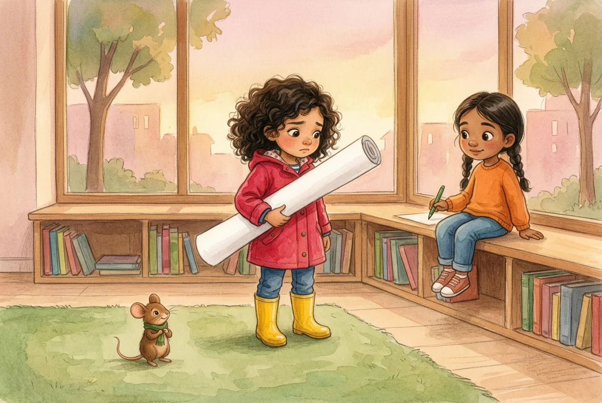
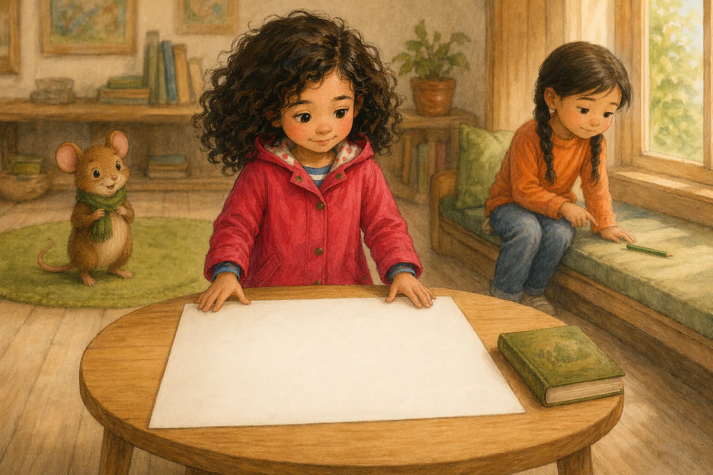
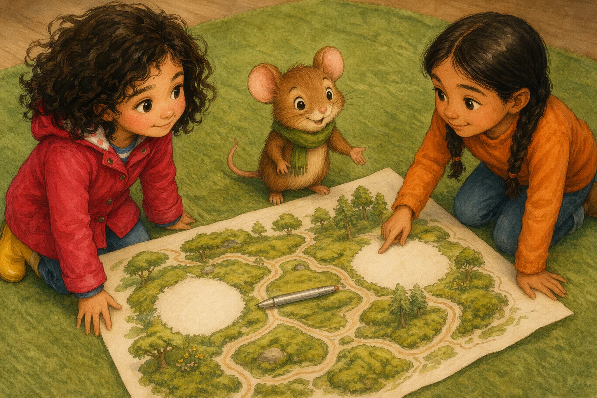
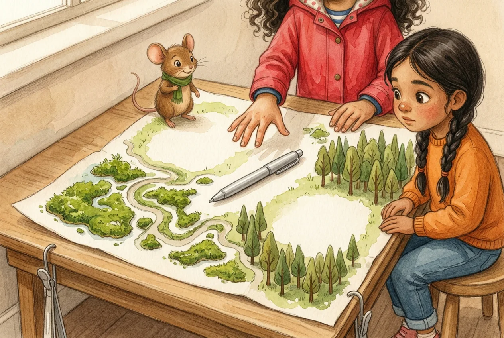
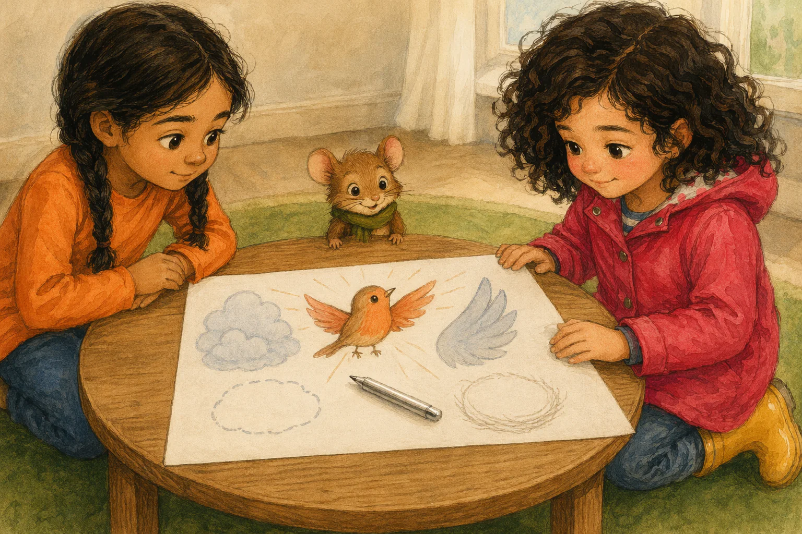
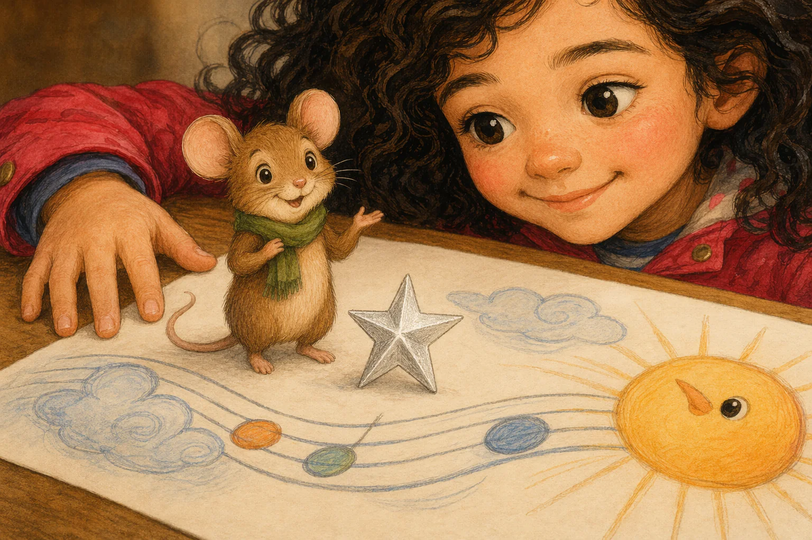
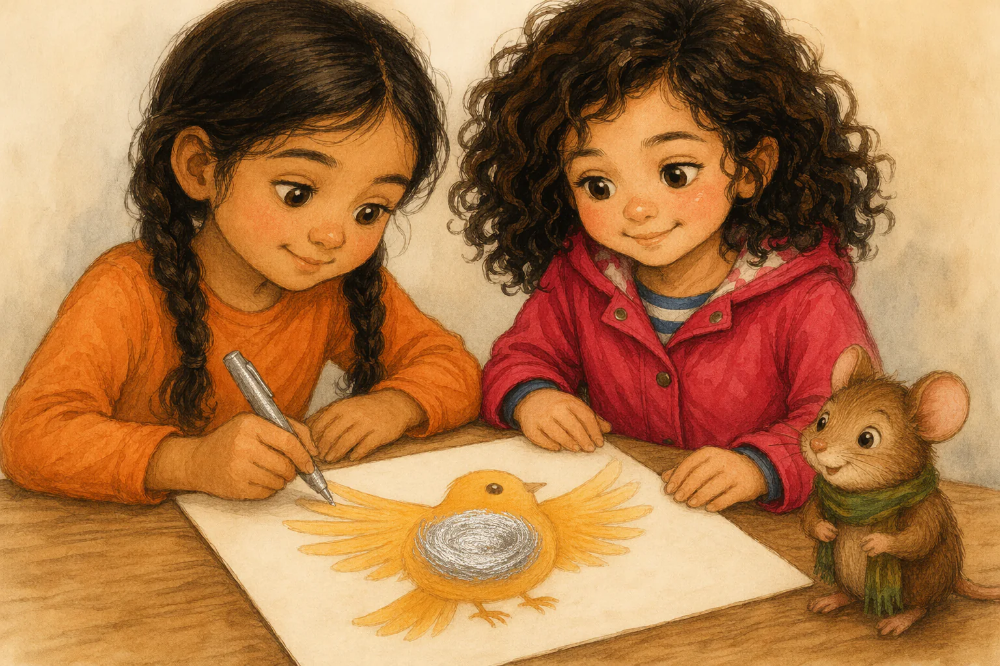
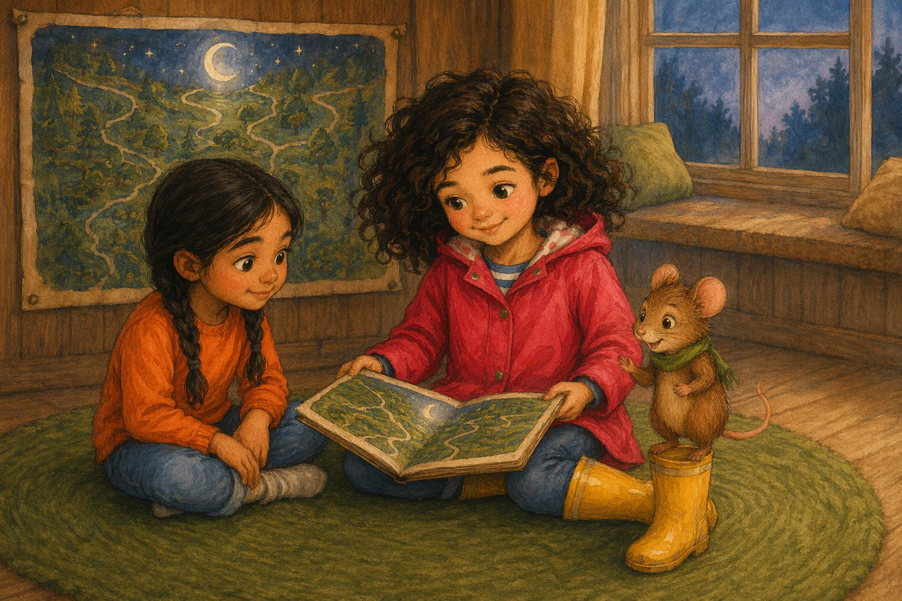
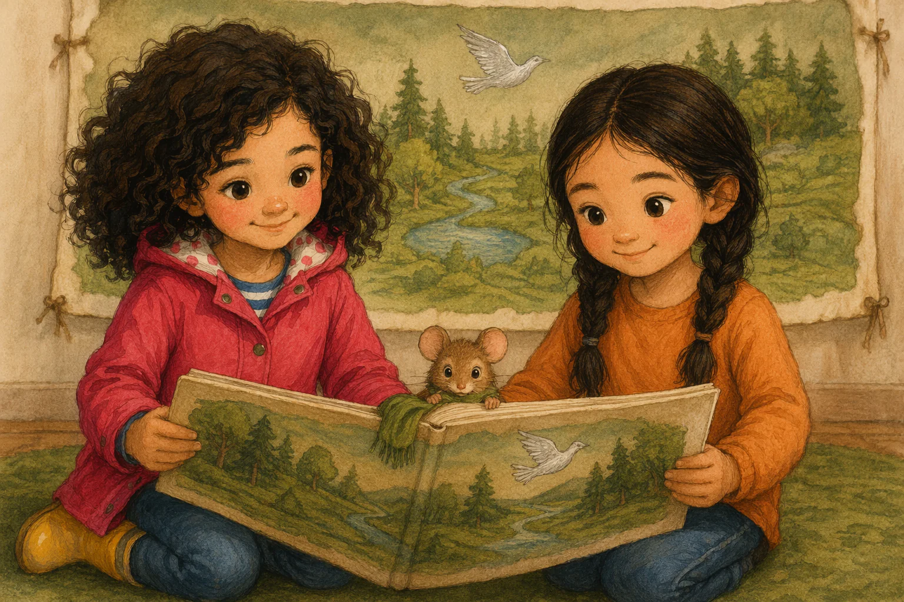
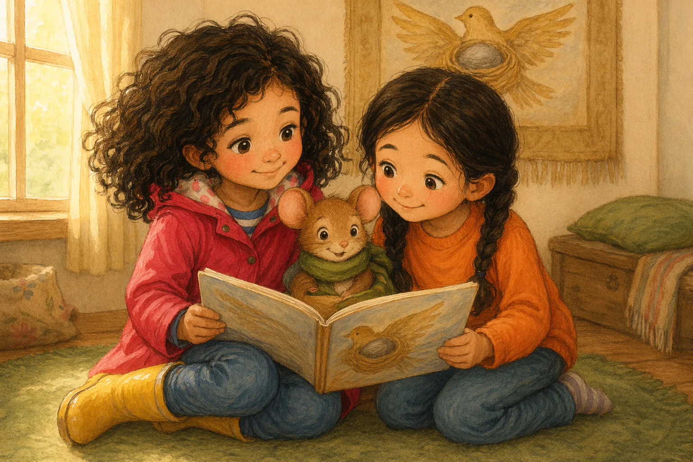

# Sample book: canon, fills, style block and every illustration brief (verbatim)

Literal generation inputs of *Iris och den sparade platsen* from [`source/sample-book.iris-och-den-sparade-platsen.json`](../../source/sample-book.iris-och-den-sparade-platsen.json): the story spec and world memory, the cast canon, the causal "fills" (need, want, ordeal, tool, elixir, rubric), the global `styleBlock`, the cover brief and the 14 per-page `illustrationBrief`s. Everything inside code blocks is copied byte-for-byte (JSON re-serialised with indentation). Notes outside code blocks are the library author's.

## Contents

- [Spec and world memory](#spec-and-world-memory)
- [Canon (cast, place, objects)](#canon-cast-place-objects)
- [Fills (story engine slots)](#fills-story-engine-slots)
- [Style block](#style-block)
- [Cover brief](#cover-brief)
- [Illustration briefs per page](#illustration-briefs-per-page)
- [Assets and providers](#assets-and-providers)

## Spec and world memory

```json
{
 "storyId": "causal-e2e-DC-KERNEL-SV-18-MEDIA",
 "createdAt": "2026-07-12T16:40:44.936Z",
 "engineVersion": "causal-foundry-v1",
 "spec": {
  "child": {
   "firstName": "Iris",
   "ageBand": "B",
   "gender": "girl"
  },
  "language": "sv",
  "companion": "Mossa, en talande skogsmus",
  "setting": "kvartersbiblioteket",
  "domainId": "sel.self-regulation",
  "register": "wonder",
  "world": {
   "child": {
    "firstName": "Iris"
   },
   "keepsakes": [],
   "skills": [
    {
     "what": "gör plats utan att sudda ut sin egen idé",
     "domainId": "sel.self-regulation",
     "fromStory": "memory-shared-page-001",
     "storyTitle": "Den tomma sidan"
    }
   ],
   "shelf": [
    {
     "storyId": "memory-shared-page-001",
     "title": "Den tomma sidan",
     "throughline": "Iris upptäckte att plats för någon annan också kan förändra hennes egen bild.",
     "language": "sv",
     "band": "B",
     "domainId": "sel.self-regulation"
    }
   ],
   "embers": [],
   "places": [
    {
     "id": "neighborhood-library",
     "name": "kvartersbiblioteket",
     "look": "låga bokhyllor, en bred fönsterbänk och en mjuk grön matta",
     "fromStory": "memory-shared-page-001",
     "storyTitle": "Den tomma sidan"
    }
   ],
   "friends": [
    {
     "name": "Mossa",
     "kind": "talande skogsmus",
     "look": "liten brun skogsmus med grön halsduk och runda öron",
     "mannerism": "snurrar halsduken ett varv när han tänker"
    }
   ],
   "cast": [],
   "readJourneys": {},
   "hero": {
    "name": "Iris",
    "kind": "barnhjälte",
    "look": "sjuårig flicka med mörka lockar, hallonröd regnjacka och gula stövlar",
    "mannerism": "lämnar alltid lite plats på sidan när hon ritar med någon annan"
   }
  },
  "premiseAnchor": "Iris hade sparat fönsterplatsen åt Mossa, men ett nytt barn hann sätta sig där först.",
  "textEngine": "causal-foundry-v1",
  "companionMode": "locked"
 },
 "pii": [
  "spec.child.firstName",
  "spec.companion",
  "canon.hero.name",
  "canon.companion.name",
  "canon.others.0.name"
 ],
 "title": "Iris och den sparade platsen",
 "language": "sv",
 "band": "B",
 "throughline": "Iris vill dela sin sista ritstund före sagostunden, men fönsterplatsen hon sparat åt Mossa är tagen; nu måste hon välja var hon ritar och vem som får bildens sista silvertecken.",
 "entryBeat": "S1",
 "validation": {
  "passed": true,
  "hardFindings": [],
  "softFindings": [],
  "judgeNotes": []
 },
 "narratorPersona": "grandpa"
}
```

## Canon (cast, place, objects)

```json
{
 "hero": {
  "name": "Iris",
  "kind": "barnhjälte",
  "look": "sjuårig flicka med mörka lockar, hallonröd regnjacka och gula stövlar",
  "mannerism": "lämnar alltid lite plats på sidan när hon ritar med någon annan"
 },
 "companion": {
  "name": "Mossa",
  "kind": "talande skogsmus",
  "look": "liten brun skogsmus med grön halsduk och runda öron",
  "mannerism": "snurrar halsduken ett varv när han tänker"
 },
 "others": [
  {
   "name": "Amina",
   "kind": "barn",
   "look": "sjuårig flicka med två mörka flätor, orange tröja och blå byxor",
   "mannerism": "knackar lätt med pekfingret mot pappret när hon får en idé",
   "emberHook": "ritar gärna fåglar och letar efter nya ritkompisar",
   "gender": "girl"
  }
 ],
 "place": {
  "name": "kvartersbiblioteket",
  "look": "låga bokhyllor, en bred fönsterbänk och en mjuk grön matta"
 },
 "objects": [
  {
   "id": "stort-ritpapper",
   "name": "stort ritpapper",
   "look": "ett brett vitt ritpapper med plats för flera tecknare",
   "role": "prop",
   "states": [
    {
     "slot": 1,
     "state": "tomt under Iris arm"
    },
    {
     "slot": 3,
     "state": "förvandlat till en gemensam bild med öppna ritplatser"
    },
    {
     "slot": 5,
     "state": "färdigt och upphängt med ett enda sista silvertecken"
    }
   ]
  },
  {
   "id": "silverpenna",
   "name": "silverpenna",
   "look": "en vanlig tjock penna som lämnar blanka silverstreck",
   "role": "tool",
   "states": [
    {
     "slot": 3,
     "state": "ligger bredvid bilden med en ritningstur kvar"
    },
    {
     "slot": 5,
     "state": "har använts till bildens sista tecken"
    }
   ]
  }
 ]
}
```

## Fills (story engine slots)

```json
{
 "need": "a huge feeling will pass if you can hold steady through it",
 "want": "att bestämma vad hon ska göra när fönsterplatsen hon sparat åt Mossa är tagen och bara en ritstund återstår",
 "ordealType": "vänta och välja mellan två rättvisa önskemål när händerna vill rycka åt sig turen",
 "tool": {
  "what": "Iris vana att lämna tydlig plats för någon annans idé utan att sudda ut sin egen",
  "plantedSlot": 2
 },
 "elixir": "Iris kan göra verklig plats för andra och ändå stå kvar i sitt eget val",
 "rubric": {
  "preferred": "pause, breathe, go slow, try again gently",
  "unpreferred": "force it, rush, run away, give up"
 }
}
```

## Style block

```text
Warm watercolor and colored-pencil children's-book illustration style, soft light, rounded shapes, expressive small gestures. Absolutely no text, no letters, no numbers, no labels, no signage anywhere in the image.
```

## Cover brief

Image: [`assets/share/iris-sparade-platsen/assets/cover.webp`](../../assets/share/iris-sparade-platsen/assets/cover.webp) (1024×1536).

```text
Wordless portrait 2:3 book cover in warm evening light at kvartersbiblioteket. Iris, a seven-year-old girl with dark curls, a raspberry-red raincoat, and yellow boots, stands decisively between the broad window bench and the soft green rug, holding exactly one stort ritpapper under her arm. Mossa, a small brown forest mouse with round ears and a green scarf, points toward the rug from Iris's yellow boot. On a low table between them lies exactly one silverpenna, catching the window light. Low bookcases frame the scene; no typography.

Appearance reference for entities already named in the shot above. Never add a character, object, flower, or prop merely because it is listed here:
Hero Iris, barnhjälte: sjuårig flicka med mörka lockar, hallonröd regnjacka och gula stövlar
Companion Mossa, talande skogsmus: liten brun skogsmus med grön halsduk och runda öron
Place kvartersbiblioteket: låga bokhyllor, en bred fönsterbänk och en mjuk grön matta
Object stort ritpapper: ett brett vitt ritpapper med plats för flera tecknare
Object silverpenna: en vanlig tjock penna som lämnar blanka silverstreck

Style: Warm watercolor and colored-pencil children's-book illustration style, soft light, rounded shapes, expressive small gestures. Absolutely no text, no letters, no numbers, no labels, no signage anywhere in the image.
```

## Illustration briefs per page

Every brief has the same three-part shape: (1) a shot description in English that names the framing first ("Wide establishing frame", "Pre-choice", "Settled result", "Final … return image"); (2) an "Appearance reference" block listing only the entities in the shot, with their Swedish canon `look` strings; (3) the global style block. Swedish nouns from the canon (*stort ritpapper*, *silverpenna*, *mosskarta*, *solfågelbild*, *sagobok*, *sagostunden*) stay untranslated inside the English prompt.

### S1 (slot 1)



```text
Wide establishing frame in kvartersbiblioteket. Iris stands between the broad window bench and the green rug, gripping the empty stort ritpapper under her arm, her face caught between disappointment and thought. Amina sits at the window bench with her green pen poised, while Mossa waits near the edge of the rug, one paw twisting his green scarf. Low bookcases and evening window light make both possible drawing places clearly legible.

Appearance reference for entities already named in the shot above. Never add a character, object, flower, or prop merely because it is listed here:
Hero Iris, barnhjälte: sjuårig flicka med mörka lockar, hallonröd regnjacka och gula stövlar
Companion Mossa, talande skogsmus: liten brun skogsmus med grön halsduk och runda öron
Other Amina, barn: sjuårig flicka med två mörka flätor, orange tröja och blå byxor
Place kvartersbiblioteket: låga bokhyllor, en bred fönsterbänk och en mjuk grön matta
Object stort ritpapper: ett brett vitt ritpapper med plats för flera tecknare

Style: Warm watercolor and colored-pencil children's-book illustration style, soft light, rounded shapes, expressive small gestures. Absolutely no text, no letters, no numbers, no labels, no signage anywhere in the image.
```

### S2 (slot 2)



```text
Pre-choice. A balanced overhead-three-quarter frame at the low table: Iris’s fingertips hover over the blank stort ritpapper, visibly leaving broad open space on each side. Mossa waits on the green rug in the background, while Amina remains at the window bench, lightly tapping her index finger beside her green pen. The closed sagobok rests nearby, making the limited time tangible; neither drawing place has been chosen.

Appearance reference for entities already named in the shot above. Never add a character, object, flower, or prop merely because it is listed here:
Hero Iris, barnhjälte: sjuårig flicka med mörka lockar, hallonröd regnjacka och gula stövlar
Companion Mossa, talande skogsmus: liten brun skogsmus med grön halsduk och runda öron
Other Amina, barn: sjuårig flicka med två mörka flätor, orange tröja och blå byxor
Object stort ritpapper: ett brett vitt ritpapper med plats för flera tecknare

Style: Warm watercolor and colored-pencil children's-book illustration style, soft light, rounded shapes, expressive small gestures. Absolutely no text, no letters, no numbers, no labels, no signage anywhere in the image.
```

### S3A (slot 3)



```text
High three-quarter view on the green rug. Iris, Mossa, and Amina gather around the completed shared mosskarta on the stort ritpapper: green moss islands, winding paths, and trees are clearly drawn, with exactly two blank drawing spaces remaining. The silverpenna lies between the two open spaces. Iris’s hand rests at the paper’s edge, her expression attentive as Mossa and Amina look toward their separate blank places.

Appearance reference for entities already named in the shot above. Never add a character, object, flower, or prop merely because it is listed here:
Hero Iris, barnhjälte: sjuårig flicka med mörka lockar, hallonröd regnjacka och gula stövlar
Companion Mossa, talande skogsmus: liten brun skogsmus med grön halsduk och runda öron
Other Amina, barn: sjuårig flicka med två mörka flätor, orange tröja och blå byxor
Object stort ritpapper: ett brett vitt ritpapper med plats för flera tecknare
Object silverpenna: en vanlig tjock penna som lämnar blanka silverstreck

Style: Warm watercolor and colored-pencil children's-book illustration style, soft light, rounded shapes, expressive small gestures. Absolutely no text, no letters, no numbers, no labels, no signage anywhere in the image.
```

### S3B (slot 3)


```text
Intimate window-bench frame in warm evening light. The stort ritpapper shows Iris’s round sun bird, Mossa’s clouds, and Amina’s wings, with exactly two unmarked open spaces—one above the clouds and one between the wings. The silverpenna lies on the window bench. Iris and Amina sit shoulder to shoulder behind the picture while Mossa perches at its edge, all three focused on the single pen.

Appearance reference for entities already named in the shot above. Never add a character, object, flower, or prop merely because it is listed here:
Hero Iris, barnhjälte: sjuårig flicka med mörka lockar, hallonröd regnjacka och gula stövlar
Companion Mossa, talande skogsmus: liten brun skogsmus med grön halsduk och runda öron
Other Amina, barn: sjuårig flicka med två mörka flätor, orange tröja och blå byxor
Object stort ritpapper: ett brett vitt ritpapper med plats för flera tecknare
Object silverpenna: en vanlig tjock penna som lämnar blanka silverstreck

Style: Warm watercolor and colored-pencil children's-book illustration style, soft light, rounded shapes, expressive small gestures. Absolutely no text, no letters, no numbers, no labels, no signage anywhere in the image.
```

### S4A (slot 4)



```text
Pre-choice. Tight tabletop frame at the low table by the wall. Iris holds one corner of the mosskarta flat, her other hand tense but suspended above the untouched silverpenna. Mossa stands beside the blank space above the winding paths; Amina sits beside the blank space near the trees. Both open spaces remain empty, and the librarian’s hanging clips are visible at the edge of the table, with no one touching the pen.

Appearance reference for entities already named in the shot above. Never add a character, object, flower, or prop merely because it is listed here:
Hero Iris, barnhjälte: sjuårig flicka med mörka lockar, hallonröd regnjacka och gula stövlar
Companion Mossa, talande skogsmus: liten brun skogsmus med grön halsduk och runda öron
Other Amina, barn: sjuårig flicka med två mörka flätor, orange tröja och blå byxor
Object silverpenna: en vanlig tjock penna som lämnar blanka silverstreck

Style: Warm watercolor and colored-pencil children's-book illustration style, soft light, rounded shapes, expressive small gestures. Absolutely no text, no letters, no numbers, no labels, no signage anywhere in the image.
```

### S4B (slot 4)



```text
Pre-choice tight three-quarter view of the low table. Amina in her orange top and Iris in her raspberry-red raincoat are clearly visible at opposite sides of the shared solfågelbild. Palm-sized Mossa, much smaller than Iris's hand, waits at the top edge with his green scarf. Exactly one untouched silverpenna lies in the center. Iris keeps both hands on the paper's edge; nobody has started the final silver mark.

Appearance reference for entities already named in the shot above. Never add a character, object, flower, or prop merely because it is listed here:
Hero Iris, barnhjälte: sjuårig flicka med mörka lockar, hallonröd regnjacka och gula stövlar
Companion Mossa, talande skogsmus: liten brun skogsmus med grön halsduk och runda öron
Other Amina, barn: sjuårig flicka med två mörka flätor, orange tröja och blå byxor
Object silverpenna: en vanlig tjock penna som lämnar blanka silverstreck

Style: Warm watercolor and colored-pencil children's-book illustration style, soft light, rounded shapes, expressive small gestures. Absolutely no text, no letters, no numbers, no labels, no signage anywhere in the image.
```

### S5AA (slot 5)


```text
Settled result, close view of the finished mosskarta on the low table. A bright silver moon is clearly complete above Mossa’s winding paths, while the space beside Amina’s trees remains plainly unmarked. Mossa stands proudly beside the moon with both paws near the paper; Iris holds the map steady at one corner, calm and relieved. Amina looks thoughtfully at her trees.

Appearance reference for entities already named in the shot above. Never add a character, object, flower, or prop merely because it is listed here:
Hero Iris, barnhjälte: sjuårig flicka med mörka lockar, hallonröd regnjacka och gula stövlar
Companion Mossa, talande skogsmus: liten brun skogsmus med grön halsduk och runda öron
Other Amina, barn: sjuårig flicka med två mörka flätor, orange tröja och blå byxor

Style: Warm watercolor and colored-pencil children's-book illustration style, soft light, rounded shapes, expressive small gestures. Absolutely no text, no letters, no numbers, no labels, no signage anywhere in the image.
```

### S5AB (slot 5)


```text
Settled result, close view of the finished mosskarta. A small silver bird with spread wings shines beside Amina’s trees, while the open space above Mossa’s paths remains unmarked. Amina smiles broadly, her two braids swinging; Iris’s open hand rests safely on the map’s edge instead of the pen. Mossa looks up from the paths, his green scarf softly twisted.

Appearance reference for entities already named in the shot above. Never add a character, object, flower, or prop merely because it is listed here:
Hero Iris, barnhjälte: sjuårig flicka med mörka lockar, hallonröd regnjacka och gula stövlar
Companion Mossa, talande skogsmus: liten brun skogsmus med grön halsduk och runda öron
Other Amina, barn: sjuårig flicka med två mörka flätor, orange tröja och blå byxor

Style: Warm watercolor and colored-pencil children's-book illustration style, soft light, rounded shapes, expressive small gestures. Absolutely no text, no letters, no numbers, no labels, no signage anywhere in the image.
```

### S5BA (slot 5)



```text
Settled result in a tight tabletop crop. Palm-sized Mossa, much smaller than Iris's hand, stands proudly beside a finished five-pointed silver star and his cloud drawings on the solfågelbild. Iris's red-sleeved hand steadies the paper and her smiling face enters at one edge. The round sun bird remains clearly visible on the other side of the shared picture.

Appearance reference for entities already named in the shot above. Never add a character, object, flower, or prop merely because it is listed here:
Hero Iris, barnhjälte: sjuårig flicka med mörka lockar, hallonröd regnjacka och gula stövlar
Companion Mossa, talande skogsmus: liten brun skogsmus med grön halsduk och runda öron

Style: Warm watercolor and colored-pencil children's-book illustration style, soft light, rounded shapes, expressive small gestures. Absolutely no text, no letters, no numbers, no labels, no signage anywhere in the image.
```

### S5BB (slot 5)



```text
Settled result in a tight two-child tabletop crop. Amina in her orange top is the primary figure, holding the silverpenna above one completed rounded silver nest nestled within the broad wings of the round sun bird. Iris in her raspberry-red raincoat steadies the shared paper and smiles beside her. Palm-sized Mossa with his green scarf watches from the far edge.

Appearance reference for entities already named in the shot above. Never add a character, object, flower, or prop merely because it is listed here:
Hero Iris, barnhjälte: sjuårig flicka med mörka lockar, hallonröd regnjacka och gula stövlar
Companion Mossa, talande skogsmus: liten brun skogsmus med grön halsduk och runda öron
Other Amina, barn: sjuårig flicka med två mörka flätor, orange tröja och blå byxor
Object silverpenna: en vanlig tjock penna som lämnar blanka silverstreck

Style: Warm watercolor and colored-pencil children's-book illustration style, soft light, rounded shapes, expressive small gestures. Absolutely no text, no letters, no numbers, no labels, no signage anywhere in the image.
```

### S6AA (slot 6)



```text
Final wide return image during sagostunden. Iris sits on the green rug with the sagobok open so Amina, seated in the broad space Iris left beside her, can see it too. Mossa stands on Iris’s yellow boot. Behind them, the hung mosskarta visibly glimmers with its silver moon above the paths, while the broad window bench is empty in evening light.

Appearance reference for entities already named in the shot above. Never add a character, object, flower, or prop merely because it is listed here:
Hero Iris, barnhjälte: sjuårig flicka med mörka lockar, hallonröd regnjacka och gula stövlar
Companion Mossa, talande skogsmus: liten brun skogsmus med grön halsduk och runda öron
Other Amina, barn: sjuårig flicka med två mörka flätor, orange tröja och blå byxor

Style: Warm watercolor and colored-pencil children's-book illustration style, soft light, rounded shapes, expressive small gestures. Absolutely no text, no letters, no numbers, no labels, no signage anywhere in the image.
```

### S6AB (slot 6)



```text
Final warm medium close-up on the green rug. Iris and Amina sit shoulder to shoulder, both clearly visible as they hold the open sagobok. At the book's lower edge, only Mossa's tiny mouse head and two little front paws peek over the page; his green scarf lies along the paper, making his true mouse scale unmistakable. Behind them, the hung mosskarta carries Amina's single silver bird above the trees.

Appearance reference for entities already named in the shot above. Never add a character, object, flower, or prop merely because it is listed here:
Hero Iris, barnhjälte: sjuårig flicka med mörka lockar, hallonröd regnjacka och gula stövlar
Companion Mossa, talande skogsmus: liten brun skogsmus med grön halsduk och runda öron
Other Amina, barn: sjuårig flicka med två mörka flätor, orange tröja och blå byxor

Style: Warm watercolor and colored-pencil children's-book illustration style, soft light, rounded shapes, expressive small gestures. Absolutely no text, no letters, no numbers, no labels, no signage anywhere in the image.
```

### S6BA (slot 6)


```text
Final warm window-side sagostund frame. Iris and Amina sit together on the green rug with a small opening between them, and Mossa nestles in that opening against their arms while Iris holds the sagobok open. Above them, the hung solfågelbild shows Mossa’s silver star shining over the clouds; Amina’s cupped hands form a gentle pretend nest around Mossa’s tail.

Appearance reference for entities already named in the shot above. Never add a character, object, flower, or prop merely because it is listed here:
Hero Iris, barnhjälte: sjuårig flicka med mörka lockar, hallonröd regnjacka och gula stövlar
Companion Mossa, talande skogsmus: liten brun skogsmus med grön halsduk och runda öron
Other Amina, barn: sjuårig flicka med två mörka flätor, orange tröja och blå byxor

Style: Warm watercolor and colored-pencil children's-book illustration style, soft light, rounded shapes, expressive small gestures. Absolutely no text, no letters, no numbers, no labels, no signage anywhere in the image.
```

### S6BB (slot 6)



```text
Final close return image at the edge of the green rug. Iris holds the sagobok open between herself and Amina while Mossa sits securely on Iris’s knee, green scarf wrapped around his paws. Warm window light falls across all three. Behind their heads, the hung solfågelbild visibly shows Amina’s rounded silver nest between the wings.

Appearance reference for entities already named in the shot above. Never add a character, object, flower, or prop merely because it is listed here:
Hero Iris, barnhjälte: sjuårig flicka med mörka lockar, hallonröd regnjacka och gula stövlar
Companion Mossa, talande skogsmus: liten brun skogsmus med grön halsduk och runda öron
Other Amina, barn: sjuårig flicka med två mörka flätor, orange tröja och blå byxor

Style: Warm watercolor and colored-pencil children's-book illustration style, soft light, rounded shapes, expressive small gestures. Absolutely no text, no letters, no numbers, no labels, no signage anywhere in the image.
```

## Assets and providers

```json
{
 "portraits": {
  "hero": {
   "kind": "image",
   "path": "/share/iris-sparade-platsen/assets/refs/hero.png",
   "provider": "azure-images:gpt-image-2"
  },
  "companion": {
   "kind": "image",
   "path": "/share/iris-sparade-platsen/assets/refs/companion.png",
   "provider": "azure-images:gpt-image-2"
  }
 },
 "cover": {
  "kind": "image",
  "path": "/share/iris-sparade-platsen/assets/cover.webp",
  "provider": "azure-images:gpt-image-2",
  "meta": {
   "ms": 57340
  }
 },
 "beats[].assets (S1 example)": {
  "audio": {
   "kind": "audio",
   "path": "/share/iris-sparade-platsen/assets/S1.mp3",
   "provider": "vertex-gemini-tts:gemini-3.1-flash-tts-preview:Enceladus",
   "meta": {
    "ms": 34596,
    "normalization": "ffmpeg-loudnorm:-23LUFS:-2dBTP:11LRA"
   }
  },
  "image": {
   "kind": "image",
   "path": "/share/iris-sparade-platsen/assets/S1.webp",
   "provider": "existing"
  }
 }
}
```

The portrait references (`/share/iris-sparade-platsen/assets/refs/hero.png`, `companion.png`) were not harvested; the landing uses [`assets/landing/iris/hero-portrait.webp`](../../assets/landing/iris/hero-portrait.webp) (512×768) as the painted hero.
