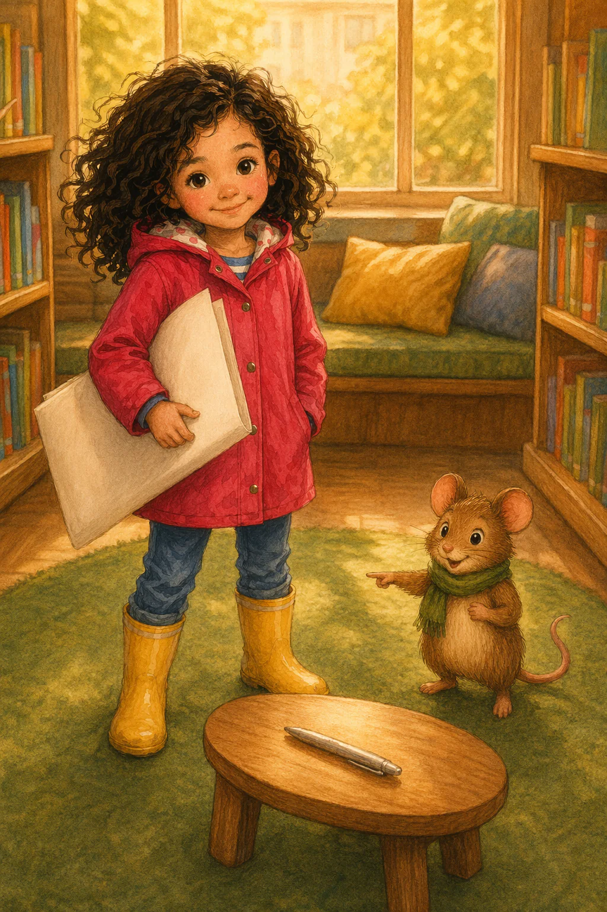

# Sample book, path BA (ending 3 of 4): "Iris och den sparade platsen"

The complete text of Tale Forge's sample book *Iris och den sparade platsen* [Iris and the Saved Place] as read along path **BA**: choice 1 = **B**, choice 2 = **A**, ending 3 of 4 on the landing endings map (the sun-bird picture; Mossa's silver star). Six pages: S1 → S2 → S3B → S4B → S5BA → S6BA. Swedish prose is verbatim from [`source/sample-book.iris-och-den-sparade-platsen.json`](../../source/sample-book.iris-och-den-sparade-platsen.json) (`beats[].prose`, `beats[].choice`). The English under each page is a translation written for this library, **not Tale Forge copy**, except the sentences marked OFFICIAL, which are Tale Forge's own English from the landing page dictionary.

## Contents

- [Path facts](#path-facts)
- [Page 1 · S1](#page-1--s1)
- [Page 2 · S2](#page-2--s2)
- [Page 3 · S3B](#page-3--s3b)
- [Page 4 · S4B](#page-4--s4b)
- [Page 5 · S5BA](#page-5--s5ba)
- [Page 6 · S6BA](#page-6--s6ba)
- [Ending state (choice effects)](#ending-state-choice-effects)

## Path facts

| Field | Value | Source |
|---|---|---|
| Beats | S1, S2, S3B, S4B, S5BA, S6BA | [`derived/story/graph.json`](../../derived/story/graph.json) |
| Words / sentences | 667 / 77 (mean 8.66 words per sentence) | [`derived/story/prose-metrics.json`](../../derived/story/prose-metrics.json) `perPath` |
| LIX readability | 27.0 (under 25 = children's books; 25–30 = easy) | same |
| Narration, shipped MP3s | 6:25 (385.7 s) for the six pages | ffprobe on `assets/share/iris-sparade-platsen/assets/<beat>.mp3` |
| Narration, JSON `audio.meta.ms` | 192.7 s (does not match the shipped files) | `beats[].assets.audio.meta.ms` |
| Narrator | `narratorPersona: "grandpa"`, TTS `vertex-gemini-tts:gemini-3.1-flash-tts-preview:Enceladus`, loudness `ffmpeg-loudnorm:-23LUFS:-2dBTP:11LRA` | top-level JSON, `beats[].assets.audio` |
| Landing medallion | [`assets/landing/iris/ending-3.webp`](../../assets/landing/iris/ending-3.webp) (256×256 centre crop of S6BA) | [`derived/story/js-excerpts/landing-explainer…pretty.js`](../../derived/story/js-excerpts/landing-explainer.3d9nxlx1n5pdy.m29416.pretty.js) |

Cover: 

## Page 1 · S1

Slot 1 · 128 words · 15 sentences · LIX 21.8 · narration 67.08 s · image [`S1.webp`](../../assets/share/iris-sparade-platsen/assets/S1.webp) · audio [`S1.mp3`](../../assets/share/iris-sparade-platsen/assets/S1.mp3)

**Svenska (verbatim)**

> Iris kom till kvartersbiblioteket med ett stort ritpapper under armen. Hon hade sparat fönsterplatsen åt Mossa. Där skulle kvällsljuset räcka över hela deras teckning. Men ett nytt barn hade hunnit sätta sig där först. Flickan hette Amina och höll en grön penna redo.
>
> "Kan vi ta en sista ritstund här i fönsterljuset?" frågade hon.
>
> Mossa kikade fram ur Iris luva och snurrade halsduken ett varv.
>
> "Det var ju platsen vi skulle ha", sa han. Sedan såg han på Amina. "Fast nu sitter du där, och jag vill inte tränga bort dig. Iris, kan vi ta vår sista ritstund på gröna mattan i stället? Där ryms en karta stor som en skog."
>
> Iris såg från den tagna fönsterplatsen till mattan. Före sagostunden fanns det bara tid för en ritstund.

**English (library translation)**

> Iris came to the neighbourhood library with a big sheet of drawing paper under her arm. She had saved the window seat for Mossa. There, the evening light would reach across their whole drawing. But a new child had got there first. The girl was called Amina and was holding a green pen at the ready.
>
> "Can we have one last drawing time here in the window light?" she asked.
>
> Mossa peeked out of Iris's hood and twirled his scarf once round.
>
> "That was supposed to be our place," he said. Then he looked at Amina. "But you're sitting there now, and I don't want to push you out. Iris, can we have our last drawing time on the green rug instead? There's room there for a map as big as a forest."
>
> Iris looked from the taken window seat to the rug. Before story time there was only time for one drawing session.

## Page 2 · S2

Slot 2 · 114 words · 14 sentences · LIX 22.2 · narration 67.464 s · image [`S2.webp`](../../assets/share/iris-sparade-platsen/assets/S2.webp) · audio [`S2.mp3`](../../assets/share/iris-sparade-platsen/assets/S2.mp3)

**Svenska (verbatim)**

> Iris gick in mellan fönsterbänken och mattan och lade ritpappret på ett lågt bord. Planen för den sparade platsen gällde inte längre. Nu väntade Mossa på mattan, medan Amina ville rita med Iris i fönsterljuset.
>
> När Iris ritade med någon annan brukade hon börja på ena sidan. Då blev det en riktig plats kvar för den andras idé, inte bara en smal kant. Hon drog fingertoppen genom luften över pappret. Här kunde hennes bild vara. Där kunde någon annans ta vid.
>
> "Kom nu", sa Mossa. "Jag har ju tre krokiga stigar i huvudet."
>
> Amina knackade på fönsterbänken. "Ljuset är fint just här."
>
> Sagoboken låg redan framme. När ritstunden var slut skulle bibliotekarien öppna den.

**English (library translation)**

> Iris stepped between the windowsill and the rug and placed the drawing paper on a low table. The plan for the saved place no longer applied. *(these two sentences: OFFICIAL, `en.steps.read.prose`)* Now Mossa was waiting on the rug, while Amina wanted to draw with Iris in the window light.
>
> When Iris drew with someone else, she usually started on one side. That way a real space was left for the other person's idea, not just a thin edge. She drew her fingertip through the air above the paper. Her picture could go here. Someone else's could take over there.
>
> "Come on," said Mossa. "I've got three winding paths in my head, you know."
>
> Amina tapped on the windowsill. "The light is nice just here."
>
> The storybook was already out. When drawing time was over, the librarian would open it.

### Choice after page 2 (`kind: "path"`, `afterSlot: 2`)

> **Det hettade i Iris händer; de ville rycka i stolen. Före sagostunden hinner hon bara rita på ett ställe. Vad gör hon?**

[Iris's hands felt hot; they wanted to tug at the chair. Before story time she only has time to draw in one place. What does she do?]

| Option | Swedish label (verbatim) | English | Leads to | On this path |
|---|---|---|---|---|
| A | Gå med Mossa till den gröna mattan. | Go with Mossa to the green rug. (OFFICIAL) | S3A | not taken |
| B | Stanna och rita med det nya barnet i fönsterljuset. | Stay and draw with the new child in the window light. (OFFICIAL) | S3B | **chosen** |

## Page 3 · S3B

Slot 3 · 106 words · 12 sentences · LIX 28.6 · narration 66.12 s · image [`S3B.webp`](../../assets/share/iris-sparade-platsen/assets/S3B.webp) · audio [`S3B.mp3`](../../assets/share/iris-sparade-platsen/assets/S3B.mp3)

**Svenska (verbatim)**

> Iris stannade och ritade med Amina i fönsterljuset. Hon lyfte upp ritpappret på fönsterbänken och satte sig bredvid. Mossa kom efter, men den sista ritstunden på gröna mattan var förbi.
>
> "Jaha", sa han och snurrade halsduken. "Då får väl molnen flyga hit."
>
> Iris ritade en rund solfågel på ena sidan och lämnade öppna platser runt den. Mossa ritade molnen. Han ville använda bibliotekets sista tur med silverpennan till en stjärna. Amina ritade solfågelns vingar och ville använda samma sista tur till ett bo.
>
> Bibliotekarien lade silverpennan på fönsterbänken och höll upp ett finger. Efter nästa tecken skulle bilden hängas upp. Bara en idé kunde bli silverblank.

**English (library translation)**

> Iris stayed and drew with Amina in the window light. She lifted the drawing paper up onto the windowsill and sat down beside her. Mossa came after them, but the last drawing time on the green rug was over.
>
> "Oh well," he said, twirling his scarf. "Then the clouds will just have to fly over here."
>
> Iris drew a round sun bird on one side and left open spaces around it. Mossa drew the clouds. He wanted to use the library's last turn with the silver pen for a star. Amina drew the sun bird's wings and wanted to use the same last turn for a nest.
>
> The librarian laid the silver pen on the windowsill and held up one finger. After the next mark, the picture would be hung up. Only one idea could turn shiny silver.

## Page 4 · S4B

Slot 4 · 102 words · 12 sentences · LIX 29.1 · narration 57.264 s · image [`S4B.webp`](../../assets/share/iris-sparade-platsen/assets/S4B.webp) · audio [`S4B.mp3`](../../assets/share/iris-sparade-platsen/assets/S4B.mp3)

**Svenska (verbatim)**

> Bibliotekarien bar solfågelbilden till det låga bordet vid väggen. Iris höll pappret stilla. Mossa stod vid den öppna platsen ovanför molnen. Amina satt vid den öppna platsen mellan vingarna. Silverpennan låg mitt emellan dem.
>
> "Min stjärna skulle lysa över molnen", sa Mossa.
>
> "Mitt bo skulle höra ihop med vingarna", sa Amina.
>
> Båda tecknen skulle ta en hel tur. Bibliotekarien väntade med klämmorna och skulle hänga upp bilden direkt efter nästa tecken. Iris hade lämnat plats för båda idéerna, men silverpennan räckte bara till en. Det hettade i händerna. De ville gripa pennan och fara över pappret fortare än någon hann säga stopp.

**English (library translation)**

> The librarian carried the sun-bird picture to the low table by the wall. Iris held the paper still. Mossa stood by the open space above the clouds. Amina sat by the open space between the wings. The silver pen lay right between them.
>
> "My star would shine over the clouds," said Mossa.
>
> "My nest would belong with the wings," said Amina.
>
> Each mark would take a whole turn. The librarian waited with the clips and would hang the picture up straight after the next mark. Iris had left room for both ideas, but the silver pen was only enough for one. Her hands felt hot. They wanted to grab the pen and race across the paper faster than anyone could say stop.

### Choice after page 4 (`kind: "ordeal"`, `afterSlot: 4`)

> **Solfågelbilden ska hängas upp, och bara en tur med silverpennan återstår. Vem får rita bildens sista tecken?**

[The sun-bird picture is to be hung up, and only one turn with the silver pen is left. Who gets to draw the picture's last mark?]

| Option | Swedish label (verbatim) | English | Leads to | On this path |
|---|---|---|---|---|
| A | Låt Mossa rita stjärnan. | Let Mossa draw the star. | S5BA | **chosen** |
| B | Låt det nya barnet rita boet. | Let the new child draw the nest. | S5BB | not taken |

## Page 5 · S5BA

Slot 5 · 114 words · 12 sentences · LIX 32.3 · narration 69.192 s · image [`S5BA.webp`](../../assets/share/iris-sparade-platsen/assets/S5BA.webp) · audio [`S5BA.mp3`](../../assets/share/iris-sparade-platsen/assets/S5BA.mp3)

**Svenska (verbatim)**

> Iris lät Mossa rita stjärnan. Hon vände pappret en aning på det låga bordet så att platsen ovanför molnen låg framför honom. Sedan rullade hon silverpennan över bordet till hans tassar.
>
> Mossa satte ena foten på pennan och styrde med hela kroppen. Först kom ett streck, sedan fem spetsar. Iris höll kvar sin solfågel på ena sidan och lämnade Aminas vingar fria på den andra.
>
> Amina följde den tomma platsen mellan vingarna med blicken. Där blev inget silverbo.
>
> När Mossa ritade sista spetsen, glimmade stjärnan och hoppade till på pappret. Mossa tappade nästan halsduken av förvåning. Iris skrattade till. Hon hade valt utan att knuffa sig före, och stjärnan lyste över deras gemensamma bild.

**English (library translation)**

> Iris let Mossa draw the star. She turned the paper a little on the low table so that the space above the clouds lay in front of him. Then she rolled the silver pen across the table to his paws.
>
> Mossa put one foot on the pen and steered with his whole body. First came a line, then five points. Iris kept her sun bird on one side and left Amina's wings free on the other.
>
> Amina's eyes followed the empty space between the wings. There would be no silver nest there.
>
> When Mossa drew the last point, the star glimmered and gave a little jump on the paper. Mossa nearly dropped his scarf in surprise. Iris laughed out loud. She had chosen without pushing ahead, and the star shone over their shared picture.

## Page 6 · S6BA

Slot 6 · 103 words · 12 sentences · LIX 29.0 · narration 58.56 s · image [`S6BA.webp`](../../assets/share/iris-sparade-platsen/assets/S6BA.webp) · audio [`S6BA.mp3`](../../assets/share/iris-sparade-platsen/assets/S6BA.mp3)

**Svenska (verbatim)**

> Bibliotekarien hängde upp solfågelbilden, och sagostunden började. Iris och Amina hade fått sin sista ritstund i fönsterljuset. Mossa hade inte fått rita med Iris på gröna mattan. Över molnen lyste hans silverstjärna. Mellan Aminas vingar fanns inget silverbo.
>
> Iris gick först till sagomattan. Hon valde en plats nära fönstret och lämnade en liten öppning mellan sig och Amina. Mossa tassade in i den och lutade ryggen mot deras armar.
>
> "Här syns stjärnan ju bäst", sa han.
>
> Amina kupade händerna som ett låtsasbo åt hans svans. Iris log och höll sagoboken öppen. Ovanför dem hoppade silverstjärnan till, precis som när Mossa ritade sista spetsen.

**English (library translation)**

> The librarian hung up the sun-bird picture, and story time began. Iris and Amina had had their last drawing time in the window light. Mossa had not got to draw with Iris on the green rug. Over the clouds his silver star shone. Between Amina's wings there was no silver nest.
>
> Iris went first to the story rug. She chose a spot near the window and left a little opening between herself and Amina. Mossa padded into it and leaned his back against their arms.
>
> "This is where the star shows best," he said.
>
> Amina cupped her hands like a pretend nest for his tail. Iris smiled and held the storybook open. Above them the silver star gave a little jump, just like when Mossa drew the last point.

## Ending state (choice effects)

Each option writes `effects.set` keys into the story state. The values set on this path, verbatim:

| Key | Value |
|---|---|
| `consequence.S2.gain` | en sista ritstund med det nya barnet i fönsterljuset |
| `consequence.S2.cost` | en sista ritstund med Mossa på den gröna mattan |
| `history.choice.S2` | S2:B |
| `consequence.S4B.gain` | Mossas stjärna får bli solfågelbildens sista silvertecken |
| `consequence.S4B.cost` | det nya barnets bo får bli solfågelbildens sista silvertecken |
| `history.choice.S4B` | S4B:A |

Read: every ending names what was gained **and** what was given up ("gain"/"cost"), and the closing page restates the loss plainly before the story-time image. See [`analysis/12-story-and-content-model.md`](../../analysis/12-story-and-content-model.md).
