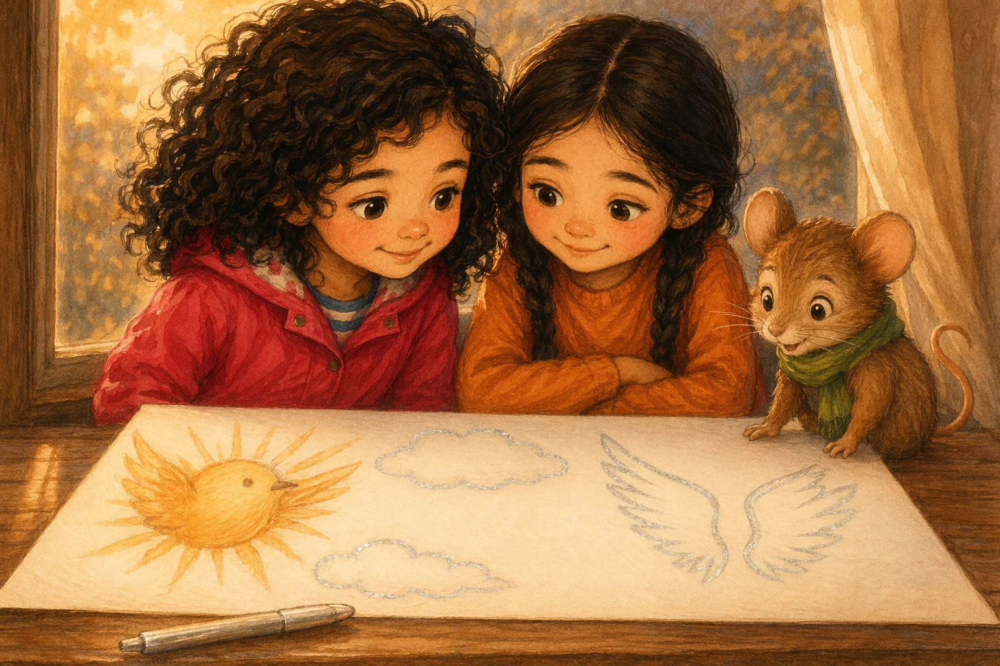

# Beat S3B — "Iris och den sparade platsen"

Verbatim prose and image prompt for beat **S3B** of the sample book, from `source/sample-book.iris-och-den-sparade-platsen.json` (`beats[3]`). Slot 3 of 6 · path: branch B (window light, with Amina) · pathTag `neutral`. Prose is Swedish (the book language); the illustration brief is English with Swedish canon descriptions embedded, exactly as the engine sent it.

| field | value |
|---|---|
| beatId / slot | `S3B` / 3 |
| reached from | `S2` |
| leads to | `S4B` |
| image | [`assets/share/iris-sparade-platsen/assets/S3B.webp`](../../assets/share/iris-sparade-platsen/assets/S3B.webp) — 1536x1024 px, provider `existing` |
| narration | [`assets/share/iris-sparade-platsen/assets/S3B.mp3`](../../assets/share/iris-sparade-platsen/assets/S3B.mp3) — 28008 ms, `vertex-gemini-tts:gemini-3.1-flash-tts-preview:Enceladus`, `ffmpeg-loudnorm:-23LUFS:-2dBTP:11LRA` |



## Prose (verbatim, Swedish)

> Iris stannade och ritade med Amina i fönsterljuset. Hon lyfte upp ritpappret på fönsterbänken och satte sig bredvid. Mossa kom efter, men den sista ritstunden på gröna mattan var förbi.
>
> "Jaha", sa han och snurrade halsduken. "Då får väl molnen flyga hit."
>
> Iris ritade en rund solfågel på ena sidan och lämnade öppna platser runt den. Mossa ritade molnen. Han ville använda bibliotekets sista tur med silverpennan till en stjärna. Amina ritade solfågelns vingar och ville använda samma sista tur till ett bo.
>
> Bibliotekarien lade silverpennan på fönsterbänken och höll upp ett finger. Efter nästa tecken skulle bilden hängas upp. Bara en idé kunde bli silverblank.

English gloss (summary, not a translation): [At the window bench Iris draws a round sun bird, Mossa the clouds, Amina the wings. Mossa wants the last silver turn for a star, Amina for a nest. Only one idea can turn silver.]

## illustrationBrief (verbatim, the full image prompt)

```text
Intimate window-bench frame in warm evening light. The stort ritpapper shows Iris’s round sun bird, Mossa’s clouds, and Amina’s wings, with exactly two unmarked open spaces—one above the clouds and one between the wings. The silverpenna lies on the window bench. Iris and Amina sit shoulder to shoulder behind the picture while Mossa perches at its edge, all three focused on the single pen.

Appearance reference for entities already named in the shot above. Never add a character, object, flower, or prop merely because it is listed here:
Hero Iris, barnhjälte: sjuårig flicka med mörka lockar, hallonröd regnjacka och gula stövlar
Companion Mossa, talande skogsmus: liten brun skogsmus med grön halsduk och runda öron
Other Amina, barn: sjuårig flicka med två mörka flätor, orange tröja och blå byxor
Object stort ritpapper: ett brett vitt ritpapper med plats för flera tecknare
Object silverpenna: en vanlig tjock penna som lämnar blanka silverstreck

Style: Warm watercolor and colored-pencil children's-book illustration style, soft light, rounded shapes, expressive small gestures. Absolutely no text, no letters, no numbers, no labels, no signage anywhere in the image.
```

### Anatomy of this brief

- **Shot paragraph** (64 words, 4 sentences). Opens: "Intimate window-bench frame in warm evening light." — framing/shot type first, then blocking, then the emotional beat.
- **Appearance reference** lists 5 entities: `Hero Iris, barnhjälte`; `Companion Mossa, talande skogsmus`; `Other Amina, barn`; `Object stort ritpapper`; `Object silverpenna`.
- **Style line**: identical to [`../style-block.txt`](../style-block.txt) in every beat.
