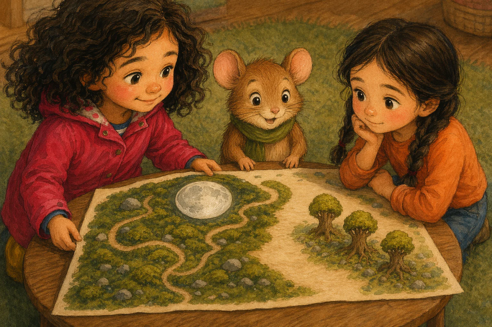

# Beat S5AA — "Iris och den sparade platsen"

Verbatim prose and image prompt for beat **S5AA** of the sample book, from `source/sample-book.iris-och-den-sparade-platsen.json` (`beats[6]`). Slot 5 of 6 · path: A then A (Mossa's moon) · pathTag `neutral`. Prose is Swedish (the book language); the illustration brief is English with Swedish canon descriptions embedded, exactly as the engine sent it.

| field | value |
|---|---|
| beatId / slot | `S5AA` / 5 |
| reached from | `S4A` |
| leads to | `S6AA` |
| image | [`assets/share/iris-sparade-platsen/assets/S5AA.webp`](../../assets/share/iris-sparade-platsen/assets/S5AA.webp) — 1536x1024 px, provider `existing` |
| narration | [`assets/share/iris-sparade-platsen/assets/S5AA.mp3`](../../assets/share/iris-sparade-platsen/assets/S5AA.mp3) — 26155 ms, `vertex-gemini-tts:gemini-3.1-flash-tts-preview:Enceladus`, `ffmpeg-loudnorm:-23LUFS:-2dBTP:11LRA` |



## Prose (verbatim, Swedish)

> Iris lät Mossa rita månen. Hon sköt silverpennan över bordet tills den låg framför tassarna och pekade på den öppna platsen ovanför stigarna.
>
> Mossa tog pennan med båda tassarna. Halsduken släpade genom mossan medan han ritade en rund måne. Iris höll kartan stilla utan att täcka träden eller platsen bredvid dem.
>
> Amina tittade på den tomma platsen där fågeln kunde ha varit. Hon knackade en gång mot bordet och drog sedan fingret längs sina träd.
>
> Mossa slöt månens ring. Silvermånen blinkade till fast ingen rörde pappret. Iris rätade på ryggen. Hon hade inte ryckt åt sig pennan. Kartan bar Mossas måne, och någon silverfågel fanns inte där.

English gloss (summary, not a translation): [Iris slides the silver pen to Mossa, who draws a round moon with both paws; the silver moon blinks. Amina looks at the empty place where her bird could have been. No silver bird.]

## illustrationBrief (verbatim, the full image prompt)

```text
Settled result, close view of the finished mosskarta on the low table. A bright silver moon is clearly complete above Mossa’s winding paths, while the space beside Amina’s trees remains plainly unmarked. Mossa stands proudly beside the moon with both paws near the paper; Iris holds the map steady at one corner, calm and relieved. Amina looks thoughtfully at her trees.

Appearance reference for entities already named in the shot above. Never add a character, object, flower, or prop merely because it is listed here:
Hero Iris, barnhjälte: sjuårig flicka med mörka lockar, hallonröd regnjacka och gula stövlar
Companion Mossa, talande skogsmus: liten brun skogsmus med grön halsduk och runda öron
Other Amina, barn: sjuårig flicka med två mörka flätor, orange tröja och blå byxor

Style: Warm watercolor and colored-pencil children's-book illustration style, soft light, rounded shapes, expressive small gestures. Absolutely no text, no letters, no numbers, no labels, no signage anywhere in the image.
```

### Anatomy of this brief

- **Shot paragraph** (61 words, 4 sentences). Opens: "Settled result, close view of the finished mosskarta on the low table." — framing/shot type first, then blocking, then the emotional beat.
- **Appearance reference** lists 3 entities: `Hero Iris, barnhjälte`; `Companion Mossa, talande skogsmus`; `Other Amina, barn`.
- **Style line**: identical to [`../style-block.txt`](../style-block.txt) in every beat.
