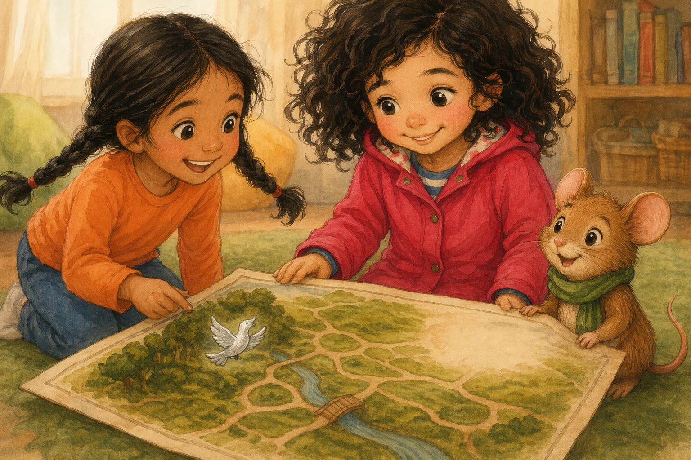

# Beat S5AB — "Iris och den sparade platsen"

Verbatim prose and image prompt for beat **S5AB** of the sample book, from `source/sample-book.iris-och-den-sparade-platsen.json` (`beats[7]`). Slot 5 of 6 · path: A then B (Amina's bird) · pathTag `neutral`. Prose is Swedish (the book language); the illustration brief is English with Swedish canon descriptions embedded, exactly as the engine sent it.

| field | value |
|---|---|
| beatId / slot | `S5AB` / 5 |
| reached from | `S4A` |
| leads to | `S6AB` |
| image | [`assets/share/iris-sparade-platsen/assets/S5AB.webp`](../../assets/share/iris-sparade-platsen/assets/S5AB.webp) — 1536x1024 px, provider `existing` |
| narration | [`assets/share/iris-sparade-platsen/assets/S5AB.mp3`](../../assets/share/iris-sparade-platsen/assets/S5AB.mp3) — 29967 ms, `vertex-gemini-tts:gemini-3.1-flash-tts-preview:Enceladus`, `ffmpeg-loudnorm:-23LUFS:-2dBTP:11LRA` |



## Prose (verbatim, Swedish)

> Iris lät Amina rita fågeln. Hon räckte fram silverpennan, men fingrarna knep kvar om mitten. Pennan rörde sig inte. Amina höll i andra änden och väntade.
>
> Mossa snurrade halsduken ett varv. Iris såg platsen bredvid träden, den som hon själv hade lämnat öppen. Hon släppte pennan och lade handflatan på kartans kant i stället.
>
> Amina ritade en liten fågel med utbredda vingar. När näbben blev klar, flaxade silvervingarna en enda gång fast pappret låg stilla.
>
> Mossa tittade upp mot platsen ovanför stigarna. Ingen silvermåne fanns där. Iris drog inte tillbaka pennan. Fågeln fick kartans sista silverstreck, och Amina log så att flätorna gungade.

English gloss (summary, not a translation): [Iris hands the pen to Amina but her fingers keep hold; she lets go and rests her palm on the map's edge. Amina draws a small bird whose silver wings flap once. No silver moon.]

## illustrationBrief (verbatim, the full image prompt)

```text
Settled result, close view of the finished mosskarta. A small silver bird with spread wings shines beside Amina’s trees, while the open space above Mossa’s paths remains unmarked. Amina smiles broadly, her two braids swinging; Iris’s open hand rests safely on the map’s edge instead of the pen. Mossa looks up from the paths, his green scarf softly twisted.

Appearance reference for entities already named in the shot above. Never add a character, object, flower, or prop merely because it is listed here:
Hero Iris, barnhjälte: sjuårig flicka med mörka lockar, hallonröd regnjacka och gula stövlar
Companion Mossa, talande skogsmus: liten brun skogsmus med grön halsduk och runda öron
Other Amina, barn: sjuårig flicka med två mörka flätor, orange tröja och blå byxor

Style: Warm watercolor and colored-pencil children's-book illustration style, soft light, rounded shapes, expressive small gestures. Absolutely no text, no letters, no numbers, no labels, no signage anywhere in the image.
```

### Anatomy of this brief

- **Shot paragraph** (59 words, 4 sentences). Opens: "Settled result, close view of the finished mosskarta." — framing/shot type first, then blocking, then the emotional beat.
- **Appearance reference** lists 3 entities: `Hero Iris, barnhjälte`; `Companion Mossa, talande skogsmus`; `Other Amina, barn`.
- **Style line**: identical to [`../style-block.txt`](../style-block.txt) in every beat.
