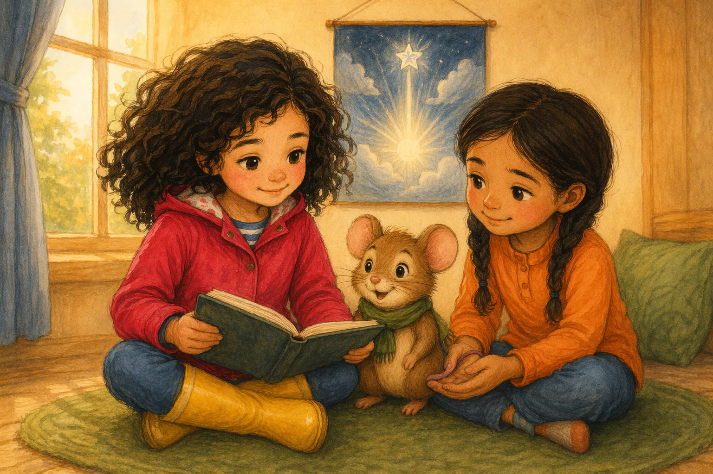

# Beat S6BA — "Iris och den sparade platsen"

Verbatim prose and image prompt for beat **S6BA** of the sample book, from `source/sample-book.iris-och-den-sparade-platsen.json` (`beats[12]`). Slot 6 of 6 · path: ending BA · pathTag `neutral`. Prose is Swedish (the book language); the illustration brief is English with Swedish canon descriptions embedded, exactly as the engine sent it.

| field | value |
|---|---|
| beatId / slot | `S6BA` / 6 |
| reached from | `S5BA` |
| leads to | — (ending) |
| image | [`assets/share/iris-sparade-platsen/assets/S6BA.webp`](../../assets/share/iris-sparade-platsen/assets/S6BA.webp) — 1536x1024 px, provider `existing` |
| narration | [`assets/share/iris-sparade-platsen/assets/S6BA.mp3`](../../assets/share/iris-sparade-platsen/assets/S6BA.mp3) — 27711 ms, `vertex-gemini-tts:gemini-3.1-flash-tts-preview:Enceladus`, `ffmpeg-loudnorm:-23LUFS:-2dBTP:11LRA` |
| reused on landing | [../../assets/landing/iris/ending-3.webp](../../assets/landing/iris/ending-3.webp) (256x256 medallion = centre square) |



## Prose (verbatim, Swedish)

> Bibliotekarien hängde upp solfågelbilden, och sagostunden började. Iris och Amina hade fått sin sista ritstund i fönsterljuset. Mossa hade inte fått rita med Iris på gröna mattan. Över molnen lyste hans silverstjärna. Mellan Aminas vingar fanns inget silverbo.
>
> Iris gick först till sagomattan. Hon valde en plats nära fönstret och lämnade en liten öppning mellan sig och Amina. Mossa tassade in i den och lutade ryggen mot deras armar.
>
> "Här syns stjärnan ju bäst", sa han.
>
> Amina kupade händerna som ett låtsasbo åt hans svans. Iris log och höll sagoboken öppen. Ovanför dem hoppade silverstjärnan till, precis som när Mossa ritade sista spetsen.

English gloss (summary, not a translation): [The sun-bird picture is hung; Mossa's silver star shines. Mossa nestles in the gap Iris left between herself and Amina; Amina cups her hands as a pretend nest for his tail.]

## illustrationBrief (verbatim, the full image prompt)

```text
Final warm window-side sagostund frame. Iris and Amina sit together on the green rug with a small opening between them, and Mossa nestles in that opening against their arms while Iris holds the sagobok open. Above them, the hung solfågelbild shows Mossa’s silver star shining over the clouds; Amina’s cupped hands form a gentle pretend nest around Mossa’s tail.

Appearance reference for entities already named in the shot above. Never add a character, object, flower, or prop merely because it is listed here:
Hero Iris, barnhjälte: sjuårig flicka med mörka lockar, hallonröd regnjacka och gula stövlar
Companion Mossa, talande skogsmus: liten brun skogsmus med grön halsduk och runda öron
Other Amina, barn: sjuårig flicka med två mörka flätor, orange tröja och blå byxor

Style: Warm watercolor and colored-pencil children's-book illustration style, soft light, rounded shapes, expressive small gestures. Absolutely no text, no letters, no numbers, no labels, no signage anywhere in the image.
```

### Anatomy of this brief

- **Shot paragraph** (59 words, 3 sentences). Opens: "Final warm window-side sagostund frame." — framing/shot type first, then blocking, then the emotional beat.
- **Appearance reference** lists 3 entities: `Hero Iris, barnhjälte`; `Companion Mossa, talande skogsmus`; `Other Amina, barn`.
- **Style line**: identical to [`../style-block.txt`](../style-block.txt) in every beat.
